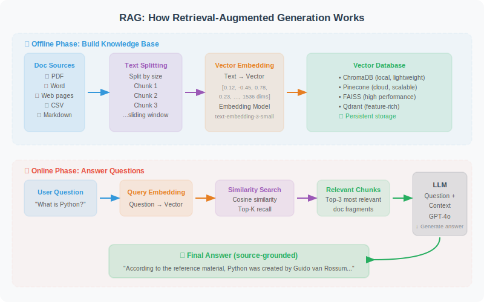
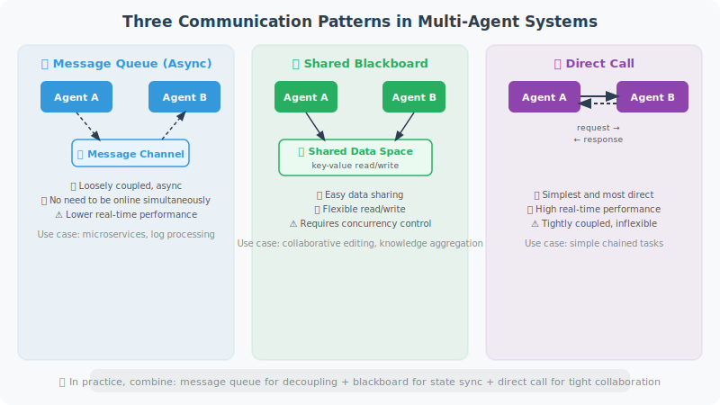

<div align="center">

# 🤖 Learn Agent Development from Scratch

**A systematic, comprehensive, and practice-oriented AI Agent development guide**

[](https://opensource.org/licenses/MIT)
[](https://github.com/Haozhe-Xing/agent_learning)
[](https://github.com/Haozhe-Xing/agent_learning/pulls)
[](https://rust-lang.github.io/mdBook/)

[📖 English](https://Haozhe-Xing.github.io/agent_learning/en/) · [📖 中文版](https://Haozhe-Xing.github.io/agent_learning/zh/) · [🐛 Report Issues](https://github.com/Haozhe-Xing/agent_learning/issues) · [💬 Discussions](https://github.com/Haozhe-Xing/agent_learning/discussions)

**[🇨🇳 中文版 README](README_ZH.md)**

</div>

---

## 📖 Read Online (Recommended)

| Language | Link |
|----------|------|
| 🇨🇳 简体中文 | **[https://Haozhe-Xing.github.io/agent_learning/zh/](https://Haozhe-Xing.github.io/agent_learning/zh/)** |
| 🇺🇸 English | **[https://Haozhe-Xing.github.io/agent_learning/en/](https://Haozhe-Xing.github.io/agent_learning/en/)** |

---

## 📌 Why This Book?

AI Agents are reshaping the boundaries of software development. From GitHub Copilot to Devin, from AutoGPT to Claude, **engineers who can build Agents are becoming the most sought-after technical talent**.

However, existing learning resources are either too fragmented or remain at a theoretical level, lacking a complete path from beginner to production.

This book has one goal: **to enable you to actually build usable AI Agent systems**.

> 📚 This book is built as an online e-book, supporting full-text search, dark mode, KaTeX math formula rendering, and can be read directly in the browser.

---

## ✨ Key Features

- 🎯 **Step by Step**: From LLM fundamentals to multi-Agent systems, each chapter has a clear knowledge progression
- 💻 **Code First**: Every core concept comes with runnable Python code examples
- 🎨 **Rich Illustrations**: 120+ hand-drawn SVG architecture diagrams / flowcharts / sequence diagrams for intuitive understanding
- 🎬 **Interactive Animations**: 5 built-in interactive HTML animations (Perceive-Think-Act cycle, ReAct reasoning, Function Calling, RAG flow, GRPO sampling)
- 🔬 **Paper Reviews**: Key chapters include frontier paper deep-dives (ReAct, Reflexion, MemGPT, GRPO, etc.)
- 🏗️ **Complete Projects**: 3 comprehensive hands-on projects (AI Coding Assistant, Intelligent Data Analysis Agent, Multimodal Agent)
- 🛡️ **Production Ready**: Covers security, evaluation, deployment, and other production essentials
- 🧪 **Cutting Edge**: Covers Context Engineering, Agentic-RL (GRPO/DPO/PPO), MCP/A2A/ANP, and other 2025–2026 latest advances
- 📐 **Formula Support**: KaTeX-rendered math formulas for clear reading of policy gradient, KL divergence derivations in RL chapters
- 🔄 **Continuously Updated**: Tracking the latest changes in LangChain, LangGraph, MCP, and other frameworks

---

## 📸 Selected Content Preview

> Below are selected showcases from the book's **120+ hand-drawn SVG illustrations**, all original to this book.

### 🧠 Agent Core Architecture

<table>
<tr>
<td width="50%" align="center">

**Perceive-Think-Act Cycle (Chapter 1)**


<sub>Agent's core mechanism: Perceive environment → LLM reasoning & decision → Execute action → Loop until goal achieved</sub>

</td>
<td width="50%" align="center">

**ReAct Reasoning Framework (Chapter 6)**


<sub>Thought → Action → Observation alternating cycle, enabling Agents to think while acting</sub>

</td>
</tr>
</table>

### 🛠️ Tool Calling & RAG

<table>
<tr>
<td width="50%" align="center">

**Function Calling Complete Flow (Chapter 4)**


<sub>Complete 6-step flow from user input to tool invocation to final response, with message structure illustration</sub>

</td>
<td width="50%" align="center">

**RAG - Retrieval Augmented Generation (Chapter 7)**



<sub>Offline indexing + Online retrieval dual-phase architecture, making LLM answers evidence-based</sub>

</td>
</tr>
</table>

### 💾 Memory System & Context Engineering

<table>
<tr>
<td width="50%" align="center">

**Three-Layer Memory Architecture (Chapter 5)**


<sub>Working memory → Short-term memory → Long-term memory, important info sinks down, semantic retrieval pulls up</sub>

</td>
<td width="50%" align="center">

**Prompt Engineering vs Context Engineering (Chapter 8)**


<sub>From "how to say" to "what to let LLM see" — the paradigm shift of the Agent era</sub>

</td>
</tr>
</table>

### 🤝 Multi-Agent & Communication Protocols

<table>
<tr>
<td width="50%" align="center">

**Three Multi-Agent Communication Patterns (Chapter 14)**



<sub>Message Queue (async decoupling) / Shared Blackboard (data sharing) / Direct Call (real-time collaboration)</sub>

</td>
<td width="50%" align="center">

**MCP / A2A / ANP Protocol Comparison (Chapter 15)**


<sub>Three-layer protocol stack: ANP for discovery → A2A for task collaboration → MCP for tool invocation</sub>

</td>
</tr>
</table>

### 🧪 Reinforcement Learning & Frameworks

<table>
<tr>
<td width="50%" align="center">

**GRPO Training Architecture (Chapter 10)**


<sub>No Critic model needed, computes advantage via intra-group normalization, memory only 1.5× model size</sub>

</td>
<td width="50%" align="center">

**LangGraph Three Core Concepts (Chapter 12)**


<sub>State (shared state) · Node (processing unit) · Edge (execution flow control)</sub>

</td>
</tr>
</table>

<div align="center">

📖 **The above is just a selected preview** — For the full 120+ architecture diagrams + 5 interactive animations, please [**read online**](https://Haozhe-Xing.github.io/agent_learning)

</div>

---

## 🎬 Interactive Animations

This book includes **5 interactive HTML animations** to help you intuitively understand the dynamic processes of core concepts:

| Animation | Chapter | Description |
|-----------|---------|-------------|
| 🔄 **Perceive-Think-Act Cycle** | Chapter 1 | Dynamic demonstration of Agent's core loop |
| 💡 **ReAct Reasoning Process** | Chapter 6 | Shows the alternating Thought → Action → Observation process |
| 🔧 **Function Calling** | Chapter 4 | Complete tool invocation flow animation |
| 📚 **RAG Retrieval Flow** | Chapter 7 | From document chunking to vector retrieval to answer generation |
| 🎯 **GRPO Sampling Process** | Chapter 10 | Visualization of intra-group multi-output sampling and reward normalization |

> 💡 Interactive animations are only available in the [online e-book](https://Haozhe-Xing.github.io/agent_learning). Local builds can also preview them.

---

## 🚀 Quick Start

### Local Build

**Install Dependencies:**

```bash
# Install mdBook (choose one)
cargo install mdbook
# Or macOS: brew install mdbook

# Install mdbook-katex plugin (for math formula rendering)
cargo install mdbook-katex

# Clone the repository
git clone https://github.com/Haozhe-Xing/agent_learning.git
cd agent_learning
```

**One-click Local Preview (Recommended):**

```bash
# Build both Chinese and English versions and start unified server (default port 3000)
./serve.sh

# Specify custom port
./serve.sh 8080

# Enable file watching, auto-rebuild on source file changes (requires fswatch or inotifywait)
./serve.sh --watch
./serve.sh 8080 --watch
```

After starting, visit:
- 🌐 **Language Selection Home**: `http://localhost:3000` (auto-redirects based on browser language)
- 🇨🇳 **Chinese Version**: `http://localhost:3000/zh/`
- 🇺🇸 **English Version**: `http://localhost:3000/en/`

> 💡 File watching dependency installation:
> ```bash
> # macOS
> brew install fswatch
>
> # Ubuntu / Debian
> sudo apt-get install inotify-tools
> ```

### Environment Setup (For Code Practice)

```bash
# Python 3.11+
python -m venv venv
source venv/bin/activate  # Windows: venv\Scripts\activate

# Install core dependencies
pip install langchain langchain-openai langgraph openai anthropic

# Configure API Key
export OPENAI_API_KEY="your-key-here"
```

---

## 🔥 Core Topics at a Glance

<table>
<tr>
<td width="50%">

**🧠 Agent Core Architecture**
- Perceive → Think → Act cycle
- ReAct reasoning framework
- Task decomposition & planning
- Reflection & self-correction

**🛠️ Tools & Skills**
- Function Calling mechanism
- Custom tool design
- Skill system construction
- Tool description best practices

**🧪 Reinforcement Learning Training**
- SFT + LoRA basic training
- PPO / DPO / GRPO algorithm deep-dive
- Complete training pipeline hands-on
- 2025–2026 latest research advances

</td>
<td width="50%">

**💾 Memory, Knowledge & Context**
- Short-term / Long-term / Working memory
- Vector databases (Chroma / FAISS)
- RAG - Retrieval Augmented Generation
- Context engineering & attention budget

**🤝 Multi-Agent Collaboration & Communication**
- MCP / A2A / ANP three-protocol stack
- Supervisor vs decentralized patterns
- CrewAI / AutoGen frameworks
- LangGraph stateful Agents

**🛡️ Production Full Pipeline**
- Evaluation benchmarks (GAIA / SWE-bench)
- Security defense & sandbox isolation
- Containerized deployment & streaming response
- Observability & cost optimization

</td>
</tr>
</table>

---

## 📊 Technology Stack


-191919?style=flat)


---

## 🤝 Contributing

All forms of contribution are welcome!

- 🐛 **Found a bug**: [Submit an Issue](https://github.com/Haozhe-Xing/agent_learning/issues)
- 💡 **Content suggestions**: [Start a Discussion](https://github.com/Haozhe-Xing/agent_learning/discussions)
- 📝 **Improve content**: Fork → Edit → Submit PR
- ⭐ **Support the project**: Give this repo a Star!

### Contributing Guide

```bash
# Fork and clone
git clone https://github.com/YOUR_USERNAME/agent_learning.git  # Replace with your username

# Create a feature branch
git checkout -b feature/improve-chapter-4

# Local preview (unified Chinese & English service)
./serve.sh

# Commit changes
git commit -m "feat: improve Chapter 4 tool calling code examples"

# Push and create PR
git push origin feature/improve-chapter-4
```

### Content Organization Conventions

- Each chapter is placed in a separate directory `src/zh/chapter_xxx/` (Chinese) or `src/en/chapter_xxx/` (English)
- Chapter overview goes in `README.md`, sections are numbered as `01_xxx.md`, `02_xxx.md`
- Chinese SVG illustrations go in `src/zh/svg/`, English versions in `src/en/svg/`, naming format: `chapter_xxx_description.svg`
- Chinese interactive animations go in `src/zh/animations/`, English versions in `src/en/animations/`

### English Translation Contributions

The English version is being continuously translated. Translation contributions are welcome!

**Steps to translate a chapter:**

1. Find the corresponding `.md` file under `src/en/` (content shows placeholder `🚧 Translation in progress`)
2. Translate the Chinese version from `src/zh/` and replace the placeholder content
3. If the chapter references SVG images, create corresponding English SVGs in `src/en/svg/` (replace Chinese text with English)
4. If the chapter references interactive animations, create corresponding English HTML in `src/en/animations/`
5. Preview locally with `./serve.sh`, visit `http://localhost:3000/en/` to check the English version
6. Submit PR with title format: `translate: Translate Chapter X - [Chapter Name]`

**Placeholder template format (English file content before translation):**

```markdown
# [Chapter Title]

> 🚧 **Translation in progress.**
> This chapter is not yet available in English.
> Please check back later, or switch to the [Chinese version](../../zh/...) for the full content.
```

---

## 📄 License

This project is open-sourced under the [MIT License](LICENSE).

---

## ⭐ Star History

If this project helps you, please give it a Star ⭐ — it's the greatest encouragement for the author!

---

<div align="center">

**Built with ❤️, so that every developer can master AI Agent development**

[⬆ Back to Top](#-learn-agent-development-from-scratch)

</div>
