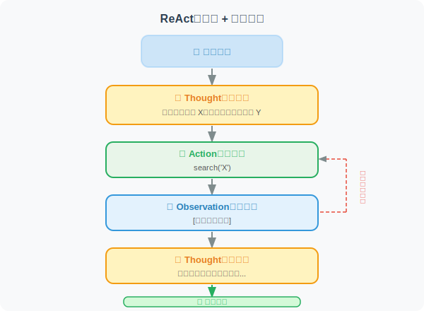
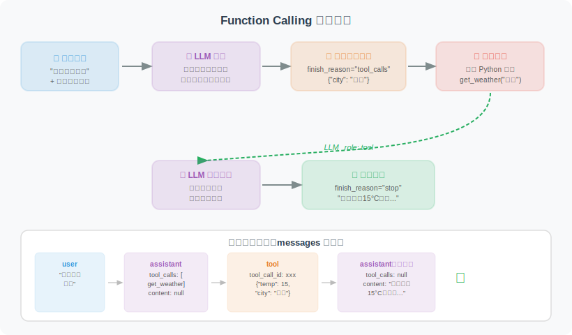
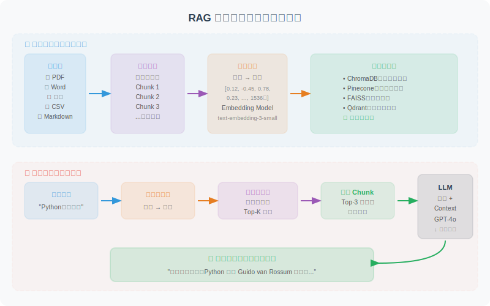
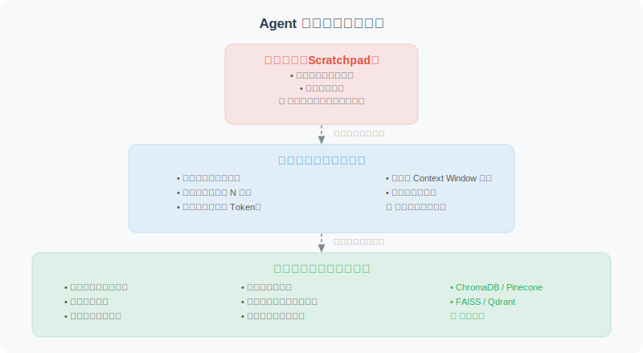
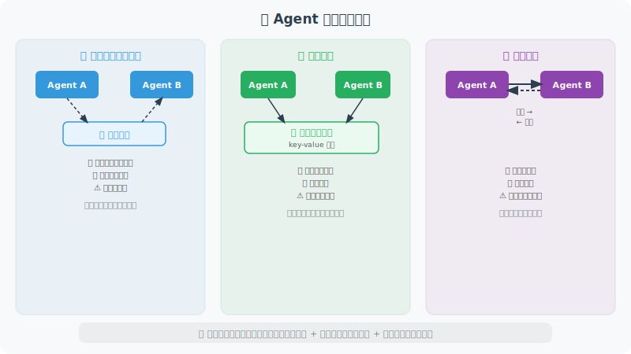
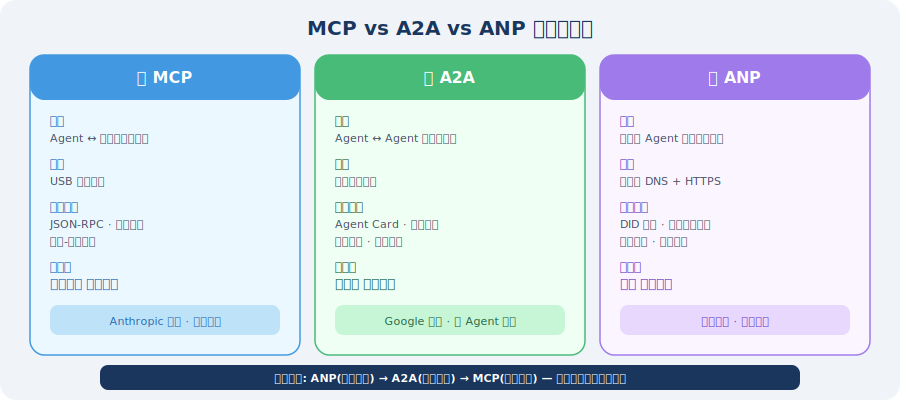

<div align="center">

# 🤖 从零开始学 Agent

**一本系统、全面、实战导向的 AI Agent 开发教程**

[](https://opensource.org/licenses/MIT)
[](https://github.com/Haozhe-Xing/agent_learning)
[](https://github.com/Haozhe-Xing/agent_learning/pulls)
[](https://rust-lang.github.io/mdBook/)

[📖 中文版](https://Haozhe-Xing.github.io/agent_learning/zh/) · [📖 English](https://Haozhe-Xing.github.io/agent_learning/en/) · [🐛 提交问题](https://github.com/Haozhe-Xing/agent_learning/issues) · [💬 参与讨论](https://github.com/Haozhe-Xing/agent_learning/discussions)

**[🇺🇸 English README](README.md)**

</div>

---

## 📖 在线阅读（推荐）

| 语言 | 链接 |
|------|------|
| 🇨🇳 简体中文 | **[https://Haozhe-Xing.github.io/agent_learning/zh/](https://Haozhe-Xing.github.io/agent_learning/zh/)** |
| 🇺🇸 English | **[https://Haozhe-Xing.github.io/agent_learning/en/](https://Haozhe-Xing.github.io/agent_learning/en/)** |

---

## 📌 为什么写这本书？

AI Agent 正在重塑软件开发的边界。从 GitHub Copilot 到 Devin，从 AutoGPT 到 Claude，**会构建 Agent 的工程师正在成为最稀缺的技术人才**。

然而，现有的学习资源要么过于零散，要么停留在理论层面，缺乏一条从入门到生产的完整路径。

这本书的目标只有一个：**让你真正能构建出可用的 AI Agent 系统**。

> 📚 本书已构建为在线电子书，支持全文搜索、暗色模式、KaTeX 数学公式渲染，可直接在浏览器中阅读。

---

## ✨ 本书特色

- 🎯 **循序渐进**：从 LLM 基础到多 Agent 系统，每章都有清晰的知识脉络
- 💻 **代码优先**：每个核心概念都配有可运行的 Python 代码示例
- 🎨 **图文并茂**：120+ 手绘 SVG 架构图 / 流程图 / 时序图，直观理解复杂概念
- 🎬 **交互动画**：内置 5 个交互式 HTML 动画（感知-思考-行动循环、ReAct 推理、Function Calling、RAG 流程、GRPO 采样）
- 🔬 **论文解读**：关键章节附有前沿论文精读（ReAct、Reflexion、MemGPT、GRPO 等），帮你跟上学术最新进展
- 🏗️ **完整项目**：3 个综合实战项目（AI 编程助手、智能数据分析 Agent、多模态 Agent）
- 🛡️ **生产就绪**：涵盖安全、评估、部署等生产环境必备知识
- 🧪 **前沿技术**：涵盖上下文工程、Agentic-RL（GRPO/DPO/PPO）、MCP/A2A/ANP 等 2025—2026 最新进展
- 📐 **公式支持**：使用 KaTeX 渲染数学公式，强化学习章节可清晰阅读策略梯度、KL 散度等公式推导
- 🔄 **持续更新**：跟踪 LangChain、LangGraph、MCP 等框架的最新变化

---

## 📸 内容精选预览

> 以下是本书 **120+ 手绘 SVG 插图**中的精选展示，所有图示均为本书原创。

### 🧠 Agent 核心架构

<table>
<tr>
<td width="50%" align="center">

**感知-思考-行动循环（第 1 章）**


<sub>Agent 的核心运行机制：感知环境 → LLM 推理决策 → 执行行动 → 循环直到目标达成</sub>

</td>
<td width="50%" align="center">

**ReAct 推理框架（第 6 章）**



<sub>Thought → Action → Observation 交替循环，让 Agent 边思考边行动</sub>

</td>
</tr>
</table>

### 🛠️ 工具调用与 RAG

<table>
<tr>
<td width="50%" align="center">

**Function Calling 完整流程（第 4 章）**



<sub>从用户输入到工具调用再到最终回复的 6 步完整流程，附消息结构示意</sub>

</td>
<td width="50%" align="center">

**RAG 检索增强生成（第 7 章）**



<sub>离线建库 + 在线检索双阶段架构，让 LLM 回答有据可查</sub>

</td>
</tr>
</table>

### 💾 记忆系统与上下文工程

<table>
<tr>
<td width="50%" align="center">

**记忆系统三层架构（第 5 章）**



<sub>工作记忆 → 短期记忆 → 长期记忆，重要信息向下沉淀、语义检索向上提取</sub>

</td>
<td width="50%" align="center">

**提示工程 vs 上下文工程（第 8 章）**


<sub>从"如何说"到"让 LLM 看到什么"——Agent 时代的范式升级</sub>

</td>
</tr>
</table>

### 🤝 多 Agent 与通信协议

<table>
<tr>
<td width="50%" align="center">

**多 Agent 三种通信模式（第 14 章）**



<sub>消息队列（异步解耦）/ 共享黑板（数据共享）/ 直接调用（实时协作）</sub>

</td>
<td width="50%" align="center">

**MCP / A2A / ANP 三协议对比（第 15 章）**



<sub>三层协议栈各司其职：ANP 组网发现 → A2A 任务协作 → MCP 工具调用</sub>

</td>
</tr>
</table>

### 🧪 强化学习与框架

<table>
<tr>
<td width="50%" align="center">

**GRPO 训练架构（第 10 章）**


<sub>无需 Critic 模型，通过组内标准化计算优势值，显存仅需 1.5× 模型大小</sub>

</td>
<td width="50%" align="center">

**LangGraph 三大核心概念（第 12 章）**


<sub>State（共享状态）· Node（处理单元）· Edge（执行流控制）</sub>

</td>
</tr>
</table>

<div align="center">

📖 **以上仅为精选预览** — 完整的 120+ 张架构图 + 5 个交互动画，请 [**在线阅读**](https://Haozhe-Xing.github.io/agent_learning) 体验

</div>

---

## 🎬 交互式动画

本书内置了 **5 个可交互的 HTML 动画**，帮助你直观理解核心概念的动态过程：

| 动画 | 对应章节 | 说明 |
|------|----------|------|
| 🔄 **感知-思考-行动循环** | 第 1 章 | 动态演示 Agent 的核心运行循环 |
| 💡 **ReAct 推理过程** | 第 6 章 | 展示 Thought → Action → Observation 的交替过程 |
| 🔧 **Function Calling** | 第 4 章 | 工具调用的完整流程动画 |
| 📚 **RAG 检索流程** | 第 7 章 | 从文档切分到向量检索再到生成回答 |
| 🎯 **GRPO 采样过程** | 第 10 章 | 组内多输出采样与奖励标准化的可视化 |

> 💡 交互动画仅在 [在线电子书](https://Haozhe-Xing.github.io/agent_learning) 中可体验，本地构建也可预览。

---

## 🚀 快速开始

### 本地构建

**依赖安装：**

```bash
# 安装 mdBook（二选一）
cargo install mdbook
# 或 macOS：brew install mdbook

# 安装 mdbook-katex 插件（用于数学公式渲染）
cargo install mdbook-katex

# 克隆仓库
git clone https://github.com/Haozhe-Xing/agent_learning.git
cd agent_learning
```

**一键启动本地预览（推荐）：**

```bash
# 构建中英文版本并启动统一服务（默认端口 3000）
./serve.sh

# 指定自定义端口
./serve.sh 8080

# 启用文件监听，源文件变更时自动重建（需要 fswatch 或 inotifywait）
./serve.sh --watch
./serve.sh 8080 --watch
```

启动后访问：
- 🌐 **语言选择首页**：`http://localhost:3000`（自动根据浏览器语言跳转）
- 🇨🇳 **中文版**：`http://localhost:3000/zh/`
- 🇺🇸 **English**：`http://localhost:3000/en/`

> 💡 文件监听依赖安装：
> ```bash
> # macOS
> brew install fswatch
>
> # Ubuntu / Debian
> sudo apt-get install inotify-tools
> ```

### 环境准备（跟随代码实践）

```bash
# Python 3.11+
python -m venv venv
source venv/bin/activate  # Windows: venv\Scripts\activate

# 安装核心依赖
pip install langchain langchain-openai langgraph openai anthropic

# 配置 API Key
export OPENAI_API_KEY="your-key-here"
```

---

## 🔥 核心知识点速览

<table>
<tr>
<td width="50%">

**🧠 Agent 核心架构**
- 感知 → 思考 → 行动循环
- ReAct 推理框架
- 任务分解与规划
- 反思与自我纠错

**🛠️ 工具与技能**
- Function Calling 机制
- 自定义工具设计
- 技能系统构建
- 工具描述最佳实践

**🧪 强化学习训练**
- SFT + LoRA 基础训练
- PPO / DPO / GRPO 算法详解
- 完整训练 Pipeline 实战
- 2025—2026 最新研究进展

</td>
<td width="50%">

**💾 记忆、知识与上下文**
- 短期 / 长期 / 工作记忆
- 向量数据库（Chroma / FAISS）
- RAG 检索增强生成
- 上下文工程与注意力预算

**🤝 多 Agent 协作 & 通信**
- MCP / A2A / ANP 三协议栈
- Supervisor vs 去中心化模式
- CrewAI / AutoGen 框架
- LangGraph 有状态 Agent

**🛡️ 生产化全链路**
- 评估基准（GAIA / SWE-bench）
- 安全防御与沙箱隔离
- 容器化部署与流式响应
- 可观测性与成本优化

</td>
</tr>
</table>

---

## 📊 涵盖技术栈


-191919?style=flat)


---

## 🤝 参与贡献

欢迎任何形式的贡献！

- 🐛 **发现错误**：[提交 Issue](https://github.com/Haozhe-Xing/agent_learning/issues)
- 💡 **内容建议**：[发起 Discussion](https://github.com/Haozhe-Xing/agent_learning/discussions)
- 📝 **改进内容**：Fork → 修改 → 提交 PR
- ⭐ **支持项目**：给本仓库点个 Star！

### 贡献指南

```bash
# Fork 并克隆
git clone https://github.com/YOUR_USERNAME/agent_learning.git  # 替换为你的用户名

# 创建特性分支
git checkout -b feature/improve-chapter-4

# 本地预览（中英文统一服务）
./serve.sh

# 提交修改
git commit -m "feat: 改进第4章工具调用示例代码"

# 推送并创建 PR
git push origin feature/improve-chapter-4
```

### 内容组织约定

- 每章内容放在独立目录 `src/zh/chapter_xxx/`（中文）或 `src/en/chapter_xxx/`（英文）下
- 章节概述放在 `README.md`，各小节按 `01_xxx.md`、`02_xxx.md` 编号
- 中文版 SVG 插图放在 `src/zh/svg/`，英文版放在 `src/en/svg/`，命名格式 `chapter_xxx_描述.svg`
- 中文版交互动画放在 `src/zh/animations/`，英文版放在 `src/en/animations/`

### 英文版翻译贡献

英文版目前正在持续翻译中，欢迎贡献翻译！

**翻译章节步骤：**

1. 找到 `src/en/` 下对应的 `.md` 文件（内容为占位提示 `🚧 Translation in progress`）
2. 将中文版 `src/zh/` 对应章节的内容翻译为英文，替换占位内容
3. 如章节引用了 SVG 图片，在 `src/en/svg/` 下创建对应的英文版 SVG（将图中中文文字替换为英文）
4. 如章节引用了交互动画，在 `src/en/animations/` 下创建对应的英文版 HTML
5. 本地用 `./serve.sh` 预览中英文版效果，访问 `http://localhost:3000/en/` 查看英文版
6. 提交 PR，标题格式：`translate: 翻译第X章 - [章节名]`

**占位模板格式（翻译前的英文版文件内容）：**

```markdown
# [Chapter Title]

> 🚧 **Translation in progress.**
> This chapter is not yet available in English.
> Please check back later, or switch to the [Chinese version](../../zh/...) for the full content.
```

---

## 📄 许可证

本项目采用 [MIT License](LICENSE) 开源协议。

---

## ⭐ Star History

如果这个项目对你有帮助，请给个 Star ⭐，这是对作者最大的鼓励！

---

<div align="center">

**用 ❤️ 构建，为了让每个开发者都能掌握 AI Agent 开发**

[⬆ 回到顶部](#-从零开始学-agent-开发)

</div>