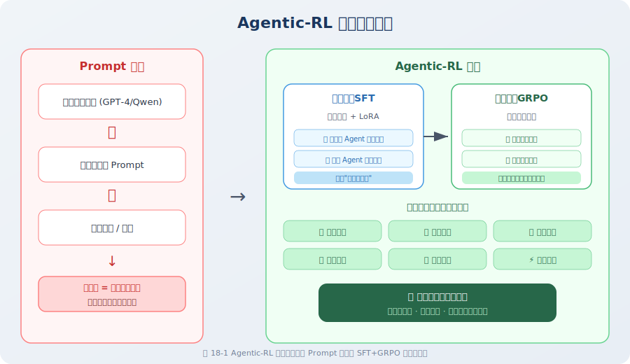

# 10.1 什么是 Agentic-RL

## 从"提示工程"到"训练优化"的范式转变

在本书前面的章节中，我们构建 Agent 的核心方法是 **Prompt Engineering + 工具调用**：精心编写系统提示词，定义工具接口，让通用大模型扮演特定角色来完成任务。这种方式开发快、门槛低，但存在一个根本性瓶颈：

> **Agent 的能力上界 = 基座模型的通用能力上界。**

无论提示词设计得多精妙，如果基座模型在某类推理上存在系统性缺陷（如多步数学推理、复杂代码修复、长程规划），Agent 的表现就无法突破这一天花板。

**Agentic-RL（Agentic Reinforcement Learning）** 提出了一个根本不同的思路：**与其在推理时通过 prompt 引导模型行为，不如在训练时通过强化学习信号让模型自主习得高质量的 Agent 策略**。这一范式的核心洞察来自 DeepSeek-R1 [3] 的实验发现——纯粹的 RL 训练可以在模型中涌现出人类未曾显式教授的推理链条。

### 两种范式的系统性对比

| 维度 | Prompt Engineering | Agentic-RL |
|------|-------------------|------------|
| **能力来源** | 基座模型预训练知识 + 提示词引导 | 基座模型 + 任务特定的 RL 优化 |
| **开发成本** | 低（工程师时间） | 高（GPU 算力 + 数据标注） |
| **任务适应性** | 通用但不精专 | 针对特定任务深度优化 |
| **推理效率** | 依赖长 prompt，Token 消耗大 | 能力内化到权重，推理更高效 |
| **可扩展性** | 受限于上下文窗口和 prompt 长度 | 可通过持续训练迭代提升 |
| **能力上界** | 受限于基座模型 | 可超越基座模型（涌现能力）|
| **适用场景** | 快速原型、通用任务、低频需求 | 高频、高价值、有明确评估标准的任务 |

### 何时应当选择 Agentic-RL？

Agentic-RL 并非万能药。以下是基于实践经验总结的决策框架：

**适合投入 Agentic-RL 的场景：**
- ✅ 任务具有**客观可验证的评估标准**（代码测试通过率、数学答案正确性、API 调用成功率）
- ✅ 任务**高频重复**，训练成本可被长期收益摊薄
- ✅ 当前基座模型在该任务上存在**系统性、可改进的缺陷**
- ✅ 具备**足够的训练数据**或可通过自动化方式生成数据

**不适合 Agentic-RL 的场景：**
- ❌ 一次性、低频的开放式任务（ROI 不足）
- ❌ 无法客观量化评估的任务（如开放式创意写作）
- ❌ 基座模型 + prompt 方式已达到可接受水平
- ❌ 缺乏 GPU 算力资源（7B 模型 GRPO 训练至少需要 1× A100 40GB）

---

## Agentic-RL 的理论基础：MDP 框架

### 马尔可夫决策过程建模

Agentic-RL 的理论基础是**马尔可夫决策过程（Markov Decision Process, MDP）** [1]。将 Agent 的任务执行过程形式化为一个有限时域 MDP：

$$\mathcal{M} = \langle \mathcal{S}, \mathcal{A}, \mathcal{T}, \mathcal{R}, \gamma \rangle$$

其中各要素在 Agent 场景中的对应关系如下：

| MDP 要素 | 形式化定义 | Agent 场景中的对应 |
|----------|-----------|-------------------|
| **状态空间** $\mathcal{S}$ | $s_t \in \mathcal{S}$ | 当前对话历史 + 工具返回结果 + 环境上下文 |
| **动作空间** $\mathcal{A}$ | $a_t \in \mathcal{A}$ | 模型的下一次 Token 序列输出（文本、工具调用、代码等）|
| **转移函数** $\mathcal{T}$ | $s_{t+1} \sim \mathcal{T}(\cdot \mid s_t, a_t)$ | 环境对动作的响应（工具执行结果、用户反馈）|
| **奖励函数** $\mathcal{R}$ | $r_t = \mathcal{R}(s_t, a_t)$ | 任务完成度评估（答案正确性、代码通过率等）|
| **策略** $\pi_\theta$ | $a_t \sim \pi_\theta(\cdot \mid s_t)$ | 模型参数 $\theta$ 决定的条件生成分布 |
| **折扣因子** $\gamma$ | $\gamma \in [0, 1]$ | 对未来奖励的折扣（通常取 1.0，即不折扣）|

**训练目标**是最大化期望累积奖励：

$$\theta^* = \arg\max_\theta \mathbb{E}_{\tau \sim \pi_\theta} \left[ \sum_{t=0}^{T} \gamma^t r_t \right]$$

逐项解读：

- $\theta^*$：最优模型参数，即我们希望通过训练找到的目标
- $\arg\max_\theta$：在所有可能的参数 $\theta$ 中，找到使目标函数最大的那个
- $\mathbb{E}_{\tau \sim \pi_\theta}[\cdot]$：**期望**运算符——由于模型生成是随机的（temperature > 0），同一问题每次生成的轨迹 $\tau$ 不同，我们优化的是所有可能轨迹上的**平均**表现，而非某一次特定生成的结果
- $\sum_{t=0}^{T} \gamma^t r_t$：**折扣累积奖励**，将轨迹中每一步的即时奖励 $r_t$ 按时间折扣 $\gamma^t$ 加权求和；$\gamma < 1$ 时，近期奖励比远期奖励权重更大（在 Agentic-RL 中通常取 $\gamma = 1.0$，即不折扣，因为我们关心任务的最终完成质量而非中间步骤的时序差异）
- $\tau = (s_0, a_0, s_1, a_1, \ldots, s_T)$：一条完整的**交互轨迹**，记录了从初始状态到终止状态的完整状态-动作序列

**直觉理解**：这个目标函数的含义是——调整模型参数 $\theta$，使得模型在面对各种任务时，平均能够获得尽可能高的累积奖励。这与人类学习的直觉一致：通过大量练习（采样轨迹），不断调整策略（更新参数），使得平均表现持续提升。

### Agent 交互循环的形式化描述



### 六大核心能力维度

经过 Agentic-RL 训练，模型可在以下六个维度获得系统性提升 [2]：

| 能力维度 | 描述 | 典型提升表现 |
|---------|------|------------|
| **指令遵循** | 准确理解并执行复杂、多约束的指令 | 格式符合率从 ~30% 提升至 ~90% |
| **工具使用** | 在正确时机调用正确工具，处理工具返回结果 | 工具调用准确率显著提升 |
| **多步推理** | 在复杂任务中维持长链条推理，减少中间步骤错误 | 数学推理准确率提升 20-30% |
| **自我纠错** | 识别执行错误并主动修正，而非继续错误路径 | 错误恢复率提升 |
| **探索策略** | 在不确定情况下合理尝试不同方案 | 首次成功率提升 |
| **效率优化** | 用更少步骤、更少 Token 完成任务 | 平均轨迹长度缩短 |

---

## 两阶段训练范式

当代主流的 Agentic-RL 训练遵循 **SFT → RL** 的两阶段范式 [3]，两个阶段各有其不可替代的作用。

### 阶段一：SFT（监督微调）—— 策略初始化

**核心目标**：将基座模型的策略分布 $\pi_0$ 调整为具备基本 Agent 行为格式的初始策略 $\pi_{SFT}$。

SFT 阶段的训练目标是最大化对数似然：

$$\mathcal{L}_{SFT}(\theta) = -\mathbb{E}_{(x, y^*) \sim \mathcal{D}_{SFT}} \left[ \log \pi_\theta(y^* \mid x) \right]$$

逐项解读：

- $-\mathbb{E}_{(x,y^*)\sim\mathcal{D}_{SFT}}$：负号 + 期望符号，表示在监督微调数据集 $\mathcal{D}_{SFT}$ 上，对所有样本 $(x, y^*)$ 取平均。
  - $x$：模型的输入（如用户指令、提示词）。
  - $y^*$：对应的**人类标注的理想输出**（即"标准答案"）。
  - $\mathcal{D}_{SFT}$：收集好的指令 - 答案对数据集。
- $\mathcal{D}_{SFT} = \{(x^{(i)}, y^{*(i)})\}_{i=1}^N$：高质量的 Agent 交互轨迹数据集，每条样本包含输入上下文 $x$（系统提示 + 用户问题）和专家示范输出 $y^*$（含推理过程和工具调用）
- $\log \pi_\theta(y^* \mid x)$：模型在给定输入 $x$ 的条件下，生成专家示范序列 $y^*$ 的**对数概率**。这个值越大（越接近 0），说明模型认为专家示范是"合理的输出"；加负号后变为损失，最小化损失即最大化对数概率
- 实际计算时，$\log \pi_\theta(y^* \mid x)$ 按**自回归分解**展开为逐 token 的对数概率之和：$\sum_{t=1}^{|y^*|} \log \pi_\theta(y^*_t \mid x, y^*_{<t})$，即每个 token 的生成概率都以前面所有 token 为条件

**直觉理解**：SFT 的本质是"模仿学习"——给模型看大量专家示范，让模型学会"在这种输入下，专家会输出什么"。这个阶段类似于"临帖练字"——先模仿正确的行为模式，建立格式规范和基本能力。

```
训练数据示例：
输入 x: "计算 1234 × 5678 的结果"
期望输出 y*:
  <think>
  这需要精确的整数乘法计算，应使用计算器工具确保精度。
  </think>
  <tool_call>calculator(expression="1234 * 5678")</tool_call>
```

### 阶段二：RL（强化学习）—— 策略优化

**核心目标**：在 $\pi_{SFT}$ 的基础上，通过奖励信号引导策略向 $\pi^*$ 逼近，突破 SFT 数据的质量上界。

RL 阶段的训练目标是最大化期望奖励，同时通过 KL 散度约束防止策略偏离过远：

$$\mathcal{L}_{RL}(\theta) = -\mathbb{E}_{\tau \sim \pi_\theta} \left[ R(\tau) \right] + \beta \cdot D_{KL}(\pi_\theta \| \pi_{SFT})$$

逐项解读：

- $-\mathbb{E}_{\tau \sim \pi_\theta}[R(\tau)]$：**策略损失项**——最大化当前策略 $\pi_\theta$ 采样到的轨迹的期望奖励。负号是将最大化转为最小化（梯度下降惯例）
- $\beta \cdot D_{KL}(\pi_\theta \| \pi_{SFT})$：**KL 散度惩罚项**——$D_{KL}$ 衡量当前策略 $\pi_\theta$ 与 SFT 初始策略 $\pi_{SFT}$ 之间的"分布距离"。当两个分布完全相同时 $D_{KL} = 0$；差异越大，$D_{KL}$ 越大。系数 $\beta$ 控制惩罚强度：$\beta$ 越大，策略越保守（不敢偏离 SFT 模型）；$\beta$ 越小，策略越激进（可能产生奖励黑客行为）。
  > 💡 **什么是 KL 散度？** 如果你对 KL 散度还不熟悉，推荐阅读本书的 [附录 E：KL 散度详解](../appendix/kl_divergence.md)，其中包含从直觉理解到数学定义的完整科普。简单来说，$D_{KL}(P \| Q)$ 回答的问题是：**"如果真实分布是 $P$，用分布 $Q$ 来近似它，平均会损失多少信息？"**
- **两项的博弈**：策略损失项鼓励模型"大胆探索"以获得更高奖励，KL 惩罚项约束模型"不要走太远"以保持语言质量。$\beta$ 是这两种力量的平衡点

SFT 只能让模型达到训练数据的水平上界。而 RL 阶段通过奖励函数告诉模型"什么是好的结果"，让模型自主探索出超越示范数据的解决路径——这正是 DeepSeek-R1 [3] 能够涌现出"自我反思"和"长链推理"能力的关键机制。

```
SFT 阶段学到：  "看到数学题 → 调用计算器"
RL 阶段学到：   "分析问题结构 → 判断是否需要分步 → 
                 选择最优工具组合 → 验证中间结果 → 
                 发现错误时主动回溯"
```

### 为什么两个阶段缺一不可？

| 对比维度 | 纯 SFT | 纯 RL（从随机初始化）| SFT → RL |
|---------|--------|---------------------|----------|
| **格式规范性** | ✅ 高 | ❌ 极低（输出混乱）| ✅ 高 |
| **能力上界** | ❌ 受限于数据质量 | ⚠️ 理论上无上界，实践中难收敛 | ✅ 可超越数据质量 |
| **训练稳定性** | ✅ 稳定 | ❌ 极不稳定，容易发散 | ✅ 较稳定 |
| **收敛速度** | 快 | 极慢 | 中等 |
| **最终性能** | 中等 | 不确定 | **最优** |

> **📌 工程实践要点**
>
> SFT 阶段的数据质量比数量更关键。LIMA [4] 的研究表明，1,000 条精心筛选的高质量数据往往优于 10,000 条噪声数据。实践建议：
> - **SFT 数据规模**：500–2,000 条经过人工验证的 Agent 交互轨迹
> - **RL 计算成本**：约为 SFT 阶段的 3–10 倍（因需要在线采样）
> - **验证策略**：先在 7B 小模型上验证训练流程的正确性，再扩展到更大模型

---

## 代表性工作与实证结果

| 项目 | 基座模型 | 训练方法 | 核心成果 |
|------|---------|---------|---------|
| **DeepSeek-R1** [3] | DeepSeek-V3 | SFT + GRPO | 数学/代码推理能力媲美 OpenAI o1 |
| **DeepSWE** [5] | DeepSeek-R1 | SFT + GRPO | SWE-bench Verified 59%（开源 SOTA）|
| **OpenAI o1** [6] | GPT-4 系列 | RL（具体方法未公开）| 数学/编程/科学推理大幅提升 |
| **Qwen-Agent** [7] | Qwen2.5 | SFT + DPO | 工具调用和多步推理能力提升 |

这些工作共同验证了 Agentic-RL 范式的有效性：**通过强化学习训练，模型可以涌现出训练数据中未曾出现的推理策略**，这是纯 SFT 方法无法实现的。

---

*在下一节中，我们将从 SFT + LoRA 开始，详细介绍第一阶段监督微调的原理与实现。*

---

## 参考文献

[1] SUTTON R S, BARTO A G. Reinforcement Learning: An Introduction[M]. 2nd ed. Cambridge: MIT Press, 2018.

[2] XI Z, CHEN W, GUO X, et al. The rise and potential of large language model based agents: A survey[R]. arXiv preprint arXiv:2309.07864, 2023.

[3] DEEPSEEK AI. DeepSeek-R1: Incentivizing reasoning capability in LLMs via reinforcement learning[R]. arXiv preprint arXiv:2501.12948, 2025.

[4] ZHOU C, LIU P, XU P, et al. LIMA: Less is more for alignment[C]//Advances in Neural Information Processing Systems (NeurIPS). 2023.

[5] DEEPSEEK AI. DeepSWE: An open agentic SWE model that matches the performance of closed-source models[R]. 2025.

[6] OPENAI. Learning to reason with LLMs[EB/OL]. 2024. https://openai.com/index/learning-to-reason-with-llms.

[7] YANG A, YANG B, HUI B, et al. Qwen2.5 technical report[R]. arXiv preprint arXiv:2412.15115, 2024.
