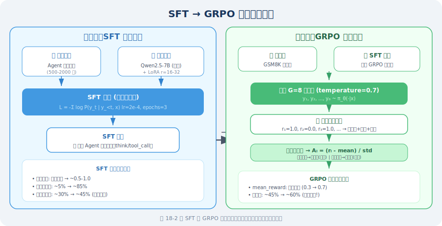
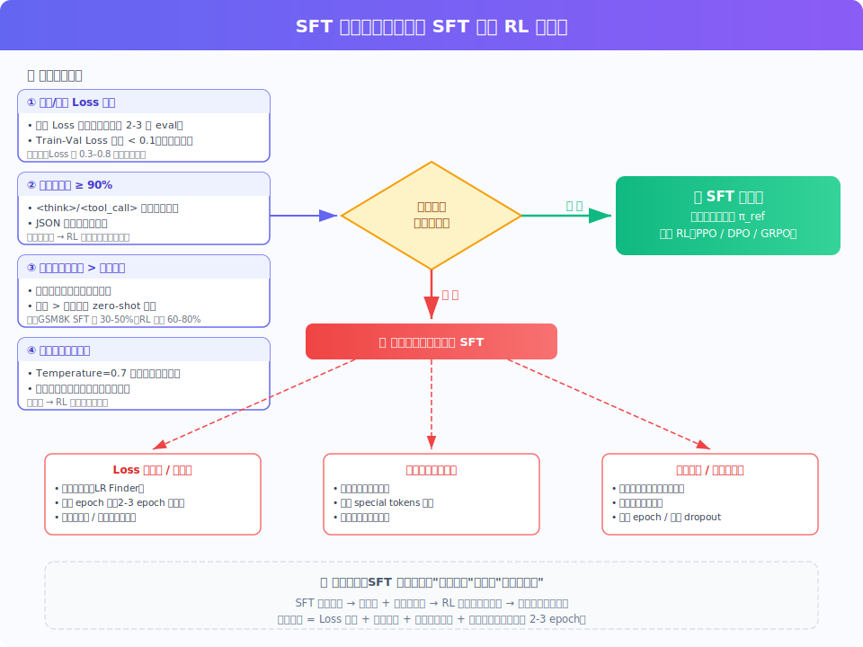

# 10.2 SFT + LoRA：监督微调与参数高效训练

## 监督微调的形式化定义

**SFT（Supervised Fine-Tuning，监督微调）** 是 Agentic-RL 训练的第一阶段，其目标是将通用基座模型 $\pi_0$ 调整为具备特定 Agent 行为格式的初始策略 $\pi_{SFT}$。

形式化地，SFT 的训练目标是在专家示范数据集 $\mathcal{D} = \{(x^{(i)}, y^{*(i)})\}_{i=1}^N$ 上最小化负对数似然损失：

$$\mathcal{L}_{SFT}(\theta) = -\frac{1}{N} \sum_{i=1}^{N} \sum_{t=1}^{|y^{*(i)}|} \log \pi_\theta\left(y^{*(i)}_t \mid x^{(i)}, y^{*(i)}_{<t}\right)$$

逐项解读：

- $\frac{1}{N} \sum_{i=1}^{N}$：对 $N$ 条训练样本求平均，使损失不受数据集规模影响
- $\sum_{t=1}^{|y^{*(i)}|}$：对第 $i$ 条样本的输出序列中每个 token 求和——这是语言模型的**自回归分解**：$\log \pi_\theta(y^* \mid x) = \sum_{t=1}^{T} \log \pi_\theta(y^*_t \mid x, y^*_{<t})$，即序列的联合概率等于每个 token 条件概率的乘积（对数域为求和）
- $\log \pi_\theta(y^{*(i)}_t \mid x^{(i)}, y^{*(i)}_{<t})$：模型在已知输入 $x^{(i)}$ 和前 $t-1$ 个 token $y^{*(i)}_{<t}$ 的条件下，预测第 $t$ 个 token 为 $y^{*(i)}_t$ 的对数概率。这个值越大（越接近 0），说明模型对这个 token 的预测越确信
- 加负号后，最小化损失 = 最大化对数似然 = 让模型对专家示范的每个 token 都尽可能高的概率生成

**自回归的直觉**：训练时，模型看到的是“正确答案”（teacher forcing）——即使模型在第 $t-1$ 步预测错了，第 $t$ 步仍然使用真实的 $y^*_{t-1}$ 作为条件。这使得 SFT 训练非常高效，但也带来了训练-推理分布偏移的问题（推理时模型看到的是自己生成的 token，而非专家示范）。

其中 $x^{(i)}$ 是输入上下文（系统提示 + 用户问题），$y^{*(i)}$ 是专家示范的完整输出序列（包含推理过程和工具调用）。

### SFT 在 Agentic-RL 中的角色

SFT 阶段解决的核心问题是**策略初始化**：从随机初始化或通用预训练权重出发，直接进行 RL 训练会面临极高的探索成本——模型需要从海量随机输出中偶然发现有效的 Agent 行为格式。SFT 通过模仿学习将策略分布约束在合理的行为空间内，为后续 RL 优化提供稳定的起点。



### SFT 训练数据格式规范

对于 Agent 任务，SFT 的训练数据是**多轮对话 + 工具调用**的完整轨迹，遵循 ChatML 格式：

```json
{
  "conversations": [
    {
      "role": "system",
      "content": "你是一个数学助手，可以使用 calculator 工具进行精确计算。"
    },
    {
      "role": "user",
      "content": "一个圆形水池半径 3 米，水深 1.5 米，水池中有多少立方米的水？"
    },
    {
      "role": "assistant",
      "content": "<think>\n圆柱体体积公式：V = π × r² × h\n其中 r = 3 m，h = 1.5 m\n需要精确计算 π × 9 × 1.5，使用计算器工具。\n</think>\n\n<tool_call>\ncalculator(expression=\"3.14159265 * 3**2 * 1.5\")\n</tool_call>"
    },
    {
      "role": "tool",
      "content": "{\"result\": 42.4115}"
    },
    {
      "role": "assistant",
      "content": "水池中的水量约为 **42.41 立方米**。\n\n计算过程：V = π × r² × h = π × 3² × 1.5 ≈ 42.41 m³"
    }
  ]
}
```

### 数据质量优先原则

LIMA [1] 的研究提供了重要的实证依据：**1,000 条精心筛选的高质量数据，其效果往往优于 10,000 条噪声数据**。对于 Agent SFT，数据质量的评估维度如下：

| 质量维度 | 标准 | 验证方法 |
|---------|------|---------|
| **格式一致性** | 统一的 `<think>`/`<tool_call>` 标签格式 | 正则表达式自动检查 |
| **工具调用正确性** | 参数类型、名称与工具定义完全匹配 | 静态解析验证 |
| **推理连贯性** | `<think>` 内容与最终动作逻辑一致 | 人工抽样审查 |
| **任务覆盖度** | 覆盖所有工具的调用模式和边界情况 | 工具调用分布统计 |
| **难度分布** | 简单/中等/复杂任务比例均衡 | 人工分级标注 |

**推荐数据规模**：500–2,000 条经过人工验证的高质量 Agent 交互轨迹。

---

## 全参数微调的资源困境

在理解 LoRA 之前，需要先明确全参数微调（Full Fine-Tuning）面临的根本性挑战。

以 Llama 3.1 8B 为例，训练时的显存需求分析如下：

```python
# 显存需求精确估算（以 Llama 3.1 8B 为例）
total_params = 8_000_000_000        # 80 亿参数

# 推理阶段（float16）
inference_memory = total_params * 2 / (1024**3)   # ≈ 14.9 GB

# 训练阶段（Adam 优化器，混合精度）
# 参数（float32）：4 bytes/param
# 梯度（float32）：4 bytes/param
# Adam 一阶矩（float32）：4 bytes/param
# Adam 二阶矩（float32）：4 bytes/param
# 合计：16 bytes/param
training_memory = total_params * 16 / (1024**3)   # ≈ 119.2 GB

# 结论：全参数微调需要至少 2-3 张 A100 80GB
# 对大多数团队而言，这一成本难以承受
```

这一资源困境催生了**参数高效微调（Parameter-Efficient Fine-Tuning, PEFT）** 方法的研究，其中 LoRA 是目前最广泛应用的方案。

---

## LoRA：低秩适应的理论基础

### 核心假设与数学推导

**LoRA（Low-Rank Adaptation）** [2] 的理论基础来自一个关键的实证发现：

> **预训练模型在微调过程中，权重更新矩阵 $\Delta W$ 具有显著的低秩特性（intrinsic low rank）。**

**为什么微调的更新是低秩的？** 直觉上，预训练模型已经学会了丰富的通用表示，微调只需要在这个表示空间中做小幅度的“方向调整”。这种调整展开在一个低维子空间中，而非需要改变所有 $d \times k$ 个方向。Aghajanyan et al. [4] 通过实验证明，微调的“内在维度”（intrinsic dimensionality）远小于模型参数量。

这意味着微调时真正需要改变的“信息量”远小于模型参数量。基于此，LoRA 提出以下参数化方案：

对于原始权重矩阵 $W_0 \in \mathbb{R}^{d \times k}$，不直接更新 $W_0$，而是将权重更新分解为两个低秩矩阵的乘积：

$$W = W_0 + \Delta W = W_0 + \frac{\alpha}{r} \cdot B A$$

逐项解读：

- $W_0 \in \mathbb{R}^{d \times k}$：**冻结的预训练权重**，训练期间完全不变，保留模型的通用知识
- $A \in \mathbb{R}^{r \times k}$：**下投影矩阵**，将 $k$ 维输入压缩到 $r$ 维的低秩空间；使用高斯分布初始化，保证训练开始时有非零梯度
- $B \in \mathbb{R}^{d \times r}$：**上投影矩阵**，将 $r$ 维低秩表示映射回 $d$ 维输出空间；**初始化为全零**，确保训练开始时 $\Delta W = BA = 0$，即模型行为与基座模型完全相同，训练稳定性有保障
- $r \ll \min(d, k)$：**秩**，控制参数量（通常取 8, 16, 32, 64）。$r$ 越小，参数量越少，但表达能力越弱；$r$ 越大，表达能力越强，但参数量增加
- $\frac{\alpha}{r}$：**缩放因子**，控制 LoRA 更新的幅度。设置为 $\frac{\alpha}{r}$ 而非直接用 $\alpha$，是为了使实际缩放幅度与 $r$ 的选择解耦合：当 $\alpha = 2r$ 时，无论 $r$ 取何值，实际缩放因子始终为 2，方便跨不同 $r$ 值的实验对比

**前向传播**：

$$h = W x = W_0 x + \frac{\alpha}{r} B A x$$

训练时冻结 $W_0$，仅更新 $A$ 和 $B$。

### 参数效率分析

LoRA 的参数量压缩比可以精确计算：

$$\text{压缩比} = \frac{r \cdot k + d \cdot r}{d \cdot k} = \frac{r(d + k)}{dk} \approx \frac{2r}{\min(d,k)} \quad (\text{当 } d \approx k \text{ 时})$$

当 $r = 16$，$d = k = 4096$ 时，压缩比 $\approx \frac{2 \times 16}{4096} \approx 0.78\%$，即仅需训练不到 1% 的参数。

```python
# 参数量对比（以 Llama 3.1 8B 的单个注意力投影层为例）
d, k = 4096, 4096

# 原始层参数量
original_params = d * k                    # = 16,777,216 (16M)

# LoRA 参数量（r=16）
r = 16
lora_params = r * k + d * r               # A: 65,536 + B: 65,536 = 131,072 (128K)

# 单层压缩比
compression_ratio = lora_params / original_params   # ≈ 0.78%

# 全模型 LoRA 参数量（应用于所有注意力层）
# Llama 3.1 8B: 32 层，每层 4 个投影（q, k, v, o）
num_lora_layers = 32 * 4
total_lora_params = num_lora_layers * lora_params   # ≈ 16.8M

# 全模型压缩比
total_compression = total_lora_params / total_params  # ≈ 0.21%
# 仅需训练不到 0.3% 的参数！
```

### 关键超参数的选择指南

| 超参数 | 含义 | 推荐范围 | 选择依据 |
|--------|------|---------|---------|
| **$r$（秩）** | 低秩矩阵的秩，控制表达能力 | 8–64 | 任务复杂度：简单格式学习用 8–16，复杂推理用 32–64 |
| **$\alpha$（缩放）** | LoRA 更新的缩放因子 | 通常 $= 2r$ | 实际缩放为 $\alpha/r$，设为 $2r$ 使有效缩放为 2 |
| **`target_modules`** | 应用 LoRA 的层 | 至少 q_proj, v_proj | 注意力层效果最显著；加入 FFN 层可提升表达能力 |
| **`lora_dropout`** | LoRA 层的 Dropout 率 | 0.05–0.1 | 数据量少时适当增大以防过拟合 |

> **💡 秩 $r$ 的选择经验法则**
>
> - **格式学习、风格迁移**（任务简单）：$r = 8$–$16$
> - **Agent 工具调用学习**（任务中等）：$r = 16$–$32$
> - **数学推理、代码生成**（任务复杂）：$r = 32$–$64$
> - **不确定时**：从 $r = 16$ 开始，观察验证集损失是否充分收敛

---

## 实战：基于 LoRA 的 Agent SFT 训练

### 环境依赖

```bash
pip install torch>=2.1.0 transformers>=4.40.0 peft>=0.10.0
pip install trl>=0.12.0 datasets accelerate bitsandbytes
```

### 步骤一：构建训练数据集

```python
"""
Agent SFT 训练数据构建
将 Agent 交互轨迹转换为 ChatML 格式的训练样本
"""

import json
from datasets import Dataset

def build_agent_sft_dataset() -> Dataset:
    """
    构建 Agent SFT 训练数据集
    
    每条样本包含完整的多轮对话轨迹：
    系统提示 → 用户问题 → 助手推理+工具调用 → 工具结果 → 最终回答
    """
    examples = [
        {
            "instruction": "帮我查看北京今天的天气，然后告诉我应该穿什么衣服。",
            "output": (
                "<think>\n"
                "用户需要两步操作：① 获取北京实时天气数据；② 根据温度给出穿衣建议。\n"
                "先调用天气工具获取数据，再基于结果给出建议。\n"
                "</think>\n\n"
                "<tool_call>\n"
                "get_weather(city=\"北京\")\n"
                "</tool_call>"
            )
        },
        {
            "instruction": "计算从上海到北京的高铁票价，每人 553 元，3 个人来回的总费用。",
            "output": (
                "<think>\n"
                "计算公式：总费用 = 单价 × 人数 × 2（来回）= 553 × 3 × 2\n"
                "使用计算器确保精确性。\n"
                "</think>\n\n"
                "<tool_call>\n"
                "calculator(expression=\"553 * 3 * 2\")\n"
                "\</tool_call\>"
            )
        },
        # 实际训练需要 500–2,000 条覆盖各类工具调用场景的数据
    ]
    
    return Dataset.from_list(examples)


def format_to_chatml(example: dict) -> dict:
    """将单条样本格式化为 ChatML 训练格式"""
    text = (
        "<|im_start|>system\n"
        "你是一个智能助手，可以使用工具完成任务。"
        "解题时请先在 <think> 标签中写出推理过程，需要工具时使用 <tool_call> 标签。\n"
        "<|im_end|>\n"
        f"<|im_start|>user\n{example['instruction']}\n<|im_end|>\n"
        f"<|im_start|>assistant\n{example['output']}\n<|im_end|>"
    )
    return {"text": text}


dataset = build_agent_sft_dataset()
train_dataset = dataset.map(format_to_chatml)
```

### 步骤二：模型加载与 LoRA 配置

```python
"""
模型加载与 LoRA 配置
采用 QLoRA（4-bit 量化 + LoRA）进一步降低显存需求
"""

import torch
from transformers import (
    AutoModelForCausalLM,
    AutoTokenizer,
    BitsAndBytesConfig,
)
from peft import LoraConfig, get_peft_model, TaskType

# ── 模型选择 ──────────────────────────────────────────────────────────────
model_name = "Qwen/Qwen2.5-7B-Instruct"

# ── QLoRA：4-bit 量化配置 ─────────────────────────────────────────────────
# QLoRA [3] 的核心思想：将模型权重量化为 4-bit 存储，但计算时反量化为 bfloat16
# 
# NF4（NormalFloat4）量化原理：
#   预训练权重近似服从正态分布 N(0, σ²)
#   NF4 将正态分布的值域划分为 16 个等概率区间（而非等间距区间）
#   这使得量化误差在统计意义上最小（信息论最优）
#   相比均匀量化（INT4），NF4 在相同 bit 数下精度损失更小
#
# 双重量化（Double Quantization）：
#   量化过程本身需要存储量化常数（scale factor），每 64 个参数共享一个 float32 常数
#   双重量化将这些量化常数再次量化为 8-bit，额外节省约 0.4 bits/param
#   对 7B 模型，双重量化额外节省约 0.4 × 7B / 8 ≈ 350 MB 显存
bnb_config = BitsAndBytesConfig(
    load_in_4bit=True,
    bnb_4bit_quant_type="nf4",           # NormalFloat4：信息论最优的 4-bit 量化格式
    bnb_4bit_compute_dtype=torch.bfloat16,
    bnb_4bit_use_double_quant=True,       # 对量化常数再次量化，额外节省 ~0.4 bits/param
)

model = AutoModelForCausalLM.from_pretrained(
    model_name,
    quantization_config=bnb_config,
    device_map="auto",
    trust_remote_code=True,
)

tokenizer = AutoTokenizer.from_pretrained(model_name)
tokenizer.pad_token = tokenizer.eos_token

# ── LoRA 配置 ─────────────────────────────────────────────────────────────
lora_config = LoraConfig(
    task_type=TaskType.CAUSAL_LM,
    r=32,                                # Agent 任务建议 r=32，平衡表达能力与参数效率
    lora_alpha=64,                       # alpha = 2r，有效缩放因子为 2
    lora_dropout=0.05,
    target_modules=[
        "q_proj", "k_proj", "v_proj", "o_proj",   # 注意力投影层（必选）
        "gate_proj", "up_proj", "down_proj",        # FFN 层（可选，提升表达能力）
    ],
    bias="none",
)

model = get_peft_model(model, lora_config)
model.print_trainable_parameters()
# 示例输出：trainable params: 83,886,080 || all params: 7,615,684,608 || trainable%: 1.10%
```

### 步骤三：训练配置与执行

```python
"""
SFT 训练执行
关键超参数的选择依据均在注释中说明
"""

from transformers import TrainingArguments
from trl import SFTTrainer

training_args = TrainingArguments(
    output_dir="./checkpoints/sft",

    # ── 训练超参数 ──────────────────────────────────────────────────────────
    num_train_epochs=3,                  # Agent 格式学习通常 2–3 个 epoch 即可收敛
    per_device_train_batch_size=4,
    gradient_accumulation_steps=4,       # 有效 batch size = 4 × 4 = 16
    learning_rate=2e-4,                  # LoRA 推荐学习率范围：1e-4 ~ 5e-4
    warmup_ratio=0.1,                    # 前 10% 步数线性 warmup，防止训练初期不稳定
    weight_decay=0.01,                   # L2 正则化，防止过拟合

    # ── 精度与性能优化 ──────────────────────────────────────────────────────
    bf16=True,                           # bfloat16 混合精度：比 fp16 数值更稳定
    gradient_checkpointing=True,         # 以重计算换显存：显存减少 ~60%，速度降低 ~20%

    # ── 学习率调度 ──────────────────────────────────────────────────────────
    lr_scheduler_type="cosine",          # 余弦退火：比线性衰减通常效果更好

    # ── 日志与检查点 ────────────────────────────────────────────────────────
    logging_steps=10,
    eval_strategy="steps",
    eval_steps=200,
    save_strategy="steps",
    save_steps=200,
    save_total_limit=3,
    load_best_model_at_end=True,         # 训练结束后自动加载验证集最优检查点

    report_to="tensorboard",
)

trainer = SFTTrainer(
    model=model,
    args=training_args,
    train_dataset=train_dataset,
    tokenizer=tokenizer,
    max_seq_length=2048,
    dataset_text_field="text",
)

print("🚀 开始 SFT 训练...")
trainer.train()

# 保存 LoRA 适配器权重（仅保存增量参数，约 100–300 MB）
model.save_pretrained("./checkpoints/sft-lora")
tokenizer.save_pretrained("./checkpoints/sft-lora")
print("✅ LoRA 权重已保存至 ./checkpoints/sft-lora")
```

### 步骤四：权重合并与推理验证

```python
"""
将 LoRA 适配器权重合并回基座模型
合并后的模型与原始模型结构完全相同，可直接用于推理部署
"""

from peft import PeftModel

# 加载基座模型（全精度，用于合并）
base_model = AutoModelForCausalLM.from_pretrained(
    model_name,
    torch_dtype=torch.bfloat16,
    device_map="auto",
)

# 加载 LoRA 适配器并合并
# merge_and_unload() 将 ΔW = BA 合并到 W₀ 中，恢复标准模型结构
model = PeftModel.from_pretrained(base_model, "./checkpoints/sft-lora")
model = model.merge_and_unload()

# 推理验证
prompt = (
    "<|im_start|>system\n你是一个数学助手，可以使用 calculator 工具进行精确计算。\n<|im_end|>\n"
    "<|im_start|>user\n计算 17 的平方根，精确到小数点后 4 位\n<|im_end|>\n"
    "<|im_start|>assistant\n"
)

inputs = tokenizer(prompt, return_tensors="pt").to(model.device)
outputs = model.generate(**inputs, max_new_tokens=256, temperature=0.1, do_sample=True)
response = tokenizer.decode(outputs[0][inputs["input_ids"].shape[1]:], skip_special_tokens=True)
print(response)
```

---

## 训练过程中的常见问题与诊断

### 问题一：训练损失不下降

```python
# 系统性诊断检查清单
diagnostics = {
    "学习率设置": {
        "症状": "损失从第一步就几乎不变",
        "原因": "学习率过小（< 1e-5）或过大（> 1e-3）",
        "解决": "尝试 2e-4，使用学习率查找器（LR Finder）确定最优值",
    },
    "数据格式": {
        "症状": "损失下降但模型输出格式混乱",
        "原因": "tokenizer 的 special tokens 未正确设置",
        "解决": "检查 pad_token、eos_token 是否正确，验证 ChatML 模板",
    },
    "LoRA 目标层": {
        "症状": "损失下降极慢",
        "原因": "target_modules 与模型架构不匹配",
        "解决": "打印 model.named_modules() 确认层名称",
    },
    "梯度消失": {
        "症状": "损失先下降后停滞",
        "原因": "gradient_checkpointing 与某些层不兼容",
        "解决": "临时关闭 gradient_checkpointing 验证",
    },
}
```

### 问题二：过拟合

```python
# 过拟合信号：训练损失持续下降，验证损失在某点后开始上升
solutions = {
    "增加正则化": "lora_dropout 从 0.05 提升至 0.1",
    "减少训练轮数": "使用 early stopping，通常 2–3 个 epoch 足够",
    "增加数据多样性": "用 GPT-4 改写现有数据，增加表达多样性",
    "降低秩 r": "r 过大容易过拟合，从 32 降至 16 尝试",
}
```

### 问题三：显存不足（OOM）

```python
# 显存优化策略（按效果从强到弱排列）
memory_optimizations = [
    ("4-bit 量化 QLoRA",        "显存减少 ~75%，精度损失极小"),
    ("gradient_checkpointing",  "显存减少 ~60%，速度降低 ~20%"),
    ("降低 max_seq_length",     "显存与序列长度平方成正比"),
    ("减小 batch_size",         "最基本的方法，配合 gradient_accumulation"),
    ("降低 LoRA r 值",          "r 减半，LoRA 参数量减半"),
    ("CPU offload",             "将优化器状态卸载到 CPU，速度大幅降低"),
]
```

> **📌 工程实践要点**
>
> - **数据准备时间 >> 训练时间**：实际项目中，80% 的时间花在数据收集、清洗和验证上
> - **数据可执行性验证**：每条训练数据的工具调用格式应通过静态解析验证，确保参数合法
> - **A/B 测试**：SFT 模型上线前，务必与 prompt-only 基线进行对照实验
> - **显存估算公式**：QLoRA 4-bit 下，7B 模型训练约需 10–12 GB 显存（含梯度和优化器状态）
> - **版本管理**：使用 wandb 或 TensorBoard 记录每次训练的超参数、损失曲线和评估指标

---

## SFT 毕业标准：何时从 SFT 转入 RL？

在 [10.1 节](./01_agentic_rl_overview.md) 中我们了解到 Agentic-RL 遵循 **SFT → RL** 的两阶段范式。但一个关键的实操问题是：**SFT 训练到什么程度，才可以"毕业"，进入 RL 阶段？**

这不是一个可以靠直觉回答的问题——过早进入 RL，模型连基本格式都不稳定，RL 阶段的探索效率极低；**过晚进入 RL，模型过拟合 SFT 数据，多样性丧失，RL 同样无法有效探索**。两种情况都会导致最终性能不佳。



### 核心原则：SFT 的目标不是"做到最好"，而是"做到足够好"

这是最重要的直觉。SFT 在整个训练流程中的定位是**策略初始化**——它不需要（也不应该）追求最高准确率。原因很简单：

> SFT 的能力上界 = 训练数据的质量上界。超越这个上界是 RL 的工作。

如果 SFT 阶段训练过度（太多 epoch、学习率不够小），模型会紧紧"贴合"训练数据的分布，导致：
1. **多样性坍缩**：模型对所有类似问题都生成几乎相同的回答
2. **探索空间被压缩**：RL 阶段需要模型在 `temperature > 0` 时产生有差异的多个候选回答（这是 GRPO 组内比较的前提），但过拟合的模型输出方差极小
3. **KL 惩罚的锚点过紧**：RL 训练中的 $\pi_{ref}$（即 SFT 模型）如果本身过于确信，策略稍有偏离就会产生巨大的 KL 惩罚，限制了 RL 的优化空间

### 四大必检指标

实践中，我们通过以下四个指标来判断 SFT 是否"毕业"：

#### 指标一：训练/验证 Loss 收敛

这是最基础的指标。观察 TensorBoard 中的 loss 曲线：

```
✅ 毕业信号：验证 Loss 连续 2–3 个 evaluation step 不再下降（或下降幅度 < 0.01）
❌ 警告信号：训练 Loss 持续下降但验证 Loss 开始上升 → 过拟合，应立即停止
```

**典型数值参考**（因任务和数据而异，仅供参考）：

| 任务类型 | SFT Loss 企稳区间 | 说明 |
|---------|-------------------|------|
| 数学推理（GSM8K） | 0.3 – 0.6 | 格式简单，收敛较快 |
| 工具调用（多工具）| 0.4 – 0.8 | JSON 格式增加了序列复杂度 |
| 代码生成 | 0.5 – 1.0 | 代码的 token 分布更分散 |
| 多轮对话 Agent | 0.4 – 0.9 | 轨迹长度差异大 |

> ⚠️ **绝对数值没有统一标准**。Loss 的具体值取决于 tokenizer、数据格式和序列长度。关键是观察**趋势**（是否企稳）和**训练/验证的差距**（是否过拟合），而非追求某个绝对数值。

```python
# 判断 Loss 是否收敛的简单方法
def is_loss_converged(eval_losses: list[float], patience: int = 3, min_delta: float = 0.01) -> bool:
    """
    检查最近 patience 次评估的 loss 是否不再显著下降。
    
    Args:
        eval_losses: 历次验证集 loss 列表（按时间顺序）
        patience: 观察窗口大小
        min_delta: 最小改善阈值
    
    Returns:
        True 表示已收敛，可以考虑进入 RL
    """
    if len(eval_losses) < patience + 1:
        return False
    
    recent = eval_losses[-patience:]
    baseline = eval_losses[-(patience + 1)]
    
    # 最近几次评估都没有显著改善
    return all(baseline - loss < min_delta for loss in recent)


def is_overfitting(train_loss: float, val_loss: float, threshold: float = 0.15) -> bool:
    """
    检查是否出现过拟合（Train-Val Loss 差距过大）。
    
    Args:
        train_loss: 当前训练 loss
        val_loss: 当前验证 loss
        threshold: 允许的最大差距
    """
    return (val_loss - train_loss) > threshold
```

#### 指标二：格式正确率 ≥ 90%

SFT 最核心的作用是让模型学会 Agent 的**行为格式**。用一个简单的验证脚本检查：

```python
import re
import json

def check_format_accuracy(model, tokenizer, eval_prompts: list[str], num_samples: int = 100) -> dict:
    """
    评估 SFT 模型的格式正确率。
    
    Returns:
        包含各维度格式正确率的字典
    """
    results = {"think_tag": 0, "tool_call_format": 0, "json_parseable": 0, "total": num_samples}
    
    for prompt in eval_prompts[:num_samples]:
        output = generate(model, tokenizer, prompt, temperature=0.1)
        
        # 检查 <think> 标签配对
        if "<think>" in output and "</think>" in output:
            results["think_tag"] += 1
        
        # 检查 <tool_call> 格式
        tool_match = re.search(r"<tool_call>\s*(\w+)\((.*?)\)\s*</tool_call>", output, re.DOTALL)
        if tool_match:
            results["tool_call_format"] += 1
            # 检查参数是否可解析
            try:
                # 尝试解析为合法的函数调用参数
                params_str = tool_match.group(2)
                # 简单验证：参数格式合法性
                if "=" in params_str:  # key=value 格式
                    results["json_parseable"] += 1
            except Exception:
                pass
    
    # 计算综合格式正确率
    results["format_accuracy"] = results["think_tag"] / num_samples
    results["tool_call_accuracy"] = results["tool_call_format"] / num_samples
    
    return results

# 使用示例
# format_stats = check_format_accuracy(model, tokenizer, eval_prompts)
# print(f"格式正确率: {format_stats['format_accuracy']:.1%}")
# print(f"工具调用率: {format_stats['tool_call_accuracy']:.1%}")
# 
# 毕业标准：format_accuracy >= 0.9 且 tool_call_accuracy >= 0.85
```

**为什么 90% 而非 100%？** 因为 RL 阶段的奖励函数会进一步强化正确格式，少量格式错误在 RL 中会自然被"惩罚"掉。但如果格式正确率低于 90%，意味着模型尚未稳定掌握 Agent 行为格式，RL 阶段会浪费大量探索预算在格式修正上，而非策略优化。

#### 指标三：任务准确率超过随机水平

SFT 模型不需要很高的准确率，但需要**有意义地超过基座模型的 zero-shot 表现**：

```python
def evaluate_task_accuracy(
    model, tokenizer, eval_dataset, 
    answer_extractor,     # 从模型输出中提取答案的函数
    answer_checker,       # 检查答案正确性的函数
) -> float:
    """
    评估 SFT 模型在目标任务上的准确率。
    """
    correct = 0
    total = len(eval_dataset)
    
    for sample in eval_dataset:
        output = generate(model, tokenizer, sample["prompt"], temperature=0.1)
        predicted = answer_extractor(output)
        if answer_checker(predicted, sample["answer"]):
            correct += 1
    
    return correct / total

# 毕业标准参考（以 GSM8K 为例）
# - 基座模型 zero-shot: ~15-20%（1.5B 模型）
# - SFT 毕业线: >= 30%（显著超过基座模型）
# - RL 目标: 50-70%（在 SFT 基础上进一步提升）
#
# 关键判断：SFT 准确率不需要很高，但必须 > 基座模型
# 这表明模型已学会任务的基本解题模式
```

| 模型规模 | 基座 zero-shot | SFT 毕业线 | RL 目标 |
|---------|---------------|-----------|---------|
| 1.5B | 10–20% | ≥ 25–30% | 45–65% |
| 7B | 25–40% | ≥ 40–50% | 60–80% |
| 14B+ | 40–55% | ≥ 55–65% | 70–85% |

> 这些数值以 GSM8K 数学推理为例，其他任务需根据实际情况调整。核心标准是：**SFT 后准确率应当显著高于基座模型 zero-shot**。

#### 指标四：输出多样性仍然存在

这是最容易被忽略但**对 RL 成功至关重要**的指标。GRPO 的核心机制是对同一输入采样 $G$ 个回答，通过组内比较学习哪些策略更好。如果 SFT 过拟合导致模型输出几乎完全相同（多样性坍缩），GRPO 的组内标准化将失效。

```python
def check_output_diversity(
    model, tokenizer, 
    test_prompts: list[str], 
    num_samples_per_prompt: int = 8, 
    temperature: float = 0.7,
) -> dict:
    """
    检测模型输出的多样性。
    
    核心思路：对同一 prompt 多次采样，计算输出之间的差异程度。
    """
    diversity_scores = []
    
    for prompt in test_prompts[:20]:  # 抽样 20 个 prompt
        outputs = []
        for _ in range(num_samples_per_prompt):
            output = generate(model, tokenizer, prompt, temperature=temperature)
            outputs.append(output)
        
        # 方法 1：计算不同输出的数量占比
        unique_outputs = len(set(outputs))
        diversity_ratio = unique_outputs / num_samples_per_prompt
        
        # 方法 2：计算平均 token 级别差异（更细粒度）
        # 这里简化为字符串不同比例
        pairs_different = sum(
            1 for i in range(len(outputs)) 
            for j in range(i + 1, len(outputs)) 
            if outputs[i] != outputs[j]
        )
        total_pairs = num_samples_per_prompt * (num_samples_per_prompt - 1) / 2
        pair_diversity = pairs_different / total_pairs if total_pairs > 0 else 0
        
        diversity_scores.append({
            "unique_ratio": diversity_ratio,
            "pair_diversity": pair_diversity,
        })
    
    avg_unique = sum(d["unique_ratio"] for d in diversity_scores) / len(diversity_scores)
    avg_pair = sum(d["pair_diversity"] for d in diversity_scores) / len(diversity_scores)
    
    return {
        "avg_unique_ratio": avg_unique,    # 期望 >= 0.5（8 次采样至少 4 种不同输出）
        "avg_pair_diversity": avg_pair,    # 期望 >= 0.6
        "is_healthy": avg_unique >= 0.5 and avg_pair >= 0.6,
    }

# 毕业标准：
# - avg_unique_ratio >= 0.5（至少一半的采样结果是不同的）
# - avg_pair_diversity >= 0.6（大多数输出对之间存在差异）
# 
# 如果多样性过低，说明 SFT 过拟合，需要：
# 1. 减少训练 epoch（从 3 降到 2）
# 2. 增大 lora_dropout
# 3. 使用 early stopping
```

### 完整毕业检查清单

将以上四个指标整合为一个实用的检查函数：

```python
def sft_graduation_check(
    model, tokenizer, eval_dataset, eval_losses: list[float],
    train_loss: float, val_loss: float,
) -> dict:
    """
    SFT 毕业检查：综合评估模型是否准备好进入 RL 阶段。
    
    Returns:
        包含各项检查结果和最终毕业建议的字典
    """
    report = {}
    
    # 检查 1：Loss 收敛
    report["loss_converged"] = is_loss_converged(eval_losses, patience=3)
    report["not_overfitting"] = not is_overfitting(train_loss, val_loss)
    
    # 检查 2：格式正确率
    format_stats = check_format_accuracy(model, tokenizer, eval_dataset)
    report["format_ok"] = format_stats["format_accuracy"] >= 0.9
    
    # 检查 3：任务准确率（需要自定义 extractor 和 checker）
    # accuracy = evaluate_task_accuracy(model, tokenizer, eval_dataset, ...)
    # report["accuracy_ok"] = accuracy > baseline_accuracy
    
    # 检查 4：多样性
    diversity = check_output_diversity(model, tokenizer, eval_dataset[:20])
    report["diversity_ok"] = diversity["is_healthy"]
    
    # 综合判断
    all_checks = [report["loss_converged"], report["not_overfitting"], 
                  report["format_ok"], report["diversity_ok"]]
    report["ready_for_rl"] = all(all_checks)
    
    # 生成建议
    if report["ready_for_rl"]:
        report["recommendation"] = "✅ SFT 毕业！保存检查点作为 π_ref，可以开始 RL 训练。"
    else:
        issues = []
        if not report["loss_converged"]:
            issues.append("Loss 尚未收敛，继续训练或调整学习率")
        if not report["not_overfitting"]:
            issues.append("出现过拟合，减少 epoch 或增加正则化")
        if not report["format_ok"]:
            issues.append("格式正确率不足 90%，检查数据格式和 special tokens")
        if not report["diversity_ok"]:
            issues.append("输出多样性不足，减少训练步数或增大 dropout")
        report["recommendation"] = "❌ 暂不建议进入 RL。需解决：\n" + "\n".join(f"  - {i}" for i in issues)
    
    return report
```

### SFT 过度训练的真实代价

为了让读者对"SFT 过度"有更直觉的感受，我们来看一组对比实验数据（基于 Qwen2.5-1.5B + GSM8K 的典型表现）：

| SFT 训练 Epoch | SFT 准确率 | 多样性指标 | GRPO 后准确率 | 说明 |
|---------------|-----------|-----------|-------------|------|
| **1 epoch** | 25% | 0.85 | 52% | SFT 不足，格式不稳定，RL 需额外探索格式 |
| **2 epoch** ✅ | 38% | 0.72 | **63%** | **最佳平衡点**：格式稳定 + 足够多样性 |
| **3 epoch** | 42% | 0.58 | 58% | 多样性下降，RL 探索受限 |
| **5 epoch** | 44% | 0.31 | 49% | 严重过拟合，RL 几乎无法改善 |
| **10 epoch** | 45% | 0.12 | 43% | 灾难性过拟合，RL 后**性能反降** |

> ⚠️ 以上数据为说明性示例，具体数值因模型、数据和超参数而异。但趋势是一致的：**SFT 训练过度会严重损害 RL 阶段的效果**。

关键发现：
- **SFT 2 epoch 的模型虽然准确率低于 5 epoch（38% vs 44%），但 GRPO 后反而更高（63% vs 49%）**——因为 2 epoch 的模型保留了足够的探索空间
- **SFT 10 epoch 后，GRPO 不仅没有提升，反而让准确率下降了（45% → 43%）**——过拟合的 $\pi_{ref}$ 成为了过紧的约束

### 实践建议总结

| 建议 | 详情 |
|------|------|
| **Epoch 数** | 2–3 个 epoch 是安全区间，超过 3 个需要格外警惕过拟合 |
| **Early Stopping** | 以验证 Loss 为基准，patience=3 eval steps |
| **保存多个检查点** | 保存 epoch 1/2/3 的检查点，RL 阶段可以回退到多样性更好的版本 |
| **先做 RL 预实验** | 用 SFT 检查点做小规模 GRPO（100–200 步），观察 mean_reward 是否上升 |
| **不要追求 SFT SOTA** | SFT 的最高准确率 ≠ RL 后的最高准确率 |

> **📌 核心记忆点**
>
> SFT 就像驾校里的科目一和科目二——它教你基本的交通规则和操作规范。你不需要在驾校里成为赛车手，只需要掌握基本功，然后到真实道路上（RL 阶段）通过实际驾驶经验来提升驾驶水平。在驾校练太久反而会形成"应试驾驶"的僵化模式，上了路不知道如何灵活应变。

---

*SFT 阶段让模型习得了 Agent 行为的基本格式与工具调用模式。然而，SFT 的能力上界受限于训练数据的质量——模型无法超越示范数据的水平。下一节介绍的 GRPO 算法将通过强化学习信号，引导模型探索出超越示范数据的最优策略。*

---

## 参考文献

[1] ZHOU C, LIU P, XU P, et al. LIMA: Less is more for alignment[C]//Advances in Neural Information Processing Systems (NeurIPS). 2023.

[2] HU E J, SHEN Y, WALLIS P, et al. LoRA: Low-rank adaptation of large language models[C]//International Conference on Learning Representations (ICLR). 2022.

[3] DETTMERS T, PAGNONI A, HOLTZMAN A, et al. QLoRA: Efficient finetuning of quantized language models[C]//Advances in Neural Information Processing Systems (NeurIPS). 2023.
