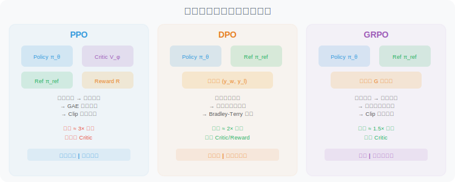
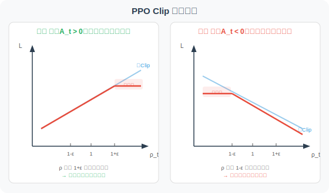
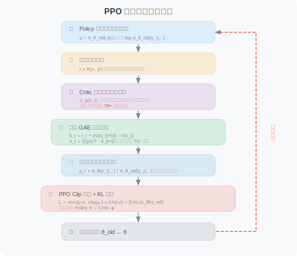
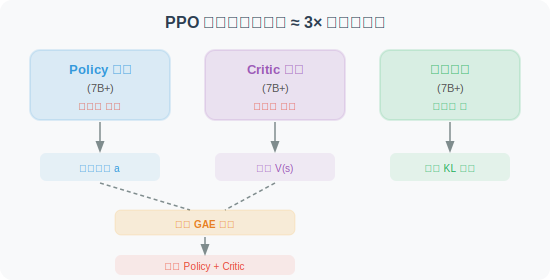

# 10.3 PPO：近端策略优化

在 [10.1 节](./01_agentic_rl_overview.md) 中，我们介绍了 Agentic-RL 的两阶段训练范式（SFT → RL）。RL 阶段的核心问题是：**如何根据奖励信号来更新模型参数？** 这正是策略优化算法要解决的问题。

本节将从零开始，**系统性地讲解 PPO（Proximal Policy Optimization）算法**——它是 InstructGPT 和 ChatGPT 的核心训练算法，也是理解后续 DPO、GRPO 算法的基础。我们将从最基本的直觉出发，逐步推导数学公式，并通过大量图示帮助理解。



## 预备知识：策略梯度的基本思想

在深入三种算法之前，我们需要理解一个共同的起点——**策略梯度（Policy Gradient）** [1]。

### 核心直觉

想象你在练习投篮。每次投篮后，你会得到一个反馈：进了（奖励 +1）或没进（奖励 0）。策略梯度的思想极其朴素：

> **如果某个动作获得了高奖励，就增加该动作的概率；如果获得了低奖励，就降低该动作的概率。**

形式化地，策略梯度定理给出的梯度方向为：

$$\nabla_\theta J(\theta) = \mathbb{E}_{\tau \sim \pi_\theta} \left[ \sum_{t=0}^{T} \nabla_\theta \log \pi_\theta(a_t | s_t) \cdot R(\tau) \right]$$

下面我们**逐项拆解**这个公式，并用一个具体的语言模型例子来帮助理解。

---

#### ① $\nabla_\theta J(\theta)$ —— "我该往哪个方向调参数？"

- $J(\theta)$ 是我们的**总目标**：模型在所有可能输入上的期望累积奖励。$J$ 越大，模型整体表现越好
- $\nabla_\theta$ 是对模型参数 $\theta$（即模型中数十亿个权重值）求梯度
- $\nabla_\theta J(\theta)$ 就是一个与 $\theta$ 同维度的向量，**它告诉我们：如果把每个参数往哪个方向微调一点点，$J$ 会增大最快**
- 训练时我们做的就是：$\theta \leftarrow \theta + \alpha \cdot \nabla_\theta J(\theta)$（$\alpha$ 是学习率），即沿梯度方向"上坡"

> **类比**：你蒙着眼站在山坡上，梯度就是"脚下最陡的上坡方向"。每走一步（更新一次参数），你就往山顶（最大奖励）靠近一点。

---

#### ② $\nabla_\theta \log \pi_\theta(a_t | s_t)$ —— "怎样调参数才能让这个动作更可能发生？"

这是公式中最核心也最难理解的部分，我们分层解释：

**第一层：$\pi_\theta(a_t | s_t)$ 是什么？**

$\pi_\theta$ 就是我们的语言模型。给定当前状态 $s_t$（对话历史 + 已生成的 token），它输出一个概率分布，表示"下一个 token 是什么"的概率。例如：

| 下一个 token ($a_t$) | 概率 $\pi_\theta(a_t \| s_t)$ |
|---------------------|-------------------------------|
| "搜索" | 0.35 |
| "回答" | 0.25 |
| "计算" | 0.20 |
| "我" | 0.10 |
| ... | ... |

$\pi_\theta(\text{"搜索"} | s_t) = 0.35$ 表示：在当前上下文下，模型认为下一步输出"搜索"的概率是 35%。

**第二层：$\log \pi_\theta(a_t | s_t)$ 为什么取对数？**

取对数有两个好处：
1. **数值稳定**：概率值在 0 到 1 之间，连乘多个 token 的概率会变得极小（如 $0.35 \times 0.20 \times 0.15 = 0.0105$），取对数后变为加法（$\log 0.35 + \log 0.20 + \log 0.15 = -4.56$），避免数值下溢
2. **梯度形式简洁**：$\nabla_\theta \log f(\theta) = \frac{\nabla_\theta f(\theta)}{f(\theta)}$，这个比率形式恰好是我们需要的

**第三层：$\nabla_\theta \log \pi_\theta(a_t | s_t)$ 到底是什么？**

这被称为**得分函数（score function）**。它是一个与模型参数 $\theta$ 同维度的向量，指出：

> **"如果想让动作 $a_t$ 在状态 $s_t$ 下的概率增大，模型的每个参数应该分别往哪个方向调？"**

- 它不直接改变概率，而是给出一个**方向**
- 沿这个方向调整参数 → $\pi_\theta(a_t | s_t)$ 增大（这个动作变得更可能）
- 沿相反方向调整参数 → $\pi_\theta(a_t | s_t)$ 减小（这个动作变得更不可能）

> **类比**：得分函数就像动作 $a_t$ 的"方向盘"——转动它可以增加或减少这个动作被选中的概率。但光有方向盘不够，你还需要知道**该转多少**——这就是下面 $R(\tau)$ 的作用。

---

#### ③ $R(\tau)$ —— "这个方向盘该转多少？"

$R(\tau) = \sum_{t=0}^{T} r_t$ 是整条轨迹（从开始到结束的完整交互过程）的**累积奖励**，它充当**权重**：

- **$R(\tau) > 0$（正奖励）**：说明这条轨迹整体表现不错
  - 梯度 = 正权重 × 得分函数 → 沿得分函数方向更新 → **增加**轨迹中每个动作的概率
  - 直觉：这次表现好，下次要更多地做类似的事情
  
- **$R(\tau) < 0$（负奖励）**：说明这条轨迹整体表现很差
  - 梯度 = 负权重 × 得分函数 → 沿得分函数**反方向**更新 → **减少**轨迹中每个动作的概率
  - 直觉：这次表现差，下次要避免做类似的事情

- **$R(\tau) = 0$（零奖励）**：这条轨迹对梯度无贡献

- **$|R(\tau)|$ 越大**：权重越大，这条轨迹对参数更新的影响越大。奖励/惩罚越极端，模型"记忆"越深刻

> **类比**：$R(\tau)$ 就像教练的评分。得分函数指明了方向盘，$R(\tau)$ 决定了转多大的角度。教练打高分（$R > 0$）→ 大力转向"增加该动作概率"；教练打低分（$R < 0$）→ 大力转向"减少该动作概率"。

---

#### ④ $\sum_{t=0}^{T}$ —— "轨迹中每一步都要算"

一条轨迹包含 $T+1$ 个时间步（从 $t=0$ 到 $t=T$），每一步都有一个 $(s_t, a_t)$ 对。求和意味着：轨迹中**每一步的得分函数都被同一个 $R(\tau)$ 加权**。

在语言模型中，一步 = 生成一个 token。如果模型生成了一个 50 token 的回答，$T = 49$，那么这 50 个 token 中每一个的生成概率都会被同一个总奖励加权更新。

> **注意**：这其实是一个粗糙的做法——用整条轨迹的总奖励来加权每一步。如果轨迹中前 30 个 token 是正确推理，后 20 个 token 是错误结论，它们都会被总奖励同等对待。这就是"**信用分配问题（credit assignment）**"——PPO 的优势函数 $A_t$ 正是为了解决这个问题（见 §1.3）。

---

#### ⑤ $\mathbb{E}_{\tau \sim \pi_\theta}$ —— "对很多次尝试取平均"

$\mathbb{E}$ 是**期望运算符**，$\tau \sim \pi_\theta$ 表示轨迹 $\tau$ 是按策略 $\pi_\theta$ 随机采样的。

- 因为语言模型的生成是**随机的**（通过 temperature 采样），同一个输入可能产生不同的输出
- 每次采样得到一条轨迹 $\tau$，对应一个 $R(\tau)$ 值
- 期望就是**对所有可能轨迹加权平均**——概率越高的轨迹权重越大

**实际操作中**：我们无法枚举所有可能轨迹（语言模型的输出空间是天文数字级的），因此用**蒙特卡洛近似**——采样 $N$ 条轨迹，取平均作为期望的估计：

$$\nabla_\theta J(\theta) \approx \frac{1}{N} \sum_{n=1}^{N} \left[ \sum_{t=0}^{T} \nabla_\theta \log \pi_\theta(a_t^{(n)} | s_t^{(n)}) \cdot R(\tau^{(n)}) \right]$$

$N$ 越大，估计越准确，但计算成本也越高。这就是训练中 batch size 的本质。

---

#### 完整例子：语言模型 Agent 的一次策略梯度更新

假设我们正在训练一个能调用搜索工具的 Agent，用户提问"北京今天天气如何？"

**采样两条轨迹：**

| | 轨迹 A（好的回答） | 轨迹 B（差的回答） |
|---|---|---|
| $s_0$ | 用户："北京今天天气如何？" | 用户："北京今天天气如何？" |
| $a_0$ | `<think>` | `<think>` |
| $a_1$ | 需要查询实时天气 | 我直接回答吧 |
| $a_2$ | `</think>` | `</think>` |
| $a_3$ | `<tool_call>search("北京天气")</tool_call>` | 北京今天晴天，25°C |
| ... | （获取结果后给出准确回答） | （瞎编的，可能完全错误） |
| $R(\tau)$ | **+0.8**（调用了工具，回答准确） | **-0.2**（没调用工具，回答错误） |

**梯度更新效果：**

- **轨迹 A**（$R = +0.8$）：模型会**增加**"遇到实时信息问题 → 调用搜索工具"这一系列动作的概率
- **轨迹 B**（$R = -0.2$）：模型会**减少**"遇到实时信息问题 → 直接瞎编回答"这一系列动作的概率

经过成千上万次这样的更新，模型逐渐学会：**遇到需要实时信息的问题，应该先调用工具，而不是直接编造答案。**

---

### 原始策略梯度的缺陷

虽然直觉清晰，但原始策略梯度有两个严重问题：

| 问题 | 具体表现 | 后果 |
|------|---------|------|
| **高方差** | $R(\tau)$ 可能在不同轨迹间差异极大 | 梯度估计不稳定，训练收敛极慢 |
| **步长不可控** | 没有约束单步更新的大小 | 一次"大跳步"就可能毁掉整个策略 |

**PPO、DPO、GRPO 各自用不同方式解决了这两个问题。** 本节详细讲解 PPO，DPO 和 GRPO 将分别在 [10.4](./04_dpo.md) 和 [10.5](./05_grpo.md) 中介绍。

---

### 1.1 PPO 解决了什么问题？

PPO [2] 是 OpenAI 于 2017 年提出的策略优化算法，是 InstructGPT [3] 和 ChatGPT 的核心训练算法。PPO 的设计目标是：

> **在保证训练稳定性的前提下，尽可能高效地利用已采样数据来更新策略。**

PPO 通过两个关键机制实现这一目标：
1. **重要性采样**：允许用"旧策略"采集的数据来训练"当前策略"（数据复用）
2. **Clip 裁剪**：限制策略更新的步长，防止策略崩溃

### 1.2 重要性采样比率 $\rho_t$：离策训练的核心

在策略梯度中，我们需要从当前策略 $\pi_\theta$ 中采样轨迹来计算梯度。但如果每次更新参数后都重新采样，效率极低。**重要性采样** 允许我们用旧策略 $\pi_{\theta_{old}}$ 的样本来估计新策略 $\pi_\theta$ 的梯度。

核心是引入**重要性采样比率**：

$$\rho_t = \frac{\pi_\theta(a_t | s_t)}{\pi_{\theta_{old}}(a_t | s_t)}$$

逐项解读：

- **分子** $\pi_\theta(a_t | s_t)$：当前策略在状态 $s_t$ 下选择动作 $a_t$ 的概率
- **分母** $\pi_{\theta_{old}}(a_t | s_t)$：采样时的旧策略选择该动作的概率
- $\rho_t = 1$：当前策略与旧策略对这个动作的偏好完全一致
- $\rho_t > 1$：当前策略比旧策略更倾向于这个动作（即"当前策略认为这个动作更好了"）
- $\rho_t < 1$：当前策略比旧策略更不倾向于这个动作（"当前策略认为这个动作变差了"）
- $\rho_t = 2$：当前策略选择该动作的概率是旧策略的 2 倍

**重要性采样的直觉**：假设旧策略采样到某个动作的概率是 10%（$\pi_{old} = 0.1$），而当前策略认为该动作概率应该是 30%（$\pi_\theta = 0.3$），则 $\rho = 3$。这意味着如果用旧策略的数据来估计新策略的期望，每条这样的数据应该被赋予 3 倍权重——因为新策略"本应"更频繁地采到它。

### 1.3 优势函数 $A_t$：判断动作的"好坏"

策略梯度中，用累积奖励 $R(\tau)$ 作为权重会导致高方差。**优势函数（Advantage Function）** 通过引入一个基准线来解决这个问题：

$$A_t = Q(s_t, a_t) - V(s_t)$$

- $Q(s_t, a_t)$：在状态 $s_t$ 下执行动作 $a_t$ 后，能获得的期望累积奖励（**动作价值**）
- $V(s_t)$：在状态 $s_t$ 下，按当前策略执行所能获得的期望累积奖励（**状态价值**，即"基准线"）
- $A_t > 0$：动作 $a_t$ 比"平均水平"好 → 应当**强化**
- $A_t < 0$：动作 $a_t$ 比"平均水平"差 → 应当**抑制**
- $A_t = 0$：动作 $a_t$ 与平均水平持平 → 无需调整

**为什么减去基准线能降低方差？** 一个形象的比喻：假设你考试得了 85 分。如果全班平均 60 分，你会觉得"考得不错"（$A = +25$）；如果全班平均 90 分，你会觉得"发挥失常"（$A = -5$）。**把绝对分数转为相对分数，消除了分数尺度的干扰**，让信号更加稳定。

### 1.4 GAE：广义优势估计

实际训练中，$Q(s_t, a_t)$ 和 $V(s_t)$ 都不是精确已知的，需要用一个 **Critic 模型** $V_\phi(s)$ 来估计。**GAE（Generalized Advantage Estimation）** [4] 是一种融合多步估计的方法，在偏差和方差之间取得平衡：

$$A_t^{GAE} = \sum_{l=0}^{T-t} (\gamma \lambda)^l \delta_{t+l}$$

其中 **TD 误差（Temporal Difference Error）** 定义为：

$$\delta_t = r_t + \gamma V_\phi(s_{t+1}) - V_\phi(s_t)$$

逐项解读 TD 误差：

- $r_t$：在时间步 $t$ 实际获得的即时奖励
- $\gamma V_\phi(s_{t+1})$：Critic 对下一状态的价值估计，乘以折扣因子 $\gamma$
- $V_\phi(s_t)$：Critic 对当前状态的价值估计
- **直觉**：$\delta_t$ 衡量的是 "**实际发生的**"（$r_t + \gamma V_\phi(s_{t+1})$）与 "**Critic 预期的**"（$V_\phi(s_t)$）之间的差异。如果 $\delta_t > 0$，说明实际结果超出预期（惊喜！）；$\delta_t < 0$ 则说明实际结果不如预期（失望！）

逐项解读 GAE：

- $(\gamma\lambda)^l$：**指数衰减权重**——越远的时间步，对当前优势的贡献越小
- $\lambda \in [0, 1]$：**GAE 折衷参数**，控制偏差-方差权衡：

| $\lambda$ 值 | GAE 退化为 | 偏差 | 方差 | 直觉 |
|-------------|-----------|------|------|------|
| $\lambda = 0$ | 单步 TD：$A_t = \delta_t$ | 高（完全依赖 Critic 精度）| 低 | 只看一步的"惊喜" |
| $\lambda = 1$ | 蒙特卡洛：$A_t = \sum_l \gamma^l \delta_{t+l}$ | 低（用完整轨迹）| 高 | 看完整轨迹的表现 |
| $\lambda = 0.95$ | **推荐值** | 适中 | 适中 | 兼顾近期和远期信息 |

> **📌 关键问题**：GAE 需要 Critic 模型 $V_\phi(s)$ 来估计状态价值。对于大语言模型（如 7B 参数），这意味着**需要额外加载一个同等规模的 Critic 模型**——这是 PPO 在大模型训练中最大的资源瓶颈。

### 1.5 PPO Clip 机制：策略更新的"安全绳"

有了优势 $A_t$ 和比率 $\rho_t$，PPO 的损失函数为：

$$\mathcal{L}_{PPO}(\theta) = -\mathbb{E}_t \left[ \min\left( \rho_t A_t,\ \text{clip}(\rho_t, 1-\epsilon, 1+\epsilon) A_t \right) \right]$$

这个公式看起来复杂，但核心思想很简单。让我们分两种情况理解：

**情况 ①：$A_t > 0$（好动作，应强化）**

- 无 Clip 时：$\rho_t$ 越大（即越增加该动作概率），损失越小 → 梯度会推动策略不断增加该动作概率
- 有 Clip 时：$\rho_t$ 超过 $1+\epsilon$ 后，$\text{clip}(\rho_t) \cdot A_t$ 不再增大 → $\min$ 取到裁剪值 → **梯度变为零**
- **效果**：即使动作很好，也不允许概率增加太多（防止"过度自信"）

**情况 ②：$A_t < 0$（差动作，应抑制）**

- 无 Clip 时：$\rho_t$ 越小（即越降低该动作概率），损失越小 → 梯度会推动策略大幅降低该动作概率
- 有 Clip 时：$\rho_t$ 低于 $1-\epsilon$ 后，**梯度变为零**
- **效果**：即使动作很差，也不允许概率降低太多（防止"矫枉过正"）



**Clip 参数 $\epsilon$ 的含义**：$\epsilon$（通常取 0.1–0.3）定义了"信任域"的大小——每次策略更新，每个动作的概率变化不得超过旧策略的 $(1 \pm \epsilon)$ 倍。$\epsilon$ 越小越保守，$\epsilon$ 越大越激进。

### 1.6 KL 散度惩罚：防止策略"跑偏"的另一道保险

Clip 机制限制的是**单个动作**的概率变化幅度，但它无法约束策略**整体分布**的漂移。在 RLHF 场景中，如果模型为了追求高奖励而"忘记"了 SFT 阶段学到的通用语言能力（如语法、连贯性），就会出现**语言退化**或**奖励黑客（reward hacking）**——模型找到某种"讨巧"的输出模式来骗取高奖励，但人类读起来一塌糊涂。

为此，PPO 在 RLHF 中通常会额外加入一个 **KL 散度惩罚项**，完整的优化目标变为：

$$\mathcal{L}_{PPO-RLHF}(\theta) = -\mathbb{E}_t \left[ \min\left( \rho_t A_t,\ \text{clip}(\rho_t, 1-\epsilon, 1+\epsilon) A_t \right) \right] + \beta \cdot D_{KL}\left(\pi_\theta \| \pi_{ref}\right)$$

其中 KL 散度定义为：

$$D_{KL}\left(\pi_\theta \| \pi_{ref}\right) = \mathbb{E}_{y \sim \pi_\theta} \left[ \log \frac{\pi_\theta(y|x)}{\pi_{ref}(y|x)} \right]$$

逐项解读：

- $\pi_{ref}$：**参考策略（Reference Policy）**——详见下方专门说明
- $D_{KL}(\pi_\theta \| \pi_{ref})$：衡量当前策略 $\pi_\theta$ 相对于参考策略 $\pi_{ref}$ 的**分布偏离程度**。$D_{KL} = 0$ 表示两者完全一致；$D_{KL}$ 越大，偏离越严重
- $\beta$：**KL 惩罚系数**——控制"探索新策略"与"保持原有能力"之间的平衡

> 关于 KL 散度的数学定义和直觉解释，请参阅 [附录 E：KL 散度详解](../appendix/kl_divergence.md)

#### 什么是 Reference 模型（$\pi_{ref}$）？

Reference 模型是 RLHF 和 GRPO 中一个非常重要的概念，初学者容易将它与"旧策略"（$\pi_{\theta_{old}}$）混淆。我们用一个表格来彻底厘清：

| | **Reference 模型 $\pi_{ref}$** | **旧策略 $\pi_{\theta_{old}}$** |
|---|---|---|
| **是什么** | RL 训练**开始前**的 SFT 模型快照 | 当前 RL 迭代**开始时**的策略模型快照 |
| **何时创建** | RL 训练启动时，复制一份 SFT 模型 | 每次采样新数据前，复制当前 Policy 模型 |
| **是否更新** | ❌ **永远不更新**（冻结参数） | ✅ 每轮迭代更新一次（同步为当前策略） |
| **存在目的** | 充当"锚点"，防止策略偏离 SFT 太远 | 提供重要性采样的分母（数据复用） |
| **作用范围** | 整个 RL 训练过程 | 仅在当前迭代内有效 |
| **用在哪里** | KL 散度惩罚 $D_{KL}(\pi_\theta \| \pi_{ref})$ | 重要性采样比率 $\rho_t = \pi_\theta / \pi_{\theta_{old}}$ |

**形象比喻**：

> 想象你在学开车（RL 训练）。驾校教练教会了你基本操作（SFT），现在你上路练习。
>
> - **Reference 模型** = 教练手册上的标准操作规范。无论你练了多久，手册永远不变。它的作用是：如果你的驾驶习惯偏离标准太远（比如开始"飙车"），就把你拉回来。
> - **旧策略** = 你上一次练车结束时的驾驶水平。每次练完车，你的水平都会提升一点。它的作用是：评估你这次练车相比上次有哪些变化。

**为什么需要 Reference 模型？**

在 RL 训练过程中，模型会不断迭代更新。如果没有 Reference 模型作为锚点，可能出现以下问题：

1. **奖励黑客（Reward Hacking）**：模型发现某种"讨巧"的输出模式可以骗取高奖励（如不断重复某个高奖励短语），但实际输出质量极差
2. **语言退化（Language Degeneration）**：模型为追求奖励而丧失了 SFT 阶段学到的语法能力、连贯性和通用知识
3. **模式坍缩（Mode Collapse）**：模型对所有输入都生成类似的"安全"回答，丧失多样性

KL 散度 $D_{KL}(\pi_\theta \| \pi_{ref})$ 就像一根"弹力绳"——当 $\pi_\theta$ 偏离 $\pi_{ref}$ 越远，惩罚越大，把策略拉回来。

**训练过程中三个模型的时间线示意**：

```
时间 →
              RL 迭代 1        RL 迭代 2        RL 迭代 3
              ─────────       ─────────       ─────────
π_ref:     [SFT 模型] ════════════════════════════════════  （永远不变）

π_θ_old:   [SFT 模型]──→[θ₁]──→[θ₁]──→[θ₂]──→[θ₂]──→[θ₃]  （每轮迭代开始时同步）
                采样↓      更新↑    采样↓      更新↑    采样↓
π_θ:       [SFT 模型]→→→[θ₁]  [θ₁]→→→[θ₂]  [θ₂]→→→[θ₃]    （持续训练更新）
```

- 第 1 行：$\pi_{ref}$ 始终是 SFT 模型，从头到尾不变
- 第 2 行：$\pi_{\theta_{old}}$ 在每轮迭代开始时，从 $\pi_\theta$ 复制一份快照
- 第 3 行：$\pi_\theta$ 是持续训练更新的 Policy 模型

> **📌 实现细节**：Reference 模型需要单独占用显存。对于 7B 参数模型（bf16），Reference 模型约占 14GB 显存。为了节省显存，有些实现会使用 LoRA 适配器——此时 Reference 模型不需要单独加载，只需在推理时关闭 LoRA 适配器即可得到 $\pi_{ref}$ 的输出。

**$\beta$ 的作用与调节**：

| $\beta$ 值 | 效果 | 适用场景 |
|------------|------|---------|
| $\beta$ 过小（如 0.001） | KL 约束几乎无效，策略可大幅偏离 | 探索性强，但容易奖励黑客、语言退化 |
| $\beta$ 适中（如 0.01–0.1） | 平衡探索与约束，推荐起始值 | 大多数 RLHF 场景 |
| $\beta$ 过大（如 1.0） | 策略几乎无法偏离 SFT 模型 | RL 训练形同虚设 |

**自适应 KL 控制**：InstructGPT [3] 提出了一种动态调节 $\beta$ 的方法——设定一个目标 KL 值 $D_{target}$，如果实际 $D_{KL}$ 超过目标值，则增大 $\beta$（收紧约束）；反之则减小 $\beta$（放松约束）：

$$\beta \leftarrow \begin{cases} \beta \times (1 + \alpha) & \text{if } D_{KL} > 1.5 \times D_{target} \\ \beta \times (1 - \alpha) & \text{if } D_{KL} < 0.5 \times D_{target} \\ \beta & \text{otherwise} \end{cases}$$

其中 $\alpha$ 是调节步长（通常取 0.1–0.2）。这种自适应机制让训练更加稳健——不需要手动精调 $\beta$。

**Clip + KL 的协同作用**：

| 约束机制 | 约束对象 | 约束粒度 | 直觉 |
|---------|---------|---------|------|
| **Clip** | 单个动作的概率比 $\rho_t$ | **局部**（逐 token 级别） | "每一步不能走太远" |
| **KL** | 整体输出分布 $\pi_\theta$ vs $\pi_{ref}$ | **全局**（策略级别） | "总体路线不能偏离太远" |

两者互补：Clip 防止单步更新过大，KL 防止累积漂移过大。在实践中，两者通常同时使用。

### 1.7 PPO 完整训练流程



PPO 的训练需要同时维护以下模型：



### 1.8 PPO 核心代码实现

下面用 PyTorch 代码完整实现 PPO 的核心组件，帮助从代码层面理解每个公式的含义。

#### 1.8.1 GAE 优势估计

```python
import torch
import torch.nn.functional as F

def compute_gae(
    rewards: torch.Tensor,       # [T] 每步即时奖励
    values: torch.Tensor,        # [T+1] Critic 估计的状态价值（含终止状态）
    gamma: float = 1.0,          # 折扣因子（语言模型任务通常取 1.0）
    lam: float = 0.95,           # GAE λ 参数
) -> torch.Tensor:
    """
    计算 GAE（广义优势估计）

    公式：A_t = Σ (γλ)^l · δ_{t+l}
    其中 δ_t = r_t + γ·V(s_{t+1}) - V(s_t)

    Args:
        rewards:  每步获得的即时奖励，形状 [T]
        values:   Critic 对每个状态的价值估计，形状 [T+1]
                  （最后一个是终止状态的价值，通常为 0）
        gamma:    折扣因子，控制未来奖励的衰减
        lam:      GAE λ 参数，控制偏差-方差权衡
                  λ=0 → 单步 TD（低方差高偏差）
                  λ=1 → 蒙特卡洛（高方差低偏差）

    Returns:
        advantages: GAE 优势估计，形状 [T]
    """
    T = len(rewards)
    advantages = torch.zeros(T)
    gae = 0.0  # 从最后一步向前累积

    for t in reversed(range(T)):
        # TD 误差：δ_t = r_t + γ·V(s_{t+1}) - V(s_t)
        # "实际发生的" - "Critic 预期的"
        delta = rewards[t] + gamma * values[t + 1] - values[t]

        # GAE 递推：A_t = δ_t + γλ·A_{t+1}
        # 等价于 A_t = Σ (γλ)^l · δ_{t+l}
        gae = delta + gamma * lam * gae
        advantages[t] = gae

    return advantages
```

#### 1.8.2 PPO Clip 损失

```python
def ppo_clip_loss(
    log_probs: torch.Tensor,         # [B, T] 当前策略的 log π_θ(a_t|s_t)
    old_log_probs: torch.Tensor,     # [B, T] 旧策略的 log π_θ_old(a_t|s_t)
    advantages: torch.Tensor,         # [B, T] GAE 优势估计
    clip_epsilon: float = 0.2,        # Clip 范围 ε
) -> tuple[torch.Tensor, dict]:
    """
    计算 PPO Clip 策略损失

    公式：L = -E[min(ρ_t·A_t, clip(ρ_t, 1-ε, 1+ε)·A_t)]

    Args:
        log_probs:     当前策略对每个 token 的对数概率 [batch, seq_len]
        old_log_probs: 旧策略对每个 token 的对数概率 [batch, seq_len]
        advantages:    每个 token 的优势值 [batch, seq_len]
        clip_epsilon:  裁剪范围，通常 0.1-0.3

    Returns:
        loss: 策略损失标量
        metrics: 监控指标
    """
    # ── 计算重要性采样比率 ────────────────────────────────────────
    # ρ_t = π_θ(a_t|s_t) / π_θ_old(a_t|s_t)
    # 在 log 空间做除法 = 做减法，再 exp 回去
    ratio = torch.exp(log_probs - old_log_probs)  # [B, T]

    # ── 未裁剪的目标 ──────────────────────────────────────────────
    # ρ_t · A_t
    surr1 = ratio * advantages  # [B, T]

    # ── 裁剪后的目标 ──────────────────────────────────────────────
    # clip(ρ_t, 1-ε, 1+ε) · A_t
    clipped_ratio = torch.clamp(ratio, 1.0 - clip_epsilon, 1.0 + clip_epsilon)
    surr2 = clipped_ratio * advantages  # [B, T]

    # ── PPO 损失 = -min(surr1, surr2) ────────────────────────────
    # 取 min 确保：
    #   A>0 时：不让 ρ 超过 1+ε（防止过度强化）
    #   A<0 时：不让 ρ 低于 1-ε（防止过度抑制）
    loss = -torch.min(surr1, surr2).mean()

    # ── 监控指标 ──────────────────────────────────────────────────
    with torch.no_grad():
        # 裁剪比例：被裁剪的 token 占比（健康范围 0.1-0.3）
        clip_fraction = ((ratio - 1.0).abs() > clip_epsilon).float().mean().item()
        # 近似 KL 散度（用于监控策略偏移程度）
        approx_kl = (old_log_probs - log_probs).mean().item()

    metrics = {
        "policy_loss": loss.item(),
        "clip_fraction": clip_fraction,       # > 0.5 说明更新步长太大
        "approx_kl": approx_kl,               # > 0.02 可能需要减小学习率
        "mean_ratio": ratio.mean().item(),     # 应接近 1.0
    }

    return loss, metrics
```

#### 1.8.3 Critic（价值函数）损失

```python
def critic_loss(
    values: torch.Tensor,        # [B, T] Critic 预测的 V(s_t)
    returns: torch.Tensor,       # [B, T] 实际回报 = advantages + old_values
) -> torch.Tensor:
    """
    计算 Critic 损失（均方误差）

    Critic 的目标：让 V_ϕ(s_t) 尽可能接近实际回报

    Args:
        values:  Critic 对每个状态的价值预测 [batch, seq_len]
        returns: 实际回报（GAE 优势 + 旧价值估计）[batch, seq_len]

    Returns:
        loss: Critic 损失标量
    """
    return F.mse_loss(values, returns)
```

#### 1.8.4 KL 散度惩罚

```python
def kl_penalty(
    log_probs: torch.Tensor,     # [B, T] 当前策略的 log π_θ
    ref_log_probs: torch.Tensor, # [B, T] 参考策略（SFT 模型）的 log π_ref
) -> torch.Tensor:
    """
    计算当前策略与参考策略之间的 KL 散度

    公式：D_KL(π_θ ‖ π_ref) = E[log(π_θ/π_ref)]

    Args:
        log_probs:     当前策略的对数概率
        ref_log_probs: 参考策略的对数概率（SFT 模型，冻结参数）

    Returns:
        kl: KL 散度标量
    """
    # KL = E[log π_θ - log π_ref]
    kl = (log_probs - ref_log_probs).mean()
    return kl
```

#### 1.8.5 PPO 完整训练步骤

```python
def ppo_training_step(
    policy_model,          # 策略模型 π_θ（可训练）
    critic_model,          # Critic 模型 V_ϕ（可训练）
    ref_model,             # 参考模型 π_ref（冻结，不训练）
    input_ids,             # 输入 token ids
    response_ids,          # 生成的回答 token ids
    old_log_probs,         # 旧策略的 log 概率
    rewards,               # 奖励信号
    old_values,            # 旧 Critic 的价值估计
    clip_epsilon=0.2,      # PPO Clip ε
    kl_coef=0.01,          # KL 惩罚系数 β
    critic_coef=0.5,       # Critic 损失权重
    gamma=1.0,             # 折扣因子
    lam=0.95,              # GAE λ
):
    """
    PPO 单步训练的完整流程

    总损失 = 策略损失 + β·KL惩罚 + c·Critic损失
    """
    # ── Step 1: 计算当前策略的 log 概率 ──────────────────────────
    # 前向传播，获取当前策略对每个 token 的对数概率
    logits = policy_model(input_ids=input_ids, response_ids=response_ids)
    log_probs = compute_token_log_probs(logits, response_ids)  # [B, T]

    # ── Step 2: 计算 Critic 的价值估计 ───────────────────────────
    values = critic_model(input_ids=input_ids, response_ids=response_ids)  # [B, T]

    # ── Step 3: 计算 GAE 优势 ────────────────────────────────────
    # 对 batch 中的每个样本分别计算 GAE
    advantages_list = []
    for b in range(rewards.shape[0]):
        adv = compute_gae(rewards[b], old_values[b], gamma=gamma, lam=lam)
        advantages_list.append(adv)
    advantages = torch.stack(advantages_list)  # [B, T]

    # 标准化优势（减小方差，稳定训练）
    advantages = (advantages - advantages.mean()) / (advantages.std() + 1e-8)

    # 实际回报 = 优势 + 旧价值估计（用于训练 Critic）
    returns = advantages + old_values[:, :-1]

    # ── Step 4: 计算 PPO Clip 策略损失 ───────────────────────────
    policy_loss, policy_metrics = ppo_clip_loss(
        log_probs, old_log_probs, advantages, clip_epsilon
    )

    # ── Step 5: 计算 KL 散度惩罚 ────────────────────────────────
    with torch.no_grad():
        ref_logits = ref_model(input_ids=input_ids, response_ids=response_ids)
        ref_log_probs = compute_token_log_probs(ref_logits, response_ids)
    kl = kl_penalty(log_probs, ref_log_probs)

    # ── Step 6: 计算 Critic 损失 ────────────────────────────────
    c_loss = critic_loss(values[:, :-1], returns)

    # ── Step 7: 总损失 ──────────────────────────────────────────
    # 策略损失（让模型做对的事）+ KL 惩罚（不要忘了语言能力）+ Critic 损失（学会评估好坏）
    total_loss = policy_loss + kl_coef * kl + critic_coef * c_loss

    return total_loss, {
        **policy_metrics,
        "kl_divergence": kl.item(),
        "critic_loss": c_loss.item(),
        "total_loss": total_loss.item(),
    }
```

> **📌 与 GRPO 代码的关键差异**：
> - PPO 需要额外维护一个 **Critic 模型**（`critic_model`），它与 Policy 模型同等规模
> - 优势估计使用 **GAE 递推**（依赖 Critic），而不是 GRPO 的组内标准化
> - 总损失包含三部分：策略损失 + KL 惩罚 + **Critic 损失**，而 GRPO 没有 Critic 损失
> - 这也解释了为什么 PPO 的显存需求是 ≈ 3× 模型大小（Policy + Critic + Reference）

### 1.9 PPO 的优缺点总结

| 维度 | 评价 |
|------|------|
| ✅ **通用性** | 几乎适用于所有 RL 场景，不限于语言模型 |
| ✅ **稳定性** | Clip 机制提供了可靠的训练稳定性保障 |
| ✅ **理论基础** | 有成熟的理论支撑（信任域方法的简化） |
| ❌ **显存需求** | 需要 Critic 模型，显存占用 ≈ 3× 模型大小 |
| ❌ **训练复杂** | Critic 与 Policy 互相依赖，联合训练不稳定 |
| ❌ **超参数多** | GAE λ、Critic 学习率、clip ε、KL β 等需精心调节 |

---


---

*PPO 是一个强大但资源消耗较大的算法——需要 Critic 模型、奖励模型和在线采样。下一节将介绍 DPO，它通过精妙的数学推导直接跳过了奖励模型和 Critic，将 RL 问题转化为简单的监督学习。*

---

## 参考文献

[1] WILLIAMS R J. Simple statistical gradient-following algorithms for connectionist reinforcement learning[J]. Machine Learning, 1992, 8(3): 229-256.

[2] SCHULMAN J, WOLSKI F, DHARIWAL P, et al. Proximal policy optimization algorithms[R]. arXiv preprint arXiv:1707.06347, 2017.

[3] OUYANG L, WU J, JIANG X, et al. Training language models to follow instructions with human feedback[C]//Advances in Neural Information Processing Systems (NeurIPS). 2022.

[4] SCHULMAN J, MORITZ P, LEVINE S, et al. High-dimensional continuous control using generalized advantage estimation[C]//International Conference on Learning Representations (ICLR). 2016.
