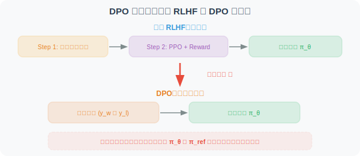
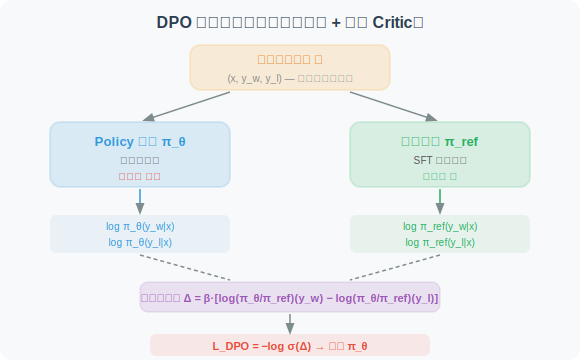

# 18.4 DPO：直接偏好优化

在 [18.3 节](./03_ppo.md) 中，我们详细介绍了 PPO 算法——它需要训练一个 Critic 模型来估计优势函数，并且依赖在线采样和奖励模型。这使得 PPO 的训练流程复杂、资源消耗大。

**DPO（Direct Preference Optimization）** [1] 提出了一种全新的思路：**直接从人类偏好数据中优化策略，无需奖励模型，无需 Critic，无需在线采样**——将 RL 问题巧妙地转化为简单的监督学习问题。

---

### 2.1 DPO 的核心洞察

DPO [1] 是 2023 年 Stanford 团队提出的算法。它的核心洞察可以用一句话概括：

> **既然 RLHF 的最终目标是让模型的输出分布符合人类偏好，那能否跳过"训练奖励模型 → 用 PPO 优化"的两步流程，直接从偏好数据中优化策略？**

答案是——**可以！** DPO 通过一个精巧的数学推导，证明了 RLHF 的最优策略可以用一个**闭式解**表示，从而将 RL 问题转化为简单的**监督学习**问题。



### 2.2 数学推导：从 RLHF 到 DPO

这一推导是 DPO 论文最精妙的部分，我们逐步展开。

**Step 1：RLHF 的优化目标**

标准的 RLHF 优化目标是：

$$\max_{\pi_\theta} \mathbb{E}_{x \sim \mathcal{D}} \mathbb{E}_{y \sim \pi_\theta(\cdot|x)} \left[ r(x, y) \right] - \beta \cdot D_{KL}\left(\pi_\theta(\cdot|x) \| \pi_{ref}(\cdot|x)\right)$$

其中 $r(x, y)$ 是奖励模型的输出，$\beta$ 控制 KL 约束强度。

**Step 2：推导最优策略的闭式解**

对上述目标求解（使用变分法），可以得到最优策略的**闭式表达**：

$$\pi^*(y|x) = \frac{1}{Z(x)} \pi_{ref}(y|x) \exp\left(\frac{r(x,y)}{\beta}\right)$$

其中 $Z(x) = \sum_y \pi_{ref}(y|x) \exp\left(\frac{r(x,y)}{\beta}\right)$ 是配分函数（归一化常数）。

逐项解读：

- $\pi_{ref}(y|x)$：参考策略（SFT 模型）的概率——最优策略以 SFT 策略为"先验"
- $\exp\left(\frac{r(x,y)}{\beta}\right)$：奖励的指数函数——高奖励的输出概率被放大，低奖励的被缩小
- $\frac{1}{Z(x)}$：归一化因子——确保概率之和为 1
- $\beta$：**温度参数**——$\beta$ 越小，最优策略越集中在高奖励输出上；$\beta$ 越大，越接近参考策略
- **直觉**：最优策略 = 参考策略 × 奖励的指数调制。好的输出被放大，差的输出被缩小

**Step 3：反解出隐式奖励**

从 Step 2 的闭式解中，可以反解出奖励函数：

$$r(x, y) = \beta \log \frac{\pi^*(y|x)}{\pi_{ref}(y|x)} + \beta \log Z(x)$$

这是一个关键的发现：**奖励可以用策略的对数概率比来表示！** 虽然我们不知道 $Z(x)$ 的值，但它只依赖于 $x$，不依赖于 $y$——在比较两个输出时会被消去。

**Step 4：代入 Bradley-Terry 偏好模型**

在 RLHF 中，人类偏好建模使用 **Bradley-Terry 模型** [2]：

$$P(y_w \succ y_l | x) = \sigma\left(r(x, y_w) - r(x, y_l)\right)$$

其中 $\sigma$ 是 sigmoid 函数，$y_w$ 是偏好的（winning）输出，$y_l$ 是不偏好的（losing）输出。

将 Step 3 的隐式奖励代入，$\beta \log Z(x)$ 项在做差时相消：

$$P(y_w \succ y_l | x) = \sigma\left(\beta \log \frac{\pi_\theta(y_w|x)}{\pi_{ref}(y_w|x)} - \beta \log \frac{\pi_\theta(y_l|x)}{\pi_{ref}(y_l|x)}\right)$$

**Step 5：得到 DPO 损失函数**

最终的 DPO 损失函数就是上述偏好概率的负对数似然：

$$\mathcal{L}_{DPO}(\theta) = -\mathbb{E}_{(x, y_w, y_l) \sim \mathcal{D}} \left[ \log \sigma\left(\beta \left[\log \frac{\pi_\theta(y_w|x)}{\pi_{ref}(y_w|x)} - \log \frac{\pi_\theta(y_l|x)}{\pi_{ref}(y_l|x)} \right] \right) \right]$$

逐项解读（由内到外）：

- $\log \frac{\pi_\theta(y_w|x)}{\pi_{ref}(y_w|x)}$：**好输出的隐式奖励**——当前策略相对参考策略对"好输出"的对数概率比。值越大 → 当前策略越偏好好输出
- $\log \frac{\pi_\theta(y_l|x)}{\pi_{ref}(y_l|x)}$：**差输出的隐式奖励**——同理，但是对"差输出"
- $\Delta = \beta \cdot [\text{好输出隐式奖励} - \text{差输出隐式奖励}]$：**隐式奖励差**。我们希望 $\Delta > 0$ 且尽可能大
- $\sigma(\Delta)$：将奖励差映射为 [0, 1] 的概率
- $-\log \sigma(\Delta)$：负对数似然损失。$\Delta$ 越大，损失越小
- $\mathbb{E}_{(x, y_w, y_l) \sim \mathcal{D}}$：在偏好数据集上求期望

**一句话总结**：DPO 让模型学会"给好输出更高的隐式奖励，给差输出更低的隐式奖励"——不需要显式训练奖励模型，也不需要在线采样。

### 2.3 DPO 的训练架构



DPO 的训练只需要：
1. **Policy 模型 $\pi_\theta$**：可训练参数（初始化为 SFT 模型）
2. **Reference 模型 $\pi_{ref}$**：冻结的 SFT 模型副本，用于计算对数概率比
3. **偏好数据集 $\mathcal{D}$**：每条数据包含 (输入 $x$, 好输出 $y_w$, 差输出 $y_l$)

**不需要**：
- ❌ 奖励模型
- ❌ Critic 模型
- ❌ 在线采样（完全离线训练）

### 2.4 DPO 的代码实现

```python
import torch
import torch.nn.functional as F

def dpo_loss(
    policy_chosen_logps: torch.Tensor,    # π_θ(y_w|x) 的 log 概率 [batch]
    policy_rejected_logps: torch.Tensor,  # π_θ(y_l|x) 的 log 概率 [batch]
    ref_chosen_logps: torch.Tensor,       # π_ref(y_w|x) 的 log 概率 [batch]
    ref_rejected_logps: torch.Tensor,     # π_ref(y_l|x) 的 log 概率 [batch]
    beta: float = 0.1,                    # 温度参数
) -> tuple[torch.Tensor, dict]:
    """
    计算 DPO 损失函数
    
    核心公式：
    L = -log σ(β · [log(π_θ/π_ref)(y_w) - log(π_θ/π_ref)(y_l)])
    
    Args:
        policy_chosen_logps:   当前策略对好输出的对数概率
        policy_rejected_logps: 当前策略对差输出的对数概率
        ref_chosen_logps:      参考策略对好输出的对数概率
        ref_rejected_logps:    参考策略对差输出的对数概率
        beta: 温度参数，控制对数概率差的缩放
    
    Returns:
        loss: 标量损失值
        metrics: 监控指标字典
    """
    # ── 计算隐式奖励 ──────────────────────────────────────────────
    # 好输出的隐式奖励：log(π_θ/π_ref)(y_w)
    chosen_rewards = policy_chosen_logps - ref_chosen_logps      # [batch]
    
    # 差输出的隐式奖励：log(π_θ/π_ref)(y_l)
    rejected_rewards = policy_rejected_logps - ref_rejected_logps # [batch]
    
    # ── 计算隐式奖励差 ────────────────────────────────────────────
    # Δ = β · [好输出隐式奖励 - 差输出隐式奖励]
    reward_margin = beta * (chosen_rewards - rejected_rewards)    # [batch]
    
    # ── DPO 损失 = -log σ(Δ) ─────────────────────────────────────
    loss = -F.logsigmoid(reward_margin).mean()
    
    # ── 监控指标 ──────────────────────────────────────────────────
    metrics = {
        "loss": loss.item(),
        "chosen_rewards": chosen_rewards.mean().item(),
        "rejected_rewards": rejected_rewards.mean().item(),
        "reward_margin": reward_margin.mean().item(),
        # 准确率：隐式奖励差 > 0 的比例（模型正确区分好差输出的比例）
        "accuracy": (reward_margin > 0).float().mean().item(),
    }
    
    return loss, metrics
```

### 2.5 深入理解：DPO 与 KL 散度的关系

读到这里，你可能会有一个疑问：**DPO 的 loss 中还有 KL 散度吗？** 毕竟在 PPO 中，KL 散度是作为显式惩罚项出现的。

**简短回答：DPO 的最终 loss 函数中没有显式的 KL 散度项，但 KL 散度已经被隐式地"吸收"进了 loss 的数学结构中。**

#### KL 散度出现在推导的"起点"

回顾 Step 1，DPO 的推导从标准 RLHF 优化目标出发：

$$\max_{\pi_\theta} \mathbb{E}\left[ r(x, y) \right] - \beta \cdot D_{KL}\left(\pi_\theta \| \pi_{ref}\right)$$

这里 **确实有一个显式的 KL 散度惩罚项** $D_{KL}(\pi_\theta \| \pi_{ref})$，它约束当前策略不能偏离参考策略太远。这和 PPO 的 KL 惩罚是同一个东西。

#### KL 散度在推导过程中被"消化"了

DPO 的精妙之处在于：通过 Step 2 → Step 5 的数学推导，将 KL 约束的 RLHF 目标**变换**为了一个纯粹的监督学习 loss。在最终的 DPO loss 中：

- ❌ **没有显式的 KL 散度项**（不像 PPO 那样在 loss 里加上 $-\beta \cdot D_{KL}$）
- ✅ **KL 约束被隐式编码在了 $\log \frac{\pi_\theta}{\pi_{ref}}$ 中**——对数概率比 $\log \frac{\pi_\theta(y|x)}{\pi_{ref}(y|x)}$ 本身就是 KL 散度的组成部分

#### 为什么说 KL 散度被"隐式包含"了？

KL 散度的定义是：

$$D_{KL}(\pi_\theta \| \pi_{ref}) = \mathbb{E}_{y \sim \pi_\theta}\left[\log \frac{\pi_\theta(y|x)}{\pi_{ref}(y|x)}\right]$$

DPO loss 中的核心项 $\log \frac{\pi_\theta(y|x)}{\pi_{ref}(y|x)}$ 正是 KL 散度的**被积函数**。因此：

| | PPO | DPO |
|---|---|---|
| **KL 散度** | 作为**显式惩罚项**加到 loss 中 | **隐式编码**在对数概率比中，无需额外计算 |
| **参考策略 $\pi_{ref}$** | 可选（也可以只用 Clip） | 必须有（是 loss 的核心组件） |
| **$\beta$ 的作用** | 控制 KL 惩罚的权重 | 控制隐式奖励差的缩放（本质一样） |

#### 直觉理解

> **PPO 说**："先算出奖励，再用 KL 散度当刹车，防止跑偏。" → 需要奖励模型 + 显式 KL 计算
> 
> **DPO 说**："我直接把奖励和 KL 约束合并成一个公式，用对数概率比同时编码了'什么是好的'和'别跑太远'。" → 一步到位

### 2.6 DPO 的优缺点总结

| 维度 | 评价 |
|------|------|
| ✅ **极简架构** | 无需 Reward 模型、Critic 模型，显存 ≈ 2× 模型大小 |
| ✅ **训练稳定** | 本质是监督学习，不存在 RL 特有的不稳定性 |
| ✅ **易于实现** | 核心代码不到 20 行，超参数仅 $\beta$ 一个 |
| ❌ **需偏好数据** | 依赖高质量的 $(y_w, y_l)$ 偏好对，标注成本高 |
| ❌ **离线局限** | 完全离线训练，无法利用在线探索发现新策略 |
| ❌ **泛化有限** | 只能学到偏好数据中已有的"好"模式，难以超越数据上界 |

> **📌 DPO vs PPO 的核心差异**
> 
> - PPO 是**在线 RL**：模型边生成边学习，能探索数据中未见过的行为模式
> - DPO 是**离线监督学习**：只从已有的偏好对中学习，无法超越数据质量
> 
> 这意味着：**如果任务需要模型涌现全新的推理策略（如 DeepSeek-R1 的长链推理），DPO 不是最佳选择；但如果已有高质量偏好数据，DPO 是最简单高效的对齐方案。**

---
---

*DPO 极大地简化了 RLHF 的流程，但它是完全离线的——无法通过在线探索发现训练数据中未出现的新策略。下一节将介绍 GRPO，它结合了 PPO 的在线探索能力和比 PPO 更低的资源消耗，是 DeepSeek-R1 的核心训练算法。*

---

## 面试常见题目

### 基础理解类

**1. DPO 相比 PPO 最核心的简化是什么？它是如何避免训练奖励模型和 Critic 模型的？**

> **参考要点**：DPO 通过一个关键的数学推导——从 RLHF 优化目标推导出最优策略的闭式解，再将奖励函数用策略对数概率比来隐式表示。将这个隐式奖励代入 Bradley-Terry 偏好模型后，配分函数 $Z(x)$ 在做差时相消，最终得到一个只依赖策略概率和参考策略概率的监督学习 loss。因此不需要显式训练奖励模型，也不需要 Critic 和在线采样。

**2. 请完整推导 DPO 损失函数的五步过程，并解释每一步的核心作用。**

> **参考要点**：
> - **Step 1**：写出标准 RLHF 优化目标（最大化奖励 - KL 惩罚）
> - **Step 2**：用变分法求解最优策略闭式解 $\pi^*(y|x) \propto \pi_{ref}(y|x) \exp(r(x,y)/\beta)$
> - **Step 3**：从闭式解反解奖励 $r(x,y) = \beta \log \frac{\pi^*(y|x)}{\pi_{ref}(y|x)} + \beta \log Z(x)$，关键发现：奖励可以用对数概率比表示
> - **Step 4**：代入 Bradley-Terry 模型，$Z(x)$ 项在 $r(x,y_w) - r(x,y_l)$ 做差时被消去
> - **Step 5**：取负对数似然得到最终 DPO loss

### 深度理解类

**3. DPO 的 loss 中到底有没有 KL 散度？如果没有显式的 KL 项，它是如何约束策略不偏离参考模型太远的？**

> **参考要点**：DPO loss 中**没有显式的 KL 散度项**，但 KL 散度被隐式编码在了 $\log \frac{\pi_\theta(y|x)}{\pi_{ref}(y|x)}$ 这个对数概率比中——这正是 KL 散度的被积函数。直觉上，DPO 把奖励和 KL 约束合并为了同一个公式：对数概率比同时编码了"什么是好的"和"别偏离太远"。$\beta$ 参数控制这种约束的强度——$\beta$ 越大，策略越倾向于接近参考模型。

**4. DPO 中 $\beta$ 参数的作用是什么？$\beta$ 过大和过小分别会导致什么问题？**

> **参考要点**：
> - $\beta$ 是温度参数，控制隐式奖励差的缩放，本质上等价于 PPO 中 KL 惩罚系数的作用
> - $\beta$ **过小**（如 0.01）：loss 对偏好对的区分度极高，可能导致过拟合训练数据中的噪声偏好，训练不稳定
> - $\beta$ **过大**（如 1.0 以上）：策略几乎不会偏离参考模型，等于 RL 训练没有生效，策略更新幅度极小
> - 通常建议 $\beta \in [0.1, 0.5]$

**5. DPO 为什么被认为是"离线"的？这给它带来了什么根本性限制？在什么场景下这种限制可以被接受？**

> **参考要点**：
> - DPO 完全依赖离线偏好数据 $(x, y_w, y_l)$，训练过程中不做任何新的采样
> - **根本限制**：无法通过在线探索发现训练数据中未出现的新行为模式，模型能力受限于偏好数据的质量和覆盖范围上界
> - **可接受场景**：已经拥有高质量偏好数据的场景（如人类标注的指令遵循偏好对）、对齐任务（alignment）中已有充分的好坏样本对比数据
> - **不适合场景**：需要模型涌现全新推理策略的任务（如 DeepSeek-R1 的长链推理），此时需要在线 RL（PPO/GRPO）

**6. DPO 中为什么需要 Reference 模型？如果去掉 Reference 模型（令 $\pi_{ref}$ 为均匀分布），DPO 会退化为什么？**

> **参考要点**：
> - Reference 模型是 DPO loss 的核心组件之一，$\log \frac{\pi_\theta}{\pi_{ref}}$ 提供了隐式奖励的计算基准
> - 如果 $\pi_{ref}$ 为均匀分布，$\log \pi_{ref}$ 是常数，在好坏输出做差时被消去，DPO loss 退化为：$-\log\sigma(\beta \cdot [\log\pi_\theta(y_w|x) - \log\pi_\theta(y_l|x)])$，变成单纯的对数概率排序损失，失去了 KL 约束的效果，容易导致模型语言能力退化

**7. 如果偏好数据中存在标注噪声（即 $y_w$ 和 $y_l$ 标反了），DPO 会如何受到影响？相比 PPO，DPO 对数据质量的敏感度如何？**

> **参考要点**：
> - DPO 会直接学到"差的输出是好的"，因为它完全依赖偏好标签做监督学习，没有在线纠错机制
> - 相比之下，PPO 通过在线采样和奖励模型有一定的噪声鲁棒性——即使奖励模型有偏差，在线探索也能帮助策略找到真正高奖励的行为
> - DPO 对数据质量的敏感度远高于 PPO，这也是工业界通常对偏好数据进行严格质控的原因

**8. 在 DPO 的代码实现中，`chosen_rewards` 和 `rejected_rewards` 的物理含义是什么？`accuracy` 指标在训练过程中应该呈现什么趋势？**

> **参考要点**：
> - `chosen_rewards = policy_chosen_logps - ref_chosen_logps`：当前策略相对于参考策略，对"好输出"的隐式奖励（对数概率比）
> - `rejected_rewards = policy_rejected_logps - ref_rejected_logps`：同理，对"差输出"的隐式奖励
> - `reward_margin = β × (chosen_rewards - rejected_rewards)`：隐式奖励差，希望 > 0 且逐步增大
> - `accuracy`（reward_margin > 0 的比例）：应从初始值（约 0.5）逐步上升至接近 1.0，表示模型越来越能正确区分好差输出。如果 accuracy 长期不上升，说明训练无效；如果一开始就是 1.0，说明任务太简单

---

## 参考文献

[1] RAFAILOV R, SHARMA A, MITCHELL E, et al. Direct preference optimization: Your language model is secretly a reward model[C]//Advances in Neural Information Processing Systems (NeurIPS). 2023.

[2] BRADLEY R A, TERRY M E. Rank analysis of incomplete block designs: I. The method of paired comparisons[J]. Biometrika, 1952, 39(3/4): 324-345.

[3] OUYANG L, WU J, JIANG X, et al. Training language models to follow instructions with human feedback[C]//Advances in Neural Information Processing Systems (NeurIPS). 2022.
