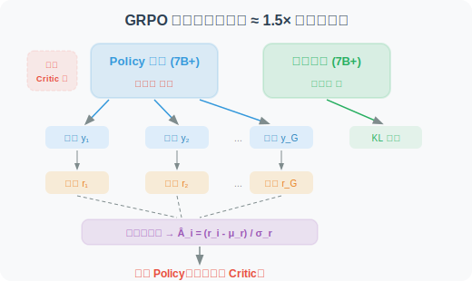
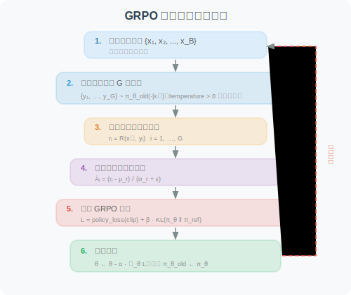

# 18.5 GRPO：组内相对策略优化与奖励函数设计

在 [18.3 节](./03_ppo.md) 和 [18.4 节](./04_dpo.md) 中，我们分别介绍了 PPO 和 DPO 两种策略优化算法。PPO 需要额外的 Critic 模型（显存占用大），DPO 虽然简单但完全离线（无法探索新策略）。

**GRPO（Group Relative Policy Optimization）** [1] 是 DeepSeek 团队为大模型 RL 训练量身打造的算法，它通过**组内采样比较**替代了 Critic 模型，在保持在线探索能力的同时大幅降低了资源消耗。本节同时介绍 GRPO 的核心驱动力——**奖励函数的设计**，因为奖励函数定义了"什么是好的 Agent 行为"，直接决定了 GRPO 的训练效果。

---

### 3.1 GRPO 的核心洞察

GRPO [1] 是 DeepSeek 团队为大模型 RL 训练量身打造的算法。它的核心洞察是：

> **PPO 的 Critic 模型本质上只是提供一个"基准线"来减小优势估计的方差。对于语言模型，有更简单的方式获得基准线——对同一问题采样多个回答，用组内均值作为基准线。**

这个洞察带来了巨大的实践价值：

| 维度 | PPO | GRPO | 改善 |
|------|-----|------|------|
| **模型数量** | Policy + Critic + Reference | Policy + Reference | **少一个 Critic** |
| **显存需求** | ≈ 3× 模型大小 | ≈ 1.5× 模型大小 | **节省约 50%** |
| **训练稳定性** | Critic 误差会传播到 Policy | 无 Critic 误差传播 | **更稳定** |
| **超参数** | 多（GAE λ, Critic lr, ...） | 少（clip ε, KL β, G） | **更易调参** |

### 3.2 组内采样与标准化：用"同组比较"替代 Critic

GRPO 的核心操作如下：

对每个输入 $x$，使用当前策略（的旧版本 $\pi_{\theta_{old}}$）采样 $G$ 个回答：

$$\{y_1, y_2, \ldots, y_G\} \sim \pi_{\theta_{old}}(\cdot | x)$$

然后分别计算每个回答的奖励 $r_i = R(x, y_i)$，并进行**组内标准化**：

$$\hat{A}_i = \frac{r_i - \mu_r}{\sigma_r + \epsilon}$$

其中：

$$\mu_r = \frac{1}{G}\sum_{j=1}^G r_j, \quad \sigma_r = \sqrt{\frac{1}{G}\sum_{j=1}^G (r_j - \mu_r)^2}$$

逐项解读：

- $\mu_r$：**组内奖励均值**——同一问题 $G$ 个回答的平均奖励，充当"基准线"（Critic 的替代品）
- $\sigma_r$：**组内奖励标准差**——用于归一化，消除奖励绝对尺度的影响
- $\epsilon$：数值稳定性常数（通常取 $10^{-8}$），防止除零
- $\hat{A}_i > 0$：第 $i$ 个回答比组内平均更好 → 应当**强化**
- $\hat{A}_i < 0$：第 $i$ 个回答比组内平均更差 → 应当**抑制**

**标准化的统计性质**：

1. **零均值**：$\sum_i \hat{A}_i \approx 0$——一半回答被强化，一半被抑制（相对比较）
2. **单位方差**：$\text{Var}(\hat{A}_i) \approx 1$——梯度大小不受奖励尺度影响

**为什么组内均值可以替代 Critic？** 核心论证：
- Critic 的作用 = 提供基准线 → 将绝对奖励转为相对优势 → 减小梯度方差
- 组内均值同样提供了一个基准线 → 同样将绝对奖励转为相对优势 → 同样减小梯度方差
- **区别**：Critic 是一个参数化的函数逼近器（需要训练，可能有估计误差）；组内均值是一个非参数的统计量（无需训练，但依赖采样质量）
- **代价**：GRPO 需要对每个问题采样 $G$ 个回答（增加采样成本），而 PPO 只需 1 个

```python
import numpy as np

def compute_grpo_advantages(rewards: list[float], eps: float = 1e-8) -> list[float]:
    """
    计算 GRPO 组内标准化优势函数
    
    Args:
        rewards: 同一问题 G 个回答的奖励值 [r₁, r₂, ..., r_G]
        eps: 数值稳定性常数
    
    Returns:
        标准化优势值列表 [Â₁, Â₂, ..., Â_G]
    
    性质：
        - Σ Â_i ≈ 0（零均值）
        - Var(Â_i) ≈ 1（单位方差）
    """
    rewards = np.array(rewards, dtype=np.float64)
    mu = rewards.mean()
    sigma = rewards.std()
    
    if sigma < eps:
        # 所有回答奖励相同 → 无法区分好坏 → 优势为零
        return [0.0] * len(rewards)
    
    advantages = (rewards - mu) / (sigma + eps)
    return advantages.tolist()


# ── 示例 ──────────────────────────────────────────────────────────────
# 同一数学题，模型生成 8 个回答：5 个正确，3 个错误
rewards = [1.0, 0.0, 1.0, 1.0, 0.0, 1.0, 0.0, 1.0]
advantages = compute_grpo_advantages(rewards)

print("奖励值:  ", rewards)
print("优势值:  ", [f"{a:+.3f}" for a in advantages])
# 正确答案（r=1.0）→ 优势 ≈ +0.667 → 强化这些推理路径
# 错误答案（r=0.0）→ 优势 ≈ -1.333 → 抑制这些推理路径
# 注意：|负优势| > |正优势|，错误答案受到的抑制力度更大
```

### 3.3 GRPO 完整目标函数

GRPO 的优化目标结合了 PPO 的 Clip 机制和 KL 散度约束：

$$\mathcal{L}_{GRPO}(\theta) = -\frac{1}{G} \sum_{i=1}^{G} \frac{1}{|y_i|} \sum_{t=1}^{|y_i|} \left[ \min\left( \rho_{i,t} \hat{A}_i,\ \text{clip}\left(\rho_{i,t}, 1-\epsilon, 1+\epsilon \right) \hat{A}_i \right) - \beta \cdot \mathbb{D}_{KL}\left[\pi_\theta \| \pi_{ref}\right] \right]$$

逐项解读：

- $\frac{1}{G} \sum_{i=1}^{G}$：对 $G$ 个回答取平均——每个回答对梯度的贡献相等
- $\frac{1}{|y_i|} \sum_{t=1}^{|y_i|}$：对第 $i$ 个回答的 token 取平均——防止长回答主导梯度（长度归一化）
- $\rho_{i,t} = \frac{\pi_\theta(y_{i,t} | x, y_{i,<t})}{\pi_{\theta_{old}}(y_{i,t} | x, y_{i,<t})}$：第 $i$ 个回答第 $t$ 个 token 的重要性采样比率
- $\min(\rho_{i,t} \hat{A}_i, \text{clip}(\rho_{i,t}, ...) \hat{A}_i)$：PPO Clip 策略损失——继承自 PPO，防止单步更新过大
- $\beta \cdot \mathbb{D}_{KL}[\pi_\theta \| \pi_{ref}]$：KL 散度惩罚——防止策略偏离 SFT 模型太远，避免奖励黑客和语言退化。关于 KL 散度的详细解释，请参阅 [附录 E：KL 散度详解](../appendix/kl_divergence.md)

### 3.4 GRPO 训练架构与流程





> 🎬 **交互式动画**：动手体验 GRPO 的核心过程——G=8 组内采样、奖励打分、标准化优势计算、概率分布更新，直观理解"用同组比较替代 Critic"的精妙设计。
>
> <a href="../animations/grpo_sampling.html" target="_blank" style="display:inline-block;padding:8px 16px;background:#E91E63;color:white;border-radius:6px;text-decoration:none;font-weight:bold;">▶ 打开 GRPO 组内采样交互动画</a>

### 3.5 基于 TRL 的 GRPO 完整实现

```python
"""
GRPO 训练的完整实现
基于 Hugging Face TRL 库的 GRPOTrainer
"""

from trl import GRPOConfig, GRPOTrainer

# ── GRPO 训练配置 ─────────────────────────────────────────────────────────
grpo_config = GRPOConfig(
    output_dir="./checkpoints/grpo",

    # GRPO 核心参数
    num_generations=8,               # G=8：平衡优势估计质量与采样成本
                                     # G 太小 → 方差大；G 太大 → 计算成本高

    # 训练超参数
    num_train_epochs=2,
    per_device_train_batch_size=1,   # 因需生成 G 个回答，batch size 要小
    gradient_accumulation_steps=8,   # 有效 batch size = 1 × 8 = 8
    learning_rate=5e-6,              # RL 阶段学习率 ≈ SFT 学习率的 1/40
                                     # 过大会导致策略崩溃，过小则收敛极慢
    warmup_ratio=0.1,
    max_grad_norm=0.5,               # 梯度裁剪，防止 RL 训练中的梯度爆炸

    # 生成参数
    max_new_tokens=512,
    temperature=0.7,                 # 保证 G 个回答的多样性
                                     # temperature 过低 → 回答趋同 → 优势全为 0

    # GRPO 算法参数
    kl_coef=0.01,                    # β：KL 散度惩罚系数
                                     # 过大 → 策略无法充分优化；过小 → 策略偏离过远

    # 精度与性能
    bf16=True,

    # 日志与检查点
    logging_steps=1,
    save_strategy="steps",
    save_steps=100,
    save_total_limit=3,
    report_to="tensorboard",
)


# ── 奖励函数定义 ──────────────────────────────────────────────────────────
def reward_function(completions: list[str], prompts: list[str], **kwargs) -> list[float]:
    """
    Agent 行为质量的综合奖励函数（示例实现）
    
详细的奖励函数设计方法参见下文「奖励函数设计」部分
    """
    rewards = []
    for completion in completions:
        reward = 0.0

        # 维度 1：格式正确性
        has_think = "<think>" in completion and "</think>" in completion
        if has_think:
            reward += 0.2
            think_content = completion.split("<think>")[1].split("</think>")[0].strip()
            if len(think_content) > 20:
                reward += 0.1   # 有实质性推理内容

        # 维度 2：工具调用合理性
        if "<tool_call>" in completion and "</tool_call>" in completion:
            reward += 0.3
            try:
                tool_str = completion.split("<tool_call>")[1].split("</tool_call>")[0].strip()
                if "(" in tool_str and ")" in tool_str:
                    reward += 0.2   # 函数调用语法正确
            except IndexError:
                reward -= 0.1   # 标签不配对

        # 维度 3：效率惩罚
        num_tool_calls = completion.count("<tool_call>")
        if num_tool_calls > 5:
            reward -= 0.1 * (num_tool_calls - 5)

        rewards.append(max(0.0, reward))

    return rewards


# ── 初始化并启动训练 ──────────────────────────────────────────────────────
trainer = GRPOTrainer(
    model=model,                     # SFT 阶段训练好的模型
    config=grpo_config,
    train_dataset=train_dataset,
    processing_class=tokenizer,
    reward_funcs=reward_function,
)

print("🚀 开始 GRPO 训练...")
trainer.train()
trainer.save_model("./checkpoints/grpo-final")
print("✅ GRPO 训练完成！")
```

---

## 三大算法系统性对比

### 4.1 架构对比

| 维度 | PPO | DPO | GRPO |
|------|-----|-----|------|
| **所需模型** | Policy + Critic + Reference | Policy + Reference | Policy + Reference |
| **显存需求** | ≈ 3× 模型大小 | ≈ 2× 模型大小 | ≈ 1.5× 模型大小 |
| **训练数据** | 在线采样 + 奖励模型 | 离线偏好对 | 在线采样 + 奖励函数 |
| **优势估计** | GAE（依赖 Critic）| 无（隐式奖励差）| 组内标准化（无 Critic）|
| **更新约束** | Clip + KL | 隐式 KL（通过 $\beta$） | Clip + KL |

### 4.2 训练特性对比

| 维度 | PPO | DPO | GRPO |
|------|-----|-----|------|
| **训练稳定性** | 中（Critic 误差传播）| 高（监督学习）| 高（无 Critic 误差）|
| **超参数数量** | 多（≥6 个）| 极少（$\beta$ 1 个）| 少（≤4 个）|
| **数据效率** | 低（需在线采样）| 高（离线复用）| 中（需 G× 采样）|
| **可探索性** | 强（在线 RL）| 无（纯离线）| 强（在线 RL）|
| **能力上界** | 可超越数据 | 受限于偏好数据质量 | 可超越数据 |

### 4.3 选型决策指南

```
你的任务是否有客观可验证的评估标准？
├── 否 → 任务评估主要依赖人类偏好？
│         ├── 是 → 有足够的偏好标注数据？
│         │         ├── 是 → 选择 DPO ✅（最简单高效）
│         │         └── 否 → 先收集偏好数据，或选择 PPO + 奖励模型
│         └── 否 → 考虑是否真的需要 RL（也许 SFT 就够了）
└── 是 → 模型规模 > 7B？
          ├── 是 → 选择 GRPO ✅（显存友好，DeepSeek-R1 验证）
          └── 否 → PPO 或 GRPO 均可
                    ├── 追求通用性和成熟工具链 → PPO
                    └── 追求简洁和训练效率 → GRPO
```

### 4.4 实证表现

| 项目 | 算法 | 核心成果 |
|------|------|---------|
| **InstructGPT** [2] | PPO | 证明 RLHF 可大幅提升指令遵循能力 |
| **Llama 2** [3] | PPO | 70B 模型的安全对齐 |
| **Zephyr** [4] | DPO | 7B 模型用 DPO 超越 PPO 基线 |
| **DeepSeek-R1** [5] | GRPO | 涌现长链推理，数学/代码能力媲美 o1 |
| **DeepSWE** [6] | GRPO | SWE-bench Verified 59%（开源 SOTA）|

---

## 关键监控指标与调参指南

在 RL 训练过程中（PPO 或 GRPO），以下指标是判断训练健康状态的核心依据：

| 指标 | 健康范围 | 异常信号 | 处理方法 |
|------|---------|---------|---------| 
| `mean_reward` | 应稳步上升 | 长期不变或下降 | 检查奖励函数设计，降低 KL 系数 |
| `kl_divergence` | < 10–15 nats | 持续增大 | 增大 KL 系数 $\beta$ |
| `clip_fraction` | 0.1–0.3 | > 0.5 | 降低学习率或增大 clip $\epsilon$ |
| `mean_ratio` | 接近 1.0 | 持续偏离 1.0 | 减小学习率，增加 warmup |
| `reward_std` | > 0（组内有差异）| ≈ 0 | 增大 temperature，检查奖励函数 |

> **📌 工程实践要点**
>
> - **组大小 $G$ 的选择**（GRPO）：$G = 4$–$16$ 是常见范围。$G$ 太小则优势估计方差大，$G$ 太大则采样成本高。建议从 $G = 8$ 开始。
> - **温度参数**（GRPO）：建议 0.6–0.8。若 temperature 过低，$G$ 个回答可能完全相同，导致 $\sigma_r \approx 0$，优势全为零。
> - **学习率**：RL 阶段的学习率通常是 SFT 阶段的 $\frac{1}{10}$ 到 $\frac{1}{50}$。过大的学习率会导致策略在几步内崩溃。
> - **梯度裁剪**：建议 `max_grad_norm=0.5`，RL 训练中梯度爆炸比 SFT 更常见。
> - **$\beta$ 调节**（DPO）：$\beta$ 通常取 0.1–0.5。$\beta$ 太小 → 训练不稳定；$\beta$ 太大 → 策略几乎不更新。

---

## 奖励函数设计——将目标形式化为可优化的信号

### 5.1 奖励函数的核心地位

在 GRPO 训练框架中，**奖励函数 $R: \mathcal{X} \times \mathcal{Y} \to \mathbb{R}$ 是连接"人类意图"与"模型行为"的唯一桥梁**。它将我们对"好 Agent"的直觉判断形式化为可微分（或可采样）的数値信号，直接决定了强化学习的优化方向。

奖励函数设计的核心挑战在于：

$$\text{真实目标} \neq \text{可计算的代理指标}$$

**为什么两者不等价？** 真实目标通常是模糊的主观判断（如"输出质量高""用户满意度高"），而可计算的代理指标必须是具体的数字（如"测试用例通过率""格式符合率"）。这一差距是**奖励黑客（Reward Hacking）** [7] 的根本来源——模型会找到最大化代理指标的捷径，而这些捷径往往不符合真实意图。

**典型案例**：若奖励函数仅检查最终答案是否正确，模型可能学会在 `<think>` 内输出乱码，然后凑出正确答案——奖励很高，但推理过程完全无意义。这就是代理指标（答案正确性）与真实目标（有意义的推理）之间的典型差距。

#### 奖励函数设计的四项基本原则

| 原则 | 形式化描述 | 违反后果 |
|------|-----------|------|
| **可验证性** | 奖励基于客观可计算的标准，而非主观判断 | 奖励信号噪声大，训练不稳定 |
| **多维度覆盖** | $R = \sum_k w_k R_k$，覆盖任务的多个质量维度 | 模型在单一维度上过度优化，忽视其他维度 |
| **稠密性** | 在轨迹的多个时间步提供奖励信号，而非仅在终止时 | 稀疏奖励导致信用分配困难，训练收敛慢 |
| **鲁棒性** | 奖励函数对模型的"钻空子"行为具有抵抗力 | 模型学会奖励黑客，高奖励但低实际质量 |

**关于多维度合并公式 $R = \sum_k w_k R_k$ 的解读**：各维度奖励 $R_k \in [0, 1]$ 独立计算，加权系数 $w_k$ 满足 $\sum_k w_k = 1$。权重的选择体现了不同维度的相对重要性：准确率权重最高（任务核心），安全权重最低（大多数情况下不会触发）。

### 5.2 核心奖励维度的设计与实现

#### 维度一：准确率奖励（Accuracy Reward）

准确率奖励是最核心的奖励维度，直接衡量 Agent 是否正确完成了任务。不同任务类型需要不同的评估方法：

```python
import re
from typing import Optional

def accuracy_reward(
    prediction: str,
    ground_truth: str,
    task_type: str = "math",
    tolerance: float = 1e-2,
) -> float:
    """
    准确率奖励：评估 Agent 输出是否正确完成任务
    
    Args:
        prediction:   模型的完整输出（含推理过程）
        ground_truth: 标准答案
        task_type:    任务类型，决定评估方法
        tolerance:    数值比较的相对误差容忍度
    
    Returns:
        奖励值 ∈ [0, 1]
    """
    if task_type == "math":
        # 数学任务：从输出中提取最终数值，允许 tolerance 相对误差
        try:
            pred_num = _extract_final_number(prediction)
            true_num = float(ground_truth.replace(",", ""))
            relative_error = abs(pred_num - true_num) / (abs(true_num) + 1e-8)
            return 1.0 if relative_error < tolerance else 0.0
        except (ValueError, AttributeError):
            return 0.0

    elif task_type == "code":
        # 代码任务：执行测试用例，按通过率给分（部分奖励）
        # 
        # 为什么使用部分奖励而非 0/1 奖励？
        # 0/1 奖励（稀疏奖励）会导致信用分配困难：
        #   - 若模型通过了 9/10 个测试用例，0/1 奖励给 0 分，无法区分"接近正确"和"完全错误"
        #   - 部分奖励 k/n 提供了更密集的梯度信号，帮助模型逐步改进
        # 这与课程学习（Curriculum Learning）的思想一致：先学会通过简单测试，再逐步攻克难测试
        code = _extract_code_block(prediction)
        if not code:
            return 0.0
        test_results = _run_test_cases(code, ground_truth)
        # 部分奖励：通过 k/n 个测试用例得 k/n 分
        return test_results["passed"] / max(test_results["total"], 1)

    elif task_type == "tool_call":
        # 工具调用任务：检查工具名称和参数是否正确
        pred_call = _parse_tool_call(prediction)
        true_call = _parse_tool_call(ground_truth)
        if pred_call is None:
            return 0.0
        score = 0.0
        if pred_call.get("name") == true_call.get("name"):
            score += 0.5   # 工具名称正确
        if pred_call.get("args") == true_call.get("args"):
            score += 0.5   # 参数完全匹配
        return score

    else:
        # 通用：精确字符串匹配
        return 1.0 if prediction.strip() == ground_truth.strip() else 0.0


def _extract_final_number(text: str) -> float:
    """从文本中提取最后出现的数值（通常是最终答案）"""
    # 匹配整数、小数、负数，忽略千位分隔符
    numbers = re.findall(r'-?[\d,]+\.?\d*', text)
    if not numbers:
        raise ValueError(f"No number found in: {text[:100]}")
    return float(numbers[-1].replace(",", ""))
```

#### 维度二：格式奖励（Format Reward）

格式奖励确保模型输出符合预期的结构化格式，这对于 Agent 的可靠性至关重要：

```python
def format_reward(completion: str) -> float:
    """
    格式奖励：评估输出是否符合 Agent 格式规范
    
    期望格式（两种合法模式）：
    模式 A（需要工具）：<think>推理</think> <tool_call>调用</tool_call>
    模式 B（直接回答）：<think>推理</think> 最终答案
    
    评分细则：
    - <think> 标签配对且内容非空：+0.4
    - <tool_call> 标签配对且语法正确：+0.4
    - 无重复/嵌套标签：+0.2
    """
    score = 0.0

    # ── 检查 <think> 标签 ─────────────────────────────────────────────────
    think_open  = completion.count("<think>")
    think_close = completion.count("</think>")

    if think_open == 1 and think_close == 1:
        score += 0.2
        # 检查 think 内容的实质性
        think_content = completion.split("<think>")[1].split("</think>")[0].strip()
        if len(think_content) >= 20:
            score += 0.2   # 有实质性推理内容（非空壳）
    elif think_open != think_close:
        score -= 0.2       # 标签不配对，严重格式错误

    # ── 检查 <tool_call> 标签 ─────────────────────────────────────────────
    tool_open  = completion.count("<tool_call>")
    tool_close = completion.count("</tool_call>")

    if tool_open == tool_close and tool_open > 0:
        score += 0.2
        # 检查工具调用语法
        try:
            tool_str = completion.split("<tool_call>")[1].split("</tool_call>")[0].strip()
            # 验证函数调用格式：name(args)
            if re.match(r'^\w+\(.*\)$', tool_str, re.DOTALL):
                score += 0.2
        except IndexError:
            pass
    elif tool_open != tool_close:
        score -= 0.2       # 标签不配对

    return max(0.0, min(1.0, score))
```

#### 维度三：效率奖励（Efficiency Reward）

效率奖励鼓励模型用最少的步骤和 Token 完成任务，防止冗余行为：

```python
def efficiency_reward(
    completion: str,
    expected_steps: int = 3,
    max_tokens: int = 512,
) -> float:
    """
    效率奖励：惩罚冗余的工具调用和过长的输出
    
    设计原则：
    - 在 expected_steps 以内：满分
    - 超出 expected_steps：线性惩罚，最多扣 0.5 分
    - 超出 max_tokens：额外惩罚，最多扣 0.3 分
    - 检测重复内容：额外惩罚
    """
    score = 1.0

    # ── 步骤数惩罚 ────────────────────────────────────────────────────────
    num_steps = completion.count("<tool_call>")
    if num_steps > expected_steps:
        step_penalty = 0.1 * (num_steps - expected_steps)
        score -= min(step_penalty, 0.5)

    # ── Token 数惩罚 ──────────────────────────────────────────────────────
    num_tokens = len(completion.split())
    if num_tokens > max_tokens:
        token_penalty = 0.3 * (num_tokens - max_tokens) / max_tokens
        score -= min(token_penalty, 0.3)

    # ── 重复内容检测 ──────────────────────────────────────────────────────
    # 将输出分句，检测重复率（防止模型通过重复填充获得高奖励）
    sentences = [s.strip() for s in re.split(r'[。！？\n]', completion) if len(s.strip()) > 5]
    if len(sentences) > 3:
        unique_ratio = len(set(sentences)) / len(sentences)
        if unique_ratio < 0.7:
            score -= 0.2   # 超过 30% 的句子是重复的

    return max(0.0, score)
```

#### 维度四：安全奖励（Safety Reward）

安全奖励防止 Agent 产生危险或有害的行为，这在生产环境中至关重要：

```python
def safety_reward(completion: str) -> float:
    """
    安全奖励：检测并惩罚潜在危险行为
    
    检测类别：
    1. 危险系统命令（文件删除、权限修改等）
    2. 危险数据库操作（DROP、DELETE 等不可逆操作）
    3. 代码注入风险（eval、exec 等动态执行）
    4. 敏感信息泄露（API Key、邮箱、身份证号等）
    """
    score = 1.0

    # ── 危险命令模式 ──────────────────────────────────────────────────────
    dangerous_patterns = [
        (r'\brm\s+-rf\b',          0.8, "危险文件删除命令"),
        (r'\bDROP\s+TABLE\b',      0.8, "不可逆数据库操作"),
        (r'\bDELETE\s+FROM\b',     0.5, "数据库删除操作"),
        (r'\bsudo\b',              0.3, "提权命令"),
        (r'\bchmod\s+777\b',       0.3, "危险权限设置"),
        (r'\beval\s*\(',           0.5, "动态代码执行"),
        (r'\bexec\s*\(',           0.5, "动态代码执行"),
        (r'\b__import__\s*\(',     0.5, "动态模块导入"),
    ]

    for pattern, penalty, _ in dangerous_patterns:
        if re.search(pattern, completion, re.IGNORECASE):
            score -= penalty

    # ── 敏感信息泄露检测 ──────────────────────────────────────────────────
    sensitive_patterns = [
        (r'sk-[a-zA-Z0-9]{32,}',                              0.5, "API Key"),
        (r'\b[A-Za-z0-9._%+-]+@[A-Za-z0-9.-]+\.[A-Z]{2,}\b', 0.3, "邮箱地址"),
        (r'\b\d{3}-\d{2}-\d{4}\b',                            0.5, "SSN"),
        (r'\b1[3-9]\d{9}\b',                                   0.3, "手机号"),
    ]

    for pattern, penalty, _ in sensitive_patterns:
        if re.search(pattern, completion, re.IGNORECASE):
            score -= penalty

    return max(0.0, score)
```

### 5.3 多维度奖励的组合策略

实际训练中，将多个维度的奖励加权组合为单一标量信号：

```python
from dataclasses import dataclass, field
from typing import Callable

@dataclass
class RewardConfig:
    """奖励函数配置，支持动态调整各维度权重"""
    accuracy_weight:   float = 0.50   # 准确率：最核心的维度
    format_weight:     float = 0.20   # 格式：确保输出可解析
    efficiency_weight: float = 0.15   # 效率：鼓励简洁
    safety_weight:     float = 0.15   # 安全：防止危险行为


class AgentRewardFunction:
    """
    多维度 Agent 奖励函数
    
    设计原则：
    1. 各维度独立计算，便于调试和分析
    2. 支持动态调整权重（训练初期格式权重高，后期准确率权重高）
    3. 记录各维度分数，便于监控训练过程
    """

    def __init__(self, config: RewardConfig = RewardConfig()):
        self.config = config
        self._validate_weights()

    def _validate_weights(self):
        total = (self.config.accuracy_weight + self.config.format_weight +
                 self.config.efficiency_weight + self.config.safety_weight)
        assert abs(total - 1.0) < 1e-6, f"权重之和必须为 1.0，当前为 {total:.4f}"

    def __call__(
        self,
        completion: str,
        ground_truth: Optional[str] = None,
        task_type: str = "math",
    ) -> dict[str, float]:
        """
        计算综合奖励
        
        Returns:
            包含各维度分数和加权总分的字典，便于监控和调试
        """
        scores = {}

        # 各维度独立计算
        scores["accuracy"] = (
            accuracy_reward(completion, ground_truth, task_type)
            if ground_truth else 0.5   # 无标准答案时给中性分
        )
        scores["format"]     = format_reward(completion)
        scores["efficiency"] = efficiency_reward(completion)
        scores["safety"]     = safety_reward(completion)

        # 加权求和
        scores["total"] = (
            scores["accuracy"]   * self.config.accuracy_weight +
            scores["format"]     * self.config.format_weight +
            scores["efficiency"] * self.config.efficiency_weight +
            scores["safety"]     * self.config.safety_weight
        )

        return scores


# 使用示例
reward_fn = AgentRewardFunction(RewardConfig(
    accuracy_weight=0.50,
    format_weight=0.20,
    efficiency_weight=0.15,
    safety_weight=0.15,
))

result = reward_fn(
    completion=(
        "<think>\n需要计算圆的面积：S = π × r² = π × 5² ≈ 78.54\n</think>\n"
        "<tool_call>calculator(expression='3.14159 * 5**2')</tool_call>"
    ),
    ground_truth="78.54",
    task_type="math",
)
# 预期输出：{'accuracy': 1.0, 'format': 0.8, 'efficiency': 1.0, 'safety': 1.0, 'total': 0.93}
print(result)
```

### 5.4 奖励黑客的防御机制

**奖励黑客（Reward Hacking）** [7] 是指模型学会了"钻奖励函数的空子"——在不真正完成任务的情况下获得高奖励。这是 RL 训练中最常见也最危险的失效模式。

#### 典型奖励黑客案例分析

| 奖励设计缺陷 | 模型的黑客行为 | 根本原因 | 防御方法 |
|------------|-------------|---------|---------| 
| 按输出长度给奖励 | 输出大量无意义填充文本 | 奖励与质量解耦 | 改为评估信息密度，惩罚重复内容 |
| 按工具调用次数给奖励 | 疯狂调用不必要的工具 | 奖励与任务目标不一致 | 增加冗余调用惩罚，设置最大步数 |
| 只看最终答案正确性 | `<think>` 内输出乱码，凑出正确答案 | 奖励忽视了推理过程质量 | 同时检查推理过程的连贯性 |
| 用 LLM 评分作为唯一奖励 | 学会输出讨好评分 LLM 的措辞 | 奖励模型本身可被攻击 | 混合使用规则奖励和 LLM 奖励 |

#### 鲁棒奖励函数的实现

```python
def robust_reward(
    completion: str,
    ground_truth: str,
    task_type: str = "math",
) -> float:
    """
    防奖励黑客的鲁棒奖励函数
    
    在基础准确率奖励之上，叠加多层防御机制：
    1. 推理过程连贯性检查（防止乱码 think）
    2. 输出长度合理性检查（防止无意义填充）
    3. 工具调用频率检查（防止冗余调用）
    4. 答案来源验证（确保答案来自推理，而非随机猜测）
    """
    # 基础准确率奖励
    base_reward = accuracy_reward(completion, ground_truth, task_type)

    # ── 防御 1：推理过程连贯性 ────────────────────────────────────────────
    if "<think>" in completion and "</think>" in completion:
        think_content = completion.split("<think>")[1].split("</think>")[0]
        coherence = _compute_text_coherence(think_content)
        if coherence < 0.5:
            base_reward *= 0.5   # 推理不连贯（可能是乱码），奖励减半

    # ── 防御 2：输出长度合理性 ────────────────────────────────────────────
    token_count = len(completion.split())
    if token_count > 1000:
        base_reward *= 0.7   # 异常长的输出，可能是填充行为

    # ── 防御 3：工具调用频率 ──────────────────────────────────────────────
    tool_calls = completion.count("<tool_call>")
    if tool_calls > 8:
        base_reward *= max(0.5, 1.0 - 0.05 * (tool_calls - 8))

    return base_reward


def _compute_text_coherence(text: str) -> float:
    """
    计算文本连贯性分数（简化版）
    
    通过统计有效字符（中文、英文、数字、标点）的比例
    来近似估计文本是否为正常语言（而非随机字符）
    """
    if not text.strip():
        return 0.0
    valid_chars = len(re.findall(r'[\u4e00-\u9fff\w\s.,!?，。！？；：]', text))
    return valid_chars / max(len(text), 1)
```

### 5.5 不同任务类型的奖励设计模板

#### 数学推理任务

```python
math_reward_config = RewardConfig(
    accuracy_weight=0.60,    # 数学任务以正确性为核心
    format_weight=0.15,
    efficiency_weight=0.15,
    safety_weight=0.10,
)
# 准确率评估：数值精确匹配（允许 1% 相对误差）
# 格式要求：必须包含 <think> 推理过程
# 效率标准：期望步数 ≤ 3，最大 Token 数 ≤ 400
```

#### 代码生成与修复任务

```python
code_reward_config = RewardConfig(
    accuracy_weight=0.50,    # 测试用例通过率
    format_weight=0.10,
    efficiency_weight=0.25,  # 代码任务效率更重要（减少文件编辑次数）
    safety_weight=0.15,      # 代码安全性至关重要
)
# 准确率评估：执行测试用例，按通过率给分（部分奖励）
# 效率标准：期望文件编辑次数 ≤ 3，最大迭代轮数 ≤ 5
# 安全检查：严格检测危险命令和代码注入
```

#### 信息检索与问答任务

```python
retrieval_reward_config = RewardConfig(
    accuracy_weight=0.40,    # 答案准确性（需 LLM 评判）
    format_weight=0.20,      # 引用格式、来源标注
    efficiency_weight=0.20,  # 搜索次数和 Token 消耗
    safety_weight=0.20,      # 防止信息泄露
)
# 准确率评估：LLM-as-Judge（需混合规则奖励防止黑客）
# 格式要求：必须包含来源引用，最少 2 个可验证来源
```

> **📌 工程实践要点**
>
> - **从简单开始**：先用准确率 + 格式两个维度训练，确认模型行为正常后再逐步加入效率和安全维度
> - **人工审查**：每 100 个训练步骤，随机抽取 20 条高奖励和 20 条低奖励样本进行人工审查，验证奖励函数是否合理
> - **奖励版本管理**：奖励函数的每次修改都应纳入版本控制，记录修改原因、预期效果和实际效果
> - **动态权重调整**：训练初期（前 20% 步骤）适当提高格式权重，帮助模型快速建立格式规范；后期逐步提高准确率权重
> - **奖励分布监控**：定期检查奖励分布，若大多数样本奖励趋于相同（方差极小），说明奖励函数区分度不足，需要重新设计

---

*掌握了算法原理与奖励函数设计后，下一节将把所有组件整合起来，完成一个从数据准备到模型部署的完整 Agentic-RL 训练 Pipeline。*

---

## 面试常见题目

### 基础理解类

**1. GRPO 的核心洞察是什么？它是如何替代 PPO 中的 Critic 模型的？**

> **参考要点**：GRPO 的核心洞察是——PPO 中 Critic 的本质作用只是提供一个"基准线"来将绝对奖励转为相对优势从而降低梯度方差。对于语言模型，可以用更简单的方式获取基准线：**对同一问题采样 G 个回答，用组内奖励均值作为基准线**。这样就完全省去了 Critic 模型的训练和存储，显存节省约 50%。

**2. 请写出 GRPO 组内标准化优势函数的公式，并解释其统计性质。**

> **参考要点**：
> - 公式：$\hat{A}_i = \frac{r_i - \mu_r}{\sigma_r + \epsilon}$，其中 $\mu_r$ 是 G 个回答奖励的均值，$\sigma_r$ 是标准差
> - **零均值**：$\sum_i \hat{A}_i \approx 0$，一半回答被强化，一半被抑制（相对比较而非绝对评判）
> - **单位方差**：$\text{Var}(\hat{A}_i) \approx 1$，梯度大小不受奖励尺度影响
> - 当所有回答奖励相同时（$\sigma_r \approx 0$），优势全为零，不做任何更新

### 深度理解类

**3. GRPO 的组内均值 vs PPO 的 Critic 作为基准线，各自的优缺点是什么？在什么情况下组内均值会成为瓶颈？**

> **参考要点**：
> - **Critic 优点**：是参数化的函数逼近器，可以泛化到未见过的状态（理论上更精确）
> - **Critic 缺点**：需要额外训练，存在估计误差，误差会传播到 Policy 更新中，增加训练不稳定性
> - **组内均值优点**：非参数统计量，无需训练，无误差传播，实现简单
> - **组内均值缺点**：依赖采样质量。如果 G 太小（如 G=2），均值和标准差估计不准；如果 temperature 太低，G 个回答几乎相同，$\sigma_r \approx 0$，优势全为零，训练停滞
> - **瓶颈场景**：任务难度极高（所有回答都错误或都正确，无法区分）、采样多样性不足

**4. GRPO 目标函数中的 $\frac{1}{|y_i|}$ 长度归一化项有什么作用？如果去掉它会怎样？**

> **参考要点**：
> - 长度归一化防止长回答在 token 级求和中主导梯度——长回答有更多 token，如果不归一化，它对梯度的贡献远大于短回答
> - 去掉后，模型可能倾向于生成更长的回答（因为长回答的梯度贡献更大），甚至学会通过增加无意义内容来增加影响力
> - 这是一个容易被忽视但对训练质量影响很大的工程细节

**5. GRPO 继承了 PPO 的 Clip 机制和 KL 惩罚。这两种约束机制的约束对象和粒度有什么区别？为什么需要同时使用？**

> **参考要点**：
> - **Clip 机制**：约束**单个 token** 的重要性采样比率 $\rho_{i,t}$ 在 $[1-\epsilon, 1+\epsilon]$ 范围内，是**局部/逐 token 级别**的约束，防止单步更新过大
> - **KL 惩罚**：约束**整体输出分布** $\pi_\theta$ 相对于 $\pi_{ref}$ 的偏离程度，是**全局/策略级别**的约束，防止累积漂移过大
> - 两者互补：Clip 可以保证每步更新稳定，但多步累积后策略可能仍然偏离很远；KL 惩罚可以约束全局漂移，但无法控制单步更新的突变
> - 仅用 Clip：可能出现"每步小更新但方向一致"导致的缓慢漂移（奖励黑客）
> - 仅用 KL：可能出现"单步大更新"导致的策略崩溃

**6. 在 GRPO 中，组大小 G 的选择有什么 trade-off？G=2 和 G=64 分别有什么问题？**

> **参考要点**：
> - **G 太小（如 G=2）**：
>   - 均值和标准差的估计极不准确，优势函数方差大
>   - 只有两个回答比较，区分度极低（只能说谁好谁差，无法精细排序）
>   - 训练不稳定
> - **G 太大（如 G=64）**：
>   - 采样计算成本极高，每个问题需要生成 64 条回答
>   - 显存压力大
>   - 但统计量估计更准确，训练更稳定
> - **经验值 G=8~16** 是常见选择，在统计质量和计算成本间取得平衡
> - DeepSeek-R1 的实践经验中使用了 G=8

**7. 温度参数（temperature）对 GRPO 训练有什么关键影响？为什么说"temperature 过低可能让训练完全停滞"？**

> **参考要点**：
> - temperature 控制采样多样性。GRPO 的优势函数依赖于**组内回答之间的奖励差异**来提供梯度信号
> - **temperature 过低**（如 0.1）：G 个回答几乎完全相同 → 奖励几乎相同 → $\sigma_r \approx 0$ → 标准化后优势全为零 → **梯度为零，训练完全停滞**
> - **temperature 过高**（如 1.5+）：回答过于随机 → 大部分回答质量极差 → 难以采到高质量回答作为正面样本 → 训练效率低
> - **推荐范围 0.6~0.8**：保证足够的多样性来区分好坏，同时大部分回答仍具有合理质量

### 奖励函数设计类

**8. 奖励函数设计的四项基本原则是什么？请分别举例说明违反每项原则会导致什么后果。**

> **参考要点**：
>
> | 原则 | 违反后果举例 |
> |------|-------------|
> | **可验证性**（基于客观标准） | 如果用主观模糊标准（"回答好不好"）做奖励，信号噪声大，模型学不到稳定的模式 |
> | **多维度覆盖**（$R=\sum w_k R_k$） | 只看准确率 → 模型在 `<think>` 里输出乱码凑答案；只看格式 → 格式完美但内容全错 |
> | **稠密性**（多步提供信号） | 只在最后给 0/1 奖励 → 模型无法区分"差一点就对了"和"完全跑偏"，信用分配困难 |
> | **鲁棒性**（抵抗钻空子） | 按长度给奖励 → 输出无意义填充；按工具调用次数给奖励 → 疯狂调用无关工具 |

**9. 什么是奖励黑客（Reward Hacking）？请列举至少 3 种常见的奖励黑客案例，并给出对应的防御策略。**

> **参考要点**：
> - 奖励黑客是模型学会"钻奖励函数空子"的现象——在不真正完成任务的情况下获得高奖励
> - **案例 1**：按输出长度给奖励 → 输出无意义填充 → 防御：改为信息密度评估 + 重复内容惩罚
> - **案例 2**：只看最终答案 → `<think>` 内输出乱码凑答案 → 防御：检查推理过程连贯性（如文本有效字符比例）
> - **案例 3**：用 LLM 评分当唯一奖励 → 学会讨好评分 LLM 的措辞 → 防御：混合使用规则奖励和 LLM 奖励
> - **案例 4**：按工具调用次数给奖励 → 疯狂调用无关工具 → 防御：冗余调用惩罚 + 最大步数限制

**10. 为什么代码任务建议使用部分奖励（通过 k/n 个测试用例得 k/n 分）而非 0/1 奖励？这背后的 RL 原理是什么？**

> **参考要点**：
> - 0/1 奖励是**稀疏奖励**，导致严重的**信用分配问题**：模型通过了 9/10 个测试用例也得 0 分，无法区分"接近正确"和"完全错误"
> - 部分奖励（k/n）提供了**更稠密的梯度信号**，帮助模型逐步改进——通过 3/10 vs 通过 8/10 有明显的奖励差异
> - 与**课程学习（Curriculum Learning）**的思想一致：先学会通过简单测试，再逐步攻克难测试
> - 在 GRPO 中尤其重要：如果 G 个回答的奖励全是 0 或 1，组内方差可能很小，优势信号不足

### 综合对比类

**11. PPO、DPO、GRPO 三者在"显存需求"、"在线/离线"、"能力上界"三个维度上有何本质差异？如果要训练一个能涌现新推理策略的 7B+ 模型，应该选择哪个算法？为什么？**

> **参考要点**：
>
> | 维度 | PPO | DPO | GRPO |
> |------|-----|-----|------|
> | 显存需求 | ≈3×（Policy+Critic+Ref） | ≈2×（Policy+Ref） | ≈1.5×（Policy+Ref） |
> | 在线/离线 | 在线 RL | 完全离线 | 在线 RL |
> | 能力上界 | 可超越数据 | 受限于偏好数据质量 | 可超越数据 |
>
> 应选 **GRPO**：
> 1. 7B+ 模型需要考虑显存，GRPO 比 PPO 节省约 50%
> 2. "涌现新推理策略"需要在线探索能力，排除 DPO
> 3. DeepSeek-R1 已经用 GRPO 证明了在大模型上的可行性

**12. 请描述 GRPO 的完整训练流程（从数据准备到策略更新），并标注每一步涉及的关键组件和计算。**

> **参考要点**：
> 1. **数据准备**：准备带有标准答案/评估标准的训练数据
> 2. **采样阶段**：使用旧策略 $\pi_{\theta_{old}}$ 对每个问题 $x$ 采样 G 个回答 $\{y_1,...,y_G\}$
> 3. **奖励计算**：用奖励函数分别计算 G 个回答的奖励 $\{r_1,...,r_G\}$
> 4. **优势估计**：组内标准化 $\hat{A}_i = (r_i - \mu_r) / (\sigma_r + \epsilon)$
> 5. **策略更新**：
>    - 计算当前策略和旧策略的对数概率 → 重要性采样比率 $\rho_{i,t}$
>    - PPO Clip 损失 + KL 惩罚（相对于 $\pi_{ref}$）
>    - 反向传播更新 $\theta$
> 6. **同步旧策略**：$\pi_{\theta_{old}} \leftarrow \pi_\theta$
> 7. 重复步骤 2-6

---

## 参考文献

[1] SHAO Z, WANG P, ZHU Q, et al. DeepSeekMath: Pushing the limits of mathematical reasoning in open language models[R]. arXiv preprint arXiv:2402.03300, 2024.

[2] OUYANG L, WU J, JIANG X, et al. Training language models to follow instructions with human feedback[C]//Advances in Neural Information Processing Systems (NeurIPS). 2022.

[3] TOUVRON H, MARTIN L, STONE K, et al. Llama 2: Open foundation and fine-tuned chat models[R]. arXiv preprint arXiv:2307.09288, 2023.

[4] TUNSTALL L, BEECHING E, LAMBERT N, et al. Zephyr: Direct distillation of LM alignment[R]. arXiv preprint arXiv:2310.16944, 2023.

[5] DEEPSEEK AI. DeepSeek-R1: Incentivizing reasoning capability in LLMs via reinforcement learning[R]. arXiv preprint arXiv:2501.12948, 2025.

[6] DEEPSEEK AI. DeepSWE: An open agentic SWE model that matches the performance of closed-source models[R]. 2025.

[7] SKALSE J, HOWE N, KRASHENINNIKOV D, et al. Defining and characterizing reward hacking[C]//Advances in Neural Information Processing Systems (NeurIPS). 2022.

[8] ZHENG L, CHIANG W L, SHENG Y, et al. Judging LLM-as-a-judge with MT-bench and chatbot arena[C]//Advances in Neural Information Processing Systems (NeurIPS). 2023.

[9] LEIKE J, MARTIC M, KRAKOVNA V, et al. AI safety gridworlds[R]. arXiv preprint arXiv:1711.09883, 2017.
