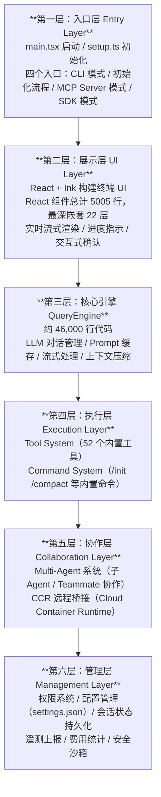
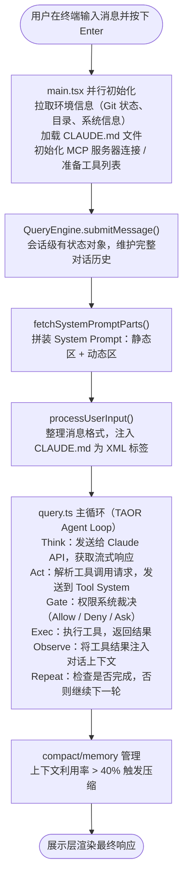
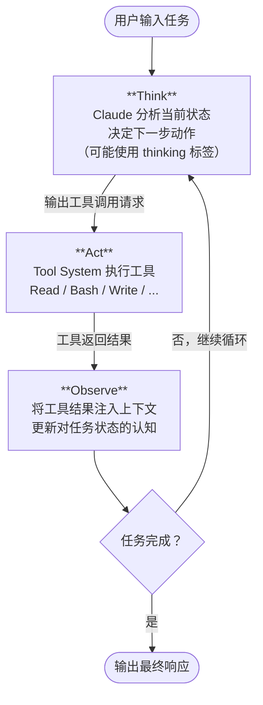
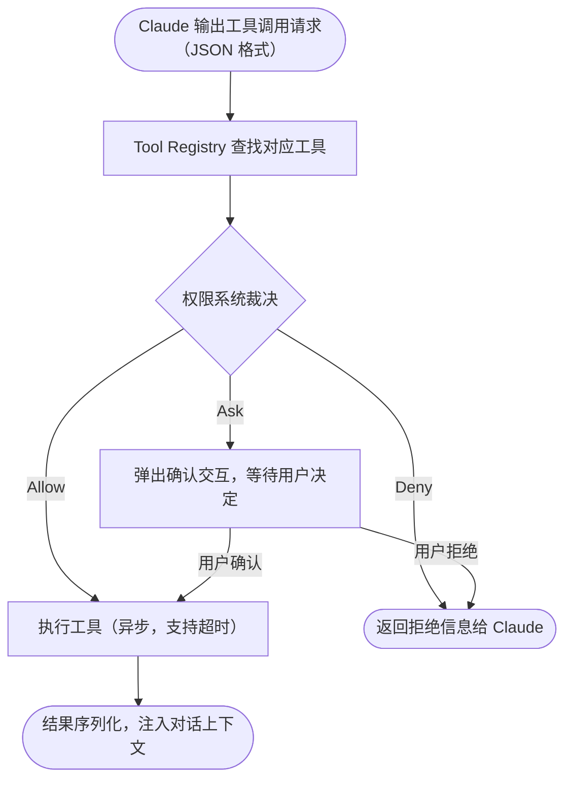

# 15.2 核心架构深度解析

> 🏗️ *"The best architectures are the ones where the design decisions are invisible — you only notice them when something goes wrong."*  
> —— 源自 Claude Code 源码注释（2026年3月意外泄露）

---

## 从外到内：Claude Code 是怎么运行的？

当你在终端输入 `claude` 并按下回车，接下来发生了什么？

表面上看，你得到了一个交互式的 AI 助手。但在这背后，运行着一套精心设计的六层架构，处理着从用户输入到 LLM 推理、工具执行、权限控制的完整流程。

2026年3月的源码泄露事件，让工程师们第一次完整地看到了这套系统的全貌。

---

## 一、六层分层架构总览

Claude Code 采用严格的六层分层架构，每一层职责清晰、边界明确：



**技术栈**：TypeScript + Bun 运行时（而非传统 Node.js），通过 esbuild 打包为单一 `cli.js` 文件分发。

---

## 二、运行主链路：一次请求的完整旅程

理解 Claude Code 最直接的方式，是跟踪一次用户输入从进入到响应的完整路径：



这个循环可以持续数十轮甚至更多，直到 Claude 判断任务完成或用户中断。

---

## 三、TAOR Agent Loop：核心循环详解

TAOR（Think → Act → Observe → Repeat）是 Claude Code 的执行核心，也是它区别于"一问一答"式 AI 的根本所在：



**关键设计细节**：

1. **并行工具调用**：Claude 可以在单个 Think 步骤中请求多个工具并行执行（例如同时读取多个文件），大幅提升效率

2. **循环上限**：有内置的最大迭代次数（约 200 轮），防止无限循环消耗 token

3. **状态感知**：每次循环后，Claude 看到的是累积的完整上下文，而不是只有最新一步的结果

4. **中断机制**：用户按 ESC 或 Ctrl+C 可以随时中断当前循环

---

## 四、QueryEngine：46,000 行的大脑

QueryEngine 是 Claude Code 中最核心、最复杂的模块，约 46,000 行 TypeScript 代码，承担了几乎所有与 LLM 交互相关的核心逻辑：

### 主要职责

```typescript
class QueryEngine {
  // 1. 会话状态管理
  private conversationHistory: Message[];
  private sessionId: string;
  
  // 2. 核心方法
  async submitMessage(userInput: string): Promise<void> {
    // 构建完整上下文（System Prompt + 历史 + 新消息）
    const messages = this.buildContextWindow();
    
    // 流式调用 Anthropic API
    const stream = await anthropic.messages.stream({
      model: this.model,
      messages,
      system: await getSystemPrompt(this.tools, this.model),
      tools: this.tools.map(t => t.definition),
    });
    
    // 处理流式响应（工具调用 / 文本输出）
    await this.processStream(stream);
  }
  
  // 3. 上下文预算控制
  private checkContextBudget(): void {
    const usage = this.calculateContextUsage();
    if (usage > 0.4) {  // 40% 触发压缩
      this.triggerCompaction();
    }
  }
}
```

### 三级上下文压缩策略

当上下文窗口利用率升高时，QueryEngine 会按需触发压缩：

| 级别 | 触发条件 | 策略 | 信息保留 |
|------|---------|------|---------|
| **microcompact** | 利用率 > 40% | 轻量摘要 | 保留关键决策和文件变更记录 |
| **autocompact** | 利用率 > 60% | 深度压缩 | 只保留最重要的上下文摘要 |
| **full compact** | 手动 /compact 或利用率 > 80% | 完全重置 | 只保留核心状态，重新加载 CLAUDE.md |

**长期记忆（memdir）**：独立于上下文压缩，用于跨会话持久化重要信息，会话结束后写入磁盘，下次会话恢复。

---

## 五、Tool System：工具执行引擎

### 工具调用生命周期



### 内置工具分类

Claude Code 内置 52 个工具，按类型分组：

**文件操作类**（最常用）：
- `Read`：读取文件，支持行号范围、PDF、图片、Jupyter Notebook
- `Write`：写入/覆盖文件（使用前必须先 Read）
- `Edit`：精确字符串替换（比 Write 更安全，只发送 diff）
- `Glob`：文件模式搜索（`**/*.tsx`）
- `Grep`：内容搜索（基于 ripgrep，支持正则）

**执行类**：
- `Bash`：执行任意 Shell 命令（受权限控制）

**Agent 协作类**：
- `Agent`：创建并派遣子 Agent
- `SendMessage`：向 teammate 发送消息
- `TaskCreate/Update/List`：任务管理

**UI 交互类**：
- `AskUserQuestion`：向用户提问（支持单选/多选/代码预览）
- `EnterPlanMode`：进入规划模式等待用户审批

### FileEditTool 的"先读再改"原则

这是 Claude Code 中一个重要的工程约束：

```
编辑任何文件之前，必须先调用 Read 工具读取该文件的当前内容。

原因：
1. 防止 Claude 基于"假设内容"盲目修改文件
2. 确保 Edit 工具提供的 old_string 在文件中实际存在
3. 避免因文件版本不一致导致的错误

这不是提示词层面的建议，而是工具层面的强制约束——
如果没有先 Read，Edit 工具会返回错误。
```

---

## 六、React + Ink：为什么用 React 渲染终端？

一个令人意外的架构决策：Claude Code 使用 **React + Ink** 来构建终端 UI。

### Ink 是什么？

[Ink](https://github.com/vadimdemedes/ink) 是一个允许用 React 组件构建命令行界面的库。它把 React 的虚拟 DOM 映射到终端的 ANSI 转义码输出：

```tsx
// 实际上 Claude Code 的终端输出是这样生成的
function ConversationView({ messages }: Props) {
  return (
    <Box flexDirection="column">
      {messages.map(msg => (
        <MessageBlock
          key={msg.id}
          role={msg.role}
          content={msg.content}
          isStreaming={msg.isStreaming}
        />
      ))}
      <InputBox onSubmit={handleSubmit} />
    </Box>
  );
}
```

### 为什么选择这个方案？

1. **实时更新**：React 的响应式更新让流式输出的渲染变得简单——LLM 每输出一个 token，只需更新对应的 state，React 自动处理 DOM diff 和终端刷新

2. **复杂交互**：单选/多选提示、代码预览、进度条等复杂交互用 React 组件来描述比手写 ANSI 代码清晰得多

3. **代码复用**：部分 UI 逻辑可以在 CLI 和 Web 版本之间复用

4. **开发效率**：Anthropic 团队熟悉 React，使用 Ink 可以复用已有的 React 知识

**代价**：5005 行 React 组件代码，22 层嵌套深度，是 Claude Code 代码库中最复杂的部分之一。

---

## 七、四个入口模式

`setup.ts` 在启动时根据参数决定以哪种模式运行：

| 入口模式 | 触发方式 | 特点 |
|---------|---------|------|
| **CLI 模式** | 直接运行 `claude` | 交互式终端 UI，支持所有功能 |
| **Headless 模式** | `claude -p "..."` 或 `--print` | 无 UI，适合 CI/CD，单次任务执行 |
| **MCP Server 模式** | `claude --mcp-server` | 以 MCP 服务端形式运行，供其他工具调用 |
| **SDK 模式** | 通过 Agent SDK 调用 | 被另一个 Claude Code 实例作为子 Agent 调用 |

---

## 本节小结

| 概念 | 要点 |
|------|------|
| **六层架构** | 入口→展示→QueryEngine→执行→协作→管理，职责清晰分层 |
| **TAOR 循环** | Think→Act→Observe→Repeat，可持续数十轮直到任务完成 |
| **QueryEngine** | 46K 行核心引擎，负责上下文管理、压缩、LLM 通信 |
| **Tool System** | 52 个内置工具，"先读再改"强制约束防止盲目修改 |
| **React + Ink** | 用 React 组件渲染终端 UI，支持实时流式更新 |
| **并行工具调用** | 单次 Think 可并发执行多个工具，提升执行效率 |

> 💡 **核心洞察**：Claude Code 的架构将"AI 智能"（QueryEngine）和"可靠执行"（Tool System + 权限管理）明确分层——这正是第9章 Harness Engineering 的工程哲学在实践中的体现。

---

*上一节：[15.1 认识 Claude Code：从零到上手](./01_introduction.md)*  
*下一节：[15.3 源码解密：System Prompt 与权限工程](./03_source_code_analysis.md)*
