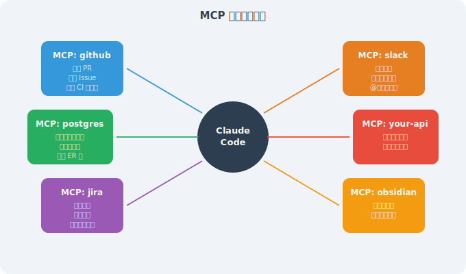
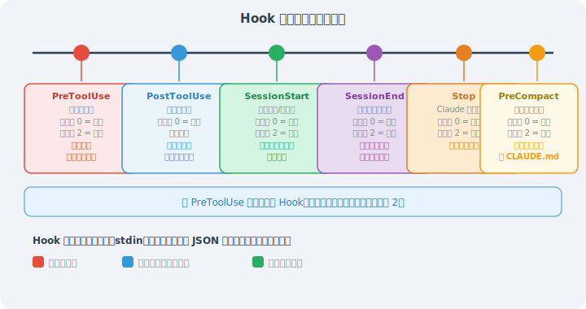
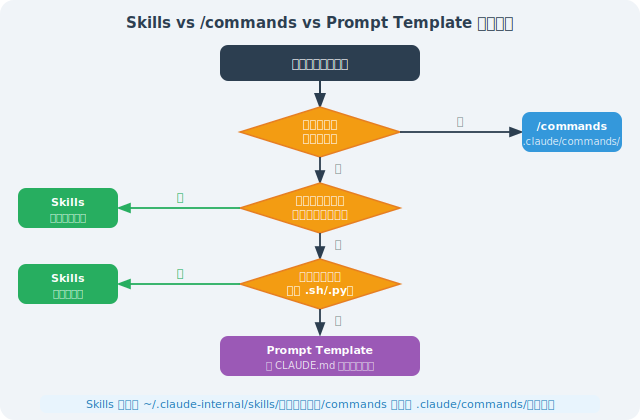
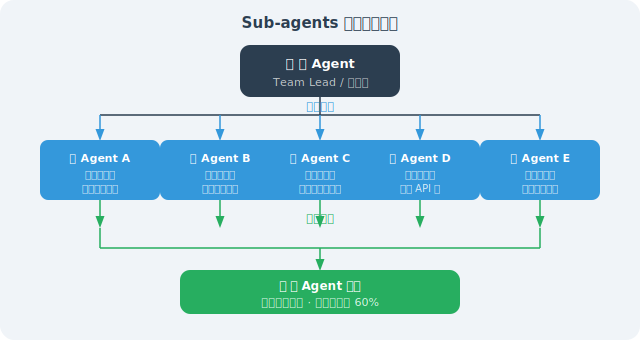
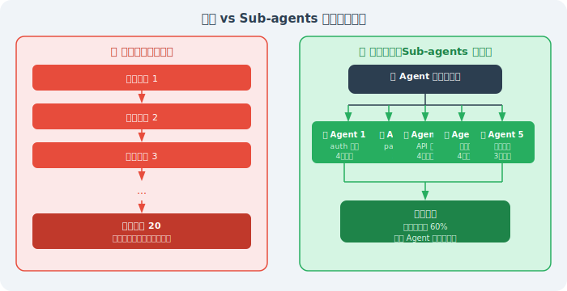
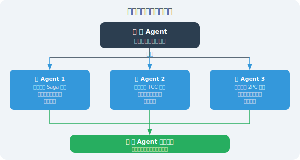
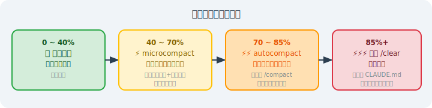
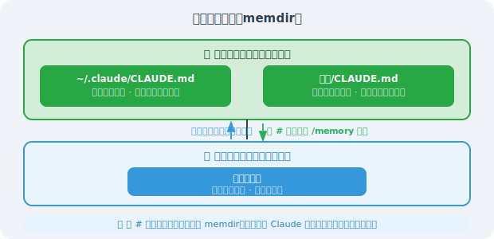

# 15.4 高级用法：MCP、Hooks 与 Skills

> 🔧 *"工具不是障碍，工具是杠杆。真正厉害的工程师，不是自己跑得快，而是把 Agent 配得好。"*

---

## 开篇：从"用工具"到"构建工具"

大多数人使用 Claude Code 的方式是：打开终端，开始对话，让它帮你写代码或修 Bug。

但 Claude Code 真正的威力，在于它的扩展能力。通过 MCP、Hooks 和 Skills，你可以将 Claude Code 改造成一个完全适配你团队工作流的专属 AI Agent——连接你的数据库、自动化你的 CI/CD、封装你的团队最佳实践。

本节深入四大进阶机制：**MCP**（连接外部工具生态）、**Hooks**（事件驱动自动化）、**Skills**（可复用能力包），以及 **Sub-agents + 上下文压缩**（驾驭复杂长任务）。

---

## 一、MCP（Model Context Protocol）：连接外部世界

### 1.1 MCP 是什么？

MCP（Model Context Protocol）是 Anthropic 主导的开放协议，让 AI 模型能够以标准化方式调用外部系统。可以把 MCP 理解为 AI 工具的 USB 接口——任何符合协议规范的"MCP 服务器"都可以即插即用地连接到 Claude Code。

**MCP 的三个核心原语**：

| 原语类型 | 作用 | 典型示例 |
|---------|------|---------|
| **Tools** | AI 可以调用的操作/函数 | 执行数据库查询、发送 API 请求、创建 GitHub Issue |
| **Resources** | AI 可以读取的数据资源 | 知识库文档、实时监控数据、项目 Wiki |
| **Prompts** | 可复用的提示模板 | 代码审查模板、PR 描述生成器、发布说明生成器 |

没有 MCP 时，Claude Code 只能操作本地文件系统和执行 Shell 命令。有了 MCP，它可以：



### 1.2 配置 MCP 服务器

MCP 服务器通过配置文件注册，支持**项目级**（`.mcp.json`，提交到 git，团队共享）和**用户级**（`~/.claude/settings.json`，个人私有）两种级别。

**项目级配置（推荐团队使用）：**

```json
// .mcp.json（放在项目根目录，提交 git，敏感信息用环境变量）
{
  "mcpServers": {
    "github": {
      "command": "npx",
      "args": ["-y", "@modelcontextprotocol/server-github"],
      "env": {
        "GITHUB_PERSONAL_ACCESS_TOKEN": "${GITHUB_TOKEN}"
      }
    },
    "postgres": {
      "command": "npx",
      "args": [
        "-y",
        "@modelcontextprotocol/server-postgres",
        "postgresql://localhost:5432/mydb"
      ],
      "env": {
        "PGPASSWORD": "${DB_PASSWORD}"
      }
    },
    "slack": {
      "command": "npx",
      "args": ["-y", "@modelcontextprotocol/server-slack"],
      "env": {
        "SLACK_BOT_TOKEN": "${SLACK_BOT_TOKEN}",
        "SLACK_TEAM_ID": "T0XXXXXXX"
      }
    }
  }
}
```

> ⚠️ **安全提醒**：敏感凭证（Token、密码）绝对不要硬编码在 `.mcp.json` 中。使用 `${ENV_VAR}` 语法引用环境变量，实际值配置在 CI/CD secrets 或本地 `.env` 文件（加入 `.gitignore`）中。

**用户级配置（个人私有工具）：**

```json
// ~/.claude/settings.json
{
  "mcpServers": {
    "obsidian": {
      "command": "npx",
      "args": ["-y", "mcp-obsidian", "/Users/me/Documents/MyVault"]
    },
    "internal-tools": {
      "command": "python",
      "args": ["/Users/me/.tools/internal_mcp.py"],
      "env": {
        "INTERNAL_API_TOKEN": "${INTERNAL_TOKEN}"
      }
    }
  }
}
```

启动 Claude Code 后，用 `/mcp` 命令查看所有已连接的 MCP 服务器状态：

```bash
$ claude
> /mcp
● github      (connected) — 12 tools available
● postgres    (connected) — 6 tools available
● slack       (connected) — 8 tools available
● obsidian    (error)     — Connection failed: vault not found
```

### 1.3 实用 MCP 服务器推荐

| MCP 服务器 | npm 包 | 主要用途 |
|-----------|--------|---------|
| **GitHub** | `@modelcontextprotocol/server-github` | 读写 Issues/PR/代码，自动化 Code Review |
| **PostgreSQL** | `@modelcontextprotocol/server-postgres` | 查询数据库、分析慢查询、生成 ER 图 |
| **Filesystem** | `@modelcontextprotocol/server-filesystem` | 跨目录文件操作（超出当前项目范围） |
| **Brave Search** | `@modelcontextprotocol/server-brave-search` | 实时网络搜索（需 Brave API Key） |
| **Slack** | `@modelcontextprotocol/server-slack` | 发送通知、读取频道、搜索消息 |
| **Jira/Confluence** | `mcp-atlassian` | 创建/更新 Jira 任务，关联代码提交 |
| **Obsidian** | `mcp-obsidian` | 读写个人知识库，沉淀开发笔记 |
| **Puppeteer** | `@modelcontextprotocol/server-puppeteer` | 浏览器自动化，端到端测试辅助 |

**实战案例：用 MCP 让 Claude Code 自动处理 PR Review**

```bash
# 在 Claude Code 中，直接用自然语言描述目标：
> 帮我查看最近 5 个未 Review 的 PR，找出其中有潜在安全问题的，
  写上详细的 Review 评论，并在 Slack #engineering 频道通知相关负责人

# Claude Code 会自动串联多个 MCP 工具完成任务：
# 1. github.list_pull_requests(state="open", per_page=5)
# 2. github.get_pull_request_diff(pr_number=...)
# 3. [分析代码安全性...]
# 4. github.create_review_comment(body="发现 SQL 注入风险...")
# 5. slack.post_message(channel="#engineering", text="@张三 你的 PR #42 需要关注...")
```

### 1.4 自建 MCP 服务器

当内置 MCP 服务器不能满足需求时，可以用 Python（fastmcp 库）快速自建：

```python
# internal_api_mcp.py
# 将公司内部 REST API 封装为 MCP 工具

import os
import httpx
from mcp.server import FastMCP

app = FastMCP("internal-company-tools")

INTERNAL_API_BASE = "https://api.internal.company.com"
API_TOKEN = os.environ["INTERNAL_API_TOKEN"]
HEADERS = {"Authorization": f"Bearer {API_TOKEN}"}

@app.tool()
async def get_deployment_status(service: str, env: str = "production") -> str:
    """
    查询指定服务在指定环境的部署状态。
    
    Args:
        service: 服务名称，如 "payment-service"
        env: 环境名称，可选 production/staging/dev
    """
    async with httpx.AsyncClient() as client:
        resp = await client.get(
            f"{INTERNAL_API_BASE}/deployments/{service}",
            params={"env": env},
            headers=HEADERS
        )
        data = resp.json()
    return f"{service} @ {env}: v{data['version']} ({data['health']}) - 上线时间: {data['deployed_at']}"

@app.tool()
async def create_incident(
    title: str,
    severity: str,
    description: str,
    affected_services: list[str]
) -> str:
    """
    在内部系统创建线上事故报告。
    
    Args:
        title: 事故标题
        severity: 严重程度，P0/P1/P2/P3
        description: 详细描述
        affected_services: 受影响的服务列表
    """
    async with httpx.AsyncClient() as client:
        resp = await client.post(
            f"{INTERNAL_API_BASE}/incidents",
            json={
                "title": title,
                "severity": severity,
                "description": description,
                "affected_services": affected_services
            },
            headers=HEADERS
        )
        incident = resp.json()
    return f"事故已创建：#{incident['id']} - 跟进链接: {incident['url']}"

@app.resource("deployments://all")
async def get_all_deployments() -> str:
    """获取所有服务当前部署状态的总览"""
    async with httpx.AsyncClient() as client:
        resp = await client.get(f"{INTERNAL_API_BASE}/deployments", headers=HEADERS)
    return resp.text  # 返回 YAML 格式的部署总览

if __name__ == "__main__":
    app.run()
```

```json
// .mcp.json 中注册自建服务器
{
  "mcpServers": {
    "internal-api": {
      "command": "python",
      "args": ["tools/internal_api_mcp.py"],
      "env": {
        "INTERNAL_API_TOKEN": "${INTERNAL_API_TOKEN}"
      }
    }
  }
}
```

---

## 二、Hooks：事件驱动的自动化

### 2.1 六种 Hook 事件详解

Hooks 是 Claude Code 的事件钩子系统，允许你在 Claude 执行操作的关键节点注入自定义逻辑。这是 Harness Engineering 的核心工具——通过 Hooks，你可以在**系统层面强制执行规范**，而不是依赖 Claude "记住"要遵守规范。



> 💡 **PreToolUse 是最强大的 Hook**：它是唯一能**阻断操作**的事件（退出码 2），可以用来实现"任何危险命令必须经过审批"这样的安全机制。

### 2.2 Hook 配置格式（settings.json）

Hooks 在 `.claude/settings.json`（项目级）或 `~/.claude/settings.json`（全局）中配置：

```json
{
  "hooks": {
    "PreToolUse": [
      {
        "matcher": "Bash",
        "hooks": [
          {
            "type": "command",
            "command": "python3 ~/.claude/hooks/audit_bash.py"
          }
        ]
      }
    ],
    "PostToolUse": [
      {
        "matcher": "Edit|Write|MultiEdit",
        "hooks": [
          {
            "type": "command",
            "command": "bash ~/.claude/hooks/auto_format.sh"
          }
        ]
      }
    ],
    "Stop": [
      {
        "matcher": ".*",
        "hooks": [
          {
            "type": "command",
            "command": "bash ~/.claude/hooks/notify_complete.sh"
          }
        ]
      }
    ],
    "PreCompact": [
      {
        "matcher": ".*",
        "hooks": [
          {
            "type": "command",
            "command": "python3 ~/.claude/hooks/save_state.py"
          }
        ]
      }
    ]
  }
}
```

Hook 脚本通过**标准输入（stdin）**接收工具调用的 JSON 数据：

```json
// PreToolUse 时，stdin 接收到的数据格式示例
{
  "hook_event_name": "PreToolUse",
  "tool_name": "Bash",
  "tool_input": {
    "command": "rm -rf /tmp/old-data",
    "description": "清理临时数据"
  },
  "session_id": "sess_abc123xyz"
}
```

### 2.3 实战 Hook 示例

#### 场景一：安全审计 Hook（PreToolUse）

记录所有 Bash 命令，自动阻断高危操作：

```python
#!/usr/bin/env python3
# ~/.claude/hooks/audit_bash.py

import json
import sys
import re
from datetime import datetime
from pathlib import Path

# 从 stdin 读取 Hook 事件数据
event = json.loads(sys.stdin.read())

tool_name = event.get("tool_name", "")
tool_input = event.get("tool_input", {})
command = tool_input.get("command", "")
session_id = event.get("session_id", "unknown")

# 写入审计日志（无论是否阻断，都记录）
audit_log = Path.home() / ".claude" / "audit.log"
audit_log.parent.mkdir(exist_ok=True)
with open(audit_log, "a") as f:
    log_entry = {
        "timestamp": datetime.now().isoformat(),
        "session_id": session_id,
        "tool": tool_name,
        "command": command
    }
    f.write(json.dumps(log_entry, ensure_ascii=False) + "\n")

# 高危命令模式检测
DANGER_PATTERNS = [
    (r"rm\s+-rf\s+/(?!\w)",     "删除根目录下文件"),
    (r"rm\s+-rf\s+~",           "删除 home 目录"),
    (r"curl\s+.*\|\s*(?:ba)?sh","管道执行远程脚本（供应链攻击风险）"),
    (r"chmod\s+777",             "设置777权限（安全风险）"),
    (r">\s*/etc/(?!hosts)",      "覆盖系统配置文件"),
    (r"dd\s+if=.*of=/dev/",     "直接写入块设备"),
]

for pattern, reason in DANGER_PATTERNS:
    if re.search(pattern, command):
        # 输出人类可读的阻断原因
        print(f"⛔ [安全审计] 操作已被阻断")
        print(f"   原因：{reason}")
        print(f"   命令：{command}")
        print(f"   如确需执行，请在终端中手动运行。")
        sys.exit(2)  # 退出码 2 = 阻断操作，Claude 会收到此消息

# 允许继续
sys.exit(0)
```

#### 场景二：代码规范 Hook（PostToolUse）

文件编辑后自动运行对应的 Linter/Formatter：

```bash
#!/bin/bash
# ~/.claude/hooks/auto_format.sh
# PostToolUse Hook：文件保存后自动格式化

# 从环境变量获取文件路径（Claude Code 自动注入）
FILE_PATH="${CLAUDE_TOOL_RESULT_FILE_PATH:-}"

# 如果没有文件路径（非文件操作），直接退出
if [[ -z "$FILE_PATH" ]] || [[ ! -f "$FILE_PATH" ]]; then
    exit 0
fi

# 获取文件扩展名
EXT="${FILE_PATH##*.}"

# 根据文件类型选择格式化工具
FORMAT_RESULT=0
case "$EXT" in
    py)
        # Python：先格式化，再检查
        ruff format "$FILE_PATH" 2>/dev/null && \
        ruff check --fix "$FILE_PATH" 2>/dev/null
        FORMAT_RESULT=$?
        ;;
    ts|tsx|js|jsx)
        # TypeScript/JavaScript：使用 Prettier
        npx prettier --write "$FILE_PATH" 2>/dev/null
        FORMAT_RESULT=$?
        ;;
    go)
        gofmt -w "$FILE_PATH" 2>/dev/null
        FORMAT_RESULT=$?
        ;;
    rs)
        rustfmt "$FILE_PATH" 2>/dev/null
        FORMAT_RESULT=$?
        ;;
    *)
        exit 0  # 不认识的类型，跳过
        ;;
esac

# 格式化成功时给 Claude 一个确认信号
if [[ $FORMAT_RESULT -eq 0 ]]; then
    echo "✅ 已自动格式化：$(basename "$FILE_PATH")"
fi

exit 0  # PostToolUse 不阻断，只是辅助动作
```

#### 场景三：任务完成通知 Hook（Stop 事件）

Claude 完成任务停止响应时，自动发送 Slack 通知：

```bash
#!/bin/bash
# ~/.claude/hooks/notify_complete.sh
# Stop Hook：Claude 停止响应时发送 Slack 通知

SLACK_WEBHOOK_URL="${SLACK_WEBHOOK_URL:-}"

# 如果没有配置 Webhook，静默退出
if [[ -z "$SLACK_WEBHOOK_URL" ]]; then
    exit 0
fi

PROJECT_NAME=$(basename "$(pwd)")
TIMESTAMP=$(date +"%Y-%m-%d %H:%M:%S")

# 构建 Slack Block Kit 消息
PAYLOAD=$(cat <<EOF
{
  "blocks": [
    {
      "type": "header",
      "text": {
        "type": "plain_text",
        "text": "🤖 Claude Code 任务完成"
      }
    },
    {
      "type": "section",
      "fields": [
        {"type": "mrkdwn", "text": "*项目：*\n\`${PROJECT_NAME}\`"},
        {"type": "mrkdwn", "text": "*完成时间：*\n${TIMESTAMP}"}
      ]
    }
  ]
}
EOF
)

# 异步发送通知（不阻塞 Claude 退出）
curl -s -X POST \
    -H "Content-type: application/json" \
    --data "$PAYLOAD" \
    "$SLACK_WEBHOOK_URL" &

exit 0
```

---

## 三、Skills：可复用能力包

### 3.1 什么是 Skills？

Skills 是 Claude Code 的**工作流模板系统**——把"你反复告诉 Claude 的事情"打包成一次性定义、永久可用的能力模块。

每当你发现自己在多个项目中都要给 Claude 说同样的话（"帮我做 Code Review，关注这几个维度……"、"帮我生成 CHANGELOG，按照这个格式……"），就说明这段工作流应该被 Skill 化。

**Skills vs `/commands` 的核心区别：**

| 对比维度 | Skills | `/commands` |
|---------|--------|-------------|
| **存储位置** | `~/.claude-internal/skills/` | `.claude/commands/` |
| **作用范围** | **全局**，所有项目可用 | **项目级**，仅当前项目 |
| **内容复杂度** | 完整 Markdown 指令 + 附属脚本/模板 | 单一 Markdown 提示文件 |
| **适合场景** | 跨项目通用工作流（Code Review、部署流程） | 项目特定操作（运行测试、更新版本号） |
| **触发方式** | Skill 工具自动识别并调用 | 用户手动输入 `/command-name` |

### 3.2 创建自己的 Skill

以"标准化 Code Review"Skill 为例，完整目录结构如下：

```
~/.claude-internal/skills/
└── code-review/
    ├── SKILL.md                    # Skill 主文件（必须）
    ├── checklists/
    │   ├── security.md             # 安全审查清单
    │   ├── performance.md          # 性能审查清单
    │   └── maintainability.md      # 可维护性清单
    └── templates/
        └── review-report.md        # 审查报告模板
```

**SKILL.md 示例（Code Review Skill）：**

```markdown
# Skill: Code Review

对代码变更进行系统化的多维度审查，输出结构化审查报告。

## 触发条件
当用户要求进行代码审查、review PR、检查代码质量时触发此 Skill。

---

## 执行流程

### 第一步：获取变更范围
如果是 PR Review，先运行：
```bash
git diff main...HEAD --stat      # 了解变更文件列表
git diff main...HEAD             # 获取完整 diff
```

如果是直接代码审查，读取相关文件。

### 第二步：按维度审查

**安全性**（参考 checklists/security.md）：
- SQL 注入、XSS、CSRF 风险
- 敏感信息是否被硬编码（密码、Token、私钥）
- 权限检查是否完整（认证/授权边界）
- 输入校验是否覆盖所有入口

**性能**（参考 checklists/performance.md）：
- 是否存在 N+1 查询问题
- 循环内是否有不必要的数据库/API 调用
- 大列表是否有分页处理
- 是否有明显的内存泄漏风险

**可维护性**（参考 checklists/maintainability.md）：
- 函数长度是否合理（建议 < 50 行）
- 命名是否清晰自描述
- 复杂逻辑是否有注释
- 测试覆盖是否充分

### 第三步：输出报告

使用 templates/review-report.md 格式输出：
- **🔴 严重问题**（必须修复，阻塞合并）：附文件名、行号、修复建议
- **🟡 改进建议**（非阻塞，但建议处理）：列出改进方向
- **🟢 优点**（值得肯定的地方）：至少指出 1-2 个亮点
- **📊 总体评价**：建议合并 / 修复后合并 / 需要重大修改

---

## 约束
- 报告使用中文
- 每个问题附具体文件名和行号
- 严重问题必须提供修复示例代码
- 报告总长度不超过 800 字，重点突出
```

### 3.3 Skills vs Prompt Templates：如何选择？



---

## 四、Sub-agents：并行任务执行

### 4.1 AgentTool 的工作原理

Claude Code 通过内置的 `AgentTool` 派遣**子 Agent** 执行专项任务。每个子 Agent 是一个完全独立的 Claude 实例：



**子 Agent 的四个关键特性：**

1. **独立上下文**：子 Agent 有全新的上下文窗口，不会被主 Agent 的长对话历史污染，推理质量更高
2. **任务隔离**：子 Agent 的错误和中间状态不会扩散到其他 Agent（对抗"污染效应"）
3. **bubble 权限模式**：子 Agent 使用内部 `bubble` 权限模式，权限决策会冒泡给父 Agent 处理，保证安全边界
4. **并行加速**：多个子 Agent 可以同时运行，将原本串行的任务并行化，大幅缩短执行时间

### 4.2 实用场景

**场景一：并行代码审查**



**场景二：多文件重构协调**

```
# 将遗留的 UserService 迁移到新的 AuthService

主 Agent：
1. 先扫描所有引用 UserService 的文件，按模块分组
2. 为每个模块派遣一个子 Agent（在独立 git worktree 中工作）
3. 等待所有子 Agent 完成迁移
4. 合并所有 worktree 的变更
5. 派一个验证 Agent 运行完整测试套件
6. 确认测试全部通过后，合并到主分支
```

**场景三：复杂研究任务拆分**



---

## 五、上下文压缩（三级策略）

随着对话深入，上下文窗口会逐渐填满——研究数据表明，**上下文利用率超过 70% 时，推理质量开始明显下降**（Claude 会"偷工减料"：静默跳过步骤、简化输出、过早声称完成）。

Claude Code 提供了三级压缩策略来应对这一问题：

### 5.1 三级压缩机制



    85% 以上： ⚡⚡⚡ 建议手动 /clear（完全重置）
               保留：CLAUDE.md 中的项目配置（下次自动加载）
               丢弃：所有对话历史
               适用：切换到全新任务，或上下文严重污染时
```

### 5.2 手动控制压缩

```bash
# 方式一：在对话中手动触发压缩，并指定保留什么
> /compact 请保留：当前正在重构的 PaymentService，
           以及我们确定的接口设计：createOrder/cancelOrder/refund

# 方式二：完全清空，开始新任务
> /clear

# 方式三：查看当前上下文使用情况
> /status
```

### 5.3 memdir：长期记忆机制

Claude Code 将**长期记忆**和**会话状态**分开管理，避免压缩时丢失重要信息：



**往长期记忆写入信息的两种方式：**

```bash
# 方式一：# 快捷键（最快）
> # 支付模块数据库连接池最大值必须是 50，超出会触发 RDS 连接数限制

# 方式二：/memory 命令（可管理）
> /memory
# 打开记忆编辑器，可以查看、编辑、删除所有已保存的记忆条目
```

> 💡 **最佳实践**：每次长任务完成后，用 `#` 快捷键把关键决策（"为什么选择这个方案"）和约束（"这个函数不能动"）存入 memdir。下次会话 Claude 会自动加载，无需重复解释背景。

---

## 本节小结

| 机制 | 核心价值 | 配置位置 | 学习优先级 |
|------|---------|---------|-----------|
| **MCP** | 连接 GitHub/数据库/Slack 等外部系统 | `.mcp.json` | ⭐⭐⭐ 高 |
| **PreToolUse Hook** | 安全审计、危险操作拦截（唯一能阻断操作的机制） | `settings.json` | ⭐⭐⭐ 高 |
| **PostToolUse Hook** | 自动格式化、Lint、触发测试 | `settings.json` | ⭐⭐⭐ 高 |
| **Stop Hook** | 任务完成通知（Slack/邮件/自定义） | `settings.json` | ⭐⭐ 中 |
| **PreCompact Hook** | 保护不可丢失的状态 | `settings.json` | ⭐⭐ 中 |
| **Skills** | 跨项目工作流复用，消除重复沟通 | `~/.claude-internal/skills/` | ⭐⭐ 中 |
| **Sub-agents** | 并行处理复杂长任务，保持推理质量 | 自然语言指令即可触发 | ⭐⭐ 中 |
| **上下文压缩** | 长任务质量保障，对抗上下文焦虑 | `/compact`、`/clear` | ⭐⭐ 中 |
| **memdir** | 跨会话知识沉淀，避免反复解释背景 | `#` 快捷键或 `/memory` | ⭐⭐ 中 |

> 💡 **核心洞察**：MCP + Hooks 是 Claude Code 进阶使用的黄金组合——MCP 扩展了 Claude 能触达的世界，Hooks 保证了 Claude 的每一步操作都在你的掌控之中。两者结合，才能放心地让 Claude Code 在生产环境中长时间自动运行。
>
> 如果只能选一个进阶功能先上手，推荐从 **PostToolUse Hook（保存文件后自动运行 linter）** 开始——10 行 Shell 脚本，立竿见影地提升代码质量下限。

---

*上一节：[15.3 源码解密：System Prompt 与权限工程](./03_source_code_analysis.md)*

*下一节：[15.5 生产实践：在团队中用好 Claude Code](./05_best_practices.md)*
