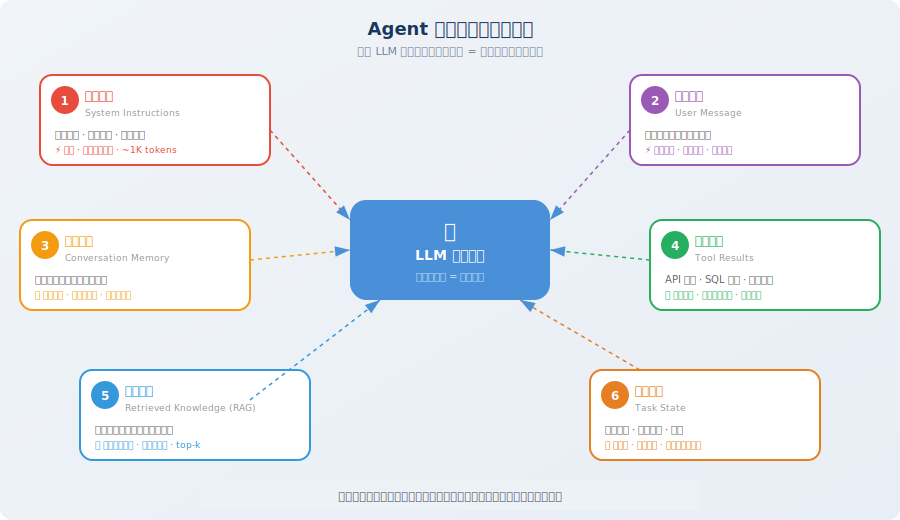

# 从提示工程到上下文工程

> 📖 *"Prompt Engineering 是对 LLM 说什么，Context Engineering 是让 LLM 看到什么。"*

在 Agent 开发的实践中，很多开发者会遇到一个困惑：明明 prompt 写得很精心，Agent 在前几轮对话中表现很好，但随着交互深入，它开始"发挥失常"——忘记之前说过的话、重复执行已完成的步骤、甚至偏离了原始目标。这不是模型的问题，而是**上下文管理**的问题。

这种现象在短对话中不容易暴露。当你只做一轮问答时，prompt 就是全部——你精心组织了一段指令，LLM 立刻给出漂亮的回答，一切看起来完美。但 Agent 不是单轮对话。一个真实的 Agent 可能会连续执行 50 次工具调用、累积 30 轮对话历史、从知识库检索 10 篇文档——这些信息像滚雪球一样增长，很快就把你精心编写的 prompt 淹没在了信息的海洋中。

本节将带你从提示工程的视角跨越到上下文工程的视角，理解这个范式转变为什么对 Agent 开发如此关键。读完本节后，你会重新审视自己以往写 Agent 的方式——从"怎么写一个好 prompt"升级为"怎么构建一个好的信息环境"。

## 提示工程的局限

你可能已经花了大量时间学习如何写好 Prompt——用 Chain-of-Thought（CoT）引导推理 [1]、用 Few-shot 提供示例 [2]、用角色设定约束行为。这些技巧在简单的"一问一答"场景中非常有效，它们是 LLM 应用的基本功。

但当你开始构建 **Agent** 时，会发现 Prompt Engineering 只能解决一部分问题——确切地说，它只能帮你管理上下文中**最小的那一块**。让我们看一个真实的 Agent 调用场景，直观感受这个差异：

```python
# 一个典型的 Agent 上下文包含远不止 prompt

agent_context = {
    # ① System Prompt（提示工程关注的部分）
    "system_prompt": "你是一个数据分析专家...",
    
    # ② 对话历史（可能长达数十轮）
    "conversation_history": [...],   # 20 轮 × 每轮 500 tokens = 10,000 tokens
    
    # ③ 工具调用结果（可能非常冗长）
    "tool_results": [...],           # SQL 查询结果、API 返回值
    
    # ④ 检索到的知识（RAG 结果）
    "retrieved_documents": [...],    # 相关文档片段
    
    # ⑤ 当前任务状态
    "task_state": {...},             # 已完成的步骤、中间结果
    
    # ⑥ 环境信息
    "environment": {...},            # 时间、用户偏好、系统状态
}

# 问题：这些信息加在一起可能超过 100,000 tokens！
# Prompt Engineering 无法告诉你：哪些该放进去，哪些该丢弃
```

关键问题在于：**System Prompt 通常只占上下文的不到 1%**，而真正决定 Agent 行为质量的，是剩下那 99% 的信息——对话记忆、工具结果、检索文档、任务状态。提示工程没有教我们如何管理这些信息。

这就好比一位导演精心打磨了开场白（prompt），却对整部电影的剧本走向（上下文）放任不管——观众看到的最终效果，当然不可能好。

> 💡 **一个实际的数据**：在生产环境中的 Coding Agent（如 Cursor、Devin）中，一次推理调用的上下文可能包含：系统指令（~1K tokens）+ 项目结构（~3K）+ 相关文件内容（~30K）+ 对话历史（~10K）+ 工具调用结果（~20K）+ 检索文档（~5K）= **总计约 70K tokens**。其中 system prompt 仅占 ~1.4%。这意味着你花 80% 的时间打磨的 prompt，在实际运行时只影响了上下文的 1.4%。如果你不管理剩下的 98.6%，再好的 prompt 也救不了你。

## 上下文工程的定义

**上下文工程（Context Engineering）** 是一门系统性的工程学科，研究如何为 LLM 的每次推理调用**构建最优的信息输入** [3]。

它回答的核心问题是：

> **在有限的上下文窗口中，如何确保 LLM 在需要做决策的那一刻，恰好看到了做出正确决策所需的全部信息？**

这个定义看起来简单，但每一个关键词都值得深入品味：

- **系统性**：不是临时的、零散的优化，而是一套完整的方法论和工程实践。就像软件工程不只是"写代码"一样，上下文工程也不只是"拼接几条消息"——它涉及信息收集、筛选、压缩、布局等多个环节的协同。
- **每次推理**：上下文不是一成不变的，每次 LLM 调用都需要重新构建最优上下文。第 1 轮和第 30 轮的最优上下文完全不同——信息在不断产生，旧信息在不断过时，你需要动态地决定"此刻该看什么"。
- **最优信息输入**：不是"越多越好"，也不是"越少越好"，而是在有限预算内选出**最优子集**。往上下文里塞太多无关信息，反而会降低 LLM 的表现（我们将在 8.2 节详细讨论这个违反直觉的现象）。

你可以把上下文工程类比为**为一位顶级医生准备病历**：好的病历不是把病人出生以来的所有医疗记录堆在一起，而是精心挑选与当前症状最相关的检查报告、用药史和关键指标，按照医生容易快速阅读的格式组织好。


### 关键区别

理解提示工程和上下文工程的区别，是建立正确心智模型的第一步。很多开发者之所以在 Agent 开发中碰壁，恰恰是因为他们把"提示工程"的思维模式带到了"上下文工程"的问题领域——这就像用锤子的思维去解决需要螺丝刀的问题。

下面这张表格从 7 个维度对比了两者的差异，你可以逐行阅读，感受思维转变的方向：

| 维度 | 提示工程 (Prompt Engineering) | 上下文工程 (Context Engineering) |
|------|---------|-----------|
| **关注点** | 怎么"说"（措辞、格式、技巧） | 让 LLM "看到"什么（信息选择与组织） |
| **作用范围** | 单次 LLM 调用 | 整个 Agent 生命周期 |
| **核心挑战** | 让 LLM 理解意图 | 在有限窗口中放入最相关的信息 |
| **静态 vs 动态** | 通常是静态模板 | 随任务执行动态调整 |
| **典型输入大小** | 几百~几千 tokens | 几千~几十万 tokens |
| **信息来源** | 开发者手写 | 多来源自动聚合（工具、RAG、记忆、状态） |
| **评估标准** | 输出质量 | 信息效率（单位 token 的信息价值） |
| **类比** | 给医生描述症状的技巧 | 为医生准备完整的病历、检查报告、用药史 |

最后一行的类比特别重要：提示工程教你如何清晰、准确地向医生描述症状，这当然有价值；但上下文工程教你在看病之前，就把病历本、体检报告、X 光片、过敏史全都整理好，按医生最习惯的阅读顺序排列好。优秀的病历准备，能让医生在 30 秒内抓住关键信息，做出准确判断；而一堆杂乱的文件，即使每份单独看都没问题，放在一起也会让医生手忙脚乱。

> 💡 **一句话总结**：提示工程是上下文工程的**子集**。当你优化 system prompt 时，你在做提示工程；当你管理整个信息流——包括决定哪些对话历史要保留、哪些工具结果要压缩、检索文档按什么顺序排列——你在做上下文工程。两者不是互斥的，而是层次递进的。

### 真实场景对比

为了更具体地理解两者的区别，看看同一个任务在两种思维下的不同处理方式：

```python
# 场景：Agent 正在帮用户分析数据，已经进行了 25 轮对话

# 🔴 仅用提示工程的思维
# 开发者只优化了 system prompt，然后把所有历史都塞进去
messages = [
    {"role": "system", "content": very_well_crafted_system_prompt},  # 精心打磨
    *all_25_rounds_of_conversation,  # 全部堆进去，约 15K tokens
    *all_tool_results,               # SQL 返回的完整表格数据，约 30K tokens
    *retrieved_docs,                 # RAG 返回的 5 篇文档，约 10K tokens
    {"role": "user", "content": current_question},
]
# 结果：55K+ tokens，大量无关信息，LLM 注意力被稀释，回答质量下降

# 🟢 用上下文工程的思维
# 对每类信息进行智能管理
messages = context_engine.build(
    system_prompt=system_prompt,                     # ~1K tokens
    task_state=extract_current_task_state(),          # ~500 tokens（结构化摘要）
    agent_notes=notepad.to_context_string(),          # ~800 tokens（关键发现）
    conversation=compress_old_history(                 # ~3K tokens（早期对话压缩为摘要）
        all_25_rounds, keep_recent=5
    ),
    tool_results=select_relevant_results(             # ~5K tokens（只保留相关结果）
        all_tool_results, current_question
    ),
    retrieved_docs=top_k_by_relevance(docs, k=2),    # ~4K tokens（只取最相关的 2 篇）
    user_message=current_question,                    # ~100 tokens
)
# 结果：~14K tokens，信息密度高，关键信息放在最优位置，回答质量稳定
```

## 上下文的六大信息源

一个 Agent 的上下文通常由以下**六类信息**组合而成。理解这些信息源是上下文工程的基础——你需要知道"原材料"是什么，才能做好"信息料理"。

这六类信息各有特点，有的稳定不变（如系统指令），有的随时膨胀（如工具结果），有的需要精心筛选（如检索知识）。真正的上下文工程师，需要像一位经验丰富的厨师那样——知道每种食材的特性，才能搭配出最佳的"菜品"（上下文）。



下面的代码定义了这六大信息源的数据结构。请注意每个字段上方的注释——它们解释了该信息源的核心特征和在上下文中的角色：

```python
from dataclasses import dataclass, field
from typing import Optional

@dataclass
class AgentContext:
    """Agent 上下文的六大信息源"""
    
    # 1. 系统指令：定义 Agent 的角色、能力和行为规范
    #    特点：静态、不变、token 占比小但权重极高
    system_instructions: str = ""
    
    # 2. 用户输入：当前轮的用户请求
    #    特点：每轮变化、必须完整保留、位于上下文末尾（最高注意力）
    user_message: str = ""
    
    # 3. 对话记忆：历史对话的关键信息
    #    特点：随轮次增长、需要裁剪或压缩、越新越重要
    conversation_memory: list[dict] = field(default_factory=list)
    
    # 4. 工具状态：工具调用的历史结果
    #    特点：可能非常冗长（SQL 返回表格、API JSON）、需要摘要压缩
    tool_history: list[dict] = field(default_factory=list)
    
    # 5. 检索知识：从外部知识库检索到的相关文档
    #    特点：需要按相关性评分筛选、可能包含噪音
    retrieved_knowledge: list[str] = field(default_factory=list)
    
    # 6. 任务状态：当前任务的执行进度和中间结果
    #    特点：高度结构化、应放在注意力敏感区域
    task_state: Optional[dict] = None
    
    def total_tokens(self) -> int:
        """估算当前上下文的总 token 数"""
        # 简化估算：1 token ≈ 4 个英文字符 ≈ 1.5 个中文字符
        total_text = (
            self.system_instructions 
            + self.user_message 
            + str(self.conversation_memory)
            + str(self.tool_history)
            + "".join(self.retrieved_knowledge)
            + str(self.task_state)
        )
        return len(total_text) // 4  # 粗略估算
    
    def is_within_budget(self, max_tokens: int = 128000) -> bool:
        """检查是否在上下文窗口预算内"""
        return self.total_tokens() < max_tokens


# 示例：一个典型的 Agent 调用
context = AgentContext(
    system_instructions="你是一个资深数据分析师...",       # ~500 tokens
    user_message="分析上个月的用户留存率变化趋势",          # ~50 tokens
    conversation_memory=[                                  # ~3,000 tokens
        {"role": "user", "content": "先看看整体数据..."},
        {"role": "assistant", "content": "好的，我来查询..."},
        # ... 更多历史
    ],
    tool_history=[                                         # ~5,000 tokens
        {"tool": "sql_query", "result": "...大量查询结果..."},
    ],
    retrieved_knowledge=[                                   # ~2,000 tokens
        "留存率分析最佳实践：...",
        "公司上月运营报告摘要：...",
    ],
    task_state={                                           # ~500 tokens
        "completed_steps": ["数据查询", "基础统计"],
        "current_step": "趋势分析",
        "intermediate_results": {"day7_retention": 0.42},
    },
)

print(f"预估上下文大小: {context.total_tokens()} tokens")
print(f"在 128K 窗口内: {context.is_within_budget()}")
```

### 六大信息源的特性对比

了解了六大信息源的基本定义之后，一个自然的问题是：**管理这些信息源的策略有什么不同？** 答案是：完全不同。有的信息必须一字不差地保留（如用户的当前消息），有的可以大胆压缩（如旧的工具调用返回值），有的需要放在上下文的特定位置才能发挥最大作用。

下面这张表格是上下文工程实践中最常用的参考之一——当你在设计自己的 Agent 时，可以根据这张表来决定每类信息的处理策略：

| 信息源 | 变化频率 | 典型大小 | 可压缩性 | 管理策略 |
|--------|---------|---------|---------|---------|
| 系统指令 | 不变 | 500~2K tokens | 低（必须完整） | 始终保留，放在开头 |
| 用户输入 | 每轮变化 | 50~500 tokens | 低（必须完整） | 始终保留，放在末尾 |
| 对话记忆 | 持续增长 | 1K~50K tokens | 高（可摘要） | 滑动窗口 + 摘要压缩 |
| 工具结果 | 随调用增长 | 500~100K tokens | 高（可提取关键数据） | 只保留最近 + 结构化摘要 |
| 检索知识 | 每轮检索 | 1K~20K tokens | 中（可筛选） | 按相关性 top-k 筛选 |
| 任务状态 | 随任务更新 | 200~3K tokens | 低（已是结构化的） | 始终保留，放在高注意力区域 |

## 上下文工程的三大原则

有了六大信息源的认知基础，接下来我们需要掌握管理这些信息的三大核心原则。这三个原则贯穿整个上下文工程的实践——无论你用什么框架、什么模型，只要涉及上下文管理，这三个原则都是你的行动指南。

你可以把它们看作上下文工程的"第一性原理"：**相关性优先**回答"放什么进去"，**结构化呈现**回答"怎么组织"，**动态裁剪**回答"什么时候调整"。

### 原则一：相关性优先

**核心思想**：不是把所有信息都塞进上下文，而是只放入**与当前决策最相关**的信息。

这个原则看起来简单得像废话——"当然要放相关的信息啊！"但在实际工程中，违反它的情况比比皆是。最常见的反模式就是"全量塞入"——把所有对话历史、所有工具结果、所有检索文档一股脑地放进上下文，心想"给模型越多信息越好"。

事实恰恰相反。研究反复证明：**在上下文中添加不相关的信息，不仅浪费 token，还会主动降低 LLM 的推理准确率**。这被称为"注意力稀释"效应——LLM 的注意力被分散到了无关信息上，导致它更难聚焦于真正重要的内容。就像考试时给你一本字典让你"参考"——理论上信息更多了，但实际上只会分散你的注意力。

```python
# ❌ 反模式：把所有对话历史都放进去
messages = full_conversation_history  # 可能几万 tokens，大量无关信息

# ✅ 正确做法：只保留相关的历史
def select_relevant_history(
    history: list[dict], 
    current_task: str, 
    max_turns: int = 10
) -> list[dict]:
    """选择与当前任务最相关的历史"""
    # 策略1：保留最近的 N 轮（时间相关性）
    recent = history[-max_turns:]
    
    # 策略2：从更早的历史中挑选与当前任务相关的轮次
    # （可以用 embedding 相似度来判断相关性）
    
    return recent
```

> 💡 **实践经验**：相关性筛选不仅能减少 token 消耗和 API 成本，更重要的是能**提升输出质量**。研究表明，在上下文中添加不相关的信息，反而会**降低** LLM 的推理准确率（即所谓的"注意力稀释"效应）。少即是多——这是上下文工程中最反直觉但最重要的认知之一。

在后续的 8.2 节中，我们会更详细地讨论 LLM 的注意力分布机制，那时你会从技术层面理解"为什么少反而更好"。

### 原则二：结构化呈现

**核心思想**：相同的信息，不同的组织方式会**显著影响** LLM 的理解效果。

这个原则的本质是：**信息的"包装"和信息的"内容"同样重要**。LLM 对结构化文本（Markdown 标题、表格、列表）的理解能力远优于非结构化的纯文本。好的上下文组织就像好的数据库 Schema——同样的数据，结构不同，查询效率天差地别。

为什么会这样？因为 LLM 本质上是在对文本进行"模式匹配"。当信息用清晰的层级结构组织时，LLM 能更快地定位所需内容；而当信息以散乱的自然语言呈现时，LLM 需要先"理解"文本结构，再提取有用信息——这个过程消耗了宝贵的推理能力。

来看一个直观的对比：

```python
# ❌ 杂乱的上下文：信息是对的，但 LLM 很难快速提取要点
messy_context = """
查询结果：用户数1000，留存率42%，上月45%，下降了3%，
另外DAU也在下降，从5000降到4500，MAU基本持平...
"""

# ✅ 结构化的上下文：相同信息，但 LLM 一目了然
structured_context = """
## 当前任务状态

### 已完成步骤
1. ✅ 数据查询：获取了 2025年2月 的用户数据
2. ✅ 基础统计：完成关键指标计算

### 关键数据摘要
| 指标 | 本月 | 上月 | 变化 |
|------|------|------|------|
| 7日留存率 | 42% | 45% | ↓ 3% |
| DAU | 4,500 | 5,000 | ↓ 10% |
| MAU | 15,000 | 15,200 | ↓ 1.3% |

### 当前步骤
正在进行：趋势分析（需要识别下降原因）
"""
```

**结构化呈现的实用技巧**：

- **用 Markdown 标题划分区域**：让 LLM 快速定位不同类型的信息
- **用表格呈现对比数据**：比自然语言描述更高效
- **用列表标记进度和状态**：✅ / 🔄 / ⬜ 比文字描述更直观
- **关键数据加粗或高亮**：引导 LLM 的注意力聚焦

### 原则三：动态裁剪

**核心思想**：上下文的内容应该**随着任务进展动态调整**，而不是一成不变。

这是最容易被忽略的原则。很多开发者在设计 Agent 时，会设定一个固定的上下文模板——"system prompt + 最近 10 轮对话 + 最新的工具结果"——然后在整个任务生命周期中一直使用这个模板。

但想想看：一个多轮对话的 Agent，第 1 轮和第 30 轮需要的上下文信息完全不同。初期需要更多的背景知识和任务描述，帮助 Agent 理解"要做什么"；后期则需要更多的中间结果和近期工具输出，帮助 Agent 决定"下一步怎么做"。如果你用同一个配比从头用到尾，就像让厨师做所有菜都放同样分量的盐——注定不会好吃。

动态裁剪就是根据当前阶段，智能地调整上下文的"配比"。下面的代码展示了一个简单但有效的实现：

```python
class DynamicContextManager:
    """动态上下文管理器：按优先级裁剪，确保不超预算"""
    
    def __init__(self, max_tokens: int = 100000):
        self.max_tokens = max_tokens
        # 优先级数字越小 = 越重要 = 越不容易被裁剪
        self.priority_levels = {
            "system": 1,      # 最高优先级，永远保留
            "current_task": 2, # 当前任务信息
            "recent_tool": 3,  # 最近的工具结果
            "history": 4,      # 对话历史
            "knowledge": 5,    # 检索知识
        }
    
    def build_context(self, sources: dict) -> list[dict]:
        """按优先级构建上下文，确保不超预算"""
        context = []
        remaining_tokens = self.max_tokens
        
        # 按优先级从高到低填充
        for priority_name in sorted(
            self.priority_levels, 
            key=self.priority_levels.get
        ):
            if priority_name in sources:
                content = sources[priority_name]
                tokens = estimate_tokens(content)
                
                if tokens <= remaining_tokens:
                    context.append(content)
                    remaining_tokens -= tokens
                else:
                    # 超出预算，需要裁剪
                    truncated = truncate_to_fit(content, remaining_tokens)
                    context.append(truncated)
                    break
        
        return context
```

> 💡 **实践中的动态裁剪**：Anthropic 的 Claude Agent 在执行长任务时，会自动触发"compaction"（压缩整合）——当上下文接近窗口限制时，将历史对话压缩为精炼摘要，释放空间给新的工具结果和用户交互。这种"压力触发式"的动态裁剪，让 Agent 能在有限的窗口内持续高效工作。我们将在 3.3 节详细讲解这种策略的原理和实现。

## 从认知到实践：上下文工程的思维转变

掌握上下文工程，本质上是一种**思维方式的转变**——从"我要写一个好 prompt"到"我要管理一个好的信息流"。这个转变不是一蹴而就的，而是需要在实践中不断校正。

下面这个对照表总结了关键的思维升级。建议你在开发 Agent 时，时不时回来看看这张表——每当你发现自己在"改 prompt"但效果不佳时，右边那一列可能就是你真正需要做的事情：

| 旧思维（提示工程） | 新思维（上下文工程） |
|-------------------|-------------------|
| "我要写一个完美的 prompt" | "我要为每次推理构建最优的信息环境" |
| "把所有信息都给 LLM，让它自己挑" | "我来决定 LLM 看到什么、看不到什么" |
| "prompt 写好了就不用改了" | "上下文需要随任务进展动态调整" |
| "输出不好？改改 prompt 措辞" | "输出不好？检查上下文中是否缺少关键信息" |
| "token 预算不够？换更大窗口的模型" | "token 预算不够？压缩低优先级信息" |

这些思维转变并非否定提示工程的价值——好的 prompt 依然非常重要，它是上下文工程的基石。但如果你只停留在优化 prompt 的层面，就像一位建筑师只关心入口大门的设计，而忽略了整栋楼的结构——门再漂亮，楼不牢靠也没用。

## 本节小结

| 概念 | 说明 |
|------|------|
| **上下文工程** | 系统性地为 LLM 构建最优信息输入的工程学科 |
| **与提示工程的关系** | 提示工程是上下文工程的子集，后者范围更广、更动态 |
| **六大信息源** | 系统指令、用户输入、对话记忆、工具状态、检索知识、任务状态 |
| **三大原则** | 相关性优先（少即是多）、结构化呈现（格式即效率）、动态裁剪（随任务调整） |
| **核心思维转变** | 从"优化措辞"到"管理信息流" |

## 🤔 思考练习

1. 你使用过的 Agent 产品（如 ChatGPT、Claude、Cursor）中，有没有遇到过"聊着聊着就忘了之前说过什么"的情况？用上下文工程的六大信息源模型分析，是哪类信息的管理出了问题。
2. 如果一个 Agent 的上下文窗口只有 8K tokens（如部署在边缘设备上的小模型），你会如何分配预算给六大信息源？
3. 为什么说"往上下文中添加不相关的信息，反而会降低输出质量"？从 LLM 的注意力机制角度思考。

---

## 参考文献

[1] WEI J, WANG X, SCHUURMANS D, et al. Chain-of-thought prompting elicits reasoning in large language models[C]//NeurIPS. 2022.

[2] BROWN T B, MANN B, RYDER N, et al. Language models are few-shot learners[C]//NeurIPS. 2020.

[3] ANTHROPIC. Building effective agents[EB/OL]. 2024. https://www.anthropic.com/engineering/building-effective-agents.

---

*下一节：[8.2 上下文窗口管理与注意力预算](./02_context_window.md)*
