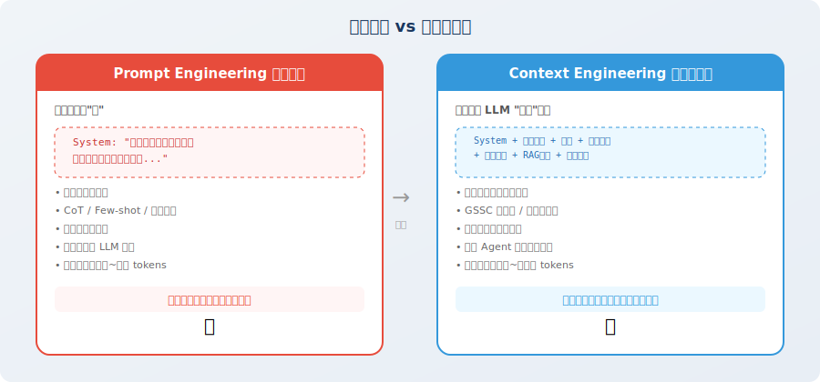

# 从提示工程到上下文工程

> 📖 *"Prompt Engineering 是对 LLM 说什么，Context Engineering 是让 LLM 看到什么。"*

## 提示工程的局限

你可能已经花了大量时间学习如何写好 Prompt——用 CoT 引导推理 [1]、用 Few-shot 提供示例 [2]、用角色设定约束行为。这些技巧在简单的"一问一答"场景中非常有效。

但当你开始构建 **Agent** 时，会发现 Prompt Engineering 只能解决一部分问题：

```python
# 一个典型的 Agent 上下文包含远不止 prompt

agent_context = {
    # ① System Prompt（提示工程关注的部分）
    "system_prompt": "你是一个数据分析专家...",
    
    # ② 对话历史（可能长达数十轮）
    "conversation_history": [...],   # 20 轮 × 每轮 500 tokens = 10,000 tokens
    
    # ③ 工具调用结果（可能非常冗长）
    "tool_results": [...],           # SQL 查询结果、API 返回值
    
    # ④ 检索到的知识（RAG 结果）
    "retrieved_documents": [...],    # 相关文档片段
    
    # ⑤ 当前任务状态
    "task_state": {...},             # 已完成的步骤、中间结果
    
    # ⑥ 环境信息
    "environment": {...},            # 时间、用户偏好、系统状态
}

# 问题：这些信息加在一起可能超过 100,000 tokens！
# Prompt Engineering 无法告诉你：哪些该放进去，哪些该丢弃
```

## 上下文工程的定义

**上下文工程（Context Engineering）** 是一门系统性的工程学科，研究如何为 LLM 的每次推理调用**构建最优的信息输入** [3]。

它回答的核心问题是：

> **在有限的上下文窗口中，如何确保 LLM 在需要做决策的那一刻，恰好看到了做出正确决策所需的全部信息？**



### 关键区别

| 维度 | 提示工程 | 上下文工程 |
|------|---------|-----------|
| **关注点** | 怎么"说"（措辞、格式、技巧） | 让 LLM "看到"什么（信息选择与组织） |
| **作用范围** | 单次调用 | 整个 Agent 生命周期 |
| **核心挑战** | 让 LLM 理解意图 | 在有限窗口中放入最相关的信息 |
| **静态 vs 动态** | 通常是静态模板 | 随任务执行动态调整 |
| **典型输入大小** | 几百~几千 tokens | 几千~几十万 tokens |
| **类比** | 给医生描述症状的技巧 | 为医生准备完整的病历、检查报告、用药史 |

## 上下文的六大信息源

一个 Agent 的上下文通常由以下六类信息组合而成：

```python
from dataclasses import dataclass, field
from typing import Optional

@dataclass
class AgentContext:
    """Agent 上下文的六大信息源"""
    
    # 1. 系统指令：定义 Agent 的角色、能力和行为规范
    system_instructions: str = ""
    
    # 2. 用户输入：当前轮的用户请求
    user_message: str = ""
    
    # 3. 对话记忆：历史对话的关键信息
    conversation_memory: list[dict] = field(default_factory=list)
    
    # 4. 工具状态：工具调用的历史结果
    tool_history: list[dict] = field(default_factory=list)
    
    # 5. 检索知识：从外部知识库检索到的相关文档
    retrieved_knowledge: list[str] = field(default_factory=list)
    
    # 6. 任务状态：当前任务的执行进度和中间结果
    task_state: Optional[dict] = None
    
    def total_tokens(self) -> int:
        """估算当前上下文的总 token 数"""
        # 简化估算：1 token ≈ 4 个英文字符 ≈ 1.5 个中文字符
        total_text = (
            self.system_instructions 
            + self.user_message 
            + str(self.conversation_memory)
            + str(self.tool_history)
            + "".join(self.retrieved_knowledge)
            + str(self.task_state)
        )
        return len(total_text) // 4  # 粗略估算
    
    def is_within_budget(self, max_tokens: int = 128000) -> bool:
        """检查是否在上下文窗口预算内"""
        return self.total_tokens() < max_tokens


# 示例：一个典型的 Agent 调用
context = AgentContext(
    system_instructions="你是一个资深数据分析师...",       # ~500 tokens
    user_message="分析上个月的用户留存率变化趋势",          # ~50 tokens
    conversation_memory=[                                  # ~3,000 tokens
        {"role": "user", "content": "先看看整体数据..."},
        {"role": "assistant", "content": "好的，我来查询..."},
        # ... 更多历史
    ],
    tool_history=[                                         # ~5,000 tokens
        {"tool": "sql_query", "result": "...大量查询结果..."},
    ],
    retrieved_knowledge=[                                   # ~2,000 tokens
        "留存率分析最佳实践：...",
        "公司上月运营报告摘要：...",
    ],
    task_state={                                           # ~500 tokens
        "completed_steps": ["数据查询", "基础统计"],
        "current_step": "趋势分析",
        "intermediate_results": {"day7_retention": 0.42},
    },
)

print(f"预估上下文大小: {context.total_tokens()} tokens")
print(f"在 128K 窗口内: {context.is_within_budget()}")
```

## 上下文工程的三大原则

### 原则一：相关性优先

不是把所有信息都塞进上下文，而是只放入**与当前决策最相关**的信息。

```python
# ❌ 错误做法：把所有对话历史都放进去
messages = full_conversation_history  # 可能几万 tokens

# ✅ 正确做法：只保留相关的历史
def select_relevant_history(
    history: list[dict], 
    current_task: str, 
    max_turns: int = 10
) -> list[dict]:
    """选择与当前任务最相关的历史"""
    # 策略1：保留最近的 N 轮
    recent = history[-max_turns:]
    
    # 策略2：从更早的历史中挑选与当前任务相关的轮次
    # （可以用 embedding 相似度来判断相关性）
    
    return recent
```

### 原则二：结构化呈现

相同的信息，不同的组织方式会显著影响 LLM 的理解效果。

```python
# ❌ 杂乱的上下文
messy_context = """
查询结果：用户数1000，留存率42%，上月45%，下降了3%，
另外DAU也在下降，从5000降到4500，MAU基本持平...
"""

# ✅ 结构化的上下文
structured_context = """
## 当前任务状态

### 已完成步骤
1. ✅ 数据查询：获取了 2025年2月 的用户数据
2. ✅ 基础统计：完成关键指标计算

### 关键数据摘要
| 指标 | 本月 | 上月 | 变化 |
|------|------|------|------|
| 7日留存率 | 42% | 45% | ↓ 3% |
| DAU | 4,500 | 5,000 | ↓ 10% |
| MAU | 15,000 | 15,200 | ↓ 1.3% |

### 当前步骤
正在进行：趋势分析（需要识别下降原因）
"""
```

### 原则三：动态裁剪

上下文的内容应该**随着任务进展动态调整**，而不是一成不变。

```python
class DynamicContextManager:
    """动态上下文管理器"""
    
    def __init__(self, max_tokens: int = 100000):
        self.max_tokens = max_tokens
        self.priority_levels = {
            "system": 1,      # 最高优先级，永远保留
            "current_task": 2, # 当前任务信息
            "recent_tool": 3,  # 最近的工具结果
            "history": 4,      # 对话历史
            "knowledge": 5,    # 检索知识
        }
    
    def build_context(self, sources: dict) -> list[dict]:
        """按优先级构建上下文，确保不超预算"""
        context = []
        remaining_tokens = self.max_tokens
        
        # 按优先级从高到低填充
        for priority_name in sorted(
            self.priority_levels, 
            key=self.priority_levels.get
        ):
            if priority_name in sources:
                content = sources[priority_name]
                tokens = estimate_tokens(content)
                
                if tokens <= remaining_tokens:
                    context.append(content)
                    remaining_tokens -= tokens
                else:
                    # 超出预算，需要裁剪
                    truncated = truncate_to_fit(content, remaining_tokens)
                    context.append(truncated)
                    break
        
        return context
```

## 本节小结

| 概念 | 说明 |
|------|------|
| **上下文工程** | 系统性地为 LLM 构建最优信息输入的工程学科 |
| **与提示工程的关系** | 提示工程是上下文工程的子集，后者范围更广 |
| **六大信息源** | 系统指令、用户输入、对话记忆、工具状态、检索知识、任务状态 |
| **三大原则** | 相关性优先、结构化呈现、动态裁剪 |

## 🤔 思考练习

1. 你使用过的 Agent 产品中，有没有遇到过"聊着聊着就忘了之前说过什么"的情况？用上下文工程的视角分析原因。
2. 如果一个 Agent 的上下文窗口只有 8K tokens，你会如何分配这个预算？

---

## 参考文献

[1] WEI J, WANG X, SCHUURMANS D, et al. Chain-of-thought prompting elicits reasoning in large language models[C]//NeurIPS. 2022.

[2] BROWN T B, MANN B, RYDER N, et al. Language models are few-shot learners[C]//NeurIPS. 2020.

[3] ANTHROPIC. Building effective agents[EB/OL]. 2024. https://www.anthropic.com/engineering/building-effective-agents.
