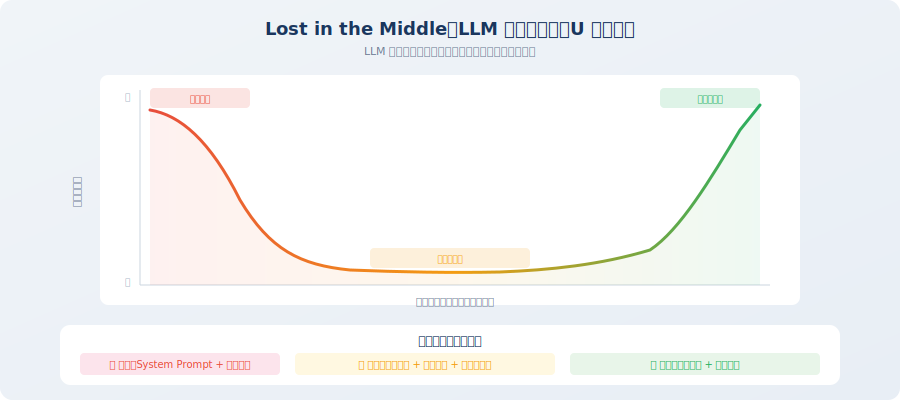

# 上下文窗口管理与注意力预算

> 📖 *"上下文窗口就像一张办公桌——桌面大小固定，你能同时摊开的文件数量有限。关键不是桌子有多大，而是你选择摊开哪些文件。"*

上一节我们建立了上下文工程的基本框架——六大信息源和三大原则。但在实践中，你会很快遇到两个核心问题：**上下文窗口是有限的**，以及 **LLM 对不同位置信息的关注程度并不均匀**。

第一个问题比较直观——窗口就那么大，信息塞不下了就要做取舍。但第二个问题更加隐蔽且致命：即使你的信息总量远未填满窗口，LLM 也未必能"看到"所有信息。它会天然地更关注某些位置、忽略其他位置。如果你不了解这种注意力分布的规律，就无法有针对性地安排信息的位置。

本节将深入探讨这两个问题，帮你建立"注意力预算"的思维模型，并掌握三种核心的上下文管理技术。这些内容是后续所有实践的理论基础——3.3 节的长时程策略和 3.4 节的 GSSC 流水线，都建立在本节的概念之上。

## 理解上下文窗口

### 什么是上下文窗口？

上下文窗口（Context Window）是 LLM 在一次推理中能够"看到"的**最大信息量**，以 token 数量衡量。你可以把它理解为 LLM 的"工作记忆容量"——超出窗口的信息，模型完全看不到，就像不存在一样。

这是一个硬性的物理限制，由模型架构在训练时决定。不同于人类可以"翻页"回顾之前的内容，LLM 只能看到当前窗口内的 token——窗口之外的信息对它而言是不可观测的。

不同模型的窗口大小差异显著，而且这个数字还在快速增长：

| 模型 | 上下文窗口 | 约等于 | 典型应用场景 |
|------|-----------|--------|------------|
| GPT-3.5 Turbo | 16K tokens | ~12,000 汉字 | 简单对话、短文本任务 |
| GPT-4o | 128K tokens | ~96,000 汉字 | 复杂 Agent 任务、长文档分析 |
| Claude 3.5 Sonnet | 200K tokens | ~150,000 汉字 | 完整代码库分析、深度研究 |
| Gemini 1.5 Pro | 1M tokens | ~750,000 汉字 | 超长视频/音频理解 |

从表格中可以看到，过去两年窗口大小经历了惊人的增长——从 GPT-3.5 的 16K 到 Gemini 的 1M，增长了超过 60 倍。很多人因此产生了一种乐观的想法："窗口够大了，上下文管理还有什么意义？" 

这种想法是危险的。

> 💡 **一个常见误解**："窗口越大，Agent 越好"。事实恰恰相反——研究表明，即使模型支持 1M tokens 的窗口，**在超过 ~64K tokens 后，推理质量就会明显下降**。更大的窗口是安全网，不是免费午餐。上下文管理永远必要。这就像一个人的书桌可以做到 10 米长，但他的有效工作区域还是面前那半米——东西堆得再多，能同时关注的信息量并不会线性增长。

### 上下文窗口的预算约束

有一个容易被忽视的事实：**输出 tokens 也要占用上下文窗口**。这意味着你的输入不能填满整个窗口——必须留出足够的空间给 LLM 生成回复。

这一点非常容易被忽略。假设你用的是 128K 窗口的模型，你可能会想"我有 128K 的空间放输入"。但实际上，如果 LLM 需要生成一个 4K tokens 的回复，你的输入上限就只有 124K。如果你把输入塞满了 128K，LLM 就连一个字都生成不出来——或者被迫截断输出。

下面这段代码封装了一个实用的预算检查函数，你可以在每次构建上下文时调用它来确保不超预算：

```python
# 上下文窗口的基本约束
def check_context_budget(
    system_prompt_tokens: int,
    conversation_tokens: int,
    tool_result_tokens: int,
    retrieved_docs_tokens: int,
    max_output_tokens: int,
    model_context_window: int = 128000,
) -> dict:
    """
    检查上下文预算
    注意：输出 tokens 也要占用上下文窗口！
    """
    total_input = (
        system_prompt_tokens 
        + conversation_tokens 
        + tool_result_tokens 
        + retrieved_docs_tokens
    )
    
    available_for_output = model_context_window - total_input
    
    return {
        "total_input_tokens": total_input,
        "available_for_output": available_for_output,
        "is_within_budget": available_for_output >= max_output_tokens,
        "utilization": total_input / model_context_window * 100,
    }

# 典型 Agent 场景
budget = check_context_budget(
    system_prompt_tokens=800,
    conversation_tokens=15000,   # 15 轮对话
    tool_result_tokens=20000,    # 多次工具调用结果
    retrieved_docs_tokens=5000,  # RAG 检索结果
    max_output_tokens=4096,
    model_context_window=128000,
)
print(f"输入占用: {budget['total_input_tokens']} tokens")
print(f"利用率: {budget['utilization']:.1f}%")
print(f"剩余输出空间: {budget['available_for_output']} tokens")
```

## 上下文腐蚀（Context Corruption）

### 什么是上下文腐蚀？

**上下文腐蚀**是指随着 Agent 执行任务的推进，上下文中逐渐积累了大量低质量、冗余或过时的信息，导致 LLM 的推理质量持续下降的现象 [1]。

这个概念是理解 Agent 长期行为退化的关键。很多开发者在遇到 Agent "越用越笨"的现象时，第一反应是怀疑模型的能力或稳定性。但 90% 的情况下，原因不是模型变了，而是**喂给模型的信息质量在持续恶化**。

这就像一间不断堆积杂物的房间——最初，你在整洁的桌面上高效工作；但随着文件、便条、外卖盒不断堆积，你越来越难找到需要的东西，工作效率直线下降。房间还是那个房间，你还是那个你，但环境变了，效率就变了。

上下文腐蚀也是如此：模型没变，但上下文环境恶化了，输出质量自然下降。

> 💡 **上下文腐蚀是 Agent 失败的头号原因**。如果你的 Agent 在前 5 轮表现完美但在第 20 轮开始出错，90% 的可能性是上下文腐蚀——不是模型变笨了，而是有用信息被噪音淹没了。诊断上下文腐蚀的最简单方法是：把第 20 轮的完整上下文打印出来，看看其中有多少信息是真正与当前任务相关的。

### 腐蚀的量化分析

为了让你直观感受上下文腐蚀的严重程度，让我们用一段代码来模拟一个 30 轮交互过程中，上下文质量是如何渐进式恶化的。

这里有一个关键假设：每一轮交互中，新增的信息并不都是"有用"的。Agent 的思考过程、工具调用的原始格式、已经不再需要的中间数据……这些都会留在上下文中，但对后续决策的价值越来越低。同时，随着任务推进，早期讨论的内容（比如"你好，帮我分析数据"这种开场白）对当前步骤的相关性也在递减。

```python
# 上下文腐蚀的典型场景

def demonstrate_context_corruption():
    """演示上下文腐蚀是如何发生的"""
    
    context_tokens = 0
    useful_ratio = 1.0  # 有用信息占比
    
    # 模拟 Agent 执行 30 轮交互
    for turn in range(1, 31):
        # 每轮新增内容
        new_user_msg = 100       # 用户消息
        new_thought = 200        # Agent 思考过程
        new_tool_call = 50       # 工具调用请求
        new_tool_result = 500    # 工具返回结果（往往很冗长）
        new_assistant_msg = 300  # Agent 回复
        
        turn_tokens = (new_user_msg + new_thought + 
                       new_tool_call + new_tool_result + 
                       new_assistant_msg)
        context_tokens += turn_tokens
        
        # 随着轮次增加，早期信息的相关性递减
        useful_ratio *= 0.95  # 每轮有效信息比例下降 5%
        
        if turn % 10 == 0:
            print(f"第 {turn} 轮:")
            print(f"  上下文大小: {context_tokens:,} tokens")
            print(f"  有效信息占比: {useful_ratio:.1%}")
            print(f"  噪音信息: {context_tokens * (1 - useful_ratio):,.0f} tokens")
    
    # 第10轮: ~11,500 tokens, 有效 60%
    # 第20轮: ~23,000 tokens, 有效 36%
    # 第30轮: ~34,500 tokens, 有效 21% ← 近80%是噪音！

demonstrate_context_corruption()
```

**关键数据洞察**：到第 30 轮时，上下文中**近 80% 的信息是噪音**——过时的对话、已不再相关的工具结果、重复的中间步骤。LLM 需要在这些噪音中"大海捞针"，找到做出正确决策所需的 20% 有效信息。这就是为什么你的 Agent 在第 30 轮开始"犯傻"——它不是变笨了，而是信噪比太低了。

### 上下文腐蚀的三种症状

当上下文腐蚀发生时，Agent 通常会表现出以下三种典型症状。学会识别这些症状非常重要——它们就像身体发出的疾病信号，帮你在问题恶化之前进行诊断和干预。

如果你在测试自己的 Agent 时发现了这些表现，不要急着改 prompt 或换模型——先检查上下文中的信息质量：

| 症状 | 表现 | 根本原因 | 解决思路 |
|------|------|---------|---------|
| **遗忘** | Agent 忘记了之前讨论过的关键信息 | 重要信息被大量新信息"冲刷"到上下文中间的低注意力区域 | 将关键信息提炼到 Agent 笔记中，放在高注意力位置 |
| **重复** | Agent 重复执行已经完成的步骤 | 任务状态在上下文中不够突出，被工具结果等大量文本淹没 | 维护结构化的任务状态，放在 system prompt 附近 |
| **偏题** | Agent 的行为偏离了原始目标 | 早期的任务目标被后续信息淹没，LLM"忘了"自己在做什么 | 在上下文开头始终保持清晰的任务目标声明 |

## 注意力预算

### Lost in the Middle 效应

虽然现代 LLM 的上下文窗口越来越大（128K、200K 甚至 1M tokens），但一个重要的研究发现改变了我们对上下文利用的理解：**LLM 对上下文中不同位置信息的注意力并不均匀** [2]。

2023 年，斯坦福大学的 Liu 等人发表了一篇影响深远的论文《Lost in the Middle》，通过大量实验揭示了一个惊人的现象：当你把一条关键信息放在上下文的不同位置时，LLM 能否正确利用这条信息的概率差异巨大——放在开头或结尾时准确率最高，放在中间时准确率显著下降。

这就是著名的 **Lost in the Middle** 效应：LLM 对上下文的**开头**和**结尾**关注度高，**中间部分**的信息容易被忽略。注意力分布呈现明显的 **U 形曲线**——两端高、中间低。

为什么会这样？一种直觉性的解释是：LLM 的注意力机制（Attention Mechanism）天然对序列的开头（因为 positional encoding 的特殊性）和结尾（因为离输出最近，梯度信号最强）更敏感。中间位置的信息需要"跨越"更多的中间层才能影响输出，信号会被逐层稀释。



```python
# 注意力分布示意（简化模型）

def attention_distribution(context_length: int) -> list[float]:
    """
    模拟 LLM 对不同位置的注意力分布
    U 形曲线：开头和结尾注意力高，中间低
    """
    import math
    
    attentions = []
    for i in range(context_length):
        # 归一化位置 [0, 1]
        pos = i / context_length
        
        # U 形注意力曲线
        # 开头区域（前 10%）：高注意力
        # 中间区域（10%-90%）：低注意力
        # 结尾区域（后 10%）：最高注意力
        if pos < 0.1:
            attention = 0.8 + 0.2 * (1 - pos / 0.1)
        elif pos > 0.9:
            attention = 0.8 + 0.2 * ((pos - 0.9) / 0.1)
        else:
            attention = 0.3 + 0.2 * math.sin(math.pi * pos)
        
        attentions.append(attention)
    
    return attentions

# 实际启示（非常重要，直接影响上下文的布局设计）：
# ① System Prompt 放在最前面 → 注意力稳定且高
# ② 最新的用户消息和工具结果放在最后 → 注意力最强
# ③ 中间的历史对话 → 最容易被忽略 → 需要精心管理
```

### 这个效应对 Agent 设计意味着什么？

Lost-in-the-Middle 效应直接决定了上下文的**布局策略**。简单来说：

- **开头（高注意力）**：放 system prompt、任务目标、结构化笔记——这些是 Agent "不能忘"的信息
- **中间（低注意力）**：放历史对话、旧的工具结果、检索文档——这些是辅助信息，即使被部分忽略也不致命
- **结尾（最高注意力）**：放当前用户消息、最近的工具结果——这些是"此刻最需要关注"的信息

> 💡 **实践技巧**：如果你的 Agent 总是"忘记"某条关键信息，尝试把它移到上下文的开头或结尾，而不是修改 prompt 的措辞。很多时候，**信息放在哪里**比**怎么写**更重要。

### 注意力预算分配策略

基于 Lost-in-the-Middle 效应，我们可以制定系统化的注意力预算分配策略。核心思想是：**把有限的 token 空间当作预算来管理，不同类型的信息分配不同的"份额"**。

这和公司的财务预算非常类似：总预算是固定的（上下文窗口大小），每个部门（信息类型）都需要资金（tokens），你需要根据各部门的重要性和产出效率来合理分配。核心部门（system prompt、当前用户消息）的预算不能砍，锦上添花的部门（旧的对话历史）在预算紧张时可以压缩。

下面的代码定义了一个推荐的预算分配方案。这些数字不是拍脑袋想出来的——它们来自多个生产级 Agent 项目的实践经验，你可以根据自己的场景微调：

```python
from dataclasses import dataclass

@dataclass
class AttentionBudget:
    """注意力预算分配"""
    
    total_tokens: int = 128000
    
    # 预算分配（根据注意力优先级和信息重要性）
    system_prompt_budget: float = 0.01     # 1% → 系统指令（开头，高注意力）
    task_context_budget: float = 0.05      # 5% → 当前任务上下文（开头区域）
    output_reserve: float = 0.05           # 5% → 预留给输出
    recent_context_budget: float = 0.20    # 20% → 最近几轮对话（结尾，高注意力）
    tool_results_budget: float = 0.30      # 30% → 工具调用结果
    history_budget: float = 0.25           # 25% → 历史对话（中间，低注意力 → 需压缩）
    knowledge_budget: float = 0.14         # 14% → 检索知识
    
    def get_token_allocation(self) -> dict:
        """计算各部分的 token 配额"""
        return {
            "system_prompt": int(self.total_tokens * self.system_prompt_budget),
            "task_context": int(self.total_tokens * self.task_context_budget),
            "output_reserve": int(self.total_tokens * self.output_reserve),
            "recent_context": int(self.total_tokens * self.recent_context_budget),
            "tool_results": int(self.total_tokens * self.tool_results_budget),
            "history": int(self.total_tokens * self.history_budget),
            "knowledge": int(self.total_tokens * self.knowledge_budget),
        }

budget = AttentionBudget()
allocation = budget.get_token_allocation()
for name, tokens in allocation.items():
    print(f"  {name}: {tokens:,} tokens")
```

### 预算分配的设计考量

为什么这样分配？每个数字背后都有工程上的考量：

| 信息类型 | 预算占比 | 设计理由 |
|---------|---------|---------|
| 系统指令 | 1% | 内容固定，精简高效，但**绝对不能省略** |
| 任务上下文 | 5% | 包括当前目标、已完成步骤、笔记——放在开头保证 Agent "不迷路" |
| 输出预留 | 5% | Agent 的回复通常需要 2K~8K tokens，必须预留 |
| 最近对话 | 20% | 最近 3-5 轮对话对当前决策最相关，放在结尾获得最高注意力 |
| 工具结果 | 30% | 通常是 Agent 决策的核心依据（数据、搜索结果），占比最大 |
| 历史对话 | 25% | 放在中间区域，可以被压缩为摘要来提高信息密度 |
| 检索知识 | 14% | 外部知识补充，按相关性筛选 top-k |

## 上下文管理的三大核心技术

有了注意力预算的概念，接下来介绍三种实用的上下文管理技术。它们分别解决不同层面的问题，在实际项目中通常需要**组合使用**。

你可以把这三种技术理解为上下文管理的"工具箱"——从最简单的到最高级的，复杂度递增，能力也递增。在实际项目中，最常见的做法是根据任务的复杂度和对话长度，选择合适的技术组合。

### 技术1：滑动窗口（Sliding Window）

最简单直观的策略——只保留最近 N 轮对话，丢弃更早的历史。它的实现只需要几行代码，但在很多简单场景中已经够用了：

```python
def sliding_window(messages: list[dict], max_turns: int = 10) -> list[dict]:
    """
    滑动窗口：只保留最近 N 轮对话
    
    优点：实现简单，零额外开销
    缺点：粗暴丢弃早期信息，可能丢失关键上下文
    适用：任务相对独立、不需要长期记忆的场景
    """
    # 始终保留 system message
    system_msgs = [m for m in messages if m["role"] == "system"]
    other_msgs = [m for m in messages if m["role"] != "system"]
    
    # 只保留最近 N 轮（每轮 = user + assistant）
    recent_msgs = other_msgs[-(max_turns * 2):]
    
    return system_msgs + recent_msgs
```

**滑动窗口的局限**：假设用户在第 1 轮说"我的项目用 Python 3.11，不要用 f-string 以外的格式化方式"，如果窗口只保留最近 10 轮，到第 15 轮时这个偏好就丢失了。这就是为什么我们需要更智能的策略——滑动窗口太"无脑"，它不关心信息的重要性，只看时间。

### 技术2：摘要压缩（Summary Compression）

滑动窗口的问题在于它对所有信息一视同仁——无论是关键的用户偏好还是无关的寒暄，超出窗口就一刀切掉。摘要压缩提供了更优雅的方案：**把需要丢弃的信息先"蒸馏"成精华，而不是直接丢掉**。

这就像你在整理笔记——与其把三个月前的会议记录全部扔掉，不如花 5 分钟把要点摘录出来，贴在笔记本的第一页。这样你既释放了空间，又没有丢失真正重要的信息。

定期将历史对话压缩为摘要，用更少的 token 保留更多的关键信息：

```python
from openai import OpenAI

client = OpenAI()

def compress_history(
    messages: list[dict], 
    keep_recent: int = 5
) -> list[dict]:
    """
    对话历史压缩：将老的对话总结为摘要
    
    优点：保留关键信息，大幅减少 token（压缩比通常 5:1 ~ 10:1）
    缺点：会丢失细节，需要额外的 LLM 调用（增加延迟和成本）
    适用：长对话场景，需要保持上下文连贯性
    """
    if len(messages) <= keep_recent * 2:
        return messages  # 不需要压缩
    
    # 分离出需要压缩的老消息和需要保留的新消息
    old_messages = messages[:-(keep_recent * 2)]
    recent_messages = messages[-(keep_recent * 2):]
    
    # 用 LLM 生成摘要
    summary_prompt = f"""请将以下对话历史压缩为一段简洁的摘要，保留：
1. 用户的核心需求和目标
2. 已经完成的关键步骤
3. 重要的中间结果和数据
4. 尚未解决的问题

对话历史：
{format_messages(old_messages)}
"""
    
    response = client.chat.completions.create(
        model="gpt-4o-mini",  # 用小模型做摘要，降低成本
        messages=[{"role": "user", "content": summary_prompt}],
        max_tokens=500,
    )
    
    summary = response.choices[0].message.content
    
    # 将摘要作为系统消息插入
    summary_message = {
        "role": "system",
        "content": f"[对话历史摘要] {summary}"
    }
    
    return [summary_message] + recent_messages
```

> 💡 **摘要压缩的最佳实践**：
> - 使用小模型（如 gpt-4o-mini）生成摘要，成本仅为主模型的 1/10
> - 摘要应该是**结构化**的（用列表/表格），而不是自然语言段落
> - 设置压缩触发阈值（如上下文超过 50% 预算时触发），避免过度压缩

### 技术3：语义过滤（Semantic Filtering）

前两种技术都是基于"时间"来决定保留什么——滑动窗口只看"最近的"，摘要压缩也是对"旧的"做压缩。但有些场景下，时间并不是最好的判据。

想象这样一个场景：用户在第 3 轮提到了一个关键的数据库配置信息，中间进行了 20 轮其他讨论，到第 25 轮时突然问了一个跟那个配置相关的问题。滑动窗口早就把第 3 轮丢掉了，摘要压缩也可能把这个细节遗漏了。怎么办？

语义过滤的思路完全不同：**不按时间远近，而是按"与当前问题有多相关"来决定保留什么**。它使用 embedding（文本向量化）技术，计算每条历史消息与当前用户输入的语义相似度，然后只保留最相关的那些——无论它们是 1 分钟前说的还是 1 小时前说的。

```python
import numpy as np

def semantic_filter(
    messages: list[dict],
    current_query: str,
    embedding_model,
    top_k: int = 10,
    always_keep_last: int = 3,
) -> list[dict]:
    """
    语义过滤：根据相关性选择保留的历史消息
    
    优点：能跨越时间找到最相关的信息（第1轮的关键信息也能保留）
    缺点：需要额外的 embedding 计算，可能打乱时间顺序
    适用：需要长期记忆、任务可能回溯到早期讨论的场景
    """
    # 对当前查询进行 embedding
    query_embedding = embedding_model.encode(current_query)
    
    # 计算每条历史消息与当前查询的相似度
    scored_messages = []
    for i, msg in enumerate(messages):
        msg_embedding = embedding_model.encode(msg["content"])
        similarity = np.dot(query_embedding, msg_embedding)
        scored_messages.append((i, similarity, msg))
    
    # 按相似度排序，选择 top_k
    scored_messages.sort(key=lambda x: x[1], reverse=True)
    selected_indices = set()
    
    # 始终保留最后几条消息（保证时间连贯性）
    for i in range(max(0, len(messages) - always_keep_last), len(messages)):
        selected_indices.add(i)
    
    # 添加语义最相关的消息
    for idx, score, msg in scored_messages[:top_k]:
        selected_indices.add(idx)
    
    # 按原始顺序返回（保持时间序列）
    result = [messages[i] for i in sorted(selected_indices)]
    return result
```

### 三种技术的对比与选择

现在你已经了解了三种上下文管理技术，一个自然的问题是：**什么时候用哪种？** 它们不是互相替代的，而是各有适用场景。下面这张对比表帮你快速做出选择：

| 维度 | 滑动窗口 | 摘要压缩 | 语义过滤 |
|------|---------|---------|---------|
| **实现复杂度** | ⭐ 极简 | ⭐⭐⭐ 中等 | ⭐⭐⭐⭐ 较高 |
| **信息保留** | 只保留最近 | 全局摘要 | 跨时间最相关 |
| **额外开销** | 零 | LLM 调用（摘要） | Embedding 计算 |
| **信息丢失风险** | 高（早期信息全丢） | 中（细节丢失） | 低（按相关性保留） |
| **延迟影响** | 无 | ~1-2秒（摘要生成） | ~0.5秒（embedding） |
| **最适合** | 简单对话 Agent | 持续长对话 | 需要"长期记忆"的 Agent |
| **典型代表** | 早期 ChatGPT | Claude 的 compaction | RAG 增强的 Agent |

> 💡 **实践建议**：在生产项目中，通常**组合使用**这三种技术：用滑动窗口保留最近对话，用摘要压缩处理更早的历史，用语义过滤从长期记忆中召回相关信息。我们将在 3.4 节的实战中演示这种组合。

## 本节小结

| 概念 | 说明 |
|------|------|
| **上下文窗口** | LLM 单次推理能看到的最大信息量，输出也占用窗口 |
| **上下文腐蚀** | 低质量信息积累导致推理质量下降，是 Agent 失败的头号原因 |
| **Lost in the Middle** | LLM 对上下文开头和结尾注意力高，中间低（U 形曲线） |
| **注意力预算** | 按信息优先级和位置敏感度分配上下文空间 |
| **三大管理技术** | 滑动窗口（简单）→ 摘要压缩（中等）→ 语义过滤（高级） |

## 🤔 思考练习

1. 如果你的 Agent 需要处理一个跨越 100 轮对话的任务，你会如何组合使用三种管理技术？请设计一个具体的方案。
2. "Lost in the Middle" 效应对你设计 Agent 的上下文布局有什么启示？尝试为一个数据分析 Agent 设计最优的上下文结构。
3. 摘要压缩和语义过滤各适合什么场景？如果同时使用，应该先执行哪个？为什么？

---

## 参考文献

[1] ANTHROPIC. Building effective agents[EB/OL]. 2024. https://www.anthropic.com/engineering/building-effective-agents.

[2] LIU N F, LIN K, HEWITT J, et al. Lost in the middle: How language models use long contexts[J]. Transactions of the ACL, 2024, 12: 157-173.

---

*下一节：[3.3 长时程任务的上下文策略](./03_long_horizon.md)*
