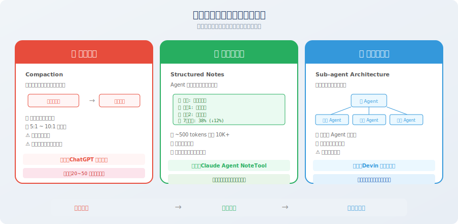

# 长时程任务的上下文策略

> 📖 *"短对话靠 prompt 技巧，长任务靠上下文策略——当 Agent 需要工作几小时甚至几天时，上下文管理就是生死线。"*

上一节我们学习了上下文窗口的基本管理技术（滑动窗口、摘要压缩、语义过滤）。这些技术在中等长度的对话中表现良好，但当任务复杂度进一步上升——需要**数十到数百轮交互**才能完成时——我们需要更高级的策略。

为什么？因为基本管理技术解决的是"如何在有限窗口内塞进更多有用信息"的问题，而长时程任务面临的是一个更根本的挑战：**信息的产生速度远超上下文窗口的承载能力**。即使你把所有技术都用上——滑动窗口 + 摘要压缩 + 语义过滤——在一个 200 轮的编码任务中，每轮产生的文件内容、工具返回、调试日志加在一起可能就有好几千 tokens，压缩后依然会很快填满窗口。

这就好比一家公司从 10 个人发展到 1000 个人，你不能仅仅靠"更大的办公室"来解决管理问题——你需要引入层级制度、流程规范、职能分工等**组织架构层面**的变革。长时程上下文策略，就是上下文管理领域的"组织架构变革"。

本节介绍三大长时程上下文策略，它们源自 Anthropic、OpenAI 等前沿团队的实际工程实践 [1]，代表了当前 Agent 开发中最前沿的上下文管理方法论。

## 什么是长时程任务？

长时程任务（Long-horizon Tasks）是指需要 Agent 执行**数十到数百轮交互**才能完成的复杂任务。这类任务在实际产品中越来越普遍——随着 Agent 的能力提升，用户对它的期望也在提升，从"帮我回答一个问题"到"帮我完成一个项目"。

过去一年里，我们看到了一批令人印象深刻的长时程 Agent 产品：Devin 可以独立完成几百行代码的软件项目，Perplexity Deep Research 可以搜索数十个网页并撰写深度报告，Claude Agent 可以跨越数百轮对话来完成复杂的分析任务。这些产品背后，都有精心设计的长时程上下文管理策略。

| 任务类型 | 典型轮次 | 代表产品 | 核心挑战 |
|---------|---------|---------|---------|
| 完整软件项目开发 | 100~500 轮 | Devin, Cursor Agent | 需要记住项目架构、已修改的文件、未完成的功能 |
| 深度研究报告 | 50~200 轮 | Perplexity Deep Research | 需要整合数十个来源的信息，保持论述一致性 |
| 多步骤数据分析 | 30~100 轮 | Code Interpreter | 需要记住数据schema、中间结果、分析目标 |
| 复杂调试流程 | 20~80 轮 | Claude Agent | 需要追踪尝试过的方案、报错信息、修复思路 |

这类任务面临的核心挑战是：**上下文在任务执行过程中持续膨胀，但上下文窗口是固定的**。这不是一个"用更大窗口就能解决"的问题——你会发现即使给你无限的窗口，注意力稀释问题依然存在。

让我们用一段模拟代码来直观感受这个膨胀的速度：

```python
# 长时程任务的上下文膨胀示例

def simulate_long_task():
    """模拟一个需要 50 轮交互的编程任务"""
    context_size = 1000  # 初始上下文（system prompt + 任务描述）
    
    for step in range(50):
        # 每轮交互新增的 tokens
        context_size += 100   # Agent 的思考过程
        context_size += 50    # 工具调用请求
        context_size += 800   # 工具返回结果（如文件内容、搜索结果）
        context_size += 200   # Agent 的回复
        
        if context_size > 128000:
            print(f"⚠️ 第 {step} 轮就超出了 128K 窗口！")
            break
    else:
        print(f"最终上下文大小: {context_size:,} tokens")

simulate_long_task()
# 输出: ⚠️ 第 110 轮... 但实际上更早就会因为注意力稀释而出问题
```

> 💡 **一个关键洞察**：实际上，长时程任务的失败通常**远早于**窗口被填满。由于上下文腐蚀和注意力稀释，Agent 的性能可能在窗口使用到 **30%~50%** 时就开始明显下降。所以"有 128K 窗口就不用管理上下文"是一个危险的错觉。

## 三大应对策略

面对长时程任务的上下文挑战，业界发展出了三种递进式的策略。它们的关系是层层递进的：**压缩整合**是在单个 Agent 内部做信息压缩，**结构化笔记**是让 Agent 主动记录关键信息，**子代理架构**是从系统架构层面解决问题。复杂度递增，能力也递增。



### 策略一：压缩整合（Compaction）

**核心思想**：定期将冗长的上下文压缩为精炼的摘要，释放空间给新信息。

这是最直觉的策略——就像整理书桌一样，定期把堆积的文件归档成摘要，腾出空间放新的工作材料。如果你在 8.2 节理解了摘要压缩技术，那么压缩整合可以看作它的"升级版"——不仅仅是压缩单段对话，而是**系统性地管理整个对话历史的生命周期**。

Anthropic 的 Claude Agent 在实际产品中就使用了这种策略：当上下文接近窗口限制时，自动触发"compaction"（压缩整合），将历史对话压缩为结构化摘要。这个机制让 Claude Agent 能够处理远超窗口大小的长对话，而不会出现质量退化。

来看看完整的实现：

```python
from openai import OpenAI
from dataclasses import dataclass, field

client = OpenAI()

@dataclass
class CompactionStrategy:
    """
    压缩整合策略
    
    工作原理：
    1. 持续追踪上下文大小
    2. 当超过阈值时自动触发压缩
    3. 保留最近几轮完整对话，将更早的对话压缩为摘要
    4. 摘要累积成任务执行的"编年史"
    """
    
    messages: list[dict] = field(default_factory=list)
    compaction_threshold: int = 50000  # 超过 50K tokens 触发压缩
    keep_recent_turns: int = 5         # 保留最近 5 轮不压缩
    summaries: list[str] = field(default_factory=list)
    
    def add_turn(self, user_msg: str, assistant_msg: str, 
                 tool_results: list[str] = None):
        """添加一轮对话"""
        self.messages.append({"role": "user", "content": user_msg})
        if tool_results:
            for result in tool_results:
                self.messages.append({"role": "tool", "content": result})
        self.messages.append({"role": "assistant", "content": assistant_msg})
        
        # 检查是否需要压缩
        if self._estimate_tokens() > self.compaction_threshold:
            self._compact()
    
    def _compact(self):
        """执行压缩"""
        # 分离出需要压缩的旧消息
        keep_count = self.keep_recent_turns * 3  # user + tool + assistant
        old_messages = self.messages[:-keep_count]
        recent_messages = self.messages[-keep_count:]
        
        # 生成摘要
        summary = self._generate_summary(old_messages)
        self.summaries.append(summary)
        
        # 用摘要替换旧消息
        self.messages = recent_messages
        print(f"📦 压缩完成: {len(old_messages)} 条消息 → 1 条摘要")
    
    def _generate_summary(self, messages: list[dict]) -> str:
        """用 LLM 生成结构化摘要"""
        response = client.chat.completions.create(
            model="gpt-4o-mini",
            messages=[{
                "role": "user",
                "content": f"""请将以下 Agent 交互历史压缩为结构化摘要：

{self._format_messages(messages)}

摘要要求：
1. 列出所有已完成的步骤和结果
2. 记录关键的中间数据和发现
3. 标注任何未解决的问题
4. 保留用户的原始需求
格式：使用 Markdown 列表"""
            }],
            max_tokens=800,
        )
        return response.choices[0].message.content
    
    def build_context(self) -> list[dict]:
        """构建最终的上下文"""
        context = []
        
        # 添加历史摘要（放在开头，利用高注意力区域）
        if self.summaries:
            context.append({
                "role": "system",
                "content": "## 任务执行摘要\n\n" + "\n\n---\n\n".join(self.summaries)
            })
        
        # 添加最近的完整对话
        context.extend(self.messages)
        
        return context
    
    def _estimate_tokens(self) -> int:
        total = sum(len(m["content"]) // 4 for m in self.messages)
        return total
    
    def _format_messages(self, messages: list[dict]) -> str:
        return "\n".join(f"[{m['role']}]: {m['content'][:200]}" for m in messages)
```

**压缩整合的关键设计决策**：

| 决策点 | 推荐做法 | 理由 |
|--------|---------|------|
| 触发时机 | 上下文达到窗口 40%~60% 时触发 | 留出充足空间，避免紧急压缩丢失信息 |
| 保留轮次 | 最近 5~10 轮不压缩 | 近期对话通常与当前任务高度相关 |
| 摘要模型 | 使用小模型（gpt-4o-mini） | 成本低、速度快，摘要质量已足够 |
| 摘要格式 | 结构化列表而非自然语言 | 信息密度更高，LLM 更容易提取关键点 |

### 策略二：结构化笔记（Structured Notes）

**核心思想**：Agent 在执行过程中**主动维护一份结构化的"笔记"**，记录关键信息和任务状态，而不是依赖完整的对话历史。

如果说压缩整合是"事后补救"——等信息堆积了再压缩，那么结构化笔记就是"事前预防"——从一开始就让 Agent 养成"记笔记"的习惯，实时提炼和记录关键信息。

这个策略来源于一个深刻的洞察：人类在执行长期项目时，不会试图记住每一次对话的每一个字——而是维护一份**项目笔记**，记录关键决策、重要数据和待办事项。当你需要回忆某个细节时，你不是翻看完整的会议录音，而是查看自己的笔记。Agent 也应该这样工作。

为什么这种方式更高效？因为**由 Agent 自己实时提炼的信息，质量远高于事后对整段对话的压缩**。在做决策的当下，Agent 最清楚哪些信息是重要的、哪些中间结果需要保留。事后再让一个独立的压缩模型来判断"什么重要"，难免会有偏差。

Anthropic 的 Claude Agent 设计中，Agent 使用专门的 "NoteTool" 来记录和更新关键信息 [1]。这让 Agent 能够用极少的 token（通常只需 500~1000 tokens）保持对长期任务的"全局视图"，替代可能需要 10000+ tokens 的完整对话历史。

```python
from dataclasses import dataclass, field
from datetime import datetime

@dataclass
class AgentNotepad:
    """
    Agent 的结构化笔记本
    
    设计理念：
    - 用 ~500-1000 tokens 的笔记替代 ~10000+ tokens 的完整历史
    - 笔记始终放在上下文开头（高注意力区域）
    - Agent 可以通过工具调用主动更新笔记
    """
    
    # 任务目标（不变，锚定 Agent 行为）
    objective: str = ""
    
    # 执行计划（可更新，追踪进度）
    plan: list[str] = field(default_factory=list)
    current_step: int = 0
    
    # 关键发现（持续追加，最核心的信息）
    findings: list[dict] = field(default_factory=list)
    
    # 待解决问题（动态管理）
    open_questions: list[str] = field(default_factory=list)
    
    # 重要数据点（结构化存储）
    data_points: dict = field(default_factory=dict)
    
    def update_plan(self, new_plan: list[str]):
        """更新执行计划"""
        self.plan = new_plan
    
    def advance_step(self):
        """推进到下一步"""
        self.current_step += 1
    
    def add_finding(self, finding: str, source: str = ""):
        """记录一个发现"""
        self.findings.append({
            "content": finding,
            "source": source,
            "time": datetime.now().isoformat(),
        })
    
    def add_data_point(self, key: str, value):
        """记录一个重要数据"""
        self.data_points[key] = value
    
    def to_context_string(self) -> str:
        """将笔记序列化为上下文字符串（放在 system prompt 区域）"""
        lines = [
            f"## 任务目标\n{self.objective}",
            f"\n## 执行计划（当前: 步骤 {self.current_step + 1}/{len(self.plan)}）",
        ]
        
        for i, step in enumerate(self.plan):
            status = "✅" if i < self.current_step else ("🔄" if i == self.current_step else "⬜")
            lines.append(f"  {status} {i+1}. {step}")
        
        if self.findings:
            lines.append("\n## 关键发现")
            for f in self.findings[-5:]:  # 只显示最近 5 条，控制 token
                lines.append(f"  - {f['content']}")
        
        if self.data_points:
            lines.append("\n## 重要数据")
            for k, v in self.data_points.items():
                lines.append(f"  - {k}: {v}")
        
        if self.open_questions:
            lines.append("\n## 待解决问题")
            for q in self.open_questions:
                lines.append(f"  - ❓ {q}")
        
        return "\n".join(lines)


# 使用示例：一个数据分析任务
notepad = AgentNotepad(
    objective="分析 2025 年 Q1 用户留存率下降原因并提出改进方案",
    plan=[
        "查询 Q1 各月用户留存数据",
        "对比 Q4 vs Q1 的留存率变化",
        "分析不同用户群体的留存差异",
        "识别导致下降的关键因素",
        "提出改进方案并预估效果",
    ]
)

# Agent 执行过程中更新笔记
notepad.advance_step()
notepad.add_data_point("Q1 平均 7日留存", "38%")
notepad.add_data_point("Q4 平均 7日留存", "45%")
notepad.add_finding("新用户 7 日留存下降最显著（-12%）", source="SQL 查询")
notepad.advance_step()

print(notepad.to_context_string())
# 输出约 300 tokens 的精炼笔记，替代了可能 10000+ tokens 的完整对话历史
```

> 💡 **结构化笔记 vs 压缩整合**：压缩整合是"被动的"——等上下文膨胀后再压缩；结构化笔记是"主动的"——Agent 在执行过程中**实时提炼**关键信息。主动策略的信息质量更高，因为 Agent 在做决策的当下最清楚哪些信息重要。

### 策略三：子代理架构（Sub-agent Architecture）

**核心思想**：将复杂的长任务分解给多个子 Agent 执行，每个子 Agent 有自己独立的上下文窗口。主 Agent 只需要管理任务进度和子 Agent 的结果摘要。

这是三种策略中最"重量级"的，也是解决超大规模长时程任务的终极方案。

前两种策略都是在**单个 Agent** 的框架内做优化——无论是压缩整合还是结构化笔记，信息最终都要挤进同一个上下文窗口。但子代理架构的思路完全不同：**如果一个窗口装不下，那就用多个窗口**。

这就像一个项目经理不需要知道每个工程师的每行代码——他只需要知道每个子任务的进展和结果。每个工程师在自己的"工位"（独立上下文）上高效工作，完成后把结论汇报给经理。经理的桌面永远整洁，因为他只看到结论，不看到过程。

这种架构有一个极其重要的优势：**每个子 Agent 的上下文都是干净的、无腐蚀的**。因为子 Agent 只接收完成其子任务所需的信息，不会被其他子任务的噪音干扰。这从根本上消除了上下文腐蚀问题。

```python
from dataclasses import dataclass
from typing import Callable

@dataclass
class SubAgentResult:
    """子 Agent 的执行结果"""
    agent_name: str
    task: str
    result_summary: str  # 只传摘要，不传完整上下文！
    success: bool
    key_data: dict

class OrchestratorAgent:
    """
    编排者 Agent：将长任务分解给子 Agent
    
    关键优势：
    1. 每个子 Agent 都有独立的、干净的上下文（无腐蚀）
    2. 主 Agent 只需管理摘要级别的信息（token 开销极低）
    3. 天然支持并行执行（多个子 Agent 可同时工作）
    4. 单个子 Agent 失败不会污染其他 Agent 的上下文
    """
    
    def __init__(self, model: str = "gpt-4o"):
        self.model = model
        self.sub_agents: dict[str, Callable] = {}
        self.results: list[SubAgentResult] = []
    
    def register_sub_agent(self, name: str, handler: Callable):
        """注册子 Agent"""
        self.sub_agents[name] = handler
    
    def execute_plan(self, task: str, plan: list[dict]):
        """按计划调度子 Agent 执行"""
        for step in plan:
            agent_name = step["agent"]
            sub_task = step["task"]
            
            print(f"📋 分配任务给 [{agent_name}]: {sub_task}")
            
            # 子 Agent 在独立的上下文中执行
            # 只传入必要的信息，不传整个对话历史
            result = self.sub_agents[agent_name](
                task=sub_task,
                context={
                    "overall_objective": task,
                    "previous_results": [
                        r.result_summary for r in self.results
                    ],
                }
            )
            
            self.results.append(result)
            print(f"✅ [{agent_name}] 完成: {result.result_summary[:100]}...")
    
    def get_final_context(self) -> str:
        """获取所有子 Agent 结果的摘要（用于最终总结）"""
        summaries = []
        for r in self.results:
            summaries.append(
                f"### {r.agent_name}: {r.task}\n"
                f"结果: {r.result_summary}\n"
                f"数据: {r.key_data}"
            )
        return "\n\n".join(summaries)


# 使用示例：一个复杂的研究任务被分解为多个独立子任务
orchestrator = OrchestratorAgent()
plan = [
    {"agent": "researcher", "task": "搜索2025年Agent领域的最新论文"},
    {"agent": "analyzer", "task": "分析搜索结果中的关键趋势"},
    {"agent": "writer", "task": "根据分析结果撰写研究报告"},
    {"agent": "reviewer", "task": "审核报告的准确性和完整性"},
]
```

**子代理架构在真实产品中的应用**：

| 产品 | 架构方式 | 子 Agent 角色 |
|------|---------|-------------|
| **Devin** | 主 Agent + 多个专业子 Agent | 规划器、编码器、测试器、调试器 |
| **GPT Researcher** | 编排器 + 搜索/分析/写作 Agent | 搜索者、分析者、编辑者 |
| **CrewAI 框架** | 角色扮演型多 Agent | 按任务自定义角色分工 |
| **MetaGPT** | 软件公司模拟 | 产品经理、架构师、工程师、QA |

## 三大策略对比

现在你已经了解了三种长时程上下文策略，让我们把它们放在一起做一个全面的对比。这张表格可以帮你在面对具体项目时快速判断应该采用哪种策略——或者它们的哪种组合：

| 维度 | 压缩整合 | 结构化笔记 | 子代理架构 |
|------|---------|-----------|-----------|
| **策略类型** | 被动（事后压缩） | 主动（实时提炼） | 架构级（预先分解） |
| **适用场景** | 中等长度任务（20-50 轮） | 持续执行的复杂任务 | 可分解的大型任务 |
| **实现复杂度** | 低 | 中 | 高 |
| **信息保留** | 摘要级别（会丢失细节） | 结构化关键信息（精确可控） | 每个子任务完整保留 |
| **额外开销** | 摘要 LLM 调用 | 笔记维护逻辑 | 多 Agent 管理 + 通信 |
| **最大优势** | 简单直接，易于集成 | 信息精确可控，token 效率最高 | 天然隔离，可并行，无腐蚀 |
| **最大劣势** | 摘要可能丢失关键细节 | 需要 Agent 学会"记笔记" | 子任务间信息传递可能不充分 |
| **典型代表** | ChatGPT 对话压缩 | Claude Agent 的内部笔记 | Devin 的多模块架构 |

## 实践建议：组合使用

在实际项目中，这三种策略往往需要**组合使用**。就像软件架构中不会只用一种设计模式一样，上下文管理也需要根据任务特征灵活搭配。最佳组合方式取决于你的任务特征：任务有多长？能否分解？需要多少上下文连贯性？

下面的代码展示了一个"三合一"的生产级上下文管理器。注意它是如何将三种策略的优势整合在一起的——笔记提供全局视图、压缩管理历史、子 Agent 结果作为中间层：

```python
class ProductionContextManager:
    """
    生产级上下文管理器：组合三种策略
    
    设计原则：
    - 笔记本提供"全局视图"（始终在开头）
    - 压缩整合管理对话历史（在中间区域）
    - 子 Agent 处理可独立执行的子任务
    - 按 Lost-in-the-Middle 效应布局
    """
    
    def __init__(self):
        self.notepad = AgentNotepad()          # 策略2：结构化笔记
        self.compactor = CompactionStrategy()   # 策略1：压缩整合
        self.sub_results: list[str] = []        # 策略3：子 Agent 结果
    
    def build_context(self, system_prompt: str, current_query: str) -> list[dict]:
        """按最优布局构建上下文"""
        messages = []
        
        # ===== 开头区域（高注意力）=====
        
        # 1. System Prompt（始终在最前面）
        messages.append({"role": "system", "content": system_prompt})
        
        # 2. 结构化笔记（紧跟 system prompt，确保 Agent "不迷路"）
        messages.append({
            "role": "system",
            "content": self.notepad.to_context_string()
        })
        
        # ===== 中间区域（较低注意力，放辅助信息）=====
        
        # 3. 子 Agent 结果摘要
        if self.sub_results:
            messages.append({
                "role": "system",
                "content": "## 子任务结果\n" + "\n".join(self.sub_results)
            })
        
        # 4. 压缩后的对话历史
        messages.extend(self.compactor.build_context())
        
        # ===== 结尾区域（最高注意力）=====
        
        # 5. 当前用户查询（在最后，获得最强注意力）
        messages.append({"role": "user", "content": current_query})
        
        return messages
```

### 组合策略的选择指南

如何判断你的项目需要多"重"的上下文管理？以下是一个简单实用的选择指南。核心思想是**不要过度工程化**——简单任务用简单策略就好，复杂策略只在真正需要时才引入：

| 任务类型 | 推荐组合 | 理由 |
|---------|---------|------|
| 简单多轮对话（<20 轮） | 滑动窗口即可 | 复杂策略的开销不值得 |
| 持续分析任务（20~50 轮） | 压缩整合 + 结构化笔记 | 笔记保持方向感，压缩释放空间 |
| 复杂长期项目（50+ 轮） | 三种策略全上 | 子 Agent 分担复杂度，笔记+压缩管理主 Agent |
| 可并行的大型任务 | 子代理架构为主 | 天然并行，每个子 Agent 上下文干净 |

## 本节小结

| 策略 | 核心思想 | 信息效率 | 最适合 |
|------|---------|---------|--------|
| **压缩整合** | 定期摘要，释放空间 | 5:1 ~ 10:1 压缩比 | 持续对话场景 |
| **结构化笔记** | 主动记录，精确控制 | 极高（~500 tokens 替代 10K+） | 多步骤分析任务 |
| **子代理架构** | 分而治之，独立上下文 | 无腐蚀，每个子任务最优 | 可并行的复杂任务 |

## 🤔 思考练习

1. 如果你要构建一个能执行"深度研究"的 Agent（需要搜索 50+ 网页并撰写报告），你会如何组合这三种策略？请画出架构图。
2. 压缩整合在什么情况下可能造成关键信息丢失？如何设计一个"安全网"来缓解这个问题？
3. 子代理架构中，主 Agent 和子 Agent 之间应该传递多少信息？传多了和传少了分别有什么问题？如何找到平衡点？

---

## 参考文献

[1] ANTHROPIC. Building effective agents[EB/OL]. 2024. https://www.anthropic.com/engineering/building-effective-agents.

---

*下一节：[8.4 实战：构建上下文管理器](./04_practice_context_builder.md)*
