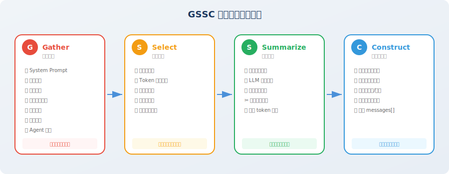

# 实战：构建上下文管理器

> 📖 *"Talk is cheap, show me the code." — 让我们用代码实现一个完整的上下文管理系统。*

经过前三节的理论学习，你已经掌握了上下文工程的核心概念：六大信息源、注意力预算、Lost-in-the-Middle 效应、三大长时程策略。现在，是时候把这些知识**落地为可运行的代码**了。

## 项目目标

在本节中，我们将实现一个 **GSSC（Gather-Select-Summarize-Construct）上下文构建流水线** [1]——这是一个从信息收集到上下文组装的完整工作流，可以作为任何 Agent 项目的上下文管理基础设施。

完成后，你将拥有一个可以直接复用的上下文管理模块，它能够：

- 从六大信息源**自动收集**候选信息
- 按优先级和 token 预算**智能筛选**最优子集
- 对超长内容**自动压缩**为精炼摘要
- 按 Lost-in-the-Middle 感知的最优布局**组装**最终上下文



## GSSC 流水线概述

GSSC 流水线包含四个阶段，信息像流水线上的产品一样，依次经过每个阶段的处理：

| 阶段 | 名称 | 作用 | 对应的上下文工程原则 |
|------|------|------|-------------------|
| **G** | Gather（收集） | 从六大来源收集所有候选信息 | — |
| **S** | Select（选择） | 根据优先级和预算筛选最优子集 | 相关性优先 + 动态裁剪 |
| **S** | Summarize（摘要） | 对超长内容进行压缩 | 动态裁剪 |
| **C** | Construct（构建） | 按注意力分布最优布局组装 | 结构化呈现 |

> 💡 **设计思路**：GSSC 的每个阶段都是独立的、可替换的模块。你可以根据自己的需求替换任何一个阶段的实现——比如用更高级的语义过滤替换 Select 阶段，或者用专门的领域模型替换 Summarize 阶段。

## 完整实现

接下来，我们将从数据结构定义开始，逐步构建 GSSC 流水线的完整实现。整个实现由 6 个步骤组成，每个步骤对应一个独立的模块——你可以按顺序阅读理解全貌，也可以单独替换某个模块来适配自己的场景。

### 步骤1：定义数据结构

任何工程项目的第一步都是定义清晰的数据结构。在 GSSC 流水线中，我们需要两个核心数据结构：`ContextItem`（上下文中的一个信息片段）和 `ContextBudget`（预算配置）。

`ContextItem` 是流水线中流动的"货物"——每个信息源（对话、工具结果、检索文档等）都会被包装成一个 `ContextItem`，带上它的元信息（来源类型、优先级、相关性分数、token 数量）。这些元信息在后续的 Select 和 Construct 阶段中将被用于决策。

```python
"""
GSSC 上下文构建流水线
完整实现代码
"""

from dataclasses import dataclass, field
from typing import Optional
from enum import Enum
import json
import time


class InfoSource(Enum):
    """信息来源类型"""
    SYSTEM_PROMPT = "system_prompt"
    USER_MESSAGE = "user_message"
    CONVERSATION = "conversation"
    TOOL_RESULT = "tool_result"
    RETRIEVED_DOC = "retrieved_doc"
    TASK_STATE = "task_state"
    AGENT_NOTE = "agent_note"


@dataclass
class ContextItem:
    """上下文中的一个信息片段"""
    content: str
    source: InfoSource
    priority: int = 5          # 1（最高）到 10（最低）
    relevance_score: float = 1.0  # 与当前任务的相关性 0~1
    token_count: int = 0
    timestamp: float = field(default_factory=time.time)
    metadata: dict = field(default_factory=dict)
    
    def __post_init__(self):
        if self.token_count == 0:
            # 简单的 token 估算
            self.token_count = len(self.content) // 3  # 中文约 1.5 字/token


@dataclass
class ContextBudget:
    """上下文预算配置"""
    total_tokens: int = 128000
    output_reserve: int = 4096
    system_prompt_max: int = 2000
    task_state_max: int = 3000
    agent_notes_max: int = 2000
    recent_conversation_max: int = 20000
    tool_results_max: int = 40000
    retrieved_docs_max: int = 20000
    history_max: int = 30000
    
    @property
    def available_input_tokens(self) -> int:
        return self.total_tokens - self.output_reserve
```

### 步骤2：实现 Gather（信息收集）

Gather 是流水线的第一个阶段，它的职责很简单：**从各个来源收集所有可能需要的信息，形成一个候选池**。

这个阶段故意不做任何筛选——收集就是收集，判断交给后续阶段。就像图书馆的采购部门，先把可能有用的书都买进来，上架和推荐的事情留给其他部门做。

注意 `add_conversation_history` 方法中的优先级计算逻辑：越近的消息优先级越高。这是因为在大多数 Agent 场景中，最近的对话往往与当前任务最相关——这一假设在后续的 Select 阶段会被利用。

```python
class GatherStage:
    """
    G - Gather 阶段：收集所有可能需要的信息
    从各个来源拉取数据，形成候选信息池
    """
    
    def __init__(self):
        self.items: list[ContextItem] = []
    
    def add_system_prompt(self, prompt: str):
        """添加系统提示词"""
        self.items.append(ContextItem(
            content=prompt,
            source=InfoSource.SYSTEM_PROMPT,
            priority=1,  # 最高优先级
        ))
    
    def add_user_message(self, message: str):
        """添加当前用户消息"""
        self.items.append(ContextItem(
            content=message,
            source=InfoSource.USER_MESSAGE,
            priority=1,  # 最高优先级
        ))
    
    def add_conversation_history(self, messages: list[dict]):
        """添加对话历史"""
        for i, msg in enumerate(messages):
            # 越近的消息优先级越高
            recency = i / len(messages)  # 0（最旧）到 1（最新）
            priority = int(8 - recency * 5)  # 3（最新）到 8（最旧）
            
            self.items.append(ContextItem(
                content=f"[{msg['role']}]: {msg['content']}",
                source=InfoSource.CONVERSATION,
                priority=priority,
                metadata={"turn_index": i, "role": msg["role"]},
            ))
    
    def add_tool_result(self, tool_name: str, result: str, 
                        is_recent: bool = True):
        """添加工具调用结果"""
        self.items.append(ContextItem(
            content=f"[工具: {tool_name}]\n{result}",
            source=InfoSource.TOOL_RESULT,
            priority=2 if is_recent else 6,
            metadata={"tool_name": tool_name},
        ))
    
    def add_retrieved_doc(self, doc: str, score: float):
        """添加检索到的文档"""
        self.items.append(ContextItem(
            content=doc,
            source=InfoSource.RETRIEVED_DOC,
            priority=4,
            relevance_score=score,
        ))
    
    def add_task_state(self, state: dict):
        """添加任务状态"""
        self.items.append(ContextItem(
            content=json.dumps(state, ensure_ascii=False, indent=2),
            source=InfoSource.TASK_STATE,
            priority=2,
        ))
    
    def add_agent_note(self, note: str):
        """添加 Agent 笔记"""
        self.items.append(ContextItem(
            content=note,
            source=InfoSource.AGENT_NOTE,
            priority=2,
        ))
    
    def get_all_items(self) -> list[ContextItem]:
        return self.items
```

### 步骤3：实现 Select（信息选择）

Select 是流水线中最关键的决策阶段——它决定了候选池中的哪些信息最终会进入上下文。这个阶段直接体现了 3.1 节中讲到的"相关性优先"和"动态裁剪"原则。

核心设计思路是**分层优先级**：首先无条件保留 system prompt 和用户消息（它们永远是最高优先级），然后按重要性递减的顺序依次填充任务状态、Agent 笔记、工具结果、检索文档、对话历史。每一层都有自己的 token 预算上限，超出的部分会被截断。

这种分层设计的好处是：**当总预算紧张时，低优先级的信息会被自动裁剪，而高优先级的信息始终得到保障**。就像航空公司在超售时的处理策略——头等舱的乘客永远能登机，经济舱的可能需要改签。

```python
class SelectStage:
    """
    S1 - Select 阶段：根据预算和优先级筛选信息
    """
    
    def __init__(self, budget: ContextBudget):
        self.budget = budget
    
    def select(self, items: list[ContextItem]) -> list[ContextItem]:
        """按优先级和预算选择信息"""
        
        # 按来源分组
        groups: dict[InfoSource, list[ContextItem]] = {}
        for item in items:
            groups.setdefault(item.source, []).append(item)
        
        selected = []
        
        # 1. 必选项：system prompt 和 user message（始终保留）
        for source in [InfoSource.SYSTEM_PROMPT, InfoSource.USER_MESSAGE]:
            if source in groups:
                selected.extend(groups[source])
        
        # 2. 高优先级：任务状态和 Agent 笔记
        for source in [InfoSource.TASK_STATE, InfoSource.AGENT_NOTE]:
            if source in groups:
                items_in_group = groups[source]
                max_tokens = (self.budget.task_state_max 
                             if source == InfoSource.TASK_STATE 
                             else self.budget.agent_notes_max)
                selected.extend(
                    self._fit_within_budget(items_in_group, max_tokens)
                )
        
        # 3. 工具结果（优先保留最近的）
        if InfoSource.TOOL_RESULT in groups:
            tool_items = sorted(
                groups[InfoSource.TOOL_RESULT], 
                key=lambda x: x.priority
            )
            selected.extend(
                self._fit_within_budget(
                    tool_items, self.budget.tool_results_max
                )
            )
        
        # 4. 检索文档（按相关性排序）
        if InfoSource.RETRIEVED_DOC in groups:
            doc_items = sorted(
                groups[InfoSource.RETRIEVED_DOC],
                key=lambda x: x.relevance_score,
                reverse=True
            )
            selected.extend(
                self._fit_within_budget(
                    doc_items, self.budget.retrieved_docs_max
                )
            )
        
        # 5. 对话历史（优先保留最近的）
        if InfoSource.CONVERSATION in groups:
            conv_items = sorted(
                groups[InfoSource.CONVERSATION],
                key=lambda x: x.metadata.get("turn_index", 0),
                reverse=True  # 最近的优先
            )
            selected.extend(
                self._fit_within_budget(
                    conv_items, self.budget.history_max
                )
            )
        
        return selected
    
    def _fit_within_budget(
        self, items: list[ContextItem], max_tokens: int
    ) -> list[ContextItem]:
        """在 token 预算内选择尽可能多的项"""
        selected = []
        remaining = max_tokens
        
        for item in items:
            if item.token_count <= remaining:
                selected.append(item)
                remaining -= item.token_count
            else:
                break
        
        return selected
```

### 步骤4：实现 Summarize（摘要压缩）

经过 Select 阶段筛选后，被选中的信息片段可能仍然很长——比如一个 SQL 查询返回了一张 3000 tokens 的大表格，或者一篇检索到的文档有 5000 tokens。Summarize 阶段的任务是**对这些超长片段进行压缩，在保留核心信息的前提下减少 token 占用**。

一个重要的设计决策是：**不同来源的信息使用不同的压缩策略**。工具结果需要保留所有数字数据（因为数据分析 Agent 的核心价值就在于数据的准确性），而检索文档只需要保留关键知识点（冗余的背景介绍和引用格式可以去掉）。这种差异化压缩策略，比"一刀切"的通用摘要能保留更多有价值的信息。

```python
from openai import OpenAI

client = OpenAI()

class SummarizeStage:
    """
    S2 - Summarize 阶段：对超长内容进行压缩
    """
    
    def __init__(self, max_item_tokens: int = 2000):
        self.max_item_tokens = max_item_tokens
    
    def summarize(self, items: list[ContextItem]) -> list[ContextItem]:
        """对超长的项进行摘要"""
        result = []
        
        for item in items:
            if item.token_count > self.max_item_tokens:
                # 需要压缩
                compressed = self._compress_item(item)
                result.append(compressed)
            else:
                result.append(item)
        
        return result
    
    def _compress_item(self, item: ContextItem) -> ContextItem:
        """压缩单个上下文项"""
        
        # 根据来源使用不同的压缩策略
        if item.source == InfoSource.TOOL_RESULT:
            prompt = f"""请压缩以下工具调用结果，保留关键数据和结论，去除冗余格式信息：

{item.content}

压缩要求：
- 保留所有数字数据
- 保留结论性信息
- 去除重复的表头、格式说明等
- 控制在 500 字以内"""
        
        elif item.source == InfoSource.RETRIEVED_DOC:
            prompt = f"""请提取以下文档中与当前任务最相关的核心内容：

{item.content}

要求：控制在 300 字以内，只保留关键知识点。"""
        
        else:
            prompt = f"""请简要总结以下内容的要点：

{item.content}

要求：控制在 300 字以内。"""
        
        response = client.chat.completions.create(
            model="gpt-4o-mini",
            messages=[{"role": "user", "content": prompt}],
            max_tokens=600,
        )
        
        compressed_content = response.choices[0].message.content
        
        return ContextItem(
            content=f"[压缩] {compressed_content}",
            source=item.source,
            priority=item.priority,
            relevance_score=item.relevance_score,
            metadata={**item.metadata, "compressed": True},
        )
```

### 步骤5：实现 Construct（上下文构建）

这是流水线的最后一个处理阶段，也是 3.2 节 Lost-in-the-Middle 效应知识的直接应用。Construct 阶段负责**把经过筛选和压缩的信息片段，按照注意力最优的布局组装成最终的 messages 列表**。

布局策略的核心思想在代码注释中已经说明：开头区域（高注意力）放系统指令和任务状态——确保 Agent "不迷路"；中间区域（较低注意力）放辅助性的历史对话和检索文档——即使被部分忽略也不致命；结尾区域（最高注意力）放用户的当前消息——确保 Agent 紧紧围绕用户的最新需求来回答。

这种"三明治"式的布局设计，让每类信息都被放在了最适合它的位置——关键信息不会被"埋"在中间而被忽略，辅助信息也不会抢占宝贵的头尾注意力位置。

```python
class ConstructStage:
    """
    C - Construct 阶段：按最优布局组装最终上下文
    
    布局策略（基于 Lost-in-the-Middle 效应）：
    [高注意力] System Prompt → Task State → Agent Notes
    [中注意力] 对话历史 → 检索文档 → 工具结果
    [高注意力] 最近对话 → 用户消息
    """
    
    def construct(self, items: list[ContextItem]) -> list[dict]:
        """组装最终的 messages 列表"""
        
        # 按来源分组
        groups: dict[InfoSource, list[ContextItem]] = {}
        for item in items:
            groups.setdefault(item.source, []).append(item)
        
        messages = []
        
        # === 开头区域（高注意力）===
        
        # 1. System Prompt
        if InfoSource.SYSTEM_PROMPT in groups:
            system_content = groups[InfoSource.SYSTEM_PROMPT][0].content
            
            # 将任务状态和笔记嵌入 system message
            extra_sections = []
            
            if InfoSource.TASK_STATE in groups:
                state_content = groups[InfoSource.TASK_STATE][0].content
                extra_sections.append(f"\n\n## 当前任务状态\n{state_content}")
            
            if InfoSource.AGENT_NOTE in groups:
                note_content = groups[InfoSource.AGENT_NOTE][0].content
                extra_sections.append(f"\n\n## 执行笔记\n{note_content}")
            
            messages.append({
                "role": "system",
                "content": system_content + "".join(extra_sections)
            })
        
        # === 中间区域（注意力较低 → 放辅助信息）===
        
        # 2. 检索文档
        if InfoSource.RETRIEVED_DOC in groups:
            docs = [item.content for item in groups[InfoSource.RETRIEVED_DOC]]
            messages.append({
                "role": "system",
                "content": "## 相关知识\n\n" + "\n\n---\n\n".join(docs)
            })
        
        # 3. 历史对话（按时间顺序排列）
        if InfoSource.CONVERSATION in groups:
            conv_items = sorted(
                groups[InfoSource.CONVERSATION],
                key=lambda x: x.metadata.get("turn_index", 0)
            )
            for item in conv_items:
                role = item.metadata.get("role", "user")
                content = item.content
                # 去掉 "[role]: " 前缀
                if content.startswith(f"[{role}]: "):
                    content = content[len(f"[{role}]: "):]
                messages.append({"role": role, "content": content})
        
        # 4. 工具结果
        if InfoSource.TOOL_RESULT in groups:
            for item in groups[InfoSource.TOOL_RESULT]:
                messages.append({
                    "role": "assistant",
                    "content": item.content,
                })
        
        # === 结尾区域（最高注意力）===
        
        # 5. 当前用户消息（始终在最后）
        if InfoSource.USER_MESSAGE in groups:
            messages.append({
                "role": "user",
                "content": groups[InfoSource.USER_MESSAGE][0].content
            })
        
        return messages
```

### 步骤6：组装 GSSC 流水线

现在到了最激动人心的部分——把前面所有的模块组装成一个完整的流水线。`GSSCPipeline` 类是整个系统的入口点，它提供了一个简洁的 `build()` 接口，让调用者只需提供原始数据，就能获得一个优化过的 messages 列表——可以直接传给任何 LLM API。

注意 `build()` 方法中的四行核心逻辑——每一行对应 GSSC 的一个阶段，信息像水流一样依次经过 Gather → Select → Summarize → Construct，最终输出高质量的上下文。每个阶段都会打印一条日志，让你清楚地看到信息在每个阶段的变化。

```python
class GSSCPipeline:
    """
    GSSC 上下文构建流水线
    Gather → Select → Summarize → Construct
    """
    
    def __init__(
        self,
        budget: Optional[ContextBudget] = None,
        max_item_tokens: int = 2000,
    ):
        self.budget = budget or ContextBudget()
        self.gather = GatherStage()
        self.select = SelectStage(self.budget)
        self.summarize = SummarizeStage(max_item_tokens)
        self.construct = ConstructStage()
    
    def build(
        self,
        system_prompt: str,
        user_message: str,
        conversation_history: list[dict] = None,
        tool_results: list[dict] = None,
        retrieved_docs: list[dict] = None,
        task_state: dict = None,
        agent_notes: str = None,
    ) -> list[dict]:
        """
        一站式构建最优上下文
        
        Args:
            system_prompt: 系统提示词
            user_message: 当前用户消息
            conversation_history: [{"role": "user/assistant", "content": "..."}]
            tool_results: [{"tool": "name", "result": "...", "recent": True}]
            retrieved_docs: [{"content": "...", "score": 0.95}]
            task_state: {"current_step": 3, "completed": [...], ...}
            agent_notes: Agent 的结构化笔记
        
        Returns:
            list[dict]: 可直接传给 LLM API 的 messages 列表
        """
        
        # === G: Gather ===
        self.gather = GatherStage()  # 重置
        self.gather.add_system_prompt(system_prompt)
        self.gather.add_user_message(user_message)
        
        if conversation_history:
            self.gather.add_conversation_history(conversation_history)
        
        if tool_results:
            for tr in tool_results:
                self.gather.add_tool_result(
                    tr["tool"], tr["result"], tr.get("recent", False)
                )
        
        if retrieved_docs:
            for doc in retrieved_docs:
                self.gather.add_retrieved_doc(doc["content"], doc["score"])
        
        if task_state:
            self.gather.add_task_state(task_state)
        
        if agent_notes:
            self.gather.add_agent_note(agent_notes)
        
        all_items = self.gather.get_all_items()
        print(f"📥 Gather: 收集了 {len(all_items)} 个信息片段")
        
        # === S1: Select ===
        selected_items = self.select.select(all_items)
        print(f"🔍 Select: 筛选出 {len(selected_items)} 个片段")
        
        # === S2: Summarize ===
        summarized_items = self.summarize.summarize(selected_items)
        compressed_count = sum(
            1 for item in summarized_items 
            if item.metadata.get("compressed", False)
        )
        print(f"📦 Summarize: 压缩了 {compressed_count} 个超长片段")
        
        # === C: Construct ===
        messages = self.construct.construct(summarized_items)
        total_tokens = sum(
            len(m["content"]) // 3 for m in messages
        )
        print(f"🏗️ Construct: 构建完成，约 {total_tokens:,} tokens")
        
        return messages


# === 使用示例 ===

pipeline = GSSCPipeline(
    budget=ContextBudget(total_tokens=128000),
    max_item_tokens=2000,
)

messages = pipeline.build(
    system_prompt="你是一个资深数据分析师，擅长用户行为分析。",
    user_message="基于之前的分析，请给出提升留存率的前 3 条建议。",
    conversation_history=[
        {"role": "user", "content": "帮我分析 Q1 的用户留存数据"},
        {"role": "assistant", "content": "好的，我来查询数据库..."},
        {"role": "user", "content": "重点看新用户的留存"},
        {"role": "assistant", "content": "新用户 7 日留存率为 38%，环比下降 12%..."},
    ],
    tool_results=[
        {
            "tool": "sql_query",
            "result": "新用户7日留存率: 38%, 老用户7日留存率: 65%, ...",
            "recent": True,
        },
    ],
    task_state={
        "objective": "分析 Q1 用户留存率下降原因",
        "completed_steps": ["数据查询", "基础统计", "分群分析"],
        "current_step": "生成建议",
    },
    agent_notes="关键发现：新用户首日引导流程完成率仅 45%，是留存下降的主因。",
)

# 输出:
# 📥 Gather: 收集了 9 个信息片段
# 🔍 Select: 筛选出 9 个片段
# 📦 Summarize: 压缩了 0 个超长片段
# 🏗️ Construct: 构建完成，约 XXX tokens
```

## 本节小结

恭喜你完成了 GSSC 上下文构建流水线的实现！这是一个可以直接应用于生产项目的上下文管理基础设施。

| 阶段 | 核心功能 | 关键设计 |
|------|---------|---------|
| **Gather** | 从六大来源收集候选信息 | 自动按新旧程度分配优先级 |
| **Select** | 按优先级和预算筛选 | 必选项 → 高优先级 → 工具结果 → 文档 → 历史 |
| **Summarize** | 压缩超长内容 | 按来源类型使用不同压缩策略 |
| **Construct** | 按 Lost-in-the-Middle 最优布局组装 | 开头=系统+状态，中间=历史+知识，结尾=用户消息 |

### 在你的项目中使用 GSSC

GSSC 流水线是模块化的，你可以根据需要进行扩展：

- **增加缓存层**：在 Summarize 阶段添加缓存，避免重复压缩相同内容
- **集成 embedding**：在 Select 阶段使用语义相似度进行更精准的筛选
- **添加监控**：记录每次构建的 token 分配和压缩比，用于优化预算配置
- **多模态支持**：扩展 InfoSource 枚举以支持图片、音频等多模态信息

## 🤔 思考练习

1. 如何为 GSSC 流水线添加缓存机制，避免重复压缩相同的内容？设计缓存 key 的策略。
2. 如果 Agent 支持多模态输入（图片、音频），GSSC 流水线需要怎样扩展？Gather 和 Select 阶段分别需要什么改动？
3. 如何评估上下文管理的效果？尝试设计一个 A/B 测试方案，对比"无管理"vs"GSSC 管理"的 Agent 输出质量。

## 第3章回顾

至此，你已经完整学习了上下文工程的理论与实践：

| 节 | 核心收获 | 关键概念 |
|----|---------|---------|
| 3.1 | 从提示工程跨越到上下文工程 | 六大信息源、三大原则、思维转变 |
| 3.2 | 理解上下文窗口的约束和注意力分布 | 上下文腐蚀、Lost-in-the-Middle、注意力预算 |
| 3.3 | 掌握长时程任务的三大策略 | 压缩整合、结构化笔记、子代理架构 |
| 3.4 | 动手实现可复用的上下文管理基础设施 | GSSC 流水线：Gather → Select → Summarize → Construct |

> 💡 **下一步**：上下文工程是贯穿整本书的底层能力。在后续章节中，无论是工具调用（第5章）、记忆系统（第7章）、还是 RAG（第9章），你都会反复用到本章学到的上下文管理思维。建议将 GSSC 流水线的代码保存到自己的工具库中，后续章节的实战项目将直接复用。

---

## 参考文献

[1] ANTHROPIC. Building effective agents[EB/OL]. 2024. https://www.anthropic.com/engineering/building-effective-agents.
