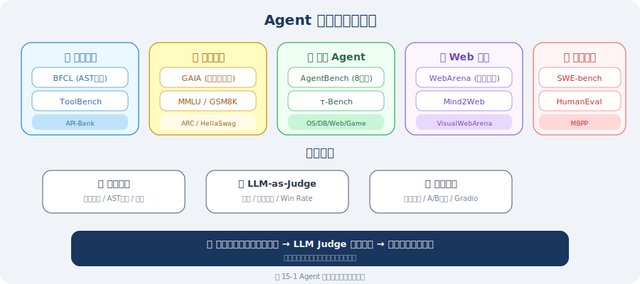

# 基准测试与评估指标

> **本节目标**：深入理解业界主流的 Agent 基准测试及其评估原理，掌握 BFCL、GAIA、AgentBench、WebArena、SWE-bench 等基准的底层算法，并学会设计自己的评估体系。

---

## 为什么需要基准测试？

想象你在面试两个候选人，如果不给同样的题目，怎么比较谁更优秀？基准测试就是给 Agent 出的"标准考题"——用统一的任务、数据和评分标准来衡量不同 Agent 的表现。

但不同的基准测试评估的能力维度截然不同。下面这张"评估全景图"帮你快速定位：



---

## Agent 评估基准分类

Agent 评估基准可按能力维度分为以下几类 [1]：

| 类别 | 代表基准 | 评估能力 |
|------|---------|---------|
| **工具调用** | BFCL, ToolBench, API-Bank | 正确调用 API、处理参数、组合工具 |
| **通用推理** | GAIA, MMLU, GSM8K | 多步推理、知识广度、数学能力 |
| **综合 Agent** | AgentBench | 8 个领域的端到端任务完成 |
| **Web 操作** | WebArena, Mind2Web | 在真实网站上完成指定任务 |
| **软件工程** | SWE-bench, HumanEval | 代码生成、Bug 修复、项目级改动 |
| **多模态** | VisualWebArena, OSWorld | 视觉理解 + 操作执行 |

---

## 1. BFCL —— 工具调用评估基准

### 概述

**BFCL（Berkeley Function Calling Leaderboard）**[2] 是由 UC Berkeley 发布的工具调用评估基准，它系统地评估 LLM 调用函数/API 的能力。这是目前最权威的工具调用基准测试之一。

### 四类测试场景

BFCL 将工具调用分为四种递进的难度级别：

| 类型 | 说明 | 示例 |
|------|------|------|
| **Simple** | 单函数、参数完整 | `get_weather(city="北京")` |
| **Multiple** | 从多个候选函数中选择正确的 | 给定 10 个函数，选择并正确调用其中 1 个 |
| **Parallel** | 一次调用多个函数 | 同时查天气和订机票 |
| **Irrelevance** | 识别无关请求，拒绝调用 | 用户问"你好"时不应调用任何工具 |

### AST 匹配算法：为什么字符串匹配不够？

BFCL 的核心创新在于使用 **AST（Abstract Syntax Tree）匹配** 而非简单的字符串匹配来评估工具调用的正确性。

**字符串匹配的问题**：

```python
# 这两个调用语义完全相同，但字符串匹配会判定为"不相等"
ground_truth = 'get_weather(city="Beijing", unit="celsius")'
prediction   = 'get_weather(unit="celsius", city="Beijing")'
# 字符串匹配: "Beijing", unit="celsius"' ≠ 'unit="celsius", city="Beijing"'
# 结果: ❌ 误判为错误！
```

**AST 匹配的原理**：

```python
import ast
from typing import Any

def ast_match(prediction: str, ground_truth: str) -> bool:
    """
    BFCL 的 AST 匹配算法（简化版）
    
    核心思想：将函数调用解析为 AST 节点，
    比较函数名和参数集合（忽略参数顺序）
    """
    try:
        # 解析为 AST
        pred_ast = ast.parse(prediction, mode='eval').body
        true_ast = ast.parse(ground_truth, mode='eval').body
        
        # 检查是否都是函数调用
        if not (isinstance(pred_ast, ast.Call) and isinstance(true_ast, ast.Call)):
            return False
        
        # 比较函数名
        pred_func = ast.dump(pred_ast.func)
        true_func = ast.dump(true_ast.func)
        if pred_func != true_func:
            return False
        
        # 比较关键字参数（忽略顺序）
        pred_kwargs = {
            kw.arg: ast.literal_eval(kw.value)
            for kw in pred_ast.keywords
        }
        true_kwargs = {
            kw.arg: ast.literal_eval(kw.value) 
            for kw in true_ast.keywords
        }
        
        if pred_kwargs != true_kwargs:
            return False
        
        # 比较位置参数
        pred_args = [ast.literal_eval(a) for a in pred_ast.args]
        true_args = [ast.literal_eval(a) for a in true_ast.args]
        
        return pred_args == true_args
        
    except (SyntaxError, ValueError):
        return False


# 测试
print(ast_match(
    'get_weather(city="Beijing", unit="celsius")',
    'get_weather(unit="celsius", city="Beijing")'
))
# ✅ True —— AST 匹配正确识别了参数顺序无关性

print(ast_match(
    'get_weather(city="Beijing")',
    'get_weather(city="Shanghai")'
))
# ❌ False —— 参数值不同
```

### 类型感知匹配

BFCL 还处理了**类型等价**的问题：

```python
def type_aware_match(pred_value: Any, true_value: Any) -> bool:
    """
    类型感知的参数值匹配
    
    处理常见的类型等价场景：
    - 整数 1 和浮点数 1.0
    - 字符串 "true" 和布尔值 True
    - 单元素列表 ["a"] 和字符串 "a"
    """
    # 直接相等
    if pred_value == true_value:
        return True
    
    # 数值类型等价：1 == 1.0
    if isinstance(pred_value, (int, float)) and isinstance(true_value, (int, float)):
        return abs(float(pred_value) - float(true_value)) < 1e-6
    
    # 字符串 vs 布尔值："true" == True
    if isinstance(pred_value, str) and isinstance(true_value, bool):
        return pred_value.lower() == str(true_value).lower()
    
    # 列表 vs 集合：忽略顺序
    if isinstance(pred_value, list) and isinstance(true_value, list):
        return sorted(str(x) for x in pred_value) == sorted(str(x) for x in true_value)
    
    return False
```

---

## 2. GAIA —— 通用 AI 助手评估

### 概述

**GAIA（General AI Assistant Benchmark）**[3] 由 Meta 发布，旨在评估 AI 助手处理现实世界任务的能力。它的独特之处在于：

- **对人类简单，对 AI 困难**：题目设计为人类可以轻松解答（通过搜索和推理），但 AI 需要组合多种能力才能完成
- **答案简短明确**：每个问题都有一个简短的标准答案（通常是一个词或一个数字），避免了开放式评估的主观性
- **三级难度体系**：从简单到复杂，全面评估不同能力层次

### 三级难度

| 级别 | 所需能力 | 示例 |
|------|---------|------|
| **Level 1** | 1-2 个步骤，基础推理 | "法国的首都是什么？" |
| **Level 2** | 3-5 个步骤，需要工具 | "2024 年诺贝尔物理学奖得主的出生城市人口是多少？" |
| **Level 3** | 5+ 个步骤，多工具+推理 | "找到某个 PDF 中第 3 页表格第 2 行数据，计算其与 CPI 的比率" |

### 准精确匹配算法（Quasi-Exact Match）

GAIA 的评估采用**准精确匹配**算法——比严格的字符串匹配更宽松，但保持客观性：

```python
import re
import unicodedata

def quasi_exact_match(prediction: str, ground_truth: str) -> bool:
    """
    GAIA 的准精确匹配算法
    
    核心思想：对预测值和标准答案进行归一化处理后精确比较，
    容忍大小写、标点、空白等无意义差异
    """
    
    def normalize(text: str) -> str:
        """归一化处理"""
        # 转小写
        text = text.lower().strip()
        
        # Unicode 归一化（处理全角/半角、重音符号等）
        text = unicodedata.normalize("NFKD", text)
        
        # 去除标点符号（但保留小数点和负号）
        text = re.sub(r'[^\w\s\.\-]', '', text)
        
        # 合并多余空白
        text = re.sub(r'\s+', ' ', text)
        
        # 去除冠词（英文）
        text = re.sub(r'\b(a|an|the)\b', '', text)
        text = re.sub(r'\s+', ' ', text).strip()
        
        return text
    
    def normalize_number(text: str) -> str | None:
        """尝试将文本解析为标准数值格式"""
        try:
            # 移除千位分隔符
            cleaned = text.replace(",", "").replace(" ", "")
            num = float(cleaned)
            # 如果是整数，返回整数格式
            if num == int(num):
                return str(int(num))
            return f"{num:.6f}".rstrip('0').rstrip('.')
        except ValueError:
            return None
    
    # 标准化比较
    norm_pred = normalize(prediction)
    norm_truth = normalize(ground_truth)
    
    if norm_pred == norm_truth:
        return True
    
    # 数值比较
    num_pred = normalize_number(prediction)
    num_truth = normalize_number(ground_truth)
    
    if num_pred is not None and num_truth is not None:
        return num_pred == num_truth
    
    # 包含关系（答案可能在更长的回复中）
    if norm_truth in norm_pred:
        # 确保是完整匹配，不是子串
        pattern = r'\b' + re.escape(norm_truth) + r'\b'
        if re.search(pattern, norm_pred):
            return True
    
    return False


# 测试
print(quasi_exact_match("Paris", "paris"))       # True: 大小写
print(quasi_exact_match("42,000", "42000"))       # True: 千位分隔符
print(quasi_exact_match("The answer is Paris.", "Paris"))  # True: 包含
print(quasi_exact_match("3.14", "3.14000"))       # True: 小数精度
print(quasi_exact_match("Beijing", "Shanghai"))    # False: 不同答案
```

### GAIA 的多模态数据处理

GAIA 的一个独特挑战是**任务可能包含附件**——PDF 文件、Excel 表格、图片等。Agent 需要：
1. 识别附件类型
2. 用合适的工具读取内容
3. 从内容中提取关键信息
4. 结合信息完成推理

---

## 3. AgentBench —— 综合 Agent 评估

### 概述

**AgentBench** [4] 是清华大学发布的综合性 Agent 基准测试，涵盖 **8 个不同领域**的任务，全面评估 Agent 在多种环境中的表现：

| 领域 | 任务类型 | 评估重点 |
|------|---------|---------|
| **OS** | 操作系统命令执行 | 文件操作、进程管理 |
| **DB** | 数据库查询 | SQL 生成、数据分析 |
| **KG** | 知识图谱推理 | 图遍历、关系推理 |
| **DCG** | 数字卡牌游戏 | 策略决策、状态追踪 |
| **LTP** | 横向思维谜题 | 创造性推理 |
| **HouseHold** | 家庭环境操作 | 空间推理、物体交互 |
| **WebShop** | 在线购物 | 搜索、筛选、决策 |
| **WebBrowse** | 网页浏览 | 信息提取、导航 |

### AgentBench 的评估框架

```python
class AgentBenchEvaluator:
    """
    AgentBench 的评估架构（概念性实现）
    
    核心特点：
    1. 每个领域有独立的环境和评估器
    2. Agent 通过统一的文本接口与环境交互
    3. 评估指标是任务完成率（Success Rate）
    """
    
    def __init__(self, agent):
        self.agent = agent
        self.environments = {
            "os": OSEnvironment(),
            "db": DatabaseEnvironment(),
            "web_shop": WebShopEnvironment(),
            # ... 其他环境
        }
    
    def evaluate_task(self, env_name: str, task: dict) -> dict:
        """
        评估单个任务
        
        流程：
        1. 初始化环境并给出任务描述
        2. Agent 与环境交互（最多 N 步）
        3. 检查最终状态是否满足成功条件
        """
        env = self.environments[env_name]
        observation = env.reset(task)
        
        for step in range(task.get("max_steps", 20)):
            # Agent 根据观察生成动作
            action = self.agent.act(observation)
            
            # 环境执行动作
            observation, reward, done, info = env.step(action)
            
            if done:
                break
        
        return {
            "success": info.get("success", False),
            "steps": step + 1,
            "reward": reward,
        }
    
    def evaluate_all(self, benchmark_data: dict) -> dict:
        """评估所有领域"""
        results = {}
        for env_name, tasks in benchmark_data.items():
            env_results = [
                self.evaluate_task(env_name, task) 
                for task in tasks
            ]
            results[env_name] = {
                "success_rate": sum(r["success"] for r in env_results) / len(env_results),
                "avg_steps": sum(r["steps"] for r in env_results) / len(env_results),
            }
        return results
```

### 各领域顶尖模型表现（截至 2025）

| 环境 | GPT-4o | Claude-3.5 | 开源 SOTA |
|------|--------|------------|----------|
| OS | ~45% | ~42% | ~30% (CodeLlama) |
| DB | ~52% | ~48% | ~35% |
| WebShop | ~60% | ~55% | ~40% |
| **综合** | **~42%** | **~38%** | **~28%** |

> **关键洞察**：即使是最强的闭源模型，在 AgentBench 上的综合表现也仅约 40%。这说明当前 LLM 的 Agent 能力仍有巨大的提升空间。

---

## 4. WebArena —— Web 操作评估

### 概述

**WebArena** [5] 是 CMU 发布的 Web Agent 评估基准，在**真实的 Web 应用环境**中测试 Agent 完成任务的能力。它部署了 4 个完整的 Web 应用：

- **Reddit**（论坛）
- **GitLab**（代码托管）
- **Shopping**（电商网站）
- **CMS**（内容管理系统）

### 任务示例

```
任务: "在 GitLab 上创建一个名为 'ml-pipeline' 的新仓库，
      添加 .gitignore 文件选择 Python 模板，
      然后创建一个名为 'setup-ci' 的 Issue。"

评估标准:
1. 仓库 'ml-pipeline' 是否存在 ✅/❌
2. .gitignore 是否包含 Python 模板内容 ✅/❌
3. Issue 'setup-ci' 是否已创建 ✅/❌

最终得分: 满足所有条件才算成功
```

### 评估方法

WebArena 使用**基于状态的评估**——检查操作完成后 Web 应用的状态是否符合预期：

```python
class WebArenaEvaluator:
    """WebArena 评估逻辑（概念性实现）"""
    
    def evaluate(self, task: dict, final_state: dict) -> bool:
        """
        检查 Web 应用的最终状态是否满足任务要求
        
        评估类型：
        1. URL 匹配：最终页面是否正确
        2. 元素存在性：页面是否包含特定元素
        3. 数据库状态：后端数据是否正确
        """
        
        for condition in task["success_conditions"]:
            if condition["type"] == "url_match":
                if not self._check_url(final_state["url"], condition["pattern"]):
                    return False
                    
            elif condition["type"] == "element_exists":
                if not self._find_element(
                    final_state["page_html"], 
                    condition["selector"]
                ):
                    return False
                    
            elif condition["type"] == "db_check":
                if not self._query_db(
                    condition["query"], 
                    condition["expected"]
                ):
                    return False
        
        return True  # 所有条件满足
```

---

## 5. SWE-bench —— 软件工程评估

### 概述

**SWE-bench** [6] 是由 Princeton 发布的软件工程评估基准，测试 Agent 解决**真实 GitHub Issue** 的能力。每个测试用例都来自真实的开源项目（如 Django、Flask、scikit-learn），包含一个 Issue 描述和对应的测试用例。

### 任务流程

```
1. 接收 Issue 描述:
   "Django QuerySet.union() 在使用 values() 时返回重复结果"

2. 理解代码库:
   分析 Django 的 QuerySet 实现（数千个文件）

3. 定位问题:
   找到 django/db/models/sql/query.py 中的 union 逻辑

4. 生成修复:
   生成 git patch 文件

5. 验证:
   运行项目的单元测试，检查是否通过
```

### SWE-bench 的变体

| 变体 | 测试量 | 说明 |
|------|--------|------|
| **SWE-bench Full** | 2294 个 Issue | 完整集合 |
| **SWE-bench Lite** | 300 个 Issue | 精选子集，更可重复 |
| **SWE-bench Verified** | 500 个 Issue | 人工验证过的高质量子集 |

### 评估指标

SWE-bench 的核心指标是 **Resolved Rate（解决率）**：

```python
def swe_bench_evaluate(
    patch: str,          # Agent 生成的 git patch
    test_suite: str,     # 原始测试用例
    repo_path: str,      # 代码仓库路径
) -> dict:
    """
    SWE-bench 评估流程（简化版）
    
    1. 应用 Agent 生成的 patch
    2. 运行项目的测试套件
    3. 检查之前失败的测试是否通过
    """
    import subprocess
    
    # 应用 patch
    apply_result = subprocess.run(
        ["git", "apply", "--check", "-"],
        input=patch.encode(),
        cwd=repo_path,
        capture_output=True,
    )
    
    if apply_result.returncode != 0:
        return {"resolved": False, "reason": "Patch 无法应用"}
    
    # 实际应用 patch
    subprocess.run(
        ["git", "apply", "-"],
        input=patch.encode(),
        cwd=repo_path,
    )
    
    # 运行测试
    test_result = subprocess.run(
        ["python", "-m", "pytest", test_suite, "-x"],
        cwd=repo_path,
        capture_output=True,
        timeout=300,  # 5 分钟超时
    )
    
    return {
        "resolved": test_result.returncode == 0,
        "test_output": test_result.stdout.decode(),
    }
```

### 当前 SOTA（截至 2025）

| Agent | SWE-bench Verified | 方法 |
|-------|-------------------|------|
| **DeepSWE** | 59.0% | GRPO 强化学习训练 |
| **Amazon Q Developer** | 55.2% | 闭源商业产品 |
| **Claude-3.5 Sonnet** | ~49% | 直接推理 |
| **SWE-Agent** | ~33% | 开源框架 |

---

## 6. LLM-as-Judge 评估方法

对于没有标准答案的开放式任务，**LLM-as-Judge** [7] 是最常用的评估方法——用一个强大的 LLM 来评判另一个 LLM 的输出。

### 三种评判模式

```python
class LLMJudge:
    """LLM-as-Judge 评估器"""
    
    def __init__(self, judge_model: str = "gpt-4o"):
        from langchain_openai import ChatOpenAI
        self.judge = ChatOpenAI(model=judge_model, temperature=0)
    
    def pointwise_scoring(
        self, 
        question: str, 
        answer: str, 
        rubric: str,
    ) -> dict:
        """
        模式1：逐条打分（Pointwise）
        评估单个回答的绝对质量
        """
        prompt = f"""请根据以下评分标准评估回答质量。

问题: {question}
回答: {answer}

评分标准:
{rubric}

请以 1-10 分评分，并说明理由。
输出 JSON: {{"score": <分数>, "reasoning": "<理由>"}}"""
        
        response = self.judge.invoke(prompt)
        return json.loads(response.content)
    
    def pairwise_comparison(
        self,
        question: str,
        answer_a: str,
        answer_b: str,
    ) -> dict:
        """
        模式2：两两比较（Pairwise）
        判断两个回答哪个更好
        
        用于计算 Win Rate 和 ELO 评分
        """
        prompt = f"""请比较以下两个回答，判断哪个更好。

问题: {question}

回答 A:
{answer_a}

回答 B:
{answer_b}

请选择: A更好 / B更好 / 相当
并说明理由。
输出 JSON: {{"winner": "A"/"B"/"tie", "reasoning": "<理由>"}}"""
        
        response = self.judge.invoke(prompt)
        return json.loads(response.content)
    
    def reference_based(
        self,
        question: str,
        answer: str,
        reference: str,
    ) -> dict:
        """
        模式3：参考答案对比（Reference-based）
        与标准答案比较
        """
        prompt = f"""请评估回答与参考答案的一致性。

问题: {question}
参考答案: {reference}
待评估回答: {answer}

评分标准:
- 1.0: 与参考答案完全一致
- 0.8: 基本一致，有细微差异
- 0.5: 部分正确
- 0.2: 大部分错误
- 0.0: 完全错误

输出 JSON: {{"score": <分数>, "reasoning": "<理由>"}}"""
        
        response = self.judge.invoke(prompt)
        return json.loads(response.content)
```

### Win Rate 计算

```python
def compute_win_rate(
    judge: LLMJudge,
    questions: list[str],
    answers_a: list[str],  # Agent A 的回答
    answers_b: list[str],  # Agent B 的回答
) -> dict:
    """计算两个 Agent 的 Win Rate"""
    wins_a, wins_b, ties = 0, 0, 0
    
    for q, a, b in zip(questions, answers_a, answers_b):
        # 正向评估
        result1 = judge.pairwise_comparison(q, a, b)
        # 反向评估（交换位置，消除位置偏差）
        result2 = judge.pairwise_comparison(q, b, a)
        
        # 综合两次评估
        if result1["winner"] == "A" and result2["winner"] == "B":
            wins_a += 1  # 两次都认为 A 好
        elif result1["winner"] == "B" and result2["winner"] == "A":
            wins_b += 1  # 两次都认为 B 好
        else:
            ties += 1    # 结果不一致，算平局
    
    total = len(questions)
    return {
        "agent_a_win_rate": wins_a / total,
        "agent_b_win_rate": wins_b / total,
        "tie_rate": ties / total,
    }
```

### LLM-as-Judge 的已知偏差 [7]

| 偏差类型 | 描述 | 缓解方法 |
|---------|------|---------|
| **位置偏差** | 倾向于选择第一个（或最后一个）回答 | 交换位置做两次评估 |
| **冗长偏差** | 倾向于选择更长的回答 | 在评分标准中明确"简洁不扣分" |
| **自我偏好** | 倾向于选择自己生成的回答 | 使用不同模型做 Judge |
| **格式偏差** | 倾向于选择格式更美观的回答 | 统一格式后再评估 |

---

## 设计自己的评估体系

### 完整的评估框架

```python
import json
import time
from dataclasses import dataclass, field

@dataclass
class AgentMetrics:
    """Agent 评估指标集"""
    
    # 质量指标
    accuracy: float = 0.0          # 准确率
    f1_score: float = 0.0          # F1 分数
    hallucination_rate: float = 0.0  # 幻觉率
    
    # 效率指标
    avg_latency: float = 0.0       # 平均响应时间（秒）
    avg_steps: float = 0.0         # 平均执行步骤数
    avg_tokens: float = 0.0        # 平均 Token 消耗
    avg_cost: float = 0.0          # 平均成本（美元）
    
    # 可靠性指标
    success_rate: float = 0.0      # 任务成功率
    error_rate: float = 0.0        # 错误率
    timeout_rate: float = 0.0      # 超时率
    
    # 安全指标
    safety_violation_rate: float = 0.0  # 安全违规率
    pii_leak_rate: float = 0.0          # 隐私泄露率


class AgentBenchmarkRunner:
    """Agent 基准测试运行器"""
    
    def __init__(self, agent_func, test_cases: list[dict]):
        self.agent_func = agent_func
        self.test_cases = test_cases
        self.results = []
    
    def run(self) -> AgentMetrics:
        """运行所有测试用例"""
        metrics = AgentMetrics()
        
        latencies = []
        step_counts = []
        token_counts = []
        successes = 0
        errors = 0
        timeouts = 0
        correct = 0
        
        for case in self.test_cases:
            try:
                start = time.time()
                result = self.agent_func(
                    case["input"],
                    timeout=case.get("timeout", 30)
                )
                elapsed = time.time() - start
                
                latencies.append(elapsed)
                step_counts.append(result.get("steps", 0))
                token_counts.append(result.get("tokens", 0))
                
                if self._check_answer(
                    result.get("answer", ""),
                    case["expected"]
                ):
                    correct += 1
                
                successes += 1
                
            except TimeoutError:
                timeouts += 1
            except Exception:
                errors += 1
            
            self.results.append({
                "case": case["input"],
                "status": "success" if successes else "error"
            })
        
        total = len(self.test_cases)
        
        metrics.accuracy = correct / total if total else 0
        metrics.success_rate = successes / total if total else 0
        metrics.error_rate = errors / total if total else 0
        metrics.timeout_rate = timeouts / total if total else 0
        metrics.avg_latency = (
            sum(latencies) / len(latencies) if latencies else 0
        )
        metrics.avg_steps = (
            sum(step_counts) / len(step_counts) if step_counts else 0
        )
        metrics.avg_tokens = (
            sum(token_counts) / len(token_counts) if token_counts else 0
        )
        
        return metrics
    
    def _check_answer(self, actual: str, expected) -> bool:
        """检查回答是否正确（支持多种匹配方式）"""
        if isinstance(expected, str):
            return actual.strip().lower() == expected.strip().lower()
        elif isinstance(expected, list):
            return any(kw.lower() in actual.lower() for kw in expected)
        elif callable(expected):
            return expected(actual)
        return False
```

### 推荐的评估组合策略

| Agent 类型 | 推荐基准 | 自定义评估重点 |
|-----------|---------|-------------|
| **通用助手** | GAIA + MMLU | 知识准确率 + 多步推理 |
| **代码 Agent** | SWE-bench + HumanEval | 测试通过率 + 代码质量 |
| **工具调用 Agent** | BFCL + ToolBench | AST 匹配准确率 + 参数正确性 |
| **Web Agent** | WebArena | 任务完成率 + 操作效率 |
| **客服 Agent** | 自定义 | LLM-as-Judge + 人工抽检 |

> **🏭 生产实践**
>
> - **建立自己的评估集**：通用基准测试只能反映模型的通用能力，生产中需要构建针对自己业务场景的测试集（通常 100-500 条）
> - **三层评估体系**：自动规则（快速）→ LLM Judge（批量）→ 人工抽检（精确），三层递进
> - **评估频率**：每次模型升级或 prompt 修改后都要跑完整评估，CI/CD 中集成自动评估
> - **Watch Metrics**：线上重点监控 P95 延迟、工具调用成功率、用户评分分布这三个指标

---

## 回归测试：确保改进不引入新问题

```python
class RegressionTracker:
    """回归测试追踪器"""
    
    def __init__(self, history_file: str = "eval_history.json"):
        self.history_file = history_file
        self.history = self._load_history()
    
    def _load_history(self) -> list:
        try:
            with open(self.history_file) as f:
                return json.load(f)
        except FileNotFoundError:
            return []
    
    def record(self, version: str, metrics: AgentMetrics):
        """记录一次评估结果"""
        entry = {
            "version": version,
            "timestamp": time.strftime("%Y-%m-%d %H:%M:%S"),
            "accuracy": metrics.accuracy,
            "success_rate": metrics.success_rate,
            "avg_latency": metrics.avg_latency,
            "avg_tokens": metrics.avg_tokens
        }
        self.history.append(entry)
        
        with open(self.history_file, "w") as f:
            json.dump(self.history, f, indent=2)
    
    def check_regression(
        self,
        current: AgentMetrics,
        threshold: float = 0.05
    ) -> list[str]:
        """检查是否有指标退步超过阈值"""
        if not self.history:
            return []
        
        previous = self.history[-1]
        warnings = []
        
        if previous["accuracy"] - current.accuracy > threshold:
            warnings.append(
                f"⚠️ 准确率下降: "
                f"{previous['accuracy']:.1%} → {current.accuracy:.1%}"
            )
        
        if previous["success_rate"] - current.success_rate > threshold:
            warnings.append(
                f"⚠️ 成功率下降: "
                f"{previous['success_rate']:.1%} → {current.success_rate:.1%}"
            )
        
        if (current.avg_latency > previous["avg_latency"] * 1.5 
            and previous["avg_latency"] > 0):
            warnings.append(
                f"⚠️ 延迟增加: "
                f"{previous['avg_latency']:.2f}s → {current.avg_latency:.2f}s"
            )
        
        return warnings
```

---

## 小结

| 基准测试 | 核心能力 | 评估方法 | 当前 SOTA |
|---------|---------|---------|----------|
| **BFCL** | 工具调用 | AST 匹配算法 | GPT-4o ~90% |
| **GAIA** | 通用推理 | 准精确匹配 | GPT-4o ~75% (L1) |
| **AgentBench** | 综合 Agent | 任务成功率 | GPT-4o ~42% |
| **WebArena** | Web 操作 | 状态检查 | GPT-4o ~35% |
| **SWE-bench** | 软件工程 | 测试通过率 | DeepSWE 59% |

> **下一节预告**：掌握了评估方法后，我们来学习如何通过 Prompt 调优来提升 Agent 的表现。

---

## 参考文献

[1] LIU X, YU H, ZHANG H, et al. AgentBench: Evaluating LLMs as agents[C]//ICLR. 2024.

[2] YAN F, MIAO H, ZHONG C, et al. Berkeley function calling leaderboard[EB/OL]. 2024. https://gorilla.cs.berkeley.edu/leaderboard.html.

[3] MIALON G, FOURRIER C, SWIFT C, et al. GAIA: A benchmark for general AI assistants[C]//ICLR. 2024.

[4] LIU X, YU H, ZHANG H, et al. AgentBench: Evaluating LLMs as agents[C]//ICLR. 2024.

[5] ZHOU S, XU F F, ZHU H, et al. WebArena: A realistic web environment for building autonomous agents[C]//ICLR. 2024.

[6] JIMENEZ C E, YANG J, WETTIG A, et al. SWE-bench: Can language models resolve real-world GitHub issues?[C]//ICLR. 2024.

[7] ZHENG L, CHIANG W L, SHENG Y, et al. Judging LLM-as-a-judge with MT-bench and chatbot arena[C]//NeurIPS. 2023.

---

[下一节：Prompt 调优策略 →](./03_prompt_tuning.md)
