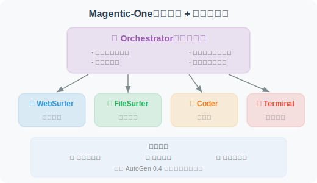
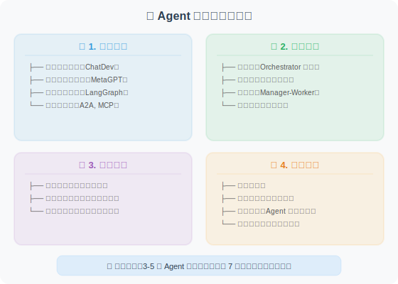
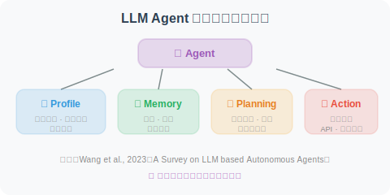
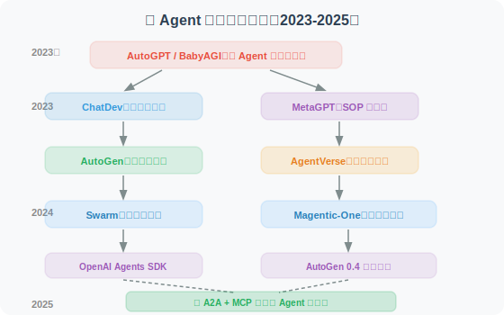

# 11.6 论文解读：多 Agent 系统前沿研究

> 📖 *"一个人走得快，一群人走得远。多 Agent 系统是 Agent 研究中最活跃的方向。"*  
> *本节深入解读多 Agent 协作领域的核心论文。*

---

## MetaGPT：用 SOP 约束的多 Agent 协作

**论文**：*MetaGPT: Meta Programming for A Multi-Agent Collaborative Framework*  
**作者**：Hong et al.  
**发表**：2023 | ICLR 2024 Oral | [arXiv:2308.00352](https://arxiv.org/abs/2308.00352)

### 核心问题

当多个 Agent 自由地用自然语言交流时，信息传递会出现什么问题？
- **信息丢失**：A 告诉 B 的需求，B 转述给 C 时遗漏了细节
- **理解偏差**：每个 Agent 对同一句话可能有不同理解
- **效率低下**：Agent 之间大量的"闲聊"并不产生有效信息

### 核心洞察

**多 Agent 系统需要 SOP（标准操作流程）来约束协作行为。**

MetaGPT 模拟了一个真实的软件公司，定义了清晰的角色和工作流程：

```
产品经理（Product Manager）
  → 输出：PRD 文档（产品需求文档）
    ↓
架构师（Architect）
  → 输出：系统设计文档 + 接口定义
    ↓
项目经理（Project Manager）
  → 输出：任务分配 + 开发计划
    ↓
工程师（Engineer）
  → 输出：代码文件
    ↓
QA 工程师（QA Engineer）
  → 输出：测试用例 + 测试报告
```

### 关键创新：结构化工件传递

MetaGPT 的 Agent 之间不传递松散的自然语言消息，而是传递**结构化的工件（Artifact）**：

```
❌ 松散的聊天消息：
  产品经理："我们需要做一个天气查询功能，要能查北京的天气，
            界面好看一点，加个图表..."

✅ 结构化的 PRD 文档：
  {
    "产品名": "天气查询系统",
    "功能列表": [
      {"名称": "城市天气查询", "优先级": "P0", "描述": "..."},
      {"名称": "天气趋势图表", "优先级": "P1", "描述": "..."}
    ],
    "技术要求": ["Python 3.10+", "FastAPI", "..."],
    "API 接口": [{...}]
  }
```

### 实验结果

在 SoftwareDev 基准上：
- **MetaGPT 代码执行成功率：87%**
- ChatDev 代码执行成功率：44%
- 成功率的巨大差距主要归因于结构化通信减少了信息丢失

### 对 Agent 开发的启示

1. **结构化通信 > 自然语言通信**：Agent 之间传递结构化数据比自然语言更可靠
2. **SOP 的价值**：定义清晰的工作流程可以避免 Agent 之间的混乱协作
3. **角色化 Prompt**：每个 Agent 的 System Prompt 应该明确定义角色职责和输出格式

---

## ChatDev：聊天链驱动的软件开发

**论文**：*Communicative Agents for Software Development*  
**作者**：Qian et al.  
**发表**：2023 | [arXiv:2307.07924](https://arxiv.org/abs/2307.07924)

### 核心思想

ChatDev 模拟了一个软件公司的组织结构，但采用了与 MetaGPT 不同的通信方式——**聊天链（Chat Chain）**：

```
开发流程被分解为多个阶段：
设计阶段 → 编码阶段 → 测试阶段 → 文档阶段

每个阶段只有两个 Agent 对话：
  设计阶段：CEO ↔ CTO
  编码阶段：CTO ↔ 程序员
  测试阶段：程序员 ↔ 测试员
  文档阶段：CEO ↔ 程序员
```

### Inception Prompting

ChatDev 使用了一种称为**"Inception Prompting"（初始提示）**的技术来引导每个阶段的对话：

```
在每个聊天阶段开始时，两个 Agent 都会收到：
1. 角色描述："你是 CTO，负责选择技术方案..."
2. 阶段目标："本阶段的目标是确定使用的编程语言和框架"
3. 输出格式："对话结束时，请总结出技术选型方案"
4. 前置信息：前一阶段的输出结果
```

### 与 MetaGPT 的对比

| 维度 | MetaGPT | ChatDev |
|------|---------|---------|
| 通信方式 | 结构化工件（共享消息池） | 双人聊天链 |
| 协作模式 | 发布-订阅 | 两两对话 |
| 优势 | 信息传递更精确 | 设计更简洁直观 |
| 代码成功率 | 87% | 44% |
| 设计理念 | 工程化、流程化 | 社交化、对话化 |

### 对 Agent 开发的启示

ChatDev 的**"每阶段只有两个 Agent 对话"**的设计降低了多 Agent 协调的复杂度——N 个 Agent 的全连接通信复杂度是 O(N²)，而两两对话将其降为 O(N)。在实际项目中，如果 Agent 数量不多（< 5个），两两对话可能比复杂的共享状态更容易调试。

---

## AutoGen：可对话 Agent 框架

**论文**：*AutoGen: Enabling Next-Gen LLM Applications via Multi-Agent Conversation*  
**作者**：Wu et al., Microsoft Research  
**发表**：2023 | [arXiv:2308.08155](https://arxiv.org/abs/2308.08155)

### 核心抽象：Conversable Agent

AutoGen 提出了"可对话 Agent（Conversable Agent）"的抽象——每个 Agent 都是一个独立的对话参与者：

```python
# AutoGen 的核心抽象（概念示意）
class ConversableAgent:
    """每个 Agent 都可以与其他 Agent 或人类对话"""
    
    def __init__(self, name, system_message, llm_config):
        self.name = name
        self.system_message = system_message
    
    def generate_reply(self, messages):
        """根据收到的消息生成回复"""
        ...
    
    def receive(self, message, sender):
        """接收来自其他 Agent 或人类的消息"""
        ...
    
    def initiate_chat(self, recipient, message):
        """向另一个 Agent 发起对话"""
        ...
```

### 三种预定义 Agent

```
1. AssistantAgent（AI 助手）
   - 由 LLM 驱动
   - 根据对话历史生成回复

2. UserProxyAgent（用户代理）
   - 代表人类用户
   - 可以执行代码、请求人类输入
   - 是 Human-in-the-Loop 的关键

3. GroupChatManager（群聊管理器）
   - 管理多个 Agent 的群组对话
   - 决定下一个发言的 Agent
```

### Human-in-the-Loop

AutoGen 特别强调人类参与——人类可以随时加入多 Agent 对话，提供反馈或修正方向：

```
Agent A: "我认为应该使用 React 来构建前端..."
Agent B: "同意，React 的生态更成熟..."
Human:   "等一下，我们的项目要求使用 Vue.js，请重新讨论。"
Agent A: "好的，那我们用 Vue 3 + Composition API..."
```

### 对 Agent 开发的启示

1. **灵活的对话模式**：Agent 之间可以一对一、一对多、群聊等多种模式
2. **代码执行能力**：UserProxyAgent 可以在本地执行代码，这对编程任务非常重要
3. **人类参与的重要性**：完全自主的多 Agent 系统可能偏离方向，适时的人类干预很关键

---

## AgentVerse：多 Agent 的涌现行为

**论文**：*AgentVerse: Facilitating Multi-Agent Collaboration and Exploring Emergent Behaviors*  
**作者**：Chen et al.  
**发表**：2023 | [arXiv:2308.10848](https://arxiv.org/abs/2308.10848)

### 核心问题

当多个 Agent 自由交互时，会出现哪些**涌现行为（Emergent Behaviors）**？这些行为是好的还是坏的？

### 发现的涌现行为

```
正面涌现：
✅ 互补增强：不同 Agent 弥补了彼此的知识盲区
✅ 质量提升：多 Agent 讨论后的方案优于任何单个 Agent
✅ 创造性组合：不同观点的碰撞产生了新的解决方案

负面涌现：
❌ 群体极化：多数派的意见被过度放大，少数派被忽视
❌ 社会惰化：有些 Agent 在群组中"搭便车"，不贡献有价值的内容
❌ 信息级联：第一个发言的 Agent 的观点过度影响后续 Agent
```

### 动态角色调整

AgentVerse 提出了一种**动态角色调整机制**：在协作过程中，根据任务需要动态添加或移除 Agent 角色，而不是固定使用预定义的团队配置。

### 对 Agent 开发的启示

1. **注意群体动力学**：多 Agent 系统不仅要设计好个体 Agent，还要关注群体行为
2. **发言顺序很重要**：第一个发言的 Agent 可能过度影响结果——可以引入随机性
3. **独立思考 → 讨论 → 投票**：先让每个 Agent 独立思考，再进行讨论，最后投票决策

---

## Magentic-One：通用多 Agent 系统

**论文/技术报告**：*Magentic-One: A Generalist Multi-Agent System for Solving Complex Tasks*  
**作者**：Fourney et al., Microsoft Research  
**发表**：2024 年 11 月 | [arXiv:2411.04468](https://arxiv.org/abs/2411.04468)

### 核心问题

之前的多 Agent 系统（MetaGPT、ChatDev）大多聚焦于**软件开发**这一特定领域。能否构建一个**通用的**多 Agent 系统，像人类专家团队一样处理各种复杂任务？

### 架构设计

Magentic-One 采用了**"指挥官 + 专家团"**架构：



### 实验结果

| 基准 | 任务类型 | Magentic-One 表现 |
|------|---------|------------------|
| GAIA | 通用 AI 助手 | 接近人类水平 |
| AssistantBench | 复杂网页任务 | 当时的 SOTA |
| WebArena | 网页交互 | 竞争力表现 |

### 对 Agent 开发的启示

1. **Orchestrator 模式的有效性**：一个专门的协调 Agent 比"Agent 自由讨论"更可靠
2. **错误恢复是关键**：Magentic-One 约 30% 的成功来自于执行中的动态重规划
3. **基于 AutoGen 构建**：展示了 AutoGen 0.4 事件驱动架构的工程能力

---

## OpenAI Swarm：轻量级多 Agent 编排

**项目**：*Swarm: Educational Framework for Ergonomic, Lightweight Multi-Agent Orchestration*  
**作者**：OpenAI Solutions Team  
**发布**：2024 年 10 月 | [github.com/openai/swarm](https://github.com/openai/swarm)

### 核心理念

与 MetaGPT、AutoGen 等重量级框架不同，Swarm 追求**极简主义**——只用两个核心概念：

```python
# 概念1：Agent = 指令 + 工具
agent_a = Agent(
    name="销售顾问",
    instructions="你是一个友好的销售顾问...",
    functions=[check_inventory, get_price]
)

# 概念2：Handoff = Agent 之间的交接
def transfer_to_support():
    """当用户需要技术支持时，交接给技术支持 Agent"""
    return agent_b  # 返回另一个 Agent 即完成交接

agent_a = Agent(
    name="销售顾问",
    functions=[check_inventory, transfer_to_support]  # handoff 是普通函数
)
```

### 设计哲学

```
重量级框架（AutoGen、CrewAI）：
  - 丰富的抽象（角色、任务、流程）
  - 内置的状态管理和记忆
  - 适合复杂的多 Agent 工作流
  
Swarm 的极简哲学：
  - Agent 就是 instructions + functions
  - Handoff（交接）就是返回另一个 Agent
  - 没有状态管理（无状态，每次调用独立）
  - 适合简单的路由和交接场景
```

### 与 OpenAI Agents SDK 的关系

Swarm 是**教育性质的实验框架**（不建议生产使用），但其核心理念——**Handoff（Agent 交接）和 Routines（例程）**——被继承到了 2025 年发布的 **OpenAI Agents SDK** 中，后者是面向生产环境的正式框架。

### 对 Agent 开发的启示

1. **简单比复杂好**：不是所有场景都需要 AutoGen 或 CrewAI，简单的路由和交接用 Swarm 模式就够了
2. **Handoff 是多 Agent 协作的原语**：Agent 之间的交接可以用普通函数调用实现
3. **OpenAI 的 Agent 方向**：从 Swarm 到 Agents SDK，体现了"极简 + 可组合"的设计理念

---

## 多 Agent 协作综述（2025）

**论文**：*Multi-Agent Collaboration Mechanisms: A Survey of LLMs*  
**作者**：Nguyen et al., University College Cork & 釜山大学  
**发表**：2025 年 1 月 | [arXiv:2501.06322](https://arxiv.org/abs/2501.06322)

### 核心贡献

这是截至 2025 年初最全面的多 Agent 协作机制综述，系统梳理了协作的四大维度：



### 关键发现

1. **结构化通信显著优于自然语言通信**：MetaGPT 的成功验证了这一点
2. **Orchestrator 模式在大多数场景下最可靠**：但在创意类任务中，去中心化讨论可能产生更好的结果
3. **Agent 数量存在"甜蜜点"**：通常 3-5 个 Agent 效果最好，超过 7 个后协调成本急剧上升
4. **标准化协议是趋势**：A2A 和 MCP 正在改变 Agent 之间的互操作方式

---

## 综合综述

**论文**：*A Survey on Large Language Model based Autonomous Agents*  
**作者**：Wang et al., 中国人民大学高瓴人工智能学院  
**发表**：2023 | [arXiv:2308.11432](https://arxiv.org/abs/2308.11432)

这是目前最全面的 LLM Agent 综述论文，系统梳理了 Agent 的四大组成部分：



> 💡 **强烈推荐作为本书的伴读材料**，特别是在阅读多 Agent 相关章节时参考。

---

## 论文对比与发展脉络

| 论文 | 年份 | 通信模式 | Agent 数量 | 核心贡献 |
|------|------|---------|-----------|---------|
| MetaGPT | 2023 | 结构化工件 | 5 | SOP + 结构化通信 |
| ChatDev | 2023 | 双人聊天链 | 4-6 | 聊天链分阶段协作 |
| AutoGen | 2023 | 自由对话 | 2+ | 可对话 Agent 抽象 |
| AgentVerse | 2023 | 群组讨论 | 3+ | 涌现行为研究 |
| **Swarm** | **2024** | **Handoff 交接** | **2+** | **极简多 Agent 编排** |
| **Magentic-One** | **2024** | **Orchestrator 指挥** | **5** | **通用多 Agent 系统** |
| **协作综述** | **2025** | **系统分类** | **—** | **四维度协作机制分析** |

**发展脉络**：



> 💡 **前沿趋势（2025-2026）**：多 Agent 系统正在从"框架竞争"转向"协议标准化"。三大趋势：① **Orchestrator 模式占主导**：Magentic-One 和 OpenAI Agents SDK 都采用了这种"一个协调者 + 多个专家"的架构；② **互操作标准化**：Google 的 A2A 和 Anthropic 的 MCP 协议让不同框架构建的 Agent 可以互相协作（详见第 12 章）；③ **从软件开发向通用场景扩展**：科学研究、商业分析、教育模拟等更广泛的多 Agent 应用正在涌现。

---

*返回：[第11章 多 Agent 协作](./README.md)*
