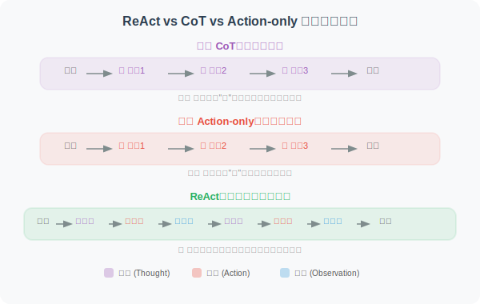
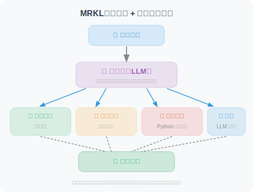
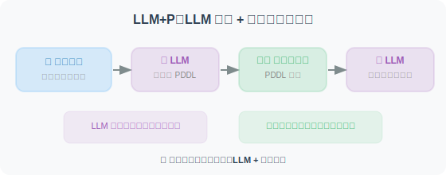
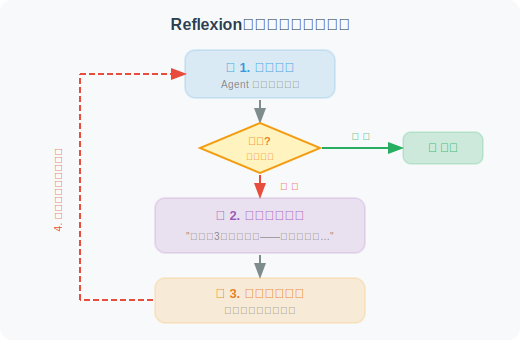
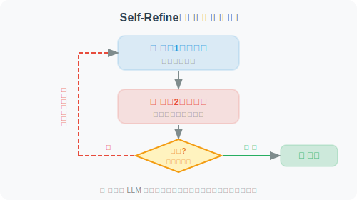
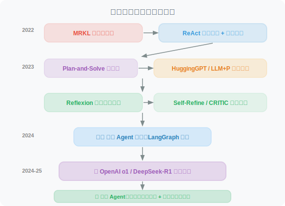

# 6.6 论文解读：规划与推理前沿研究

> 📖 *"Agent 的推理能力决定了它的上限，而规划能力决定了它能处理的任务复杂度。"*  
> *本节深入解读规划与推理领域的核心论文。*

---

## ReAct：推理与行动的融合

**论文**：*ReAct: Synergizing Reasoning and Acting in Language Models*  
**作者**：Yao et al., Princeton University & Google Brain  
**发表**：2022 | [arXiv:2210.03629](https://arxiv.org/abs/2210.03629)

### 核心问题

在 ReAct 之前，LLM 的推理（Chain-of-Thought）和行动（工具调用）是两个独立的研究方向：
- **CoT 让模型"会想"但"不会做"**——推理时无法获取外部信息
- **工具调用让模型"会做"但"不会想"**——盲目执行而不解释理由

### 核心思想

ReAct 的核心洞察：**推理为行动提供方向，行动为推理提供依据，两者交替进行才能解决复杂问题。**



### 实验结果

| 任务 | CoT | Act-only | ReAct | 提升 |
|------|-----|----------|-------|------|
| HotpotQA（多跳问答） | 29.4% | 25.7% | 35.1% | +6pp vs CoT |
| ALFWorld（交互式游戏） | — | 45% | 79% | +34pp vs Act |
| WebShop（在线购物） | — | 30.1% | 40.0% | +10pp vs Act |

### 对 Agent 开发的启示

ReAct 直接奠定了现代 Agent 的基本架构。今天几乎所有主流框架（LangChain、LlamaIndex、AutoGen）的默认 Agent 模式都基于 ReAct。6.2 节的代码实现就是 ReAct 论文的工程化实践。

---

## MRKL Systems：模块化的专家路由

**论文**：*MRKL Systems: A modular, neuro-symbolic architecture that combines large language models, external knowledge sources and discrete reasoning*  
**作者**：Karpas et al., AI21 Labs  
**发表**：2022

### 核心思想

MRKL（Modular Reasoning, Knowledge and Language）提出了一种"路由器 + 专家模块"的架构：



### 与 ReAct 的关系

MRKL 是 ReAct 的前身之一，但有一个关键区别：
- **MRKL 的路由是相对固定的**：根据输入类型分配到预定义的专家
- **ReAct 让模型自主决策**：模型在推理过程中动态决定调用哪个工具

这种从"硬编码路由"到"自主决策"的演进，是 Agent 技术发展的重要一步。

---

## Plan-and-Solve：先规划，再执行

**论文**：*Plan-and-Solve Prompting: Improving Zero-Shot Chain-of-Thought Reasoning by Large Language Models*  
**作者**：Wang et al.  
**发表**：2023 | [arXiv:2305.04091](https://arxiv.org/abs/2305.04091)

### 核心问题

Zero-shot CoT（"Let's think step by step"）虽然简单有效，但在复杂问题上容易犯三类错误：
1. **计算错误**：在多步计算中某一步算错
2. **缺步错误**：遗漏关键的中间步骤
3. **语义理解错误**：误解题目中的关键信息

### 方法原理

Plan-and-Solve 的核心改进非常优雅——将一句提示词替换：

```
Zero-shot CoT：
"Let's think step by step."

Plan-and-Solve (PS)：
"Let's first understand the problem and devise a plan to solve it.
 Then, let's carry out the plan and solve the problem step by step."

Plan-and-Solve+ (PS+)：
"Let's first understand the problem, extract relevant variables and their 
 corresponding numerals, and make a plan. Then, let's carry out the plan, 
 calculate intermediate results (pay attention to correct numerical 
 calculation and target commonsense reasoning), and solve the problem 
 step by step."
```

### 实验结果

在 GSM8K 数学推理基准上，PS+ 比标准 Zero-shot CoT 提升了 5-6 个百分点。

### 对 Agent 开发的启示

Plan-and-Solve 的思想直接对应了 Agent 中的 **Plan-and-Execute 模式**（6.3 节）：先让 LLM 制定完整的执行计划，再逐步执行每个子任务。这比"走一步看一步"的 ReAct 模式在某些任务上更可靠。

---

## HuggingGPT：跨模态的任务规划

**论文**：*HuggingGPT: Solving AI Tasks with ChatGPT and its Friends in HuggingFace*  
**作者**：Shen et al., Microsoft Research  
**发表**：2023

### 核心思想

用 ChatGPT 作为"大脑"来分解复杂任务，然后调度 HuggingFace 上的专业模型来执行子任务：

```
用户请求："帮我描述这张图片中的内容，并把描述翻译成法语"
    ↓
ChatGPT（规划器）：
  子任务1：用图像描述模型描述图片 → 调用 blip-image-captioning
  子任务2：用翻译模型翻译为法语 → 调用 Helsinki-NLP/opus-mt-en-fr
    ↓
收集结果并汇总
```

### 对 Agent 开发的启示

HuggingGPT 展示了"规划 + 工具调用"在多模态任务上的强大能力，其架构思想（大模型规划、小模型执行）在今天的 Agent 系统中广泛应用。

---

## LLM+P：结合传统 AI 规划器

**论文**：*LLM+P: Empowering Large Language Models with Optimal Planning Proficiency*  
**作者**：Liu et al.  
**发表**：2023

### 核心问题

LLM 在长程规划中容易犯错——特别是需要满足复杂约束条件的规划问题（如调度、资源分配）。传统 AI 规划器（如基于 PDDL 的规划器）在这些问题上更可靠，但无法理解自然语言。

### 方法原理



**核心思想**：LLM 做翻译、规划器做推理——各司其职。

### 对 Agent 开发的启示

这种"LLM + 专业工具"的组合思路在 Agent 开发中非常实用：
- 不要让 LLM 做所有事情，它的规划能力是有限的
- 对于需要精确推理的任务，应该将推理部分交给专业工具

---

## Reflexion：语言强化学习

**论文**：*Reflexion: Language Agents with Verbal Reinforcement Learning*  
**作者**：Shinn et al.  
**发表**：2023 | [arXiv:2303.11366](https://arxiv.org/abs/2303.11366)

### 核心问题

传统的强化学习需要大量的试错和参数更新。对于 LLM Agent，能否用一种更轻量的方式从错误中学习？

### 方法原理

Reflexion 提出了**"语言强化学习"**——Agent 在任务失败后不更新模型权重，而是生成自然语言的"反思笔记"并存入长期记忆：



### 实验结果

| 任务 | 无反思 | 有反思（Reflexion） | 提升 |
|------|--------|-------------------|------|
| HumanEval（代码生成） | 80% | 91% | +11pp |
| AlfWorld（决策任务） | 63% | 97% | +34pp |

### 关键发现

1. **反思记忆是关键**：不仅在当前任务中反思，还要跨任务保存和复用反思经验
2. **语言比梯度更灵活**：自然语言描述的"经验教训"比参数更新更容易迁移到新任务
3. **长期记忆的价值**：随着反思笔记的积累，Agent 的表现持续提升

---

## Self-Refine：迭代自我改进

**论文**：*Self-Refine: Iterative Refinement with Self-Feedback*  
**作者**：Madaan et al., CMU  
**发表**：2023 | [arXiv:2303.17651](https://arxiv.org/abs/2303.17651)

### 方法原理

Self-Refine 的方案更简洁——让同一个 LLM 扮演两个角色：



### 实验结果

在代码生成、数学推理、对话摘要等 7 个任务上平均提升了约 20%。

### 与 Reflexion 的区别

- **Self-Refine**：在当前任务内反复改进，不保存长期记忆
- **Reflexion**：跨任务积累反思经验，形成长期记忆

---

## CRITIC：工具辅助的自我纠错

**论文**：*CRITIC: Large Language Models Can Self-Correct with Tool-Interactive Critiquing*  
**作者**：Gou et al.  
**发表**：2023 | [arXiv:2305.11738](https://arxiv.org/abs/2305.11738)

### 核心创新

在自我批评的基础上引入**工具验证**——Agent 的自我评估不再仅依赖 LLM 自身的判断，而是借助外部工具进行客观验证：

```
代码任务：Agent 写完代码 → 运行单元测试 → 根据测试结果修改代码
事实任务：Agent 写完回答 → 用搜索引擎核实关键事实 → 修正错误信息
数学任务：Agent 给出推理 → 用计算器验证计算结果 → 修正计算错误
```

### 关键发现：自我纠错的边界

一篇重要的反面论文值得注意——**"Large Language Models Cannot Self-Correct Reasoning Yet"**（Huang et al., 2023）指出：

- **在没有外部反馈的情况下，LLM 的纯自我反思可能反而降低推理准确率**
- 模型容易"自信地犯错"——把正确答案改成错误答案
- **实践启示：反思循环中一定要引入外部验证（如代码执行、搜索核实）**

---

---

## DeepSeek-R1：强化学习激发推理能力

**论文**：*DeepSeek-R1: Incentivizing Reasoning Capability in LLMs via Reinforcement Learning*  
**作者**：DeepSeek-AI  
**发表**：2025 年 1 月 | [arXiv:2501.12948](https://arxiv.org/abs/2501.12948)

### 核心问题

传统的 LLM 推理增强依赖监督微调（SFT）——需要人类标注"正确的推理步骤"。但高质量推理数据的标注成本极高，且人类标注者可能遗漏最优推理路径。**能否让模型通过纯强化学习自主学会推理？**

### 方法原理

DeepSeek-R1 的核心创新是用 **GRPO（Group Relative Policy Optimization）** 算法让模型自主进化出推理能力：

```
DeepSeek-R1-Zero（纯 RL，无 SFT）：
  1. 从 DeepSeek-V3 基座模型出发
  2. 只给模型"问题"和"答案是否正确"的信号
  3. 不提供任何人类标注的推理过程
  4. 模型在训练中自发涌现出：
     - "让我重新想一下..."（自我反思）
     - "等等，这一步有错..."（自我纠错）
     - "让我从另一个角度考虑..."（多路径探索）

DeepSeek-R1（RL + 蒸馏）：
  在 R1-Zero 的基础上：
  1. 先用少量高质量 SFT 数据"冷启动"
  2. 再用大规模 RL 训练
  3. 将大模型的推理能力蒸馏到小模型
     → 1.5B ~ 70B 的蒸馏版本也具备强推理能力
```

### 关键发现

1. **推理能力可以通过纯 RL 涌现**：R1-Zero 没有见过任何人类标注的推理过程，但自发学会了反思、验证、多步推理
2. **"Aha moment"**：训练过程中模型突然学会自我反思的转折点，是涌现行为的经典案例
3. **蒸馏效果惊人**：32B 蒸馏模型在数学推理上超过了 OpenAI o1-mini，7B 版本也具备强推理能力
4. **开源生态**：MIT 协议开源，推动了推理模型的民主化

### 实验结果

| 基准 | GPT-4o | OpenAI o1 | DeepSeek-R1 |
|------|--------|-----------|-------------|
| AIME 2024（数学竞赛） | 9.3% | 79.2% | 79.8% |
| MATH-500 | 76.6% | 96.4% | 97.3% |
| Codeforces Rating | 759 | 1891 | 2029 |
| GPQA Diamond（科学推理） | 49.9% | 75.7% | 71.5% |

### 对 Agent 开发的启示

1. **推理模型改变了 Agent 的架构设计**：o1/o3/R1 等推理模型在"想清楚再做"方面远超普通模型，适合作为 Agent 的规划和决策核心
2. **"慢思考"vs "快思考"**：可以用推理模型处理复杂的规划和决策，用普通模型处理简单的工具调用和信息检索
3. **小模型也能推理**：蒸馏版 R1 让边缘部署的推理 Agent 成为可能

---

## OpenAI o1：原生推理的里程碑

**论文/技术报告**：*Learning to Reason with LLMs*  
**作者**：OpenAI  
**发表**：2024 年 9 月

### 核心贡献

OpenAI o1 是第一个将**"链式思考"内化到模型训练过程中**的商业模型，标志着"推理模型"这一全新品类的诞生：

```
传统 LLM（如 GPT-4o）：
  直接生成答案，推理能力依赖提示工程（如 CoT Prompting）

推理模型（如 o1）：
  在生成答案前，先进行内部"思考"
  生成一段（用户可能看不到的）推理链
  然后基于推理链生成最终答案

关键区别：
  - GPT-4o：Prompt 中写 "Let's think step by step" → 外部引导推理
  - o1：模型自身会先"想"再"说" → 内部原生推理
```

### 后续发展

| 模型 | 发布时间 | 特点 |
|------|---------|------|
| o1-preview | 2024.09 | 首个推理模型，数学/编程显著提升 |
| o1 | 2024.12 | 正式版，性能全面提升 |
| o3-mini | 2025.01 | 成本优化版，支持 low/medium/high 推理强度 |
| o3 | 2025.04 | 旗舰推理模型 |
| o4-mini | 2025.04 | 工具调用 + 推理的结合 |

### 对 Agent 开发的启示

推理模型的出现让 Agent 开发者面临新的选择：
- **简单任务**用普通模型（GPT-4o-mini），成本低、速度快
- **复杂规划和决策**用推理模型（o3、DeepSeek-R1），准确率高
- **Plan-and-Execute 模式的回归**：推理模型天然适合"先规划再执行"的 Agent 架构

---

## 论文对比与发展脉络

| 论文 | 年份 | 核心贡献 | 局限性 |
|------|------|---------|--------|
| MRKL | 2022 | 模块化路由架构 | 路由规则硬编码 |
| ReAct | 2022 | 推理+行动交替 | Token 消耗大 |
| Plan-and-Solve | 2023 | 先规划再执行 | 静态计划，不适应变化 |
| HuggingGPT | 2023 | 跨模态任务规划 | 延迟高，依赖外部模型 |
| LLM+P | 2023 | LLM + 传统规划器 | PDDL 翻译可能出错 |
| Reflexion | 2023 | 语言强化学习 | 需要明确的成功/失败信号 |
| Self-Refine | 2023 | 迭代自我改进 | 可能陷入无效循环 |
| CRITIC | 2023 | 工具辅助自我纠错 | 需要合适的验证工具 |
| **OpenAI o1** | **2024** | **原生推理模型** | 成本高、不支持工具调用（早期） |
| **DeepSeek-R1** | **2025** | **纯 RL 涌现推理 + 开源** | 推理过程不可控、可能过度思考 |

**发展脉络**：



> 💡 **前沿趋势（2025-2026）**："推理模型"正在重塑 Agent 的架构设计。OpenAI o3/o4-mini 已支持工具调用 + 推理的结合，DeepSeek-R1 的开源让小模型也能具备强推理能力。Agent 开发中的一个重要新模式是**"双模型架构"**——用推理模型（o3/R1）作为规划核心负责复杂决策，用普通模型（GPT-4o-mini）作为执行层负责工具调用和信息检索，兼顾准确性和成本。同时，研究表明 LLM 在需要 5 步以上规划的任务中成功率急剧下降——推理模型正在缓解但尚未完全解决这一瓶颈。

---

*返回：[第6章 规划与推理](./README.md)*
