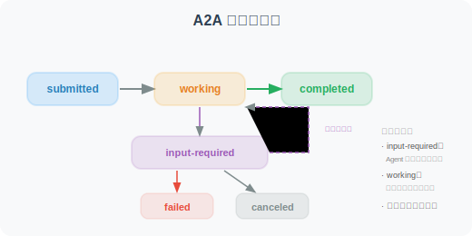

# A2A（Agent-to-Agent）协议

A2A（Agent-to-Agent）是 Google 于 2025 年 4 月在 Google Cloud Next 大会上推出的开放协议，专门设计用于不同 Agent 之间的互操作性。该协议发布时即获得超过 50 家技术合作伙伴的支持。

## A2A 的设计目标

```
A2A 解决的问题：
- 不同公司/团队开发的 Agent 如何互相调用？
- 如何标准化 Agent 能力的声明和发现？
- 跨框架的 Agent 如何安全地传递任务？

类比：
A2A 对 Agent = HTTP 对 Web 服务
让 Agent 成为可以相互连接的"微服务"
```

### MCP vs A2A：互补而非竞争

```
MCP 和 A2A 解决的是不同层面的问题：

MCP（模型-工具层）：
  Agent ←→ 工具/数据
  "让 Agent 能使用各种工具"
  类比：人学会使用锤子、扳手

A2A（Agent-Agent 层）：
  Agent ←→ Agent
  "让 Agent 能与其他 Agent 协作"
  类比：人与人之间的沟通协作

两者结合 = 完整的 Agent 互操作体系
```

## Agent 能力卡（Agent Card）

每个 A2A 兼容的 Agent 都需要在 `/.well-known/agent.json` 发布一个能力卡：

```python
import json
from typing import Optional

class AgentCard:
    """A2A Agent 能力声明"""
    
    def __init__(
        self,
        name: str,
        description: str,
        url: str,
        version: str = "1.0.0"
    ):
        self.card = {
            "name": name,
            "description": description,
            "url": url,
            "version": version,
            "capabilities": {
                "streaming": True,
                "pushNotifications": False,
                "stateTransitionHistory": True,  # 支持状态追踪
            },
            "defaultInputModes": ["text"],
            "defaultOutputModes": ["text"],
            "skills": []
        }
    
    def add_skill(
        self,
        id: str,
        name: str,
        description: str,
        input_modes: list[str] = None,
        output_modes: list[str] = None
    ):
        """添加技能描述"""
        self.card["skills"].append({
            "id": id,
            "name": name,
            "description": description,
            "inputModes": input_modes or ["text"],
            "outputModes": output_modes or ["text"],
        })
    
    def to_json(self) -> str:
        return json.dumps(self.card, ensure_ascii=False, indent=2)

# 创建示例 Agent Card
card = AgentCard(
    name="数据分析 Agent",
    description="专业的数据分析 Agent，可以处理 CSV 数据并生成可视化报告",
    url="https://my-agent.example.com",
    version="2.1.0"
)

card.add_skill(
    id="analyze_csv",
    name="CSV 数据分析",
    description="分析 CSV 文件中的数据，计算统计指标",
    input_modes=["text", "file"],
    output_modes=["text", "data"]
)

card.add_skill(
    id="generate_chart",
    name="数据可视化",
    description="生成数据图表（折线图、柱状图、饼图）",
    input_modes=["data"],
    output_modes=["image", "text"]
)

print(card.to_json())
```

## A2A 任务传递

A2A 定义了完整的任务生命周期管理，包括任务的创建、执行、状态追踪和结果返回：

```python
from fastapi import FastAPI
from pydantic import BaseModel
import uuid
import datetime

app = FastAPI(title="A2A Agent Server")

# ============================
# A2A 消息格式
# ============================

class A2AMessage(BaseModel):
    """A2A 标准消息格式"""
    role: str  # "user" | "agent"
    parts: list[dict]  # 消息内容块（支持 text、file、data 等类型）

class A2ATask(BaseModel):
    """A2A 任务请求"""
    id: Optional[str] = None
    message: A2AMessage

class A2ATaskResult(BaseModel):
    """A2A 任务结果"""
    id: str
    status: dict  # state: "completed" | "failed" | "working" | "input-required"
    artifacts: list[dict] = []

# ============================
# A2A Server 端点
# ============================

@app.get("/.well-known/agent.json")
async def get_agent_card():
    """Agent 能力声明（所有 A2A Agent 必须实现）"""
    return card.card

@app.post("/tasks/send")
async def send_task(task: A2ATask) -> A2ATaskResult:
    """接收并处理任务（同步模式）"""
    task_id = task.id or str(uuid.uuid4())
    
    # 提取用户消息
    user_message = ""
    for part in task.message.parts:
        if part.get("type") == "text":
            user_message += part.get("text", "")
    
    # 处理任务（调用真实的 Agent 逻辑）
    from openai import OpenAI
    client = OpenAI()
    
    response = client.chat.completions.create(
        model="gpt-4o-mini",
        messages=[{"role": "user", "content": user_message}]
    )
    
    result = response.choices[0].message.content
    
    return A2ATaskResult(
        id=task_id,
        status={
            "state": "completed",
            "timestamp": datetime.datetime.now().isoformat()
        },
        artifacts=[{
            "parts": [{"type": "text", "text": result}],
            "name": "response"
        }]
    )

@app.post("/tasks/sendSubscribe")
async def send_task_streaming(task: A2ATask):
    """接收并处理任务（流式模式，通过 SSE 返回中间状态）"""
    # 支持长时间运行的任务，通过 SSE 推送状态更新
    pass

# ============================
# A2A 客户端（调用其他 Agent）
# ============================

import requests

class A2AClient:
    """A2A 客户端：调用其他 Agent"""
    
    def __init__(self, agent_url: str):
        self.agent_url = agent_url.rstrip("/")
        self.agent_card = None
    
    def discover(self) -> dict:
        """发现 Agent 能力"""
        response = requests.get(
            f"{self.agent_url}/.well-known/agent.json"
        )
        self.agent_card = response.json()
        return self.agent_card
    
    def send_task(self, message: str) -> str:
        """发送任务给 Agent"""
        payload = {
            "message": {
                "role": "user",
                "parts": [{"type": "text", "text": message}]
            }
        }
        
        response = requests.post(
            f"{self.agent_url}/tasks/send",
            json=payload
        )
        
        result = response.json()
        
        # 提取结果
        for artifact in result.get("artifacts", []):
            for part in artifact.get("parts", []):
                if part.get("type") == "text":
                    return part["text"]
        
        return "Agent 返回结果为空"

# 使用示例
client = A2AClient("https://my-data-agent.example.com")
card = client.discover()
print(f"发现 Agent：{card['name']}")
print(f"可用技能：{[s['name'] for s in card.get('skills', [])]}")

result = client.send_task("分析这组销售数据并给出趋势分析：[100, 120, 95, 140, 160]")
print(result)
```

## A2A 任务状态机

A2A 定义了清晰的任务状态流转：



## 流式模式：`/tasks/sendSubscribe`

对于长时间运行的任务（如数据分析、文档生成），A2A 提供基于 **SSE（Server-Sent Events）** 的流式模式，让客户端实时接收任务进度更新：

```python
from fastapi import FastAPI
from fastapi.responses import StreamingResponse
import json
import asyncio

app = FastAPI()

async def task_stream(task_id: str, user_message: str):
    """通过 SSE 流式返回任务进度和结果"""
    
    # 1. 发送任务状态变更：working
    yield f"data: {json.dumps({'id': task_id, 'status': {'state': 'working', 'message': '正在分析数据...'}})}\n\n"
    
    await asyncio.sleep(1)  # 模拟处理
    
    # 2. 发送中间结果（artifact 更新）
    yield f"data: {json.dumps({'id': task_id, 'artifact': {'parts': [{'type': 'text', 'text': '已完成第一阶段：数据清洗'}], 'name': 'progress', 'append': True}})}\n\n"
    
    await asyncio.sleep(1)
    
    # 3. 发送最终结果
    yield f"data: {json.dumps({'id': task_id, 'status': {'state': 'completed'}, 'artifact': {'parts': [{'type': 'text', 'text': '分析完成：销售额增长 23%'}], 'name': 'result', 'lastChunk': True}})}\n\n"

@app.post("/tasks/sendSubscribe")
async def send_task_streaming(task: dict):
    """A2A 流式任务端点"""
    task_id = task.get("id", str(uuid.uuid4()))
    user_message = task["message"]["parts"][0].get("text", "")
    
    return StreamingResponse(
        task_stream(task_id, user_message),
        media_type="text/event-stream",
        headers={
            "Cache-Control": "no-cache",
            "Connection": "keep-alive",
        }
    )
```

**客户端消费 SSE 流**：

```python
import httpx

async def subscribe_task(agent_url: str, message: str):
    """订阅流式任务结果"""
    payload = {
        "message": {
            "role": "user",
            "parts": [{"type": "text", "text": message}]
        }
    }
    
    async with httpx.AsyncClient() as client:
        async with client.stream(
            "POST", f"{agent_url}/tasks/sendSubscribe", json=payload
        ) as response:
            async for line in response.aiter_lines():
                if line.startswith("data: "):
                    event = json.loads(line[6:])
                    status = event.get("status", {})
                    print(f"状态: {status.get('state', 'unknown')}")
                    
                    if artifact := event.get("artifact"):
                        for part in artifact.get("parts", []):
                            if part.get("type") == "text":
                                print(f"  → {part['text']}")
```

## Push Notifications（推送通知）

对于需要更长时间处理的任务，A2A 支持通过 **Push Notifications** 机制异步通知客户端，避免客户端长时间保持 SSE 连接：

```python
class AgentCardWithPush:
    """支持推送通知的 Agent Card"""
    
    def __init__(self, name: str, url: str):
        self.card = {
            "name": name,
            "url": url,
            "capabilities": {
                "streaming": True,
                "pushNotifications": True,  # 声明支持推送
                "stateTransitionHistory": True,
            },
            "skills": []
        }

# Push Notification 工作流程：
# 1. 客户端调用 /tasks/send 提交任务
# 2. 客户端调用 /tasks/{id}/pushNotification/set 注册回调 URL
# 3. Agent 处理完成后向回调 URL 发送通知
# 4. 客户端调用 /tasks/{id} 获取完整结果

@app.post("/tasks/{task_id}/pushNotification/set")
async def set_push_notification(task_id: str, config: dict):
    """注册推送通知回调"""
    callback_url = config.get("url")
    # 存储回调 URL，任务完成后向此 URL 发送 POST 请求
    push_registry[task_id] = callback_url
    return {"status": "registered"}
```

## 认证与安全

A2A 协议通过 Agent Card 的 `authentication` 字段声明认证要求，支持多种认证方案：

```python
# Agent Card 中的认证声明
agent_card_with_auth = {
    "name": "企业数据分析 Agent",
    "url": "https://data-agent.corp.example.com",
    "version": "2.0.0",
    "authentication": {
        "schemes": [
            {
                "scheme": "Bearer",
                "description": "使用 OAuth 2.0 Bearer Token 认证",
                "tokenUrl": "https://auth.corp.example.com/oauth/token",
                "scopes": ["agent:read", "agent:execute"]
            },
            {
                "scheme": "ApiKey",
                "description": "使用 API Key 认证",
                "in": "header",
                "name": "X-API-Key"
            }
        ]
    },
    "capabilities": {
        "streaming": True,
        "pushNotifications": True,
        "stateTransitionHistory": True,
    },
    "skills": [...]
}

# 客户端带认证调用
class A2ASecureClient:
    """带认证的 A2A 客户端"""
    
    def __init__(self, agent_url: str, auth_token: str):
        self.agent_url = agent_url
        self.headers = {
            "Authorization": f"Bearer {auth_token}",
            "Content-Type": "application/json"
        }
    
    def send_task(self, message: str) -> dict:
        response = requests.post(
            f"{self.agent_url}/tasks/send",
            json={
                "message": {
                    "role": "user",
                    "parts": [{"type": "text", "text": message}]
                }
            },
            headers=self.headers
        )
        response.raise_for_status()
        return response.json()
```

---

## 小结

A2A 协议的价值：
- **互操作性**：不同框架、不同团队的 Agent 可以相互调用
- **服务发现**：通过 Agent Card（`/.well-known/agent.json`）声明能力
- **标准消息格式**：统一的请求/响应格式，支持多模态
- **任务状态管理**：完整的任务生命周期追踪
- **与 MCP 互补**：MCP 管理 Agent-工具连接，A2A 管理 Agent-Agent 连接
- **行业支持**：Google、Salesforce、SAP 等 50+ 企业参与

---

*下一节：[15.3 ANP（Agent Network Protocol）协议](./03_anp_protocol.md)*
