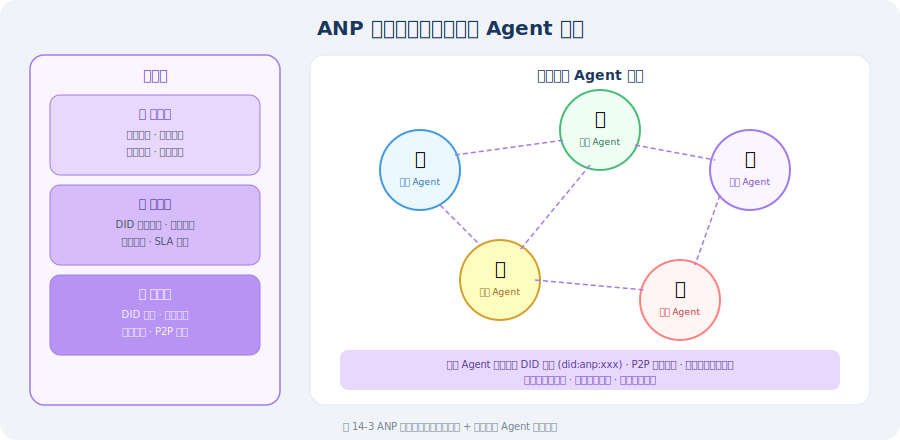

# 15.3 ANP（Agent Network Protocol）协议

> **本节目标**：理解 ANP 协议的设计理念，掌握去中心化智能体网络的核心机制，并与 MCP/A2A 进行对比分析。

---

## 为什么需要 ANP？

在前两节中，我们学习了 MCP 和 A2A 两种协议：
- **MCP** 解决了 Agent 与工具之间的"连接"问题
- **A2A** 解决了 Agent 与 Agent 之间的"协作"问题

但当我们面临**大规模智能体网络**的场景时，一个新的问题浮现了：

> **在一个有成千上万 Agent 的开放网络中，Agent 如何发现彼此、验证身份、安全地通信？**

这就是 **ANP（Agent Network Protocol）** 要解决的问题 [1]。

### 类比理解

| 协议 | 类比 | 核心问题 |
|------|------|---------|
| **MCP** | USB 接口标准 | Agent 如何接入工具？ |
| **A2A** | 即时通讯协议 | 两个 Agent 如何协作？ |
| **ANP** | 互联网 DNS + HTTPS | 大量 Agent 如何组网？ |

如果说 MCP 是"Agent 的 USB"，A2A 是"Agent 的微信"，那么 ANP 就是"**Agent 的互联网**"。

---

## ANP 的核心设计理念

ANP 的设计遵循以下关键原则 [1]：

### 1. 去中心化（Decentralization）

传统的 Agent 协作（包括 A2A）通常依赖中心化的服务发现机制——Agent 注册到一个中央注册表，其他 Agent 通过注册表查找。但中心化方案存在**单点故障、扩展性瓶颈、信任集中**等问题。

ANP 采用**去中心化架构**：每个 Agent 拥有自己的身份标识，可以独立地发布自己的能力描述，无需依赖中央服务器。

### 2. DID 身份验证（Decentralized Identifiers）

ANP 使用 **DID（去中心化标识符）**[2] 作为 Agent 的身份基础：

```
# DID 格式
did:anp:agent_12345

# 完整的 DID Document 示例
{
  "@context": "https://www.w3.org/ns/did/v1",
  "id": "did:anp:agent_12345",
  "authentication": [
    {
      "id": "did:anp:agent_12345#keys-1",
      "type": "Ed25519VerificationKey2020",
      "publicKeyMultibase": "z6MkhaXgBZDvotDkL5257faiztiGiC2QtKLGpbnnEGta2doK"
    }
  ],
  "service": [
    {
      "id": "did:anp:agent_12345#agent-service",
      "type": "AgentService",
      "serviceEndpoint": "https://agent.example.com/api"
    }
  ]
}
```

DID 的关键优势：
- **自主性**：Agent 自己生成和管理身份，不依赖第三方
- **可验证性**：通过密码学签名验证 Agent 身份
- **互操作性**：W3C 标准，跨平台兼容

### 3. 去中心化服务发现

ANP 定义了 Agent 的**能力描述格式**和**发现机制**：

```python
# ANP Agent 能力描述（概念性实现）
agent_capability = {
    "did": "did:anp:weather_agent_001",
    "name": "天气预报 Agent",
    "description": "提供全球城市的实时天气查询和未来 7 天预报",
    
    "capabilities": [
        {
            "name": "get_current_weather",
            "description": "获取指定城市当前天气",
            "input_schema": {
                "type": "object",
                "properties": {
                    "city": {"type": "string", "description": "城市名称"},
                    "unit": {"type": "string", "enum": ["celsius", "fahrenheit"]}
                },
                "required": ["city"]
            },
            "output_schema": {
                "type": "object",
                "properties": {
                    "temperature": {"type": "number"},
                    "condition": {"type": "string"},
                    "humidity": {"type": "number"}
                }
            }
        },
        {
            "name": "get_forecast",
            "description": "获取未来 7 天天气预报",
            "input_schema": {
                "type": "object",
                "properties": {
                    "city": {"type": "string"},
                    "days": {"type": "integer", "minimum": 1, "maximum": 7}
                },
                "required": ["city"]
            }
        }
    ],
    
    "trust_score": 0.95,
    "response_time_ms": 200,
    "pricing": {
        "model": "per_request",
        "price": 0.001,
        "currency": "USD"
    }
}
```

---

## ANP 的三层协议栈

ANP 的协议设计分为三层：



### 传输层：安全通信

```python
class ANPTransport:
    """ANP 传输层（概念性实现）"""
    
    def __init__(self, agent_did: str, private_key):
        self.did = agent_did
        self.private_key = private_key
    
    def send_message(self, target_did: str, message: dict) -> dict:
        """
        向目标 Agent 发送加密消息
        
        流程：
        1. 解析目标 DID 获取公钥和 Endpoint
        2. 用目标公钥加密消息
        3. 用自己的私钥签名
        4. 发送到目标 Endpoint
        """
        # 1. DID 解析
        target_doc = self.resolve_did(target_did)
        target_pubkey = target_doc["authentication"][0]["publicKeyMultibase"]
        target_endpoint = target_doc["service"][0]["serviceEndpoint"]
        
        # 2. 构建签名消息
        signed_message = {
            "from": self.did,
            "to": target_did,
            "timestamp": time.time(),
            "payload": message,
            "signature": self.sign(message),  # 私钥签名
        }
        
        # 3. 加密并发送
        encrypted = self.encrypt(signed_message, target_pubkey)
        response = self.http_post(target_endpoint, encrypted)
        
        return response
    
    def resolve_did(self, did: str) -> dict:
        """解析 DID 获取 DID Document"""
        # 在去中心化网络中查找 DID Document
        # 可以是区块链、DHT、DNS 等多种解析方式
        pass
    
    def sign(self, message: dict) -> str:
        """使用私钥对消息签名"""
        pass
    
    def encrypt(self, message: dict, public_key: str) -> bytes:
        """使用目标公钥加密消息"""
        pass
```

### 协商层：智能路由

```python
class ANPRouter:
    """ANP 智能路由（概念性实现）"""
    
    def __init__(self):
        self.known_agents = {}  # DID -> 能力描述
    
    def discover_agents(
        self, 
        capability_query: str,
        min_trust_score: float = 0.8
    ) -> list[dict]:
        """
        发现具有特定能力的 Agent
        
        搜索策略：
        1. 本地缓存查找
        2. 已知邻居节点查询
        3. 全网广播（最后手段）
        """
        candidates = []
        
        for did, capability in self.known_agents.items():
            # 能力匹配
            if self._match_capability(capability, capability_query):
                # 信任过滤
                if capability.get("trust_score", 0) >= min_trust_score:
                    candidates.append({
                        "did": did,
                        "capability": capability,
                        "trust_score": capability["trust_score"],
                        "response_time": capability.get("response_time_ms", 999),
                    })
        
        # 按信任分数和响应时间排序
        candidates.sort(
            key=lambda x: (-x["trust_score"], x["response_time"])
        )
        
        return candidates
    
    def _match_capability(self, capability: dict, query: str) -> bool:
        """检查 Agent 能力是否匹配查询"""
        # 简化版：关键词匹配
        description = capability.get("description", "").lower()
        cap_names = [c["name"].lower() for c in capability.get("capabilities", [])]
        
        query_lower = query.lower()
        return (
            query_lower in description or
            any(query_lower in name for name in cap_names)
        )
```

---

## MCP vs A2A vs ANP 三协议对比


| 维度 | MCP | A2A | ANP |
|------|-----|-----|-----|
| **核心目标** | Agent ↔ 工具连接 | Agent ↔ Agent 协作 | 大规模 Agent 组网 |
| **通信模式** | 请求-响应 | 任务委派 + 流式 | 对等通信 + 路由 |
| **服务发现** | 客户端主动连接 | 中心化 Agent Card | 去中心化 DID + DHT |
| **身份验证** | 可选（通常无） | Agent Card 声明 | DID 密码学验证 |
| **安全性** | 依赖传输层 | JSON-RPC over HTTPS | 端到端加密 + 签名 |
| **扩展性** | 单点连接 | 小规模团队 | 大规模网络 |
| **标准化** | Anthropic 主导 | Google 主导 | 社区驱动 |
| **成熟度** | ⭐⭐⭐⭐ 生产可用 | ⭐⭐⭐ 逐步成熟 | ⭐⭐ 早期阶段 |
| **适用场景** | 工具/数据源接入 | 多 Agent 工作流 | 开放 Agent 生态 |

### 三协议的互补关系

在实际应用中，三种协议通常**组合使用**：
1. **ANP** 负责在开放网络中发现合适的 Agent
2. **A2A** 负责协调多个 Agent 的任务协作
3. **MCP** 负责每个 Agent 调用自己的工具

---

## ANP 的应用场景

### 场景 1：跨组织 Agent 协作

```
公司 A 的客服 Agent
    ↕ (ANP 发现 + 身份验证)
公司 B 的物流 Agent
    ↕ (A2A 任务协作)
公司 C 的支付 Agent

场景：用户向公司 A 的客服咨询退货。客服 Agent 通过 ANP 
发现公司 B 的物流 Agent 查询物流状态，再通过公司 C 的
支付 Agent 处理退款——全程自动完成，无需人工干预。
```

### 场景 2：去中心化 Agent 市场

```
开发者发布 Agent → 注册 DID + 能力描述
                        ↓
用户描述需求 → ANP 路由器匹配最优 Agent
                        ↓
            自动协商定价、SLA、数据权限
                        ↓
              执行任务 → 自动结算
```

### 场景 3：物联网 Agent 网络

```
智能家居 Agent 集群：
  - 温控 Agent (DID: did:anp:hvac_001)
  - 照明 Agent (DID: did:anp:light_001)
  - 安防 Agent (DID: did:anp:security_001)
  - 能源 Agent (DID: did:anp:energy_001)

通过 ANP 组成自治网络，无需中央控制器：
  安防 Agent 检测到异常 → 通知照明 Agent 开灯
                       → 通知能源 Agent 进入警戒模式
```

---

## 当前进展与挑战

### 进展

- ANP 社区已发布协议规范草案
- 与 W3C DID 标准对齐
- 多个开源实现正在开发中

### 主要挑战

| 挑战 | 说明 |
|------|------|
| **性能** | DID 解析和加密通信增加延迟 |
| **信任机制** | 如何在去中心化网络中建立可靠的信任评估 |
| **标准化** | 尚未形成广泛共识的行业标准 |
| **生态建设** | 需要足够多的 Agent 加入网络才能产生网络效应 |
| **隐私保护** | 在能力发现和通信过程中如何保护隐私 |

> **🏭 生产实践**
>
> - **当前阶段**：ANP 仍处于早期阶段，生产环境建议以 MCP + A2A 为主
> - **关注动向**：ANP 代表了 Agent 网络化的未来方向，值得持续关注
> - **渐进式采用**：可以先在内部 Agent 网络中实验 DID 身份验证和去中心化服务发现
> - **安全优先**：任何涉及跨组织 Agent 通信的场景，都应优先考虑身份验证和加密

---

*下一节：[15.4 Agent 间的消息传递与状态共享](./04_message_passing.md)*

---

## 参考文献

[1] ANP Community. Agent Network Protocol Specification[EB/OL]. 2025. https://github.com/agent-network-protocol/anp.

[2] W3C. Decentralized Identifiers (DIDs) v1.0[S]. 2022. https://www.w3.org/TR/did-core/.

[3] ANTHROPIC. Model Context Protocol specification[EB/OL]. 2024. https://spec.modelcontextprotocol.io/.

[4] GOOGLE. Agent-to-Agent (A2A) Protocol[EB/OL]. 2025. https://google.github.io/A2A/.
