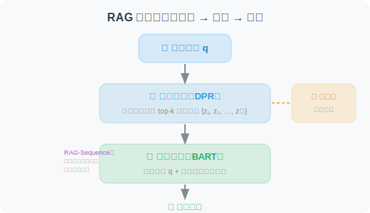
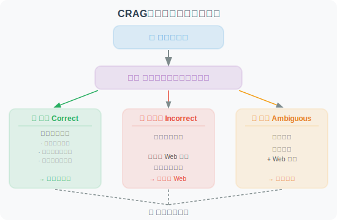
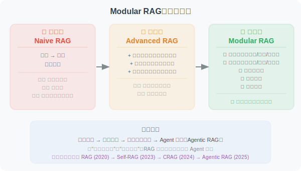
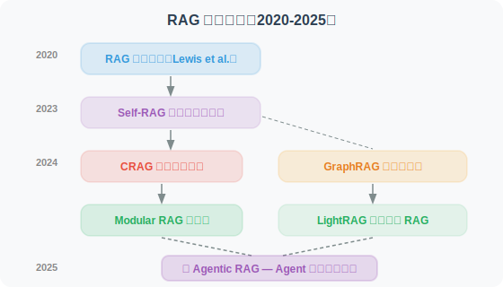

# 7.6 论文解读：RAG 前沿进展

> 📖 *"RAG 是过去两年发展最迅猛的技术方向之一。"*  
> *从朴素 RAG 到 Agentic RAG，本节深入解读推动这一演进的核心论文。*

---

## RAG 原始论文：一切的起点

**论文**：*Retrieval-Augmented Generation for Knowledge-Intensive NLP Tasks*  
**作者**：Lewis et al., Meta AI (Facebook AI Research)  
**发表**：2020 | [arXiv:2005.11401](https://arxiv.org/abs/2005.11401)

### 核心问题

预训练语言模型将知识隐式地编码在参数中，存在三个问题：
1. 无法轻松更新知识（需要重新训练）
2. 对罕见和长尾知识的覆盖不足
3. 无法追溯知识来源

### 方法原理

RAG 的原始方案是**端到端训练**检索模型和生成模型：



论文提出了两种变体：
- **RAG-Sequence**：每个文档独立生成完整回答，然后对所有回答加权
- **RAG-Token**：在生成每个 Token 时，都可以参考不同的文档

### 与今天实践的区别

虽然今天的 RAG 实现方式与原始论文有很大不同（我们通常不做端到端训练，而是将检索和生成解耦），但核心思想完全一致：**让模型在生成回答时能够参考外部知识。**

| 维度 | 原始 RAG (2020) | 现代 RAG (2024-2025) |
|------|-----------------|---------------------|
| 检索模型 | DPR（端到端训练） | 通用嵌入模型（如 OpenAI text-embedding-3） |
| 生成模型 | BART | GPT-4o / Claude 等 |
| 训练方式 | 端到端联合训练 | 解耦（检索和生成独立） |
| 向量数据库 | FAISS | ChromaDB / Pinecone / Weaviate |

---

## Self-RAG：自适应检索

**论文**：*Self-RAG: Learning to Retrieve, Generate, and Critique through Self-Reflection*  
**作者**：Asai et al.  
**发表**：2023 | [arXiv:2310.11511](https://arxiv.org/abs/2310.11511)

### 核心问题

传统 RAG 的一个根本缺陷是：**对每个问题都执行检索**。但实际上：
- 有些问题模型本身就能回答，检索反而引入噪音
- 有些问题需要多次检索，一次检索不够
- 检索到的文档质量参差不齐，需要筛选

### 方法原理

Self-RAG 训练模型生成四种**反思标记（Reflection Tokens）**：

```
1. [Retrieve]：是否需要检索？
   → "Yes" / "No" / "Continue"（继续生成，稍后再检索）

2. [IsRel]：检索到的文档是否相关？
   → "Relevant" / "Irrelevant"

3. [IsSup]：生成的内容是否有文档支持？
   → "Fully Supported" / "Partially Supported" / "No Support"

4. [IsUse]：生成的回答是否有用？
   → 1-5 的评分
```

### 工作流程

```
用户提问："Python 3.12 有什么新特性？"
    ↓
模型思考 → [Retrieve: Yes]（需要检索，因为这是时效性信息）
    ↓
检索 → 返回文档
    ↓
模型评估 → [IsRel: Relevant]（文档相关）
    ↓
生成回答
    ↓
模型自检 → [IsSup: Fully Supported]（回答有文档支持）
           [IsUse: 5]（回答有用）
```

### 对 Agent 开发的启示

Self-RAG 的自适应检索思想可以直接应用于 Agent 开发：
- **不是所有请求都需要 RAG**：Agent 应该先判断是否需要检索
- **检索质量验证**：检索到文档后要评估相关性，不盲目使用
- **生成质量自检**：回答生成后要验证是否有文档支持

---

## CRAG：检索结果的纠错机制

**论文**：*Corrective Retrieval Augmented Generation*  
**作者**：Yan et al.  
**发表**：2024 | [arXiv:2401.15884](https://arxiv.org/abs/2401.15884)

### 核心问题

传统 RAG 的另一个痛点是：**检索到低质量文档时怎么办？**
- 向量相似度高不一定意味着真正相关
- 检索到的文档可能过时、片面或有错误
- 一旦注入了低质量上下文，LLM 的回答质量也会下降

### 方法原理

CRAG 引入了一个**轻量级的检索评估器**，根据检索质量采取不同策略：



### 对 Agent 开发的启示

1. **检索不是终点**：检索到文档后还需要质量评估和过滤
2. **降级策略**：当内部知识库不够时，可以降级到 Web 搜索
3. **精细化处理**：大段文档中可能只有几句话是相关的，需要提取关键信息

---

## GraphRAG：知识图谱增强的 RAG

**论文**：*From Local to Global: A Graph RAG Approach to Query-Focused Summarization*  
**作者**：Edge et al., Microsoft Research  
**发表**：2024 | [arXiv:2404.16130](https://arxiv.org/abs/2404.16130)

### 核心问题

传统 RAG 检索的是独立的文本块（Chunk），适合回答**局部问题**（"X 是什么？"），但难以回答**全局问题**（"这个项目中所有团队之间的合作关系是什么？"、"整个文档集合的主要主题有哪些？"）。

### 方法原理

GraphRAG 在传统 RAG 的基础上增加了知识图谱层：

```
索引阶段：
1. 文本分块 → 常规的文本 Chunk
2. 实体和关系提取 → 用 LLM 从文本中提取实体（人物、组织、概念）和关系
3. 构建知识图谱 → 实体为节点，关系为边
4. 社区检测 → 对图进行层次化聚类（Leiden 算法）
5. 社区摘要 → 为每个社区生成描述性摘要

查询阶段（两种模式）：
- Local Search：从与查询最相关的实体出发，遍历其邻居关系
- Global Search：使用社区摘要回答全局性问题（Map-Reduce 方式）
```

### 实验结果

在全局性问题（需要理解整个文档集合）上，GraphRAG 比朴素 RAG 的回答质量提升了 **30-70%**。

### 对 Agent 开发的启示

1. **结构化知识的价值**：纯文本检索在关系推理方面有天然局限，知识图谱可以弥补
2. **分层检索策略**：局部问题用向量检索，全局问题用图检索
3. **索引成本**：GraphRAG 的索引阶段需要大量 LLM 调用来提取实体和关系，成本较高

---

## Modular RAG：模块化 RAG 架构

**论文**：*Modular RAG: Transforming RAG Systems into LEGO-like Reconfigurable Frameworks*  
**作者**：Gao et al.  
**发表**：2024

### 核心贡献

Modular RAG 不是一个具体的方法，而是一个**系统化的分类框架**，将 RAG 系统的演进分为三个阶段：



### RAG 范式演进总结

| 范式 | 特点 | 代表工作 |
|------|------|---------|
| Naive RAG | 检索 → 生成，简单直接 | 原始 RAG (Lewis et al., 2020) |
| Advanced RAG | 检索前优化 + 检索后优化 | 本书第 7.4 节 |
| Modular RAG | 模块化、可插拔、自适应 | Self-RAG, CRAG |
| Agentic RAG | Agent 主导检索决策，支持多轮检索 | LangGraph + RAG 工作流 |

---

---

## LightRAG：轻量级图增强 RAG

**论文**：*LightRAG: Simple and Fast Retrieval-Augmented Generation*  
**作者**：Guo et al., 香港大学  
**发表**：2024 | [arXiv:2410.05779](https://arxiv.org/abs/2410.05779)

### 核心问题

GraphRAG（微软）虽然通过知识图谱提升了全局问题的回答能力，但存在严重的**成本和效率问题**：
- 索引阶段需要大量 LLM 调用，Token 消耗巨大
- 社区检测和摘要生成耗时长
- 新增文档需要重新构建整个图

### 方法原理

LightRAG 在保持图增强优势的同时大幅降低成本：

```
GraphRAG 的代价：
  索引 1000 篇文档 → 可能需要 $50-100 的 LLM 调用费
  新增 10 篇文档 → 需要重建整个社区结构

LightRAG 的改进：
  1. 简化实体/关系提取（减少 LLM 调用次数）
  2. 双层检索机制：
     - 低层检索：基于具体实体和关系的精确检索
     - 高层检索：基于主题和概念的抽象检索
  3. 增量更新：新文档只需提取新实体并合并到已有图中
  
  成本对比：
  GraphRAG: $100+ / 1M Token 索引
  LightRAG:  $5-10 / 1M Token 索引（10-20x 降低）
```

### 关键发现

1. **图结构 + 双层检索**：在多个数据集上同时优于 GraphRAG 和朴素 RAG
2. **增量更新能力**：可以在不重建图的情况下添加新文档，适合动态知识库
3. **成本大幅降低**：索引和检索成本相比 GraphRAG 降低 10-20 倍

### 对 Agent 开发的启示

对于需要 RAG 能力的 Agent，LightRAG 提供了比 GraphRAG 更实用的选择——在保持图增强优势的同时，大幅降低了部署和运维成本。特别适合知识库频繁更新的场景。

---

## RAG 与推理的融合：Agentic RAG

**综述**：*Agentic RAG: Boosting the Generative AI Capabilities with Autonomous RAG*  
**趋势综述**：多篇论文（2024-2025）

### 核心概念

Agentic RAG 不是一篇单独的论文，而是 2024-2025 年 RAG 领域最重要的演进方向——将 RAG 从"被动管道"升级为"Agent 主导的智能检索"：

```
传统 RAG（被动管道）：
  用户提问 → 检索 → 生成 → 返回
  （固定流程，一次检索，不管够不够）

Agentic RAG（Agent 驱动）：
  用户提问 → Agent 思考
    ↓
  "这个问题需要检索吗？" → 否 → 直接回答
    ↓ 是
  "用什么查询检索？" → 改写查询
    ↓
  检索 → "检索结果够好吗？"
    ↓ 不够
  "换个查询方式/数据源再试"
    ↓ 够了
  "需要更多信息吗？" → 是 → 继续检索
    ↓ 否
  综合所有信息 → 生成回答
    ↓
  "回答有事实支撑吗？" → 自我验证 → 返回
```

### 关键技术组件

| 组件 | 学术来源 | 功能 |
|------|---------|------|
| 自适应检索 | Self-RAG (2023) | 判断是否需要检索 |
| 检索纠错 | CRAG (2024) | 评估检索质量并降级 |
| 查询改写 | HyDE, Query Rewriting | 优化检索查询 |
| 多源检索 | Modular RAG (2024) | 动态选择数据源 |
| 迭代检索 | IRCoT (2023) | 多轮检索逐步深入 |
| 推理整合 | LangGraph Workflows | 将检索嵌入推理循环 |

### 对 Agent 开发的启示

Agentic RAG 是 2025 年 Agent 开发中最实用的架构模式之一。LangGraph 是实现 Agentic RAG 的理想框架（详见第 9 章）——可以将检索决策、查询改写、质量评估等步骤编排为状态图中的节点。

---

## 论文对比与发展脉络

| 论文 | 年份 | 解决的核心问题 | 关键创新 |
|------|------|---------------|---------|
| RAG 原始论文 | 2020 | LLM 知识有限 | 检索+生成的融合 |
| Self-RAG | 2023 | 何时需要检索 | 反思标记自适应 |
| CRAG | 2024 | 检索质量不稳定 | 检索评估器 + 降级策略 |
| GraphRAG | 2024 | 全局性问题难以回答 | 知识图谱 + 社区摘要 |
| Modular RAG | 2024 | RAG 系统缺乏灵活性 | 模块化架构框架 |
| **LightRAG** | **2024** | **GraphRAG 成本过高** | **轻量级图索引 + 增量更新** |
| **Agentic RAG** | **2025** | **RAG 流程缺乏智能** | **Agent 主导检索决策** |

**发展脉络**：



> 💡 **前沿趋势（2025-2026）**：RAG 领域的三大趋势：① **Agentic RAG 成为主流**：不再是简单的"检索→生成"管道，而是 Agent 动态决策检索策略、查询改写、多源切换、结果验证的完整推理循环；② **图增强 RAG 走向实用**：LightRAG 等轻量方案解决了 GraphRAG 的成本问题，让图增强 RAG 可以在生产环境大规模部署；③ **RAG + 推理模型**：o3/R1 等推理模型与 RAG 的结合正在被探索——推理模型可以更智能地分解检索需求、评估检索质量。

---

*返回：[第7章 检索增强生成](./README.md)*
