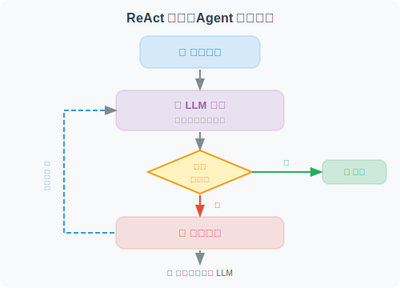

# 第一个 Agent：Hello Agent！

终于到了激动人心的时刻——让我们构建第一个真正的 Agent！它能使用工具、进行推理，并完成实际任务。

## 什么才算是真正的 Agent？

一个最简单的 Agent 必须具备以下能力：
1. **感知**：接收用户输入
2. **推理**：理解需要做什么
3. **行动**：调用工具执行操作
4. **观察**：获取工具结果
5. **响应**：给出最终答案

仅仅调用 LLM 生成文本，不算 Agent；能够**自主决定调用哪些工具**，才是 Agent。

## 项目结构


## 第一步：定义工具

```python
# tools.py
import math
import datetime
import requests
from typing import Annotated

def calculator(expression: Annotated[str, "数学表达式，如 '2 + 3 * 4'"]) -> str:
    """
    计算数学表达式。
    支持基本运算(+,-,*,/)和数学函数(sqrt, pow, sin, cos等)。
    """
    try:
        # 安全地评估数学表达式
        # 只允许数学操作，防止代码注入
        allowed_names = {
            'sqrt': math.sqrt,
            'pow': math.pow,
            'sin': math.sin,
            'cos': math.cos,
            'tan': math.tan,
            'log': math.log,
            'pi': math.pi,
            'e': math.e,
            'abs': abs,
            'round': round,
        }
        result = eval(expression, {"__builtins__": {}}, allowed_names)
        return f"计算结果：{expression} = {result}"
    except Exception as e:
        return f"计算错误：{str(e)}"


def get_current_time(
    timezone: Annotated[str, "时区名称，如 'Asia/Shanghai' 或 'UTC'"] = "Asia/Shanghai"
) -> str:
    """获取当前时间"""
    import zoneinfo
    try:
        tz = zoneinfo.ZoneInfo(timezone)
        now = datetime.datetime.now(tz)
    except (KeyError, Exception):
        # 如果时区无效，使用本地时间
        now = datetime.datetime.now()
    return f"当前时间（{timezone}）：{now.strftime('%Y年%m月%d日 %H:%M:%S')}"


def search_wikipedia(
    query: Annotated[str, "要搜索的关键词"]
) -> str:
    """
    在维基百科中搜索信息。
    适合查询历史事件、人物、地理、科学概念等。
    """
    try:
        # 使用维基百科 API
        url = "https://zh.wikipedia.org/api/rest_v1/page/summary/" + query
        response = requests.get(url, timeout=5)
        
        if response.status_code == 200:
            data = response.json()
            return f"维基百科 - {data.get('title', query)}：\n{data.get('extract', '未找到摘要')[:500]}"
        else:
            return f"未找到关于 '{query}' 的维基百科页面"
    except Exception as e:
        return f"搜索失败：{str(e)}"


def remember_note(
    content: Annotated[str, "要记录的笔记内容"],
    title: Annotated[str, "笔记标题"] = "未命名"
) -> str:
    """将信息保存为笔记，以便后续使用"""
    import json
    import os
    
    notes_file = "agent_notes.json"
    
    # 读取已有笔记
    if os.path.exists(notes_file):
        with open(notes_file, 'r', encoding='utf-8') as f:
            notes = json.load(f)
    else:
        notes = []
    
    # 添加新笔记
    note = {
        "title": title,
        "content": content,
        "time": datetime.datetime.now().isoformat()
    }
    notes.append(note)
    
    # 保存
    with open(notes_file, 'w', encoding='utf-8') as f:
        json.dump(notes, f, ensure_ascii=False, indent=2)
    
    return f"✅ 已保存笔记：《{title}》"
```

## 第二步：构建 Agent

```python
# agent.py
import os
import json
from openai import OpenAI
from dotenv import load_dotenv
from tools import calculator, get_current_time, search_wikipedia, remember_note
from rich.console import Console
from rich.panel import Panel

load_dotenv()

console = Console()
client = OpenAI()

# 工具注册表：将 Python 函数映射到 OpenAI 工具格式
TOOLS_REGISTRY = {
    "calculator": calculator,
    "get_current_time": get_current_time,
    "search_wikipedia": search_wikipedia,
    "remember_note": remember_note,
}

# OpenAI Function Calling 格式的工具定义
TOOLS_DEFINITION = [
    {
        "type": "function",
        "function": {
            "name": "calculator",
            "description": "计算数学表达式，支持基本运算和数学函数（sqrt, sin, cos等）",
            "parameters": {
                "type": "object",
                "properties": {
                    "expression": {
                        "type": "string",
                        "description": "数学表达式，如 '2 + 3 * 4' 或 'sqrt(16)'"
                    }
                },
                "required": ["expression"]
            }
        }
    },
    {
        "type": "function",
        "function": {
            "name": "get_current_time",
            "description": "获取当前日期和时间",
            "parameters": {
                "type": "object",
                "properties": {
                    "timezone": {
                        "type": "string",
                        "description": "时区，默认 Asia/Shanghai",
                        "default": "Asia/Shanghai"
                    }
                },
                "required": []
            }
        }
    },
    {
        "type": "function",
        "function": {
            "name": "search_wikipedia",
            "description": "在维基百科搜索信息，适合查询百科知识",
            "parameters": {
                "type": "object",
                "properties": {
                    "query": {
                        "type": "string",
                        "description": "搜索关键词"
                    }
                },
                "required": ["query"]
            }
        }
    },
    {
        "type": "function",
        "function": {
            "name": "remember_note",
            "description": "保存重要信息为笔记",
            "parameters": {
                "type": "object",
                "properties": {
                    "content": {
                        "type": "string",
                        "description": "笔记内容"
                    },
                    "title": {
                        "type": "string",
                        "description": "笔记标题",
                        "default": "未命名"
                    }
                },
                "required": ["content"]
            }
        }
    }
]


class HelloAgent:
    """
    第一个 Agent：Hello Agent！
    具备工具使用、多轮对话、推理能力。
    """
    
    def __init__(self, model: str = "gpt-4o-mini"):
        self.model = model
        self.messages = [
            {
                "role": "system",
                "content": """你是一个智能助手，可以使用多种工具来帮助用户。

你可以使用以下工具：
- calculator：计算数学问题
- get_current_time：获取当前时间
- search_wikipedia：查询百科知识
- remember_note：保存重要信息

使用工具时，先分析用户需求，选择合适的工具，执行后给出清晰的回答。
如果不需要工具，直接回答即可。请用中文回复。"""
            }
        ]
    
    def _execute_tool(self, tool_name: str, tool_args: dict) -> str:
        """执行工具调用"""
        tool_func = TOOLS_REGISTRY.get(tool_name)
        if not tool_func:
            return f"错误：未知工具 '{tool_name}'"
        
        try:
            result = tool_func(**tool_args)
            return str(result)
        except Exception as e:
            return f"工具执行失败：{str(e)}"
    
    def chat(self, user_message: str) -> str:
        """
        与 Agent 对话
        实现了完整的 ReAct 循环：Reason → Act → Observe
        """
        # 添加用户消息
        self.messages.append({"role": "user", "content": user_message})
        
        console.print(f"\n[bold blue]用户：[/bold blue]{user_message}")
        
        # Agent 循环（最多10步防止无限循环）
        max_iterations = 10
        for iteration in range(max_iterations):
            
            # 调用 LLM
            response = client.chat.completions.create(
                model=self.model,
                messages=self.messages,
                tools=TOOLS_DEFINITION,
                tool_choice="auto"  # 让模型自己决定是否使用工具
            )
            
            message = response.choices[0].message
            finish_reason = response.choices[0].finish_reason
            
            # 将模型回复加入历史
            self.messages.append(message)
            
            # 如果模型决定直接回答（不使用工具）
            if finish_reason == "stop":
                console.print(f"[bold green]Agent：[/bold green]{message.content}")
                return message.content
            
            # 如果模型决定使用工具
            if finish_reason == "tool_calls" and message.tool_calls:
                for tool_call in message.tool_calls:
                    tool_name = tool_call.function.name
                    tool_args = json.loads(tool_call.function.arguments)
                    
                    # 显示工具调用（调试信息）
                    console.print(
                        Panel(
                            f"工具：[yellow]{tool_name}[/yellow]\n"
                            f"参数：{tool_args}",
                            title="🔧 工具调用",
                            border_style="yellow"
                        )
                    )
                    
                    # 执行工具
                    result = self._execute_tool(tool_name, tool_args)
                    
                    console.print(f"[dim]工具结果：{result}[/dim]")
                    
                    # 将工具结果加入历史
                    self.messages.append({
                        "role": "tool",
                        "tool_call_id": tool_call.id,
                        "content": result
                    })
            
        return "抱歉，处理超时，请重试。"
    
    def reset(self):
        """重置对话历史"""
        self.messages = self.messages[:1]  # 只保留 system prompt
        console.print("[dim]对话已重置[/dim]")
```

## 第三步：运行！

```python
# main.py
from agent import HelloAgent
from rich.console import Console
from rich.panel import Panel

console = Console()

def main():
    console.print(Panel(
        "[bold]🤖 Hello Agent 已启动！[/bold]\n"
        "我可以帮你：计算数学、查询时间、搜索维基百科、记录笔记\n"
        "输入 'quit' 退出，输入 'reset' 重置对话",
        title="Agent 启动",
        border_style="green"
    ))
    
    agent = HelloAgent()
    
    while True:
        user_input = input("\n你：").strip()
        
        if not user_input:
            continue
        
        if user_input.lower() == "quit":
            console.print("[bold]再见！[/bold]")
            break
        
        if user_input.lower() == "reset":
            agent.reset()
            continue
        
        agent.chat(user_input)

if __name__ == "__main__":
    main()
```

## 运行效果

```bash
$ python main.py

╭─────────────────────────────────────╮
│  🤖 Hello Agent 已启动！             │
│  我可以帮你：计算数学、查询时间...     │
╰─────────────────────────────────────╯

你：现在几点了？今天是星期几？

用户：现在几点了？今天是星期几？
╭── 🔧 工具调用 ─╮
│ 工具：get_current_time    │
│ 参数：{}                  │
╰──────────────────╯
工具结果：当前时间（Asia/Shanghai）：2026年03月12日 14:30:22

Agent：当前时间是下午 2:30，今天是2026年3月12日，星期四。

你：帮我计算 (123 * 456 + 789) / 3 等于多少？

用户：帮我计算 (123 * 456 + 789) / 3 等于多少？
╭── 🔧 工具调用 ─╮
│ 工具：calculator          │
│ 参数：{'expression': '(123 * 456 + 789) / 3'}    │
╰──────────────────╯
工具结果：计算结果：(123 * 456 + 789) / 3 = 18945.0

Agent：计算结果是 18,945。
具体过程：123 × 456 = 56,088，加上 789 = 56,877，再除以 3 = 18,945。

你：请查询一下"人工智能"的相关信息

（自动调用 search_wikipedia 工具并返回维基百科摘要）
```

## 代码解析：Agent 的核心循环

这个简单的 Agent 展示了 **ReAct 模式**的完整实现：



这个循环会一直持续，直到 LLM 认为可以给出最终答案。

---

## 小结

恭喜！你已经成功构建了第一个 Agent！这个 Agent 展示了：

- ✅ **工具注册**：将 Python 函数暴露给 LLM
- ✅ **自主决策**：LLM 自己决定何时使用工具
- ✅ **循环推理**：持续推理直到任务完成
- ✅ **多轮对话**：记忆对话历史

后续章节将在这个基础上，构建更强大的 Agent 系统。

---

*下一章：[第4章 工具调用（Tool Use / Function Calling）](../chapter_tools/README.md)*
