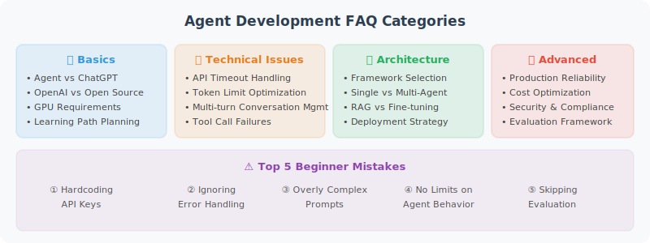

# Appendix B: Agent Development FAQ



---

## Basic Questions

### Q1: What is the difference between an Agent and a regular ChatGPT conversation?

**A**: Regular conversation is "one question, one answer." An Agent is "one question, multiple steps." An Agent can autonomously decide what tools to use and in what order, ultimately providing a comprehensive answer. Think of ChatGPT as a consultant who can only talk, while an Agent is an assistant who can actually get things done.

### Q2: Should I choose OpenAI or open-source models?

**A**: It depends on your needs:

| Scenario | Recommendation |
|----------|---------------|
| Rapid prototype validation | OpenAI GPT-4o (strongest capability) |
| Cost-sensitive production | GPT-4o-mini or open-source models |
| Data privacy required | Open-source models deployed locally |
| Fine-tuning needed | Open-source models (e.g., Llama 3) |

### Q3: How many tokens does an Agent need to work?

**A**: A typical Agent request includes:
- System prompt: 500–2000 tokens
- Conversation history: variable, usually limited to 2000–4000 tokens
- Tool descriptions: ~100–200 tokens per tool
- Tool call results: variable

Recommend models supporting at least 8K context window; 32K+ for complex tasks.

---

## Tool Calling Questions

### Q4: The Agent keeps not calling tools and makes up answers — what to do?

**A**: Explicitly require in the system prompt:
```
When the user asks about questions requiring real-time data (e.g., weather, prices, inventory),
you must first use the corresponding tool to query — do not rely on memory.
```

### Q5: The Agent is stuck in an infinite loop of tool calls — what to do?

**A**: Set `max_iterations` or `max_steps` to limit maximum iterations. In LangChain:
```python
agent_executor = AgentExecutor(
    agent=agent, tools=tools, 
    max_iterations=10  # Execute at most 10 steps
)
```

### Q6: How to make the Agent use multiple tools simultaneously?

**A**: Use OpenAI's `parallel_tool_calls` feature, or set parallel nodes in LangGraph. But be aware of dependencies between tools — if tool B depends on tool A's result, they cannot run in parallel.

---

## Memory and Context Questions

### Q7: The conversation is too long and exceeds the token limit — what to do?

**A**: Three strategies:
1. **Sliding window**: Keep only the last N messages
2. **Summary compression**: Use LLM to compress earlier conversations into a summary
3. **Selective retention**: Keep system messages + recent messages, replace middle with summary

### Q8: How to make the Agent remember user preferences?

**A**: Implement long-term memory — store user preferences in a vector database or KV store, retrieve relevant preferences at the start of each conversation and inject them into the prompt.

---

## Performance and Cost Questions

### Q9: API calls are too slow — what to do?

**A**:
1. Enable streaming responses to reduce user wait time
2. Use faster models (e.g., GPT-4o-mini) for simple tasks
3. Implement semantic caching — return cached results for similar questions
4. Call independent tools in parallel

### Q10: Best practices for cost control?

**A**:
1. **Model routing**: Use cheap models for simple tasks, strong models for complex tasks
2. **Caching**: Reuse results for similar questions
3. **Prompt compression**: Streamline system prompts
4. **Set budget alerts**: Notify when threshold is exceeded
5. **Monitor token usage**: Identify high-consumption steps

---

## Security Questions

### Q11: How to prevent Prompt injection?

**A**: Multi-layer defense:
1. Input filtering (regex matching known attack patterns)
2. Layered Prompt (physical separation of system instructions and user input)
3. Output auditing (check if replies contain sensitive information)
4. Least privilege (Agent can only access necessary tools and data)

### Q12: How to prevent the Agent from executing dangerous operations?

**A**:
1. Use Human-in-the-Loop — high-risk operations require human confirmation
2. Define behavioral boundaries, mark risk level for each operation
3. Set operation frequency limits
4. Run code execution in sandbox environments

---

## Deployment Questions

### Q13: What framework to use for deploying Agent services?

**A**: Recommend FastAPI + Uvicorn:
- Native async support
- Auto-generated API documentation
- Built-in streaming responses (SSE)
- High performance

### Q14: How to handle high concurrency?

**A**:
1. Async processing for all I/O operations
2. Use semaphores to limit concurrent request count
3. Request queues for peak shaving
4. Horizontal scaling with multiple API instances
5. Redis for session state management (stateless API layer)

### Q15: What is the recommended project structure?

**A**:
```
agent-project/
├── app/
│   ├── main.py          # FastAPI entry point
│   ├── agent.py          # Agent core logic
│   ├── tools/            # Tool definitions
│   ├── config.py         # Configuration management
│   └── middleware.py     # Middleware
├── tests/
├── Dockerfile
├── docker-compose.yml
├── requirements.txt
└── .env.example
```

---

## 🤝 Multi-Agent Collaboration

### Q16: How do Agents pass complex data to each other in a multi-Agent system?

Simple data (strings, numbers) can be passed directly through messages. For complex data, the following approaches are recommended:

```python
# Option 1: Through shared state (suitable for LangGraph)
class TeamState(TypedDict):
    shared_context: dict     # Shared context
    code: str                # Code artifact
    review_comments: list    # Review comments
    
# Option 2: Through file system (suitable for cross-process Agents)
# Agent A writes results to a file, Agent B reads from the file
```

### Q17: Which is better — Supervisor pattern or decentralized pattern?

There's no absolute winner; it depends on your scenario:

| Scenario | Recommended Pattern | Reason |
|----------|--------------------|----|
| Clear, predictable process | Supervisor | Central coordination is more efficient |
| Flexible negotiation needed, equal roles | Decentralized | Direct Agent-to-Agent conversation is more flexible |
| Strict approval required | Supervisor | Supervisor can act as quality gatekeeper |
| Many Agents (>5) | Hierarchical Supervisor | Avoid single Supervisor becoming a bottleneck |

### Q18: How to debug a multi-Agent system?

Debugging multi-Agent systems is much more complex than single Agents. Here are practical tips:

1. **Name each Agent and tag logs**: All LLM calls and tool calls should be prefixed with the Agent name
2. **Test each Agent independently first**: Ensure each role works correctly in isolation before combining
3. **Use LangSmith tracing**: Visualize the call chain and message flow of multiple Agents
4. **Set maximum iteration count**: Prevent infinite conversation loops between Agents

---

## 🔧 Framework Selection Questions

### Q19: Which should I choose — LangChain, LangGraph, CrewAI, or AutoGen?

**A**: Choose based on project requirements:

| Requirement | Recommended Framework |
|-------------|----------------------|
| Quick prototype / simple Chain | LangChain |
| Complex stateful Agent workflows | LangGraph |
| Multi-role collaboration (team simulation) | CrewAI |
| Multi-Agent conversation research | AutoGen |
| No framework dependency | OpenAI Agents SDK + native API |
| Enterprise low-code | Dify / Coze |

> 💡 **Recommendation**: Use LangChain to quickly validate ideas, then migrate to LangGraph when complex flow control is needed. Don't use a framework just for the sake of using one.

### Q20: LangChain updates too fast and code keeps becoming outdated — what to do?

**A**:
1. **Lock versions**: Pin major version numbers in `requirements.txt` (e.g., `langchain>=0.3,<0.4`)
2. **Use core packages**: Prefer stable packages like `langchain-core` and `langchain-openai`
3. **Follow migration guides**: LangChain publishes migration docs with each major version update
4. **Reduce framework coupling**: Core business logic should not be deeply bound to framework APIs

### Q21: What is the relationship between MCP and Function Calling?

**A**: Function Calling is the LLM's ability to output structured tool call requests. MCP (Model Context Protocol) is the standard protocol for tool **discovery and connection**. An analogy:
- Function Calling = "I know how to use tools"
- MCP = "I can find and connect to any tool"

They are complementary. Agents discover available tools through MCP and call those tools through Function Calling.

---

## 📚 RAG and Knowledge Management

### Q22: RAG retrieval quality is poor — how to optimize?

**A**: RAG optimization is a systems engineering effort. In priority order:
1. **Improve chunking strategy**: Split by semantics rather than fixed length, maintain paragraph integrity
2. **Optimize embedding model**: Try `text-embedding-3-large` or domain fine-tuned embeddings
3. **Hybrid retrieval**: Combine vector retrieval + BM25 keyword retrieval
4. **Add reranking**: Use Cross-Encoder to rerank results after retrieval
5. **Metadata filtering**: Pre-filter using document time, source, category, etc.

### Q23: Which vector database should I choose?

**A**:

| Database | Best For | Features |
|----------|---------|---------|
| ChromaDB | Development/prototyping | Lightweight, embedded, zero-config |
| FAISS | Large-scale offline retrieval | Meta-built, extremely fast, pure in-memory |
| Pinecone | Production environments | Fully managed, auto-scaling |
| Weaviate | Hybrid search needed | Vector + keyword hybrid, GraphQL API |
| Qdrant | Advanced filtering needed | Rust-built, excellent filter performance |

---

## 🧠 Context and Prompt Engineering

### Q24: Prompt is too long and the model "forgets" middle content — what to do?

**A**: This is the "Lost in the Middle" problem. Solutions:
1. **Put important information at the beginning and end**: Leverage LLM's sensitivity to head/tail information
2. **Use structured formats**: Markdown/XML tags help the model locate information
3. **Process in stages**: Break large tasks into stages, only provide necessary context per stage
4. **Use context compression**: First use LLM to extract relevant snippets from long documents

### Q25: Does a very long System Prompt affect performance?

**A**: Yes. Effects include:
- **Increased latency**: More tokens = longer time to first token
- **Increased cost**: Billed per token
- **Attention dilution**: Too many rules reduce the model's adherence to key instructions

Recommend keeping System Prompts within 500–1500 tokens, with core rules at the front.

---

## 📊 Evaluation and Debugging

### Q26: How do I know if my Agent is performing well?

**A**: Evaluate from three dimensions:
1. **Functional correctness**: Did the Agent complete the task? (accuracy, success rate)
2. **Efficiency**: How many steps? How many tokens? What latency?
3. **Safety**: Did it follow safety boundaries? Did it reject unreasonable requests?

Specifically, refer to benchmarks like AgentBench, SWE-bench, and GAIA introduced in Chapter 16.

### Q27: Agent output is unstable and results vary each time — what to do?

**A**:
1. Set `temperature` to 0 (deterministic output)
2. Use the `seed` parameter (supported by OpenAI)
3. Add output format constraints (JSON Schema / Pydantic)
4. Use multiple sampling + voting (majority vote for critical decisions)

### Q28: How to troubleshoot an Agent that is "stuck" and not moving?

**A**: Agent getting stuck usually has these causes:
1. **Infinite loop**: Bug in conditional routing logic → add maximum iteration count
2. **Tool timeout**: External API not responding → set timeout for tools
3. **Model hallucination**: LLM calls a non-existent tool → check if tool names are passed correctly
4. **Token limit exceeded**: Context too long causes API error → add conversation history trimming

---

## 🚀 Advanced Questions

### Q29: How to give an Agent "learning" capability?

**A**: Currently, Agent "learning" is mainly implemented through:
1. **Long-term memory**: Store successful experiences as memory entries (see Chapter 5)
2. **Skill system**: Encapsulate validated workflows as reusable skills (see Chapter 9)
3. **Prompt adaptation**: Dynamically adjust prompts based on user feedback
4. **Fine-tuning**: Collect successful Agent conversation data, train specialized models with SFT/RLHF (see Chapter 10)

### Q30: What are the most common mistakes in Agent development?

**A**: Based on community experience, the top 5 common mistakes:
1. **Stuffing too much into Prompt**: Trying to handle everything in one Prompt → split into multiple steps
2. **No error handling**: Agent crashes when tool calls fail → add try/except to all tools
3. **No cost monitoring**: Receiving a huge bill one day → set budget alerts before going live
4. **Skipping evaluation**: Judging effectiveness by feel → establish systematic evaluation processes
5. **Ignoring security**: Letting Agent execute code without a sandbox → consider security from day one

---

## 🧪 Reinforcement Learning and Model Training

### Q31: How to mitigate the low-probability repetition problem?

**A**: The repetition problem in LLMs can be mitigated through several approaches:
- **Adjust sampling parameters**: Appropriately increase `repetition_penalty` or `presence_penalty` to reduce sampling probability of already-generated tokens. Also fine-tune `temperature` and `top_p` to increase output diversity.
- **Reinforcement learning penalty**: In RLHF or GRPO stages, design specific rules to detect repetition patterns (e.g., N-gram repetition rate), giving negative rewards to outputs with severe repetition.
- **SFT data cleaning**: Check SFT training data to ensure it doesn't contain low-quality samples with many repetitive patterns.
- **Prompt optimization**: Explicitly instruct the model in the System Prompt to "avoid repeating previous statements" or "keep answers concise and varied."

### Q32: How to train emotional intelligence and fluency in large models, and how to design the reward?

**A**:
- **Emotional Intelligence (EQ) Training and Reward Design**:
  - **SFT stage**: Build high-quality conversation datasets containing empathy, emotional support, and polite language.
  - **Reward design**: Typically uses **LLM-as-a-Judge**. Use a more capable model (e.g., GPT-4) as a judge to score model outputs based on preset dimensions (e.g., empathy, appropriateness, emotional comfort ability) as the reward. You can also train a dedicated Reward Model (RM) to fit human preferences for emotional intelligence.
- **Fluency Training and Reward Design**:
  - **SFT stage**: Ensure grammatical correctness and natural expression in training corpus.
  - **Reward design**: Use language model **Perplexity (PPL)** as a penalty term — higher PPL indicates less fluency, giving negative reward. Can also combine grammar checking tools or LLM judges to evaluate language coherence and naturalness.

### Q33: How to design SFT data for multi-turn conversations?

**A**: Designing high-quality multi-turn conversation SFT data requires attention to:
- **Role and format standards**: Use standard conversation formats (e.g., ChatML), clearly distinguishing `System`, `User`, and `Assistant` roles.
- **Context dependency**: Ensure later turns in the conversation must rely on earlier history to answer correctly, training the model to handle coreference resolution (e.g., "he," "that") and topic continuation.
- **Diverse turn counts and scenarios**: Data should include conversations of different lengths (from 2 to 10+ turns), covering task-oriented (e.g., booking, writing code) and casual chat scenarios.
- **State tracking and error correction**: Include conversations where users modify requirements mid-way or correct model errors, training the model's ability to flexibly adjust and self-correct.

### Q34: How to design multi-objective rewards in GRPO, and how to prevent the seesaw effect with multiple losses?

**A**: In reinforcement learning algorithms like GRPO, you typically need to optimize multiple objectives simultaneously (e.g., accuracy, format, safety, fluency).
- **Multi-objective Reward Design**:
  - Define total reward as a weighted sum of sub-rewards: $R_{total} = w_1 R_{acc} + w_2 R_{format} + w_3 R_{safety}$.
  - Design different evaluation methods for different objectives: rule matching (format), LLM judge (accuracy/safety).
- **Preventing the Seesaw Effect**:
  - **Reward Normalization**: Ensure different reward dimensions have consistent magnitude and variance, preventing any single reward with a large absolute value from dominating gradient updates. In GRPO, group-relative normalization itself helps stabilize training.
  - **Dynamic weight adjustment**: During training, monitor convergence of each metric. If a certain objective drops significantly, dynamically increase its reward weight.
  - **KL divergence penalty**: Introduce a KL divergence penalty term with the Reference Model to limit the model from deviating too far from the original distribution when pursuing specific rewards, thereby protecting the model's basic capabilities (e.g., fluency).
  - **Curriculum Learning**: Introduce objectives in stages. First optimize basic objectives that are prone to conflict (e.g., format and fluency), then introduce more complex cognitive objectives (e.g., logical reasoning) after stabilization.
