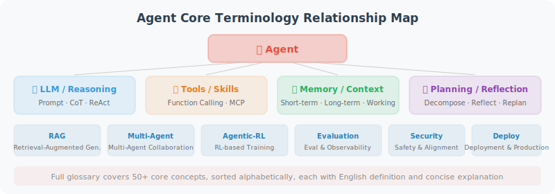

# Appendix D: Glossary

> Core Agent development terms arranged alphabetically.

---

| Term | English | Definition |
|------|---------|-----------|
| A2A Protocol | Agent-to-Agent Protocol | Google's inter-Agent communication standard, allowing Agents from different frameworks to discover and call each other |
| AG2 | AG2 (AutoGen fork) | Community fork of AutoGen 0.2, maintained by original AutoGen core contributors |
| Agent | Agent | An AI system that can autonomously perceive its environment, make decisions, and execute actions |
| Agentic-RL | Agentic Reinforcement Learning | A paradigm applying reinforcement learning to Agent training, using reward signals to teach Agents to better use tools and plan |
| ANP | Agent Network Protocol | Defines standards for Agent discovery and communication on the open internet |
| AST | Abstract Syntax Tree | A tree-structured representation of source code, used for code analysis and understanding |
| Attention | Attention Mechanism | The core mechanism of Transformers, allowing the model to focus on the most relevant positions in the input sequence when processing each token |
| Chain | Chain | A sequence connecting multiple LLM calls or processing steps |
| Checkpoint | Checkpoint | A mechanism in LangGraph for saving snapshots of graph execution state, supporting pause and resume |
| Chunking | Text Chunking | The process of splitting long documents into small paragraphs suitable for embedding |
| Context Engineering | Context Engineering | A methodology for systematically managing and optimizing Agent context information; an advanced form of Prompt Engineering |
| Context Window | Context Window | The maximum number of tokens an LLM can process in a single inference |
| CoT | Chain-of-Thought | Chain-of-thought prompting, guiding the model to reason step by step |
| CRAG | Corrective RAG | A RAG variant that adds a correction mechanism after retrieval, capable of judging whether retrieval results are relevant and dynamically adjusting strategy |
| CrewAI | CrewAI | A role-playing multi-Agent framework that builds virtual teams by defining Agent roles and tasks |
| DeepSeek | DeepSeek | A Chinese AI company that released high-performance reasoning models like DeepSeek-R2 |
| Dify | Dify | An open-source LLM application development platform supporting low-code construction of Agents and RAG workflows |
| Docker | Docker | A containerization platform that packages applications and dependencies into portable container images |
| DPO | Direct Preference Optimization | A training method that aligns with human preferences without training a reward model |
| Embedding | Embedding | The process of converting text into high-dimensional vectors |
| Emergent Abilities | Emergent Abilities | New capabilities that suddenly emerge in large models when parameter scale reaches a critical point (e.g., reasoning, code generation) |
| FastAPI | FastAPI | A high-performance async Python web framework, commonly used for Agent API services |
| FastMCP | FastMCP | A simplified way to create MCP Servers, quickly defining tools with decorators |
| Few-shot | Few-shot Learning | Guiding the model to complete tasks through a small number of examples |
| Fine-tuning | Fine-tuning | Further training a pre-trained model on a specific dataset to adapt it to specific tasks |
| Flows | Flows (CrewAI) | CrewAI's event-driven workflow orchestration feature, using @start/@listen/@router decorators |
| Function Calling | Function Calling | The LLM's ability to generate structured tool call requests |
| GAIA | GAIA Benchmark | General AI Assistants benchmark, evaluating an Agent's ability to solve real-world tasks |
| Graph Agent | Graph Agent | An Agent workflow built on a directed graph structure |
| GRPO | Group Relative Policy Optimization | A reinforcement learning algorithm proposed by DeepSeek that doesn't require a Critic model |
| Guardrails | Guardrails | Mechanisms for safety checking and restricting Agent inputs and outputs |
| Hallucination | Hallucination | LLM generating content that appears plausible but is actually incorrect |
| Handoff | Handoff | The mechanism in OpenAI Agents SDK for transferring control between Agents |
| Human-in-the-Loop | Human-in-the-Loop | Requesting human confirmation before the Agent performs critical operations |
| LCEL | LangChain Expression Language | LangChain's declarative chain construction syntax |
| LLM | Large Language Model | Large language models such as GPT-5, Claude 4, DeepSeek-R2, Llama 4 |
| Long-term Memory | Long-term Memory | Persistently stored Agent memory that retains user preferences and important information across sessions |
| LoRA | Low-Rank Adaptation | A parameter-efficient fine-tuning method that only trains a small number of additional parameters |
| MCP | Model Context Protocol | A standard protocol proposed by Anthropic for model-tool interaction |
| Mermaid | Mermaid | A text-based diagramming tool that generates flowcharts, sequence diagrams, etc. from code |
| Multi-Agent | Multi-Agent System | A system where multiple Agents collaborate to complete tasks |
| OpenAI Agents SDK | OpenAI Agents SDK | A lightweight Agent development framework released by OpenAI, the production-grade successor to Swarm |
| OpenTelemetry | OpenTelemetry (OTel) | An open-source observability framework for collecting Agent traces, metrics, and log data |
| PII | Personally Identifiable Information | Sensitive data such as names, ID numbers, phone numbers, etc. |
| PPO | Proximal Policy Optimization | A classic reinforcement learning algorithm used in RLHF training |
| Prompt | Prompt | The input text sent to an LLM |
| Prompt Injection | Prompt Injection | An attack that overrides Agent system instructions through malicious input |
| Pydantic | Pydantic | A Python data validation library, commonly used to define tool input/output schemas |
| RAG | Retrieval-Augmented Generation | Retrieve relevant documents first, then generate answers |
| ReAct | Reasoning + Acting | An Agent framework where reasoning and acting alternate |
| Reasoning Model | Reasoning Model | LLMs with deep reasoning capabilities, such as o3, DeepSeek-R2, Claude 4 Extended Thinking |
| Reducer | Reducer (LangGraph) | An aggregation function in LangGraph state management that defines how multiple node outputs merge into the same state field |
| Reflection | Reflection | A mechanism for Agents to check and correct their own outputs |
| Retriever | Retriever | A component that retrieves relevant documents from a knowledge base |
| RLHF | Reinforcement Learning from Human Feedback | Training method that aligns model output with human preferences using human feedback |
| Runnable | Runnable | The base interface for all executable components in LangChain |
| Sandbox | Sandbox | An isolated secure execution environment that prevents malicious code from affecting the host system |
| Scaling Laws | Scaling Laws | Power-law relationships between model performance and parameter count, data volume, and compute |
| Scratchpad | Scratchpad | An Agent's working memory space for storing intermediate reasoning steps |
| Semantic Cache | Semantic Cache | A technique for caching LLM query results based on semantic similarity (rather than exact matching) |
| SFT | Supervised Fine-Tuning | Model fine-tuning using labeled data |
| Short-term Memory | Short-term Memory | Conversation history for the current session, limited by the context window |
| Skill | Skill | A reusable Agent component encapsulating specific capabilities, including tools, prompts, and execution logic |
| SSE | Server-Sent Events | A protocol for servers to push real-time events to clients |
| State | State | Context information maintained by an Agent during execution; the core mechanism for data passing between nodes in a Graph Agent |
| Streamable HTTP | Streamable HTTP | A new transport protocol introduced by MCP in 2025, supporting on-demand streaming and session resumption |
| Supervisor | Supervisor | The central node in a multi-Agent system that coordinates other Agents |
| SWE-bench | SWE-bench | Software Engineering benchmark, evaluating an Agent's ability to resolve real GitHub issues |
| System Prompt | System Prompt | Initial instructions defining an Agent's behavioral guidelines |
| Temperature | Temperature | A parameter controlling LLM output randomness (0 = deterministic, 1 = more random) |
| Text-to-SQL | Text-to-SQL | Technology for automatically converting natural language descriptions into SQL query statements |
| Token | Token | The smallest unit of text processed by an LLM (approximately 1–2 tokens per Chinese character) |
| Tool | Tool | External functionality that an Agent can call (e.g., search, calculation, API calls) |
| Transformer | Transformer | The core architecture of modern LLMs, based on self-attention mechanism, proposed by Google in 2017 |
| uv | uv | A high-performance Python package manager written in Rust, becoming the new standard for Python package management |
| Vector DB | Vector Database | A specialized database for storing and retrieving vector embeddings (e.g., ChromaDB, Pinecone) |
| Working Memory | Working Memory | An Agent's temporary reasoning space during task execution, similar to a human's "scratch paper" |
| Zero-shot | Zero-shot Learning | Having the model complete tasks through instructions alone, without providing examples |
