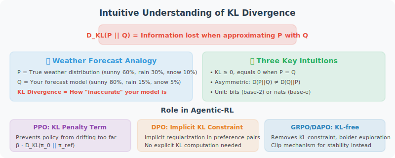

# Appendix E: KL Divergence (Kullback-Leibler Divergence) Explained

> This appendix provides a complete introduction to KL divergence for readers with no prior background. If you are already familiar with information theory basics, you can skip directly to the [Application in Agentic-RL](#application-in-agentic-rl) section.

---

## Intuitive Understanding: What Does KL Divergence Measure?

Imagine you are a weather forecaster. You have built a weather prediction model $Q$, while the true weather distribution is $P$. **KL divergence $D_{KL}(P \| Q)$ measures: when you use model $Q$ to approximate the true distribution $P$, how much information is lost on average.**

More plainly:

> **KL divergence measures the "distance" between two probability distributions — but it is an asymmetric distance.**

A few key intuitions:

- **$D_{KL}(P \| Q) = 0$**: Holds if and only if $P$ and $Q$ are identical. The more "similar" the two distributions, the smaller the KL divergence.
- **$D_{KL}(P \| Q) \geq 0$**: KL divergence is always non-negative (guaranteed by Gibbs' inequality).
- **$D_{KL}(P \| Q) \neq D_{KL}(Q \| P)$**: Asymmetry! The "distance" from $P$ to $Q$ and from $Q$ to $P$ are generally different. This is why KL divergence is not a strict "metric" but a "divergence."

---

## Mathematical Definition

### Discrete Case

For two discrete probability distributions $P$ and $Q$ (defined on the same event space $\mathcal{X}$):

$$D_{KL}(P \| Q) = \sum_{x \in \mathcal{X}} P(x) \log \frac{P(x)}{Q(x)}$$

### Continuous Case

For two continuous probability distributions (with probability density functions $p(x)$ and $q(x)$):

$$D_{KL}(P \| Q) = \int_{-\infty}^{+\infty} p(x) \log \frac{p(x)}{q(x)} \, dx$$

### Term-by-Term Interpretation

Using the discrete case as an example:

$$D_{KL}(P \| Q) = \sum_{x \in \mathcal{X}} P(x) \log \frac{P(x)}{Q(x)} = \sum_{x \in \mathcal{X}} P(x) \left[ \log P(x) - \log Q(x) \right]$$

- $P(x)$: The probability (weight) of event $x$ in the true distribution
- $\log P(x) - \log Q(x)$: The "information gap" between the true and approximate distributions at event $x$
- The whole expression is a **weighted average**: using the true distribution $P$ as weights, taking the expectation of the information gap at each event

---

## A Concrete Example

Suppose we have a 6-sided die, with true distribution $P$ and two model distributions $Q_1$, $Q_2$ as follows:

| Face | $P$ (True) | $Q_1$ (Uniform Model) | $Q_2$ (Skewed Model) |
|------|-----------|----------------------|---------------------|
| 1 | 1/6 | 1/6 | 1/2 |
| 2 | 1/6 | 1/6 | 1/10 |
| 3 | 1/6 | 1/6 | 1/10 |
| 4 | 1/6 | 1/6 | 1/10 |
| 5 | 1/6 | 1/6 | 1/10 |
| 6 | 1/6 | 1/6 | 1/10 |

Results:
- $D_{KL}(P \| Q_1) = 0$ ($Q_1$ is identical to $P$, no information loss)
- $D_{KL}(P \| Q_2) \approx 0.216$ bits ($Q_2$ deviates from the true distribution, causing information loss)

This tells us: **the skewed model $Q_2$ is "worse" than the uniform model $Q_1$** — using $Q_2$ to approximate the true distribution loses more information.

---

## Relationship with Information Theory

KL divergence can be understood through two fundamental concepts in information theory:

### Entropy

$$H(P) = -\sum_{x} P(x) \log P(x)$$

Entropy measures the **uncertainty** of distribution $P$, and is also the minimum average number of bits needed to optimally encode events from $P$.

### Cross-Entropy

$$H(P, Q) = -\sum_{x} P(x) \log Q(x)$$

Cross-entropy measures: **if the true distribution is $P$, but we use an encoding scheme designed based on $Q$, how many bits on average are needed to encode one event.**

### The Relationship Between the Three

$$D_{KL}(P \| Q) = H(P, Q) - H(P)$$

That is: **KL divergence = Cross-entropy − Entropy = the extra cost of encoding with the wrong distribution**.

This is why KL divergence is also called **Relative Entropy**.

---

## Intuition Behind Asymmetry

The asymmetry of KL divergence has important practical implications:

- **$D_{KL}(P \| Q)$** (Forward KL): Penalizes $Q$ for assigning low probability where $P$ has probability density. The effect is that $Q$ tends to **cover** all modes of $P$ (mode-covering), potentially making $Q$ too spread out.
- **$D_{KL}(Q \| P)$** (Reverse KL): Penalizes $Q$ for assigning high probability where $P$ has no probability density. The effect is that $Q$ tends to **concentrate** on one mode of $P$ (mode-seeking), potentially making $Q$ too concentrated.

A vivid analogy:

> - Forward KL is like a "cautious person": would rather over-cover than miss any possibility
> - Reverse KL is like a "focused person": would rather focus only on the most important part than spread attention

---

## Application in Agentic-RL

In [18.1 What is Agentic-RL](../chapter_agentic_rl/01_agentic_rl_overview.md), the RL stage loss function includes a KL divergence penalty term:

$$\mathcal{L}_{RL}(\theta) = -\mathbb{E}_{\tau \sim \pi_\theta} \left[ R(\tau) \right] + \beta \cdot D_{KL}(\pi_\theta \| \pi_{SFT})$$

The specific meaning of $D_{KL}(\pi_\theta \| \pi_{SFT})$ here is:

### Why Is KL Constraint Needed?

During RL training, the model continuously updates parameters to maximize rewards. Without constraints, the model might go to two extremes:

1. **Reward Hacking**: The model finds ways to exploit loopholes in the reward function to get high scores, but actual output quality is poor. For example, the model might learn to generate a specific format to fool the reward model, rather than truly solving the problem.
2. **Language Degeneration**: The model's output no longer resembles natural language, producing repetitive, meaningless token sequences.

The KL divergence penalty term acts as a "safety rope":

$$D_{KL}(\pi_\theta \| \pi_{SFT}) = \mathbb{E}_{x \sim \mathcal{D}} \left[ \sum_{t} \pi_\theta(y_t \mid x, y_{<t}) \log \frac{\pi_\theta(y_t \mid x, y_{<t})}{\pi_{SFT}(y_t \mid x, y_{<t})} \right]$$

- If the current policy $\pi_\theta$ has the same output distribution as the SFT policy $\pi_{SFT}$, $D_{KL} = 0$, no additional penalty
- If the current policy deviates too far from the SFT policy, $D_{KL}$ increases, the penalty term in the loss function increases, "pulling" the policy back to a safe range

### The Role of $\beta$

The hyperparameter $\beta$ controls the strength of the KL constraint:

| $\beta$ Value | Effect | Applicable Scenario |
|--------------|--------|---------------------|
| **Larger** (e.g., 0.1–0.5) | Conservative policy, closely follows SFT model | Early training, high task safety requirements |
| **Smaller** (e.g., 0.001–0.01) | Free policy, allows large exploration | Late training, task has clear objective evaluation criteria |
| **Adaptive** | Dynamically adjusted, keeps KL within target range | Commonly used in PPO |

In GRPO (Group Relative Policy Optimization), the specific implementation of KL penalty differs; see [18.5 GRPO: Group Relative Policy Optimization and Reward Function Design](../chapter_agentic_rl/05_grpo.md).

---

## Summary

| Concept | One-Line Description |
|---------|---------------------|
| **KL Divergence** | Average information loss when approximating distribution $P$ with distribution $Q$ |
| **Non-negativity** | $D_{KL}(P \| Q) \geq 0$, equality holds if and only if $P = Q$ |
| **Asymmetry** | $D_{KL}(P \| Q) \neq D_{KL}(Q \| P)$ |
| **Relationship with Cross-Entropy** | $D_{KL}$ = Cross-Entropy − Entropy |
| **Role in RL** | Prevents policy from deviating too far from the reference model, avoiding reward hacking and language degeneration |

---

## Further Reading

- Kullback S, Leibler R A. On Information and Sufficiency[J]. The Annals of Mathematical Statistics, 1951, 22(1): 79-86.
- Cover T M, Thomas J A. Elements of Information Theory[M]. 2nd ed. Wiley, 2006. (Chapter 2 covers KL divergence properties in detail)
- Schulman J, et al. Proximal Policy Optimization Algorithms[R]. arXiv:1707.06347, 2017. (Engineering practice of KL constraints in PPO)
