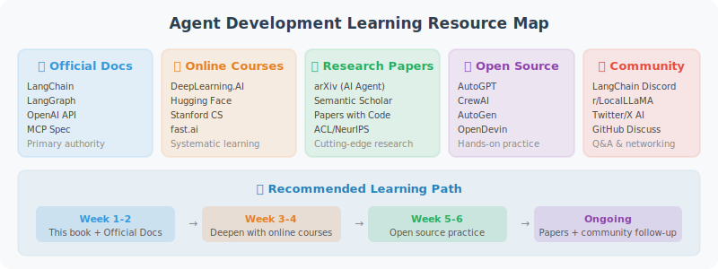

# Appendix C: Recommended Learning Resources and Communities

---

## 📚 Official Documentation

| Resource | Link | Description |
|----------|------|-------------|
| LangChain Docs | [python.langchain.com](https://python.langchain.com/) | Most comprehensive Agent framework documentation |
| LangGraph Docs | [langchain-ai.github.io/langgraph](https://langchain-ai.github.io/langgraph/) | Stateful Agent development |
| OpenAI API Docs | [platform.openai.com/docs](https://platform.openai.com/docs) | Model API usage guide |
| Anthropic Docs | [docs.anthropic.com](https://docs.anthropic.com/) | Claude model documentation |
| MCP Specification | [modelcontextprotocol.io](https://modelcontextprotocol.io/) | Agent tool standard protocol |

---

## 📖 Recommended Books and Courses

### Books

- **"Building LLM Powered Applications"** — A practical guide to LLM application development
- **"Generative AI with LangChain"** — In-depth guide to the LangChain framework
- **"Designing Autonomous AI Agent Systems"** — Principles of Agent system design

### Online Courses

- **DeepLearning.AI** "Building Agentic RAG with LlamaIndex" series
- **LangChain Academy** — Official LangChain courses (free)
- **Andrew Ng** "AI Agentic Design Patterns" series

---

## 🛠️ Open Source Projects

| Project | Description |
|---------|-------------|
| [LangChain](https://github.com/langchain-ai/langchain) | Most popular Agent development framework |
| [LangGraph](https://github.com/langchain-ai/langgraph) | Stateful Agent workflows |
| [CrewAI](https://github.com/crewAIInc/crewAI) | Multi-Agent role-playing framework |
| [AutoGen](https://github.com/microsoft/autogen) | Microsoft multi-Agent framework (0.4 event-driven architecture) |
| [Dify](https://github.com/langgenius/dify) | Open-source LLM application platform |
| [mem0](https://github.com/mem0ai/mem0) | Agent memory layer |
| [ChromaDB](https://github.com/chroma-core/chroma) | Lightweight vector database |

---

## 🌐 Communities and Forums

### English Communities

- **LangChain Discord** — Active developer community
- **Reddit r/LangChain** — Discussion and sharing
- **GitHub Discussions** — Official discussion boards for each framework
- **Hugging Face** — Open-source model community

### Chinese Communities

- **Juejin (稀土掘金)** — Search "Agent开发", "LangChain实战" for many Chinese practice articles
- **Zhihu (知乎)** — Follow "AI Agent", "LLM应用开发" topics for industry discussions and technical analysis
- **CSDN** — Agent development tutorials and troubleshooting records
- **Bilibili / YouTube Chinese channels** — Search "Agent开发教程" for quality video tutorials
- **WeChat Official Accounts** — Recommended: 机器之心, 量子位, AI科技大本营 (track latest Agent technology trends)
- **Tongyi Qianwen Community** — Alibaba Cloud's LLM developer community, suitable for developers using domestic models

---

## 📄 Key Academic Papers

The following are core academic papers referenced in this book, organized by technical topic. Each topic has a corresponding **dedicated paper reading section** in the book — it is recommended to read selectively according to your learning progress.

> 💡 **Deep Reading Section Index**:
> - Tool Use → [4.6 Paper Readings: Frontiers in Tool Learning](../chapter_tools/06_paper_readings.md)
> - Memory Systems → [5.6 Paper Readings: Frontiers in Memory Systems](../chapter_memory/06_paper_readings.md)
> - Planning & Reasoning → [6.6 Paper Readings: Frontiers in Planning and Reasoning](../chapter_planning/06_paper_readings.md)
> - RAG → [7.6 Paper Readings: Frontiers in RAG](../chapter_rag/06_paper_readings.md)
> - Multi-Agent → [14.6 Paper Readings: Frontiers in Multi-Agent Systems](../chapter_multi_agent/06_paper_readings.md)
> - Safety & Reliability → [17.6 Paper Readings: Frontiers in Safety and Reliability](../chapter_security/06_paper_readings.md)

### Prompting Strategies and Reasoning

| Paper | Authors | Year | Book Chapter | Link |
|-------|---------|------|-------------|------|
| Chain-of-Thought Prompting Elicits Reasoning in Large Language Models | Wei et al. (Google Brain) | 2022 | 3.3 | [arXiv:2201.11903](https://arxiv.org/abs/2201.11903) |
| Large Language Models are Zero-Shot Reasoners | Kojima et al. | 2022 | 3.3 | [arXiv:2205.11916](https://arxiv.org/abs/2205.11916) |
| Self-Consistency Improves Chain of Thought Reasoning | Wang et al. (Google Brain) | 2023 | 3.3, 17.2 | [arXiv:2203.11171](https://arxiv.org/abs/2203.11171) |
| Tree of Thoughts: Deliberate Problem Solving with LLMs | Yao et al. (Princeton) | 2023 | 3.3 | [arXiv:2305.10601](https://arxiv.org/abs/2305.10601) |
| ReAct: Synergizing Reasoning and Acting in Language Models | Yao et al. (Princeton) | 2022 | 3.3, 6.2 | [arXiv:2210.03629](https://arxiv.org/abs/2210.03629) |
| Plan-and-Solve Prompting | Wang et al. | 2023 | 6.3 | [arXiv:2305.04091](https://arxiv.org/abs/2305.04091) |

### Tool Use

| Paper | Authors | Year | Book Chapter | Link |
|-------|---------|------|-------------|------|
| Toolformer: Language Models Can Teach Themselves to Use Tools | Schick et al. (Meta) | 2023 | 4.1 | [arXiv:2302.04761](https://arxiv.org/abs/2302.04761) |
| Gorilla: Large Language Model Connected with Massive APIs | Patil et al. (UC Berkeley) | 2023 | 4.1 | [arXiv:2305.15334](https://arxiv.org/abs/2305.15334) |
| ToolLLM: Facilitating LLMs to Master 16000+ Real-world APIs | Qin et al. | 2023 | 4.1 | [arXiv:2307.16789](https://arxiv.org/abs/2307.16789) |
| ToolACE: Winning the Points of LLM Function Calling | Liu et al. (Huawei Noah's Ark & USTC) | 2024 | 4.6 | [arXiv:2409.00920](https://arxiv.org/abs/2409.00920) |
| RAG-MCP: Mitigating Prompt Bloat in LLM Tool Selection | Gan et al. | 2025 | 4.6 | [arXiv:2505.03275](https://arxiv.org/abs/2505.03275) |

### Skill Systems

| Paper | Authors | Year | Book Chapter | Link |
|-------|---------|------|-------------|------|
| Voyager: An Open-Ended Embodied Agent with LLMs | Wang et al. (NVIDIA & Caltech) | 2023 | 5.6 | [arXiv:2305.16291](https://arxiv.org/abs/2305.16291) |
| CRAFT: Customizing LLMs by Creating and Retrieving from Specialized Toolsets | Yuan et al. (Peking University) | 2024 | 5.6 | [arXiv:2309.17428](https://arxiv.org/abs/2309.17428) |

### Memory Systems

| Paper | Authors | Year | Book Chapter | Link |
|-------|---------|------|-------------|------|
| Generative Agents: Interactive Simulacra of Human Behavior | Park et al. (Stanford) | 2023 | 5.1 | [arXiv:2304.03442](https://arxiv.org/abs/2304.03442) |
| MemGPT: Towards LLMs as Operating Systems | Packer et al. (UC Berkeley) | 2023 | 5.1 | [arXiv:2310.08560](https://arxiv.org/abs/2310.08560) |
| MemoryBank: Enhancing LLMs with Long-Term Memory | Zhong et al. | 2023 | 5.1 | [arXiv:2305.10250](https://arxiv.org/abs/2305.10250) |
| Cognitive Architectures for Language Agents (CoALA) | Sumers et al. | 2023 | 5.1 | [arXiv:2309.02427](https://arxiv.org/abs/2309.02427) |
| HippoRAG: Neurobiologically Inspired Long-Term Memory for LLMs | Gutiérrez et al. (OSU) | 2024 | 5.6 | [arXiv:2405.14831](https://arxiv.org/abs/2405.14831) |
| Zep: A Temporal Knowledge Graph Architecture for Agent Memory | Rasmussen et al. | 2025 | 5.6 | [arXiv:2501.13956](https://arxiv.org/abs/2501.13956) |

### Reflection and Self-Correction

| Paper | Authors | Year | Book Chapter | Link |
|-------|---------|------|-------------|------|
| Reflexion: Language Agents with Verbal Reinforcement Learning | Shinn et al. | 2023 | 6.4 | [arXiv:2303.11366](https://arxiv.org/abs/2303.11366) |
| Self-Refine: Iterative Refinement with Self-Feedback | Madaan et al. (CMU) | 2023 | 6.4 | [arXiv:2303.17651](https://arxiv.org/abs/2303.17651) |
| CRITIC: LLMs Can Self-Correct with Tool-Interactive Critiquing | Gou et al. | 2023 | 6.4 | [arXiv:2305.11738](https://arxiv.org/abs/2305.11738) |
| Large Language Models Cannot Self-Correct Reasoning Yet | Huang et al. | 2023 | 6.4 | [arXiv:2310.01798](https://arxiv.org/abs/2310.01798) |

### Retrieval-Augmented Generation (RAG)

| Paper | Authors | Year | Book Chapter | Link |
|-------|---------|------|-------------|------|
| Retrieval-Augmented Generation for Knowledge-Intensive NLP Tasks | Lewis et al. (Meta AI) | 2020 | 7.1 | [arXiv:2005.11401](https://arxiv.org/abs/2005.11401) |
| Self-RAG: Learning to Retrieve, Generate, and Critique | Asai et al. | 2023 | 7.1 | [arXiv:2310.11511](https://arxiv.org/abs/2310.11511) |
| Corrective Retrieval Augmented Generation (CRAG) | Yan et al. | 2024 | 7.1 | [arXiv:2401.15884](https://arxiv.org/abs/2401.15884) |
| From Local to Global: A Graph RAG Approach | Edge et al. (Microsoft) | 2024 | 7.1 | [arXiv:2404.16130](https://arxiv.org/abs/2404.16130) |
| LightRAG: Simple and Fast Retrieval-Augmented Generation | Guo et al. (HKU) | 2024 | 7.6 | [arXiv:2410.05779](https://arxiv.org/abs/2410.05779) |

### Planning and Reasoning

| Paper | Authors | Year | Book Chapter | Link |
|-------|---------|------|-------------|------|
| ReAct: Synergizing Reasoning and Acting in Language Models | Yao et al. (Princeton) | 2022 | 6.2 | [arXiv:2210.03629](https://arxiv.org/abs/2210.03629) |
| Plan-and-Solve Prompting | Wang et al. | 2023 | 6.3 | [arXiv:2305.04091](https://arxiv.org/abs/2305.04091) |
| Reflexion: Language Agents with Verbal Reinforcement Learning | Shinn et al. | 2023 | 6.4 | [arXiv:2303.11366](https://arxiv.org/abs/2303.11366) |
| Learning to Reason with LLMs (OpenAI o1) | OpenAI | 2024 | 6.6 | [openai.com](https://openai.com/index/learning-to-reason-with-llms/) |
| DeepSeek-R1: Incentivizing Reasoning Capability via RL | DeepSeek-AI | 2025 | 6.6 | [arXiv:2501.12948](https://arxiv.org/abs/2501.12948) |

### Multi-Agent Systems

| Paper | Authors | Year | Book Chapter | Link |
|-------|---------|------|-------------|------|
| MetaGPT: Meta Programming for Multi-Agent Collaboration | Hong et al. | 2023 | 14.1 | [arXiv:2308.00352](https://arxiv.org/abs/2308.00352) |
| Communicative Agents for Software Development (ChatDev) | Qian et al. | 2023 | 14.1 | [arXiv:2307.07924](https://arxiv.org/abs/2307.07924) |
| AutoGen: Enabling Next-Gen LLM Applications | Wu et al. (Microsoft) | 2023 | 14.1 | [arXiv:2308.08155](https://arxiv.org/abs/2308.08155) |
| AgentVerse: Facilitating Multi-Agent Collaboration | Chen et al. | 2023 | 14.1 | [arXiv:2308.10848](https://arxiv.org/abs/2308.10848) |
| Magentic-One: A Generalist Multi-Agent System | Fourney et al. (Microsoft) | 2024 | 14.6 | [arXiv:2411.04468](https://arxiv.org/abs/2411.04468) |
| Multi-Agent Collaboration Mechanisms: A Survey of LLMs | Nguyen et al. | 2025 | 14.6 | [arXiv:2501.06322](https://arxiv.org/abs/2501.06322) |

### Safety and Reliability

| Paper | Authors | Year | Book Chapter | Link |
|-------|---------|------|-------------|------|
| Not What You've Signed Up For: Indirect Prompt Injection | Greshake et al. | 2023 | 17.1 | [arXiv:2302.12173](https://arxiv.org/abs/2302.12173) |
| HackAPrompt: Exposing Systemic Weaknesses of LLMs | Schulhoff et al. | 2023 | 17.1 | [arXiv:2311.16119](https://arxiv.org/abs/2311.16119) |
| FActScore: Fine-grained Atomic Evaluation of Factual Precision | Min et al. (UW) | 2023 | 17.2 | [arXiv:2305.14251](https://arxiv.org/abs/2305.14251) |
| A Survey on Hallucination in Large Language Models | Huang et al. | 2023 | 17.2 | [arXiv:2311.05232](https://arxiv.org/abs/2311.05232) |
| InjecAgent: Benchmarking Indirect Prompt Injections in Tool-Integrated Agents | Zhan et al. | 2024 | 17.6 | [arXiv:2403.02691](https://arxiv.org/abs/2403.02691) |
| AgentDojo: Dynamic Environment for Agent Attack/Defense | Debenedetti et al. (ETH Zurich) | 2024 | 17.6 | [arXiv:2406.13352](https://arxiv.org/abs/2406.13352) |
| Agent Security Bench (ASB): Attacks and Defenses in LLM Agents | Zhang et al. | 2025 | 17.6 | [arXiv:2410.02644](https://arxiv.org/abs/2410.02644) |

### Agent Surveys

| Paper | Authors | Year | Description | Link |
|-------|---------|------|-------------|------|
| A Survey on Large Language Model based Autonomous Agents | Wang et al. (Renmin University) | 2023 | Most comprehensive LLM Agent survey | [arXiv:2308.11432](https://arxiv.org/abs/2308.11432) |
| The Rise and Potential of Large Language Model Based Agents: A Survey | Xi et al. | 2023 | Survey on the rise and potential of Agents | [arXiv:2309.07864](https://arxiv.org/abs/2309.07864) |
| LLM Powered Autonomous Agents | Lilian Weng (OpenAI) | 2023 | Excellent technical blog, suitable for beginners | [lilianweng.github.io](https://lilianweng.github.io/posts/2023-06-23-agent/) |
| Multi-Agent Collaboration Mechanisms: A Survey of LLMs | Nguyen et al. | 2025 | Survey on multi-Agent collaboration mechanisms | [arXiv:2501.06322](https://arxiv.org/abs/2501.06322) |

> 💡 **Reading Recommendation**: If time is limited, prioritize these 7 "must-read" papers: ① ReAct (basic Agent paradigm) ② Generative Agents (memory system design) ③ Original RAG paper (knowledge augmentation) ④ Reflexion (self-improvement) ⑤ DeepSeek-R1 (reasoning model, 2025) ⑥ Magentic-One (general multi-Agent system, 2024) ⑦ A Survey on LLM based Autonomous Agents (panoramic survey).

---

## 📰 Staying Updated

The Agent field evolves rapidly. It is recommended to follow:

- **LangChain Blog** — Framework updates and best practices
- **OpenAI Blog** — Model capability updates and Agents SDK development
- **Anthropic Blog** — Claude model and MCP protocol updates
- **Google AI Blog** — Gemini model and A2A protocol developments
- **The Batch** (by Andrew Ng) — Weekly AI industry newsletter
- **arXiv** — Latest research papers (search "LLM Agent")
- **DeepSeek Blog** — Latest developments in open-source reasoning models
