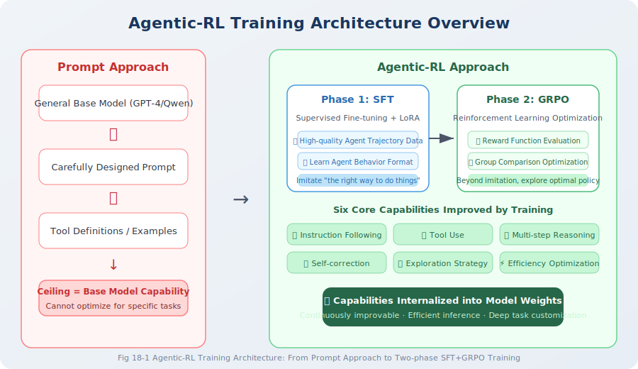

# 11.1 What Is Agentic-RL

## The Paradigm Shift from "Prompt Engineering" to "Training Optimization"

In previous chapters of this book, our core method for building Agents was **Prompt Engineering + tool calling**: carefully writing system prompts, defining tool interfaces, and having general-purpose large models play specific roles to complete tasks. This approach has a low development barrier and is fast to develop, but has a fundamental bottleneck:

> **The Agent's capability ceiling = the base model's general capability ceiling.**

No matter how cleverly the prompts are designed, if the base model has systematic deficiencies in certain types of reasoning (such as multi-step mathematical reasoning, complex code repair, long-horizon planning), the Agent's performance cannot break through this ceiling.

**Agentic-RL (Agentic Reinforcement Learning)** proposes a fundamentally different approach: **rather than guiding model behavior through prompts at inference time, use reinforcement learning signals during training to let the model autonomously learn high-quality Agent strategies**. The core insight of this paradigm comes from experimental findings in DeepSeek-R1 [3] — pure RL training can cause reasoning chains to emerge in models that humans never explicitly taught.

### Systematic Comparison of the Two Paradigms

| Dimension | Prompt Engineering | Agentic-RL |
|-----------|-------------------|------------|
| **Capability source** | Base model pre-training knowledge + prompt guidance | Base model + task-specific RL optimization |
| **Development cost** | Low (engineer time) | High (GPU compute + data annotation) |
| **Task adaptability** | General but not specialized | Deeply optimized for specific tasks |
| **Inference efficiency** | Relies on long prompts, high token consumption | Capabilities internalized in weights, more efficient inference |
| **Scalability** | Limited by context window and prompt length | Can be iteratively improved through continued training |
| **Capability ceiling** | Limited by base model | Can exceed base model (emergent capabilities) |
| **Applicable scenarios** | Rapid prototyping, general tasks, low-frequency needs | High-frequency, high-value tasks with clear evaluation criteria |

### When Should You Choose Agentic-RL?

Agentic-RL is not a silver bullet. The following is a decision framework based on practical experience:

**Scenarios suitable for investing in Agentic-RL:**
- ✅ Tasks have **objectively verifiable evaluation criteria** (code test pass rate, mathematical answer correctness, API call success rate)
- ✅ Tasks are **high-frequency and repetitive**, so training costs can be amortized over long-term benefits
- ✅ The current base model has **systematic, improvable deficiencies** on the task
- ✅ **Sufficient training data** is available or can be generated automatically

**Scenarios not suitable for Agentic-RL:**
- ❌ One-time, low-frequency open-ended tasks (insufficient ROI)
- ❌ Tasks that cannot be objectively quantified for evaluation (e.g., open-ended creative writing)
- ❌ Base model + prompt approach has already reached an acceptable level
- ❌ Lack of GPU compute resources (GRPO training for a 7B model requires at least 1× A100 40GB)

---

## Theoretical Foundation of Agentic-RL: The MDP Framework

### Markov Decision Process Modeling

The theoretical foundation of Agentic-RL is the **Markov Decision Process (MDP)** [1]. The Agent's task execution process is formalized as a finite-horizon MDP:

$$\mathcal{M} = \langle \mathcal{S}, \mathcal{A}, \mathcal{T}, \mathcal{R}, \gamma \rangle$$

The correspondence of each element to the Agent scenario is as follows:

| MDP Element | Formal Definition | Correspondence in Agent Scenario |
|-------------|------------------|----------------------------------|
| **State space** $\mathcal{S}$ | $s_t \in \mathcal{S}$ | Current conversation history + tool return results + environment context |
| **Action space** $\mathcal{A}$ | $a_t \in \mathcal{A}$ | The model's next token sequence output (text, tool calls, code, etc.) |
| **Transition function** $\mathcal{T}$ | $s_{t+1} \sim \mathcal{T}(\cdot \mid s_t, a_t)$ | Environment's response to actions (tool execution results, user feedback) |
| **Reward function** $\mathcal{R}$ | $r_t = \mathcal{R}(s_t, a_t)$ | Task completion evaluation (answer correctness, code pass rate, etc.) |
| **Policy** $\pi_\theta$ | $a_t \sim \pi_\theta(\cdot \mid s_t)$ | Conditional generation distribution determined by model parameters $\theta$ |
| **Discount factor** $\gamma$ | $\gamma \in [0, 1]$ | Discount on future rewards (usually 1.0, i.e., no discount) |

The **training objective** is to maximize expected cumulative reward:

$$\theta^* = \arg\max_\theta \mathbb{E}_{\tau \sim \pi_\theta} \left[ \sum_{t=0}^{T} \gamma^t r_t \right]$$

Term-by-term explanation:

- $\theta^*$: optimal model parameters — the target we want to find through training
- $\arg\max_\theta$: among all possible parameters $\theta$, find the one that maximizes the objective function
- $\mathbb{E}_{\tau \sim \pi_\theta}[\cdot]$: **expectation** operator — since model generation is stochastic (temperature > 0), the trajectory $\tau$ generated for the same problem differs each time; we optimize the **average** performance across all possible trajectories, not the result of any specific generation
- $\sum_{t=0}^{T} \gamma^t r_t$: **discounted cumulative reward** — the immediate reward $r_t$ at each step of the trajectory is weighted and summed by the time discount $\gamma^t$; when $\gamma < 1$, near-term rewards have greater weight than distant rewards (in Agentic-RL, $\gamma = 1.0$ is typically used, i.e., no discount, because we care about the final task completion quality rather than temporal differences in intermediate steps)
- $\tau = (s_0, a_0, s_1, a_1, \ldots, s_T)$: a complete **interaction trajectory**, recording the complete state-action sequence from initial state to terminal state

**Intuitive understanding**: the meaning of this objective function is — adjust model parameters $\theta$ so that the model can obtain as high a cumulative reward as possible on average when facing various tasks. This is consistent with the intuition of human learning: through extensive practice (sampling trajectories), continuously adjust the strategy (update parameters) to continuously improve average performance.

### Formal Description of the Agent Interaction Loop



### Six Core Capability Dimensions

After Agentic-RL training, models can achieve systematic improvements in the following six dimensions [2]:

| Capability Dimension | Description | Typical Improvement |
|---------------------|-------------|---------------------|
| **Instruction following** | Accurately understand and execute complex, multi-constraint instructions | Format compliance rate improves from ~30% to ~90% |
| **Tool use** | Call the right tool at the right time, handle tool return results | Tool call accuracy significantly improved |
| **Multi-step reasoning** | Maintain long reasoning chains in complex tasks, reduce intermediate step errors | Mathematical reasoning accuracy improves 20–30% |
| **Self-correction** | Identify execution errors and proactively correct them, rather than continuing on the wrong path | Error recovery rate improved |
| **Exploration strategy** | Reasonably try different approaches under uncertainty | First-attempt success rate improved |
| **Efficiency optimization** | Complete tasks with fewer steps and fewer tokens | Average trajectory length shortened |

---

## Two-Phase Training Paradigm

Contemporary mainstream Agentic-RL training follows the **SFT → RL** two-phase paradigm [3], with each phase playing an irreplaceable role.

### Phase 1: SFT (Supervised Fine-Tuning) — Policy Initialization

**Core objective**: adjust the base model's policy distribution $\pi_0$ to an initial policy $\pi_{SFT}$ with basic Agent behavior formats.

The training objective in the SFT phase is to maximize log-likelihood:

$$\mathcal{L}_{SFT}(\theta) = -\mathbb{E}_{(x, y^*) \sim \mathcal{D}_{SFT}} \left[ \log \pi_\theta(y^* \mid x) \right]$$

Term-by-term explanation:

- $-\mathbb{E}_{(x,y^*)\sim\mathcal{D}_{SFT}}$: negative sign + expectation symbol, indicating averaging over all samples $(x, y^*)$ in the supervised fine-tuning dataset $\mathcal{D}_{SFT}$.
  - $x$: model input (e.g., user instructions, prompts).
  - $y^*$: the corresponding **human-annotated ideal output** (i.e., the "ground truth answer").
  - $\mathcal{D}_{SFT}$: the collected instruction-answer pair dataset.
- $\mathcal{D}_{SFT} = \{(x^{(i)}, y^{*(i)})\}_{i=1}^N$: a high-quality Agent interaction trajectory dataset, where each sample contains input context $x$ (system prompt + user question) and expert demonstration output $y^*$ (including reasoning process and tool calls)
- $\log \pi_\theta(y^* \mid x)$: the **log probability** of the model generating the expert demonstration sequence $y^*$ given input $x$. The larger this value (closer to 0), the more the model considers the expert demonstration to be "reasonable output"; adding a negative sign converts it to a loss, and minimizing the loss maximizes the log probability
- In practice, $\log \pi_\theta(y^* \mid x)$ is expanded via **autoregressive decomposition** into a sum of per-token log probabilities: $\sum_{t=1}^{|y^*|} \log \pi_\theta(y^*_t \mid x, y^*_{<t})$, i.e., the generation probability of each token is conditioned on all preceding tokens

**Intuitive understanding**: the essence of SFT is "imitation learning" — show the model a large number of expert demonstrations, letting the model learn "given this input, what would an expert output?" This phase is similar to "copying calligraphy" — first imitate correct behavioral patterns to establish format norms and basic capabilities.

```
Training data example:
Input x: "Calculate the result of 1234 × 5678"
Expected output y*:
  <think>
  This requires precise integer multiplication. Should use the calculator tool to ensure accuracy.
  </think>
  <tool_call>calculator(expression="1234 * 5678")</tool_call>
```

### Phase 2: RL (Reinforcement Learning) — Policy Optimization

**Core objective**: building on $\pi_{SFT}$, use reward signals to guide the policy toward $\pi^*$, breaking through the quality ceiling of SFT data.

The training objective in the RL phase is to maximize expected reward while constraining the policy from drifting too far via KL divergence:

$$\mathcal{L}_{RL}(\theta) = -\mathbb{E}_{\tau \sim \pi_\theta} \left[ R(\tau) \right] + \beta \cdot D_{KL}(\pi_\theta \| \pi_{SFT})$$

Term-by-term explanation:

- $-\mathbb{E}_{\tau \sim \pi_\theta}[R(\tau)]$: **policy loss term** — maximize the expected reward of trajectories sampled by the current policy $\pi_\theta$. The negative sign converts maximization to minimization (gradient descent convention)
- $\beta \cdot D_{KL}(\pi_\theta \| \pi_{SFT})$: **KL divergence penalty term** — $D_{KL}$ measures the "distributional distance" between the current policy $\pi_\theta$ and the SFT initial policy $\pi_{SFT}$. When the two distributions are identical, $D_{KL} = 0$; the greater the difference, the larger $D_{KL}$. The coefficient $\beta$ controls penalty strength: larger $\beta$ makes the policy more conservative (reluctant to deviate from the SFT model); smaller $\beta$ makes the policy more aggressive (may produce reward hacking behavior).
  > 💡 **What is KL divergence?** If you're not yet familiar with KL divergence, we recommend reading [Appendix E: KL Divergence Explained](../appendix/kl_divergence.md) in this book, which includes a complete introduction from intuitive understanding to mathematical definition. Simply put, $D_{KL}(P \| Q)$ answers the question: **"If the true distribution is $P$, how much information is lost on average by approximating it with distribution $Q$?"**
- **The tension between the two terms**: the policy loss term encourages the model to "boldly explore" for higher rewards, while the KL penalty constrains the model to "not go too far" to maintain language quality. $\beta$ is the balance point between these two forces

SFT can only bring the model to the quality ceiling of the training data. The RL phase uses the reward function to tell the model "what constitutes a good result," letting the model autonomously explore solution paths that exceed the demonstration data — this is precisely the key mechanism by which DeepSeek-R1 [3] can develop "self-reflection" and "long-chain reasoning" capabilities.

```
What SFT learned:  "See a math problem → call the calculator"
What RL learned:   "Analyze problem structure → judge whether step-by-step is needed → 
                    select optimal tool combination → verify intermediate results → 
                    proactively backtrack when errors are found"
```

### Why Are Both Phases Indispensable?

| Comparison Dimension | Pure SFT | Pure RL (from random init) | SFT → RL |
|---------------------|----------|---------------------------|----------|
| **Format compliance** | ✅ High | ❌ Extremely low (chaotic output) | ✅ High |
| **Capability ceiling** | ❌ Limited by data quality | ⚠️ Theoretically unlimited, but hard to converge in practice | ✅ Can exceed data quality |
| **Training stability** | ✅ Stable | ❌ Extremely unstable, prone to divergence | ✅ Relatively stable |
| **Convergence speed** | Fast | Extremely slow | Medium |
| **Final performance** | Medium | Uncertain | **Optimal** |

> **📌 Engineering Practice Notes**
>
> Data quality in the SFT phase is more critical than quantity. Research from LIMA [4] shows that 1,000 carefully selected high-quality data points often outperform 10,000 noisy data points. Practical recommendations:
> - **SFT data scale**: 500–2,000 manually verified Agent interaction trajectories
> - **RL compute cost**: approximately 3–10× the SFT phase (due to online sampling requirements)
> - **Validation strategy**: first validate the training pipeline's correctness on a small 7B model, then scale to larger models
> - **When does SFT "graduate"?** The goal of SFT is not to "do the best" but to "do well enough" — loss converged + format correctness rate ≥ 90% + output still has diversity. **Over-SFT seriously damages RL effectiveness**, see [Section 11.2's SFT Graduation Criteria](./02_sft_lora.md#sft-graduation-criteria-when-to-transition-from-sft-to-rl)

---

## Representative Works and Empirical Results

| Project | Base Model | Training Method | Core Achievement |
|---------|-----------|----------------|-----------------|
| **DeepSeek-R1** [3] | DeepSeek-V3 | SFT + GRPO | Math/code reasoning comparable to OpenAI o1 |
| **DeepSWE** [5] | DeepSeek-R1 | SFT + GRPO | SWE-bench Verified 59% (open-source SOTA) |
| **OpenAI o1** [6] | GPT-4 series | RL (specific method undisclosed) | Major improvements in math/programming/science reasoning |
| **Qwen-Agent** [7] | Qwen2.5 | SFT + DPO | Improved tool calling and multi-step reasoning |

These works collectively validate the effectiveness of the Agentic-RL paradigm: **through reinforcement learning training, models can develop reasoning strategies that never appeared in the training data** — something pure SFT methods cannot achieve.

---

*In the next section, we will start with SFT + LoRA and introduce in detail the principles and implementation of the first-phase supervised fine-tuning.*

---

## References

[1] SUTTON R S, BARTO A G. Reinforcement Learning: An Introduction[M]. 2nd ed. Cambridge: MIT Press, 2018.

[2] XI Z, CHEN W, GUO X, et al. The rise and potential of large language model based agents: A survey[R]. arXiv preprint arXiv:2309.07864, 2023.

[3] DEEPSEEK AI. DeepSeek-R1: Incentivizing reasoning capability in LLMs via reinforcement learning[R]. arXiv preprint arXiv:2501.12948, 2025.

[4] ZHOU C, LIU P, XU P, et al. LIMA: Less is more for alignment[C]//Advances in Neural Information Processing Systems (NeurIPS). 2023.

[5] DEEPSEEK AI. DeepSWE: An open agentic SWE model that matches the performance of closed-source models[R]. 2025.

[6] OPENAI. Learning to reason with LLMs[EB/OL]. 2024. https://openai.com/index/learning-to-reason-with-llms.

[7] YANG A, YANG B, HUI B, et al. Qwen2.5 technical report[R]. arXiv preprint arXiv:2412.15115, 2024.
