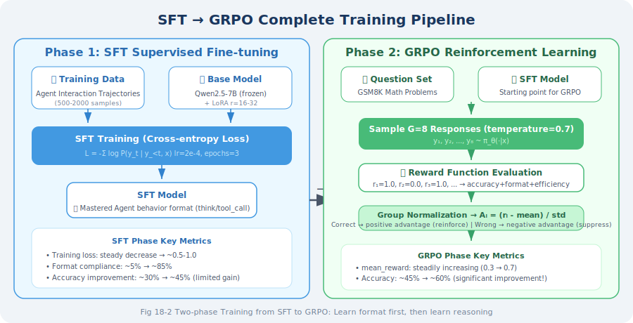
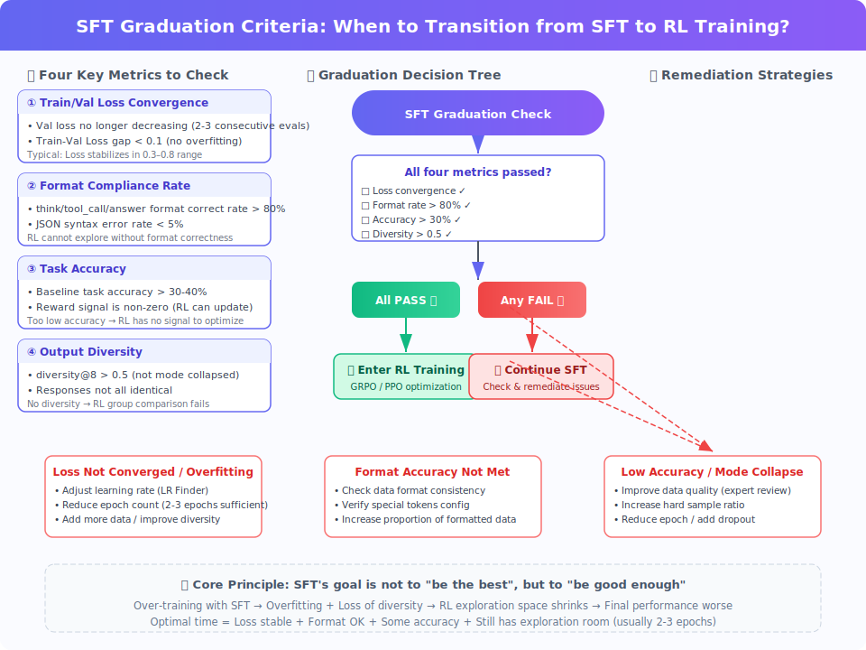

# 11.2 SFT + LoRA: Supervised Fine-Tuning and Parameter-Efficient Training

## Formal Definition of Supervised Fine-Tuning

**SFT (Supervised Fine-Tuning)** is the first phase of Agentic-RL training. Its goal is to adjust the general base model $\pi_0$ to an initial policy $\pi_{SFT}$ with specific Agent behavior formats.

Formally, the training objective of SFT is to minimize the negative log-likelihood loss on the expert demonstration dataset $\mathcal{D} = \{(x^{(i)}, y^{*(i)})\}_{i=1}^N$:

$$\mathcal{L}_{SFT}(\theta) = -\frac{1}{N} \sum_{i=1}^{N} \sum_{t=1}^{|y^{*(i)}|} \log \pi_\theta\left(y^{*(i)}_t \mid x^{(i)}, y^{*(i)}_{<t}\right)$$

Term-by-term explanation:

- $\frac{1}{N} \sum_{i=1}^{N}$: average over $N$ training samples, making the loss independent of dataset size
- $\sum_{t=1}^{|y^{*(i)}|}$: sum over each token in the output sequence of the $i$-th sample — this is the **autoregressive decomposition** of language models: $\log \pi_\theta(y^* \mid x) = \sum_{t=1}^{T} \log \pi_\theta(y^*_t \mid x, y^*_{<t})$, i.e., the joint probability of a sequence equals the product of each token's conditional probability (sum in log domain)
- $\log \pi_\theta(y^{*(i)}_t \mid x^{(i)}, y^{*(i)}_{<t})$: the log probability of the model predicting the $t$-th token as $y^{*(i)}_t$, given input $x^{(i)}$ and the first $t-1$ tokens $y^{*(i)}_{<t}$. The larger this value (closer to 0), the more confident the model is in predicting this token
- Adding the negative sign: minimizing the loss = maximizing log-likelihood = making the model generate each token of the expert demonstration with as high a probability as possible

**Autoregressive intuition**: during training, the model sees the "correct answer" (teacher forcing) — even if the model predicted incorrectly at step $t-1$, step $t$ still uses the true $y^*_{t-1}$ as the condition. This makes SFT training very efficient, but also introduces a train-inference distribution shift problem (at inference time, the model sees its own generated tokens, not expert demonstrations).

Where $x^{(i)}$ is the input context (system prompt + user question), and $y^{*(i)}$ is the complete output sequence of the expert demonstration (including reasoning process and tool calls).

### The Role of SFT in Agentic-RL

The core problem SFT solves is **policy initialization**: starting from random initialization or general pre-training weights, directly performing RL training faces extremely high exploration costs — the model needs to accidentally discover effective Agent behavior formats from a vast number of random outputs. SFT constrains the policy distribution to a reasonable behavior space through imitation learning, providing a stable starting point for subsequent RL optimization.



### SFT Training Data Format Specification

For Agent tasks, SFT training data is a complete trajectory of **multi-turn dialogue + tool calls**, following the ChatML format:

```json
{
  "conversations": [
    {
      "role": "system",
      "content": "You are a math assistant that can use the calculator tool for precise calculations."
    },
    {
      "role": "user",
      "content": "A circular pool has a radius of 3 meters and a water depth of 1.5 meters. How many cubic meters of water are in the pool?"
    },
    {
      "role": "assistant",
      "content": "<think>\nCylinder volume formula: V = π × r² × h\nWhere r = 3 m, h = 1.5 m\nNeed to precisely calculate π × 9 × 1.5, use the calculator tool.\n</think>\n\n<tool_call>\ncalculator(expression=\"3.14159265 * 3**2 * 1.5\")\n</tool_call>"
    },
    {
      "role": "tool",
      "content": "{\"result\": 42.4115}"
    },
    {
      "role": "assistant",
      "content": "The pool contains approximately **42.41 cubic meters** of water.\n\nCalculation: V = π × r² × h = π × 3² × 1.5 ≈ 42.41 m³"
    }
  ]
}
```

### Data Quality Priority Principle

Research from LIMA [1] provides important empirical evidence: **1,000 carefully selected high-quality data points often outperform 10,000 noisy data points**. For Agent SFT, the dimensions for evaluating data quality are as follows:

| Quality Dimension | Standard | Validation Method |
|------------------|----------|------------------|
| **Format consistency** | Unified `<think>`/`<tool_call>` tag format | Automatic regex check |
| **Tool call correctness** | Parameter types and names exactly match tool definitions | Static parsing validation |
| **Reasoning coherence** | `<think>` content logically consistent with final action | Manual sampling review |
| **Task coverage** | Covers all tool call patterns and edge cases | Tool call distribution statistics |
| **Difficulty distribution** | Balanced ratio of simple/medium/complex tasks | Manual grading annotation |

**Recommended data scale**: 500–2,000 manually verified high-quality Agent interaction trajectories.

---

## The Resource Dilemma of Full Parameter Fine-Tuning

Before understanding LoRA, we need to clarify the fundamental challenges faced by full fine-tuning.

Taking Llama 3.1 8B as an example, the GPU memory requirements during training are analyzed as follows:

```python
# Precise GPU memory estimation (using Llama 3.1 8B as example)
total_params = 8_000_000_000        # 8 billion parameters

# Inference phase (float16)
inference_memory = total_params * 2 / (1024**3)   # ≈ 14.9 GB

# Training phase (Adam optimizer, mixed precision)
# Parameters (float32): 4 bytes/param
# Gradients (float32): 4 bytes/param
# Adam first moment (float32): 4 bytes/param
# Adam second moment (float32): 4 bytes/param
# Total: 16 bytes/param
training_memory = total_params * 16 / (1024**3)   # ≈ 119.2 GB

# Conclusion: full parameter fine-tuning requires at least 2-3 A100 80GB GPUs
# This cost is unaffordable for most teams
```

This resource dilemma spurred research into **Parameter-Efficient Fine-Tuning (PEFT)** methods, of which LoRA is the most widely applied solution.

---

## LoRA: Theoretical Foundation of Low-Rank Adaptation

### Core Assumption and Mathematical Derivation

The theoretical foundation of **LoRA (Low-Rank Adaptation)** [2] comes from a key empirical finding:

> **During fine-tuning of pre-trained models, the weight update matrix $\Delta W$ has significant intrinsic low-rank properties.**

**Why are fine-tuning updates low-rank?** Intuitively, pre-trained models have already learned rich general representations; fine-tuning only needs to make small "directional adjustments" in this representation space. These adjustments unfold in a low-dimensional subspace, rather than needing to change all $d \times k$ directions. Aghajanyan et al. [4] demonstrated experimentally that the "intrinsic dimensionality" of fine-tuning is far smaller than the number of model parameters.

This means the actual "amount of information" that needs to change during fine-tuning is far smaller than the number of model parameters. Based on this, LoRA proposes the following parameterization scheme:

For the original weight matrix $W_0 \in \mathbb{R}^{d \times k}$, instead of directly updating $W_0$, decompose the weight update into the product of two low-rank matrices:

$$W = W_0 + \Delta W = W_0 + \frac{\alpha}{r} \cdot B A$$

Term-by-term explanation:

- $W_0 \in \mathbb{R}^{d \times k}$: **frozen pre-trained weights**, completely unchanged during training, preserving the model's general knowledge
- $A \in \mathbb{R}^{r \times k}$: **down-projection matrix**, compresses $k$-dimensional input to $r$-dimensional low-rank space; initialized with Gaussian distribution to ensure non-zero gradients at the start of training
- $B \in \mathbb{R}^{d \times r}$: **up-projection matrix**, maps $r$-dimensional low-rank representation back to $d$-dimensional output space; **initialized to all zeros**, ensuring that at the start of training $\Delta W = BA = 0$, i.e., model behavior is identical to the base model, guaranteeing training stability
- $r \ll \min(d, k)$: **rank**, controls parameter count (typically 8, 16, 32, 64). Smaller $r$ means fewer parameters but weaker expressiveness; larger $r$ means stronger expressiveness but more parameters
- $\frac{\alpha}{r}$: **scaling factor**, controls the magnitude of LoRA updates. Set as $\frac{\alpha}{r}$ rather than directly using $\alpha$ to decouple the actual scaling magnitude from the choice of $r$: when $\alpha = 2r$, regardless of the value of $r$, the actual scaling factor is always 2, facilitating comparison across experiments with different $r$ values

**Forward pass**:

$$h = W x = W_0 x + \frac{\alpha}{r} B A x$$

During training, $W_0$ is frozen; only $A$ and $B$ are updated.

### Parameter Efficiency Analysis

The parameter compression ratio of LoRA can be precisely calculated:

$$\text{Compression ratio} = \frac{r \cdot k + d \cdot r}{d \cdot k} = \frac{r(d + k)}{dk} \approx \frac{2r}{\min(d,k)} \quad (\text{when } d \approx k)$$

When $r = 16$, $d = k = 4096$, the compression ratio $\approx \frac{2 \times 16}{4096} \approx 0.78\%$, meaning less than 1% of parameters need to be trained.

```python
# Parameter count comparison (using a single attention projection layer of Llama 3.1 8B as example)
d, k = 4096, 4096

# Original layer parameter count
original_params = d * k                    # = 16,777,216 (16M)

# LoRA parameter count (r=16)
r = 16
lora_params = r * k + d * r               # A: 65,536 + B: 65,536 = 131,072 (128K)

# Single layer compression ratio
compression_ratio = lora_params / original_params   # ≈ 0.78%

# Full model LoRA parameter count (applied to all attention layers)
# Llama 3.1 8B: 32 layers, 4 projections per layer (q, k, v, o)
num_lora_layers = 32 * 4
total_lora_params = num_lora_layers * lora_params   # ≈ 16.8M

# Full model compression ratio
total_compression = total_lora_params / total_params  # ≈ 0.21%
# Only need to train less than 0.3% of parameters!
```

### Selection Guide for Key Hyperparameters

| Hyperparameter | Meaning | Recommended Range | Selection Basis |
|---------------|---------|------------------|----------------|
| **$r$ (rank)** | Rank of low-rank matrices, controls expressiveness | 8–64 | Task complexity: use 8–16 for simple format learning, 32–64 for complex reasoning |
| **$\alpha$ (scaling)** | Scaling factor for LoRA updates | Usually $= 2r$ | Effective scaling is $\alpha/r$; setting to $2r$ makes effective scaling 2 |
| **`target_modules`** | Layers to apply LoRA | At least q_proj, v_proj | Attention layers have the most significant effect; adding FFN layers improves expressiveness |
| **`lora_dropout`** | Dropout rate for LoRA layers | 0.05–0.1 | Increase appropriately when data is scarce to prevent overfitting |

> **💡 Rule of thumb for rank $r$ selection**
>
> - **Format learning, style transfer** (simple tasks): $r = 8$–$16$
> - **Agent tool call learning** (medium tasks): $r = 16$–$32$
> - **Mathematical reasoning, code generation** (complex tasks): $r = 32$–$64$
> - **When uncertain**: start with $r = 16$, observe whether validation loss converges sufficiently

---

## Practice: Agent SFT Training with LoRA

### Environment Dependencies

```bash
pip install torch>=2.1.0 transformers>=4.40.0 peft>=0.10.0
pip install trl>=0.12.0 datasets accelerate bitsandbytes
```

### Step 1: Build Training Dataset

```python
"""
Agent SFT training data construction
Convert Agent interaction trajectories to ChatML format training samples
"""

import json
from datasets import Dataset

def build_agent_sft_dataset() -> Dataset:
    """
    Build Agent SFT training dataset
    
    Each sample contains a complete multi-turn dialogue trajectory:
    System prompt → User question → Assistant reasoning + tool call → Tool result → Final answer
    """
    examples = [
        {
            "instruction": "Check the weather in Beijing today, then tell me what to wear.",
            "output": (
                "<think>\n"
                "The user needs two steps: ① Get real-time weather data for Beijing; ② Give clothing advice based on temperature.\n"
                "First call the weather tool to get data, then give advice based on the result.\n"
                "</think>\n\n"
                "<tool_call>\n"
                "get_weather(city=\"Beijing\")\n"
                "</tool_call>"
            )
        },
        {
            "instruction": "Calculate the total cost for 3 people to travel round-trip from Shanghai to Beijing by high-speed rail, at 553 yuan per person.",
            "output": (
                "<think>\n"
                "Formula: total cost = unit price × number of people × 2 (round trip) = 553 × 3 × 2\n"
                "Use the calculator to ensure accuracy.\n"
                "</think>\n\n"
                "<tool_call>\n"
                "calculator(expression=\"553 * 3 * 2\")\n"
                "</tool_call>"
            )
        },
        # Actual training needs 500–2,000 data points covering various tool call scenarios
    ]
    
    return Dataset.from_list(examples)


def format_to_chatml(example: dict) -> dict:
    """Format a single sample into ChatML training format"""
    text = (
        "<|im_start|>system\n"
        "You are an intelligent assistant that can use tools to complete tasks. "
        "When solving problems, first write your reasoning in <think> tags, and use <tool_call> tags when tools are needed.\n"
        "<|im_end|>\n"
        f"<|im_start|>user\n{example['instruction']}\n<|im_end|>\n"
        f"\<|im_start|\>assistant\n{example['output']}\n<|im_end|>"
    )
    return {"text": text}


dataset = build_agent_sft_dataset()
train_dataset = dataset.map(format_to_chatml)
```

### Step 2: Model Loading and LoRA Configuration

```python
"""
Model loading and LoRA configuration
Using QLoRA (4-bit quantization + LoRA) to further reduce GPU memory requirements
"""

import torch
from transformers import (
    AutoModelForCausalLM,
    AutoTokenizer,
    BitsAndBytesConfig,
)
from peft import LoraConfig, get_peft_model, TaskType

# ── Model selection ────────────────────────────────────────────────────────
model_name = "Qwen/Qwen2.5-7B-Instruct"

# ── QLoRA: 4-bit quantization configuration ───────────────────────────────
# Core idea of QLoRA [3]: quantize model weights to 4-bit storage, but dequantize to bfloat16 for computation
# 
# NF4 (NormalFloat4) quantization principle:
#   Pre-trained weights approximately follow a normal distribution N(0, σ²)
#   NF4 divides the value range of the normal distribution into 16 equal-probability intervals (not equal-spacing)
#   This minimizes quantization error in a statistical sense (information-theoretically optimal)
#   Compared to uniform quantization (INT4), NF4 has less precision loss at the same bit count
#
# Double Quantization:
#   The quantization process itself needs to store quantization constants (scale factors), one float32 constant shared per 64 parameters
#   Double quantization re-quantizes these quantization constants to 8-bit, saving an additional ~0.4 bits/param
#   For a 7B model, double quantization saves an additional ~0.4 × 7B / 8 ≈ 350 MB of GPU memory
bnb_config = BitsAndBytesConfig(
    load_in_4bit=True,
    bnb_4bit_quant_type="nf4",           # NormalFloat4: information-theoretically optimal 4-bit quantization format
    bnb_4bit_compute_dtype=torch.bfloat16,
    bnb_4bit_use_double_quant=True,       # Re-quantize quantization constants, saves ~0.4 bits/param extra
)

model = AutoModelForCausalLM.from_pretrained(
    model_name,
    quantization_config=bnb_config,
    device_map="auto",
    trust_remote_code=True,
)

tokenizer = AutoTokenizer.from_pretrained(model_name)
tokenizer.pad_token = tokenizer.eos_token

# ── LoRA configuration ─────────────────────────────────────────────────────
lora_config = LoraConfig(
    task_type=TaskType.CAUSAL_LM,
    r=32,                                # r=32 recommended for Agent tasks, balancing expressiveness and parameter efficiency
    lora_alpha=64,                       # alpha = 2r, effective scaling factor is 2
    lora_dropout=0.05,
    target_modules=[
        "q_proj", "k_proj", "v_proj", "o_proj",   # Attention projection layers (required)
        "gate_proj", "up_proj", "down_proj",        # FFN layers (optional, improves expressiveness)
    ],
    bias="none",
)

model = get_peft_model(model, lora_config)
model.print_trainable_parameters()
# Example output: trainable params: 83,886,080 || all params: 7,615,684,608 || trainable%: 1.10%
```

### Step 3: Training Configuration and Execution

```python
"""
SFT training execution
The rationale for key hyperparameter choices is explained in the comments
"""

from transformers import TrainingArguments
from trl import SFTTrainer

training_args = TrainingArguments(
    output_dir="./checkpoints/sft",

    # ── Training hyperparameters ────────────────────────────────────────────
    num_train_epochs=3,                  # Agent format learning typically converges in 2–3 epochs
    per_device_train_batch_size=4,
    gradient_accumulation_steps=4,       # Effective batch size = 4 × 4 = 16
    learning_rate=2e-4,                  # Recommended LoRA learning rate range: 1e-4 ~ 5e-4
    warmup_ratio=0.1,                    # Linear warmup for first 10% of steps, prevents instability at training start
    weight_decay=0.01,                   # L2 regularization, prevents overfitting

    # ── Precision and performance optimization ──────────────────────────────
    bf16=True,                           # bfloat16 mixed precision: more numerically stable than fp16
    gradient_checkpointing=True,         # Trade recomputation for memory: ~60% less memory, ~20% slower

    # ── Learning rate scheduling ────────────────────────────────────────────
    lr_scheduler_type="cosine",          # Cosine annealing: usually better than linear decay

    # ── Logging and checkpoints ─────────────────────────────────────────────
    logging_steps=10,
    eval_strategy="steps",
    eval_steps=200,
    save_strategy="steps",
    save_steps=200,
    save_total_limit=3,
    load_best_model_at_end=True,         # Automatically load best validation checkpoint at end of training

    report_to="tensorboard",
)

trainer = SFTTrainer(
    model=model,
    args=training_args,
    train_dataset=train_dataset,
    tokenizer=tokenizer,
    max_seq_length=2048,
    dataset_text_field="text",
)

print("🚀 Starting SFT training...")
trainer.train()

# Save LoRA adapter weights (only save incremental parameters, ~100–300 MB)
model.save_pretrained("./checkpoints/sft-lora")
tokenizer.save_pretrained("./checkpoints/sft-lora")
print("✅ LoRA weights saved to ./checkpoints/sft-lora")
```

### Step 4: Weight Merging and Inference Validation

```python
"""
Merge LoRA adapter weights back into the base model
The merged model has exactly the same structure as the original model and can be directly used for inference deployment
"""

from peft import PeftModel

# Load base model (full precision, for merging)
base_model = AutoModelForCausalLM.from_pretrained(
    model_name,
    torch_dtype=torch.bfloat16,
    device_map="auto",
)

# Load LoRA adapter and merge
# merge_and_unload() merges ΔW = BA into W₀, restoring standard model structure
model = PeftModel.from_pretrained(base_model, "./checkpoints/sft-lora")
model = model.merge_and_unload()

# Inference validation
prompt = (
    "<|im_start|>system\nYou are a math assistant that can use the calculator tool for precise calculations.\n<|im_end|>\n"
    "<|im_start|>user\nCalculate the square root of 17, accurate to 4 decimal places\n<|im_end|>\n"
    "<|im_start|>assistant\n"
)

inputs = tokenizer(prompt, return_tensors="pt").to(model.device)
outputs = model.generate(**inputs, max_new_tokens=256, temperature=0.1, do_sample=True)
response = tokenizer.decode(outputs[0][inputs["input_ids"].shape[1]:], skip_special_tokens=True)
print(response)
```

---

## Common Problems and Diagnostics During Training

### Problem 1: Training Loss Not Decreasing

```python
# Systematic diagnostic checklist
diagnostics = {
    "Learning rate setting": {
        "Symptom": "Loss barely changes from the first step",
        "Cause": "Learning rate too small (< 1e-5) or too large (> 1e-3)",
        "Solution": "Try 2e-4, use LR Finder to determine optimal value",
    },
    "Data format": {
        "Symptom": "Loss decreases but model output format is chaotic",
        "Cause": "Tokenizer's special tokens not correctly set",
        "Solution": "Check if pad_token and eos_token are correct, validate ChatML template",
    },
    "LoRA target layers": {
        "Symptom": "Loss decreases extremely slowly",
        "Cause": "target_modules doesn't match model architecture",
        "Solution": "Print model.named_modules() to confirm layer names",
    },
    "Gradient vanishing": {
        "Symptom": "Loss decreases then stagnates",
        "Cause": "gradient_checkpointing incompatible with certain layers",
        "Solution": "Temporarily disable gradient_checkpointing to validate",
    },
}
```

### Problem 2: Overfitting

```python
# Overfitting signal: training loss continues to decrease, validation loss starts rising at some point
solutions = {
    "Increase regularization": "Increase lora_dropout from 0.05 to 0.1",
    "Reduce training epochs": "Use early stopping; 2–3 epochs is usually sufficient",
    "Increase data diversity": "Use GPT-4 to rewrite existing data, increase expression diversity",
    "Lower rank r": "Large r is prone to overfitting; try reducing from 32 to 16",
}
```

### Problem 3: Out of Memory (OOM)

```python
# Memory optimization strategies (ranked from strongest to weakest effect)
memory_optimizations = [
    ("4-bit quantization QLoRA",    "~75% memory reduction, minimal precision loss"),
    ("gradient_checkpointing",      "~60% memory reduction, ~20% speed reduction"),
    ("Reduce max_seq_length",       "Memory proportional to square of sequence length"),
    ("Reduce batch_size",           "Most basic method, combine with gradient_accumulation"),
    ("Lower LoRA r value",          "Halving r halves LoRA parameter count"),
    ("CPU offload",                 "Offload optimizer state to CPU, significantly slower"),
]
```

> **📌 Engineering Practice Notes**
>
> - **Data preparation time >> training time**: in real projects, 80% of time is spent on data collection, cleaning, and validation
> - **Data executability validation**: the tool call format of each training data point should pass static parsing validation to ensure parameters are valid
> - **A/B testing**: before deploying the SFT model, conduct a controlled experiment against the prompt-only baseline
> - **Memory estimation formula**: with QLoRA 4-bit, training a 7B model requires approximately 10–12 GB GPU memory (including gradients and optimizer state)
> - **Version management**: use wandb or TensorBoard to record hyperparameters, loss curves, and evaluation metrics for each training run

---

## SFT Graduation Criteria: When to Transition from SFT to RL?

In [Section 11.1](./01_agentic_rl_overview.md) we learned that Agentic-RL follows the **SFT → RL** two-phase paradigm. But a key practical question is: **to what extent should SFT training proceed before it can "graduate" and enter the RL phase?**

This is not a question that can be answered by intuition — entering RL too early means the model's basic format is still unstable, making RL exploration extremely inefficient; **entering RL too late means the model overfits the SFT data, diversity is lost, and RL also cannot explore effectively**. Both situations lead to poor final performance.



### Core Principle: SFT's Goal Is Not to "Do the Best" but to "Do Well Enough"

This is the most important intuition. SFT's role in the entire training pipeline is **policy initialization** — it doesn't need to (and shouldn't) pursue the highest accuracy. The reason is simple:

> SFT's capability ceiling = the quality ceiling of the training data. Exceeding this ceiling is RL's job.

If the SFT phase is over-trained (too many epochs, learning rate not small enough), the model will tightly "fit" the distribution of the training data, leading to:
1. **Diversity collapse**: the model generates nearly identical answers for all similar questions
2. **Exploration space compressed**: the RL phase requires the model to produce multiple different candidate answers at `temperature > 0` (this is the prerequisite for GRPO's intra-group comparison), but an overfitted model has extremely small output variance
3. **KL penalty anchor too tight**: if the $\pi_{ref}$ (i.e., the SFT model) in RL training is itself too confident, even a slight deviation in policy will produce a huge KL penalty, limiting RL's optimization space

### Four Must-Check Metrics

In practice, we use the following four metrics to determine whether SFT has "graduated":

#### Metric 1: Training/Validation Loss Convergence

This is the most basic metric. Observe the loss curves in TensorBoard:

```
✅ Graduation signal: validation loss no longer decreases for 2–3 consecutive evaluation steps (or decrease < 0.01)
❌ Warning signal: training loss continues to decrease but validation loss starts rising → overfitting, stop immediately
```

**Typical value reference** (varies by task and data, for reference only):

| Task Type | SFT Loss Stabilization Range | Notes |
|-----------|------------------------------|-------|
| Mathematical reasoning (GSM8K) | 0.3 – 0.6 | Simple format, converges quickly |
| Tool calling (multi-tool) | 0.4 – 0.8 | JSON format increases sequence complexity |
| Code generation | 0.5 – 1.0 | Code token distribution is more dispersed |
| Multi-turn dialogue Agent | 0.4 – 0.9 | Large variation in trajectory length |

> ⚠️ **There is no universal standard for absolute values**. The specific loss value depends on the tokenizer, data format, and sequence length. The key is to observe the **trend** (whether it has stabilized) and the **train/validation gap** (whether overfitting), not to pursue a specific absolute value.

```python
# Simple method to determine if loss has converged
def is_loss_converged(eval_losses: list[float], patience: int = 3, min_delta: float = 0.01) -> bool:
    """
    Check if the loss in the most recent patience evaluations is no longer significantly decreasing.
    
    Args:
        eval_losses: list of validation losses in chronological order
        patience: observation window size
        min_delta: minimum improvement threshold
    
    Returns:
        True indicates convergence; can consider entering RL
    """
    if len(eval_losses) < patience + 1:
        return False
    
    recent = eval_losses[-patience:]
    baseline = eval_losses[-(patience + 1)]
    
    # Recent evaluations all show no significant improvement
    return all(baseline - loss < min_delta for loss in recent)


def is_overfitting(train_loss: float, val_loss: float, threshold: float = 0.15) -> bool:
    """
    Check if overfitting has occurred (train-val loss gap too large).
    
    Args:
        train_loss: current training loss
        val_loss: current validation loss
        threshold: maximum allowed gap
    """
    return (val_loss - train_loss) > threshold
```

#### Metric 2: Format Accuracy ≥ 90%

The most core function of SFT is to teach the model the **behavioral format** of an Agent. Use a simple validation script to check:

```python
import re
import json

def check_format_accuracy(model, tokenizer, eval_prompts: list[str], num_samples: int = 100) -> dict:
    """
    Evaluate the format accuracy of the SFT model.
    
    Returns:
        Dictionary containing format accuracy across various dimensions
    """
    results = {"think_tag": 0, "tool_call_format": 0, "json_parseable": 0, "total": num_samples}
    
    for prompt in eval_prompts[:num_samples]:
        output = generate(model, tokenizer, prompt, temperature=0.1)
        
        # Check <think> tag pairing
        if "<think>" in output and "</think>" in output:
            results["think_tag"] += 1
        
        # Check <tool_call> format
        tool_match = re.search(r"<tool_call>\s*(\w+)\((.*?)\)\s*</tool_call>", output, re.DOTALL)
        if tool_match:
            results["tool_call_format"] += 1
            # Check if parameters are parseable
            try:
                params_str = tool_match.group(2)
                # Simple validation: parameter format validity
                if "=" in params_str:  # key=value format
                    results["json_parseable"] += 1
            except Exception:
                pass
    
    # Calculate overall format accuracy
    results["format_accuracy"] = results["think_tag"] / num_samples
    results["tool_call_accuracy"] = results["tool_call_format"] / num_samples
    
    return results

# Usage example:
# format_stats = check_format_accuracy(model, tokenizer, eval_prompts)
# print(f"Format accuracy: {format_stats['format_accuracy']:.1%}")
# print(f"Tool call rate: {format_stats['tool_call_accuracy']:.1%}")
# 
# Graduation criteria: format_accuracy >= 0.9 and tool_call_accuracy >= 0.85
```

**Why 90% and not 100%?** Because the RL phase's reward function will further reinforce correct formats, and a small number of format errors will naturally be "penalized" in RL. But if format accuracy is below 90%, it means the model has not yet stably mastered the Agent behavior format, and the RL phase will waste a large amount of exploration budget on format correction rather than strategy optimization.

#### Metric 3: Task Accuracy Exceeds Random Level

The SFT model doesn't need very high accuracy, but needs to **meaningfully exceed the base model's zero-shot performance**:

```python
def evaluate_task_accuracy(
    model, tokenizer, eval_dataset, 
    answer_extractor,     # Function to extract answer from model output
    answer_checker,       # Function to check answer correctness
) -> float:
    """
    Evaluate the SFT model's accuracy on the target task.
    """
    correct = 0
    total = len(eval_dataset)
    
    for sample in eval_dataset:
        output = generate(model, tokenizer, sample["prompt"], temperature=0.1)
        predicted = answer_extractor(output)
        if answer_checker(predicted, sample["answer"]):
            correct += 1
    
    return correct / total

# Graduation criteria reference (using GSM8K as example)
# - Base model zero-shot: ~15-20% (1.5B model)
# - SFT graduation line: >= 30% (significantly exceeds base model)
# - RL target: 50-70% (further improvement on SFT basis)
#
# Key judgment: SFT accuracy doesn't need to be very high, but must be > base model
# This indicates the model has learned the basic problem-solving pattern for the task
```

| Model Scale | Base Zero-shot | SFT Graduation Line | RL Target |
|-------------|---------------|---------------------|-----------|
| 1.5B | 10–20% | ≥ 25–30% | 45–65% |
| 7B | 25–40% | ≥ 40–50% | 60–80% |
| 14B+ | 40–55% | ≥ 55–65% | 70–85% |

> These values use GSM8K mathematical reasoning as an example; other tasks need to be adjusted based on actual conditions. The core criterion is: **accuracy after SFT should be significantly higher than base model zero-shot**.

#### Metric 4: Output Diversity Still Exists

This is the most easily overlooked metric but **critically important for RL success**. GRPO's core mechanism is to sample $G$ answers for the same input and learn which strategies are better through intra-group comparison. If SFT overfitting causes model outputs to be almost identical (diversity collapse), GRPO's intra-group normalization will fail.

```python
def check_output_diversity(
    model, tokenizer, 
    test_prompts: list[str], 
    num_samples_per_prompt: int = 8, 
    temperature: float = 0.7,
) -> dict:
    """
    Detect the diversity of model outputs.
    
    Core idea: sample the same prompt multiple times, calculate the degree of difference between outputs.
    """
    diversity_scores = []
    
    for prompt in test_prompts[:20]:  # Sample 20 prompts
        outputs = []
        for _ in range(num_samples_per_prompt):
            output = generate(model, tokenizer, prompt, temperature=temperature)
            outputs.append(output)
        
        # Method 1: calculate the proportion of different outputs
        unique_outputs = len(set(outputs))
        diversity_ratio = unique_outputs / num_samples_per_prompt
        
        # Method 2: calculate average token-level difference (more fine-grained)
        # Simplified here as string difference ratio
        pairs_different = sum(
            1 for i in range(len(outputs)) 
            for j in range(i + 1, len(outputs)) 
            if outputs[i] != outputs[j]
        )
        total_pairs = num_samples_per_prompt * (num_samples_per_prompt - 1) / 2
        pair_diversity = pairs_different / total_pairs if total_pairs > 0 else 0
        
        diversity_scores.append({
            "unique_ratio": diversity_ratio,
            "pair_diversity": pair_diversity,
        })
    
    avg_unique = sum(d["unique_ratio"] for d in diversity_scores) / len(diversity_scores)
    avg_pair = sum(d["pair_diversity"] for d in diversity_scores) / len(diversity_scores)
    
    return {
        "avg_unique_ratio": avg_unique,    # Expected >= 0.5 (at least 4 different outputs in 8 samples)
        "avg_pair_diversity": avg_pair,    # Expected >= 0.6
        "is_healthy": avg_unique >= 0.5 and avg_pair >= 0.6,
    }

# Graduation criteria:
# - avg_unique_ratio >= 0.5 (at least half of sampled results are different)
# - avg_pair_diversity >= 0.6 (most output pairs have differences)
# 
# If diversity is too low, indicating SFT overfitting, need to:
# 1. Reduce training epochs (from 3 to 2)
# 2. Increase lora_dropout
# 3. Use early stopping
```

### Complete Graduation Checklist

Integrate the above four metrics into a practical check function:

```python
def sft_graduation_check(
    model, tokenizer, eval_dataset, eval_losses: list[float],
    train_loss: float, val_loss: float,
) -> dict:
    """
    SFT graduation check: comprehensively evaluate whether the model is ready to enter the RL phase.
    
    Returns:
        Dictionary containing results of each check and final graduation recommendation
    """
    report = {}
    
    # Check 1: Loss convergence
    report["loss_converged"] = is_loss_converged(eval_losses, patience=3)
    report["not_overfitting"] = not is_overfitting(train_loss, val_loss)
    
    # Check 2: Format accuracy
    format_stats = check_format_accuracy(model, tokenizer, eval_dataset)
    report["format_ok"] = format_stats["format_accuracy"] >= 0.9
    
    # Check 3: Task accuracy (requires custom extractor and checker)
    # accuracy = evaluate_task_accuracy(model, tokenizer, eval_dataset, ...)
    # report["accuracy_ok"] = accuracy > baseline_accuracy
    
    # Check 4: Diversity
    diversity = check_output_diversity(model, tokenizer, eval_dataset[:20])
    report["diversity_ok"] = diversity["is_healthy"]
    
    # Overall judgment
    all_checks = [report["loss_converged"], report["not_overfitting"], 
                  report["format_ok"], report["diversity_ok"]]
    report["ready_for_rl"] = all(all_checks)
    
    # Generate recommendation
    if report["ready_for_rl"]:
        report["recommendation"] = "✅ SFT graduated! Save checkpoint as π_ref, can start RL training."
    else:
        issues = []
        if not report["loss_converged"]:
            issues.append("Loss not yet converged, continue training or adjust learning rate")
        if not report["not_overfitting"]:
            issues.append("Overfitting detected, reduce epochs or increase regularization")
        if not report["format_ok"]:
            issues.append("Format accuracy below 90%, check data format and special tokens")
        if not report["diversity_ok"]:
            issues.append("Output diversity insufficient, reduce training steps or increase dropout")
        report["recommendation"] = "❌ Not recommended to enter RL yet. Need to resolve:\n" + "\n".join(f"  - {i}" for i in issues)
    
    return report
```

### The Real Cost of SFT Over-Training

To give readers a more intuitive sense of "SFT over-training," here is a set of comparative experimental data (typical performance based on Qwen2.5-1.5B + GSM8K):

| SFT Training Epochs | SFT Accuracy | Diversity Metric | GRPO Accuracy | Notes |
|--------------------|-------------|-----------------|---------------|-------|
| **1 epoch** | 25% | 0.85 | 52% | Insufficient SFT, unstable format, RL needs extra exploration for format |
| **2 epochs** ✅ | 38% | 0.72 | **63%** | **Optimal balance**: stable format + sufficient diversity |
| **3 epochs** | 42% | 0.58 | 58% | Diversity decreasing, RL exploration limited |
| **5 epochs** | 44% | 0.31 | 49% | Severe overfitting, RL can barely improve |
| **10 epochs** | 45% | 0.12 | 43% | Catastrophic overfitting, RL **degrades performance** |

> ⚠️ The above data are illustrative examples; specific values vary by model, data, and hyperparameters. But the trend is consistent: **over-training SFT seriously damages RL phase effectiveness**.

Key findings:
- **The 2-epoch model, despite lower accuracy than the 5-epoch model (38% vs 44%), achieves higher accuracy after GRPO (63% vs 49%)** — because the 2-epoch model retains sufficient exploration space
- **After 10 epochs of SFT, GRPO not only fails to improve but actually decreases accuracy (45% → 43%)** — the overfitted $\pi_{ref}$ becomes an overly tight constraint

### Summary of Practical Recommendations

| Recommendation | Details |
|---------------|---------|
| **Number of epochs** | 2–3 epochs is the safe range; be extra vigilant about overfitting beyond 3 |
| **Early stopping** | Use validation loss as the criterion, patience=3 eval steps |
| **Save multiple checkpoints** | Save checkpoints from epochs 1/2/3; RL phase can roll back to a version with better diversity |
| **Do RL pre-experiments first** | Run small-scale GRPO (100–200 steps) with SFT checkpoint, observe if mean_reward rises |
| **Don't chase SFT SOTA** | Highest SFT accuracy ≠ highest accuracy after RL |

> **📌 Core memory point**
>
> SFT is like driving school theory and basic skills tests — it teaches you basic traffic rules and operational norms. You don't need to become a racing driver in driving school; you just need to master the basics, then improve your driving skills through real road experience (RL phase). Practicing too long in driving school actually forms rigid "test-taking driving" patterns, leaving you unable to adapt flexibly on real roads.

---

*The SFT phase lets the model learn the basic format and tool call patterns of Agent behavior. However, SFT's capability ceiling is limited by the quality of the training data — the model cannot exceed the level of the demonstration data. The GRPO algorithm introduced in the next section will use reinforcement learning signals to guide the model to explore optimal strategies that exceed the demonstration data.*

---

## References

[1] ZHOU C, LIU P, XU P, et al. LIMA: Less is more for alignment[C]//Advances in Neural Information Processing Systems (NeurIPS). 2023.

[2] HU E J, SHEN Y, WALLIS P, et al. LoRA: Low-rank adaptation of large language models[C]//International Conference on Learning Representations (ICLR). 2022.

[3] DETTMERS T, PAGNONI A, HOLTZMAN A, et al. QLoRA: Efficient finetuning of quantized language models[C]//Advances in Neural Information Processing Systems (NeurIPS). 2023.