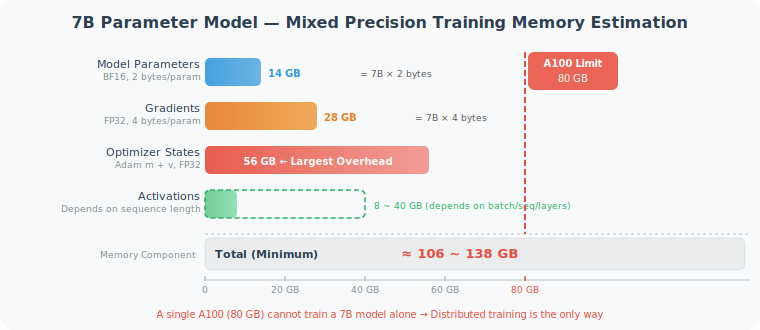
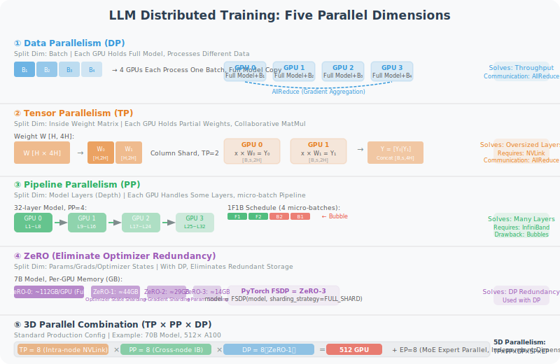
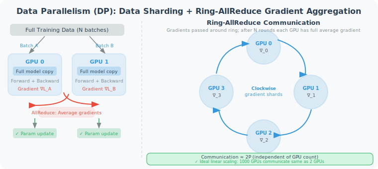
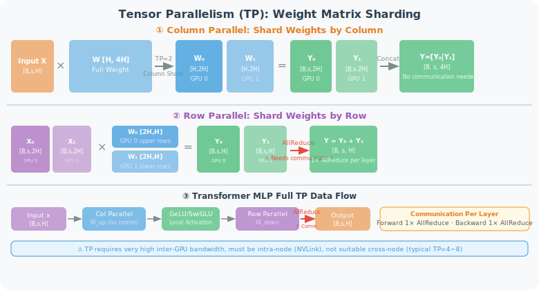
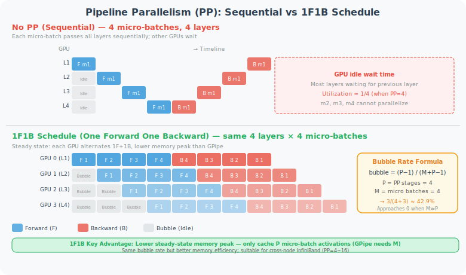
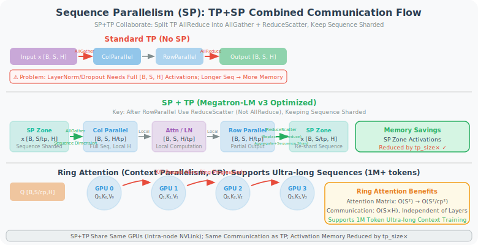
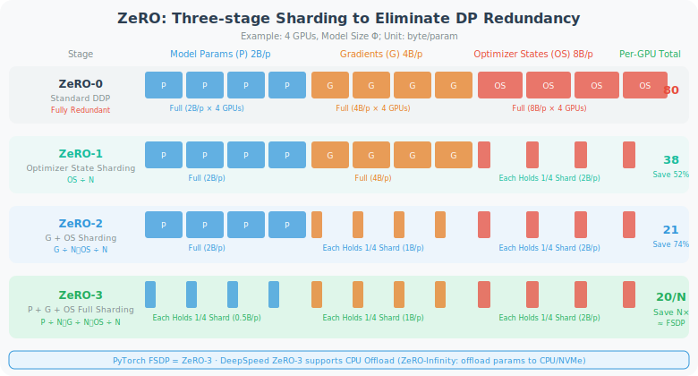
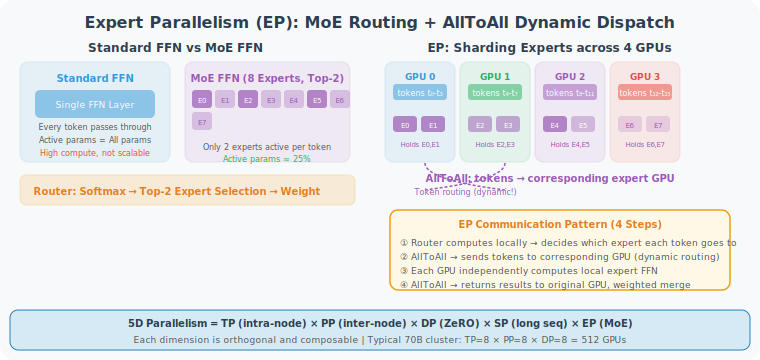
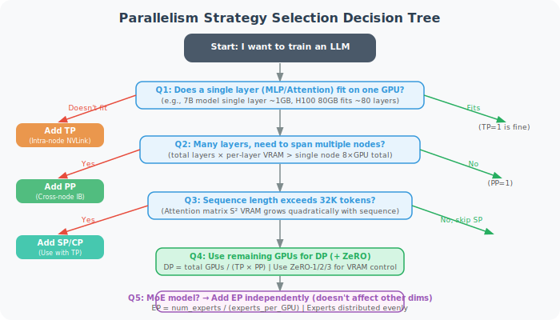

# 11.2b Distributed Training Fundamentals: DP / TP / PP / SP / ZeRO

> 🖥️ *"Training a 70B parameter model — a single A100 (80GB VRAM) simply can't fit it. Even if it could, you'd retire before training finishes. Distributed training isn't a luxury; it's a prerequisite for large models to exist."*

---

## Why Is Distributed Training Necessary?

Before understanding the various parallelism strategies, let's clarify the two core constraints: the **memory wall** and the **compute wall**.

### Memory Wall: One GPU Can't Fit It

Using training a 7B parameter model as an example, in mixed precision training (BF16), GPU memory usage comes from the following parts:



As shown in the diagram, optimizer states (Adam's m + v momentum) are the largest overhead, exceeding the total memory of an A100 on their own. Adding parameters, gradients, and activations, mixed precision training of a 7B model requires **106–138 GB**, far exceeding the 80 GB limit of a single A100.

### Compute Wall: One GPU Can't Wait

Using Llama-3 70B as an example, training on 1T tokens requires approximately $6 \times N_{params} \times N_{tokens}$ floating point operations:

$$\text{FLOP} = 6 \times 70 \times 10^9 \times 10^{12} = 4.2 \times 10^{23}$$

A single A100 (312 TFLOPS) would need:

$$t = \frac{4.2 \times 10^{23}}{3.12 \times 10^{14}} \approx 1.35 \times 10^9 \text{ seconds} \approx \textbf{42.8 years}$$

A cluster of 1,000 A100s still needs **15 days** — this is the actual time scale of real training.

Distributed training solves both problems simultaneously by distributing computation and storage across multiple GPUs.

---

## Overview of Five Parallelism Dimensions

Modern LLM training uses up to 5 parallelism dimensions simultaneously, each targeting a different axis of the computation graph:



| Parallelism Strategy | Full Name | Abbreviation | Split Dimension | Core Problem Solved |
|---------------------|-----------|-------------|-----------------|---------------------|
| Data Parallelism | Data Parallelism | **DP** | Batch dimension | Training speed (throughput) |
| Tensor Parallelism | Tensor Parallelism | **TP** | Weight matrix dimension | Single layer parameters too large |
| Pipeline Parallelism | Pipeline Parallelism | **PP** | Model layer (depth) dimension | Too many layers |
| Sequence Parallelism | Sequence Parallelism | **SP** | Sequence length dimension | Long sequence activations too large |
| Expert Parallelism | Expert Parallelism | **EP** | MoE expert count dimension | Too many experts in MoE models |

ZeRO is an **optimizer state sharding** technique used with DP; strictly speaking it's not a new parallelism dimension, but it's critical for memory optimization.

---

## I. Data Parallelism (DP / DDP)

### Core Idea

Data parallelism is the simplest and most commonly used parallelism strategy: **each GPU holds a complete model replica but processes different data subsets**, then aggregates gradients to update parameters.



As shown on the left side of the diagram, each GPU has a complete model replica, performs forward + backward computation on different batches, then aggregates averaged gradients via AllReduce to synchronously update all replicas' parameters. The right side shows **Ring-AllReduce** communication — GPUs are arranged in a ring, gradient fragments are passed along the ring, and each GPU's communication volume is independent of the number of GPUs, achieving near-linear scaling.

### DDP vs DP

PyTorch provides two data parallelism implementations:

```python
import torch
import torch.nn as nn
from torch.nn.parallel import DistributedDataParallel as DDP
from torch.nn.parallel import DataParallel as DP

# ─── Method 1: DataParallel (DP) — single machine multi-GPU, simple but has bottlenecks ───
# Problem: master GPU (GPU 0) is responsible for aggregating gradients, becomes communication bottleneck
# Problem: uneven memory usage across GPUs (master GPU bears more load)
model = MyModel().cuda()
model = DataParallel(model, device_ids=[0, 1, 2, 3])
output = model(input)   # Automatically distributes batch to each GPU

# ─── Method 2: DistributedDataParallel (DDP) — Recommended! ───
# Advantage: each GPU independently computes gradients, Ring-AllReduce communicates evenly
# Advantage: supports multi-machine multi-GPU, better linear scalability
import torch.distributed as dist

def setup(rank, world_size):
    dist.init_process_group("nccl", rank=rank, world_size=world_size)

def train_ddp(rank, world_size, model, dataset):
    setup(rank, world_size)
    
    # Each process holds one model copy
    model = model.to(rank)
    model = DDP(model, device_ids=[rank])
    
    # DistributedSampler ensures each process sees different data
    sampler = torch.utils.data.DistributedSampler(
        dataset, num_replicas=world_size, rank=rank
    )
    loader = DataLoader(dataset, sampler=sampler, batch_size=64)
    
    optimizer = torch.optim.AdamW(model.parameters(), lr=1e-4)
    
    for batch in loader:
        optimizer.zero_grad()
        loss = model(batch)
        loss.backward()          # DDP automatically triggers AllReduce during backward
        optimizer.step()
```

### AllReduce: Communication Algorithm for Gradient Aggregation

The core operation of DDP is **Ring-AllReduce** (shown on the right side of the diagram above): each GPU passes its gradient fragment along the ring step by step; after 2(N-1) rounds of communication, each GPU has the complete averaged gradient. The key property is that **communication volume is independent of the number of GPUs** — even with 1,000 GPUs, each GPU's communication volume is still approximately 2× the parameter count, achieving ideal linear scaling.

### Limitations of DP

**Memory problem**: each GPU must store complete model parameters + gradients + optimizer states. For a 70B model, even with DP=1000, each GPU still needs 100GB+. This led to the development of ZeRO (see below).

**Effective batch size**: `global_batch_size = local_batch_size × world_size`. With DP=1000, the effective batch may be too large, causing training instability; needs to be combined with **Gradient Accumulation**:

```python
# Gradient Accumulation: simulate large batch without increasing actual batch size
accumulation_steps = 8  # Accumulate 8 mini-batches before updating

for step, batch in enumerate(loader):
    loss = model(batch) / accumulation_steps  # Scale loss
    loss.backward()                            # Accumulate gradients
    
    if (step + 1) % accumulation_steps == 0:
        optimizer.step()                       # Update every 8 steps
        optimizer.zero_grad()
```

---

## II. Tensor Parallelism (TP)

### Core Idea

Tensor parallelism splits a **single weight matrix** across GPUs; each GPU holds only a portion of the matrix and computes matrix multiplication in parallel.

This is the core technique proposed by Megatron-LM [1], specifically targeting the two dense layers of Transformers:



As shown in the diagram, TP has two splitting methods:

- **Column Parallel**: split weight W by columns; each GPU independently computes local output, then Concat at the end — **no communication needed in forward pass**.
- **Row Parallel**: split weight by rows while also splitting input; each GPU independently computes then AllReduce sums — **1 AllReduce needed in forward pass**.

The actual Transformer MLP layer consists of "column parallel + activation function + row parallel" (see data flow at bottom of diagram), requiring 2 AllReduces per layer (1 forward + 1 backward).

**Column Parallel Linear concept:**
- Weight W [H, 4H] split by columns into W₀ [H, 2H] and W₁ [H, 2H]
- GPU 0 computes Y₀ = X × W₀, GPU 1 computes Y₁ = X × W₁
- Output Concat: Y = [Y₀ | Y₁] [B, s, 4H]

**Row Parallel Linear concept:**
- Weight W [4H, H] split by rows, input also split accordingly
- GPU 0: X₀ × W₀ = Y₀, GPU 1: X₁ × W₁ = Y₁
- AllReduce: Y = Y₀ + Y₁ [B, s, H]

### TP Decomposition of MLP Layer

```python
# TP decomposition of standard FFN layer (Megatron-LM style)
class ColumnParallelLinear(nn.Module):
    """
    Weight split by columns:
    W_full [H, 4H] → each GPU holds W_local [H, 4H/tp_size]
    """
    def __init__(self, in_features, out_features, tp_size):
        super().__init__()
        self.tp_size = tp_size
        # Each GPU only holds 1/tp_size of the columns
        self.weight = nn.Parameter(
            torch.randn(in_features, out_features // tp_size)
        )
    
    def forward(self, x):
        # Local matrix multiplication, no communication needed
        return F.linear(x, self.weight)  # [B, s, out/tp]


class RowParallelLinear(nn.Module):
    """
    Weight split by rows:
    W_full [4H, H] → each GPU holds W_local [4H/tp_size, H]
    Input x is also local (output from ColumnParallel)
    """
    def __init__(self, in_features, out_features, tp_size):
        super().__init__()
        self.tp_size = tp_size
        self.weight = nn.Parameter(
            torch.randn(in_features // tp_size, out_features)
        )
    
    def forward(self, x):
        # Local matrix multiplication
        local_output = F.linear(x, self.weight)  # [B, s, H]
        # AllReduce to aggregate partial results from all GPUs
        dist.all_reduce(local_output, op=dist.ReduceOp.SUM)
        return local_output


class TensorParallelMLP(nn.Module):
    """
    Complete MLP TP implementation:
    FFN(x) = GeLU(x @ W_up) @ W_down
    
    Communication pattern:
    Input x → [AllGather] → Column parallel W_up → Row parallel W_down → [AllReduce] → Output
    Total: 1 AllGather + 1 AllReduce in forward
           1 AllGather + 1 AllReduce in backward
    """
    def __init__(self, hidden_size, ffn_size, tp_size):
        super().__init__()
        self.up_proj = ColumnParallelLinear(hidden_size, ffn_size, tp_size)
        self.down_proj = RowParallelLinear(ffn_size, hidden_size, tp_size)
    
    def forward(self, x):
        return self.down_proj(F.gelu(self.up_proj(x)))
```

### TP for Attention Layers

Multi-head attention (MHA) TP is more natural — split directly by **attention heads**:

```python
# Attention TP: each GPU handles some attention heads
class TensorParallelAttention(nn.Module):
    """
    Assuming n_heads=32, TP=4:
    Each GPU handles 8 heads
    
    Q, K, V projections: column parallel (output split)
    Output projection: row parallel (input split + AllReduce)
    """
    def __init__(self, d_model, n_heads, tp_size):
        super().__init__()
        self.local_heads = n_heads // tp_size       # Number of heads per GPU
        self.head_dim = d_model // n_heads
        local_d = self.local_heads * self.head_dim  # KQV dimension for this GPU
        
        # Column parallel: each GPU only holds partial Q/K/V projections
        self.qkv_proj = ColumnParallelLinear(d_model, 3 * local_d, tp_size=1)
        # Row parallel: aggregate attention outputs from each GPU
        self.out_proj = RowParallelLinear(local_d, d_model, tp_size)
```

### Applicable Scenarios and Limitations of TP

| Feature | Description |
|---------|-------------|
| **Communication volume** | 2 AllReduces per layer (1 forward + 1 backward) |
| **Communication latency** | High — must wait for communication to complete before continuing each layer (synchronous) |
| **Recommended GPU connection** | **Must be within the same node** (NVLink); cross-node bandwidth too low |
| **Suitable for** | Single layer parameters too large (MLP layer 4H×H weights) |
| **Not suitable for** | Many layers but each not large; cross-node scaling |
| **Typical scale** | TP=4~8 (within a single 8-GPU server) |

---

## III. Pipeline Parallelism (PP)

### Core Idea

Pipeline parallelism splits the model **by layers**, with different GPUs responsible for different layer groups, processing in parallel like a factory assembly line:



As shown in the diagram, without PP most GPUs are idle waiting; the 1F1B schedule lets each GPU alternately execute forward and backward in the steady state, significantly improving utilization. The bubble rate formula is:

$$\text{bubble} = \frac{P-1}{M+P-1}$$

Where P is PP_stages (number of pipeline stages) and M is the number of micro-batches. **When M ≫ P, the bubble rate approaches zero**.

### Bubble (Pipeline Bubble) Problem

The biggest challenge of pipeline parallelism is **bubbles** — idle time when GPUs wait for the previous stage's output:

```python
# GPipe scheduling strategy (naive PP)
class GPipe:
    """
    Each micro-batch completes full forward propagation before backward propagation
    Bubble rate = (PP_stages - 1) / (micro_batches + PP_stages - 1)
    
    When micro_batches >> PP_stages, bubble rate → 0
    But too many micro_batches increases memory (need to cache all activations)
    """
    def __init__(self, stages=4, micro_batches=8):
        self.stages = stages
        self.micro_batches = micro_batches
        self.bubble_rate = (stages - 1) / (micro_batches + stages - 1)
        print(f"Bubble rate: {self.bubble_rate:.1%}")  # stages=4, m=8 → 27.3%
```

**1F1B scheduling** (proposed by Megatron-LM, superior):

The core improvement of 1F1B is **lower peak memory** — it only needs to cache `stages` micro-batches' activations (while GPipe needs to cache all M), so it saves more memory at the same bubble rate. See the scheduling comparison in the Gantt chart above.

```python
class OneFOneB:
    """
    1F1B scheduling core idea:
    In steady state, each time step is 1 forward + 1 backward
    Avoids GPipe's need to cache all micro-batch activations
    """
    def schedule(self, num_stages, num_micro_batches):
        """
        Returns the execution sequence for each stage
        F = Forward, B = Backward
        Numbers represent micro-batch IDs
        """
        schedule = {stage: [] for stage in range(num_stages)}
        
        # Warmup phase: first PP_stages micro-batches do forward only
        for stage in range(num_stages):
            for mb in range(num_stages - stage):
                schedule[stage].append(f"F{mb}")
        
        # Steady state: each GPU alternates 1F1B
        # ...（see Megatron-LM source code for actual implementation）
        
        return schedule
```

### Applicable Scenarios and Limitations of PP

| Feature | Description |
|---------|-------------|
| **Communication volume** | Only passes activations between adjacent stages (point-to-point, low communication) |
| **Communication latency** | Relatively low (P2P communication) |
| **Recommended GPU connection** | Suitable for **cross-node** (100Gbps IB is sufficient) |
| **Suitable for** | Many model layers, each layer not too large |
| **Disadvantages** | Pipeline bubbles; complex debugging; high implementation difficulty |
| **Typical scale** | PP=4~16 (multi-machine multi-GPU) |

---

## IV. Sequence Parallelism (SP)

### Core Idea

Sequence Parallelism splits along the **sequence length dimension**, primarily solving the problem of **activation memory explosion with long sequences**.

In standard Transformers, activation memory usage has a quadratic relationship with sequence length (attention matrix $S \times S$); when sequence length grows from 2K to 128K, this is a fatal bottleneck.



As shown in the diagram, SP+TP splits the standard TP's AllReduce into AllGather + ReduceScatter, keeping the sequence in a sharded state in the SP region (LayerNorm, Dropout, etc.), thereby reducing activation memory at these positions by `tp_size` times. The Ring Attention (Context Parallelism) shown at the bottom of the diagram can further reduce attention matrix memory from $O(S^2)$ to $O(S^2/cp^2)$, supporting ultra-long context training exceeding 1M tokens.

### SP + TP Combination (Megatron-LM v3)

SP is usually used **in combination with TP** (within the same group of GPUs), jointly reducing activations (complete data flow already shown in the diagram above).

**Key optimization**: replacing TP's AllReduce with ReduceScatter + AllGather combination can maintain sharding in the sequence dimension, reducing activation memory by 50%.

```python
# SP+TP communication pattern (comparison)
class SequenceParallelism:
    """
    Standard TP communication:
      Forward: AllGather(x) → ColParallel → RowParallel + AllReduce
      Backward: AllReduce(∇) → RowParallel → ColParallel + AllGather
    
    SP+TP communication (activations always maintain sequence sharding):
      Forward: AllGather(x) → ColParallel → RowParallel + ReduceScatter
      Backward: AllGather(∇) → RowParallel → ColParallel + ReduceScatter
    
    Memory savings: activations in sequence parallel regions (Dropout, LayerNorm) reduced by tp_size times
    Communication volume: same as standard TP (AllGather ≈ AllReduce communication volume)
    """
    pass
```

### Context Parallelism (CP): Ring Attention

When sequence length exceeds what SP can handle (e.g., 1M tokens), there's a more aggressive approach — **Context Parallelism**:

```python
# Ring Attention (core of CP)
# Split Q/K/V along sequence dimension,
# implement distributed attention computation via Ring communication

class RingAttention:
    """
    Core idea:
    - Each GPU has a segment of complete Q [B, S/cp, H]
    - K/V circulate between GPUs via Ring communication
    - Each GPU completes partial attention computation locally
    - Final merge gives complete attention output
    
    Communication volume: O(S/cp × H × cp) = O(S × H), independent of layer count
    Memory: attention matrix reduced from O(S²) to O(S²/cp²)
    
    Typical applications: Apple MLX, Google JAX ultra-long context training
    """
    def forward(self, q, k, v, cp_group):
        S_local = q.shape[1]  # S / cp
        output = torch.zeros_like(q)
        
        # Local K/V
        k_local = k.clone()
        v_local = v.clone()
        
        for step in range(self.cp_size):
            # Compute attention for current K/V block
            attn_out = flash_attn(q, k_local, v_local, causal=(step == 0))
            output += attn_out
            
            # Pass K/V to next GPU via Ring
            k_local = self.ring_send_recv(k_local, cp_group)
            v_local = self.ring_send_recv(v_local, cp_group)
        
        return output
```

---

## V. ZeRO: Eliminating Optimizer Redundancy

### Problem Source

In standard DDP, each GPU stores **complete**:
- Model parameters: FP16, 2 bytes/param
- Gradients: FP32, 4 bytes/param
- Optimizer states: Adam needs m + v, FP32, 8 bytes/param

Total approximately **16 bytes/param**. For a 70B model = **1,120 GB**; even with 1,000 A100s, each GPU still needs >1GB, but the real problem is **each GPU stores completely identical optimizer states** — this is enormous redundancy!

### ZeRO Three Stages

**ZeRO (Zero Redundancy Optimizer)** was proposed by Microsoft DeepSpeed [2], eliminating redundancy through sharding:



As shown in the diagram, ZeRO progressively shards in three stages, gradually eliminating redundancy in optimizer states, gradients, and model parameters:

| Stage | Sharded Content | Memory per GPU (N=4) | Savings |
|-------|----------------|---------------------|---------|
| ZeRO-0 (DDP) | No sharding | 80 B/param | — |
| ZeRO-1 | Optimizer states | ~38 B/param | 52% |
| ZeRO-2 | + Gradients | ~21 B/param | 74% |
| ZeRO-3 | + Model parameters | 80/N B/param | N× |

$$\text{ZeRO-3 memory per GPU} = \frac{16 \text{ bytes/param}}{N_{\text{GPUs}}}$$

Training a 70B model with 1,000 A100s: ~1.12GB per GPU — easily fits!

```python
# Training with DeepSpeed ZeRO
import deepspeed

# ZeRO Stage configuration
ds_config = {
    "zero_optimization": {
        "stage": 3,                      # ZeRO-3: full sharding
        "offload_optimizer": {
            "device": "cpu",             # Optional: offload optimizer states to CPU
            "pin_memory": True,
        },
        "offload_param": {
            "device": "cpu",             # Optional: offload parameters to CPU (ZeRO-Infinity)
        },
        "overlap_comm": True,            # Overlap communication with computation
        "contiguous_gradients": True,    # Contiguous memory improves communication efficiency
        "sub_group_size": 1e9,
        "reduce_bucket_size": 5e8,
    },
    "bf16": {"enabled": True},
    "gradient_checkpointing": True,
}

# Initialize DeepSpeed engine
model_engine, optimizer, _, _ = deepspeed.initialize(
    model=model,
    config=ds_config,
)

# Training loop is almost identical to standard PyTorch
for batch in dataloader:
    loss = model_engine(batch)
    model_engine.backward(loss)    # Replaces loss.backward()
    model_engine.step()            # Replaces optimizer.step()
```

### ZeRO++ and ZeRO-Infinity

**ZeRO++ (2023)** further compresses communication volume on top of ZeRO-3:
- **qwZ (quantized weights)**: quantize FP16 to INT8 during AllGather, reducing communication volume by 50%
- **hpZ (hierarchical partitioning)**: prioritize intra-node partitioning to reduce cross-node traffic
- **qgZ (quantized gradients)**: quantize before ReduceScatter to further reduce bandwidth requirements

**ZeRO-Infinity** offloads parameters/gradients/optimizer states to CPU RAM or NVMe SSD, theoretically enabling training of arbitrarily large models, but speed is limited by PCIe bandwidth; suitable for "large model + few GPUs" research scenarios.

### FSDP (PyTorch Native ZeRO)

PyTorch 2.0+ has built-in **Fully Sharded Data Parallel (FSDP)**, which is the native implementation of ZeRO-3:

```python
from torch.distributed.fsdp import (
    FullyShardedDataParallel as FSDP,
    MixedPrecision,
    BackwardPrefetch,
    ShardingStrategy,
)

# FSDP configuration
fsdp_config = dict(
    sharding_strategy=ShardingStrategy.FULL_SHARD,    # ZeRO-3 equivalent
    # ShardingStrategy.SHARD_GRAD_OP = ZeRO-2
    # ShardingStrategy.NO_SHARD = standard DDP
    
    mixed_precision=MixedPrecision(
        param_dtype=torch.bfloat16,
        reduce_dtype=torch.float32,
        buffer_dtype=torch.bfloat16,
    ),
    backward_prefetch=BackwardPrefetch.BACKWARD_PRE,  # Prefetch next layer parameters
    cpu_offload=None,  # or CPUOffload(offload_params=True)
    auto_wrap_policy=lambda module, recurse, *args: (
        recurse or isinstance(module, TransformerDecoderLayer)
    ),
)

model = FSDP(model, **fsdp_config)
```

---

## VI. Expert Parallelism (EP)

EP is specifically for **MoE (Mixture of Experts)** models, such as Mixtral, DeepSeek-V3, etc.

### MoE Review



As shown on the left side of the diagram, standard FFN uses the same FFN for every token; MoE FFN sets up multiple experts, and each token only passes through K of them (Top-K routing), greatly increasing parameter count without increasing activation computation. DeepSeek-V3 uses 256 experts, activating 8 per token, with 671B total parameters but ~37B activated.

### EP Splitting Method

As shown on the right side of the diagram, EP assigns different experts to different GPUs (with 256 experts and EP=8 as an example, each GPU holds 32 experts). The biggest challenge is that **MoE routing is dynamic** — which expert each token goes to is decided at runtime, requiring two AllToAll communications (distribute tokens → compute → collect results).

```python
class ExpertParallelMoE(nn.Module):
    """
    Expert parallel MoE layer
    
    Communication pattern:
    1. Router decides which expert each token goes to (local computation)
    2. AllToAll: send tokens to corresponding GPUs
    3. Each GPU independently computes FFN for its experts
    4. AllToAll: send results back to original GPUs
    5. Merge expert outputs
    """
    def __init__(self, d_model, n_experts, n_experts_per_token, ep_group):
        super().__init__()
        self.ep_group = ep_group
        self.ep_size = dist.get_world_size(ep_group)
        self.local_n_experts = n_experts // self.ep_size
        
        # Each GPU only holds local_n_experts experts
        self.experts = nn.ModuleList([
            MLP(d_model) for _ in range(self.local_n_experts)
        ])
        self.router = Router(d_model, n_experts, n_experts_per_token)
    
    def forward(self, x):
        B, S, D = x.shape
        x_flat = x.view(-1, D)  # [B*S, D]
        
        # 1. Routing computation (local)
        expert_indices, expert_weights = self.router(x_flat)
        
        # 2. AllToAll: distribute tokens to corresponding GPUs
        x_dispatched = self.all_to_all_dispatch(x_flat, expert_indices)
        
        # 3. Local expert computation
        expert_outputs = []
        for i, expert in enumerate(self.experts):
            # Get tokens assigned to this GPU's i-th expert
            tokens_for_expert = x_dispatched[i]
            if tokens_for_expert.shape[0] > 0:
                expert_outputs.append(expert(tokens_for_expert))
        
        # 4. AllToAll: send results back to original GPUs
        combined = self.all_to_all_combine(expert_outputs)
        
        # 5. Weighted merge
        return self.weighted_sum(combined, expert_weights)
```

---

## VII. 3D / 4D / 5D Parallelism: Combined Usage

Production training typically uses multiple parallelism strategies simultaneously, known as **3D/4D/5D parallelism**:

- **3D parallelism** = TP × PP × DP (Megatron-LM's classic scheme)
- **4D parallelism** = TP × PP × DP × SP (adding sequence parallelism)
- **5D parallelism** = TP × PP × DP × SP × EP (adding expert parallelism, for MoE models)

**Configuration example** (Llama-3 70B on 512 H100s): TP=8 (intra-node NVLink) × PP=8 (cross-node InfiniBand) × DP=8 (ZeRO-1) = 512 GPUs.

### Rules of Thumb for Choosing Parallelism Strategies



Following the decision tree: **determine TP first** (can a single layer fit?), **then PP** (cross-node needed?), **then SP** (sequence > 32K?), **give remaining GPUs to DP**, and MoE independently adds EP.

```python
# Actual configuration example (reference Megatron-LM and LLaMA-Factory)
training_config = {
    # Parallelism dimensions
    "tensor_model_parallel_size": 4,      # TP=4 (4 GPUs within a node)
    "pipeline_model_parallel_size": 4,    # PP=4 (across 4 nodes)
    "data_parallel_size": 16,             # DP=16 (total 256 GPUs / TP4 / PP4)
    "sequence_parallel": True,            # Used with TP
    
    # ZeRO configuration
    "zero_stage": 1,                      # Usually only ZeRO-1 needed in PP+TP mode
    
    # Batch configuration
    "global_batch_size": 2048,
    "micro_batch_size": 2,               # Each GPU processes 2 samples at a time
    "gradient_accumulation_steps": 64,   # 2048 / (2 × 16) = 64
    
    # Sequence length
    "seq_length": 8192,
    
    # Mixed precision
    "bf16": True,
    "fp32_residual_connection": False,
}
```

### Communication Volume Comparison

| Strategy | Communication Operation | Volume | Latency Sensitivity | Recommended Network |
|----------|------------------------|--------|---------------------|---------------------|
| DP | AllReduce | 2P (parameter count) | Low | Ethernet / IB |
| TP | AllReduce / AllGather | 2 × activations/layer | **High** | NVLink (intra-node) |
| PP | P2P Send/Recv | activations × B/S | Medium | IB |
| SP | AllGather / ReduceScatter | Same as TP | High | NVLink (intra-node) |
| ZeRO-3 | AllGather (forward) + ReduceScatter (backward) | 3P (more) | Low | IB |

---

## VIII. Gradient Checkpointing

This is not a parallelism strategy, but it's inseparable from distributed training — it's an important technique for **trading computation for memory**:

```python
# Standard training: retain all activations (memory O(layers × S × H))
output = model(input)
loss = criterion(output, target)
loss.backward()  # Uses activations saved during forward pass

# Gradient checkpointing: only retain some activations, recompute during backward
from torch.utils.checkpoint import checkpoint

def forward_with_checkpointing(model, input):
    """
    Don't save intermediate activations; recompute forward once during backward propagation
    
    Memory savings: from O(L × S × H) → O(√L × S × H)
    Compute overhead: ~30% increase (equivalent to one extra forward pass)
    """
    # Enable checkpointing for each Transformer layer
    for layer in model.layers:
        # Don't save layer's activations
        input = checkpoint(layer, input, use_reentrant=False)
    return input

# Enable in Hugging Face Transformers
from transformers import LlamaForCausalLM

model = LlamaForCausalLM.from_pretrained("meta-llama/Llama-3-8B")
model.gradient_checkpointing_enable()  # One line, saves ~50% memory
```

---

## Comprehensive Comparison and Selection Recommendations

### Recommended Configurations for Different Model Scales

| Model Scale | GPU Count | Recommended Config | Typical Framework |
|-------------|-----------|-------------------|------------------|
| 1B~7B | 1~8 GPUs | DP + ZeRO-2/3 | DeepSpeed, FSDP |
| 7B~13B | 8~32 GPUs | DP/ZeRO-3 + GradCkpt | FSDP, LLaMA-Factory |
| 13B~70B | 32~256 GPUs | TP=4 + PP=2 + DP + ZeRO-1 | Megatron-LM |
| 70B~400B | 256~1024 GPUs | TP=8 + PP=4~8 + DP + ZeRO-1 | Megatron-LM |
| 400B~1T (MoE) | 512~8192 GPUs | TP=8 + PP=8 + EP=8 + DP + ZeRO-1 | Megatron-Core |

### Comparison of Mainstream Training Frameworks

| Framework | Supported Parallelism | Suitable Scenarios | Ease of Use |
|-----------|----------------------|-------------------|-------------|
| **DeepSpeed** | DP+ZeRO, PP, TP (limited) | Small-medium models, resource-constrained | ⭐⭐⭐⭐ |
| **PyTorch FSDP** | DP+ZeRO-3 | Medium scale, PyTorch native | ⭐⭐⭐⭐ |
| **Megatron-LM** | TP+PP+SP+DP+ZeRO | Ultra-large scale pre-training | ⭐⭐ |
| **LLaMA-Factory** | Wraps FSDP/DeepSpeed | SFT/RL fine-tuning | ⭐⭐⭐⭐⭐ |
| **Axolotl** | Wraps FSDP/DeepSpeed | SFT fine-tuning | ⭐⭐⭐⭐ |

---

## Section Summary

| Technology | Split Dimension | Problem Solved | Key Constraint |
|-----------|----------------|----------------|----------------|
| **DP / DDP** | Batch | Throughput | Each GPU needs complete model |
| **ZeRO-1/2/3** | Optimizer/gradient/parameters | Memory redundancy under DP | Increased communication volume |
| **FSDP** | Parameters+gradients+optimizer | PyTorch native ZeRO-3 | Multiple AllGather overhead |
| **TP** | Inside weight matrices | Single layer too large | Requires NVLink high bandwidth |
| **PP** | Model layers (depth) | Too many layers | Pipeline bubbles |
| **SP** | Sequence length | Long sequence activations | Used with TP |
| **CP / Ring Attn** | Ultra-long sequences | Million-token attention | Attention computation splitting |
| **EP** | MoE experts | Expert parameter distribution | AllToAll dynamic routing |

> 💡 **Core takeaway for Agent developers**:  
> If you're fine-tuning models with LLaMA-Factory or Axolotl, **FSDP (ZeRO-3) + Gradient Checkpointing** is the optimal choice for small teams — supports training 70B models with up to 8 GPUs.  
> If you're designing pre-training from scratch, you need to carefully plan the combination of 3D parallelism (TP × PP × DP).

---

## References

[1] SHOEYBI M, et al. Megatron-LM: training multi-billion parameter language models using model parallelism[J]. arXiv:1909.08053, 2019.

[2] RAJBHANDARI S, et al. ZeRO: memory optimizations toward training trillion parameter models[C]//SC, 2020.

[3] KORTHIKANTI V, et al. Reducing activation recomputation in large Transformer models[J]. arXiv:2205.05198, 2022. (SP original paper)

[4] LIU Z, et al. Ring attention with blockwise transformers for near-infinite context[J]. arXiv:2310.01889, 2023. (Ring Attention)

[5] Microsoft DeepSpeed Team. ZeRO++: extremely efficient collective communication for giant model training[J]. arXiv:2306.10209, 2023.

[6] ZHAO Y, et al. PyTorch FSDP: experiences on scaling fully sharded data parallel[J]. arXiv:2304.11277, 2023.

---

*Previous section: [11.2 SFT + LoRA Basic Training](./02_sft_lora.md)*  
*Next section: [11.3 PPO: Proximal Policy Optimization](./03_ppo.md)*
