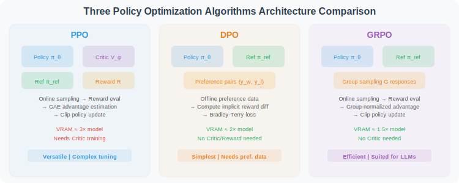
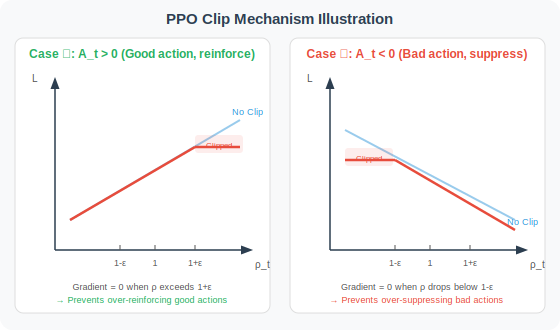
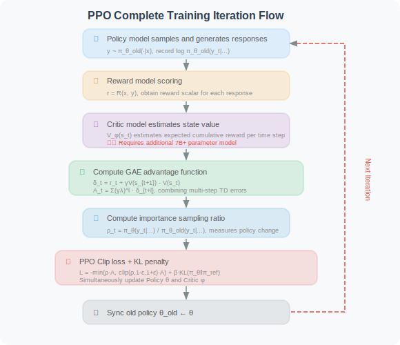
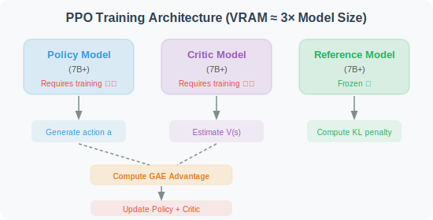

# 11.3 PPO: Proximal Policy Optimization

In [Section 11.1](./01_agentic_rl_overview.md), we introduced the two-phase training paradigm of Agentic-RL (SFT → RL). The core question in the RL phase is: **how do we update model parameters based on reward signals?** This is exactly the problem that policy optimization algorithms solve.

This section will systematically explain the **PPO (Proximal Policy Optimization) algorithm** from scratch — it is the core training algorithm of InstructGPT and ChatGPT, and the foundation for understanding the subsequent DPO and GRPO algorithms. We will start from the most basic intuition, gradually derive the mathematical formulas, and use extensive diagrams to aid understanding.



## Prerequisites: The Basic Idea of Policy Gradients

Before diving into the three algorithms, we need to understand a common starting point — **Policy Gradient** [1].

### Core Intuition

Imagine you're practicing basketball free throws. After each shot, you get feedback: made it (reward +1) or missed (reward 0). The idea behind policy gradients is extremely simple:

> **If an action received a high reward, increase the probability of that action; if it received a low reward, decrease the probability of that action.**

Formally, the policy gradient theorem gives the gradient direction as:

$$\nabla_\theta J(\theta) = \mathbb{E}_{\tau \sim \pi_\theta} \left[ \sum_{t=0}^{T} \nabla_\theta \log \pi_\theta(a_t | s_t) \cdot R(\tau) \right]$$

Let's **break down this formula term by term**, using a concrete language model example to aid understanding.

---

#### ① $\nabla_\theta J(\theta)$ — "Which direction should I adjust the parameters?"

- $J(\theta)$ is our **overall objective**: the expected cumulative reward of the model across all possible inputs. The larger $J$, the better the model's overall performance
- $\nabla_\theta$ is the gradient with respect to model parameters $\theta$ (i.e., the billions of weight values in the model)
- $\nabla_\theta J(\theta)$ is a vector with the same dimension as $\theta$, **telling us: if we nudge each parameter slightly in which direction, $J$ will increase fastest**
- During training, we do: $\theta \leftarrow \theta + \alpha \cdot \nabla_\theta J(\theta)$ ($\alpha$ is the learning rate), i.e., "climbing uphill" along the gradient direction

> **Analogy**: You're standing blindfolded on a hillside; the gradient is "the steepest uphill direction under your feet." Each step (one parameter update) brings you a little closer to the summit (maximum reward).

---

#### ② $\nabla_\theta \log \pi_\theta(a_t | s_t)$ — "How should I adjust parameters to make this action more likely?"

This is the most central and hardest-to-understand part of the formula; let's explain it in layers:

**Layer 1: What is $\pi_\theta(a_t | s_t)$?**

$\pi_\theta$ is our language model. Given the current state $s_t$ (conversation history + already-generated tokens), it outputs a probability distribution representing "what is the probability of the next token." For example:

| Next token ($a_t$) | Probability $\pi_\theta(a_t \| s_t)$ |
|-------------------|--------------------------------------|
| "search" | 0.35 |
| "answer" | 0.25 |
| "calculate" | 0.20 |
| "I" | 0.10 |
| ... | ... |

$\pi_\theta(\text{"search"} | s_t) = 0.35$ means: in the current context, the model thinks the probability of outputting "search" next is 35%.

**Layer 2: Why take the logarithm of $\pi_\theta(a_t | s_t)$?**

Taking the logarithm has two benefits:
1. **Numerical stability**: probability values are between 0 and 1; multiplying many token probabilities together becomes extremely small (e.g., $0.35 \times 0.20 \times 0.15 = 0.0105$); taking the log converts it to addition ($\log 0.35 + \log 0.20 + \log 0.15 = -4.56$), avoiding numerical underflow
2. **Clean gradient form**: $\nabla_\theta \log f(\theta) = \frac{\nabla_\theta f(\theta)}{f(\theta)}$; this ratio form is exactly what we need

**Layer 3: What exactly is $\nabla_\theta \log \pi_\theta(a_t | s_t)$?**

This is called the **score function**. It is a vector with the same dimension as model parameters $\theta$, indicating:

> **"If we want the probability of action $a_t$ in state $s_t$ to increase, which direction should each model parameter be adjusted?"**

- It doesn't directly change the probability; it gives a **direction**
- Adjusting parameters in this direction → $\pi_\theta(a_t | s_t)$ increases (this action becomes more likely)
- Adjusting parameters in the opposite direction → $\pi_\theta(a_t | s_t)$ decreases (this action becomes less likely)

> **Analogy**: The score function is like the "steering wheel" for action $a_t$ — turning it can increase or decrease the probability of this action being selected. But having a steering wheel alone isn't enough; you also need to know **how much to turn** — that's the role of $R(\tau)$ below.

---

#### ③ $R(\tau)$ — "How much should I turn the steering wheel?"

$R(\tau) = \sum_{t=0}^{T} r_t$ is the **cumulative reward** of the entire trajectory (the complete interaction from start to finish), serving as a **weight**:

- **$R(\tau) > 0$ (positive reward)**: the trajectory performed well overall
  - Gradient = positive weight × score function → update in the score function direction → **increase** the probability of each action in the trajectory
  - Intuition: this performance was good; do more of the same next time
  
- **$R(\tau) < 0$ (negative reward)**: the trajectory performed poorly overall
  - Gradient = negative weight × score function → update in the **opposite** direction of the score function → **decrease** the probability of each action in the trajectory
  - Intuition: this performance was bad; avoid doing the same next time

- **$R(\tau) = 0$ (zero reward)**: this trajectory contributes nothing to the gradient

- **Larger $|R(\tau)|$**: larger weight; this trajectory has more influence on parameter updates. More extreme rewards/penalties → deeper model "memory"

> **Analogy**: $R(\tau)$ is like a coach's score. The score function points the steering wheel; $R(\tau)$ determines how far to turn. Coach gives a high score ($R > 0$) → turn hard toward "increase this action's probability"; coach gives a low score ($R < 0$) → turn hard toward "decrease this action's probability."

---

#### ④ $\sum_{t=0}^{T}$ — "Calculate for every step in the trajectory"

A trajectory contains $T+1$ time steps (from $t=0$ to $t=T$), each with a $(s_t, a_t)$ pair. The summation means: **every step's score function is weighted by the same $R(\tau)$**.

In language models, one step = generating one token. If the model generates a 50-token response, $T = 49$, and the generation probability of each of these 50 tokens will be updated weighted by the same total reward.

> **Note**: This is actually a rough approach — using the total reward of the entire trajectory to weight each step. If the first 30 tokens of a trajectory are correct reasoning and the last 20 tokens are wrong conclusions, they're all treated equally by the total reward. This is the **"credit assignment problem"** — PPO's advantage function $A_t$ is specifically designed to solve this (see §1.3).

---

#### ⑤ $\mathbb{E}_{\tau \sim \pi_\theta}$ — "Average over many attempts"

$\mathbb{E}$ is the **expectation operator**; $\tau \sim \pi_\theta$ means trajectory $\tau$ is randomly sampled according to policy $\pi_\theta$.

- Because language model generation is **stochastic** (via temperature sampling), the same input may produce different outputs
- Each sample gives a trajectory $\tau$, corresponding to an $R(\tau)$ value
- Expectation is the **weighted average over all possible trajectories** — higher-probability trajectories have larger weights

**In practice**: we can't enumerate all possible trajectories (the output space of language models is astronomically large), so we use **Monte Carlo approximation** — sample $N$ trajectories and take the average as an estimate of the expectation:

$$\nabla_\theta J(\theta) \approx \frac{1}{N} \sum_{n=1}^{N} \left[ \sum_{t=0}^{T} \nabla_\theta \log \pi_\theta(a_t^{(n)} | s_t^{(n)}) \cdot R(\tau^{(n)}) \right]$$

Larger $N$ gives more accurate estimates but higher computational cost. This is the essence of batch size in training.

---

#### Complete Example: One Policy Gradient Update for a Language Model Agent

Suppose we're training an Agent that can call a search tool, and the user asks "What's the weather in Beijing today?"

**Sampling two trajectories:**

| | Trajectory A (good response) | Trajectory B (bad response) |
|---|---|---|
| $s_0$ | User: "What's the weather in Beijing today?" | User: "What's the weather in Beijing today?" |
| $a_0$ | `<think>` | `<think>` |
| $a_1$ | Need to query real-time weather | I'll just answer directly |
| $a_2$ | `</think>` | `</think>` |
| $a_3$ | `<tool_call>search("Beijing weather")</tool_call>` | Beijing is sunny today, 25°C |
| ... | (gives accurate answer after getting results) | (made up, possibly completely wrong) |
| $R(\tau)$ | **+0.8** (called tool, answer accurate) | **-0.2** (didn't call tool, answer wrong) |

**Gradient update effects:**

- **Trajectory A** ($R = +0.8$): the model will **increase** the probability of the action sequence "encounter real-time info question → call search tool"
- **Trajectory B** ($R = -0.2$): the model will **decrease** the probability of the action sequence "encounter real-time info question → make up an answer directly"

After thousands of such updates, the model gradually learns: **when encountering questions requiring real-time information, it should call a tool first rather than fabricating an answer.**

---

### Deficiencies of Raw Policy Gradients

Although the intuition is clear, raw policy gradients have two serious problems:

| Problem | Manifestation | Consequence |
|---------|--------------|-------------|
| **High variance** | $R(\tau)$ may vary enormously across different trajectories | Gradient estimates are unstable; training converges extremely slowly |
| **Uncontrolled step size** | No constraint on the size of single-step updates | One "big jump" can destroy the entire policy |

**PPO, DPO, and GRPO each solve these two problems in different ways.** This section explains PPO in detail; DPO and GRPO will be introduced in [11.4](./04_dpo.md) and [11.5](./05_grpo.md) respectively.

---

### 1.1 What Problem Does PPO Solve?

PPO [2] is a policy optimization algorithm proposed by OpenAI in 2017, and is the core training algorithm of InstructGPT [3] and ChatGPT. PPO's design goal is:

> **While ensuring training stability, utilize sampled data as efficiently as possible to update the policy.**

PPO achieves this through two key mechanisms:
1. **Importance sampling**: allows using data collected by the "old policy" to train the "current policy" (data reuse)
2. **Clip**: limits the step size of policy updates to prevent policy collapse

### 1.2 Importance Sampling Ratio $\rho_t$: The Core of Off-Policy Training

In policy gradients, we need to sample trajectories from the current policy $\pi_\theta$ to compute gradients. But if we resample after every parameter update, efficiency is extremely low. **Importance sampling** allows us to use samples from the old policy $\pi_{\theta_{old}}$ to estimate the gradient of the new policy $\pi_\theta$.

The core is introducing the **importance sampling ratio**:

$$\rho_t = \frac{\pi_\theta(a_t | s_t)}{\pi_{\theta_{old}}(a_t | s_t)}$$

Term-by-term interpretation:

- **Numerator** $\pi_\theta(a_t | s_t)$: probability of the current policy choosing action $a_t$ in state $s_t$
- **Denominator** $\pi_{\theta_{old}}(a_t | s_t)$: probability of the old policy (at sampling time) choosing that action
- $\rho_t = 1$: current and old policies have identical preference for this action
- $\rho_t > 1$: current policy favors this action more than the old policy ("current policy thinks this action got better")
- $\rho_t < 1$: current policy favors this action less than the old policy ("current policy thinks this action got worse")
- $\rho_t = 2$: current policy's probability of choosing this action is 2× the old policy's

**Intuition for importance sampling**: suppose the old policy sampled an action with probability 10% ($\pi_{old} = 0.1$), while the current policy thinks that action's probability should be 30% ($\pi_\theta = 0.3$), so $\rho = 3$. This means if we use the old policy's data to estimate the new policy's expectation, each such data point should be given 3× weight — because the new policy "should have" sampled it more frequently.

### 1.3 Advantage Function $A_t$: Judging Whether an Action Is "Good or Bad"

In policy gradients, using cumulative reward $R(\tau)$ as a weight leads to high variance. The **Advantage Function** solves this by introducing a baseline:

$$A_t = Q(s_t, a_t) - V(s_t)$$

- $Q(s_t, a_t)$: expected cumulative reward after executing action $a_t$ in state $s_t$ (**action value**)
- $V(s_t)$: expected cumulative reward from following the current policy in state $s_t$ (**state value**, i.e., the "baseline")
- $A_t > 0$: action $a_t$ is better than "average" → should be **reinforced**
- $A_t < 0$: action $a_t$ is worse than "average" → should be **suppressed**
- $A_t = 0$: action $a_t$ is at the average level → no adjustment needed

**Why does subtracting a baseline reduce variance?** A vivid analogy: suppose you scored 85 on an exam. If the class average is 60, you'd feel "did well" ($A = +25$); if the class average is 90, you'd feel "underperformed" ($A = -5$). **Converting absolute scores to relative scores eliminates the interference of score scale**, making the signal more stable.

### 1.4 GAE: Generalized Advantage Estimation

In actual training, neither $Q(s_t, a_t)$ nor $V(s_t)$ is precisely known; they need to be estimated using a **Critic model** $V_\phi(s)$. **GAE (Generalized Advantage Estimation)** [4] is a method that fuses multi-step estimates, achieving a balance between bias and variance:

$$A_t^{GAE} = \sum_{l=0}^{T-t} (\gamma \lambda)^l \delta_{t+l}$$

Where the **TD error (Temporal Difference Error)** is defined as:

$$\delta_t = r_t + \gamma V_\phi(s_{t+1}) - V_\phi(s_t)$$

Term-by-term interpretation of TD error:

- $r_t$: immediate reward actually received at time step $t$
- $\gamma V_\phi(s_{t+1})$: Critic's value estimate for the next state, multiplied by discount factor $\gamma$
- $V_\phi(s_t)$: Critic's value estimate for the current state
- **Intuition**: $\delta_t$ measures the difference between "what actually happened" ($r_t + \gamma V_\phi(s_{t+1})$) and "what the Critic expected" ($V_\phi(s_t)$). If $\delta_t > 0$, the actual result exceeded expectations (surprise!); $\delta_t < 0$ means the actual result fell short of expectations (disappointment!)

Term-by-term interpretation of GAE:

- $(\gamma\lambda)^l$: **exponential decay weight** — the further the time step, the smaller its contribution to the current advantage
- $\lambda \in [0, 1]$: **GAE trade-off parameter**, controls the bias-variance trade-off:

| $\lambda$ value | GAE degenerates to | Bias | Variance | Intuition |
|----------------|-------------------|------|----------|-----------|
| $\lambda = 0$ | Single-step TD: $A_t = \delta_t$ | High (fully depends on Critic accuracy) | Low | Only looks at one step's "surprise" |
| $\lambda = 1$ | Monte Carlo: $A_t = \sum_l \gamma^l \delta_{t+l}$ | Low (uses complete trajectory) | High | Looks at complete trajectory performance |
| $\lambda = 0.95$ | **Recommended value** | Moderate | Moderate | Balances near-term and long-term information |

> **📌 Key issue**: GAE requires a Critic model $V_\phi(s)$ to estimate state values. For large language models (e.g., 7B parameters), this means **needing to load an additional Critic model of equivalent scale** — this is PPO's biggest resource bottleneck in large model training.

### 1.5 PPO Clip Mechanism: The "Safety Rope" for Policy Updates

With advantage $A_t$ and ratio $\rho_t$, PPO's loss function is:

$$\mathcal{L}_{PPO}(\theta) = -\mathbb{E}_t \left[ \min\left( \rho_t A_t,\ \text{clip}(\rho_t, 1-\epsilon, 1+\epsilon) A_t \right) \right]$$

This formula looks complex, but the core idea is simple. Let's understand it in two cases:

**Case ①: $A_t > 0$ (good action, should be reinforced)**

- Without Clip: the larger $\rho_t$ (i.e., the more we increase this action's probability), the smaller the loss → gradient pushes the policy to keep increasing this action's probability
- With Clip: once $\rho_t$ exceeds $1+\epsilon$, $\text{clip}(\rho_t) \cdot A_t$ no longer increases → $\min$ takes the clipped value → **gradient becomes zero**
- **Effect**: even if an action is good, its probability is not allowed to increase too much (prevents "overconfidence")

**Case ②: $A_t < 0$ (bad action, should be suppressed)**

- Without Clip: the smaller $\rho_t$ (i.e., the more we decrease this action's probability), the smaller the loss → gradient pushes the policy to greatly decrease this action's probability
- With Clip: once $\rho_t$ falls below $1-\epsilon$, **gradient becomes zero**
- **Effect**: even if an action is bad, its probability is not allowed to decrease too much (prevents "overcorrection")



**Meaning of Clip parameter $\epsilon$**: $\epsilon$ (typically 0.1–0.3) defines the size of the "trust region" — in each policy update, the probability change of each action must not exceed $(1 \pm \epsilon)$ times the old policy. Smaller $\epsilon$ is more conservative; larger $\epsilon$ is more aggressive.

### 1.6 KL Divergence Penalty: Another Safety Net Against Policy "Drift"

The Clip mechanism limits the magnitude of probability change for **individual actions**, but it cannot constrain the drift of the policy's **overall distribution**. In RLHF scenarios, if the model "forgets" the general language capabilities learned during SFT (such as grammar, coherence) in pursuit of high rewards, **language degeneration** or **reward hacking** occurs — the model finds some "clever" output pattern to trick the reward model into giving high scores, but the output is incomprehensible to humans.

For this reason, PPO in RLHF typically adds an additional **KL divergence penalty term**; the complete optimization objective becomes:

$$\mathcal{L}_{PPO-RLHF}(\theta) = -\mathbb{E}_t \left[ \min\left( \rho_t A_t,\ \text{clip}(\rho_t, 1-\epsilon, 1+\epsilon) A_t \right) \right] + \beta \cdot D_{KL}\left(\pi_\theta \| \pi_{ref}\right)$$

Where KL divergence is defined as:

$$D_{KL}\left(\pi_\theta \| \pi_{ref}\right) = \mathbb{E}_{y \sim \pi_\theta} \left[ \log \frac{\pi_\theta(y|x)}{\pi_{ref}(y|x)} \right]$$

Term-by-term interpretation:

- $\pi_{ref}$: **Reference Policy** — see dedicated explanation below
- $D_{KL}(\pi_\theta \| \pi_{ref})$: measures the **distributional divergence** of the current policy $\pi_\theta$ relative to the reference policy $\pi_{ref}$. $D_{KL} = 0$ means they're completely identical; larger $D_{KL}$ means more severe divergence
- $\beta$: **KL penalty coefficient** — controls the balance between "exploring new strategies" and "maintaining existing capabilities"

#### What Is the Reference Model ($\pi_{ref}$)?

The reference model is a very important concept in RLHF and GRPO; beginners often confuse it with the "old policy" ($\pi_{\theta_{old}}$). Let's use a table to completely clarify:

| | **Reference Model $\pi_{ref}$** | **Old Policy $\pi_{\theta_{old}}$** |
|---|---|---|
| **What it is** | Snapshot of the SFT model **before** RL training starts | Snapshot of the policy model at the **start** of the current RL iteration |
| **When created** | When RL training starts, copy a snapshot of the SFT model | Before sampling new data each time, copy the current Policy model |
| **Whether updated** | ❌ **Never updated** (frozen parameters) | ✅ Updated once per iteration (synchronized to current policy) |
| **Purpose** | Serves as an "anchor" to prevent policy from drifting too far from SFT | Provides the denominator for importance sampling (data reuse) |
| **Scope** | Entire RL training process | Only valid within the current iteration |
| **Used in** | KL divergence penalty $D_{KL}(\pi_\theta \| \pi_{ref})$ | Importance sampling ratio $\rho_t = \pi_\theta / \pi_{\theta_{old}}$ |

**Vivid analogy**:

> Imagine you're learning to drive (RL training). The driving instructor taught you the basics (SFT); now you're practicing on the road.
>
> - **Reference model** = the standard operating procedures in the instructor's manual. No matter how long you practice, the manual never changes. Its role: if your driving habits deviate too far from the standard (e.g., you start "speeding"), it pulls you back.
> - **Old policy** = your driving skill level at the end of your last practice session. After each practice, your skill improves a little. Its role: evaluate what changed in this practice session compared to last time.

**Why is the Reference Model needed?**

During RL training, the model continuously iterates and updates. Without a Reference model as an anchor, the following problems may occur:

1. **Reward Hacking**: the model discovers some "clever" output pattern that tricks the reward model into giving high scores (e.g., repeatedly outputting a high-reward phrase), but actual output quality is terrible
2. **Language Degeneration**: the model loses the grammar ability, coherence, and general knowledge learned during SFT in pursuit of rewards
3. **Mode Collapse**: the model generates similar "safe" answers for all inputs, losing diversity

KL divergence $D_{KL}(\pi_\theta \| \pi_{ref})$ is like an "elastic rope" — the further $\pi_\theta$ drifts from $\pi_{ref}$, the larger the penalty, pulling the policy back.

**Timeline of three models during training**:

```
Time →
              RL Iteration 1   RL Iteration 2   RL Iteration 3
              ─────────────   ─────────────   ─────────────
π_ref:     [SFT model] ════════════════════════════════════  (never changes)

π_θ_old:   [SFT model]──→[θ₁]──→[θ₁]──→[θ₂]──→[θ₂]──→[θ₃]  (synced at start of each iteration)
                sample↓      update↑    sample↓      update↑    sample↓
π_θ:       [SFT model]→→→[θ₁]  [θ₁]→→→[θ₂]  [θ₂]→→→[θ₃]    (continuously trained and updated)
```

- Row 1: $\pi_{ref}$ is always the SFT model, unchanged from start to finish
- Row 2: $\pi_{\theta_{old}}$ copies a snapshot from $\pi_\theta$ at the start of each iteration
- Row 3: $\pi_\theta$ is the Policy model continuously trained and updated

> **📌 Implementation detail**: The Reference model needs to occupy separate GPU memory. For a 7B parameter model (bf16), the Reference model takes ~14GB of GPU memory. To save memory, some implementations use LoRA adapters — in this case, the Reference model doesn't need to be loaded separately; just disable the LoRA adapter during inference to get $\pi_{ref}$'s output.

**Role and adjustment of $\beta$**:

| $\beta$ value | Effect | Applicable scenario |
|--------------|--------|---------------------|
| $\beta$ too small (e.g., 0.001) | KL constraint almost ineffective; policy can deviate greatly | Strong exploration, but prone to reward hacking and language degeneration |
| $\beta$ moderate (e.g., 0.01–0.1) | Balances exploration and constraint; recommended starting value | Most RLHF scenarios |
| $\beta$ too large (e.g., 1.0) | Policy can barely deviate from SFT model | RL training is essentially useless |

**Adaptive KL control**: InstructGPT [3] proposed a method for dynamically adjusting $\beta$ — set a target KL value $D_{target}$; if actual $D_{KL}$ exceeds the target, increase $\beta$ (tighten constraint); otherwise decrease $\beta$ (relax constraint):

$$\beta \leftarrow \begin{cases} \beta \times (1 + \alpha) & \text{if } D_{KL} > 1.5 \times D_{target} \\ \beta \times (1 - \alpha) & \text{if } D_{KL} < 0.5 \times D_{target} \\ \beta & \text{otherwise} \end{cases}$$

Where $\alpha$ is the adjustment step size (typically 0.1–0.2). This adaptive mechanism makes training more robust — no need to manually fine-tune $\beta$.

**Synergistic effect of Clip + KL**:

| Constraint mechanism | Constrains | Granularity | Intuition |
|---------------------|-----------|-------------|-----------|
| **Clip** | Probability ratio $\rho_t$ of individual actions | **Local** (per-token level) | "Each step can't go too far" |
| **KL** | Overall output distribution $\pi_\theta$ vs $\pi_{ref}$ | **Global** (policy level) | "The overall direction can't deviate too far" |

The two are complementary: Clip prevents single-step updates from being too large; KL prevents cumulative drift from being too large. In practice, both are typically used simultaneously.

### 1.7 PPO Complete Training Process



PPO training requires maintaining the following models simultaneously:



### 1.8 PPO Core Code Implementation

Below is a complete PyTorch implementation of PPO's core components, helping to understand the meaning of each formula at the code level.

#### 1.8.1 GAE Advantage Estimation

```python
import torch
import torch.nn.functional as F

def compute_gae(
    rewards: torch.Tensor,       # [T] immediate reward at each step
    values: torch.Tensor,        # [T+1] state values estimated by Critic (including terminal state)
    gamma: float = 1.0,          # discount factor (usually 1.0 for language model tasks)
    lam: float = 0.95,           # GAE λ parameter
) -> torch.Tensor:
    """
    Compute GAE (Generalized Advantage Estimation)

    Formula: A_t = Σ (γλ)^l · δ_{t+l}
    where δ_t = r_t + γ·V(s_{t+1}) - V(s_t)

    Args:
        rewards:  immediate reward at each step, shape [T]
        values:   Critic's value estimate for each state, shape [T+1]
                  (last one is the terminal state value, usually 0)
        gamma:    discount factor, controls decay of future rewards
        lam:      GAE λ parameter, controls bias-variance trade-off
                  λ=0 → single-step TD (low variance, high bias)
                  λ=1 → Monte Carlo (high variance, low bias)

    Returns:
        advantages: GAE advantage estimates, shape [T]
    """
    T = len(rewards)
    advantages = torch.zeros(T)
    gae = 0.0  # accumulate backwards from the last step

    for t in reversed(range(T)):
        # TD error: δ_t = r_t + γ·V(s_{t+1}) - V(s_t)
        # "what actually happened" - "what the Critic expected"
        delta = rewards[t] + gamma * values[t + 1] - values[t]

        # GAE recurrence: A_t = δ_t + γλ·A_{t+1}
        # equivalent to A_t = Σ (γλ)^l · δ_{t+l}
        gae = delta + gamma * lam * gae
        advantages[t] = gae

    return advantages
```

#### 1.8.2 PPO Clip Loss

```python
def ppo_clip_loss(
    log_probs: torch.Tensor,         # [B, T] log π_θ(a_t|s_t) of current policy
    old_log_probs: torch.Tensor,     # [B, T] log π_θ_old(a_t|s_t) of old policy
    advantages: torch.Tensor,         # [B, T] GAE advantage estimates
    clip_epsilon: float = 0.2,        # Clip range ε
) -> tuple[torch.Tensor, dict]:
    """
    Compute PPO Clip policy loss

    Formula: L = -E[min(ρ_t·A_t, clip(ρ_t, 1-ε, 1+ε)·A_t)]

    Args:
        log_probs:     log probability of each token under current policy [batch, seq_len]
        old_log_probs: log probability of each token under old policy [batch, seq_len]
        advantages:    advantage value for each token [batch, seq_len]
        clip_epsilon:  clipping range, typically 0.1-0.3

    Returns:
        loss: policy loss scalar
        metrics: monitoring metrics
    """
    # ── Compute importance sampling ratio ────────────────────────────────
    # ρ_t = π_θ(a_t|s_t) / π_θ_old(a_t|s_t)
    # Division in log space = subtraction, then exp back
    ratio = torch.exp(log_probs - old_log_probs)  # [B, T]

    # ── Unclipped objective ──────────────────────────────────────────────
    # ρ_t · A_t
    surr1 = ratio * advantages  # [B, T]

    # ── Clipped objective ────────────────────────────────────────────────
    # clip(ρ_t, 1-ε, 1+ε) · A_t
    clipped_ratio = torch.clamp(ratio, 1.0 - clip_epsilon, 1.0 + clip_epsilon)
    surr2 = clipped_ratio * advantages  # [B, T]

    # ── PPO loss = -min(surr1, surr2) ────────────────────────────────────
    # Taking min ensures:
    #   When A>0: don't let ρ exceed 1+ε (prevent over-reinforcement)
    #   When A<0: don't let ρ fall below 1-ε (prevent over-suppression)
    loss = -torch.min(surr1, surr2).mean()

    # ── Monitoring metrics ───────────────────────────────────────────────
    with torch.no_grad():
        # Clip fraction: proportion of clipped tokens (healthy range 0.1-0.3)
        clip_fraction = ((ratio - 1.0).abs() > clip_epsilon).float().mean().item()
        # Approximate KL divergence (for monitoring policy drift)
        approx_kl = (old_log_probs - log_probs).mean().item()

    metrics = {
        "policy_loss": loss.item(),
        "clip_fraction": clip_fraction,       # > 0.5 indicates update step too large
        "approx_kl": approx_kl,               # > 0.02 may need to reduce learning rate
        "mean_ratio": ratio.mean().item(),     # should be close to 1.0
    }

    return loss, metrics
```

#### 1.8.3 Critic (Value Function) Loss

```python
def critic_loss(
    values: torch.Tensor,        # [B, T] V(s_t) predicted by Critic
    returns: torch.Tensor,       # [B, T] actual returns = advantages + old_values
) -> torch.Tensor:
    """
    Compute Critic loss (mean squared error)

    Critic's goal: make V_ϕ(s_t) as close as possible to actual returns

    Args:
        values:  Critic's value prediction for each state [batch, seq_len]
        returns: actual returns (GAE advantage + old value estimate) [batch, seq_len]

    Returns:
        loss: Critic loss scalar
    """
    return F.mse_loss(values, returns)
```

#### 1.8.4 KL Divergence Penalty

```python
def kl_penalty(
    log_probs: torch.Tensor,     # [B, T] log π_θ of current policy
    ref_log_probs: torch.Tensor, # [B, T] log π_ref of reference policy (SFT model)
) -> torch.Tensor:
    """
    Compute KL divergence between current policy and reference policy

    Formula: D_KL(π_θ ‖ π_ref) = E[log(π_θ/π_ref)]

    Args:
        log_probs:     log probabilities of current policy
        ref_log_probs: log probabilities of reference policy (SFT model, frozen parameters)

    Returns:
        kl: KL divergence scalar
    """
    # KL = E[log π_θ - log π_ref]
    kl = (log_probs - ref_log_probs).mean()
    return kl
```

#### 1.8.5 PPO Complete Training Step

```python
def ppo_training_step(
    policy_model,          # Policy model π_θ (trainable)
    critic_model,          # Critic model V_ϕ (trainable)
    ref_model,             # Reference model π_ref (frozen, not trained)
    input_ids,             # Input token ids
    response_ids,          # Generated response token ids
    old_log_probs,         # Log probabilities of old policy
    rewards,               # Reward signals
    old_values,            # Value estimates from old Critic
    clip_epsilon=0.2,      # PPO Clip ε
    kl_coef=0.01,          # KL penalty coefficient β
    critic_coef=0.5,       # Critic loss weight
    gamma=1.0,             # Discount factor
    lam=0.95,              # GAE λ
):
    """
    Complete process of a single PPO training step

    Total loss = policy loss + β·KL penalty + c·Critic loss
    """
    # ── Step 1: Compute log probabilities of current policy ──────────────
    # Forward pass to get log probabilities of each token under current policy
    logits = policy_model(input_ids=input_ids, response_ids=response_ids)
    log_probs = compute_token_log_probs(logits, response_ids)  # [B, T]

    # ── Step 2: Compute Critic's value estimates ─────────────────────────
    values = critic_model(input_ids=input_ids, response_ids=response_ids)  # [B, T]

    # ── Step 3: Compute GAE advantages ──────────────────────────────────
    # Compute GAE separately for each sample in the batch
    advantages_list = []
    for b in range(rewards.shape[0]):
        adv = compute_gae(rewards[b], old_values[b], gamma=gamma, lam=lam)
        advantages_list.append(adv)
    advantages = torch.stack(advantages_list)  # [B, T]

    # Normalize advantages (reduce variance, stabilize training)
    advantages = (advantages - advantages.mean()) / (advantages.std() + 1e-8)

    # Actual returns = advantages + old value estimates (for training Critic)
    returns = advantages + old_values[:, :-1]

    # ── Step 4: Compute PPO Clip policy loss ─────────────────────────────
    policy_loss, policy_metrics = ppo_clip_loss(
        log_probs, old_log_probs, advantages, clip_epsilon
    )

    # ── Step 5: Compute KL divergence penalty ────────────────────────────
    with torch.no_grad():
        ref_logits = ref_model(input_ids=input_ids, response_ids=response_ids)
        ref_log_probs = compute_token_log_probs(ref_logits, response_ids)
    kl = kl_penalty(log_probs, ref_log_probs)

    # ── Step 6: Compute Critic loss ──────────────────────────────────────
    c_loss = critic_loss(values[:, :-1], returns)

    # ── Step 7: Total loss ───────────────────────────────────────────────
    # Policy loss (make model do the right thing) + KL penalty (don't forget language ability) + Critic loss (learn to evaluate good/bad)
    total_loss = policy_loss + kl_coef * kl + critic_coef * c_loss

    return total_loss, {
        **policy_metrics,
        "kl_divergence": kl.item(),
        "critic_loss": c_loss.item(),
        "total_loss": total_loss.item(),
    }
```

> **📌 Key differences from GRPO code**:
> - PPO needs to additionally maintain a **Critic model** (`critic_model`) of equivalent scale to the Policy model
> - Advantage estimation uses **GAE recurrence** (depends on Critic), not GRPO's within-group normalization
> - Total loss has three parts: policy loss + KL penalty + **Critic loss**, while GRPO has no Critic loss
> - This also explains why PPO's memory requirement is ≈ 3× model size (Policy + Critic + Reference)

### 1.9 Summary of PPO's Advantages and Disadvantages

| Dimension | Assessment |
|-----------|-----------|
| ✅ **Generality** | Applicable to almost all RL scenarios, not limited to language models |
| ✅ **Stability** | Clip mechanism provides reliable training stability guarantees |
| ✅ **Theoretical foundation** | Backed by mature theory (simplification of trust region methods) |
| ❌ **Memory requirements** | Requires Critic model; memory usage ≈ 3× model size |
| ❌ **Training complexity** | Critic and Policy are mutually dependent; joint training is unstable |
| ❌ **Many hyperparameters** | GAE λ, Critic learning rate, clip ε, KL β, etc. all need careful tuning |

---

*PPO is a powerful but resource-intensive algorithm — it requires a Critic model, reward model, and online sampling. The next section will introduce DPO, which through elegant mathematical derivation directly bypasses the reward model and Critic, transforming the RL problem into simple supervised learning.*

---

## References

[1] WILLIAMS R J. Simple statistical gradient-following algorithms for connectionist reinforcement learning[J]. Machine Learning, 1992, 8(3): 229-256.

[2] SCHULMAN J, WOLSKI F, DHARIWAL P, et al. Proximal policy optimization algorithms[R]. arXiv preprint arXiv:1707.06347, 2017.

[3] OUYANG L, WU J, JIANG X, et al. Training language models to follow instructions with human feedback[C]//Advances in Neural Information Processing Systems (NeurIPS). 2022.

[4] SCHULMAN J, MORITZ P, LEVINE S, et al. High-dimensional continuous control using generalized advantage estimation[C]//International Conference on Learning Representations (ICLR). 2016.
