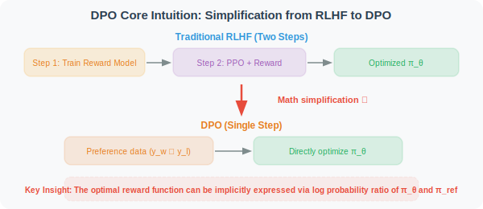
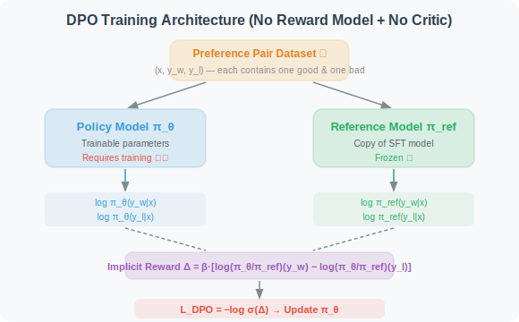

# 11.4 DPO: Direct Preference Optimization

In [Section 11.3](./03_ppo.md), we introduced the PPO algorithm in detail — it requires training a Critic model to estimate the advantage function, and relies on online sampling and a reward model. This makes PPO's training pipeline complex and resource-intensive.

**DPO (Direct Preference Optimization)** [1] proposes an entirely new approach: **directly optimize the policy from human preference data, without a reward model, without a Critic, without online sampling** — cleverly transforming the RL problem into a simple supervised learning problem.

---

### 2.1 DPO's Core Insight

DPO [1] is an algorithm proposed by the Stanford team in 2023. Its core insight can be summarized in one sentence:

> **Since the ultimate goal of RLHF is to make the model's output distribution conform to human preferences, can we skip the two-step process of "train reward model → optimize with PPO" and directly optimize the policy from preference data?**

The answer is — **yes!** DPO proves through an elegant mathematical derivation that the optimal policy of RLHF can be expressed in a **closed-form solution**, thereby transforming the RL problem into a simple **supervised learning** problem.



### 2.2 Mathematical Derivation: From RLHF to DPO

This derivation is the most elegant part of the DPO paper; let's unfold it step by step.

**Step 1: RLHF Optimization Objective**

The standard RLHF optimization objective is:

$$\max_{\pi_\theta} \mathbb{E}_{x \sim \mathcal{D}} \mathbb{E}_{y \sim \pi_\theta(\cdot|x)} \left[ r(x, y) \right] - \beta \cdot D_{KL}\left(\pi_\theta(\cdot|x) \| \pi_{ref}(\cdot|x)\right)$$

Where $r(x, y)$ is the reward model's output, and $\beta$ controls the KL constraint strength.

**Step 2: Derive the Closed-Form Solution for the Optimal Policy**

Solving the above objective (using variational calculus), we can obtain the **closed-form expression** for the optimal policy:

$$\pi^*(y|x) = \frac{1}{Z(x)} \pi_{ref}(y|x) \exp\left(\frac{r(x,y)}{\beta}\right)$$

Where $Z(x) = \sum_y \pi_{ref}(y|x) \exp\left(\frac{r(x,y)}{\beta}\right)$ is the partition function (normalization constant).

Term-by-term interpretation:

- $\pi_{ref}(y|x)$: probability of the reference policy (SFT model) — the optimal policy takes the SFT policy as a "prior"
- $\exp\left(\frac{r(x,y)}{\beta}\right)$: exponential function of reward — high-reward outputs have their probability amplified, low-reward ones are reduced
- $\frac{1}{Z(x)}$: normalization factor — ensures probabilities sum to 1
- $\beta$: **temperature parameter** — smaller $\beta$ concentrates the optimal policy more on high-reward outputs; larger $\beta$ makes it closer to the reference policy
- **Intuition**: optimal policy = reference policy × exponential modulation by reward. Good outputs are amplified, bad outputs are reduced

**Step 3: Reverse-Solve for the Implicit Reward**

From the closed-form solution in Step 2, we can reverse-solve for the reward function:

$$r(x, y) = \beta \log \frac{\pi^*(y|x)}{\pi_{ref}(y|x)} + \beta \log Z(x)$$

This is a key discovery: **rewards can be expressed using the log probability ratio of the policy!** Although we don't know the value of $Z(x)$, it only depends on $x$, not on $y$ — it cancels out when comparing two outputs.

**Step 4: Substitute into the Bradley-Terry Preference Model**

In RLHF, human preference modeling uses the **Bradley-Terry model** [2]:

$$P(y_w \succ y_l | x) = \sigma\left(r(x, y_w) - r(x, y_l)\right)$$

Where $\sigma$ is the sigmoid function, $y_w$ is the preferred (winning) output, and $y_l$ is the non-preferred (losing) output.

Substituting the implicit reward from Step 3, the $\beta \log Z(x)$ term cancels when taking the difference:

$$P(y_w \succ y_l | x) = \sigma\left(\beta \log \frac{\pi_\theta(y_w|x)}{\pi_{ref}(y_w|x)} - \beta \log \frac{\pi_\theta(y_l|x)}{\pi_{ref}(y_l|x)}\right)$$

**Step 5: Obtain the DPO Loss Function**

The final DPO loss function is the negative log-likelihood of the above preference probability:

$$\mathcal{L}_{DPO}(\theta) = -\mathbb{E}_{(x, y_w, y_l) \sim \mathcal{D}} \left[ \log \sigma\left(\beta \left[\log \frac{\pi_\theta(y_w|x)}{\pi_{ref}(y_w|x)} - \log \frac{\pi_\theta(y_l|x)}{\pi_{ref}(y_l|x)} \right] \right) \right]$$

Term-by-term interpretation (from inside out):

- $\log \frac{\pi_\theta(y_w|x)}{\pi_{ref}(y_w|x)}$: **implicit reward of good output** — log probability ratio of the current policy relative to the reference policy for "good output." Larger value → current policy prefers good output more
- $\log \frac{\pi_\theta(y_l|x)}{\pi_{ref}(y_l|x)}$: **implicit reward of bad output** — same, but for "bad output"
- $\Delta = \beta \cdot [\text{implicit reward of good output} - \text{implicit reward of bad output}]$: **implicit reward margin**. We want $\Delta > 0$ and as large as possible
- $\sigma(\Delta)$: maps reward margin to a probability in [0, 1]
- $-\log \sigma(\Delta)$: negative log-likelihood loss. Larger $\Delta$ → smaller loss
- $\mathbb{E}_{(x, y_w, y_l) \sim \mathcal{D}}$: expectation over the preference dataset

**One-sentence summary**: DPO teaches the model to "give higher implicit rewards to good outputs and lower implicit rewards to bad outputs" — without explicitly training a reward model, and without online sampling.

### 2.3 DPO Training Architecture



DPO training only requires:
1. **Policy model $\pi_\theta$**: trainable parameters (initialized from SFT model)
2. **Reference model $\pi_{ref}$**: frozen copy of the SFT model, used to compute log probability ratios
3. **Preference dataset $\mathcal{D}$**: each data point contains (input $x$, good output $y_w$, bad output $y_l$)

**Not needed**:
- ❌ Reward model
- ❌ Critic model
- ❌ Online sampling (completely offline training)

### 2.4 DPO Code Implementation

```python
import torch
import torch.nn.functional as F

def dpo_loss(
    policy_chosen_logps: torch.Tensor,    # log probability of π_θ(y_w|x) [batch]
    policy_rejected_logps: torch.Tensor,  # log probability of π_θ(y_l|x) [batch]
    ref_chosen_logps: torch.Tensor,       # log probability of π_ref(y_w|x) [batch]
    ref_rejected_logps: torch.Tensor,     # log probability of π_ref(y_l|x) [batch]
    beta: float = 0.1,                    # temperature parameter
) -> tuple[torch.Tensor, dict]:
    """
    Compute DPO loss function
    
    Core formula:
    L = -log σ(β · [log(π_θ/π_ref)(y_w) - log(π_θ/π_ref)(y_l)])
    
    Args:
        policy_chosen_logps:   log probabilities of current policy for good outputs
        policy_rejected_logps: log probabilities of current policy for bad outputs
        ref_chosen_logps:      log probabilities of reference policy for good outputs
        ref_rejected_logps:    log probabilities of reference policy for bad outputs
        beta: temperature parameter, controls scaling of log probability difference
    
    Returns:
        loss: scalar loss value
        metrics: monitoring metrics dictionary
    """
    # ── Compute implicit rewards ──────────────────────────────────────────
    # Implicit reward of good output: log(π_θ/π_ref)(y_w)
    chosen_rewards = policy_chosen_logps - ref_chosen_logps      # [batch]
    
    # Implicit reward of bad output: log(π_θ/π_ref)(y_l)
    rejected_rewards = policy_rejected_logps - ref_rejected_logps # [batch]
    
    # ── Compute implicit reward margin ────────────────────────────────────
    # Δ = β · [implicit reward of good output - implicit reward of bad output]
    reward_margin = beta * (chosen_rewards - rejected_rewards)    # [batch]
    
    # ── DPO loss = -log σ(Δ) ─────────────────────────────────────────────
    loss = -F.logsigmoid(reward_margin).mean()
    
    # ── Monitoring metrics ────────────────────────────────────────────────
    metrics = {
        "loss": loss.item(),
        "chosen_rewards": chosen_rewards.mean().item(),
        "rejected_rewards": rejected_rewards.mean().item(),
        "reward_margin": reward_margin.mean().item(),
        # Accuracy: proportion where implicit reward margin > 0
        # (proportion where model correctly distinguishes good from bad outputs)
        "accuracy": (reward_margin > 0).float().mean().item(),
    }
    
    return loss, metrics
```

### 2.5 Deep Understanding: The Relationship Between DPO and KL Divergence

At this point, you might have a question: **does DPO's loss still contain KL divergence?** After all, in PPO, KL divergence appears as an explicit penalty term.

**Short answer: DPO's final loss function has no explicit KL divergence term, but KL divergence has been implicitly "absorbed" into the mathematical structure of the loss.**

#### KL Divergence Appears at the "Starting Point" of the Derivation

Recalling Step 1, DPO's derivation starts from the standard RLHF optimization objective:

$$\max_{\pi_\theta} \mathbb{E}\left[ r(x, y) \right] - \beta \cdot D_{KL}\left(\pi_\theta \| \pi_{ref}\right)$$

Here **there is indeed an explicit KL divergence penalty term** $D_{KL}(\pi_\theta \| \pi_{ref})$, which constrains the current policy from deviating too far from the reference policy. This is the same thing as PPO's KL penalty.

#### KL Divergence Is "Digested" During the Derivation

The elegance of DPO lies in: through the mathematical derivation from Step 2 → Step 5, the KL-constrained RLHF objective is **transformed** into a pure supervised learning loss. In the final DPO loss:

- ❌ **No explicit KL divergence term** (unlike PPO which adds $-\beta \cdot D_{KL}$ to the loss)
- ✅ **KL constraint is implicitly encoded in $\log \frac{\pi_\theta}{\pi_{ref}}$** — the log probability ratio $\log \frac{\pi_\theta(y|x)}{\pi_{ref}(y|x)}$ is itself a component of KL divergence

#### Why Is KL Divergence "Implicitly Included"?

KL divergence is defined as:

$$D_{KL}(\pi_\theta \| \pi_{ref}) = \mathbb{E}_{y \sim \pi_\theta}\left[\log \frac{\pi_\theta(y|x)}{\pi_{ref}(y|x)}\right]$$

The core term in DPO loss $\log \frac{\pi_\theta(y|x)}{\pi_{ref}(y|x)}$ is exactly the **integrand** of KL divergence. Therefore:

| | PPO | DPO |
|---|---|---|
| **KL divergence** | Added to loss as an **explicit penalty term** | **Implicitly encoded** in the log probability ratio, no extra computation needed |
| **Reference policy $\pi_{ref}$** | Optional (can use Clip only) | Required (core component of the loss) |
| **Role of $\beta$** | Controls weight of KL penalty | Controls scaling of implicit reward margin (essentially the same) |

#### Intuitive Understanding

> **PPO says**: "First compute the reward, then use KL divergence as a brake to prevent drift." → Needs reward model + explicit KL computation
> 
> **DPO says**: "I directly merge reward and KL constraint into one formula, using the log probability ratio to simultaneously encode 'what is good' and 'don't drift too far.'" → One step

### 2.6 Summary of DPO's Advantages and Disadvantages

| Dimension | Assessment |
|-----------|-----------|
| ✅ **Minimal architecture** | No reward model or Critic model needed; memory ≈ 2× model size |
| ✅ **Training stability** | Essentially supervised learning; no RL-specific instability |
| ✅ **Easy to implement** | Core code under 20 lines; only one hyperparameter $\beta$ |
| ❌ **Requires preference data** | Depends on high-quality $(y_w, y_l)$ preference pairs; annotation cost is high |
| ❌ **Offline limitation** | Completely offline training; cannot leverage online exploration to discover new strategies |
| ❌ **Limited generalization** | Can only learn "good" patterns already in preference data; hard to exceed data ceiling |

> **📌 Core difference between DPO and PPO**
> 
> - PPO is **online RL**: the model generates and learns simultaneously, able to explore behavior patterns not seen in the data
> - DPO is **offline supervised learning**: only learns from existing preference pairs; cannot exceed data quality
> 
> This means: **if the task requires the model to emerge entirely new reasoning strategies (like DeepSeek-R1's long-chain reasoning), DPO is not the best choice; but if high-quality preference data is already available, DPO is the simplest and most efficient alignment solution.**

---

*DPO greatly simplifies the RLHF pipeline, but it is completely offline — unable to discover new strategies not present in the training data through online exploration. The next section will introduce GRPO, which combines PPO's online exploration capability with lower resource consumption than PPO, and is the core training algorithm of DeepSeek-R1.*

---

## Common Interview Questions

### Basic Understanding

**1. What is the most fundamental simplification of DPO compared to PPO? How does it avoid training a reward model and Critic model?**

> **Key points**: DPO uses a key mathematical derivation — deriving the closed-form solution for the optimal policy from the RLHF optimization objective, then implicitly representing the reward function using the policy's log probability ratio. After substituting this implicit reward into the Bradley-Terry preference model, the partition function $Z(x)$ cancels when taking the difference, ultimately yielding a supervised learning loss that only depends on policy probabilities and reference policy probabilities. Therefore, no explicit reward model training is needed, and no Critic or online sampling is required.

**2. Please fully derive the five-step process of the DPO loss function and explain the core role of each step.**

> **Key points**:
> - **Step 1**: Write the standard RLHF optimization objective (maximize reward - KL penalty)
> - **Step 2**: Use variational calculus to solve for the optimal policy closed-form solution $\pi^*(y|x) \propto \pi_{ref}(y|x) \exp(r(x,y)/\beta)$
> - **Step 3**: Reverse-solve for reward from the closed-form solution $r(x,y) = \beta \log \frac{\pi^*(y|x)}{\pi_{ref}(y|x)} + \beta \log Z(x)$; key discovery: reward can be expressed using log probability ratio
> - **Step 4**: Substitute into Bradley-Terry model; $Z(x)$ term cancels when $r(x,y_w) - r(x,y_l)$ takes the difference
> - **Step 5**: Take negative log-likelihood to get the final DPO loss

### Deep Understanding

**3. Does DPO's loss actually contain KL divergence? If there's no explicit KL term, how does it constrain the policy from deviating too far from the reference model?**

> **Key points**: DPO loss has **no explicit KL divergence term**, but KL divergence is implicitly encoded in the log probability ratio $\log \frac{\pi_\theta(y|x)}{\pi_{ref}(y|x)}$ — this is exactly the integrand of KL divergence. Intuitively, DPO merges reward and KL constraint into the same formula: the log probability ratio simultaneously encodes "what is good" and "don't drift too far." The $\beta$ parameter controls the strength of this constraint — larger $\beta$ makes the policy tend to stay closer to the reference model.

**4. What is the role of the $\beta$ parameter in DPO? What problems arise when $\beta$ is too large or too small?**

> **Key points**:
> - $\beta$ is the temperature parameter, controlling the scaling of the implicit reward margin; it is essentially equivalent to the KL penalty coefficient in PPO
> - $\beta$ **too small** (e.g., 0.01): the loss has extremely high discrimination for preference pairs, potentially causing overfitting to noisy preferences in training data, training instability
> - $\beta$ **too large** (e.g., above 1.0): the policy can barely deviate from the reference model, equivalent to RL training having no effect, policy update magnitude is extremely small
> - Typically recommended $\beta \in [0.1, 0.5]$

**5. Why is DPO considered "offline"? What fundamental limitation does this bring? In what scenarios is this limitation acceptable?**

> **Key points**:
> - DPO completely relies on offline preference data $(x, y_w, y_l)$; no new sampling is done during training
> - **Fundamental limitation**: cannot discover new behavior patterns not present in training data through online exploration; model capability is bounded by the quality and coverage of preference data
> - **Acceptable scenarios**: scenarios where high-quality preference data already exists (e.g., human-annotated instruction-following preference pairs), alignment tasks where sufficient good/bad sample comparison data is available
> - **Not suitable scenarios**: tasks requiring the model to emerge entirely new reasoning strategies (e.g., DeepSeek-R1's long-chain reasoning); these require online RL (PPO/GRPO)

**6. Why is the Reference model needed in DPO? If the Reference model is removed (setting $\pi_{ref}$ to uniform distribution), what does DPO degenerate into?**

> **Key points**:
> - The Reference model is one of the core components of DPO loss; $\log \frac{\pi_\theta}{\pi_{ref}}$ provides the computation baseline for implicit rewards
> - If $\pi_{ref}$ is uniform distribution, $\log \pi_{ref}$ is a constant that cancels when taking the difference between good and bad outputs; DPO loss degenerates to: $-\log\sigma(\beta \cdot [\log\pi_\theta(y_w|x) - \log\pi_\theta(y_l|x)])$, becoming a pure log probability ranking loss, losing the KL constraint effect, easily causing model language capability degeneration

**7. If there is annotation noise in preference data (i.e., $y_w$ and $y_l$ are labeled backwards), how is DPO affected? Compared to PPO, how sensitive is DPO to data quality?**

> **Key points**:
> - DPO will directly learn that "bad output is good," because it completely relies on preference labels for supervised learning, with no online error-correction mechanism
> - In contrast, PPO has some noise robustness through online sampling and reward model — even if the reward model has bias, online exploration can help the policy find truly high-reward behaviors
> - DPO's sensitivity to data quality is far higher than PPO's; this is also why industry typically applies strict quality control to preference data

**8. In DPO's code implementation, what are the physical meanings of `chosen_rewards` and `rejected_rewards`? What trend should the `accuracy` metric show during training?**

> **Key points**:
> - `chosen_rewards = policy_chosen_logps - ref_chosen_logps`: the implicit reward (log probability ratio) of the current policy relative to the reference policy for "good output"
> - `rejected_rewards = policy_rejected_logps - ref_rejected_logps`: same, for "bad output"
> - `reward_margin = β × (chosen_rewards - rejected_rewards)`: implicit reward margin; we want it > 0 and gradually increasing
> - `accuracy` (proportion where reward_margin > 0): should gradually rise from the initial value (~0.5) to close to 1.0, indicating the model is increasingly able to correctly distinguish good from bad outputs. If accuracy doesn't rise for a long time, training is ineffective; if it's 1.0 from the start, the task is too simple

---

## References

[1] RAFAILOV R, SHARMA A, MITCHELL E, et al. Direct preference optimization: Your language model is secretly a reward model[C]//Advances in Neural Information Processing Systems (NeurIPS). 2023.

[2] BRADLEY R A, TERRY M E. Rank analysis of incomplete block designs: I. The method of paired comparisons[J]. Biometrika, 1952, 39(3/4): 324-345.

[3] OUYANG L, WU J, JIANG X, et al. Training language models to follow instructions with human feedback[C]//Advances in Neural Information Processing Systems (NeurIPS). 2022.
