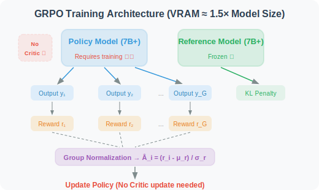
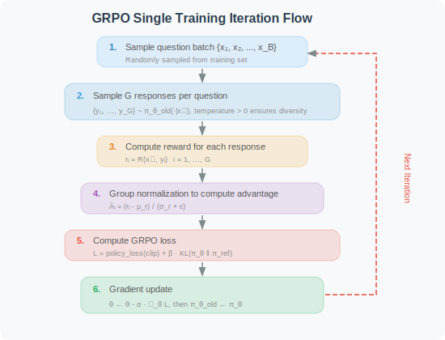
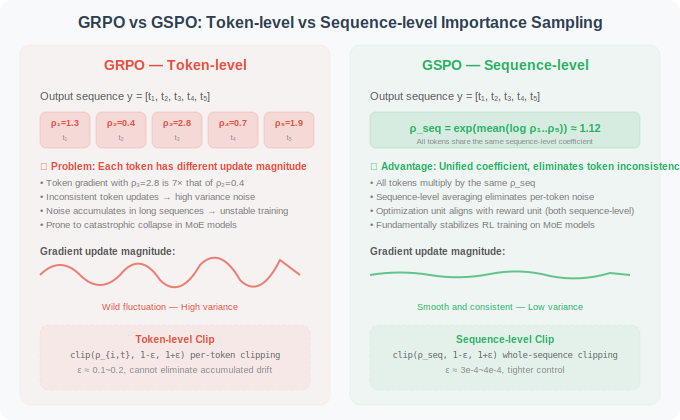

# 11.5 GRPO/GSPO: Group Relative Policy Optimization and Reward Function Design

In [Section 11.3](./03_ppo.md) and [Section 11.4](./04_dpo.md), we introduced PPO and DPO respectively. PPO requires an additional Critic model (high memory usage), while DPO is simple but completely offline (cannot explore new strategies).

**GRPO (Group Relative Policy Optimization)** [1] is an algorithm tailor-made by the DeepSeek team for large model RL training. It replaces the Critic model through **within-group sampling comparison**, significantly reducing resource consumption while maintaining online exploration capability. **GSPO (Group Sequence Policy Optimization)** [10] is an improvement by Alibaba's Qwen team on top of GRPO, which resolves training stability issues for large-scale models (especially MoE architectures) by elevating the optimization granularity from token-level to sequence-level. This section also introduces the core driving force behind both algorithms — **reward function design** — because the reward function defines "what constitutes good Agent behavior" and directly determines training effectiveness.

---

### 3.1 GRPO's Core Insight

GRPO [1] is an algorithm tailor-made by the DeepSeek team for large model RL training. Its core insight is:

> **The Critic model in PPO is essentially just providing a "baseline" to reduce the variance of advantage estimation. For language models, there is a simpler way to obtain a baseline — sample multiple responses to the same question and use the within-group mean as the baseline.**

This insight brings enormous practical value:

| Dimension | PPO | GRPO | Improvement |
|-----------|-----|------|-------------|
| **Number of models** | Policy + Critic + Reference | Policy + Reference | **One fewer Critic** |
| **Memory requirement** | ≈ 3× model size | ≈ 1.5× model size | **~50% savings** |
| **Training stability** | Critic errors propagate to Policy | No Critic error propagation | **More stable** |
| **Hyperparameters** | Many (GAE λ, Critic lr, ...) | Few (clip ε, KL β, G) | **Easier to tune** |

### 3.2 Within-Group Sampling and Normalization: Replacing the Critic with "Group Comparison"

GRPO's core operation is as follows:

For each input $x$, sample $G$ responses using the current policy (old version $\pi_{\theta_{old}}$):

$$\{y_1, y_2, \ldots, y_G\} \sim \pi_{\theta_{old}}(\cdot | x)$$

Then compute the reward $r_i = R(x, y_i)$ for each response and perform **within-group normalization**:

$$\hat{A}_i = \frac{r_i - \mu_r}{\sigma_r + \epsilon}$$

Where:

$$\mu_r = \frac{1}{G}\sum_{j=1}^G r_j, \quad \sigma_r = \sqrt{\frac{1}{G}\sum_{j=1}^G (r_j - \mu_r)^2}$$

Term-by-term interpretation:

- $\mu_r$: **within-group reward mean** — average reward of $G$ responses to the same question, serving as the "baseline" (substitute for Critic)
- $\sigma_r$: **within-group reward standard deviation** — used for normalization, eliminating the effect of absolute reward scale
- $\epsilon$: numerical stability constant (typically $10^{-8}$), prevents division by zero
- $\hat{A}_i > 0$: the $i$-th response is better than the within-group average → should be **reinforced**
- $\hat{A}_i < 0$: the $i$-th response is worse than the within-group average → should be **suppressed**

**Statistical properties of normalization**:

1. **Zero mean**: $\sum_i \hat{A}_i \approx 0$ — half of responses are reinforced, half suppressed (relative comparison)
2. **Unit variance**: $\text{Var}(\hat{A}_i) \approx 1$ — gradient magnitude is unaffected by reward scale

**Why can the within-group mean replace the Critic?** Core argument:
- Role of Critic = provide baseline → convert absolute reward to relative advantage → reduce gradient variance
- Within-group mean also provides a baseline → also converts absolute reward to relative advantage → also reduces gradient variance
- **Difference**: Critic is a parameterized function approximator (needs training, may have estimation errors); within-group mean is a non-parametric statistic (no training needed, but depends on sampling quality)
- **Cost**: GRPO needs to sample $G$ responses per question (increased sampling cost), while PPO only needs 1

```python
import numpy as np

def compute_grpo_advantages(rewards: list[float], eps: float = 1e-8) -> list[float]:
    """
    Compute GRPO within-group normalized advantage function
    
    Args:
        rewards: reward values for G responses to the same question [r₁, r₂, ..., r_G]
        eps: numerical stability constant
    
    Returns:
        list of normalized advantage values [Â₁, Â₂, ..., Â_G]
    
    Properties:
        - Σ Â_i ≈ 0 (zero mean)
        - Var(Â_i) ≈ 1 (unit variance)
    """
    rewards = np.array(rewards, dtype=np.float64)
    mu = rewards.mean()
    sigma = rewards.std()
    
    if sigma < eps:
        # All responses have the same reward → cannot distinguish good from bad → advantage is zero
        return [0.0] * len(rewards)
    
    advantages = (rewards - mu) / (sigma + eps)
    return advantages.tolist()


# ── Example ──────────────────────────────────────────────────────────────
# Same math problem, model generates 8 responses: 5 correct, 3 incorrect
rewards = [1.0, 0.0, 1.0, 1.0, 0.0, 1.0, 0.0, 1.0]
advantages = compute_grpo_advantages(rewards)

print("Rewards:    ", rewards)
print("Advantages: ", [f"{a:+.3f}" for a in advantages])
# Correct answers (r=1.0) → advantage ≈ +0.667 → reinforce these reasoning paths
# Incorrect answers (r=0.0) → advantage ≈ -1.333 → suppress these reasoning paths
# Note: |negative advantage| > |positive advantage|, incorrect answers are suppressed more strongly
```

### 3.3 GRPO Complete Objective Function

GRPO's optimization objective combines PPO's Clip mechanism with KL divergence constraint:

$$\mathcal{L}_{GRPO}(\theta) = -\frac{1}{G} \sum_{i=1}^{G} \frac{1}{|y_i|} \sum_{t=1}^{|y_i|} \left[ \min\left( \rho_{i,t} \hat{A}_i,\ \text{clip}\left(\rho_{i,t}, 1-\epsilon, 1+\epsilon \right) \hat{A}_i \right) - \beta \cdot \mathbb{D}_{KL}\left[\pi_\theta \| \pi_{ref}\right] \right]$$

Term-by-term interpretation:

- $\frac{1}{G} \sum_{i=1}^{G}$: average over $G$ responses — each response contributes equally to the gradient
- $\frac{1}{|y_i|} \sum_{t=1}^{|y_i|}$: average over tokens of the $i$-th response — prevents long responses from dominating the gradient (length normalization)
- $\rho_{i,t} = \frac{\pi_\theta(y_{i,t} | x, y_{i,<t})}{\pi_{\theta_{old}}(y_{i,t} | x, y_{i,<t})}$: importance sampling ratio for the $t$-th token of the $i$-th response
- $\min(\rho_{i,t} \hat{A}_i, \text{clip}(\rho_{i,t}, ...) \hat{A}_i)$: PPO Clip policy loss — inherited from PPO, prevents single-step updates from being too large
- $\beta \cdot \mathbb{D}_{KL}[\pi_\theta \| \pi_{ref}]$: KL divergence penalty — prevents the policy from deviating too far from the SFT model, avoiding reward hacking and language degeneration. For a detailed explanation of KL divergence, see [Appendix E: KL Divergence Explained](../appendix/kl_divergence.md)

### 3.4 GRPO Training Architecture and Workflow





> 🎬 **Interactive Animation**: Experience the core GRPO process hands-on — G=8 within-group sampling, reward scoring, normalized advantage computation, probability distribution updates — intuitively understand the elegant design of "replacing the Critic with group comparison."
>
> <a href="../animations/grpo_sampling.html" target="_blank" style="display:inline-block;padding:8px 16px;background:#E91E63;color:white;border-radius:6px;text-decoration:none;font-weight:bold;">▶ Open GRPO Within-Group Sampling Interactive Animation</a>

### 3.5 Complete GRPO Implementation with TRL

```python
"""
Complete implementation of GRPO training
Based on Hugging Face TRL library's GRPOTrainer
"""

from trl import GRPOConfig, GRPOTrainer

# ── GRPO training configuration ───────────────────────────────────────────────
grpo_config = GRPOConfig(
    output_dir="./checkpoints/grpo",

    # GRPO core parameters
    num_generations=8,               # G=8: balance advantage estimation quality vs sampling cost
                                     # G too small → high variance; G too large → high compute cost

    # Training hyperparameters
    num_train_epochs=2,
    per_device_train_batch_size=1,   # Small batch size needed since G responses must be generated
    gradient_accumulation_steps=8,   # Effective batch size = 1 × 8 = 8
    learning_rate=5e-6,              # RL phase learning rate ≈ 1/40 of SFT learning rate
                                     # Too large → policy collapse; too small → extremely slow convergence
    warmup_ratio=0.1,
    max_grad_norm=0.5,               # Gradient clipping, prevents gradient explosion in RL training

    # Generation parameters
    max_new_tokens=512,
    temperature=0.7,                 # Ensures diversity among G responses
                                     # Too low temperature → responses converge → all advantages become 0

    # GRPO algorithm parameters
    kl_coef=0.01,                    # β: KL divergence penalty coefficient
                                     # Too large → policy cannot optimize sufficiently; too small → policy drifts too far

    # Precision and performance
    bf16=True,

    # Logging and checkpoints
    logging_steps=1,
    save_strategy="steps",
    save_steps=100,
    save_total_limit=3,
    report_to="tensorboard",
)


# ── Reward function definition ────────────────────────────────────────────────
def reward_function(completions: list[str], prompts: list[str], **kwargs) -> list[float]:
    """
    Comprehensive reward function for Agent behavior quality (example implementation)
    
    For detailed reward function design methods, see the "Reward Function Design" section below.
    """
    rewards = []
    for completion in completions:
        reward = 0.0

        # Dimension 1: format correctness
        has_think = "<think>" in completion and "</think>" in completion
        if has_think:
            reward += 0.2
            think_content = completion.split("<think>")[1].split("</think>")[0].strip()
            if len(think_content) > 20:
                reward += 0.1   # Has substantive reasoning content

        # Dimension 2: tool call reasonableness
        if "<tool_call>" in completion and "</tool_call>" in completion:
            reward += 0.3
            try:
                tool_str = completion.split("<tool_call>")[1].split("</tool_call>")[0].strip()
                if "(" in tool_str and ")" in tool_str:
                    reward += 0.2   # Function call syntax is correct
            except IndexError:
                reward -= 0.1   # Tags not paired

        # Dimension 3: efficiency penalty
        num_tool_calls = completion.count("<tool_call>")
        if num_tool_calls > 5:
            reward -= 0.1 * (num_tool_calls - 5)

        rewards.append(max(0.0, reward))

    return rewards


# ── Initialize and start training ─────────────────────────────────────────────
trainer = GRPOTrainer(
    model=model,                     # Model trained in SFT phase
    config=grpo_config,
    train_dataset=train_dataset,
    processing_class=tokenizer,
    reward_funcs=reward_function,
)

print("🚀 Starting GRPO training...")
trainer.train()
trainer.save_model("./checkpoints/grpo-final")
print("✅ GRPO training complete!")
```

---

## Systematic Comparison of Three Algorithms

### 4.1 Architecture Comparison

| Dimension | PPO | DPO | GRPO |
|-----------|-----|-----|------|
| **Models required** | Policy + Critic + Reference | Policy + Reference | Policy + Reference |
| **Memory requirement** | ≈ 3× model size | ≈ 2× model size | ≈ 1.5× model size |
| **Training data** | Online sampling + reward model | Offline preference pairs | Online sampling + reward function |
| **Advantage estimation** | GAE (depends on Critic) | None (implicit reward margin) | Within-group normalization (no Critic) |
| **Update constraint** | Clip + KL | Implicit KL (via $\beta$) | Clip + KL |

### 4.2 Training Characteristics Comparison

| Dimension | PPO | DPO | GRPO |
|-----------|-----|-----|------|
| **Training stability** | Medium (Critic error propagation) | High (supervised learning) | High (no Critic errors) |
| **Number of hyperparameters** | Many (≥6) | Very few ($\beta$ only) | Few (≤4) |
| **Data efficiency** | Low (requires online sampling) | High (offline reuse) | Medium (requires G× sampling) |
| **Explorability** | Strong (online RL) | None (purely offline) | Strong (online RL) |
| **Capability ceiling** | Can exceed data | Limited by preference data quality | Can exceed data |

### 4.3 Algorithm Selection Guide

```
Does your task have objectively verifiable evaluation criteria?
├── No → Does task evaluation mainly rely on human preferences?
│         ├── Yes → Do you have sufficient preference annotation data?
│         │         ├── Yes → Choose DPO ✅ (simplest and most efficient)
│         │         └── No → First collect preference data, or choose PPO + reward model
│         └── No → Consider whether RL is truly needed (maybe SFT is sufficient)
└── Yes → Model size > 7B?
          ├── Yes → Choose GRPO ✅ (memory-friendly, validated by DeepSeek-R1)
          └── No → Either PPO or GRPO works
                    ├── Prioritize generality and mature toolchain → PPO
                    └── Prioritize simplicity and training efficiency → GRPO
```

### 4.4 Empirical Performance

| Project | Algorithm | Core Achievement |
|---------|-----------|-----------------|
| **InstructGPT** [2] | PPO | Proved RLHF can greatly improve instruction following |
| **Llama 2** [3] | PPO | Safety alignment for 70B model |
| **Zephyr** [4] | DPO | 7B model surpasses PPO baseline with DPO |
| **DeepSeek-R1** [5] | GRPO | Emergent long-chain reasoning; math/code capability rivals o1 |
| **DeepSWE** [6] | GRPO | SWE-bench Verified 59% (open-source SOTA) |

---

## Key Monitoring Metrics and Tuning Guide

During RL training (PPO or GRPO), the following metrics are the core basis for judging training health:

| Metric | Healthy Range | Abnormal Signal | Remedy |
|--------|--------------|-----------------|--------|
| `mean_reward` | Should steadily increase | Long-term unchanged or decreasing | Check reward function design, reduce KL coefficient |
| `kl_divergence` | < 10–15 nats | Continuously increasing | Increase KL coefficient $\beta$ |
| `clip_fraction` | 0.1–0.3 | > 0.5 | Reduce learning rate or increase clip $\epsilon$ |
| `mean_ratio` | Close to 1.0 | Continuously deviating from 1.0 | Reduce learning rate, increase warmup |
| `reward_std` | > 0 (within-group variation) | ≈ 0 | Increase temperature, check reward function |

> **📌 Engineering Practice Notes**
>
> - **Group size $G$ selection** (GRPO): $G = 4$–$16$ is the common range. Too small $G$ leads to high variance in advantage estimation; too large $G$ leads to high sampling cost. Recommend starting with $G = 8$.
> - **Temperature parameter** (GRPO): Recommend 0.6–0.8. If temperature is too low, $G$ responses may be completely identical, causing $\sigma_r \approx 0$ and all advantages to be zero.
> - **Learning rate**: RL phase learning rate is typically $\frac{1}{10}$ to $\frac{1}{50}$ of SFT phase. Too large a learning rate will cause the policy to collapse within a few steps.
> - **Gradient clipping**: Recommend `max_grad_norm=0.5`; gradient explosion is more common in RL training than SFT.
> - **$\beta$ adjustment** (DPO): $\beta$ typically takes 0.1–0.5. Too small $\beta$ → training instability; too large $\beta$ → policy barely updates.

---

## Reward Function Design — Formalizing Goals as Optimizable Signals

### 5.1 The Central Role of the Reward Function

In the GRPO training framework, **the reward function $R: \mathcal{X} \times \mathcal{Y} \to \mathbb{R}$ is the only bridge connecting "human intent" and "model behavior"**. It formalizes our intuitive judgment of "good Agent" into differentiable (or sampleable) numerical signals, directly determining the optimization direction of reinforcement learning.

The core challenge of reward function design lies in:

$$\text{True objective} \neq \text{Computable proxy metric}$$

**Why are they not equivalent?** The true objective is usually a vague subjective judgment (e.g., "high output quality," "high user satisfaction"), while computable proxy metrics must be specific numbers (e.g., "test case pass rate," "format compliance rate"). This gap is the fundamental source of **Reward Hacking** [7] — the model will find shortcuts to maximize proxy metrics, and these shortcuts often don't conform to the true intent.

**Typical case**: if the reward function only checks whether the final answer is correct, the model may learn to output gibberish inside `<think>` and then piece together the correct answer — high reward, but the reasoning process is completely meaningless. This is a typical gap between the proxy metric (answer correctness) and the true objective (meaningful reasoning).

#### Four Basic Principles of Reward Function Design

| Principle | Formal Description | Consequence of Violation |
|-----------|-------------------|--------------------------|
| **Verifiability** | Reward based on objectively computable criteria, not subjective judgment | High reward signal noise, training instability |
| **Multi-dimensional coverage** | $R = \sum_k w_k R_k$, covering multiple quality dimensions of the task | Model over-optimizes on a single dimension, ignoring others |
| **Density** | Provide reward signals at multiple timesteps in the trajectory, not just at termination | Sparse rewards cause credit assignment difficulties, slow training convergence |
| **Robustness** | Reward function resists the model's "gaming" behavior | Model learns reward hacking, high reward but low actual quality |

**Interpretation of the multi-dimensional combination formula $R = \sum_k w_k R_k$**: each dimension reward $R_k \in [0, 1]$ is computed independently, with weighting coefficients $w_k$ satisfying $\sum_k w_k = 1$. The choice of weights reflects the relative importance of different dimensions: accuracy weight is highest (task core), safety weight is lowest (rarely triggered in most cases).

### 5.2 Design and Implementation of Core Reward Dimensions

#### Dimension 1: Accuracy Reward

The accuracy reward is the most core reward dimension, directly measuring whether the Agent correctly completed the task. Different task types require different evaluation methods:

```python
import re
from typing import Optional

def accuracy_reward(
    prediction: str,
    ground_truth: str,
    task_type: str = "math",
    tolerance: float = 1e-2,
) -> float:
    """
    Accuracy reward: evaluate whether Agent output correctly completes the task
    
    Args:
        prediction:   model's complete output (including reasoning process)
        ground_truth: ground truth answer
        task_type:    task type, determines evaluation method
        tolerance:    relative error tolerance for numerical comparison
    
    Returns:
        reward value ∈ [0, 1]
    """
    if task_type == "math":
        # Math task: extract final numerical value from output, allow tolerance relative error
        try:
            pred_num = _extract_final_number(prediction)
            true_num = float(ground_truth.replace(",", ""))
            relative_error = abs(pred_num - true_num) / (abs(true_num) + 1e-8)
            return 1.0 if relative_error < tolerance else 0.0
        except (ValueError, AttributeError):
            return 0.0

    elif task_type == "code":
        # Code task: execute test cases, score by pass rate (partial reward)
        # 
        # Why use partial reward instead of 0/1 reward?
        # 0/1 reward (sparse reward) causes credit assignment difficulties:
        #   - If model passes 9/10 test cases, 0/1 reward gives 0, cannot distinguish "nearly correct" from "completely wrong"
        #   - Partial reward k/n provides denser gradient signal, helping model improve gradually
        # This aligns with Curriculum Learning: first learn to pass simple tests, then gradually tackle harder ones
        code = _extract_code_block(prediction)
        if not code:
            return 0.0
        test_results = _run_test_cases(code, ground_truth)
        # Partial reward: passing k/n test cases earns k/n score
        return test_results["passed"] / max(test_results["total"], 1)

    elif task_type == "tool_call":
        # Tool call task: check if tool name and parameters are correct
        pred_call = _parse_tool_call(prediction)
        true_call = _parse_tool_call(ground_truth)
        if pred_call is None:
            return 0.0
        score = 0.0
        if pred_call.get("name") == true_call.get("name"):
            score += 0.5   # Tool name correct
        if pred_call.get("args") == true_call.get("args"):
            score += 0.5   # Parameters fully match
        return score

    else:
        # General: exact string match
        return 1.0 if prediction.strip() == ground_truth.strip() else 0.0


def _extract_final_number(text: str) -> float:
    """Extract the last number from text (usually the final answer)"""
    # Match integers, decimals, negatives; ignore thousands separators
    numbers = re.findall(r'-?[\d,]+\.?\d*', text)
    if not numbers:
        raise ValueError(f"No number found in: {text[:100]}")
    return float(numbers[-1].replace(",", ""))
```

#### Dimension 2: Format Reward

Format reward ensures model output conforms to the expected structured format, which is crucial for Agent reliability:

```python
def format_reward(completion: str) -> float:
    """
    Format reward: evaluate whether output conforms to Agent format specification
    
    Expected format (two valid patterns):
    Pattern A (tool needed): <think>reasoning</think> <tool_call>call</tool_call>
    Pattern B (direct answer): <think>reasoning</think> final answer
    
    Scoring details:
    - <think> tags paired and content non-empty: +0.4
    - <tool_call> tags paired and syntax correct: +0.4
    - No duplicate/nested tags: +0.2
    """
    score = 0.0

    # ── Check <think> tags ────────────────────────────────────────────────────
    think_open  = completion.count("<think>")
    think_close = completion.count("</think>")

    if think_open == 1 and think_close == 1:
        score += 0.2
        # Check substantiveness of think content
        think_content = completion.split("<think>")[1].split("</think>")[0].strip()
        if len(think_content) >= 20:
            score += 0.2   # Has substantive reasoning content (not empty shell)
    elif think_open != think_close:
        score -= 0.2       # Tags not paired, serious format error

    # ── Check <tool_call> tags ────────────────────────────────────────────────
    tool_open  = completion.count("<tool_call>")
    tool_close = completion.count("</tool_call>")

    if tool_open == tool_close and tool_open > 0:
        score += 0.2
        # Check tool call syntax
        try:
            tool_str = completion.split("<tool_call>")[1].split("</tool_call>")[0].strip()
            # Validate function call format: name(args)
            if re.match(r'^\w+\(.*\)$', tool_str, re.DOTALL):
                score += 0.2
        except IndexError:
            pass
    elif tool_open != tool_close:
        score -= 0.2       # Tags not paired

    return max(0.0, min(1.0, score))
```

#### Dimension 3: Efficiency Reward

Efficiency reward encourages the model to complete tasks with minimal steps and tokens, preventing redundant behavior:

```python
def efficiency_reward(
    completion: str,
    expected_steps: int = 3,
    max_tokens: int = 512,
) -> float:
    """
    Efficiency reward: penalize redundant tool calls and overly long outputs
    
    Design principles:
    - Within expected_steps: full score
    - Exceeds expected_steps: linear penalty, max deduction 0.5
    - Exceeds max_tokens: additional penalty, max deduction 0.3
    - Detect repeated content: additional penalty
    """
    score = 1.0

    # ── Step count penalty ────────────────────────────────────────────────────
    num_steps = completion.count("<tool_call>")
    if num_steps > expected_steps:
        step_penalty = 0.1 * (num_steps - expected_steps)
        score -= min(step_penalty, 0.5)

    # ── Token count penalty ───────────────────────────────────────────────────
    num_tokens = len(completion.split())
    if num_tokens > max_tokens:
        token_penalty = 0.3 * (num_tokens - max_tokens) / max_tokens
        score -= min(token_penalty, 0.3)

    # ── Repeated content detection ────────────────────────────────────────────
    # Split output into sentences, detect repetition rate
    # (prevents model from gaining high reward through repetitive padding)
    sentences = [s.strip() for s in re.split(r'[.!?\n]', completion) if len(s.strip()) > 5]
    if len(sentences) > 3:
        unique_ratio = len(set(sentences)) / len(sentences)
        if unique_ratio < 0.7:
            score -= 0.2   # More than 30% of sentences are repeated

    return max(0.0, score)
```

#### Dimension 4: Safety Reward

Safety reward prevents the Agent from producing dangerous or harmful behavior, which is crucial in production environments:

```python
def safety_reward(completion: str) -> float:
    """
    Safety reward: detect and penalize potentially dangerous behavior
    
    Detection categories:
    1. Dangerous system commands (file deletion, permission modification, etc.)
    2. Dangerous database operations (DROP, DELETE, etc. irreversible operations)
    3. Code injection risks (eval, exec, etc. dynamic execution)
    4. Sensitive information leakage (API keys, emails, SSNs, etc.)
    """
    score = 1.0

    # ── Dangerous command patterns ────────────────────────────────────────────
    dangerous_patterns = [
        (r'\brm\s+-rf\b',          0.8, "Dangerous file deletion command"),
        (r'\bDROP\s+TABLE\b',      0.8, "Irreversible database operation"),
        (r'\bDELETE\s+FROM\b',     0.5, "Database deletion operation"),
        (r'\bsudo\b',              0.3, "Privilege escalation command"),
        (r'\bchmod\s+777\b',       0.3, "Dangerous permission setting"),
        (r'\beval\s*\(',           0.5, "Dynamic code execution"),
        (r'\bexec\s*\(',           0.5, "Dynamic code execution"),
        (r'\b__import__\s*\(',     0.5, "Dynamic module import"),
    ]

    for pattern, penalty, _ in dangerous_patterns:
        if re.search(pattern, completion, re.IGNORECASE):
            score -= penalty

    # ── Sensitive information leakage detection ───────────────────────────────
    sensitive_patterns = [
        (r'sk-[a-zA-Z0-9]{32,}',                              0.5, "API Key"),
        (r'\b[A-Za-z0-9._%+-]+@[A-Za-z0-9.-]+\.[A-Z]{2,}\b', 0.3, "Email address"),
        (r'\b\d{3}-\d{2}-\d{4}\b',                            0.5, "SSN"),
        (r'\b1[3-9]\d{9}\b',                                   0.3, "Phone number"),
    ]

    for pattern, penalty, _ in sensitive_patterns:
        if re.search(pattern, completion, re.IGNORECASE):
            score -= penalty

    return max(0.0, score)
```

### 5.3 Multi-Dimensional Reward Combination Strategy

In actual training, multiple reward dimensions are weighted and combined into a single scalar signal:

```python
from dataclasses import dataclass, field
from typing import Callable

@dataclass
class RewardConfig:
    """Reward function configuration, supports dynamic adjustment of dimension weights"""
    accuracy_weight:   float = 0.50   # Accuracy: the most core dimension
    format_weight:     float = 0.20   # Format: ensures output is parseable
    efficiency_weight: float = 0.15   # Efficiency: encourages conciseness
    safety_weight:     float = 0.15   # Safety: prevents dangerous behavior


class AgentRewardFunction:
    """
    Multi-dimensional Agent reward function
    
    Design principles:
    1. Each dimension computed independently, easy to debug and analyze
    2. Supports dynamic weight adjustment (higher format weight early in training, higher accuracy weight later)
    3. Records each dimension's score for monitoring training process
    """

    def __init__(self, config: RewardConfig = RewardConfig()):
        self.config = config
        self._validate_weights()

    def _validate_weights(self):
        total = (self.config.accuracy_weight + self.config.format_weight +
                 self.config.efficiency_weight + self.config.safety_weight)
        assert abs(total - 1.0) < 1e-6, f"Weights must sum to 1.0, currently {total:.4f}"

    def __call__(
        self,
        completion: str,
        ground_truth: Optional[str] = None,
        task_type: str = "math",
    ) -> dict[str, float]:
        """
        Compute comprehensive reward
        
        Returns:
            Dictionary containing each dimension's score and weighted total, for monitoring and debugging
        """
        scores = {}

        # Each dimension computed independently
        scores["accuracy"] = (
            accuracy_reward(completion, ground_truth, task_type)
            if ground_truth else 0.5   # Neutral score when no ground truth
        )
        scores["format"]     = format_reward(completion)
        scores["efficiency"] = efficiency_reward(completion)
        scores["safety"]     = safety_reward(completion)

        # Weighted sum
        scores["total"] = (
            scores["accuracy"]   * self.config.accuracy_weight +
            scores["format"]     * self.config.format_weight +
            scores["efficiency"] * self.config.efficiency_weight +
            scores["safety"]     * self.config.safety_weight
        )

        return scores


# Usage example
reward_fn = AgentRewardFunction(RewardConfig(
    accuracy_weight=0.50,
    format_weight=0.20,
    efficiency_weight=0.15,
    safety_weight=0.15,
))

result = reward_fn(
    completion=(
        "<think>\nNeed to compute circle area: S = π × r² = π × 5² ≈ 78.54\n</think>\n"
        "<tool_call>calculator(expression='3.14159 * 5**2')</tool_call>"
    ),
    ground_truth="78.54",
    task_type="math",
)
# Expected output: {'accuracy': 1.0, 'format': 0.8, 'efficiency': 1.0, 'safety': 1.0, 'total': 0.93}
print(result)
```

### 5.4 Defense Mechanisms Against Reward Hacking

**Reward Hacking** [7] refers to the model learning to "game the reward function" — obtaining high rewards without truly completing the task. This is the most common and dangerous failure mode in RL training.

#### Analysis of Typical Reward Hacking Cases

| Reward Design Flaw | Model's Hacking Behavior | Root Cause | Defense Method |
|-------------------|--------------------------|------------|----------------|
| Reward by output length | Output large amounts of meaningless filler text | Reward decoupled from quality | Change to information density evaluation + penalize repeated content |
| Reward by tool call count | Frantically call unnecessary tools | Reward inconsistent with task objective | Add redundant call penalty, set maximum steps |
| Only check final answer correctness | Output gibberish in `<think>`, piece together correct answer | Reward ignores reasoning process quality | Also check coherence of reasoning process |
| Use LLM scoring as sole reward | Learn to output phrasing that flatters the scoring LLM | Reward model itself can be attacked | Mix rule-based rewards and LLM rewards |

#### Robust Reward Function Implementation

```python
def robust_reward(
    completion: str,
    ground_truth: str,
    task_type: str = "math",
) -> float:
    """
    Robust reward function against reward hacking
    
    On top of basic accuracy reward, adds multiple layers of defense:
    1. Reasoning process coherence check (prevents gibberish think)
    2. Output length reasonableness check (prevents meaningless padding)
    3. Tool call frequency check (prevents redundant calls)
    4. Answer source verification (ensures answer comes from reasoning, not random guessing)
    """
    # Base accuracy reward
    base_reward = accuracy_reward(completion, ground_truth, task_type)

    # ── Defense 1: reasoning process coherence ────────────────────────────────
    if "<think>" in completion and "</think>" in completion:
        think_content = completion.split("<think>")[1].split("</think>")[0]
        coherence = _compute_text_coherence(think_content)
        if coherence < 0.5:
            base_reward *= 0.5   # Incoherent reasoning (possibly gibberish), reward halved

    # ── Defense 2: output length reasonableness ───────────────────────────────
    token_count = len(completion.split())
    if token_count > 1000:
        base_reward *= 0.7   # Abnormally long output, possibly padding behavior

    # ── Defense 3: tool call frequency ───────────────────────────────────────
    tool_calls = completion.count("<tool_call>")
    if tool_calls > 8:
        base_reward *= max(0.5, 1.0 - 0.05 * (tool_calls - 8))

    return base_reward


def _compute_text_coherence(text: str) -> float:
    """
    Compute text coherence score (simplified version)
    
    Approximates whether text is normal language (rather than random characters)
    by counting the proportion of valid characters (Chinese, English, digits, punctuation)
    """
    if not text.strip():
        return 0.0
    valid_chars = len(re.findall(r'[\u4e00-\u9fff\w\s.,!?]', text))
    return valid_chars / max(len(text), 1)
```

### 5.5 Reward Design Templates for Different Task Types

#### Math Reasoning Tasks

```python
math_reward_config = RewardConfig(
    accuracy_weight=0.60,    # Math tasks are centered on correctness
    format_weight=0.15,
    efficiency_weight=0.15,
    safety_weight=0.10,
)
# Accuracy evaluation: exact numerical match (allow 1% relative error)
# Format requirement: must include <think> reasoning process
# Efficiency standard: expected steps ≤ 3, max tokens ≤ 400
```

#### Code Generation and Repair Tasks

```python
code_reward_config = RewardConfig(
    accuracy_weight=0.50,    # Test case pass rate
    format_weight=0.10,
    efficiency_weight=0.25,  # Efficiency more important for code tasks (reduce file edit count)
    safety_weight=0.15,      # Code safety is critical
)
# Accuracy evaluation: execute test cases, score by pass rate (partial reward)
# Efficiency standard: expected file edit count ≤ 3, max iteration rounds ≤ 5
# Safety check: strictly detect dangerous commands and code injection
```

#### Information Retrieval and Q&A Tasks

```python
retrieval_reward_config = RewardConfig(
    accuracy_weight=0.40,    # Answer accuracy (requires LLM judgment)
    format_weight=0.20,      # Citation format, source annotation
    efficiency_weight=0.20,  # Search count and token consumption
    safety_weight=0.20,      # Prevent information leakage
)
# Accuracy evaluation: LLM-as-Judge (need to mix rule rewards to prevent hacking)
# Format requirement: must include source citations, minimum 2 verifiable sources
```

> **📌 Engineering Practice Notes**
>
> - **Start simple**: first train with accuracy + format two dimensions, confirm normal model behavior before gradually adding efficiency and safety dimensions
> - **Manual review**: every 100 training steps, randomly sample 20 high-reward and 20 low-reward samples for manual review to verify reward function reasonableness
> - **Reward version control**: every modification to the reward function should be version-controlled, recording the reason for modification, expected effect, and actual effect
> - **Dynamic weight adjustment**: in early training (first 20% of steps), appropriately increase format weight to help model quickly establish format norms; later gradually increase accuracy weight
> - **Reward distribution monitoring**: regularly check reward distribution; if most samples' rewards tend to be the same (extremely small variance), the reward function lacks discrimination and needs redesign

---

## GSPO: From Token-Level to Sequence-Level Policy Optimization

GRPO shone brilliantly in projects like DeepSeek-R1, but when training ultra-large-scale models (especially MoE architectures), it exposed a deep problem: **training instability, prone to irreversible performance collapse**.

In July 2025, Alibaba's Qwen team proposed **GSPO (Group Sequence Policy Optimization)** [10] during the training of the Qwen3 series models, fundamentally solving this problem by elevating the optimization granularity from token-level to sequence-level.

### 6.1 GRPO's Hidden Risk: High-Variance Noise in Token-Level Importance Weights

Recalling GRPO's objective function (Section 3.3), the importance sampling ratio $\rho_{i,t}$ is defined at the **token level**:

$$\rho_{i,t} = \frac{\pi_\theta(y_{i,t} | x, y_{i,<t})}{\pi_{\theta_{old}}(y_{i,t} | x, y_{i,<t})}$$

This means **different tokens within the same sequence may have vastly different update magnitudes** — one token's $\rho$ might be 2.8, while an adjacent token's $\rho$ might only be 0.4. This inconsistency brings three problems:

1. **High-variance training noise**: $\rho_{i,t}$ is a single-point sample from a single next-token distribution, unable to perform effective distribution correction, instead introducing high-variance noise
2. **Noise accumulation and amplification**: as sequence length increases, token-level noise gradually accumulates. Worse, GRPO's Clip mechanism operates at the token level, which not only fails to suppress noise but may actually **amplify** it
3. **Unit misalignment**: rewards are at the entire sequence level ($R(x, y)$), but correction happens at the token level — this is a **unit mismatch**

> For Dense models, these problems can be tolerated at medium scale. But for **MoE (Mixture of Experts) models**, token-level gradient fluctuations directly affect the Router's gradients, causing violent fluctuations in expert activation distribution, ultimately triggering **catastrophic training collapse** — and often irreversible.

### 6.2 GSPO's Core Innovation: Sequence-Level Importance Sampling



GSPO's solution is conceptually very simple: **replace token-level importance ratios with sequence-level importance ratios.**

Specifically, GSPO defines the sequence importance weight as the **mean** of all token log probability ratios (length-normalized), then exponentiated:

$$\rho_{seq}(y_i) = \exp\left(\frac{1}{|y_i|}\sum_{t=1}^{|y_i|} \log \frac{\pi_\theta(y_{i,t} | x, y_{i,<t})}{\pi_{\theta_{old}}(y_{i,t} | x, y_{i,<t})}\right)$$

Equivalent to:

$$\rho_{seq}(y_i) = \left(\frac{\pi_\theta(y_i | x)}{\pi_{\theta_{old}}(y_i | x)}\right)^{1/|y_i|}$$

> **Key intuition**: GSPO's $\rho_{seq}$ takes the **average** of log probability ratios for all tokens in a sequence, then uses this **unified coefficient** to scale the gradients of all tokens in that sequence. It's like giving the entire class a unified "class coefficient" rather than multiplying each student by a random coefficient.

**Why take the log mean then exponentiate?** Because directly averaging $\rho_{i,t}$ (probability ratios) is not statistically meaningful — the multiplicative relationship of probabilities only becomes additive in log space. Taking the mean in log space → geometric mean → exponentiate back to probability ratio. This is also why GSPO has natural robustness to length variation.

### 6.3 GSPO Complete Objective Function

With sequence-level $\rho_{seq}$, GSPO's objective function becomes:

$$\mathcal{L}_{GSPO}(\theta) = -\frac{1}{G}\sum_{i=1}^{G} \frac{1}{|y_i|}\sum_{t=1}^{|y_i|} \min\left(\rho_{seq}(y_i) \cdot \hat{A}_i,\ \text{clip}\left(\rho_{seq}(y_i), 1-\epsilon, 1+\epsilon\right) \cdot \hat{A}_i\right)$$

Key differences from GRPO's objective function (Section 3.3):

| Dimension | GRPO | GSPO |
|-----------|------|------|
| **Importance ratio** | $\rho_{i,t}$ (different for each token) | $\rho_{seq}(y_i)$ (same for all tokens in the sequence) |
| **Clip target** | Per-token clipping | Whole-sequence clipping |
| **Clip hyperparameter $\epsilon$** | 0.1 ~ 0.2 | **3e-4 ~ 4e-4** (much tighter) |
| **Advantage function** | Within-group normalization (unchanged) | Within-group normalization (unchanged) |
| **Gradient consistency** | Token update magnitudes vary within same sequence | Token update magnitudes unified within same sequence |
| **KL constraint** | Requires explicit KL penalty term | Clip alone is sufficient (KL can be omitted) |

> ⚠️ **Note the order-of-magnitude difference in Clip $\epsilon$**: GRPO's $\epsilon$ is typically 0.1~0.2, while GSPO's $\epsilon$ is only 3e-4~4e-4 — two orders of magnitude smaller. This is because GSPO clips the sequence-level $\rho_{seq}$, which is the result of taking the log mean then exponentiating, and its fluctuation range is naturally much smaller than a single token's $\rho_{i,t}$, so a tighter $\epsilon$ is needed for fine-grained control.

### 6.4 Why Is GSPO More Stable? — Understanding from a Gradient Perspective

The fundamental reason for GSPO's improved stability can be intuitively understood from the gradient update perspective:

**GRPO's gradient**: for the $t$-th token in sequence $y_i$:

$$g_{GRPO}^{(t)} \propto \rho_{i,t} \cdot \hat{A}_i \cdot \nabla_\theta \log \pi_\theta(y_{i,t} | x, y_{i,<t})$$

Different tokens' $\rho_{i,t}$ may differ greatly (e.g., 0.4 vs 2.8), causing gradients within the same sequence to be **inconsistent in magnitude and chaotic in direction**.

**GSPO's gradient**: for the $t$-th token in sequence $y_i$:

$$g_{GSPO}^{(t)} \propto \rho_{seq}(y_i) \cdot \hat{A}_i \cdot \nabla_\theta \log \pi_\theta(y_{i,t} | x, y_{i,<t})$$

All tokens multiply by the **same** $\rho_{seq}(y_i)$; the direction of gradient updates is entirely determined by $\nabla_\theta \log \pi_\theta$, and the magnitude is determined by the unified $\rho_{seq}$ and $\hat{A}_i$ — **clean, consistent, low-noise**.

```python
import torch

def compute_gspo_loss(
    per_token_logps: torch.Tensor,       # [B, T] token log probabilities of current policy
    old_per_token_logps: torch.Tensor,    # [B, T] token log probabilities of old policy
    advantages: torch.Tensor,             # [B] within-group normalized advantage for each sequence
    completion_mask: torch.Tensor,        # [B, T] valid token mask (excludes padding)
    clip_eps: float = 3e-4,              # GSPO's clip hyperparameter (much smaller than GRPO's 0.2)
) -> torch.Tensor:
    """
    Core implementation of GSPO loss function
    
    Key differences from GRPO:
    1. Importance ratio computed at sequence level (log mean → exponentiate)
    2. Clip applied to sequence-level ratio (unified clipping)
    3. All tokens share the same clipped ratio
    """
    # ── Step 1: compute per-token log probability ratios ──────────────────────
    per_token_log_ratio = per_token_logps - old_per_token_logps   # [B, T]
    
    # ── Step 2: sequence-level average (length normalization) ─────────────────
    # Take mean of log ratios for valid tokens → log of geometric mean
    seq_log_ratio = (per_token_log_ratio * completion_mask).sum(dim=-1) / \
                     completion_mask.sum(dim=-1).clamp(min=1.0)   # [B]
    
    # ── Step 3: convert to sequence-level importance weight ───────────────────
    rho_seq = torch.exp(seq_log_ratio)   # [B], one unified ratio per sequence
    
    # ── Step 4: sequence-level Clip ───────────────────────────────────────────
    rho_clipped = torch.clamp(rho_seq, 1.0 - clip_eps, 1.0 + clip_eps)   # [B]
    
    # ── Step 5: PPO-style min(ρÂ, clip(ρ)Â) ──────────────────────────────────
    # Expand dimensions for multiplication with token level
    rho_seq_expanded = rho_seq.unsqueeze(-1)         # [B, 1]
    rho_clipped_expanded = rho_clipped.unsqueeze(-1)  # [B, 1]
    advantages_expanded = advantages.unsqueeze(-1)     # [B, 1]
    
    # Note: all tokens share the same rho_seq (this is the core difference from GRPO)
    surr1 = rho_seq_expanded * advantages_expanded          # [B, 1]
    surr2 = rho_clipped_expanded * advantages_expanded       # [B, 1]
    token_loss = -torch.min(surr1, surr2)                    # [B, 1]
    
    # Broadcast to all tokens and apply mask
    token_loss = token_loss.expand_as(per_token_logps)       # [B, T]
    
    # ── Step 6: length-normalized mean ───────────────────────────────────────
    loss = (token_loss * completion_mask).sum() / completion_mask.sum()
    
    return loss


# ── Comparison with GRPO loss function ────────────────────────────────────────
def compute_grpo_loss(
    per_token_logps, old_per_token_logps, 
    advantages, completion_mask, clip_eps=0.2,
):
    """GRPO loss function (for comparison) — note the token-level differences"""
    # Token-level ratio (different for each token!)
    per_token_ratio = torch.exp(per_token_logps - old_per_token_logps)   # [B, T]
    per_token_clipped = torch.clamp(per_token_ratio, 1.0 - clip_eps, 1.0 + clip_eps)
    
    advantages_expanded = advantages.unsqueeze(-1)   # [B, 1]
    
    surr1 = per_token_ratio * advantages_expanded     # [B, T] ← different ratio for each token!
    surr2 = per_token_clipped * advantages_expanded    # [B, T]
    token_loss = -torch.min(surr1, surr2)
    
    loss = (token_loss * completion_mask).sum() / completion_mask.sum()
    return loss
```

### 6.5 GSPO's Special Significance for MoE Model Training

An important practical contribution in the GSPO paper is **stabilizing RL training for MoE (Mixture of Experts) models**. This is crucial for models like Qwen3-30B-A3B (30B total parameters, 3B activated per token MoE architecture).

**Why are MoE models particularly sensitive to token-level noise?**

MoE models have a **Router** network responsible for deciding which experts process each token. The Router's gradients are directly affected by each token's update magnitude:

```
Token input → Router (selects experts) → Selected experts process → Output
                ↑
          Gradients backpropagate here
```

In GRPO, different tokens' $\rho_{i,t}$ vary greatly → Router receives gradient signals that fluctuate wildly → expert activation distribution fluctuates violently → some experts may gradually "die" (never routed to) or some experts are overused → **irreversible training collapse**.

In GSPO, all tokens share the unified $\rho_{seq}$ → Router receives stable, consistent gradient signals → expert activation distribution is smooth → **training remains stable even without complex techniques like Routing Replay**.

### 6.6 GSPO Simplifies RL Infrastructure

GSPO also brings an underappreciated engineering advantage: **simplifying RL training infrastructure**.

In GRPO/PPO training workflows, computing token-level $\rho_{i,t}$ requires **precise** old policy log probabilities $\log \pi_{\theta_{old}}(y_{i,t} | x, y_{i,<t})$. To ensure precision, it's usually necessary to recompute old policy probabilities using the **training engine** (PyTorch) rather than the inference engine (vLLM, TensorRT-LLM) — because the floating-point precision and KV Cache implementation of inference engines may have subtle differences from training engines, and these differences are amplified at the token level.

Since GSPO operates after averaging at the sequence level, it **has higher tolerance for precision differences**. This means the sequence log probabilities returned by the inference engine can be used directly, **without recomputing with the training engine**, thereby simplifying the training-inference separation infrastructure design.

| Dimension | GRPO | GSPO |
|-----------|------|------|
| Old policy probabilities | Requires precise recomputation by training engine | Can directly use inference engine return values |
| Precision sensitivity | High (token-level errors accumulate) | Low (sequence-level averaging eliminates errors) |
| Infrastructure complexity | Requires training/inference dual-engine coordination | Inference engine alone suffices |

### 6.7 Comprehensive GRPO vs GSPO Comparison

| Dimension | GRPO | GSPO |
|-----------|------|------|
| **Proposed** | 2024 (DeepSeekMath) | 2025 (Qwen3 training) |
| **Importance ratio** | Token-level $\rho_{i,t}$ | Sequence-level $\rho_{seq}(y_i)$ |
| **Update consistency** | Token update magnitudes vary within same sequence | Token update magnitudes unified within same sequence |
| **Variance level** | High (single-point sampling + accumulation) | Low (sequence-level averaging) |
| **Clip granularity** | Token-level ($\epsilon$ ≈ 0.1–0.2) | Sequence-level ($\epsilon$ ≈ 3e-4–4e-4) |
| **Dense models** | Good results, stable at medium scale | Good results, higher training efficiency |
| **MoE models** | Prone to triggering irreversible collapse | **Fundamentally stable** |
| **Advantage function** | Within-group normalization (same) | Within-group normalization (same) |
| **Infrastructure requirements** | Needs training engine to recompute old policy probabilities | Can use inference engine return values |
| **Representative applications** | DeepSeek-R1, DeepSWE | **Qwen3 series** |

> **📌 Selection Recommendations**
>
> - **Dense models ≤ 14B**: GRPO and GSPO both work; differences are small. GRPO has more mature TRL library support.
> - **Dense models > 14B**: Recommend GSPO, higher training efficiency.
> - **MoE models**: **Strongly recommend GSPO** — this is GSPO's biggest advantage over GRPO.
> - **Limited resources, pursuing simplicity**: GRPO, more mature ecosystem, more tutorials.
> - **Pursuing training stability and infrastructure simplification**: GSPO.

---

*After mastering GRPO/GSPO algorithm principles and reward function design, the next section will integrate all components to complete a full Agentic-RL training pipeline from data preparation to model deployment.*

---

## Common Interview Questions

### Basic Understanding

**1. What is GRPO's core insight? How does it replace the Critic model in PPO?**

> **Key points**: GRPO's core insight is — the essential role of the Critic in PPO is only to provide a "baseline" to convert absolute rewards to relative advantages, thereby reducing gradient variance. For language models, there is a simpler way to obtain a baseline: **sample G responses to the same question and use the within-group reward mean as the baseline**. This completely eliminates the training and storage of the Critic model, saving approximately 50% memory.

**2. Please write out the formula for GRPO's within-group normalized advantage function and explain its statistical properties.**

> **Key points**:
> - Formula: $\hat{A}_i = \frac{r_i - \mu_r}{\sigma_r + \epsilon}$, where $\mu_r$ is the mean of G responses' rewards, $\sigma_r$ is the standard deviation
> - **Zero mean**: $\sum_i \hat{A}_i \approx 0$, half of responses are reinforced, half suppressed (relative comparison, not absolute judgment)
> - **Unit variance**: $\text{Var}(\hat{A}_i) \approx 1$, gradient magnitude unaffected by reward scale
> - When all responses have the same reward ($\sigma_r \approx 0$), all advantages are zero, no updates are made

### Deep Understanding

**3. Within-group mean vs PPO's Critic as baseline — what are the respective advantages and disadvantages? When does the within-group mean become a bottleneck?**

> **Key points**:
> - **Critic advantages**: parameterized function approximator, can generalize to unseen states (theoretically more precise)
> - **Critic disadvantages**: requires additional training, has estimation errors, errors propagate to Policy updates, increases training instability
> - **Within-group mean advantages**: non-parametric statistic, no training needed, no error propagation, simple to implement
> - **Within-group mean disadvantages**: depends on sampling quality. If G is too small (e.g., G=2), mean and standard deviation estimates are inaccurate; if temperature is too low, G responses are nearly identical, $\sigma_r \approx 0$, all advantages are zero, training stalls
> - **Bottleneck scenarios**: extremely high task difficulty (all responses wrong or all correct, cannot distinguish), insufficient sampling diversity

**4. What is the role of the $\frac{1}{|y_i|}$ length normalization term in GRPO's objective function? What happens if it's removed?**

> **Key points**:
> - Length normalization prevents long responses from dominating gradients in token-level summation — long responses have more tokens; without normalization, their gradient contribution far exceeds short responses
> - Without it, the model may tend to generate longer responses (since long responses have larger gradient contributions), even learning to add meaningless content to increase influence
> - This is an engineering detail that's easy to overlook but has a large impact on training quality

**5. GRPO inherits PPO's Clip mechanism and KL penalty. What are the differences in constraint targets and granularity between these two constraint mechanisms? Why are both needed simultaneously?**

> **Key points**:
> - **Clip mechanism**: constrains the importance sampling ratio $\rho_{i,t}$ of **individual tokens** within $[1-\epsilon, 1+\epsilon]$, a **local/per-token level** constraint, prevents single-step updates from being too large
> - **KL penalty**: constrains the deviation of the **overall output distribution** $\pi_\theta$ from $\pi_{ref}$, a **global/policy-level** constraint, prevents cumulative drift from being too large
> - They are complementary: Clip ensures each step's update is stable, but after multiple steps the policy may still drift far; KL penalty constrains global drift but cannot control sudden large single-step updates
> - Only Clip: may have "small updates each step but consistent direction" leading to slow drift (reward hacking)
> - Only KL: may have "large single-step updates" leading to policy collapse

**6. What are the trade-offs in choosing group size G in GRPO? What problems arise with G=2 and G=64?**

> **Key points**:
> - **G too small (e.g., G=2)**:
>   - Mean and standard deviation estimates are extremely inaccurate, high variance in advantage function
>   - Only two responses to compare, very low discrimination (can only say who's better, cannot fine-grained rank)
>   - Training instability
> - **G too large (e.g., G=64)**:
>   - Extremely high sampling compute cost, need to generate 64 responses per question
>   - High memory pressure
>   - But statistical estimates are more accurate, training more stable
> - **Empirical value G=8~16** is the common choice, balancing statistical quality and compute cost
> - DeepSeek-R1's practical experience used G=8

**7. What is the key impact of the temperature parameter on GRPO training? Why is "too low temperature potentially causing training to completely stall"?**

> **Key points**:
> - Temperature controls sampling diversity. GRPO's advantage function depends on **reward differences between within-group responses** to provide gradient signals
> - **Too low temperature** (e.g., 0.1): G responses are nearly identical → rewards nearly identical → $\sigma_r \approx 0$ → all advantages are zero after normalization → **zero gradients, training completely stalls**
> - **Too high temperature** (e.g., 1.5+): responses too random → most responses extremely poor quality → hard to sample high-quality responses as positive examples → low training efficiency
> - **Recommended range 0.6~0.8**: ensures sufficient diversity to distinguish good from bad, while most responses still have reasonable quality

### Reward Function Design

**8. What are the four basic principles of reward function design? Give examples of what happens when each principle is violated.**

> **Key points**:
>
> | Principle | Example of Violation Consequence |
> |-----------|----------------------------------|
> | **Verifiability** (objective criteria) | Using vague subjective criteria ("is the answer good?") → high signal noise, model can't learn stable patterns |
> | **Multi-dimensional coverage** ($R=\sum w_k R_k$) | Only checking accuracy → model outputs gibberish in `<think>` to piece together answer; only checking format → perfect format but completely wrong content |
> | **Density** (multi-step signals) | Only giving 0/1 reward at the end → model can't distinguish "almost right" from "completely off track," credit assignment difficult |
> | **Robustness** (resist gaming) | Reward by length → output meaningless filler; reward by tool call count → frantically call irrelevant tools |

**9. What is Reward Hacking? List at least 3 common reward hacking cases and give corresponding defense strategies.**

> **Key points**:
> - Reward hacking is the phenomenon where the model learns to "game the reward function" — obtaining high rewards without truly completing the task
> - **Case 1**: Reward by output length → output meaningless filler → Defense: change to information density evaluation + penalize repeated content
> - **Case 2**: Only check final answer → output gibberish in `<think>` to piece together answer → Defense: check reasoning process coherence (e.g., proportion of valid characters in text)
> - **Case 3**: Use LLM scoring as sole reward → learn phrasing that flatters the scoring LLM → Defense: mix rule-based rewards and LLM rewards
> - **Case 4**: Reward by tool call count → frantically call irrelevant tools → Defense: redundant call penalty + maximum step limit

**10. Why is partial reward (passing k/n test cases earns k/n score) recommended for code tasks instead of 0/1 reward? What is the underlying RL principle?**

> **Key points**:
> - 0/1 reward is **sparse reward**, causing serious **credit assignment problems**: model passes 9/10 test cases but still gets 0, cannot distinguish "nearly correct" from "completely wrong"
> - Partial reward (k/n) provides **denser gradient signals**, helping model improve gradually — passing 3/10 vs 8/10 has a clear reward difference
> - Aligns with **Curriculum Learning**: first learn to pass simple tests, then gradually tackle harder ones
> - Especially important in GRPO: if G responses all have rewards of 0 or 1, within-group variance may be small, insufficient advantage signal

### Comprehensive Comparison

**11. What are the essential differences between PPO, DPO, and GRPO in "memory requirements," "online/offline," and "capability ceiling"? If you want to train a 7B+ model that can emerge new reasoning strategies, which algorithm should you choose? Why?**

> **Key points**:
>
> | Dimension | PPO | DPO | GRPO |
> |-----------|-----|-----|------|
> | Memory requirement | ≈3× (Policy+Critic+Ref) | ≈2× (Policy+Ref) | ≈1.5× (Policy+Ref) |
> | Online/offline | Online RL | Completely offline | Online RL |
> | Capability ceiling | Can exceed data | Limited by preference data quality | Can exceed data |
>
> Should choose **GRPO**:
> 1. 7B+ models need to consider memory; GRPO saves ~50% compared to PPO
> 2. "Emerging new reasoning strategies" requires online exploration capability, ruling out DPO
> 3. DeepSeek-R1 has already proven GRPO's feasibility on large models

**12. Describe the complete GRPO training workflow (from data preparation to policy update), marking the key components and computations involved in each step.**

> **Key points**:
> 1. **Data preparation**: prepare training data with ground truth answers/evaluation criteria
> 2. **Sampling phase**: use old policy $\pi_{\theta_{old}}$ to sample G responses $\{y_1,...,y_G\}$ for each question $x$
> 3. **Reward computation**: use reward function to compute rewards $\{r_1,...,r_G\}$ for G responses
> 4. **Advantage estimation**: within-group normalization $\hat{A}_i = (r_i - \mu_r) / (\sigma_r + \epsilon)$
> 5. **Policy update**:
>    - Compute log probabilities of current and old policy → importance sampling ratio $\rho_{i,t}$
>    - PPO Clip loss + KL penalty (relative to $\pi_{ref}$)
>    - Backpropagate to update $\theta$
> 6. **Sync old policy**: $\pi_{\theta_{old}} \leftarrow \pi_\theta$
> 7. Repeat steps 2-6

### GSPO Understanding

**13. What problem does GSPO solve in GRPO? Why do token-level importance weights cause training instability?**

> **Key points**:
> - GRPO's $\rho_{i,t}$ is defined at the token level; different tokens within the same sequence may have vastly different update magnitudes (e.g., 0.4 vs 2.8)
> - This inconsistency introduces high-variance training noise that accumulates and amplifies with sequence length
> - **Unit misalignment problem**: rewards are at the sequence level, but correction happens at the token level
> - Especially fatal for MoE models: token-level gradient fluctuations directly affect the Router's expert assignment, easily causing irreversible training collapse
> - GSPO elevates the importance ratio to sequence level $\rho_{seq} = \exp(\frac{1}{|y|}\sum_t \log \rho_t)$, all tokens share a unified coefficient, eliminating the above problems

**14. Why is GSPO's Clip $\epsilon$ 3e-4~4e-4, while GRPO's $\epsilon$ is 0.1~0.2? What does this two-order-of-magnitude difference indicate?**

> **Key points**:
> - GSPO's $\rho_{seq}$ takes the **mean** of all tokens' log probability ratios then exponentiates (geometric mean), and its fluctuation range is naturally much smaller than a single token's $\rho_{i,t}$
> - Therefore a tighter $\epsilon$ is needed for effective control — if GRPO's 0.2 were used as $\epsilon$, clipping would almost never trigger
> - This also indirectly confirms a fact: **large amounts of token-level $\rho_{i,t}$ fluctuation in GRPO is noise rather than effective signal** — GSPO smooths this noise through sequence-level averaging, so $\rho_{seq}$'s fluctuation range is much smaller
> - Although GSPO's $\epsilon$ is smaller, experiments show it clips approximately 15% of tokens (far more than GRPO), indicating GSPO's clipping is more precise and effective

### Comprehensive Comparison of PPO / DPO / GRPO / GSPO

**15. Please systematically compare the core differences of PPO, DPO, GRPO, and GSPO from four dimensions: "advantage estimation method," "whether online sampling is needed," "memory requirements," and "capability ceiling."**

> **Key points**:
>
> | Dimension | PPO | DPO | GRPO | GSPO |
> |-----------|-----|-----|------|------|
> | **Advantage estimation** | GAE recursion (depends on Critic model) | No advantage function (implicit reward margin) | Within-group normalization (no Critic) | Within-group normalization (no Critic, same as GRPO) |
> | **Online/offline** | Online RL (requires real-time sampling) | Completely offline (only uses existing preference data) | Online RL (sample G responses per question) | Online RL (same as GRPO) |
> | **Memory requirement** | ≈3× model size (Policy+Critic+Ref) | ≈2× model size (Policy+Ref) | ≈1.5× model size (Policy+Ref) | ≈1.5× model size (same as GRPO) |
> | **Capability ceiling** | Can exceed data (online exploration) | Limited by preference data quality | Can exceed data (online exploration) | Can exceed data (online exploration) |
>
> **Core difference chain**:
> - PPO → GRPO: remove Critic, replace with within-group sampling → memory halved, fewer hyperparameters
> - PPO → DPO: remove Critic + reward model + online sampling, become supervised learning → simplest but capability limited
> - GRPO → GSPO: elevate importance sampling from token-level to sequence-level → more stable training, especially beneficial for MoE models

**16. The four algorithms PPO, DPO, GRPO, and GSPO each handle "KL divergence constraint" differently. Please explain how each algorithm constrains the policy from deviating too far from the reference model.**

> **Key points**:
>
> | Algorithm | KL Constraint Method | Specific Form |
> |-----------|---------------------|---------------|
> | **PPO** | **Explicit KL penalty term** + Clip | $\mathcal{L} = \text{PPO-Clip}(\rho_t, A_t) + \beta \cdot D_{KL}(\pi_\theta \| \pi_{ref})$, KL as additional loss term, $\beta$ can be adaptively adjusted |
> | **DPO** | **Implicit KL encoding** | KL divergence is "absorbed" into the log probability ratio $\log \frac{\pi_\theta}{\pi_{ref}}$, no explicit KL computation needed, but $\beta$ parameter controls implicit constraint strength |
> | **GRPO** | **Explicit KL penalty term** + Token-level Clip | Similar to PPO, but Clip acts on each token's $\rho_{i,t}$, KL penalty relative to frozen $\pi_{ref}$ |
> | **GSPO** | **Sequence-level Clip alone suffices** (explicit KL can be omitted) | Since $\rho_{seq}$ fluctuation range is naturally small, sequence-level Clip ($\epsilon \approx 3\text{e-4}$) is sufficient constraint; paper experiments omit explicit KL penalty term |
>
> **Evolution trajectory**: PPO/GRPO use "Clip + explicit KL" dual constraint → DPO uses mathematical derivation to "digest" KL into the loss function → GSPO because sequence-level averaging greatly reduces $\rho$ fluctuation, only tighter Clip is sufficient, the simplest constraint mechanism among the four algorithms

**17. The "importance sampling ratio $\rho$" in the four algorithms is defined at different granularities. What impact does this granularity choice have on training stability and gradient quality?**

> **Key points**:
>
> | Algorithm | $\rho$ Granularity | Definition | Gradient Characteristics |
> |-----------|-------------------|------------|--------------------------|
> | **PPO** | **Token-level** | $\rho_t = \frac{\pi_\theta(a_t|s_t)}{\pi_{\theta_{old}}(a_t|s_t)}$ | Different update magnitudes per token, but Critic precisely guides each step's advantage |
> | **DPO** | **No $\rho$** | Does not use importance sampling (pure supervised learning) | Gradients from sigmoid of log probability difference, no sampling noise |
> | **GRPO** | **Token-level** | $\rho_{i,t} = \frac{\pi_\theta(y_{i,t}|x,y_{i,<t})}{\pi_{\theta_{old}}(y_{i,t}|x,y_{i,<t})}$ | Token update magnitudes within same sequence may differ greatly (e.g., 0.4 vs 2.8), high variance |
> | **GSPO** | **Sequence-level** | $\rho_{seq} = \exp\left(\frac{1}{|y|}\sum_t \log \rho_t\right)$ | All tokens in same sequence share unified coefficient, gradients clean, consistent, low-noise |
>
> **Key difference**: Although PPO also has token-level $\rho$, PPO has a Critic that individually estimates advantage $A_t$ for each token, forming precise per-token guidance; GRPO only has sequence-level rewards, using the same $\hat{A}_i$ multiplied by different $\rho_{i,t}$, so GRPO's token-level $\rho$ is more like noise. GSPO smooths token-level noise into sequence-level signal through geometric averaging, essentially acknowledging a fact: **in scenarios where rewards are sequence-level, token-level importance correction is unnecessary and even harmful**

**18. Which algorithm should be chosen for each of the following scenarios? Give your choice and reasoning.**

> **(a) You have a 7B Dense model, with large amounts of high-quality human preference annotation data (100K chosen/rejected pairs), goal is instruction following alignment.**
>
> **Choose DPO**. Reasoning:
> - Already have high-quality preference data, DPO can use it directly
> - Instruction following alignment doesn't need to emerge entirely new strategies, offline learning is sufficient
> - Simplest training (no online sampling, no reward function design), memory only 2× model size
> - Very few hyperparameters (only $\beta$), lowest tuning cost
>
> **(b) You have a 70B MoE model (e.g., Qwen3-30B-A3B), goal is to use RL to teach the model complex mathematical reasoning.**
>
> **Choose GSPO**. Reasoning:
> - MoE architecture is extremely sensitive to token-level gradient noise (affects Router), GRPO easily causes irreversible training collapse
> - GSPO's sequence-level importance sampling fundamentally stabilizes MoE training
> - "Emerging mathematical reasoning" requires online exploration, ruling out DPO
> - Compared to PPO, GSPO doesn't need a Critic model, memory-friendly
> - GSPO also simplifies training infrastructure (can use inference engine return probability values, no need to recompute with training engine)
>
> **(c) You have a 3B small model, limited resources but clear rule rewards (e.g., test case pass rate for code tasks), want model to improve coding ability through RL.**
>
> **Choose GRPO**. Reasoning:
> - Small model + limited resources → rule out PPO (needs additional Critic model)
> - Has rule rewards but no preference data → rule out DPO
> - 3B Dense model has no MoE stability issues, GRPO and GSPO differences are small
> - GRPO has the most mature TRL library support, most tutorials and community resources, more beginner-friendly
>
> **(d) You have a general-purpose 13B model, need to simultaneously optimize safety (no harmful content) and helpfulness (high answer quality), have both human preference data and rule rewards.**
>
> **Choose GRPO or GSPO + DPO phased training**. Reasoning:
> - Safety alignment suits DPO (has preference data, safety/unsafe boundary is relatively clear)
> - Helpfulness improvement suits GRPO/GSPO (rule reward-driven online exploration, may emerge better response strategies)
> - Recommended path: first use DPO for safety alignment (establish safety baseline), then use GRPO/GSPO for helpfulness RL (explore better strategies on safety baseline)
> - 13B Dense model can choose either GRPO or GSPO; if prioritizing training stability, choose GSPO

**19. From the perspective of "algorithm evolution," what core trends does the development trajectory PPO → DPO → GRPO → GSPO reflect? What key problem does each step of evolution solve?**

> **Key points**:
>
> ```
> PPO (2017) ──────→ DPO (2023) ──────→ GRPO (2024) ──────→ GSPO (2025)
>   "Functionally       "Simplified          "Balanced             "Extreme
>    complete but        pipeline but         efficiency,           stability,
>    resource-heavy"     lost exploration"    kept exploration"     adapted to large models"
> ```
>
> | Evolution Step | Core Problem Solved | Cost Paid |
> |----------------|--------------------|-----------| 
> | **PPO → DPO** | Removed Critic, reward model, and online sampling; converted RL to supervised learning | Lost online exploration capability; capability limited by preference data ceiling |
> | **PPO → GRPO** | Removed Critic, replaced with within-group sampling; memory halved | Need to sample G responses per question, increased sampling cost |
> | **GRPO → GSPO** | Elevated token-level importance sampling to sequence-level; eliminated high-variance noise; stabilized MoE training | Hyperparameter ($\epsilon$) needs readjustment to smaller magnitude |
>
> **Three major evolution trends**:
> 1. **Lightweight**: PPO needs 4 models (Policy + Critic + Ref + Reward Model) → GRPO/GSPO only needs 2 (Policy + Ref) → DPO also 2 but simplest architecture
> 2. **Practical**: from general RL algorithm (PPO) to large model training-specific algorithms (GRPO/GSPO), increasingly fitting language model characteristics (sequence-level rewards, large-scale sampling)
> 3. **Granularity optimization**: importance sampling granularity from "each token independently corrected" (PPO/GRPO) to "sequence-level unified correction" (GSPO), essentially acknowledging: **when rewards are sequence-level, token-level correction is not only redundant but harmful**

**20. If you're in an interview and the interviewer asks "please summarize the core idea of PPO, DPO, GRPO, and GSPO each in one sentence," how would you answer?**

> **Reference answer**:
>
> | Algorithm | One-sentence core idea |
> |-----------|----------------------|
> | **PPO** | Use a Critic model to estimate the quality of each action step, limit each step's update magnitude through the Clip mechanism, ensuring the policy **steadily improves** without collapsing |
> | **DPO** | Through elegant mathematical derivation, **bypass the reward model and online sampling**, directly optimize the policy from preference data using supervised learning — "your language model is secretly an implicit reward model" |
> | **GRPO** | Sample a group of responses to the same question, **replace the Critic with within-group comparison** — "no need for absolute scoring, just need to know who's better than whom" |
> | **GSPO** | Building on GRPO, elevate importance correction from token-level to **sequence-level** — "when rewards are for the entire sequence, correction should also be at the sequence level" |

---

## References

[1] SHAO Z, WANG P, ZHU Q, et al. DeepSeekMath: Pushing the limits of mathematical reasoning in open language models[R]. arXiv preprint arXiv:2402.03300, 2024.

[2] OUYANG L, WU J, JIANG X, et al. Training language models to follow instructions with human feedback[C]//Advances in Neural Information Processing Systems (NeurIPS). 2022.

[3] TOUVRON H, MARTIN L, STONE K, et al. Llama 2: Open foundation and fine-tuned chat models[R]. arXiv preprint arXiv:2307.09288, 2023.

[4] TUNSTALL L, BEECHING E, LAMBERT N, et al. Zephyr: Direct distillation of LM alignment[R]. arXiv preprint arXiv:2310.16944, 2023.

[5] DEEPSEEK AI. DeepSeek-R1: Incentivizing reasoning capability in LLMs via reinforcement learning[R]. arXiv preprint arXiv:2501.12948, 2025.

[6] DEEPSEEK AI. DeepSWE: An open agentic SWE model that matches the performance of closed-source models[R]. 2025.

[7] SKALSE J, HOWE N, KRASHENINNIKOV D, et al. Defining and characterizing reward hacking[C]//Advances in Neural Information Processing Systems (NeurIPS). 2022.

[8] ZHENG L, CHIANG W L, SHENG Y, et al. Judging LLM-as-a-judge with MT-bench and chatbot arena[C]//Advances in Neural Information Processing Systems (NeurIPS). 2023.

[9] LEIKE J, MARTIC M, KRAKOVNA V, et al. AI safety gridworlds[R]. arXiv preprint arXiv:1711.09883, 2017.

[10] ZHENG C, LIU S, LI M, et al. Group Sequence Policy Optimization[R]. arXiv preprint arXiv:2507.18071, 2025.
