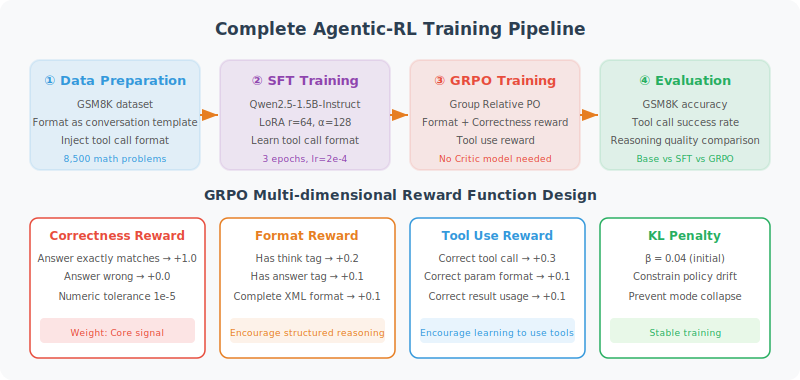

# 11.6 Practice: Complete Agentic-RL Training Pipeline

## Project Overview and Experimental Design

This section will build a complete Agentic-RL training project from scratch, validating all the theories and methods introduced in the previous four sections.



> **Experimental Goal**: Train an Agent model capable of using a calculator tool to solve mathematical reasoning problems
>
> **Base Model**: `Qwen/Qwen2.5-1.5B-Instruct` (trainable on consumer-grade GPU)
>
> **Dataset**: GSM8K [1] (8,500 elementary school math word problems with standard answers)
>
> **Training Pipeline**: Data preparation → SFT (format learning) → GRPO (reasoning optimization) → Evaluation comparison

### Why Choose GSM8K?

GSM8K is an ideal benchmark dataset for validating Agentic-RL effectiveness, with the following key characteristics:

| Characteristic | Description | Significance for Training |
|----------------|-------------|--------------------------|
| **Objectively verifiable** | Each problem has a unique correct numerical answer | Can automatically compute accuracy, no manual reward annotation needed |
| **Multi-step reasoning** | Average 3–5 reasoning steps required | Fully tests Agent's chain-of-thought reasoning capability |
| **Moderate scale** | 7,473 training problems + 1,319 test problems | Controllable training cost, results have statistical significance |
| **Community benchmark** | Widely used for LLM evaluation | Large amounts of public benchmark data available for comparison |

### Hardware Requirements and Expected Training Time

| Configuration | SFT Phase | GRPO Phase | Notes |
|---------------|-----------|------------|-------|
| **Minimum** | 1× RTX 3090 24GB | 1× RTX 3090 24GB | Requires QLoRA 4-bit quantization |
| **Recommended** | 1× A100 40GB | 1× A100 40GB | Full precision bfloat16 training |
| **Training time (minimum)** | ~2–4 hours | ~4–8 hours | 1.5B model, 3 epochs |

---

## Step 1: Environment Setup

```bash
# Create project directory and virtual environment
mkdir -p agent-rl-training && cd agent-rl-training
python -m venv venv && source venv/bin/activate

# Install core dependencies (versions verified for compatibility)
pip install torch>=2.1.0
pip install transformers>=4.40.0
pip install peft>=0.10.0
pip install trl>=0.12.0
pip install datasets accelerate bitsandbytes
pip install wandb tensorboard          # Experiment tracking (strongly recommended)
```

---

## Step 2: Data Preparation

```python
"""
step2_prepare_data.py

Convert GSM8K raw data to Agent-format SFT training data.

GSM8K raw format:
  question: "Natalia sold clips to 48 of her friends..."
  answer:   "Natalia sold 48/2 = <<48/2=24>>24 clips... #### 72"

Target format (Agent trajectory):
  <think>reasoning process</think>
  <tool_call>calculator(expression="...")</tool_call>
"""

import re
from datasets import load_dataset, Dataset


def extract_final_answer(solution: str) -> str:
    """Extract the final answer in '#### number' format from GSM8K solution"""
    match = re.search(r'####\s*(.+)', solution)
    return match.group(1).strip().replace(",", "") if match else ""


def extract_calculations(solution: str) -> list[str]:
    """Extract calculation expressions from GSM8K solution (format: <<expr=result>>)"""
    return re.findall(r'<<(.+?)=.+?>>', solution)


def convert_to_agent_format(example: dict) -> dict:
    """
    Convert GSM8K sample to Agent SFT training format
    
    Conversion strategy:
    1. Extract reasoning steps as <think> content
    2. Extract last calculation expression as <tool_call> parameter
    3. Build complete ChatML format conversation
    """
    question = example["question"]
    solution = example["answer"]
    final_answer = extract_final_answer(solution)
    calculations = extract_calculations(solution)

    # Extract reasoning steps (remove #### line and calculation annotations)
    steps = [
        re.sub(r'<<.+?>>', '', line).strip()
        for line in solution.split("\n")
        if line.strip() and "####" not in line
    ]
    think_content = "\n".join(steps)

    # Build Agent format response
    if calculations:
        # Use the last calculation expression (usually the final computation step)
        final_expr = calculations[-1]
        agent_response = (
            f"<think>\n{think_content}\n"
            f"Final calculation needed: {final_expr}\n</think>\n\n"
            f"<tool_call>\ncalculator(expression=\"{final_expr}\")\n</tool_call>"
        )
    else:
        agent_response = (
            f"<think>\n{think_content}\n</think>\n\n"
            f"The final answer is **{final_answer}**."
        )

    # Build ChatML format conversation
    conversation = (
        "<|im_start|>system\n"
        "You are a math assistant. When solving problems, first write out the complete "
        "reasoning process in <think> tags, and use the calculator tool for precise calculations.\n"
        "<|im_end|>\n"
        f"<|im_start|>user\n{question}\n<|im_end|>\n"
        f"<|im_start|>assistant\n{agent_response}\n<|im_end|>"
    )

    return {
        "text": conversation,
        "question": question,
        "answer": final_answer,
    }


# ── Load and convert dataset ──────────────────────────────────────────────────
print("📦 Loading GSM8K dataset...")
dataset = load_dataset("openai/gsm8k", "main")

print("🔄 Converting to Agent format...")
sft_train = dataset["train"].map(convert_to_agent_format, remove_columns=dataset["train"].column_names)
sft_test  = dataset["test"].map(convert_to_agent_format, remove_columns=dataset["test"].column_names)

print(f"✅ Training set: {len(sft_train)} samples | Test set: {len(sft_test)} samples")

# Data quality validation
valid_train = sft_train.filter(lambda x: "<think>" in x["text"] and x["answer"] != "")
print(f"📊 Format validation pass rate: {len(valid_train) / len(sft_train):.1%}")

sft_train.save_to_disk("./data/sft_train")
sft_test.save_to_disk("./data/sft_test")
```

---

## Step 3: SFT Training

```python
"""
step3_sft_training.py

SFT phase: teach the model Agent behavior format through imitation learning.
Goal: raise base model's format compliance rate from ~5% to ~85%+.
"""

import torch
from transformers import AutoModelForCausalLM, AutoTokenizer, BitsAndBytesConfig
from peft import LoraConfig, TaskType
from trl import SFTConfig, SFTTrainer
from datasets import load_from_disk

# ── Data loading ──────────────────────────────────────────────────────────────
train_dataset = load_from_disk("./data/sft_train")
eval_dataset  = load_from_disk("./data/sft_test")

# ── Model loading (QLoRA configuration) ──────────────────────────────────────
model_name = "Qwen/Qwen2.5-1.5B-Instruct"

bnb_config = BitsAndBytesConfig(
    load_in_4bit=True,
    bnb_4bit_quant_type="nf4",
    bnb_4bit_compute_dtype=torch.bfloat16,
    bnb_4bit_use_double_quant=True,
)

model = AutoModelForCausalLM.from_pretrained(
    model_name,
    quantization_config=bnb_config,
    device_map="auto",
    trust_remote_code=True,
)
tokenizer = AutoTokenizer.from_pretrained(model_name)
tokenizer.pad_token = tokenizer.eos_token

# ── LoRA configuration ────────────────────────────────────────────────────────
# 1.5B model uses r=16, parameter count ~8M (~0.5% of total parameters)
lora_config = LoraConfig(
    task_type=TaskType.CAUSAL_LM,
    r=16,
    lora_alpha=32,
    lora_dropout=0.05,
    target_modules=["q_proj", "k_proj", "v_proj", "o_proj"],
)

# ── Training configuration ────────────────────────────────────────────────────
sft_config = SFTConfig(
    output_dir="./checkpoints/sft",

    num_train_epochs=3,
    per_device_train_batch_size=4,
    gradient_accumulation_steps=4,      # Effective batch size = 16
    learning_rate=2e-4,
    warmup_ratio=0.1,
    weight_decay=0.01,
    lr_scheduler_type="cosine",

    bf16=True,
    gradient_checkpointing=True,

    logging_steps=10,
    eval_strategy="steps",
    eval_steps=200,
    save_strategy="steps",
    save_steps=200,
    save_total_limit=3,
    load_best_model_at_end=True,        # Automatically load best validation checkpoint

    max_seq_length=1024,
    dataset_text_field="text",
    report_to="tensorboard",
)

# ── Training execution ────────────────────────────────────────────────────────
trainer = SFTTrainer(
    model=model,
    args=sft_config,
    train_dataset=train_dataset,
    eval_dataset=eval_dataset.select(range(200)),
    peft_config=lora_config,
    processing_class=tokenizer,
)

print("🚀 Starting SFT training...")
print(f"   Model: {model_name} | LoRA r={lora_config.r} | Training data: {len(train_dataset)} samples")
trainer.train()

trainer.save_model("./checkpoints/sft-final")
tokenizer.save_pretrained("./checkpoints/sft-final")
print("✅ SFT training complete!")
```

---

## Step 4: GRPO Reinforcement Learning Training

```python
"""
step4_grpo_training.py

GRPO phase: use reinforcement learning signals to guide the model to explore
reasoning strategies that exceed SFT data quality.
Goal: further improve accuracy by 10–20 percentage points on top of SFT.
"""

import re
import torch
from transformers import AutoModelForCausalLM, AutoTokenizer
from peft import PeftModel
from trl import GRPOConfig, GRPOTrainer
from datasets import load_from_disk

# ── Load SFT model (merge LoRA weights) ──────────────────────────────────────
model_name = "Qwen/Qwen2.5-1.5B-Instruct"

base_model = AutoModelForCausalLM.from_pretrained(
    model_name,
    torch_dtype=torch.bfloat16,
    device_map="auto",
    trust_remote_code=True,
)
model = PeftModel.from_pretrained(base_model, "./checkpoints/sft-final")
model = model.merge_and_unload()   # Merge LoRA weights, restore standard model structure

tokenizer = AutoTokenizer.from_pretrained(model_name)
tokenizer.pad_token = tokenizer.eos_token

# ── Prepare GRPO training data (requires "prompt" field) ─────────────────────
train_dataset = load_from_disk("./data/sft_train")

def prepare_grpo_prompt(example: dict) -> dict:
    """Convert training sample to prompt format required by GRPO"""
    return {
        "prompt": (
            "<|im_start|>system\n"
            "You are a math assistant. When solving problems, first write out the complete "
            "reasoning process in <think> tags, and use the calculator tool for precise calculations.\n"
            "<|im_end|>\n"
            f"<|im_start|>user\n{example['question']}\n<|im_end|>\n"
            "<|im_start|>assistant\n"
        ),
        "answer": example["answer"],
    }

grpo_dataset = train_dataset.map(prepare_grpo_prompt)

# ── Reward function: comprehensive math Agent evaluation ──────────────────────
def math_agent_reward(completions: list[str], **kwargs) -> list[float]:
    """
    Comprehensive math Agent reward function
    
    Reward dimensions and weights:
    - Accuracy (0.50): whether final numerical value is correct (allow 1% relative error)
    - Format (0.20): whether <think>/<tool_call> tags are properly used
    - Reasoning quality (0.20): whether reasoning steps are sufficient, include calculation process
    - Conciseness (0.10): whether output length is reasonable
    """
    rewards = []
    answers = kwargs.get("answer", [""] * len(completions))

    for completion, answer in zip(completions, answers):
        reward = 0.0

        # ── Dimension 1: Accuracy (weight 0.50) ──────────────────────────────
        try:
            numbers = re.findall(r'-?[\d,]+\.?\d*', completion)
            if numbers:
                pred = float(numbers[-1].replace(",", ""))
                true_val = float(str(answer).replace(",", ""))
                if abs(pred - true_val) / (abs(true_val) + 1e-8) < 0.01:
                    reward += 0.50
        except (ValueError, TypeError, ZeroDivisionError):
            pass

        # ── Dimension 2: Format correctness (weight 0.20) ────────────────────
        has_think = "<think>" in completion and "</think>" in completion
        if has_think:
            reward += 0.10
            think = completion.split("<think>")[1].split("</think>")[0].strip()
            if len(think) > 20:
                reward += 0.10   # Has substantive reasoning content

        # ── Dimension 3: Reasoning quality (weight 0.20) ─────────────────────
        if has_think:
            think = completion.split("<think>")[1].split("</think>")[0]
            lines = [l.strip() for l in think.split("\n") if l.strip()]
            if len(lines) >= 2:
                reward += 0.10   # Multi-step reasoning
            if re.search(r'[\d+\-*/=]', think):
                reward += 0.10   # Contains mathematical calculation process

        # ── Dimension 4: Conciseness (weight 0.10) ───────────────────────────
        token_count = len(completion.split())
        if token_count <= 300:
            reward += 0.10
        elif token_count > 800:
            reward -= 0.05   # Penalty for excessive length

        rewards.append(max(0.0, reward))

    return rewards

# ── GRPO training configuration ───────────────────────────────────────────────
grpo_config = GRPOConfig(
    output_dir="./checkpoints/grpo",

    num_generations=8,               # G=8: generate 8 responses per question for within-group comparison
    num_train_epochs=1,              # GRPO typically 1–2 epochs
    per_device_train_batch_size=1,
    gradient_accumulation_steps=8,
    learning_rate=5e-6,              # RL learning rate ≈ 1/40 of SFT learning rate
    warmup_ratio=0.1,
    max_grad_norm=0.5,               # Gradient clipping, prevents gradient explosion in RL training

    max_new_tokens=512,
    temperature=0.7,                 # Ensures diversity among G responses

    kl_coef=0.05,                    # KL divergence penalty coefficient

    bf16=True,
    logging_steps=1,
    save_strategy="steps",
    save_steps=100,
    save_total_limit=3,
    report_to="tensorboard",
)

# ── Training execution ────────────────────────────────────────────────────────
trainer = GRPOTrainer(
    model=model,
    config=grpo_config,
    train_dataset=grpo_dataset,
    processing_class=tokenizer,
    reward_funcs=math_agent_reward,
)

print("🚀 Starting GRPO training...")
print(f"   Group size G={grpo_config.num_generations} | LR={grpo_config.learning_rate} | KL coef={grpo_config.kl_coef}")
trainer.train()
trainer.save_model("./checkpoints/grpo-final")
print("✅ GRPO training complete!")
```

---

## Step 5: Systematic Evaluation and Comparative Analysis

```python
"""
step5_evaluation.py

Comparative evaluation of model performance across three phases:
  Base model (Baseline) → SFT model → GRPO model

Evaluation metrics:
  - Accuracy: final answer correctness rate
  - Format Compliance: <think> tag usage rate
  - Avg. Length: token count
"""

import re
import torch
from transformers import AutoModelForCausalLM, AutoTokenizer
from datasets import load_from_disk


def evaluate_model(
    model_path: str,
    test_data,
    num_samples: int = 200,
    device: str = "cuda",
) -> dict:
    """
    Evaluate model performance on GSM8K test set
    
    Args:
        model_path:  model path (HuggingFace format)
        test_data:   test dataset
        num_samples: number of evaluation samples (use 1319 for full evaluation)
    
    Returns:
        evaluation result dictionary containing various metrics
    """
    model = AutoModelForCausalLM.from_pretrained(
        model_path, torch_dtype=torch.bfloat16, device_map="auto"
    )
    tokenizer = AutoTokenizer.from_pretrained(model_path)

    correct = 0
    format_ok = 0
    total_tokens = 0
    total = 0

    for example in test_data.select(range(num_samples)):
        prompt = (
            "<|im_start|>system\n"
            "You are a math assistant. When solving problems, first write out the complete "
            "reasoning process in <think> tags, and use the calculator tool for precise calculations.\n"
            "<|im_end|>\n"
            f"<|im_start|>user\n{example['question']}\n<|im_end|>\n"
            "<|im_start|>assistant\n"
        )

        inputs = tokenizer(prompt, return_tensors="pt").to(model.device)
        with torch.no_grad():
            outputs = model.generate(
                **inputs,
                max_new_tokens=512,
                temperature=0.1,
                do_sample=True,
            )

        response = tokenizer.decode(
            outputs[0][inputs["input_ids"].shape[1]:],
            skip_special_tokens=True,
        )

        # Accuracy evaluation
        try:
            true_val = float(example["answer"].replace(",", ""))
            numbers = re.findall(r'-?[\d,]+\.?\d*', response)
            if numbers:
                pred = float(numbers[-1].replace(",", ""))
                if abs(pred - true_val) / (abs(true_val) + 1e-8) < 0.01:
                    correct += 1
        except (ValueError, ZeroDivisionError):
            pass

        # Format compliance
        if "<think>" in response and "</think>" in response:
            format_ok += 1

        total_tokens += len(response.split())
        total += 1

    del model   # Free GPU memory for next model

    return {
        "accuracy":          correct / total,
        "format_compliance": format_ok / total,
        "avg_length":        total_tokens / total,
        "total_samples":     total,
    }


# ── Evaluate models across three phases ──────────────────────────────────────
test_data = load_from_disk("./data/sft_test")

models_to_eval = [
    ("🔵 Base Model",  "Qwen/Qwen2.5-1.5B-Instruct"),
    ("🟡 SFT Model",   "./checkpoints/sft-merged"),
    ("🟢 GRPO Model",  "./checkpoints/grpo-final"),
]

results = {}
for name, path in models_to_eval:
    print(f"\nEvaluating {name}...")
    results[name] = evaluate_model(path, test_data, num_samples=200)

# ── Display results ───────────────────────────────────────────────────────────
print("\n" + "=" * 65)
print("📈 Agentic-RL Training Effect Comparison (GSM8K test set, n=200)")
print("=" * 65)
print(f"{'Metric':<20} {'Base Model':>12} {'SFT':>12} {'GRPO':>12}")
print("-" * 65)

metrics = [
    ("Accuracy",        "accuracy",          ".1%"),
    ("Format Compliance", "format_compliance", ".1%"),
    ("Avg. Length",     "avg_length",        ".0f"),
]

for label, key, fmt in metrics:
    row = f"{label:<20}"
    for name, _ in models_to_eval:
        val = results[name][key]
        row += f" {val:>11{fmt}}"
    print(row)

print("=" * 65)
print("\n📌 Expected results reference (Qwen2.5-1.5B):")
print("   Base model: accuracy ~35–45%, format compliance ~5%")
print("   After SFT:  accuracy ~45–55%, format compliance ~85%")
print("   After GRPO: accuracy ~55–65%, format compliance ~90%")
```

---

## Step 6: Model Export and Deployment

```python
"""
step6_export.py

Export the trained model to production-ready formats.
Supports HuggingFace format (for vLLM/TGI deployment) and GGUF format (for local deployment).
"""

import torch
from transformers import AutoModelForCausalLM, AutoTokenizer

# ── Load final model ──────────────────────────────────────────────────────────
model = AutoModelForCausalLM.from_pretrained(
    "./checkpoints/grpo-final",
    torch_dtype=torch.bfloat16,
)
tokenizer = AutoTokenizer.from_pretrained("./checkpoints/grpo-final")

# ── Method 1: HuggingFace format (recommended for server deployment) ──────────
# Compatible with vLLM, Text Generation Inference (TGI), Ollama, and other inference frameworks
model.save_pretrained("./export/hf-model", safe_serialization=True)
tokenizer.save_pretrained("./export/hf-model")
print("✅ HuggingFace format exported to ./export/hf-model")

# ── Method 2: GGUF format (for llama.cpp / Ollama local deployment) ───────────
# Requires installing llama.cpp and using its conversion script
# python llama.cpp/convert_hf_to_gguf.py ./export/hf-model \
#     --outtype q4_k_m \
#     --outfile ./export/model-q4_k_m.gguf
print("💡 GGUF format conversion command:")
print("   python llama.cpp/convert_hf_to_gguf.py ./export/hf-model \\")
print("       --outtype q4_k_m --outfile ./export/model-q4_k_m.gguf")
```

---

## Complete Project Structure

```
agent-rl-training/
├── data/
│   ├── sft_train/              # SFT training data (7,473 Agent-format trajectories)
│   └── sft_test/               # Evaluation data (1,319 samples)
├── checkpoints/
│   ├── sft/                    # SFT training checkpoints (with TensorBoard logs)
│   ├── sft-final/              # SFT final LoRA adapter weights
│   ├── sft-merged/             # SFT merged complete model (for GRPO initialization)
│   ├── grpo/                   # GRPO training checkpoints
│   └── grpo-final/             # GRPO final model (for evaluation and deployment)
├── export/
│   ├── hf-model/               # HuggingFace format (server deployment)
│   └── model-q4_k_m.gguf       # GGUF format (local deployment, optional)
├── step2_prepare_data.py
├── step3_sft_training.py
├── step4_grpo_training.py
├── step5_evaluation.py
├── step6_export.py
└── requirements.txt
```

> **📌 Engineering Practice Notes**
>
> - **Experiment tracking**: Strongly recommend using wandb or MLflow to record hyperparameters, loss curves, and evaluation metrics for each training run, facilitating reproduction and comparison
> - **Data augmentation**: Use GPT-4 to paraphrase GSM8K problems to generate more diverse training data, typically bringing 2–5% accuracy improvement
> - **Curriculum Learning**: First train with simple problems (1–2 step reasoning), then gradually introduce complex problems (4–5 step reasoning); convergence speed is usually faster
> - **Model scale effect**: This tutorial uses a 1.5B model for teaching demonstration; in actual production, 7B–14B models show more significant GRPO improvement (typically 15–25%)
> - **Cost estimation**: On A100 40GB, complete training of 1.5B model takes ~6–12 hours; 7B model ~24–48 hours; 14B model ~48–96 hours

---

## Chapter Summary

Through systematic study of this chapter, you have mastered the complete knowledge system for Agentic-RL training:

| Section | Core Knowledge | Key Conclusion |
|---------|---------------|----------------|
| **11.1 Overview** | MDP modeling, two-phase paradigm | RL training can emerge reasoning strategies that exceed training data |
| **11.2 SFT + LoRA** | Supervised fine-tuning, parameter-efficient training | LoRA achieves near full-parameter fine-tuning effect with <1% of parameters |
| **11.3 PPO** | Policy gradient, importance sampling, advantage function, Clip mechanism | PPO is the classic RLHF algorithm, but Critic causes memory ≈ 3× |
| **11.4 DPO** | Implicit reward, Bradley-Terry model, closed-form solution | DPO converts RL to supervised learning, minimal but cannot explore online |
| **11.5 GRPO + Reward Design** | Within-group comparison, multi-dimensional rewards, reward hacking defense | GRPO reduces memory from 3× to 1.5×; reward function is the decisive factor in RL training effectiveness |
| **11.6 Practice** | Complete pipeline, evaluation comparison | On GSM8K: base ~40% → SFT ~50% → GRPO ~60% |

Agentic-RL represents an important development direction for LLM applications: **the paradigm shift from "prompt engineering" to "training optimization."** As algorithms continue to evolve and compute costs decrease, this technology will play a key role in an increasing number of high-value Agent scenarios.

---

## References

[1] COBBE K, KOSARAJU V, BAVARIAN M, et al. Training verifiers to solve math word problems[R]. arXiv preprint arXiv:2110.14168, 2021.

[2] DEEPSEEK AI. DeepSeek-R1: Incentivizing reasoning capability in LLMs via reinforcement learning[R]. arXiv preprint arXiv:2501.12948, 2025.

[3] HU E J, SHEN Y, WALLIS P, et al. LoRA: Low-rank adaptation of large language models[C]//International Conference on Learning Representations (ICLR). 2022.

[4] SHAO Z, WANG P, ZHU Q, et al. DeepSeekMath: Pushing the limits of mathematical reasoning in open language models[R]. arXiv preprint arXiv:2402.03300, 2024.

[5] BENGIO Y, LOURADOUR J, COLLOBERT R, et al. Curriculum learning[C]//International Conference on Machine Learning (ICML). 2009.
