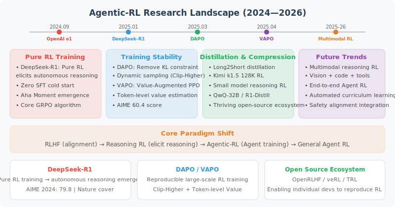

# 11.7 Latest Research Advances (2025–2026)

> 📖 *"From DeepSeek-R1 making the cover of Nature to DAPO/VAPO setting new reasoning benchmarks, Agentic-RL is moving from the laboratory to engineering practice at an astonishing pace. This section will give you a panoramic view of the cutting-edge research in this field."*

> ⏰ **Timeliness Note**: The content of this section is updated to March 20, 2026. Since this field is developing extremely rapidly, readers are advised to supplement with open-source projects like [Awesome-RL-Reasoning-Recipes](https://github.com/yuezhao-zy/Awesome-RL-Reasoning-Recipes) for the latest developments.



---

## 7.1 Overview: The Paradigm Shift from RLHF to Reasoning RL

The past two years (2025–2026) have been years of explosive development in the field of large model reinforcement learning. Marked by **DeepSeek-R1** making the cover of Nature, RL training of LLMs has leaped from an auxiliary role in "aligning human preferences" (RLHF) to the **core technology for stimulating model reasoning capabilities**. We can use a timeline to overview the key milestones:

```
2024.09  OpenAI o1 released, first demonstrates potential of "test-time compute scaling"
2025.01  DeepSeek-R1 released, pure RL training stimulates autonomous reasoning, uses GRPO algorithm
2025.01  Kimi k1.5 released, 128K long-context RL training, Long2Short distillation technique
2025.02  QwQ-32B released, demonstrates reasoning RL training effects at medium scale
2025.03  DAPO open-sourced, proposes reproducible large-scale RL training solution
2025.04  VAPO released, value-augmented PPO framework, AIME 2024 reaches 60.4
2025.06  OpenAI o3 released, reasoning capability further leaps
2025.07  GSPO proposed (Qwen team), sequence-level policy optimization stabilizes MoE training, trains Qwen3
2025.08  Self-Aligned Reward (SAR) proposed, uses perplexity signals to address overthinking
2025.10  PURE framework released, min-form credit assignment solves reward hacking
2025.12  Co-rewarding (ICLR 2026) proposes self-supervised RL learning scheme
2026.01  RLVR new paradigm: efficient RL method based on problem decomposition
2026.02  DRQA dynamic reasoning quota allocation, token cost reduced by 31%
2026.03  CoRLHF proposes cooperative policy-reward joint optimization
```

These works can be summarized into the following core research directions:

| Direction | Representative Works | Core Problem |
|-----------|---------------------|--------------|
| **Reasoning model training** | DeepSeek-R1, Kimi k1.5, QwQ | How to stimulate LLM reasoning capability through RL? |
| **RL algorithm improvements** | DAPO, VAPO, GSPO, GRPO variants | How to make large model RL training more stable and efficient? |
| **Reward design and feedback** | SAR, Co-rewarding, CoRLHF | How to design better reward signals? |
| **Overthinking and efficiency** | PURE, DRQA, DEER | How to make models reason "just right"? |
| **Agentic task RL** | AgentPRM, R³L, DeepSWE | How to extend RL to Agent tasks like tool calling? |

Let's dive into the important papers in each direction one by one.

---

## 7.2 Reasoning Models: Pure RL Training Stimulates Autonomous Reasoning

### 7.2.1 DeepSeek-R1: The Nature Cover Breakthrough

**Paper**: *DeepSeek-R1: Incentivizing Reasoning Capability in LLMs via Reinforcement Learning* (Nature, 2025) [1]

DeepSeek-R1 is the most milestone-significant work in this field. Its core finding is:

> **Through RL training alone (without manually annotated reasoning chains), models can autonomously emerge advanced cognitive capabilities such as multi-step reasoning, self-reflection, and dynamic strategy adjustment.**

#### Core Technical Points

1. **GRPO Algorithm**: Uses Group Relative Policy Optimization (see [Section 11.5](./05_grpo.md)), optimizes policy through within-group response competition, avoids expensive Critic networks, total training cost approximately $294,000.

2. **Multi-phase Training Framework**:
   - **R1-Zero Phase**: Uses only result correctness as reward (Verifiable Reward RL, RLVR), no SFT data used. The model spontaneously emerges "Aha moments" — learning to self-reflect and correct errors during the reasoning process.
   - **R1 Phase**: Building on R1-Zero, incorporates a small amount of high-quality SFT data and human preference alignment to improve comprehensive capabilities.

3. **Verifiable Rewards (RLVR)**: Reward signals come from automatically verifiable tasks (such as final answers to math problems), no manual annotation needed.

#### Key Experimental Results

- Achieves SOTA on 21 benchmarks including MMLU, AIME 2024, LiveCodeBench
- R1-Zero demonstrates the possibility of "learning to reason from scratch" — reasoning chain length spontaneously grows during RL training
- Maintains strong reasoning capability after distillation to 7B/14B small models

#### Why Is It Important?

DeepSeek-R1 proves two key arguments:
1. **RL can stimulate latent reasoning capabilities from pre-training** — these capabilities are difficult to fully release through SFT or prompt engineering
2. **Reasoning capabilities can "emerge" in a pure RL environment** — without relying on manually annotated reasoning chains as demonstrations

---

### 7.2.2 Kimi k1.5: Breakthrough in Long-Context RL

**Paper**: *Kimi k1.5: Scaling Reinforcement Learning with LLMs* (2025) [2]

Kimi k1.5, developed by the Moonshot AI team, makes unique contributions in several areas:

#### Core Innovations

1. **128K Long-Context RL Training**: Extends the RL training context window from the traditional 4K-8K to 128K tokens, improving training efficiency through **Partial Rollout Reuse**.

2. **Simplified RL Framework**: Abandons Monte Carlo Tree Search (MCTS) and value functions, directly optimizes the model through improved Online Mirror Descent, greatly reducing computational burden.

3. **Long2Short Distillation Technique**: "Compresses" long-context reasoning capability into short-context models. Specifically:
   - First train strong reasoning capability in long-context settings
   - Then through knowledge distillation, teach short-context models to "refine" reasoning

#### Key Results

- Surpasses GPT-4o by 550% on short tasks like LiveCodeBench
- Long2Short technique proves that **long-chain reasoning capability can be compressed without significant loss**
- First demonstrates feasibility of RL training with 128K context window

---

### 7.2.3 QwQ-32B: Reasoning RL at Medium Scale

**Paper**: *QwQ: Reflect and Question to Understand the World* (Alibaba, 2025) [3]

QwQ-32B is a medium-scale reasoning model released by Alibaba's Tongyi team. Its significance lies in proving that **models at the 32B parameter scale can also obtain strong reasoning capabilities through RL training**.

#### Technical Characteristics

- Based on Qwen2.5-32B for RL training
- Approaches DeepSeek-R1's performance on mathematical reasoning tasks
- Training cost far lower than 670B-scale models

#### Why Is It Important?

QwQ proves that reasoning RL is not "exclusive to large models" — medium-scale models can also achieve significant reasoning capability improvements through appropriate RL training. This has great practical value for resource-constrained teams and edge deployment scenarios.

---

### 7.2.4 OpenAI o1/o3: Test-Time Compute Scaling

**Models**: *OpenAI o1* (2024.09) / *OpenAI o3* (2025.06) [4]

Although OpenAI has not published complete technical reports, the o1 and o3 series models have had a profound impact on the industry:

#### Core Concept: Test-Time Compute Scaling

Traditional Scaling Laws focus on **training-time compute scaling** (larger models + more data). The o1/o3 series proposes another dimension:

> **Investing more computation at inference time (longer thinking chains, more search/verification) can also continuously improve model capabilities.**

This means there are two complementary scaling paths:
1. **Training-time scaling**: increase model size, increase data
2. **Inference-time scaling**: increase reasoning steps, verification loops

#### Impact on the Field

- Spawned the new category of "reasoning models"
- Drove the development of RL algorithms for reasoning tasks like GRPO, DAPO, VAPO
- Triggered attention to "reasoning efficiency" — the Overthinking problem emerged

---

## 7.3 RL Algorithm Improvements: Making Large Model RL Training More Stable and Efficient

### 7.3.1 DAPO: Large-Scale Reproducible RL Training

**Paper**: *DAPO: An Open-Source LLM Reinforcement Learning System at Scale* (2025) [5]

DAPO (Decoupled Clip and Dynamic Sampling PPO), proposed by ByteDance's Seed team, has the core goal of solving the **reproducibility** problem of large-scale RL training.

#### Core Techniques

1. **Decoupled Clipping**: Traditional PPO uses symmetric clipping $\epsilon$; DAPO separates the upper and lower clipping boundaries:
   - $\epsilon_{\text{high}}$ (larger): encourages exploration of good responses
   - $\epsilon_{\text{low}}$ (smaller): strictly suppresses bad responses
   
   This asymmetric design lets the model "boldly explore good behavior" while "conservatively suppressing bad behavior."

2. **Dynamic Sampling**: Dynamically adjusts the number of samples per question based on training progress:
   - Early training: more sampling, increase exploration
   - Late training: less sampling, fine-grained optimization

3. **Token-Level Policy Constraint**: Applies KL constraints at the token level rather than sequence level, more precisely controlling policy drift.

#### Open-Source Contribution

DAPO fully open-sources training code and datasets (based on Qwen2.5-32B), making it one of the most reproducible large-scale RL training solutions currently available.

---

### 7.3.2 VAPO: Value-Augmented PPO

**Paper**: *VAPO: Efficient and Reliable RL Framework for Advanced Reasoning Tasks* (ByteDance Seed, 2025) [6]

VAPO (Value-based Augmented PPO) is a follow-up to DAPO, specifically targeting challenges in **long-chain reasoning tasks**.

#### Core Problems

In long-chain reasoning (such as mathematical proofs, complex programming), RL training faces three major challenges:
1. **Value model bias**: Critic network's value estimation for long sequences is inaccurate
2. **Heterogeneous sequence lengths**: Response lengths within the same batch vary greatly
3. **Sparse rewards**: Only the final answer has a reward signal

#### Core Techniques

1. **Value Pretraining**: Uses Monte Carlo returns to pretrain the Critic network, reducing initialization bias.

2. **Decoupled GAE**:
   - Uses $\lambda_V = 1.0$ for the value network (low bias, high variance)
   - Uses $\lambda_P = 0.95$ for the policy network (balanced bias and variance)

3. **Length-Adaptive GAE**: Dynamically adjusts $\lambda$ based on sequence length:

$$\lambda = 1 - \frac{1}{0.05 \cdot l}$$

   Where $l$ is the sequence length. Long sequences use larger $\lambda$ (reduce bias), short sequences use smaller $\lambda$ (reduce variance).

4. **Clip-Higher Exploration**: Uses asymmetric clipping $\epsilon_{\text{high}} = 0.28$, $\epsilon_{\text{low}} = 0.2$, encouraging diverse sampling.

#### Key Results

| Model | AIME 2024 | Training Steps | Stability |
|-------|-----------|----------------|-----------|
| DeepSeek-R1-Zero (671B) | ~50 | Many | Occasional collapse |
| DAPO (32B) | ~50 | Medium | Relatively stable |
| **VAPO (32B)** | **60.4** | **~5,000** | **No collapse** |

VAPO surpasses DeepSeek-R1-Zero (671B) using only Qwen-32B and 5,000 training steps, with completely collapse-free training.

---

### 7.3.3 GRPO Variants and Improvements

Since DeepSeek-R1 proposed GRPO, multiple papers have improved upon it:

| Improvement Direction | Representative Work | Problem Solved |
|----------------------|--------------------|-----------------| 
| **Sequence-level optimization** | **GSPO** [15] | **Token-level importance weights introduce high-variance noise, causing MoE model training collapse. GSPO elevates importance sampling to sequence level, trains Qwen3** |
| Remove mean normalization | Dr. GRPO | Original GRPO's within-group mean normalization introduces bias |
| Adaptive group size | Adaptive GRPO | Fixed group size doesn't suit all problem difficulties |
| Token-level advantage | Token-level GRPO | Sequence-level advantage is not fine-grained enough for long sequences |
| Online/offline hybrid | Hybrid GRPO | Pure online sampling is inefficient |

> Among these, GSPO is the most practically impactful improvement — it has already been used by Alibaba's Qwen team to train the Qwen3 series models. For detailed principles and implementation of GSPO, see [Section 11.5's GSPO chapter](./05_grpo.md).

---

## 7.4 Reward Design: How to Tell the Model What Good Reasoning Is?

The reward function is the "soul" of RL training. In 2025–2026, three important directions emerged in reward design.

### 7.4.1 Self-Aligned Reward (SAR): Leveraging Model Internal Signals

**Paper**: *Self-Aligned Reward: Towards Effective and Efficient Reasoners* (UIUC & Amazon AWS, 2025) [7]

#### Core Idea

SAR's core insight is: **differences in the model's internal perplexity (PPL) can serve as high-quality reward signals**.

Specifically, SAR computes the perplexity difference under two conditions:

$$r_{\text{SAR}}(y|x) = \frac{\text{PPL}(y) - \text{PPL}(y|x)}{\text{PPL}(y)}$$

Where:
- $\text{PPL}(y|x)$: perplexity of generating response $y$ given question $x$
- $\text{PPL}(y)$: perplexity of treating response $y$ as independent text

**Intuitive explanation**:
- **High SAR**: response highly depends on the question (targeted, concise response)
- **Low SAR**: response weakly associated with the question (possibly verbose, generic content)

#### Why Is It Effective?

1. **No external reward model needed**: leverages the model's own language modeling capability
2. **Fine-grained scoring**: can distinguish "correct and concise" vs "correct but verbose"
3. **Cross-task generalization**: trained on math data, also effective on non-math tasks like logical reasoning

#### Experimental Results

Across 4 base models and 7 datasets:
- Average accuracy improvement of 4%
- Output length reduced by 30%

---

### 7.4.2 Co-rewarding: Self-Supervised RL Learning

**Paper**: *Co-rewarding: Self-Supervised RL for LLM Reasoning* (ICLR 2026) [8]

#### Core Problem

Self-rewarding RL (letting the model score itself) is prone to **training collapse** — the model learns to generate responses that are "easy to give itself high scores" rather than "truly good."

#### Solution

Co-rewarding introduces **complementary supervision signals**:
1. Generate **paraphrased versions** of the same question
2. Use responses to paraphrased questions as auxiliary evaluation for original question responses
3. Evaluations in both directions mutually constrain each other, preventing collapse

#### Key Results

- Performance improvement of 12.9% on reasoning tasks (without ground truth labels)
- Training process significantly more stable

---

### 7.4.3 CoRLHF: Cooperative Policy-Reward Joint Optimization

**Paper**: *CoRLHF: Reinforcement Learning from Human Feedback with Cooperative Policy-Reward Optimization* (Expert Systems with Applications, 2026) [9]

#### Core Innovation

Traditional RLHF has two steps: first train the reward model, then use the reward model to train the policy. This causes a **distribution mismatch** problem — the data distribution seen during reward model training is inconsistent with the data distribution generated during policy optimization.

CoRLHF **merges policy optimization and reward model optimization into one iterative process**:
1. Policy generates new data
2. Reward model updates on new data
3. Policy optimizes on updated rewards
4. Iterative loop

This approach bridges RLHF and RLAIF, maintaining alignment quality while reducing dependence on human feedback.

---

### 7.4.4 Endogenous Reward: LLM as a Built-in Reward Model

**Paper**: Related work by Zhi-Hua Zhou's team (Nanjing University, 2025) [10]

#### Disruptive Finding

This research finds: **LLM's next-token prediction capability itself contains a general reward function** (Endogenous Reward).

That is, the language model distribution learned during pre-training has already implicitly encoded the judgment capability of "what is good output," without needing to additionally train a reward model.

#### Practical Significance

- Reduces one component (reward model) in the RLHF pipeline
- Reduces the risk of error accumulation
- Surpasses traditional reward models on multiple alignment benchmarks

---

## 7.5 Overthinking and Reasoning Efficiency

With the popularization of reasoning models, a new problem has emerged: **Overthinking** — models generate verbose reasoning chains even for simple problems, wasting computational resources and potentially reducing accuracy.

### 7.5.1 Problem Analysis: Why Do Reasoning Models "Think Too Much"?

The root of overthinking lies in the reward structure of RLVR (RL with Verifiable Rewards):

> **As long as the final answer is correct, regardless of how long or redundant the reasoning process is, the model receives the same reward.**

This leads to two problems:
1. **Reward inflation**: standard RL's summation-form credit assignment makes models prefer generating more steps
2. **Undifferentiated incentives**: cannot distinguish "concisely correct" from "verbosely correct"

### 7.5.2 PURE: Min-Form Credit Assignment

**Paper**: *Stop Summation: Min-Form Credit Assignment Is All Process Reward Model Needs for Reasoning* (2025) [11]

#### Core Insight

Traditional RL defines trajectory value as the **sum** of future rewards:

$$V_{\text{sum}}(s_t) = \sum_{k=t}^{T} \gamma^{k-t} r_k$$

PURE proposes replacing the sum with the **minimum**:

$$V_{\text{min}}(s_t) = \min(r_t, r_{t+1}, \ldots, r_T)$$

**Intuition**: the strength of a reasoning chain depends on its **weakest link**.

| Method | Training Signal | Consequence |
|--------|----------------|-------------|
| Sum form | "Generate more 'okay' steps to accumulate score" | Verbose, circular reasoning |
| Min form | "Every step must be correct; one wrong step loses everything" | Concise, precise |

#### Implementation

PURE converts process rewards to new rewards through a temperature parameter $T$, making standard RL algorithms (PPO/GRPO)'s summation formula mathematically equivalent to taking the minimum — **no need to modify the underlying algorithm, only reward preprocessing needed**.

#### Experimental Results

- Sum-form training collapses almost immediately
- Min-form training improves stably
- Sample efficiency improved 2-3×

---

### 7.5.3 DRQA: Dynamic Reasoning Quota Allocation

**Paper**: *DRQA: Dynamic Reasoning Quota Allocation for Controlling Overthinking in Reasoning Large Language Models* (2026) [12]

#### Core Observation

An interesting finding: when models **batch process** multiple questions (rather than processing one by one), total output length significantly shortens — models seem to implicitly distinguish problem difficulty and "compress" reasoning for simple problems.

#### Method

1. Build preference data:
   - Reasoning chains generated individually (verbose version)
   - Reasoning chains generated in batches (refined version)
   - Annotate preferences by correctness and conciseness

2. Use GRPO to train models to simultaneously optimize **logical correctness** and **reasoning conciseness**

#### Results

- Reasoning token cost reduced by 31%
- Accuracy actually improves
- Shortens most for simple problems, maintains sufficient reasoning for complex problems

---

### 7.5.4 DEER: Dynamic Early Exit in Reasoning

**Paper**: *Dynamic Early Exit in Reasoning Models (DEER)* (2026) [13]

DEER is a **training-free** inference-time optimization method:

1. Monitors model confidence in real-time during reasoning
2. Triggers early exit when model is highly confident about the current answer
3. Simple problems end quickly, complex problems continue thinking

#### Results

- Reasoning chain length shortened by 19.1%–80.1%
- Accuracy improved by 0.3%–5.0%
- No additional training needed, plug-and-play

---

### 7.5.5 Method Comparison

| Method | Core Idea | Training Required | Efficiency Gain | Accuracy Impact |
|--------|-----------|-------------------|-----------------|-----------------|
| **SAR** | Perplexity difference as reward | Yes (RL training) | Length -30% | +4% |
| **PURE** | Min-form credit assignment | Yes (reward preprocessing) | 2-3× sample efficiency | Significant improvement |
| **DRQA** | Quota allocation simulating batch reasoning | Yes (GRPO training) | Token -31% | Improvement |
| **DEER** | Confidence-triggered early exit | No (inference time) | Length -19%~80% | +0.3%~5% |
| **Concise RL** | Two-phase refinement training | Yes (two-phase RL) | Length significantly shortened | Improves rather than decreases |

---

## 7.6 RLVR: Reinforcement Learning with Verifiable Rewards

**RLVR (Reinforcement Learning with Verifiable Rewards)** is one of the hottest research directions in 2025–2026, and is also the key to DeepSeek-R1's success.

### 7.6.1 What Is RLVR?

Unlike traditional RLHF which relies on manually annotated preference data, RLVR uses **automatically verifiable** signals as rewards:

| Comparison Dimension | RLHF | RLVR |
|---------------------|------|------|
| Reward source | Manually annotated preferences | Automatic verification (e.g., answer correctness) |
| Annotation cost | High | Extremely low |
| Applicable tasks | Open-ended (dialogue, writing) | Tasks with clear correct answers (math, code) |
| Scalability | Limited by annotation speed | Almost unlimited scaling |

### 7.6.2 RLVR Problems and Improvements

**Problem Decomposition Framework** (Renmin University & ByteDance, 2026) [14]:

Traditional RLVR only gives rewards at the final answer (sparse rewards), causing credit assignment difficulties in long-chain reasoning. This work proposes the **Decomposer-Reasoner Framework**:

1. **Decomposer**: decomposes complex problems into sub-problems
2. **Reasoner**: solves sub-problems step by step
3. **Dense rewards**: each sub-problem solution has a verifiable reward

This approach converts sparse rewards to dense rewards, significantly improving the exploration efficiency of RL training.

---

## 7.7 RL Training for Agentic Tasks

Most of the above discussion is about RL training for reasoning tasks (math, code). A more cutting-edge direction is applying RL to truly **Agentic tasks** — scenarios requiring tool calling, environment interaction, and multi-step decision making.

### 7.7.1 AgentPRM: Process Reward Models for Agent Evaluation

In multi-turn Agent tasks (such as web navigation, API calls), evaluating only the final result is insufficient — the **quality of each decision step** needs to be evaluated. AgentPRM introduces **Process Reward Models** to evaluate the Agent's intermediate decisions.

### 7.7.2 R³L: Reflect-then-Retry RL

**R³L (Reflect-then-Retry RL)** targets failure recovery in Agent tasks:

1. When the Agent fails, generate language feedback diagnosing the error cause
2. Restart from the failure point, using feedback to avoid repeating mistakes
3. Greatly reduces rollout cost

### 7.7.3 DeepSWE: RL Training for Software Engineering Agents

DeepSeek team's DeepSWE demonstrates that RL-trained software engineering Agents can match closed-source models' SWE-bench performance, proving RL's potential in complex Agentic tasks.

---

## 7.8 Open Challenges and Future Directions

Despite rapid progress, the field still faces many open challenges:

### 7.8.1 Reward Hacking

Models may find loopholes in reward functions to "cheat" rather than truly improving capabilities. For example:
- Generating long text that "looks like reasoning" but is actually nonsense
- Using formatting tricks (such as specific keywords) to get high rewards
- Learning to "self-deceive" in self-evaluation

### 7.8.2 Training Stability

Large model RL training is still not stable enough:
- **KL divergence management**: excessive policy drift causes catastrophic forgetting
- **Reward scale**: inconsistent scales across different reward dimensions
- **Data diversity**: diversity of training data directly affects exploration quality

### 7.8.3 Generalization Capability

Current RL-trained reasoning capabilities are mainly validated in math and code domains; generalization to the following areas still needs exploration:
- Open-domain reasoning (scientific reasoning, commonsense reasoning)
- Multimodal reasoning (vision-language, video understanding)
- Cross-lingual reasoning

### 7.8.4 Efficiency and Cost

RL training computational costs are still high:
- Large amounts of rollout sampling
- Multiple models (Policy, Reference, possibly Critic) simultaneously in GPU memory
- Memory and time overhead of long-sequence reasoning

### 7.8.5 Future Outlook

Based on current research trends, we expect the following directions to become hot topics:

| Direction | Expected Progress |
|-----------|------------------|
| **Internal signal mining** | More use of model's own signals (like SAR, endogenous reward) to replace external reward models |
| **Self-evolving training** | Closed-loop systems where models autonomously generate training data and reward signals |
| **Multimodal RL** | Extending reasoning RL to multimodal scenarios like vision and speech |
| **Agentic RL expansion** | Extending RL from reasoning tasks to Agent scenarios like tool calling and environment interaction |
| **Efficient training** | New algorithms reducing rollout cost and improving sample efficiency |
| **Theoretical foundations** | Deeper theoretical analysis of how RL stimulates LLM reasoning capabilities |

---

## 7.9 Paper List

The following are the main papers covered in this section, organized by topic:

### Reasoning Models

| # | Paper | Author/Institution | Year | Core Contribution |
|---|-------|-------------------|------|------------------|
| [1] | DeepSeek-R1: Incentivizing Reasoning Capability in LLMs via RL | DeepSeek AI | 2025 | Pure RL training stimulates autonomous reasoning, GRPO algorithm |
| [2] | Kimi k1.5: Scaling Reinforcement Learning with LLMs | Moonshot AI | 2025 | 128K long-context RL, Long2Short distillation |
| [3] | QwQ: Reflect and Question to Understand the World | Alibaba | 2025 | Medium-scale reasoning RL |
| [4] | OpenAI o1/o3 System Card | OpenAI | 2024/2025 | Test-time compute scaling |

### RL Algorithms

| # | Paper | Author/Institution | Year | Core Contribution |
|---|-------|-------------------|------|------------------|
| [5] | DAPO: An Open-Source LLM RL System at Scale | ByteDance Seed | 2025 | Decoupled clipping + dynamic sampling, open-source reproducible |
| [6] | VAPO: Efficient and Reliable RL for Advanced Reasoning | ByteDance Seed | 2025 | Value pretraining + length-adaptive GAE, AIME 60.4 |
| [15] | GSPO: Group Sequence Policy Optimization | Alibaba (Qwen Team) | 2025 | Sequence-level importance sampling, stabilizes MoE training, trains Qwen3 |

### Reward Design

| # | Paper | Author/Institution | Year | Core Contribution |
|---|-------|-------------------|------|------------------|
| [7] | Self-Aligned Reward (SAR) | UIUC & AWS | 2025 | Perplexity difference as intrinsic reward |
| [8] | Co-rewarding | ICLR 2026 | 2025 | Self-supervised RL, complementary evaluation signals |
| [9] | CoRLHF | Expert Systems with Applications | 2026 | Policy-reward joint iterative optimization |
| [10] | Endogenous Reward | Nanjing University (Zhi-Hua Zhou's team) | 2025 | LLM contains general reward function |

### Reasoning Efficiency

| # | Paper | Author/Institution | Year | Core Contribution |
|---|-------|-------------------|------|------------------|
| [11] | PURE: Min-Form Credit Assignment | — | 2025 | Min-form replaces sum-form credit assignment |
| [12] | DRQA: Dynamic Reasoning Quota Allocation | — | 2026 | Dynamic reasoning quota allocation, token -31% |
| [13] | DEER: Dynamic Early Exit in Reasoning Models | — | 2026 | Training-free dynamic early exit |
| [14] | RLVR with Adaptive Problem Decomposition | Renmin University & ByteDance | 2026 | Problem decomposition dense rewards |

---

## 7.10 Recommended Reading Path

If you are new to this field, it is recommended to read in the following order:

```
Beginner path:
1. DeepSeek-R1 paper (understand core ideas of RLVR + GRPO)
   ↓
2. GSPO paper (understand advantages of sequence-level optimization over token-level)
   ↓
3. DAPO paper + code (hands-on reproduction of large model RL training)
   ↓
4. VAPO paper (understand role of value function in long-chain reasoning)
   ↓
5. SAR / PURE papers (understand reward design and overthinking problems)
   ↓
6. Kimi k1.5 / QwQ (understand different teams' technical approaches)
```

If you are interested in specific topics:
- **Want to train reasoning models** → Focus on DeepSeek-R1 + GSPO + DAPO + VAPO
- **Want to design reward functions** → Focus on SAR + PURE + Co-rewarding
- **Want to optimize reasoning efficiency** → Focus on DRQA + DEER + PURE
- **Want to do Agent RL** → Focus on DeepSWE + AgentPRM + R³L
- **Want to train MoE models** → Focus on GSPO + DAPO

---

## Section Summary

In 2025–2026, the Agentic-RL field underwent a fundamental transformation from "alignment auxiliary tool" to "core capability stimulation engine." Several key trends are worth noting:

1. **RL from auxiliary to core**: RL is no longer just used for "alignment," but for **stimulating latent reasoning capabilities from pre-training**
2. **Algorithms from complex to practical**: from PPO's four-model architecture to GRPO's two-model architecture, then to GSPO's sequence-level optimization and VAPO's value-augmented solution, training is becoming increasingly efficient and stable
3. **Rewards from external to internal**: from manual annotation to verifiable rewards to model internal signals, reward design is becoming increasingly self-consistent
4. **Focus from "stronger" to "more efficient"**: the overthinking problem has spawned a series of reasoning efficiency optimization solutions

These advances are gradually making the vision of **"letting models learn autonomously through practice"** a reality.
