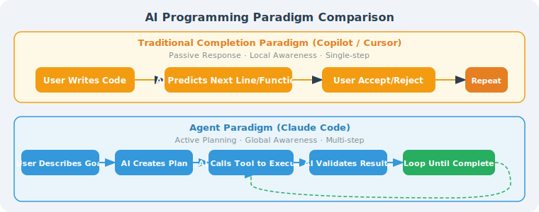
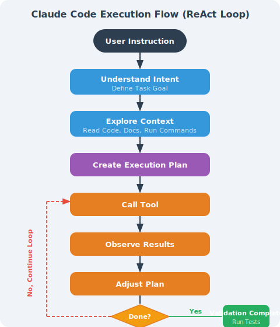

# 15.1 Getting to Know Claude Code: More Than Just Code Completion

> 🖥️ *"We didn't set out to build a coding assistant. We set out to build a trusted, capable colleague who happens to work entirely in the terminal."*  
> — Anthropic Engineering Team, 2024

---

## Starting from a Real-World Scenario

Imagine you're facing a real engineering task:

> "There's a bug in our user authentication system — JWT tokens expire prematurely in certain time zones. Help me find the issue and fix it, make sure all related tests pass, and update the API documentation."

If you use GitHub Copilot, you need to:
1. Locate the problem files yourself, open them one by one
2. Manually paste context into the editor for the AI
3. Accept or reject each completion suggestion
4. Run tests yourself and interpret the results
5. Update the documentation yourself

If you use Claude Code, you just type this sentence in the terminal — and wait. Claude Code will search the codebase itself, locate the root cause, modify the code, run tests, and fix failing cases until everything passes.

**This is not "better code completion" — this is the Agent paradigm.**

---

## What Is Claude Code

### Definition: A CLI Agent Tool

Claude Code is Anthropic's **command-line AI programming Agent**, officially released in 2025. Its essence is an **autonomously acting AI Agent**, not a traditional code completion plugin.

```bash
# Install
npm install -g @anthropic-ai/claude-code

# Navigate to your project directory
cd /your/project

# Start an interactive session
claude

# Or execute a one-time task directly
claude "Help me refactor the authentication logic in the src/auth/ directory and extract common methods"
```

Claude Code runs in your **local terminal** and can directly access your filesystem, execute shell commands, call git, and read/write code files — just like having a real engineer sitting next to you.

### Agent Paradigm vs. Completion Paradigm

The key to understanding Claude Code is understanding that it uses a **completely different AI paradigm**:



> Traditional completion paradigm: passive response, local awareness, single-step operation  
> Agent paradigm: proactive planning, global awareness, multi-step operation

When executing a task, Claude Code internally performs:



This is the standard **ReAct (Reasoning + Acting) Agent loop**, not a one-time text prediction.

---

## Fundamental Differences from Traditional IDE Plugins

| Dimension | GitHub Copilot | Cursor | Claude Code |
|-----------|---------------|--------|-------------|
| **Interaction location** | Embedded in IDE | Embedded in IDE | Command-line terminal |
| **Working mode** | Passive completion | Conversation + completion | Autonomous Agent |
| **Awareness scope** | Current file context | Current project (partial) | Entire codebase |
| **Execution capability** | Text generation only | Can modify files | Read/write files + execute commands + run tests |
| **Task granularity** | Function level | Feature level | Project level |
| **Human intervention** | Confirm every completion | Confirm every modification | Batch authorization, autonomous completion |
| **Tool calls** | ❌ | Limited | ✅ Complete toolchain |
| **Self-verification** | ❌ | ❌ | ✅ Runs tests to confirm results |
| **Pricing model** | Subscription | Subscription | Per token usage |

### A Concrete Comparison

**Task**: *"Add request rate limiting to all API endpoints, limiting each user to a maximum of 100 calls per minute."*

**GitHub Copilot's approach**:
- You need to open each route file
- Tell Copilot the current context
- Accept the rate limiting code snippet it generates
- Manually check if all endpoints are covered
- Manually run tests

**Claude Code's approach**:
```bash
$ claude "Add rate limiting to all API endpoints, 100 calls per user per minute, using Redis as the counter"

✓ Analyzed project structure, found 23 API routes
✓ Found existing middleware patterns
✓ Created rate_limiter.py (Redis implementation)
✓ Modified 23 route files, injected middleware
✓ Updated unit tests, ran all tests (47/47 passed)
✓ Updated rate limiting description in API documentation

Done. Modified 25 files, all tests passed.
```

---

## Claude Code's Design Philosophy

### 1. Unix Tool Philosophy: Do One Thing Well

Claude Code adheres to the Unix tool tradition: **one tool, focused on one core function, achieving powerful capabilities through composition**.

It doesn't try to become a full-featured IDE, doesn't embed a debugger, and doesn't provide a graphical interface. It does one thing: **act as a trusted AI programming assistant in the terminal to help you complete engineering tasks**.

This restraint brings excellent **composability**:

```bash
# Combine with git hooks
echo 'claude "Check if this commit has potential security issues"' > .git/hooks/pre-commit

# Combine with CI/CD
claude "Analyze the reason for this build failure and fix it" --pipe < build_log.txt

# Pipe with other CLI tools
git diff HEAD~1 | claude "Summarize the changes in this PR, generate a changelog entry"
```

### 2. Trustworthy: Transparent, Not a Black Box

Claude Code's design emphasizes **operational transparency**. For every step, it clearly informs the user:

```
Claude Code's default behavior
────────────────────────────
✓ Read files: executes directly, shows which files were read
⚠️ Modify files: requests confirmation by default (configurable)
⚠️ Execute commands: shows the command and requests confirmation by default
❌ Dangerous operations: delete files, git push, etc., always requests confirmation
```

Users can precisely control Claude Code's behavior scope through permission configuration:

```json
// .claude/settings.json
{
  "permissions": {
    "allow": [
      "Bash(git:*)",         // Allow all git operations
      "Read(**/*.py)",        // Allow reading all Python files
      "Edit(src/**/*)"        // Allow modifying files in the src directory
    ],
    "deny": [
      "Bash(rm:*)",           // Prohibit delete operations
      "Bash(curl:*)"          // Prohibit network requests
    ]
  }
}
```

### 3. Do as Little as Necessary: Minimum Permissions, Minimum Side Effects

> 🎯 *"The best action is the one that accomplishes the goal with the least irreversible side effects."*  
> — Anthropic, Claude Code Design Document

Claude Code follows the **principle of minimum necessary operations**:

- Only reads files needed for the task, doesn't scan the entire disk
- Only modifies what needs to be modified, doesn't "refactor while at it"
- When encountering ambiguity, asks the user rather than guessing
- Doesn't proactively execute operations with side effects (network requests, database writes, etc.)

This contrasts with some "aggressive Agent" designs — which tend to "do as much as possible," often bringing unpredictable side effects.

---

## Installation and Initialization

### Requirements

```bash
# Node.js 18+
node --version  # v18.0.0 or above

# Requires Anthropic API Key
export ANTHROPIC_API_KEY="sk-ant-..."
```

### Installation

```bash
# Install globally via npm
npm install -g @anthropic-ai/claude-code

# Verify installation
claude --version
# claude v1.x.x
```

### Initialize a Project

```bash
# Navigate to your project
cd /path/to/your/project

# Start Claude Code (first run will initialize the .claude/ config directory)
claude

# First launch interface:
# ╔══════════════════════════════════════╗
# ║  Claude Code v1.x.x                  ║
# ║  Working in: /path/to/your/project   ║
# ║                                      ║
# ║  Type /help for commands             ║
# ╚══════════════════════════════════════╝
# >
```

### Project Memory: CLAUDE.md

Claude Code's core configuration mechanism is the `CLAUDE.md` file — it is Claude Code's "project manual":

```markdown
# CLAUDE.md (place in the project root directory)

## Project Overview
This is a user management system built with FastAPI + PostgreSQL.

## Tech Stack
- Python 3.11, FastAPI 0.100+
- PostgreSQL 14, SQLAlchemy 2.0
- pytest for testing

## Code Standards
- All functions must have type annotations
- Use Black for formatting, line width 88 characters
- New features must include unit tests

## Restrictions
- Do not modify existing files in the migrations/ directory
- Do not operate the database directly; use the Repository layer
```

This file is automatically read at the start of each session, ensuring Claude Code always understands the project's context and constraints.

---

## A Complete Real-World Case Study

Let's experience how Claude Code works through a complete real-world case.

### Scenario: Fixing a Production Bug

**Project**: A Python Flask application where users report that "the search function crashes when special characters are entered."

```bash
$ cd flask-app
$ claude
```

**User input**:
```
> Users report the search function crashes when they enter special characters. Help me find the issue and fix it, make sure tests pass.
```

**Claude Code's complete execution process**:

```
🔍 Analyzing task: find the search function bug related to special character handling

📂 Exploring codebase structure...
  Reading app.py
  Reading routes/search.py
  Reading tests/test_search.py

💡 Issue found:
  In routes/search.py:47, user input is directly concatenated into the SQL query
  SQL injection vulnerability: special characters (like single quotes) cause SQL syntax errors

📋 Fix plan:
  1. Replace raw string concatenation with parameterized queries
  2. Add an input validation layer
  3. Add test cases for edge cases

⚙️ Executing changes...
```

**Before (buggy code)**:
```python
# routes/search.py (before)
@app.route('/search')
def search():
    query = request.args.get('q', '')
    # ⚠️ Dangerous: direct string concatenation
    sql = f"SELECT * FROM products WHERE name LIKE '%{query}%'"
    results = db.execute(sql)
    return jsonify(results)
```

**After (Claude Code's fix)**:
```python
# routes/search.py (after)
@app.route('/search')
def search():
    query = request.args.get('q', '')
    
    # ✅ Input validation
    if len(query) > 200:
        return jsonify({"error": "Search term too long"}), 400
    
    # ✅ Parameterized query to prevent SQL injection
    sql = "SELECT * FROM products WHERE name LIKE :pattern"
    results = db.execute(sql, {"pattern": f"%{query}%"})
    return jsonify([r._asdict() for r in results])
```

**Claude Code continues**:
```
✅ Changes complete, running tests...

$ pytest tests/test_search.py -v
  PASSED test_search_normal_query
  PASSED test_search_empty_query  
  FAILED test_search_special_chars  ← This test didn't exist before; Claude added it

Adding special character test cases...
```

**New tests added by Claude Code**:
```python
# tests/test_search.py (new additions)
def test_search_special_chars():
    """Test that special characters don't cause crashes"""
    special_inputs = ["'", '"', "'; DROP TABLE products; --", "%", "_", "\\"]
    
    for input_str in special_inputs:
        response = client.get(f'/search?q={quote(input_str)}')
        assert response.status_code == 200, f"Special character '{input_str}' caused a crash"
```

**Final output**:
```
✅ All tests passed (12/12)
✅ Fixed SQL injection vulnerability
✅ Added 6 special character edge case tests

Modified files:
  - routes/search.py (parameterized queries)
  - tests/test_search.py (new test cases)

Note: Also found a similar SQL concatenation issue in routes/user.py.
Would you like to fix that as well?
```

The entire process **requires no manual issue location, no manual code modification, no manual test execution** — Claude Code autonomously completed the full loop from "finding the problem" to "verifying the fix."

---

## Core Capabilities Overview

Claude Code's capabilities cover the full software development lifecycle:

### Code Understanding and Analysis

```bash
# Explain complex code
> Explain the task scheduling algorithm in src/core/scheduler.py

# Code review
> Review the code from the last 3 commits and identify potential issues

# Architecture analysis
> Describe the overall architecture of this project and draw the module dependency graph
```

### Code Writing and Modification

```bash
# Implement new features
> Implement a user permission management system supporting the RBAC model

# Refactor code
> Categorize all helper functions in utils.py by functionality and split them into separate modules

# Bug fixing
> There are 3 failing tests in the tests/ directory; find the cause and fix them
```

### Testing and Quality

```bash
# Generate tests
> Generate unit tests for all modules in the src/payment/ directory, achieving 80% coverage

# Run tests and fix
> Run the full test suite; if any fail, automatically fix them until all pass

# Code quality check
> Run pylint and fix all E-level errors
```

### Git and Engineering Workflow

```bash
# Smart commit
> Organize the current changes into an appropriate commit with a well-formatted commit message

# PR description
> Based on the changes in this branch, generate a detailed PR description

# Changelog generation
> Based on the git log from v1.2.0 to now, generate CHANGELOG.md
```

### Documentation and Communication

```bash
# API documentation
> Generate OpenAPI documentation comments for all endpoints in the routes/ directory

# Technical documentation
> Write a README for this module, including installation, usage examples, and API description

# Code comments
> Add detailed inline comments to the complex algorithms in src/algorithms/
```

### Capability Boundaries at a Glance

```
✅ Claude Code excels at:
  · Cross-file code understanding and modification
  · Following existing code style
  · Running commands and adjusting based on output
  · Iteratively fixing until tests pass
  · Identifying potential issues and proactively flagging them

⚠️ Claude Code needs human assistance for:
  · Product requirement decisions ("which feature should be implemented")
  · Major architectural decisions
  · Ambiguous business logic judgments
  · Operations requiring external system permissions

❌ Claude Code does not do:
  · Modify production databases without authorization
  · Bypass user-configured permission restrictions
  · Execute high-risk operations without confirmation
```

---

## Section Summary

| Concept | Key Points |
|---------|-----------|
| **Claude Code's role** | CLI Agent tool, not an IDE plugin |
| **Core paradigm** | Agent (autonomous planning and execution) vs. completion (passive prediction) |
| **Difference from Copilot/Cursor** | Global awareness, autonomous execution, self-verification |
| **Design philosophy** | Unix style (focused), transparent (trustworthy), minimal side effects (do as little as necessary) |
| **Core configuration** | CLAUDE.md provides project context; settings.json controls permissions |
| **Capability scope** | Complete development cycle: code understanding → writing → testing → documentation |

> 💡 **Key mindset shift**: When using Claude Code, you are no longer "the person who writes code" but "the person who describes goals and reviews results." This requires shifting your thinking from "how do I write this code" to "what behavior do I want this system to implement."

---

## References

[1] ANTHROPIC. Claude Code: Deep dive into agentic coding[EB/OL]. Anthropic Blog, 2025.

[2] ANTHROPIC. Claude Code documentation[EB/OL]. (2025)[2026-04-07]. https://docs.anthropic.com/claude-code.

[3] ANTHROPIC. Building effective agents[EB/OL]. Anthropic Blog, 2024-12.

[4] HOGAN B. The pragmatic programmer: your journey to mastery[M]. 20th Anniversary Edition. The Pragmatic Bookshelf, 2019.

---

*Next section: [15.2 Claude Code's Tool System](./02_architecture.md)*
