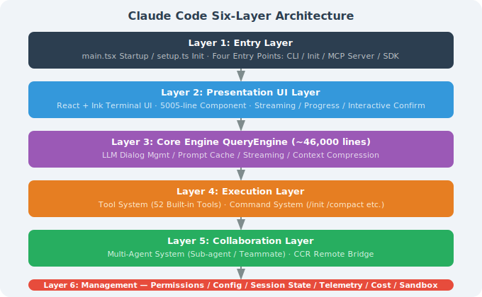
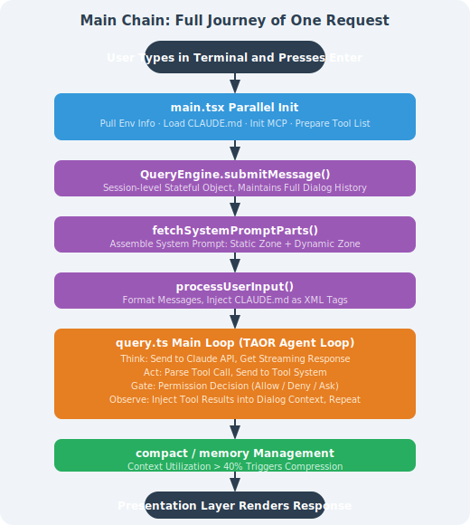
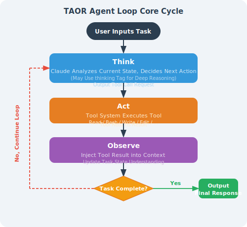
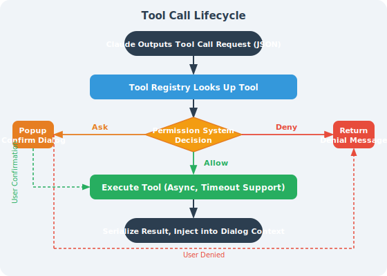

# 15.2 Deep Dive into Core Architecture

> 🏗️ *"The best architectures are the ones where the design decisions are invisible — you only notice them when something goes wrong."*  
> — From Claude Code source code comments (accidentally leaked in March 2026)

---

## From the Outside In: How Does Claude Code Run?

When you type `claude` in the terminal and press Enter, what happens next?

On the surface, you get an interactive AI assistant. But behind the scenes, a carefully designed six-layer architecture is running, handling the complete flow from user input to LLM reasoning, tool execution, and permission control.

The source code leak incident in March 2026 gave engineers their first complete view of this system.

---

## I. Overview of the Six-Layer Architecture

Claude Code uses a strict six-layer architecture, with each layer having clear responsibilities and well-defined boundaries:



**Tech stack**: TypeScript + Bun runtime (not traditional Node.js), bundled into a single `cli.js` file via esbuild for distribution.

---

## II. Main Execution Path: A Request's Complete Journey

The most direct way to understand Claude Code is to trace the complete path of a user input from entry to response:



This loop can continue for dozens of rounds or more, until Claude determines the task is complete or the user interrupts.

---

## III. TAOR Agent Loop: Core Loop Explained

TAOR (Think → Act → Observe → Repeat) is the execution core of Claude Code, and the fundamental reason it differs from "question-and-answer" AI:



**Key design details**:

1. **Parallel tool calls**: Claude can request multiple tools to execute in parallel in a single Think step (e.g., reading multiple files simultaneously), greatly improving efficiency

2. **Loop limit**: There is a built-in maximum iteration count (approximately 200 rounds) to prevent infinite loops from consuming tokens

3. **State awareness**: After each loop, Claude sees the accumulated complete context, not just the result of the latest step

4. **Interrupt mechanism**: Users can press ESC or Ctrl+C to interrupt the current loop at any time

---

## IV. QueryEngine: The 46,000-Line Brain

QueryEngine is the most core and complex module in Claude Code — approximately 46,000 lines of TypeScript code — handling almost all core logic related to LLM interaction:

### Main Responsibilities

```typescript
class QueryEngine {
  // 1. Session state management
  private conversationHistory: Message[];
  private sessionId: string;
  
  // 2. Core method
  async submitMessage(userInput: string): Promise<void> {
    // Build complete context (System Prompt + history + new message)
    const messages = this.buildContextWindow();
    
    // Stream call to Anthropic API
    const stream = await anthropic.messages.stream({
      model: this.model,
      messages,
      system: await getSystemPrompt(this.tools, this.model),
      tools: this.tools.map(t => t.definition),
    });
    
    // Process streaming response (tool calls / text output)
    await this.processStream(stream);
  }
  
  // 3. Context budget control
  private checkContextBudget(): void {
    const usage = this.calculateContextUsage();
    if (usage > 0.4) {  // 40% triggers compaction
      this.triggerCompaction();
    }
  }
}
```

### Three-Level Context Compression Strategy

When context window utilization rises, QueryEngine triggers compression on demand:

| Level | Trigger Condition | Strategy | Information Retained |
|-------|------------------|----------|---------------------|
| **microcompact** | Utilization > 40% | Lightweight summary | Retains key decisions and file change records |
| **autocompact** | Utilization > 60% | Deep compression | Retains only the most important context summary |
| **full compact** | Manual /compact or utilization > 80% | Complete reset | Retains only core state, reloads CLAUDE.md |

**Long-term memory (memdir)**: Independent of context compression, used for cross-session persistence of important information. Written to disk at session end, restored at the next session.

---

## V. Tool System: The Tool Execution Engine

### Tool Call Lifecycle



### Built-in Tool Categories

Claude Code has 52 built-in tools, grouped by type:

**File operation tools** (most commonly used):
- `Read`: Read files, supports line number ranges, PDFs, images, Jupyter Notebooks
- `Write`: Write/overwrite files (must Read first)
- `Edit`: Precise string replacement (safer than Write, only sends diffs)
- `Glob`: File pattern search (`**/*.tsx`)
- `Grep`: Content search (based on ripgrep, supports regex)

**Execution tools**:
- `Bash`: Execute arbitrary shell commands (subject to permission control)

**Agent collaboration tools**:
- `Agent`: Create and dispatch sub-Agents
- `SendMessage`: Send messages to teammates
- `TaskCreate/Update/List`: Task management

**UI interaction tools**:
- `AskUserQuestion`: Ask the user a question (supports single/multiple choice, code preview)
- `EnterPlanMode`: Enter planning mode and wait for user approval

### The FileEditTool "Read Before Edit" Principle

This is an important engineering constraint in Claude Code:

```
Before editing any file, you must first call the Read tool to read the file's current content.

Reasons:
1. Prevents Claude from blindly modifying files based on "assumed content"
2. Ensures the old_string provided to the Edit tool actually exists in the file
3. Avoids errors caused by file version inconsistencies

This is not a prompt-level suggestion but a tool-level hard constraint —
if you haven't Read first, the Edit tool will return an error.
```

---

## VI. React + Ink: Why Use React to Render the Terminal?

A surprising architectural decision: Claude Code uses **React + Ink** to build the terminal UI.

### What Is Ink?

[Ink](https://github.com/vadimdemedes/ink) is a library that allows building command-line interfaces with React components. It maps React's virtual DOM to terminal ANSI escape code output:

```tsx
// This is how Claude Code's terminal output is actually generated
function ConversationView({ messages }: Props) {
  return (
    <Box flexDirection="column">
      {messages.map(msg => (
        <MessageBlock
          key={msg.id}
          role={msg.role}
          content={msg.content}
          isStreaming={msg.isStreaming}
        />
      ))}
      <InputBox onSubmit={handleSubmit} />
    </Box>
  );
}
```

### Why This Approach?

1. **Real-time updates**: React's reactive updates make rendering streaming output simple — every time the LLM outputs a token, just update the corresponding state, and React automatically handles DOM diffing and terminal refresh

2. **Complex interactions**: Complex interactions like single/multiple choice prompts, code previews, and progress bars are much clearer to describe with React components than with hand-written ANSI code

3. **Code reuse**: Some UI logic can be shared between the CLI and web versions

4. **Development efficiency**: The Anthropic team is familiar with React; using Ink allows reusing existing React knowledge

**Trade-off**: 5,005 lines of React component code with 22 levels of nesting depth — one of the most complex parts of the Claude Code codebase.

---

## VII. Four Entry Modes

`setup.ts` determines which mode to run in at startup based on parameters:

| Entry Mode | Trigger | Characteristics |
|-----------|---------|----------------|
| **CLI mode** | Run `claude` directly | Interactive terminal UI, supports all features |
| **Headless mode** | `claude -p "..."` or `--print` | No UI, suitable for CI/CD, single task execution |
| **MCP Server mode** | `claude --mcp-server` | Runs as an MCP server, callable by other tools |
| **SDK mode** | Called via Agent SDK | Called as a sub-Agent by another Claude Code instance |

---

## Section Summary

| Concept | Key Points |
|---------|-----------|
| **Six-layer architecture** | Entry → Display → QueryEngine → Execution → Collaboration → Management, clearly layered responsibilities |
| **TAOR loop** | Think → Act → Observe → Repeat, can continue for dozens of rounds until task completion |
| **QueryEngine** | 46K-line core engine, responsible for context management, compression, and LLM communication |
| **Tool System** | 52 built-in tools; "read before edit" hard constraint prevents blind modification |
| **React + Ink** | Renders terminal UI with React components, supports real-time streaming updates |
| **Parallel tool calls** | A single Think step can execute multiple tools concurrently, improving execution efficiency |

> 💡 **Core insight**: Claude Code's architecture clearly separates "AI intelligence" (QueryEngine) from "reliable execution" (Tool System + permission management) — this is exactly the engineering philosophy of Chapter 9 (Harness Engineering) in practice.

---

*Previous section: [15.1 Getting to Know Claude Code: From Zero to Hands-On](./01_introduction.md)*  
*Next section: [15.3 Source Code Decoded: System Prompt and Permission Engineering](./03_source_code_analysis.md)*