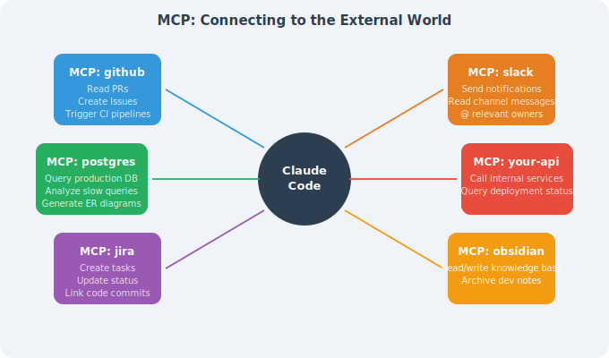
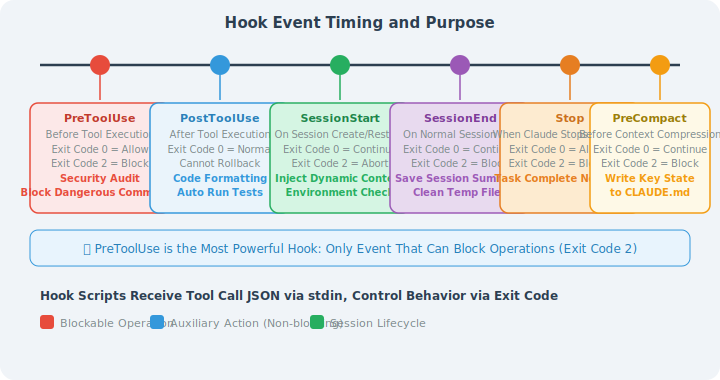
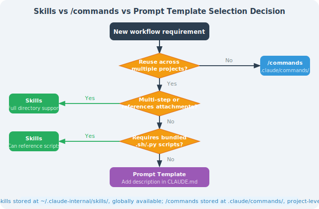
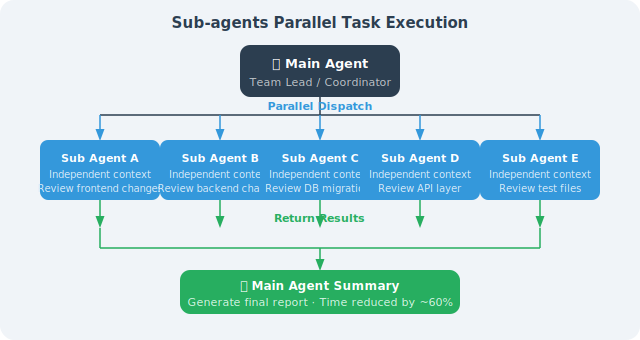
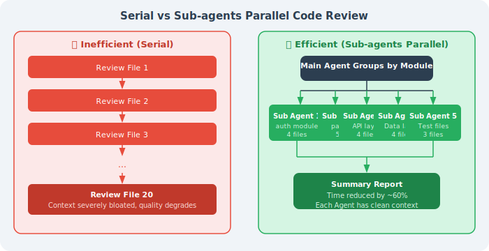
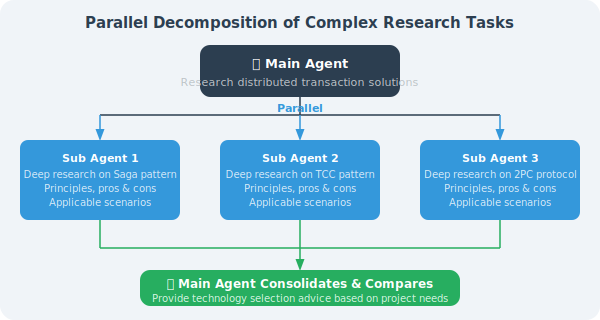
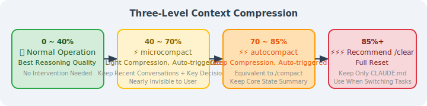
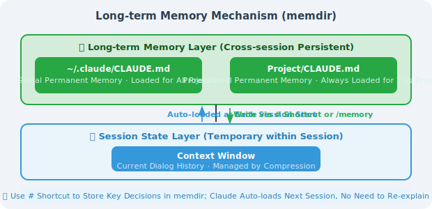

# 15.4 Advanced Usage: MCP, Hooks, and Skills

> 🔧 *"Tools are not obstacles — tools are leverage. The truly skilled engineer isn't the one who runs fastest, but the one who configures their Agent best."*

---

## Opening: From "Using Tools" to "Building Tools"

Most people use Claude Code like this: open a terminal, start a conversation, and ask it to write code or fix bugs.

But Claude Code's real power lies in its extensibility. Through MCP, Hooks, and Skills, you can transform Claude Code into a dedicated AI Agent perfectly tailored to your team's workflow — connecting to your database, automating your CI/CD, and encapsulating your team's best practices.

This section dives deep into four advanced mechanisms: **MCP** (connecting to the external tool ecosystem), **Hooks** (event-driven automation), **Skills** (reusable capability packages), and **Sub-agents + context compression** (handling complex long-running tasks).

---

## I. MCP (Model Context Protocol): Connecting to the External World

### 1.1 What Is MCP?

MCP (Model Context Protocol) is an open protocol led by Anthropic that allows AI models to call external systems in a standardized way. Think of MCP as the USB port for AI tools — any "MCP server" that conforms to the protocol specification can be plug-and-play connected to Claude Code.

**MCP's three core primitives**:

| Primitive Type | Purpose | Typical Examples |
|---------------|---------|-----------------|
| **Tools** | Operations/functions the AI can call | Execute database queries, send API requests, create GitHub Issues |
| **Resources** | Data resources the AI can read | Knowledge base documents, real-time monitoring data, project Wikis |
| **Prompts** | Reusable prompt templates | Code review templates, PR description generators, release note generators |

Without MCP, Claude Code can only operate on the local filesystem and execute shell commands. With MCP, it can:



### 1.2 Configuring MCP Servers

MCP servers are registered via configuration files, supporting both **project-level** (`.mcp.json`, committed to git, shared with the team) and **user-level** (`~/.claude/settings.json`, personal and private) configurations.

**Project-level configuration (recommended for teams):**

```json
// .mcp.json (place in project root, commit to git, use env vars for sensitive info)
{
  "mcpServers": {
    "github": {
      "command": "npx",
      "args": ["-y", "@modelcontextprotocol/server-github"],
      "env": {
        "GITHUB_PERSONAL_ACCESS_TOKEN": "${GITHUB_TOKEN}"
      }
    },
    "postgres": {
      "command": "npx",
      "args": [
        "-y",
        "@modelcontextprotocol/server-postgres",
        "postgresql://localhost:5432/mydb"
      ],
      "env": {
        "PGPASSWORD": "${DB_PASSWORD}"
      }
    },
    "slack": {
      "command": "npx",
      "args": ["-y", "@modelcontextprotocol/server-slack"],
      "env": {
        "SLACK_BOT_TOKEN": "${SLACK_BOT_TOKEN}",
        "SLACK_TEAM_ID": "T0XXXXXXX"
      }
    }
  }
}
```

> ⚠️ **Security reminder**: Never hardcode sensitive credentials (tokens, passwords) in `.mcp.json`. Use the `${ENV_VAR}` syntax to reference environment variables; configure actual values in CI/CD secrets or a local `.env` file (added to `.gitignore`).

**User-level configuration (personal private tools):**

```json
// ~/.claude/settings.json
{
  "mcpServers": {
    "obsidian": {
      "command": "npx",
      "args": ["-y", "mcp-obsidian", "/Users/me/Documents/MyVault"]
    },
    "internal-tools": {
      "command": "python",
      "args": ["/Users/me/.tools/internal_mcp.py"],
      "env": {
        "INTERNAL_API_TOKEN": "${INTERNAL_TOKEN}"
      }
    }
  }
}
```

After starting Claude Code, use the `/mcp` command to view the status of all connected MCP servers:

```bash
$ claude
> /mcp
● github      (connected) — 12 tools available
● postgres    (connected) — 6 tools available
● slack       (connected) — 8 tools available
● obsidian    (error)     — Connection failed: vault not found
```

### 1.3 Recommended Practical MCP Servers

| MCP Server | npm Package | Main Use |
|-----------|------------|---------|
| **GitHub** | `@modelcontextprotocol/server-github` | Read/write Issues/PRs/code, automate Code Review |
| **PostgreSQL** | `@modelcontextprotocol/server-postgres` | Query databases, analyze slow queries, generate ER diagrams |
| **Filesystem** | `@modelcontextprotocol/server-filesystem` | Cross-directory file operations (beyond current project scope) |
| **Brave Search** | `@modelcontextprotocol/server-brave-search` | Real-time web search (requires Brave API Key) |
| **Slack** | `@modelcontextprotocol/server-slack` | Send notifications, read channels, search messages |
| **Jira/Confluence** | `mcp-atlassian` | Create/update Jira tasks, link to code commits |
| **Obsidian** | `mcp-obsidian` | Read/write personal knowledge base, accumulate dev notes |
| **Puppeteer** | `@modelcontextprotocol/server-puppeteer` | Browser automation, end-to-end test assistance |

**Real-world case: Using MCP to have Claude Code automatically handle PR Reviews**

```bash
# In Claude Code, describe the goal in natural language:
> Check the last 5 unreviewed PRs, find any with potential security issues,
  write detailed review comments, and notify the responsible person in the Slack #engineering channel

# Claude Code will automatically chain multiple MCP tools to complete the task:
# 1. github.list_pull_requests(state="open", per_page=5)
# 2. github.get_pull_request_diff(pr_number=...)
# 3. [Analyze code security...]
# 4. github.create_review_comment(body="Found SQL injection risk...")
# 5. slack.post_message(channel="#engineering", text="@Alice Your PR #42 needs attention...")
```

### 1.4 Building Your Own MCP Server

When built-in MCP servers don't meet your needs, you can quickly build your own using Python (fastmcp library):

```python
# internal_api_mcp.py
# Wraps the company's internal REST API as MCP tools

import os
import httpx
from mcp.server import FastMCP

app = FastMCP("internal-company-tools")

INTERNAL_API_BASE = "https://api.internal.company.com"
API_TOKEN = os.environ["INTERNAL_API_TOKEN"]
HEADERS = {"Authorization": f"Bearer {API_TOKEN}"}

@app.tool()
async def get_deployment_status(service: str, env: str = "production") -> str:
    """
    Query the deployment status of a specified service in a specified environment.
    
    Args:
        service: Service name, e.g., "payment-service"
        env: Environment name, options: production/staging/dev
    """
    async with httpx.AsyncClient() as client:
        resp = await client.get(
            f"{INTERNAL_API_BASE}/deployments/{service}",
            params={"env": env},
            headers=HEADERS
        )
        data = resp.json()
    return f"{service} @ {env}: v{data['version']} ({data['health']}) - Deployed at: {data['deployed_at']}"

@app.tool()
async def create_incident(
    title: str,
    severity: str,
    description: str,
    affected_services: list[str]
) -> str:
    """
    Create an incident report in the internal system.
    
    Args:
        title: Incident title
        severity: Severity level, P0/P1/P2/P3
        description: Detailed description
        affected_services: List of affected services
    """
    async with httpx.AsyncClient() as client:
        resp = await client.post(
            f"{INTERNAL_API_BASE}/incidents",
            json={
                "title": title,
                "severity": severity,
                "description": description,
                "affected_services": affected_services
            },
            headers=HEADERS
        )
        incident = resp.json()
    return f"Incident created: #{incident['id']} - Follow-up link: {incident['url']}"

@app.resource("deployments://all")
async def get_all_deployments() -> str:
    """Get an overview of the current deployment status of all services"""
    async with httpx.AsyncClient() as client:
        resp = await client.get(f"{INTERNAL_API_BASE}/deployments", headers=HEADERS)
    return resp.text  # Returns deployment overview in YAML format

if __name__ == "__main__":
    app.run()
```

```json
// Register the custom server in .mcp.json
{
  "mcpServers": {
    "internal-api": {
      "command": "python",
      "args": ["tools/internal_api_mcp.py"],
      "env": {
        "INTERNAL_API_TOKEN": "${INTERNAL_API_TOKEN}"
      }
    }
  }
}
```

---

## II. Hooks: Event-Driven Automation

### 2.1 Six Hook Events Explained

Hooks are Claude Code's event hook system, allowing you to inject custom logic at key points when Claude executes operations. This is a core tool of Harness Engineering — through Hooks, you can **enforce standards at the system level**, rather than relying on Claude to "remember" to follow them.



> 💡 **PreToolUse is the most powerful Hook**: it is the only event that can **block an operation** (exit code 2), and can be used to implement security mechanisms like "any dangerous command must go through approval."

### 2.2 Hook Configuration Format (settings.json)

Hooks are configured in `.claude/settings.json` (project-level) or `~/.claude/settings.json` (global):

```json
{
  "hooks": {
    "PreToolUse": [
      {
        "matcher": "Bash",
        "hooks": [
          {
            "type": "command",
            "command": "python3 ~/.claude/hooks/audit_bash.py"
          }
        ]
      }
    ],
    "PostToolUse": [
      {
        "matcher": "Edit|Write|MultiEdit",
        "hooks": [
          {
            "type": "command",
            "command": "bash ~/.claude/hooks/auto_format.sh"
          }
        ]
      }
    ],
    "Stop": [
      {
        "matcher": ".*",
        "hooks": [
          {
            "type": "command",
            "command": "bash ~/.claude/hooks/notify_complete.sh"
          }
        ]
      }
    ],
    "PreCompact": [
      {
        "matcher": ".*",
        "hooks": [
          {
            "type": "command",
            "command": "python3 ~/.claude/hooks/save_state.py"
          }
        ]
      }
    ]
  }
}
```

Hook scripts receive tool call JSON data via **standard input (stdin)**:

```json
// Example of data received on stdin during PreToolUse
{
  "hook_event_name": "PreToolUse",
  "tool_name": "Bash",
  "tool_input": {
    "command": "rm -rf /tmp/old-data",
    "description": "Clean up temporary data"
  },
  "session_id": "sess_abc123xyz"
}
```

### 2.3 Practical Hook Examples

#### Scenario 1: Security Audit Hook (PreToolUse)

Log all Bash commands and automatically block high-risk operations:

```python
#!/usr/bin/env python3
# ~/.claude/hooks/audit_bash.py

import json
import sys
import re
from datetime import datetime
from pathlib import Path

# Read Hook event data from stdin
event = json.loads(sys.stdin.read())

tool_name = event.get("tool_name", "")
tool_input = event.get("tool_input", {})
command = tool_input.get("command", "")
session_id = event.get("session_id", "unknown")

# Write to audit log (record regardless of whether blocked)
audit_log = Path.home() / ".claude" / "audit.log"
audit_log.parent.mkdir(exist_ok=True)
with open(audit_log, "a") as f:
    log_entry = {
        "timestamp": datetime.now().isoformat(),
        "session_id": session_id,
        "tool": tool_name,
        "command": command
    }
    f.write(json.dumps(log_entry) + "\n")

# High-risk command pattern detection
DANGER_PATTERNS = [
    (r"rm\s+-rf\s+/(?!\w)",     "Deleting files under root directory"),
    (r"rm\s+-rf\s+~",           "Deleting home directory"),
    (r"curl\s+.*\|\s*(?:ba)?sh","Piping remote script execution (supply chain attack risk)"),
    (r"chmod\s+777",             "Setting 777 permissions (security risk)"),
    (r">\s*/etc/(?!hosts)",      "Overwriting system config files"),
    (r"dd\s+if=.*of=/dev/",     "Writing directly to block device"),
]

for pattern, reason in DANGER_PATTERNS:
    if re.search(pattern, command):
        # Output human-readable block reason
        print(f"⛔ [Security Audit] Operation blocked")
        print(f"   Reason: {reason}")
        print(f"   Command: {command}")
        print(f"   If you need to run this, please execute it manually in the terminal.")
        sys.exit(2)  # Exit code 2 = block operation; Claude will receive this message

# Allow to continue
sys.exit(0)
```

#### Scenario 2: Code Standards Hook (PostToolUse)

Automatically run the appropriate Linter/Formatter after file edits:

```bash
#!/bin/bash
# ~/.claude/hooks/auto_format.sh
# PostToolUse Hook: auto-format after file save

# Get file path from environment variable (automatically injected by Claude Code)
FILE_PATH="${CLAUDE_TOOL_RESULT_FILE_PATH:-}"

# If no file path (not a file operation), exit directly
if [[ -z "$FILE_PATH" ]] || [[ ! -f "$FILE_PATH" ]]; then
    exit 0
fi

# Get file extension
EXT="${FILE_PATH##*.}"

# Choose formatting tool based on file type
FORMAT_RESULT=0
case "$EXT" in
    py)
        # Python: format first, then check
        ruff format "$FILE_PATH" 2>/dev/null && \
        ruff check --fix "$FILE_PATH" 2>/dev/null
        FORMAT_RESULT=$?
        ;;
    ts|tsx|js|jsx)
        # TypeScript/JavaScript: use Prettier
        npx prettier --write "$FILE_PATH" 2>/dev/null
        FORMAT_RESULT=$?
        ;;
    go)
        gofmt -w "$FILE_PATH" 2>/dev/null
        FORMAT_RESULT=$?
        ;;
    rs)
        rustfmt "$FILE_PATH" 2>/dev/null
        FORMAT_RESULT=$?
        ;;
    *)
        exit 0  # Unknown type, skip
        ;;
esac

# Give Claude a confirmation signal when formatting succeeds
if [[ $FORMAT_RESULT -eq 0 ]]; then
    echo "✅ Auto-formatted: $(basename "$FILE_PATH")"
fi

exit 0  # PostToolUse doesn't block; it's just a helper action
```

#### Scenario 3: Task Completion Notification Hook (Stop Event)

Automatically send a Slack notification when Claude finishes a task and stops responding:

```bash
#!/bin/bash
# ~/.claude/hooks/notify_complete.sh
# Stop Hook: send Slack notification when Claude stops responding

SLACK_WEBHOOK_URL="${SLACK_WEBHOOK_URL:-}"

# If no Webhook configured, exit silently
if [[ -z "$SLACK_WEBHOOK_URL" ]]; then
    exit 0
fi

PROJECT_NAME=$(basename "$(pwd)")
TIMESTAMP=$(date +"%Y-%m-%d %H:%M:%S")

# Build Slack Block Kit message
PAYLOAD=$(cat <<EOF
{
  "blocks": [
    {
      "type": "header",
      "text": {
        "type": "plain_text",
        "text": "🤖 Claude Code Task Complete"
      }
    },
    {
      "type": "section",
      "fields": [
        {"type": "mrkdwn", "text": "*Project:*\n\`${PROJECT_NAME}\`"},
        {"type": "mrkdwn", "text": "*Completed at:*\n${TIMESTAMP}"}
      ]
    }
  ]
}
EOF
)

# Send notification asynchronously (don't block Claude from exiting)
curl -s -X POST \
    -H "Content-type: application/json" \
    --data "$PAYLOAD" \
    "$SLACK_WEBHOOK_URL" &

exit 0
```

---

## III. Skills: Reusable Capability Packages

### 3.1 What Are Skills?

Skills are Claude Code's **workflow template system** — packaging "things you repeatedly tell Claude" into once-defined, permanently available capability modules.

Whenever you find yourself telling Claude the same things across multiple projects ("Help me do a Code Review, focusing on these dimensions..." or "Help me generate a CHANGELOG in this format..."), that workflow should be turned into a Skill.

**Core differences between Skills and `/commands`:**

| Dimension | Skills | `/commands` |
|-----------|--------|-------------|
| **Storage location** | `~/.claude-internal/skills/` | `.claude/commands/` |
| **Scope** | **Global**, available in all projects | **Project-level**, current project only |
| **Content complexity** | Full Markdown instructions + attached scripts/templates | Single Markdown prompt file |
| **Best for** | Cross-project general workflows (Code Review, deployment process) | Project-specific operations (run tests, update version number) |
| **Trigger method** | Skill tool automatically recognizes and calls | User manually types `/command-name` |

### 3.2 Creating Your Own Skill

Using a "standardized Code Review" Skill as an example, the complete directory structure is:

```
~/.claude-internal/skills/
└── code-review/
    ├── SKILL.md                    # Skill main file (required)
    ├── checklists/
    │   ├── security.md             # Security review checklist
    │   ├── performance.md          # Performance review checklist
    │   └── maintainability.md      # Maintainability checklist
    └── templates/
        └── review-report.md        # Review report template
```

**SKILL.md example (Code Review Skill):**

```markdown
# Skill: Code Review

Perform a systematic multi-dimensional review of code changes and output a structured review report.

## Trigger Conditions
Trigger this Skill when the user asks for a code review, PR review, or code quality check.

---

## Execution Flow

### Step 1: Get the scope of changes
If it's a PR Review, first run:
```bash
git diff main...HEAD --stat      # Understand the list of changed files
git diff main...HEAD             # Get the complete diff
```

If it's a direct code review, read the relevant files.

### Step 2: Review by dimension

**Security** (refer to checklists/security.md):
- SQL injection, XSS, CSRF risks
- Whether sensitive information is hardcoded (passwords, tokens, private keys)
- Whether permission checks are complete (authentication/authorization boundaries)
- Whether input validation covers all entry points

**Performance** (refer to checklists/performance.md):
- Whether there are N+1 query problems
- Whether there are unnecessary database/API calls inside loops
- Whether large lists have pagination
- Whether there are obvious memory leak risks

**Maintainability** (refer to checklists/maintainability.md):
- Whether function length is reasonable (recommended < 50 lines)
- Whether naming is clear and self-describing
- Whether complex logic has comments
- Whether test coverage is sufficient

### Step 3: Output report

Use the templates/review-report.md format to output:
- **🔴 Critical issues** (must fix, blocks merge): include filename, line number, fix suggestions
- **🟡 Improvement suggestions** (non-blocking, but recommended): list improvement directions
- **🟢 Strengths** (things worth affirming): point out at least 1-2 highlights
- **📊 Overall assessment**: Recommend merge / Fix then merge / Needs major revision

---

## Constraints
- Report in English
- Each issue includes specific filename and line number
- Critical issues must include example fix code
- Report total length no more than 800 words, focus on key points
```

### 3.3 Skills vs Prompt Templates: How to Choose?



---

## IV. Sub-agents: Parallel Task Execution

### 4.1 How AgentTool Works

Claude Code dispatches **sub-Agents** to execute specialized tasks through the built-in `AgentTool`. Each sub-Agent is a completely independent Claude instance:



**Four key characteristics of sub-Agents:**

1. **Independent context**: Sub-Agents have a fresh context window, not polluted by the main Agent's long conversation history, resulting in higher reasoning quality
2. **Task isolation**: A sub-Agent's errors and intermediate states don't spread to other Agents (counters the "contamination effect")
3. **bubble permission mode**: Sub-Agents use the internal `bubble` permission mode; permission decisions bubble up to the parent Agent for handling, maintaining security boundaries
4. **Parallel acceleration**: Multiple sub-Agents can run simultaneously, parallelizing originally sequential tasks and significantly reducing execution time

### 4.2 Practical Scenarios

**Scenario 1: Parallel code review**



**Scenario 2: Multi-file refactoring coordination**

```
# Migrating the legacy UserService to the new AuthService

Main Agent:
1. First scan all files referencing UserService, group by module
2. Dispatch a sub-Agent for each module (working in an independent git worktree)
3. Wait for all sub-Agents to complete the migration
4. Merge changes from all worktrees
5. Dispatch a verification Agent to run the full test suite
6. After confirming all tests pass, merge to the main branch
```

**Scenario 3: Complex research task decomposition**



---

## V. Context Compression (Three-Level Strategy)

As a conversation deepens, the context window gradually fills up — research data shows that **when context utilization exceeds 70%, reasoning quality begins to noticeably decline** (Claude starts "cutting corners": silently skipping steps, simplifying output, prematurely claiming completion).

Claude Code provides a three-level compression strategy to address this:

### 5.1 Three-Level Compression Mechanism



```
Above 85%: ⚡⚡⚡ Recommend manual /clear (complete reset)
           Retain: project configuration in CLAUDE.md (auto-loaded next time)
           Discard: all conversation history
           Use when: switching to a completely new task, or when context is severely polluted
```

### 5.2 Manual Compression Control

```bash
# Method 1: Manually trigger compression in conversation, specifying what to retain
> /compact Please retain: the PaymentService currently being refactored,
           and the interface design we decided on: createOrder/cancelOrder/refund

# Method 2: Complete reset, start a new task
> /clear

# Method 3: Check current context usage
> /status
```

### 5.3 memdir: Long-Term Memory Mechanism

Claude Code manages **long-term memory** and **session state** separately, preventing important information from being lost during compression:



**Two ways to write information to long-term memory:**

```bash
# Method 1: # shortcut (fastest)
> # The payment module database connection pool maximum must be 50; exceeding it triggers the RDS connection limit

# Method 2: /memory command (manageable)
> /memory
# Opens the memory editor; you can view, edit, and delete all saved memory entries
```

> 💡 **Best practice**: After each long task, use the `#` shortcut to save key decisions ("why we chose this approach") and constraints ("this function must not be touched") to memdir. Claude will automatically load them in the next session, so you don't need to re-explain the background.

---

## Section Summary

| Mechanism | Core Value | Configuration Location | Learning Priority |
|-----------|-----------|----------------------|------------------|
| **MCP** | Connect to external systems like GitHub/databases/Slack | `.mcp.json` | ⭐⭐⭐ High |
| **PreToolUse Hook** | Security audit, dangerous operation interception (the only mechanism that can block operations) | `settings.json` | ⭐⭐⭐ High |
| **PostToolUse Hook** | Auto-format, Lint, trigger tests | `settings.json` | ⭐⭐⭐ High |
| **Stop Hook** | Task completion notification (Slack/email/custom) | `settings.json` | ⭐⭐ Medium |
| **PreCompact Hook** | Protect state that must not be lost | `settings.json` | ⭐⭐ Medium |
| **Skills** | Cross-project workflow reuse, eliminate repetitive communication | `~/.claude-internal/skills/` | ⭐⭐ Medium |
| **Sub-agents** | Parallel processing of complex long tasks, maintain reasoning quality | Triggered by natural language instructions | ⭐⭐ Medium |
| **Context compression** | Long-task quality assurance, counter context anxiety | `/compact`, `/clear` | ⭐⭐ Medium |
| **memdir** | Cross-session knowledge accumulation, avoid repeated background explanations | `#` shortcut or `/memory` | ⭐⭐ Medium |

> 💡 **Core insight**: MCP + Hooks is the golden combination for advanced Claude Code usage — MCP expands the world Claude can reach, and Hooks ensures every step Claude takes is under your control. Combined, you can confidently let Claude Code run automatically for extended periods in production environments.
>
> If you can only pick one advanced feature to start with, start with **PostToolUse Hook (auto-run linter after saving files)** — 10 lines of shell script that immediately raises the floor of code quality.

---

*Previous section: [15.3 Source Code Decoded: System Prompt and Permission Engineering](./03_source_code_analysis.md)*

*Next section: [15.5 Production Practice: Using Claude Code Effectively in Teams](./05_best_practices.md)*