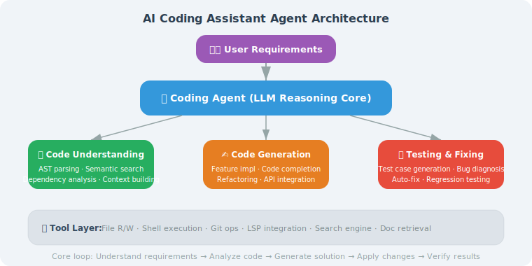

# Project Architecture Design

> **Section Goal**: Design the overall architecture of an AI coding assistant, clarifying the responsibilities and interactions of each module.

---

## Project Goals

We want to build an AI coding assistant that can:
- Understand the structure and logic of a code repository
- Answer questions about code
- Generate new code and modify existing code
- Automatically generate tests and fix bugs

This is not a simple "code completion" tool, but an Agent that understands project context and performs multi-step reasoning.

> 📄 **Frontier Product Comparison**: Current leading Coding Agent products/projects have different architectural orientations [1][2]:
>
> | Product | Architecture Features | Core Advantages |
> |---------|----------------------|----------------|
> | **Devin** (Cognition AI) | Fully autonomous Agent + virtual computing environment | End-to-end development tasks, including browser and terminal |
> | **SWE-Agent** (Princeton) [1] | Agent-Computer Interface (ACI) design | Carefully designed file editing and navigation command interface |
> | **OpenHands** (UIUC) | Modular Agent framework + Docker sandbox | Open-source, extensible, active community |
> | **Cursor** (Anysphere) | Deep IDE integration + context awareness | Real-time code completion + Agent mode, best user experience |
> | **Codex CLI** (OpenAI) | Terminal-native + multi-model support | Open-source, lightweight, deeply integrated with OpenAI ecosystem |
>
> The common architectural features of these products are: **code understanding (AST/LSP) + tool calling (file editing/terminal) + multi-step reasoning (ReAct/Plan-and-Solve) + sandbox execution**. Our project will follow this architectural pattern.



---

## Overall Architecture

<!-- Architecture diagram in SVG above -->

---

## Core Component Design

```python
from dataclasses import dataclass, field
from enum import Enum
from typing import Optional

class TaskType(Enum):
    """Task types supported by the coding assistant"""
    CODE_QA = "code_qa"              # Code Q&A
    CODE_GENERATE = "code_generate"  # Code generation
    CODE_MODIFY = "code_modify"      # Code modification
    CODE_REVIEW = "code_review"      # Code review
    TEST_GENERATE = "test_generate"  # Test generation
    BUG_FIX = "bug_fix"            # Bug fixing
    EXPLAIN = "explain"            # Code explanation

@dataclass
class ProjectContext:
    """Project context information"""
    root_path: str
    language: str
    framework: Optional[str] = None
    file_tree: list[str] = field(default_factory=list)
    dependencies: dict = field(default_factory=dict)
    
@dataclass
class CodingTask:
    """Coding task"""
    task_type: TaskType
    description: str
    target_files: list[str] = field(default_factory=list)
    context: Optional[ProjectContext] = None
    constraints: list[str] = field(default_factory=list)

class CodingAssistant:
    """AI Coding Assistant main class"""
    
    def __init__(self, llm, project_path: str):
        self.llm = llm
        self.project_path = project_path
        self.context = self._build_context()
    
    def _build_context(self) -> ProjectContext:
        """Build project context"""
        import os
        
        # Scan file tree
        file_tree = []
        for root, dirs, files in os.walk(self.project_path):
            # Skip hidden directories and common ignored directories
            dirs[:] = [d for d in dirs 
                      if not d.startswith('.') 
                      and d not in ('node_modules', '__pycache__', 'venv')]
            
            for f in files:
                rel_path = os.path.relpath(
                    os.path.join(root, f), self.project_path
                )
                file_tree.append(rel_path)
        
        # Detect language and framework
        language = self._detect_language(file_tree)
        framework = self._detect_framework(file_tree)
        
        return ProjectContext(
            root_path=self.project_path,
            language=language,
            framework=framework,
            file_tree=file_tree[:200]  # Limit count
        )
    
    def _detect_language(self, files: list[str]) -> str:
        """Detect the project's primary language"""
        ext_count = {}
        lang_map = {
            '.py': 'python', '.js': 'javascript', '.ts': 'typescript',
            '.java': 'java', '.go': 'go', '.rs': 'rust',
        }
        
        for f in files:
            ext = os.path.splitext(f)[1]
            if ext in lang_map:
                ext_count[ext] = ext_count.get(ext, 0) + 1
        
        if ext_count:
            most_common = max(ext_count, key=ext_count.get)
            return lang_map.get(most_common, "unknown")
        return "unknown"
    
    def _detect_framework(self, files: list[str]) -> str:
        """Detect the framework being used"""
        indicators = {
            "requirements.txt": "python",
            "package.json": "node",
            "Cargo.toml": "rust",
            "go.mod": "go",
        }
        
        for f in files:
            if os.path.basename(f) in indicators:
                return indicators[os.path.basename(f)]
        return None
    
    async def handle(self, task: CodingTask) -> str:
        """Handle a coding task"""
        task.context = self.context
        
        handlers = {
            TaskType.CODE_QA: self._handle_qa,
            TaskType.CODE_GENERATE: self._handle_generate,
            TaskType.CODE_REVIEW: self._handle_review,
            TaskType.BUG_FIX: self._handle_bug_fix,
            TaskType.EXPLAIN: self._handle_explain,
        }
        
        handler = handlers.get(task.task_type)
        if handler:
            return await handler(task)
        else:
            return f"Task type not yet supported: {task.task_type.value}"
    
    async def _handle_qa(self, task: CodingTask) -> str:
        """Handle code Q&A"""
        # Search relevant code → build context → LLM answers
        relevant_code = self._search_relevant_code(task.description)
        
        prompt = f"""Based on the following project code, answer the user's question.

Project language: {task.context.language}
Relevant code:
{relevant_code}

Question: {task.description}
"""
        response = await self.llm.ainvoke(prompt)
        return response.content
    
    async def _handle_generate(self, task):
        """Handle code generation"""
        prompt = f"""Please generate code based on the following requirements.

Project language: {task.context.language}
Requirements: {task.description}
Constraints: {', '.join(task.constraints) if task.constraints else 'None'}

Please generate complete, runnable code."""
        
        response = await self.llm.ainvoke(prompt)
        return response.content
    
    async def _handle_review(self, task):
        """Handle code review"""
        code = self._read_files(task.target_files)
        
        prompt = f"""Please review the following code and identify:
1. Potential bugs
2. Performance issues
3. Security vulnerabilities
4. Code style issues
5. Improvement suggestions

Code:
{code}"""
        
        response = await self.llm.ainvoke(prompt)
        return response.content
    
    async def _handle_bug_fix(self, task):
        """Handle bug fixing"""
        code = self._read_files(task.target_files)
        
        prompt = f"""The following code has a bug. Please find and fix it.

Bug description: {task.description}

Code:
{code}

Please provide the complete fixed code and an explanation of the fix."""
        
        response = await self.llm.ainvoke(prompt)
        return response.content
    
    async def _handle_explain(self, task):
        """Handle code explanation"""
        code = self._read_files(task.target_files)
        
        prompt = f"""Please explain the following code in plain language:

{code}

Requirements:
1. Start with an overview of the overall functionality
2. Explain each important function/class individually
3. Describe key design patterns or algorithms"""
        
        response = await self.llm.ainvoke(prompt)
        return response.content
    
    def _search_relevant_code(self, query: str) -> str:
        """Search for relevant code (simplified; use vector search in production)"""
        # Simple keyword matching search
        import os
        
        results = []
        keywords = query.lower().split()
        
        for filepath in self.context.file_tree[:50]:
            full_path = os.path.join(self.project_path, filepath)
            try:
                with open(full_path, 'r') as f:
                    content = f.read()
                    if any(kw in content.lower() for kw in keywords):
                        results.append(f"--- {filepath} ---\n{content[:500]}")
            except (UnicodeDecodeError, FileNotFoundError):
                continue
        
        return "\n\n".join(results[:5]) if results else "No relevant code found"
    
    def _read_files(self, file_paths: list[str]) -> str:
        """Read file contents"""
        import os
        
        contents = []
        for path in file_paths:
            full_path = os.path.join(self.project_path, path)
            try:
                with open(full_path) as f:
                    contents.append(f"--- {path} ---\n{f.read()}")
            except FileNotFoundError:
                contents.append(f"--- {path} ---\n[File not found]")
        
        return "\n\n".join(contents)
```

---

## Summary

| Component | Responsibility |
|-----------|---------------|
| User Interface Layer | Receive user instructions, display results |
| Agent Core Layer | Intent understanding, task planning, execution control |
| Tool Layer | Code search, file operations, AST analysis |
| Knowledge Layer | Project indexing, vector retrieval |

> **Next Section Preview**: With the architecture in place, let's implement code understanding capabilities — enabling the Agent to truly "read" code.

---

[Next: 19.2 Code Understanding and Analysis →](./02_code_understanding.md)

---

## References

[1] YANG J, JIMENEZ C E, WETTIG A, et al. SWE-agent: Agent-computer interfaces enable automated software engineering[C]//NeurIPS. 2024.

[2] WANG X, CHEN Y, YUAN L, et al. OpenHands: An open platform for AI software developers as generalist agents[R]. arXiv preprint arXiv:2407.16741, 2024.
