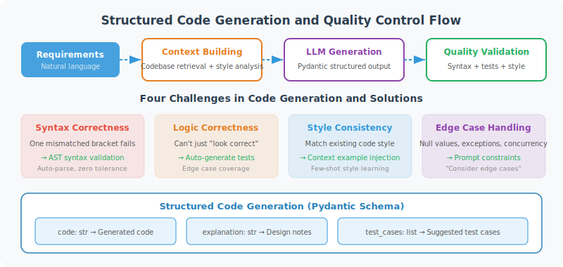

# Code Generation and Modification

> **Section Goal**: Implement code generation and modification capabilities for the Agent, ensuring controllable code quality.



---

## Challenges of Code Generation

Generating code is much harder than generating regular text:
- Must be syntactically correct (one mismatched bracket causes an error)
- Must be logically correct (can't just "look right")
- Must be consistent with existing code style
- Must consider edge cases

---

## Structured Code Generation

```python
from pydantic import BaseModel, Field
from langchain_openai import ChatOpenAI
from langchain_core.prompts import ChatPromptTemplate

class GeneratedCode(BaseModel):
    """Structured code generation result"""
    code: str = Field(description="Generated code")
    language: str = Field(description="Programming language")
    explanation: str = Field(description="Code explanation")
    dependencies: list[str] = Field(
        default_factory=list, description="Dependencies to install"
    )
    usage_example: str = Field(
        default="", description="Usage example"
    )

class CodeGenerator:
    """Code generator"""
    
    def __init__(self, llm: ChatOpenAI):
        self.llm = llm.with_structured_output(GeneratedCode)
    
    async def generate(
        self,
        requirement: str,
        language: str = "python",
        style_guide: str = None
    ) -> GeneratedCode:
        """Generate code based on requirements"""
        
        style_section = ""
        if style_guide:
            style_section = f"\nCode style requirements:\n{style_guide}\n"
        
        prompt = ChatPromptTemplate.from_messages([
            ("system", f"""You are a professional {language} developer.
Please generate high-quality code based on the requirements.

Requirements:
1. Code must be complete and runnable
2. Include necessary error handling
3. Add clear comments and docstrings
4. Follow {language} best practices
{style_section}"""),
            ("human", "{requirement}")
        ])
        
        chain = prompt | self.llm
        result = await chain.ainvoke({"requirement": requirement})
        
        return result

# Usage example
async def demo():
    llm = ChatOpenAI(model="gpt-4o", temperature=0)
    generator = CodeGenerator(llm)
    
    result = await generator.generate(
        requirement="Implement an LRU cache with expiration time",
        language="python"
    )
    
    print(result.code)
    print(f"\nDependencies: {result.dependencies}")
    print(f"\nExplanation: {result.explanation}")
```

---

## Code Modification (Diff Mode)

Modifying existing code is more complex than generating from scratch — it requires understanding context and making precise changes:

```python
class CodeModifier:
    """Code modifier — precise modification based on diff"""
    
    def __init__(self, llm):
        self.llm = llm
    
    async def modify(
        self,
        original_code: str,
        modification_request: str,
        file_path: str
    ) -> dict:
        """Modify code"""
        
        prompt = f"""Please modify the following code according to the modification request.

File: {file_path}

Original code:
```
{original_code}
```

Modification request: {modification_request}

Please return in the following format (JSON):
{{
    "modified_code": "Complete modified code",
    "changes": [
        {{
            "description": "Change description",
            "line_range": "Lines X-Y"
        }}
    ],
    "explanation": "Overall modification explanation"
}}

Notes:
1. Only modify what is necessary, keep other code unchanged
2. Maintain the original code style
3. Ensure the modified code runs correctly
"""
        
        response = await self.llm.ainvoke(prompt)
        import json
        return json.loads(response.content)
    
    async def add_feature(
        self,
        existing_code: str,
        feature_description: str
    ) -> str:
        """Add a new feature to existing code"""
        
        prompt = f"""Add a new feature to the following existing code, maintaining consistency with the existing code style.

Existing code:
```python
{existing_code}
```

New feature requirements: {feature_description}

Requirements:
1. New code integrates naturally into the existing code structure
2. Do not modify the logic of existing functionality
3. Add necessary import statements
4. Add docstrings and comments

Please return the complete modified code directly.
"""
        response = await self.llm.ainvoke(prompt)
        return response.content
```

---

## Code Quality Validation

After generating code, automatically validate quality:

```python
import ast
import subprocess
import tempfile

class CodeValidator:
    """Code quality validator"""
    
    def validate(self, code: str, language: str = "python") -> dict:
        """Validate code quality"""
        results = {
            "syntax_valid": False,
            "style_issues": [],
            "security_issues": [],
            "overall_pass": False
        }
        
        if language == "python":
            results["syntax_valid"] = self._check_python_syntax(code)
            results["style_issues"] = self._check_style(code)
            results["security_issues"] = self._check_security(code)
        
        results["overall_pass"] = (
            results["syntax_valid"]
            and len(results["security_issues"]) == 0
        )
        
        return results
    
    def _check_python_syntax(self, code: str) -> bool:
        """Check Python syntax"""
        try:
            ast.parse(code)
            return True
        except SyntaxError:
            return False
    
    def _check_style(self, code: str) -> list[str]:
        """Check code style"""
        issues = []
        lines = code.split('\n')
        
        for i, line in enumerate(lines, 1):
            if len(line) > 120:
                issues.append(f"Line {i} exceeds 120 characters")
            if line.rstrip() != line:
                issues.append(f"Line {i} has trailing whitespace")
        
        return issues
    
    def _check_security(self, code: str) -> list[str]:
        """Check security issues"""
        issues = []
        
        dangerous = {
            "eval(": "Uses eval(), potential code injection risk",
            "exec(": "Uses exec(), potential code injection risk",
            "os.system(": "Uses os.system(), recommend using subprocess",
            "pickle.loads(": "Uses pickle.loads(), potential deserialization attack risk",
        }
        
        for pattern, warning in dangerous.items():
            if pattern in code:
                issues.append(warning)
        
        return issues
```

---

## Summary

| Component | Function |
|-----------|---------|
| CodeGenerator | Generate complete code based on requirements |
| CodeModifier | Precisely modify existing code |
| CodeValidator | Automatic syntax/style/security validation |

> **Next Section Preview**: Code is written, now it needs testing. Let the Agent automatically generate tests and fix bugs.

---

[Next: 19.4 Test Generation and Bug Fixing →](./04_testing_debugging.md)
