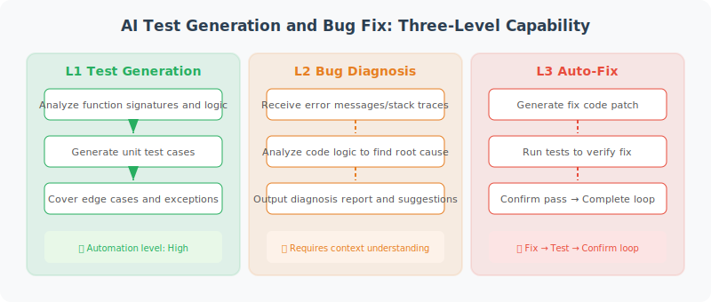

# Test Generation and Bug Fixing

> **Section Goal**: Enable the AI coding assistant to automatically generate unit tests, and locate and fix bugs in code.



---

## Testing Strategy Overview

An AI coding assistant can play three levels of roles in testing:

| Level | Capability | Description |
|-------|-----------|-------------|
| **L1 Test Generation** | Automatically generate unit tests | Analyze function signatures and logic, generate test cases |
| **L2 Bug Diagnosis** | Analyze errors and locate root causes | Understand error messages, stack traces, code logic |
| **L3 Auto-Fix** | Generate fix code and verify | Fix → run tests → confirm passing closed loop |

---

## Automatic Test Generation

```python
class TestGenerator:
    """Automatic test generator"""
    
    def __init__(self, llm):
        self.llm = llm
    
    async def generate_tests(
        self,
        source_code: str,
        file_path: str,
        framework: str = "pytest"
    ) -> str:
        """Automatically generate tests for given code"""
        
        prompt = f"""Please generate comprehensive unit tests for the following code.

Source code file: {file_path}
```python
{source_code}
```

Test framework: {framework}

Requirements:
1. Generate at least 2 test cases for each public function/method
2. Cover normal cases, edge cases, and exception cases
3. Test names should clearly express the test intent
4. Use {framework} best practices

Please generate the complete test file code.
"""
        response = await self.llm.ainvoke(prompt)
        return response.content
    
    async def analyze_coverage(
        self,
        source_code: str,
        test_code: str,
    ) -> dict:
        """Analyze test coverage and suggest what tests to add"""
        
        prompt = f"""Analyze the coverage of the following test code against the source code.

Source code:
```python
{source_code}
```

Existing tests:
```python
{test_code}
```

Please analyze:
1. Which functions/branches are already covered by tests
2. Which functions/branches are not yet covered
3. Suggested additional test cases

Return in JSON format:
{{
    "covered": ["List of covered functions/branches"],
    "uncovered": ["List of uncovered functions/branches"],
    "suggestions": ["Descriptions of suggested test cases"]
}}
"""
        response = await self.llm.ainvoke(prompt)
        import json
        return json.loads(response.content)
```

---

## Bug Localization and Fixing

```python
class BugFixer:
    """Bug localization and fixing"""
    
    def __init__(self, llm):
        self.llm = llm
    
    async def diagnose_and_fix(
        self,
        code: str,
        error_message: str,
        file_path: str
    ) -> dict:
        """Diagnose and fix a bug"""
        
        prompt = f"""The following code encountered an error at runtime. Please help diagnose and fix it.

File: {file_path}
Code:
```python
{code}
```

Error message:
```
{error_message}
```

Please analyze:
1. The root cause of the error
2. The location of the problematic code
3. The fix solution

Reply in JSON format:
{{
    "root_cause": "Root cause analysis",
    "bug_location": "Problematic function/line number",
    "fix_description": "Fix solution description",
    "fixed_code": "Complete fixed code"
}}
"""
        
        response = await self.llm.ainvoke(prompt)
        import json
        return json.loads(response.content)
    
    async def suggest_preventive_measures(
        self,
        bug_info: dict
    ) -> list[str]:
        """Based on bug analysis, suggest preventive measures"""
        
        prompt = f"""Based on the following bug analysis, provide 3–5 suggestions to prevent similar issues from recurring:

Root cause: {bug_info['root_cause']}
Location: {bug_info['bug_location']}
Fix: {bug_info['fix_description']}

Please return a list of suggestions (one per line).
"""
        response = await self.llm.ainvoke(prompt)
        return response.content.strip().split('\n')
```

---

## Integrated Use: Test-Diagnose-Fix Closed Loop

```python
async def fix_workflow(llm, code: str, test_code: str):
    """Fix workflow: run tests → find failures → auto-fix → verify fix"""
    
    fixer = BugFixer(llm)
    test_gen = TestGenerator(llm)
    
    # 1. If no tests exist, generate them first
    if not test_code:
        test_code = await test_gen.generate_tests(code, "main.py")
        print("✅ Test cases generated")
    
    # 2. Run tests (simplified demo)
    print("🧪 Running tests...")
    # result = subprocess.run(["python", "-m", "pytest", ...])
    
    # 3. If there are failing tests, let the Agent fix them
    error_msg = "AssertionError: expected 42, got 0"
    
    fix_result = await fixer.diagnose_and_fix(
        code=code,
        error_message=error_msg,
        file_path="main.py"
    )
    
    print(f"🔍 Cause: {fix_result['root_cause']}")
    print(f"🔧 Fix: {fix_result['fix_description']}")
    print(f"📝 Location: {fix_result['bug_location']}")
    
    # 4. Verify fix (regression testing)
    print("🔄 Regression test: verifying fix doesn't introduce new issues...")
    # re-run tests with fixed code
    
    # 5. Preventive suggestions
    preventive = await fixer.suggest_preventive_measures(fix_result)
    print("💡 Preventive suggestions:")
    for suggestion in preventive:
        print(f"  {suggestion}")
    
    return fix_result["fixed_code"]
```

### Best Practices

When integrating AI-generated tests and fixes into the development workflow:

```python
best_practices = {
    "Human review": "AI-generated tests and fix suggestions must be reviewed by humans before merging",
    "Incremental testing": "Generate tests for new/modified code first, gradually cover existing code",
    "Test quality": "Check if AI-generated tests truly validate business logic, not just 'padding coverage'",
    "Fix verification": "After auto-fix, run the full test suite (regression tests) to prevent fixes from introducing new issues",
    "Record and learn": "Record common bug patterns in the knowledge base to help the Agent improve diagnostic accuracy",
}
```

---

## Summary

| Feature | Description |
|---------|-------------|
| Test generation | Automatically generate pytest test cases for code |
| Bug diagnosis | Analyze error messages, locate root causes |
| Auto-fix | Generate fixed code |
| Fix workflow | Closed loop of test → diagnose → fix |

> **Next Section Preview**: Finally, we'll integrate all components into a complete AI coding assistant.

---

[Next: 19.5 Full Project Implementation →](./05_full_implementation.md)
