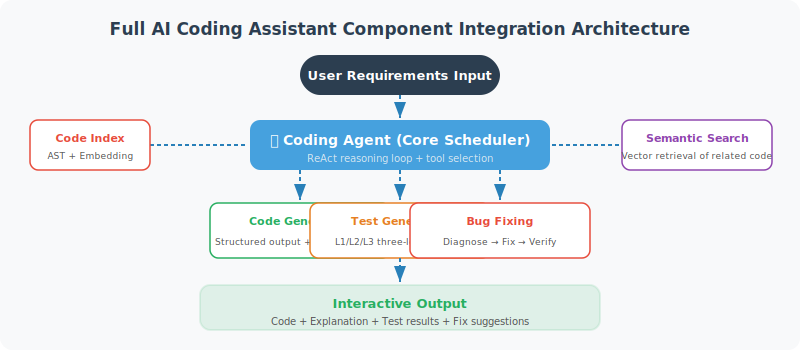

# Full Project Implementation

> **Section Goal**: Integrate the components from previous sections to build an interactive AI coding assistant.



---

## Integrating All Components

```python
"""
Complete AI Coding Assistant
Integrates: code indexing + semantic search + code generation + test generation + bug fixing
"""
import asyncio
import os
from langchain_openai import ChatOpenAI, OpenAIEmbeddings

# Import components implemented in previous sections (import from modules in real projects)
# Full implementations of each component are in the corresponding sections:
# from code_indexer import CodeIndexer         # → Section 19.2
# from code_search import CodeSearchEngine     # → Section 19.2
# from code_generator import CodeGenerator     # → Section 19.3
# from test_generator import TestGenerator     # → Section 19.4
# from bug_fixer import BugFixer               # → Section 19.4
# Note: Before running this section's code, save sections 19.2–19.4 code as independent modules

class AICodeAssistant:
    """AI Coding Assistant — complete implementation"""
    
    def __init__(self, project_path: str):
        self.project_path = project_path
        self.llm = ChatOpenAI(model="gpt-4o", temperature=0)
        self.embeddings = OpenAIEmbeddings()
        
        # Initialize components
        self.indexer = CodeIndexer(project_path)
        entities = self.indexer.build_index()
        
        self.searcher = CodeSearchEngine(entities, self.embeddings)
        self.searcher.build()
        
        self.generator = CodeGenerator(self.llm)
        self.test_gen = TestGenerator(self.llm)
        self.bug_fixer = BugFixer(self.llm)
        
        print(f"✅ Indexed {len(entities)} code entities")
    
    async def chat(self, user_input: str) -> str:
        """Handle user input"""
        
        # Identify intent
        intent = await self._classify_intent(user_input)
        
        if intent == "explain":
            return await self._handle_explain(user_input)
        elif intent == "generate":
            result = await self.generator.generate(user_input)
            return f"```python\n{result.code}\n```\n\n{result.explanation}"
        elif intent == "fix":
            return await self._handle_fix(user_input)
        elif intent == "test":
            return await self._handle_test(user_input)
        elif intent == "search":
            return await self._handle_search(user_input)
        else:
            return await self._handle_general(user_input)
    
    async def _classify_intent(self, user_input: str) -> str:
        """Classify user intent"""
        prompt = f"""Determine the user's intent, reply with only one word:
- explain: explain code
- generate: generate new code
- fix: fix a bug
- test: generate tests
- search: search code
- general: other questions

User said: {user_input}"""
        
        response = await self.llm.ainvoke(prompt)
        return response.content.strip().lower()
    
    async def _handle_explain(self, query: str) -> str:
        """Handle code explanation requests"""
        results = self.searcher.search(query, top_k=3)
        
        if not results:
            return "No relevant code found."
        
        context = "\n\n".join(
            f"**{e.file_path}** - `{e.name}`\n```python\n{e.source}\n```"
            for e in results
        )
        
        prompt = f"Explain the following code in plain language:\n\n{context}\n\nUser question: {query}"
        response = await self.llm.ainvoke(prompt)
        return response.content
    
    async def _handle_search(self, query: str) -> str:
        """Handle code search requests"""
        results = self.searcher.search(query, top_k=5)
        
        output = "🔍 Search results:\n\n"
        for i, entity in enumerate(results, 1):
            output += (
                f"{i}. **{entity.name}** ({entity.entity_type})\n"
                f"   📄 {entity.file_path}:L{entity.start_line}\n"
                f"   📝 {entity.docstring[:100] if entity.docstring else 'No documentation'}\n\n"
            )
        
        return output
    
    async def _handle_fix(self, query: str) -> str:
        """Handle bug fix requests"""
        # Search for potentially relevant code
        results = self.searcher.search(query, top_k=3)
        
        if results:
            code = results[0].source
            fix = await self.bug_fixer.diagnose_and_fix(
                code=code,
                error_message=query,
                file_path=results[0].file_path
            )
            return (
                f"🔍 **Cause**: {fix.get('root_cause', 'Unknown')}\n\n"
                f"🔧 **Fix**: {fix.get('fix_description', '')}\n\n"
                f"```python\n{fix.get('fixed_code', code)}\n```"
            )
        
        return "Please provide specific error information and the relevant file path."
    
    async def _handle_test(self, query: str) -> str:
        """Handle test generation requests"""
        results = self.searcher.search(query, top_k=1)
        
        if results:
            entity = results[0]
            tests = await self.test_gen.generate_tests(
                source_code=entity.source,
                file_path=entity.file_path
            )
            return f"Generated tests for `{entity.file_path}`:\n\n{tests}"
        
        return "Please specify the file or function to generate tests for."
    
    async def _handle_general(self, query: str) -> str:
        """Handle general questions"""
        prompt = f"""You are a professional coding assistant. Current project path: {self.project_path}
        
User question: {query}

Please answer with programming knowledge as much as possible."""
        
        response = await self.llm.ainvoke(prompt)
        return response.content


async def main():
    """Interactive main loop"""
    import sys
    
    project_path = sys.argv[1] if len(sys.argv) > 1 else "."
    
    print("🤖 AI Coding Assistant")
    print(f"📁 Project: {os.path.abspath(project_path)}")
    print("=" * 50)
    print("Type 'quit' to exit\n")
    
    assistant = AICodeAssistant(project_path)
    
    while True:
        user_input = input("You: ").strip()
        
        if user_input.lower() in ('quit', 'exit', 'q'):
            print("👋 Goodbye!")
            break
        
        if not user_input:
            continue
        
        response = await assistant.chat(user_input)
        print(f"\n🤖: {response}\n")


if __name__ == "__main__":
    asyncio.run(main())
```

---

## Example Output

```
🤖 AI Coding Assistant
📁 Project: /home/user/my-project
==================================================
✅ Indexed 156 code entities
Type 'quit' to exit

You: Search all functions that handle user authentication
🤖: 🔍 Search results:
1. **authenticate_user** (function)
   📄 auth/service.py:L23
   📝 Verify user credentials and return JWT token

2. **verify_token** (function)
   📄 auth/middleware.py:L15
   📝 Verify JWT token in request

You: Explain the logic of authenticate_user
🤖: The `authenticate_user` function performs the following steps...

You: Generate tests for verify_token
🤖: Generated tests for `auth/middleware.py`:
    ...pytest test code...
```

---

## Summary

| Feature | Implementation |
|---------|---------------|
| Code search | Vector embeddings + cosine similarity |
| Code understanding | AST analysis + LLM explanation |
| Code generation | Structured output + quality validation |
| Test generation | LLM generates pytest tests |
| Bug fixing | Error analysis + code fix |

> 🎓 **Chapter Summary**: We built an AI coding assistant from scratch that can understand code, search code, generate code, write tests, and fix bugs. While this is a simplified version, it demonstrates the core ideas for building such tools.

---

[Next Chapter: Chapter 20 Project Practice: Intelligent Data Analysis Agent →](../chapter_data_agent/README.md)
