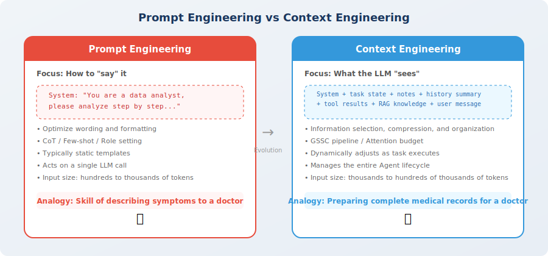
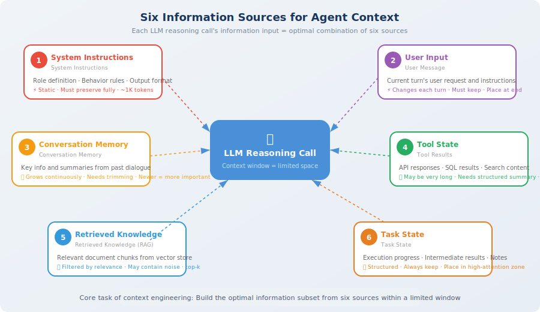

# From Prompt Engineering to Context Engineering

> 📖 *"Prompt Engineering is about what you say to an LLM; Context Engineering is about what you let an LLM see."*

In the practice of Agent development, many developers encounter a puzzling situation: the prompt is carefully crafted, the Agent performs well in the first few rounds of conversation, but as the interaction deepens, it starts to "underperform" — forgetting what was said earlier, repeating already-completed steps, or even drifting from the original goal. This is not a model problem; it's a **context management** problem.

This phenomenon is not easy to spot in short conversations. When you're doing a single-round Q&A, the prompt is everything — you carefully organize an instruction, the LLM immediately gives a great answer, and everything looks perfect. But Agents are not single-round conversations. A real Agent might execute 50 consecutive tool calls, accumulate 30 rounds of conversation history, and retrieve 10 documents from a knowledge base — this information grows like a snowball and quickly buries your carefully written prompt in a sea of information.

This section will take you from the perspective of prompt engineering to the perspective of context engineering, helping you understand why this paradigm shift is so critical for Agent development. After reading this section, you'll re-examine the way you've been writing Agents — upgrading from "how to write a good prompt" to "how to build a good information environment."

## The Limitations of Prompt Engineering

You may have spent a lot of time learning how to write good Prompts — using Chain-of-Thought (CoT) to guide reasoning [1], using Few-shot to provide examples [2], using role-setting to constrain behavior. These techniques are very effective in simple "one question, one answer" scenarios; they are the fundamentals of LLM applications.

But when you start building **Agents**, you'll find that Prompt Engineering can only solve part of the problem — specifically, it can only help you manage the **smallest piece** of the context. Let's look at a real Agent invocation scenario to intuitively feel this difference:

```python
# A typical Agent context contains far more than just a prompt

agent_context = {
    # ① System Prompt (what prompt engineering focuses on)
    "system_prompt": "You are a data analysis expert...",
    
    # ② Conversation history (may span dozens of rounds)
    "conversation_history": [...],   # 20 rounds × 500 tokens each = 10,000 tokens
    
    # ③ Tool call results (may be very verbose)
    "tool_results": [...],           # SQL query results, API return values
    
    # ④ Retrieved knowledge (RAG results)
    "retrieved_documents": [...],    # relevant document fragments
    
    # ⑤ Current task state
    "task_state": {...},             # completed steps, intermediate results
    
    # ⑥ Environment information
    "environment": {...},            # time, user preferences, system state
}

# Problem: all this information combined may exceed 100,000 tokens!
# Prompt Engineering cannot tell you: what to include and what to discard
```

The key issue is: **the System Prompt typically accounts for less than 1% of the context**, while what truly determines the quality of Agent behavior is the remaining 99% — conversation memory, tool results, retrieved documents, task state. Prompt engineering doesn't teach us how to manage this information.

This is like a director carefully polishing the opening monologue (prompt) while letting the entire screenplay (context) run wild — the final result the audience sees naturally can't be good.

> 💡 **A real data point**: In production Coding Agents (like Cursor, Devin), a single inference call's context might include: system instructions (~1K tokens) + project structure (~3K) + relevant file contents (~30K) + conversation history (~10K) + tool call results (~20K) + retrieved documents (~5K) = **~70K tokens total**. The system prompt accounts for only ~1.4%. This means the prompt you spend 80% of your time polishing only influences 1.4% of the context at runtime. If you don't manage the remaining 98.6%, even the best prompt can't save you.

## Defining Context Engineering

**Context Engineering** is a systematic engineering discipline that studies how to **build the optimal information input** for each LLM inference call [3].

The core question it answers is:

> **Within a limited context window, how do you ensure that the LLM, at the moment it needs to make a decision, has seen exactly all the information needed to make the right decision?**

This definition looks simple, but every key word is worth pondering:

- **Systematic**: not ad-hoc, scattered optimizations, but a complete methodology and engineering practice. Just as software engineering is not just "writing code," context engineering is not just "concatenating a few messages" — it involves the coordination of multiple stages: information collection, filtering, compression, and layout.
- **Each inference**: context is not fixed; each LLM call requires rebuilding the optimal context. The optimal context for round 1 and round 30 are completely different — information is constantly being generated, old information is constantly becoming outdated, and you need to dynamically decide "what to look at right now."
- **Optimal information input**: not "more is better," nor "less is better," but selecting the **optimal subset** within a limited budget. Stuffing too much irrelevant information into the context actually degrades LLM performance (we'll discuss this counterintuitive phenomenon in detail in Section 8.2).

You can think of context engineering as **preparing a medical record for a top doctor**: a good medical record doesn't pile up all the patient's medical records since birth, but carefully selects the test reports, medication history, and key indicators most relevant to the current symptoms, organized in a format that the doctor can quickly read.



### Key Differences

Understanding the difference between prompt engineering and context engineering is the first step to building the right mental model. Many developers hit walls in Agent development precisely because they bring the "prompt engineering" mindset to "context engineering" problems — like trying to solve a screwdriver problem with a hammer mindset.

The table below compares the two across 7 dimensions. Read through it row by row to feel the direction of the mindset shift:

| Dimension | Prompt Engineering | Context Engineering |
|-----------|-------------------|-------------------|
| **Focus** | How to "say" it (wording, format, techniques) | What the LLM "sees" (information selection and organization) |
| **Scope** | Single LLM call | Entire Agent lifecycle |
| **Core challenge** | Getting the LLM to understand intent | Fitting the most relevant information into a limited window |
| **Static vs Dynamic** | Usually static templates | Dynamically adjusted as the task executes |
| **Typical input size** | Hundreds to thousands of tokens | Thousands to hundreds of thousands of tokens |
| **Information source** | Hand-written by developer | Auto-aggregated from multiple sources (tools, RAG, memory, state) |
| **Evaluation standard** | Output quality | Information efficiency (information value per token) |
| **Analogy** | The skill of describing symptoms to a doctor | Preparing a complete medical record, test reports, and medication history for the doctor |

The last row's analogy is especially important: prompt engineering teaches you how to clearly and accurately describe symptoms to a doctor, which is certainly valuable; but context engineering teaches you to prepare the medical record, physical exam report, X-rays, and allergy history before the appointment, organized in the order the doctor finds easiest to read. Good medical record preparation lets the doctor grasp the key information in 30 seconds and make an accurate judgment; a pile of disorganized files, even if each one is fine individually, will leave the doctor scrambling.

> 💡 **One-sentence summary**: Prompt engineering is a **subset** of context engineering. When you optimize the system prompt, you're doing prompt engineering; when you manage the entire information flow — including deciding which conversation history to keep, which tool results to compress, and in what order to arrange retrieved documents — you're doing context engineering. The two are not mutually exclusive but hierarchically progressive.

### Real-World Scenario Comparison

To understand the difference more concretely, look at how the same task is handled differently under the two mindsets:

```python
# Scenario: Agent is helping a user analyze data, 25 rounds of conversation have occurred

# 🔴 Thinking only with prompt engineering
# Developer only optimized the system prompt, then stuffed all history in
messages = [
    {"role": "system", "content": very_well_crafted_system_prompt},  # carefully polished
    *all_25_rounds_of_conversation,  # all dumped in, ~15K tokens
    *all_tool_results,               # complete table data from SQL, ~30K tokens
    *retrieved_docs,                 # 5 documents from RAG, ~10K tokens
    {"role": "user", "content": current_question},
]
# Result: 55K+ tokens, lots of irrelevant info, LLM attention diluted, answer quality drops

# 🟢 Thinking with context engineering
# Intelligently manage each type of information
messages = context_engine.build(
    system_prompt=system_prompt,                     # ~1K tokens
    task_state=extract_current_task_state(),          # ~500 tokens (structured summary)
    agent_notes=notepad.to_context_string(),          # ~800 tokens (key findings)
    conversation=compress_old_history(                 # ~3K tokens (early conversation compressed to summary)
        all_25_rounds, keep_recent=5
    ),
    tool_results=select_relevant_results(             # ~5K tokens (only relevant results kept)
        all_tool_results, current_question
    ),
    retrieved_docs=top_k_by_relevance(docs, k=2),    # ~4K tokens (only top 2 most relevant)
    user_message=current_question,                    # ~100 tokens
)
# Result: ~14K tokens, high information density, key info in optimal positions, stable answer quality
```

## The Six Information Sources of Context

An Agent's context is typically composed of the following **six types of information**. Understanding these information sources is the foundation of context engineering — you need to know what the "raw materials" are before you can do good "information cooking."

These six types of information each have their own characteristics: some are stable and unchanging (like system instructions), some expand rapidly (like tool results), and some require careful selection (like retrieved knowledge). A true context engineer needs to be like an experienced chef — knowing the properties of each ingredient to create the best "dish" (context).



The code below defines the data structures for these six information sources. Pay attention to the comments above each field — they explain the core characteristics and role of that information source in the context:

```python
from dataclasses import dataclass, field
from typing import Optional

@dataclass
class AgentContext:
    """The six information sources of an Agent's context"""
    
    # 1. System instructions: define the Agent's role, capabilities, and behavioral norms
    #    Characteristics: static, unchanging, small token share but extremely high weight
    system_instructions: str = ""
    
    # 2. User input: the current round's user request
    #    Characteristics: changes each round, must be preserved completely, at the end of context (highest attention)
    user_message: str = ""
    
    # 3. Conversation memory: key information from conversation history
    #    Characteristics: grows with rounds, needs trimming or compression, newer is more important
    conversation_memory: list[dict] = field(default_factory=list)
    
    # 4. Tool state: historical results of tool calls
    #    Characteristics: may be very verbose (SQL tables, API JSON), needs summary compression
    tool_history: list[dict] = field(default_factory=list)
    
    # 5. Retrieved knowledge: relevant documents retrieved from external knowledge bases
    #    Characteristics: needs filtering by relevance score, may contain noise
    retrieved_knowledge: list[str] = field(default_factory=list)
    
    # 6. Task state: execution progress and intermediate results of the current task
    #    Characteristics: highly structured, should be placed in attention-sensitive areas
    task_state: Optional[dict] = None
    
    def total_tokens(self) -> int:
        """Estimate the total token count of the current context"""
        # Simplified estimate: 1 token ≈ 4 English characters
        total_text = (
            self.system_instructions 
            + self.user_message 
            + str(self.conversation_memory)
            + str(self.tool_history)
            + "".join(self.retrieved_knowledge)
            + str(self.task_state)
        )
        return len(total_text) // 4  # rough estimate
    
    def is_within_budget(self, max_tokens: int = 128000) -> bool:
        """Check if within the context window budget"""
        return self.total_tokens() < max_tokens


# Example: a typical Agent call
context = AgentContext(
    system_instructions="You are a senior data analyst...",       # ~500 tokens
    user_message="Analyze the user retention rate trend for last month",  # ~50 tokens
    conversation_memory=[                                          # ~3,000 tokens
        {"role": "user", "content": "Let's look at the overall data first..."},
        {"role": "assistant", "content": "Sure, let me query..."},
        # ... more history
    ],
    tool_history=[                                                 # ~5,000 tokens
        {"tool": "sql_query", "result": "...large query results..."},
    ],
    retrieved_knowledge=[                                          # ~2,000 tokens
        "Best practices for retention rate analysis: ...",
        "Company last month's operations report summary: ...",
    ],
    task_state={                                                   # ~500 tokens
        "completed_steps": ["data query", "basic statistics"],
        "current_step": "trend analysis",
        "intermediate_results": {"day7_retention": 0.42},
    },
)

print(f"Estimated context size: {context.total_tokens()} tokens")
print(f"Within 128K window: {context.is_within_budget()}")
```

### Characteristics Comparison of the Six Information Sources

After understanding the basic definitions of the six information sources, a natural question is: **what are the different strategies for managing them?** The answer is: completely different. Some information must be preserved word for word (like the user's current message), some can be boldly compressed (like old tool call return values), and some need to be placed at specific positions in the context to have maximum effect.

The table below is one of the most commonly referenced guides in context engineering practice — when designing your own Agent, you can use this table to decide the handling strategy for each type of information:

| Information Source | Change Frequency | Typical Size | Compressibility | Management Strategy |
|-------------------|-----------------|-------------|----------------|-------------------|
| System instructions | Unchanged | 500–2K tokens | Low (must be complete) | Always keep, place at beginning |
| User input | Changes each round | 50–500 tokens | Low (must be complete) | Always keep, place at end |
| Conversation memory | Continuously growing | 1K–50K tokens | High (can be summarized) | Sliding window + summary compression |
| Tool results | Grows with calls | 500–100K tokens | High (can extract key data) | Keep only recent + structured summary |
| Retrieved knowledge | Retrieved each round | 1K–20K tokens | Medium (can be filtered) | Filter top-k by relevance |
| Task state | Updated with task | 200–3K tokens | Low (already structured) | Always keep, place in high-attention area |

## The Three Principles of Context Engineering

With the foundation of the six information sources, we now need to master the three core principles for managing this information. These three principles run through all of context engineering practice — regardless of what framework or model you use, whenever context management is involved, these three principles are your action guide.

You can think of them as the "first principles" of context engineering: **relevance first** answers "what to include," **structured presentation** answers "how to organize," and **dynamic trimming** answers "when to adjust."

### Principle 1: Relevance First

**Core idea**: don't stuff all information into the context — only include information **most relevant to the current decision**.

This principle sounds so obvious it seems trivial — "of course you should include relevant information!" But in actual engineering, violations are everywhere. The most common anti-pattern is "full dump" — throwing all conversation history, all tool results, and all retrieved documents into the context at once, thinking "more information for the model is better."

The reality is exactly the opposite. Research has repeatedly shown: **adding irrelevant information to the context not only wastes tokens but actively decreases LLM reasoning accuracy**. This is called the "attention dilution" effect — the LLM's attention is scattered to irrelevant information, making it harder to focus on what truly matters. It's like giving you a dictionary to "reference" during an exam — theoretically you have more information, but in practice it only distracts you.

```python
# ❌ Anti-pattern: dump all conversation history in
messages = full_conversation_history  # may be tens of thousands of tokens, lots of irrelevant info

# ✅ Correct approach: only keep relevant history
def select_relevant_history(
    history: list[dict], 
    current_task: str, 
    max_turns: int = 10
) -> list[dict]:
    """Select history most relevant to the current task"""
    # Strategy 1: keep the most recent N rounds (temporal relevance)
    recent = history[-max_turns:]
    
    # Strategy 2: from earlier history, pick rounds relevant to the current task
    # (can use embedding similarity to judge relevance)
    
    return recent
```

> 💡 **Practical experience**: relevance filtering not only reduces token consumption and API costs, but more importantly **improves output quality**. Research shows that adding irrelevant information to the context actually **decreases** LLM reasoning accuracy (the so-called "attention dilution" effect). Less is more — this is one of the most counterintuitive but most important insights in context engineering.

In Section 8.2, we'll discuss the LLM's attention distribution mechanism in more detail, and you'll understand from a technical perspective "why less is actually better."

### Principle 2: Structured Presentation

**Core idea**: the same information, organized differently, will **significantly affect** the LLM's comprehension.

The essence of this principle is: **the "packaging" of information is just as important as the "content."** LLMs understand structured text (Markdown headings, tables, lists) far better than unstructured plain text. Good context organization is like a good database schema — the same data, different structure, vastly different query efficiency.

Why is this? Because LLMs are essentially doing "pattern matching" on text. When information is organized with clear hierarchical structure, the LLM can locate needed content faster; when information is presented as scattered natural language, the LLM first needs to "understand" the text structure before extracting useful information — this process consumes precious reasoning capacity.

Here's an intuitive comparison:

```python
# ❌ Messy context: the information is correct, but the LLM struggles to quickly extract key points
messy_context = """
Query results: 1000 users, retention rate 42%, last month 45%, dropped 3%,
also DAU is declining, from 5000 to 4500, MAU basically flat...
"""

# ✅ Structured context: same information, but immediately clear to the LLM
structured_context = """
## Current Task State

### Completed Steps
1. ✅ Data query: retrieved user data for February 2025
2. ✅ Basic statistics: completed key metric calculations

### Key Data Summary
| Metric | This Month | Last Month | Change |
|--------|-----------|-----------|--------|
| 7-day retention rate | 42% | 45% | ↓ 3% |
| DAU | 4,500 | 5,000 | ↓ 10% |
| MAU | 15,000 | 15,200 | ↓ 1.3% |

### Current Step
In progress: trend analysis (need to identify reasons for decline)
"""
```

**Practical tips for structured presentation**:

- **Use Markdown headings to divide sections**: lets the LLM quickly locate different types of information
- **Use tables to present comparative data**: more efficient than natural language descriptions
- **Use list markers for progress and status**: ✅ / 🔄 / ⬜ is more intuitive than text descriptions
- **Bold or highlight key data**: guides the LLM's attention to focus

### Principle 3: Dynamic Trimming

**Core idea**: the content of the context should **dynamically adjust as the task progresses**, not remain static.

This is the most easily overlooked principle. Many developers, when designing Agents, set a fixed context template — "system prompt + last 10 rounds of conversation + latest tool results" — and use this template throughout the entire task lifecycle.

But think about it: for a multi-round conversation Agent, the context information needed in round 1 and round 30 is completely different. Early on, more background knowledge and task description is needed to help the Agent understand "what to do"; later, more intermediate results and recent tool outputs are needed to help the Agent decide "what to do next." Using the same formula from start to finish is like having a chef add the same amount of salt to every dish — it's bound to taste wrong.

Dynamic trimming means intelligently adjusting the "recipe" of the context based on the current stage. The code below shows a simple but effective implementation:

```python
class DynamicContextManager:
    """Dynamic context manager: trim by priority to stay within budget"""
    
    def __init__(self, max_tokens: int = 100000):
        self.max_tokens = max_tokens
        # Lower priority number = more important = less likely to be trimmed
        self.priority_levels = {
            "system": 1,      # highest priority, always kept
            "current_task": 2, # current task information
            "recent_tool": 3,  # most recent tool results
            "history": 4,      # conversation history
            "knowledge": 5,    # retrieved knowledge
        }
    
    def build_context(self, sources: dict) -> list[dict]:
        """Build context by priority, ensuring it stays within budget"""
        context = []
        remaining_tokens = self.max_tokens
        
        # Fill from highest to lowest priority
        for priority_name in sorted(
            self.priority_levels, 
            key=self.priority_levels.get
        ):
            if priority_name in sources:
                content = sources[priority_name]
                tokens = estimate_tokens(content)
                
                if tokens <= remaining_tokens:
                    context.append(content)
                    remaining_tokens -= tokens
                else:
                    # Over budget, need to trim
                    truncated = truncate_to_fit(content, remaining_tokens)
                    context.append(truncated)
                    break
        
        return context
```

> 💡 **Dynamic trimming in practice**: Anthropic's Claude Agent, when executing long tasks, automatically triggers "compaction" — when the context approaches the window limit, it compresses historical conversations into refined summaries, freeing space for new tool results and user interactions. This "pressure-triggered" dynamic trimming lets the Agent continue working efficiently within a limited window. We'll explain the principles and implementation of this strategy in detail in Section 8.3.

## From Cognition to Practice: The Mindset Shift in Context Engineering

Mastering context engineering is essentially a **mindset shift** — from "I need to write a good prompt" to "I need to manage a good information flow." This shift doesn't happen overnight; it requires constant calibration in practice.

The comparison table below summarizes the key mindset upgrades. When developing Agents, come back to this table from time to time — whenever you find yourself "tweaking the prompt" but not getting better results, the right column may be what you actually need to do:

| Old Mindset (Prompt Engineering) | New Mindset (Context Engineering) |
|----------------------------------|----------------------------------|
| "I need to write a perfect prompt" | "I need to build the optimal information environment for each inference" |
| "Give the LLM all the information and let it pick" | "I decide what the LLM sees and doesn't see" |
| "Once the prompt is written, it's done" | "Context needs to dynamically adjust as the task progresses" |
| "Output not good? Tweak the prompt wording" | "Output not good? Check if key information is missing from the context" |
| "Token budget not enough? Switch to a model with a larger window" | "Token budget not enough? Compress lower-priority information" |

These mindset shifts don't negate the value of prompt engineering — a good prompt is still very important; it's the foundation of context engineering. But if you only stay at the level of optimizing prompts, it's like an architect only caring about the design of the entrance door while ignoring the structure of the entire building — no matter how beautiful the door, if the building is unsound, it's useless.

## Section Summary

| Concept | Description |
|---------|-------------|
| **Context Engineering** | A systematic engineering discipline for building optimal information inputs for LLMs |
| **Relationship to Prompt Engineering** | Prompt engineering is a subset of context engineering; the latter is broader and more dynamic |
| **Six Information Sources** | System instructions, user input, conversation memory, tool state, retrieved knowledge, task state |
| **Three Principles** | Relevance first (less is more), structured presentation (format = efficiency), dynamic trimming (adjust with task) |
| **Core Mindset Shift** | From "optimizing wording" to "managing information flow" |

## 🤔 Reflection Exercises

1. In Agent products you've used (like ChatGPT, Claude, Cursor), have you ever encountered a situation where the Agent "forgot what was said earlier"? Using the six information sources model of context engineering, analyze which type of information management went wrong.
2. If an Agent's context window is only 8K tokens (e.g., a small model deployed on an edge device), how would you allocate the budget across the six information sources?
3. Why does "adding irrelevant information to the context actually decrease output quality"? Think from the perspective of the LLM's attention mechanism.

---

## References

[1] WEI J, WANG X, SCHUURMANS D, et al. Chain-of-thought prompting elicits reasoning in large language models[C]//NeurIPS. 2022.

[2] BROWN T B, MANN B, RYDER N, et al. Language models are few-shot learners[C]//NeurIPS. 2020.

[3] ANTHROPIC. Building effective agents[EB/OL]. 2024. https://www.anthropic.com/engineering/building-effective-agents.

---

*Next: [8.2 Context Window Management and Attention Budget](./02_context_window.md)*
