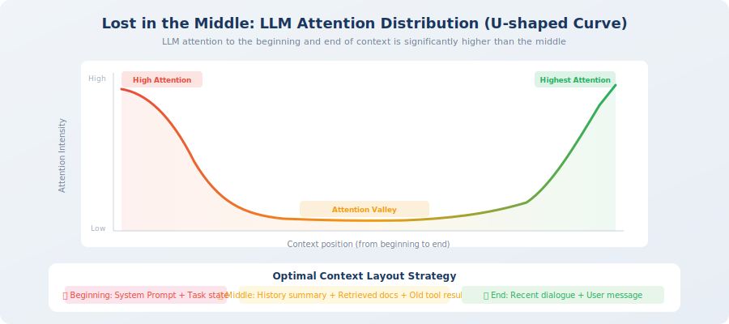

# Context Window Management and Attention Budget

> 📖 *"The context window is like a desk — the surface area is fixed, and the number of documents you can spread out at once is limited. The key is not how big the desk is, but which documents you choose to spread out."*

In the previous section, we established the basic framework of context engineering — the six information sources and three principles. But in practice, you'll quickly encounter two core problems: **the context window is finite**, and **LLMs don't pay equal attention to information at different positions**.

The first problem is fairly intuitive — the window is only so big, and when information doesn't fit, trade-offs must be made. But the second problem is more subtle and more deadly: even if your total information is far from filling the window, the LLM may not "see" all of it. It will naturally pay more attention to certain positions and ignore others. If you don't understand this pattern of attention distribution, you can't strategically arrange the placement of information.

This section will dive deep into these two problems, help you build the mental model of "attention budget," and master three core context management techniques. This content is the theoretical foundation for all subsequent practice — the long-horizon strategies in Section 8.3 and the GSSC pipeline in Section 8.4 are both built on the concepts in this section.

## Understanding the Context Window

### What Is a Context Window?

The context window is the **maximum amount of information** an LLM can "see" in a single inference, measured in token count. You can think of it as the LLM's "working memory capacity" — information beyond the window is completely invisible to the model, as if it doesn't exist.

This is a hard physical constraint, determined by the model architecture during training. Unlike humans who can "flip back" to review earlier content, LLMs can only see the tokens within the current window — information outside the window is unobservable to them.

Different models have significantly different window sizes, and this number is growing rapidly:

| Model | Context Window | Approximately | Typical Use Cases |
|-------|---------------|--------------|------------------|
| GPT-3.5 Turbo | 16K tokens | ~12,000 words | Simple conversations, short text tasks |
| GPT-4o | 128K tokens | ~96,000 words | Complex Agent tasks, long document analysis |
| Claude 3.5 Sonnet | 200K tokens | ~150,000 words | Full codebase analysis, deep research |
| Gemini 1.5 Pro | 1M tokens | ~750,000 words | Ultra-long video/audio understanding |

From the table, you can see that window sizes have grown dramatically over the past two years — from GPT-3.5's 16K to Gemini's 1M, a more than 60x increase. This leads many people to an optimistic thought: "The window is big enough now — what's the point of context management?"

This thinking is dangerous.

> 💡 **A common misconception**: "Bigger window = better Agent." Research shows the opposite — even when a model supports a 1M token window, **reasoning quality noticeably degrades beyond ~64K tokens**. A larger window is a safety net, not a free lunch. Context management is always necessary. It's like a person's desk being 10 meters long — their effective working area is still the half-meter in front of them. No matter how much stuff is piled on, the amount of information they can focus on at once doesn't grow linearly.

### The Budget Constraint of the Context Window

There's an easily overlooked fact: **output tokens also consume the context window**. This means your input cannot fill the entire window — you must leave enough space for the LLM to generate a response.

This is very easy to miss. Suppose you're using a model with a 128K window, and you might think "I have 128K of space for input." But in reality, if the LLM needs to generate a 4K token response, your input limit is only 124K. If you fill the input with 128K, the LLM can't generate a single word — or is forced to truncate its output.

The code below encapsulates a practical budget check function that you can call each time you build a context to ensure you don't exceed the budget:

```python
# Basic constraints of the context window
def check_context_budget(
    system_prompt_tokens: int,
    conversation_tokens: int,
    tool_result_tokens: int,
    retrieved_docs_tokens: int,
    max_output_tokens: int,
    model_context_window: int = 128000,
) -> dict:
    """
    Check context budget.
    Note: output tokens also consume the context window!
    """
    total_input = (
        system_prompt_tokens 
        + conversation_tokens 
        + tool_result_tokens 
        + retrieved_docs_tokens
    )
    
    available_for_output = model_context_window - total_input
    
    return {
        "total_input_tokens": total_input,
        "available_for_output": available_for_output,
        "is_within_budget": available_for_output >= max_output_tokens,
        "utilization": total_input / model_context_window * 100,
    }

# Typical Agent scenario
budget = check_context_budget(
    system_prompt_tokens=800,
    conversation_tokens=15000,   # 15 rounds of conversation
    tool_result_tokens=20000,    # multiple tool call results
    retrieved_docs_tokens=5000,  # RAG retrieval results
    max_output_tokens=4096,
    model_context_window=128000,
)
print(f"Input usage: {budget['total_input_tokens']} tokens")
print(f"Utilization: {budget['utilization']:.1f}%")
print(f"Remaining output space: {budget['available_for_output']} tokens")
```

## Context Corruption

### What Is Context Corruption?

**Context corruption** refers to the phenomenon where, as an Agent executes a task, low-quality, redundant, or outdated information gradually accumulates in the context, causing the LLM's reasoning quality to continuously decline [1].

This concept is key to understanding the long-term behavioral degradation of Agents. When developers encounter the phenomenon of an Agent "getting dumber over time," their first reaction is often to suspect the model's capability or stability. But in 90% of cases, the reason is not that the model changed — it's that **the quality of information being fed to the model has been continuously deteriorating**.

This is like a room that keeps accumulating clutter — initially, you work efficiently on a clean desk; but as files, sticky notes, and takeout boxes pile up, it becomes increasingly hard to find what you need, and work efficiency plummets. The room is still the same room, you're still the same person, but the environment has changed, and efficiency has changed accordingly.

Context corruption is the same: the model hasn't changed, but the context environment has deteriorated, so output quality naturally declines.

> 💡 **Context corruption is the #1 cause of Agent failure**. If your Agent performs perfectly in the first 5 rounds but starts making errors at round 20, there's a 90% chance it's context corruption — the model hasn't gotten dumber, useful information has been drowned out by noise. The simplest way to diagnose context corruption is: print out the complete context at round 20 and see how much of the information is truly relevant to the current task.

### Quantitative Analysis of Corruption

To give you an intuitive sense of how serious context corruption can be, let's use code to simulate how context quality progressively deteriorates over 30 rounds of interaction.

There's a key assumption here: not all newly added information in each round of interaction is "useful." The Agent's thinking process, raw-format tool call outputs, intermediate data that's no longer needed... all of this stays in the context, but its value for subsequent decisions keeps decreasing. At the same time, as the task progresses, the relevance of early discussions (like "Hello, please help me analyze data" type openers) to the current step also decreases.

```python
# Typical scenario of context corruption

def demonstrate_context_corruption():
    """Demonstrate how context corruption occurs"""
    
    context_tokens = 0
    useful_ratio = 1.0  # proportion of useful information
    
    # Simulate Agent executing 30 rounds of interaction
    for turn in range(1, 31):
        # New content added each round
        new_user_msg = 100       # user message
        new_thought = 200        # Agent thinking process
        new_tool_call = 50       # tool call request
        new_tool_result = 500    # tool return result (often very verbose)
        new_assistant_msg = 300  # Agent response
        
        turn_tokens = (new_user_msg + new_thought + 
                       new_tool_call + new_tool_result + 
                       new_assistant_msg)
        context_tokens += turn_tokens
        
        # As rounds increase, the relevance of early information decreases
        useful_ratio *= 0.95  # effective information ratio drops 5% each round
        
        if turn % 10 == 0:
            print(f"Round {turn}:")
            print(f"  Context size: {context_tokens:,} tokens")
            print(f"  Useful information ratio: {useful_ratio:.1%}")
            print(f"  Noise information: {context_tokens * (1 - useful_ratio):,.0f} tokens")
    
    # Round 10: ~11,500 tokens, 60% useful
    # Round 20: ~23,000 tokens, 36% useful
    # Round 30: ~34,500 tokens, 21% useful ← nearly 80% is noise!

demonstrate_context_corruption()
```

**Key data insight**: by round 30, **nearly 80% of the information in the context is noise** — outdated conversations, tool results that are no longer relevant, repeated intermediate steps. The LLM needs to "find a needle in a haystack" among this noise, looking for the 20% of useful information needed to make the right decision. This is why your Agent starts "making mistakes" at round 30 — it hasn't gotten dumber; the signal-to-noise ratio is just too low.

### Three Symptoms of Context Corruption

When context corruption occurs, Agents typically exhibit the following three classic symptoms. Learning to recognize these symptoms is very important — they're like disease signals from the body, helping you diagnose and intervene before the problem worsens.

If you notice these behaviors when testing your own Agent, don't rush to change the prompt or switch models — first check the quality of information in the context:

| Symptom | Manifestation | Root Cause | Solution Direction |
|---------|--------------|-----------|-------------------|
| **Forgetting** | Agent forgets key information discussed earlier | Important information has been "flushed" to the low-attention middle area of the context by large amounts of new information | Distill key information into Agent notes, place in high-attention positions |
| **Repetition** | Agent repeats already-completed steps | Task state is not prominent enough in the context, buried by large amounts of text like tool results | Maintain structured task state, place near the system prompt |
| **Going off-topic** | Agent's behavior deviates from the original goal | Early task goals are buried by subsequent information, LLM "forgets" what it's doing | Always maintain a clear task goal statement at the beginning of the context |

## Attention Budget

### The Lost in the Middle Effect

Although modern LLMs have increasingly large context windows (128K, 200K, even 1M tokens), an important research finding has changed our understanding of context utilization: **LLMs don't pay equal attention to information at different positions in the context** [2].

In 2023, Liu et al. from Stanford University published an influential paper "Lost in the Middle," which revealed a surprising phenomenon through extensive experiments: when you place a key piece of information at different positions in the context, the probability that the LLM can correctly use that information varies enormously — accuracy is highest when placed at the beginning or end, and significantly drops when placed in the middle.

This is the famous **Lost in the Middle** effect: LLMs pay high attention to the **beginning** and **end** of the context, while information in the **middle** tends to be overlooked. The attention distribution shows a clear **U-shaped curve** — high at both ends, low in the middle.

Why does this happen? An intuitive explanation is that the LLM's attention mechanism is naturally more sensitive to the beginning of a sequence (due to the special nature of positional encoding) and the end (because it's closest to the output, with the strongest gradient signal). Information in the middle needs to "cross" more intermediate layers to influence the output, and the signal gets diluted layer by layer.



```python
# Attention distribution illustration (simplified model)

def attention_distribution(context_length: int) -> list[float]:
    """
    Simulate LLM attention distribution at different positions.
    U-shaped curve: high attention at beginning and end, low in middle.
    """
    import math
    
    attentions = []
    for i in range(context_length):
        # Normalized position [0, 1]
        pos = i / context_length
        
        # U-shaped attention curve
        # Beginning area (first 10%): high attention
        # Middle area (10%-90%): low attention
        # End area (last 10%): highest attention
        if pos < 0.1:
            attention = 0.8 + 0.2 * (1 - pos / 0.1)
        elif pos > 0.9:
            attention = 0.8 + 0.2 * ((pos - 0.9) / 0.1)
        else:
            attention = 0.3 + 0.2 * math.sin(math.pi * pos)
        
        attentions.append(attention)
    
    return attentions

# Practical implications (very important, directly affects context layout design):
# ① System Prompt at the very beginning → stable and high attention
# ② Latest user messages and tool results at the very end → strongest attention
# ③ Historical conversations in the middle → most easily overlooked → need careful management
```

### What Does This Effect Mean for Agent Design?

The Lost-in-the-Middle effect directly determines the **layout strategy** for context. Simply put:

- **Beginning (high attention)**: place system prompt, task goals, structured notes — information the Agent "must not forget"
- **Middle (low attention)**: place conversation history, old tool results, retrieved documents — auxiliary information that's not fatal even if partially overlooked
- **End (highest attention)**: place current user message, most recent tool results — information that "needs the most attention right now"

> 💡 **Practical tip**: if your Agent always "forgets" a certain key piece of information, try moving it to the beginning or end of the context rather than modifying the prompt wording. Often, **where information is placed** matters more than **how it's written**.

### Attention Budget Allocation Strategy

Based on the Lost-in-the-Middle effect, we can formulate a systematic attention budget allocation strategy. The core idea is: **treat the limited token space as a budget to manage, allocating different "shares" to different types of information**.

This is very similar to a company's financial budget: the total budget is fixed (context window size), each department (information type) needs funding (tokens), and you need to allocate reasonably based on each department's importance and output efficiency. Core departments (system prompt, current user message) cannot have their budget cut; supplementary departments (old conversation history) can be compressed when the budget is tight.

The code below defines a recommended budget allocation scheme. These numbers are not arbitrary — they come from the practical experience of multiple production-grade Agent projects, and you can fine-tune them based on your own scenario:

```python
from dataclasses import dataclass

@dataclass
class AttentionBudget:
    """Attention budget allocation"""
    
    total_tokens: int = 128000
    
    # Budget allocation (based on attention priority and information importance)
    system_prompt_budget: float = 0.01     # 1% → system instructions (beginning, high attention)
    task_context_budget: float = 0.05      # 5% → current task context (beginning area)
    output_reserve: float = 0.05           # 5% → reserved for output
    recent_context_budget: float = 0.20    # 20% → recent few rounds of conversation (end, high attention)
    tool_results_budget: float = 0.30      # 30% → tool call results
    history_budget: float = 0.25           # 25% → conversation history (middle, low attention → needs compression)
    knowledge_budget: float = 0.14         # 14% → retrieved knowledge
    
    def get_token_allocation(self) -> dict:
        """Calculate token quota for each section"""
        return {
            "system_prompt": int(self.total_tokens * self.system_prompt_budget),
            "task_context": int(self.total_tokens * self.task_context_budget),
            "output_reserve": int(self.total_tokens * self.output_reserve),
            "recent_context": int(self.total_tokens * self.recent_context_budget),
            "tool_results": int(self.total_tokens * self.tool_results_budget),
            "history": int(self.total_tokens * self.history_budget),
            "knowledge": int(self.total_tokens * self.knowledge_budget),
        }

budget = AttentionBudget()
allocation = budget.get_token_allocation()
for name, tokens in allocation.items():
    print(f"  {name}: {tokens:,} tokens")
```

### Design Considerations for Budget Allocation

Why allocate this way? There are engineering considerations behind each number:

| Information Type | Budget % | Design Rationale |
|-----------------|---------|----------------|
| System instructions | 1% | Fixed content, concise and efficient, but **absolutely cannot be omitted** |
| Task context | 5% | Includes current goal, completed steps, notes — placed at beginning to ensure Agent doesn't "get lost" |
| Output reserve | 5% | Agent responses typically need 2K–8K tokens, must be reserved |
| Recent conversation | 20% | The most recent 3–5 rounds are most relevant to current decisions, placed at end for highest attention |
| Tool results | 30% | Usually the core basis for Agent decisions (data, search results), largest share |
| Conversation history | 25% | Placed in the middle area, can be compressed into summaries to increase information density |
| Retrieved knowledge | 14% | External knowledge supplement, filter top-k by relevance |

## Three Core Context Management Techniques

With the concept of attention budget established, let's introduce three practical context management techniques. They each solve problems at different levels and typically need to be **used in combination** in real projects.

You can think of these three techniques as the "toolbox" of context management — from simplest to most advanced, increasing in complexity and capability. In real projects, the most common approach is to choose the right combination of techniques based on the complexity of the task and the length of the conversation.

### Technique 1: Sliding Window

The simplest and most intuitive strategy — keep only the most recent N rounds of conversation, discarding earlier history. Its implementation requires only a few lines of code, but it's already sufficient for many simple scenarios:

```python
def sliding_window(messages: list[dict], max_turns: int = 10) -> list[dict]:
    """
    Sliding window: keep only the most recent N rounds of conversation.
    
    Pros: simple implementation, zero additional overhead
    Cons: crudely discards early information, may lose critical context
    Best for: scenarios where tasks are relatively independent and don't need long-term memory
    """
    # Always keep system messages
    system_msgs = [m for m in messages if m["role"] == "system"]
    other_msgs = [m for m in messages if m["role"] != "system"]
    
    # Keep only the most recent N rounds (each round = user + assistant)
    recent_msgs = other_msgs[-(max_turns * 2):]
    
    return system_msgs + recent_msgs
```

**Limitations of sliding window**: suppose the user says in round 1 "my project uses Python 3.11, don't use any string formatting other than f-strings." If the window only keeps the most recent 10 rounds, by round 15 this preference is lost. This is why we need smarter strategies — sliding window is too "brainless"; it doesn't care about the importance of information, only about time.

### Technique 2: Summary Compression

The problem with sliding window is that it treats all information equally — whether it's a critical user preference or irrelevant small talk, anything beyond the window gets cut. Summary compression provides a more elegant solution: **"distill" information that needs to be discarded into its essence, rather than simply throwing it away**.

This is like organizing your notes — rather than throwing away meeting notes from three months ago, spend 5 minutes extracting the key points and pasting them on the first page of your notebook. This way you free up space without losing truly important information.

Periodically compress conversation history into summaries, preserving more key information with fewer tokens:

```python
from openai import OpenAI

client = OpenAI()

def compress_history(
    messages: list[dict], 
    keep_recent: int = 5
) -> list[dict]:
    """
    Conversation history compression: summarize older conversations.
    
    Pros: preserves key information, dramatically reduces tokens (compression ratio typically 5:1 to 10:1)
    Cons: loses details, requires additional LLM calls (increases latency and cost)
    Best for: long conversation scenarios that need to maintain context continuity
    """
    if len(messages) <= keep_recent * 2:
        return messages  # no compression needed
    
    # Separate old messages to compress from recent messages to keep
    old_messages = messages[:-(keep_recent * 2)]
    recent_messages = messages[-(keep_recent * 2):]
    
    # Use LLM to generate summary
    summary_prompt = f"""Please compress the following conversation history into a concise summary, preserving:
1. The user's core needs and goals
2. Key steps already completed
3. Important intermediate results and data
4. Unresolved issues

Conversation history:
{format_messages(old_messages)}
"""
    
    response = client.chat.completions.create(
        model="gpt-4o-mini",  # use small model for summarization to reduce cost
        messages=[{"role": "user", "content": summary_prompt}],
        max_tokens=500,
    )
    
    summary = response.choices[0].message.content
    
    # Insert summary as a system message
    summary_message = {
        "role": "system",
        "content": f"[Conversation History Summary] {summary}"
    }
    
    return [summary_message] + recent_messages
```

> 💡 **Best practices for summary compression**:
> - Use a small model (like gpt-4o-mini) to generate summaries — cost is only 1/10 of the main model
> - Summaries should be **structured** (using lists/tables), not natural language paragraphs
> - Set a compression trigger threshold (e.g., trigger when context exceeds 50% of budget) to avoid over-compression

### Technique 3: Semantic Filtering

The first two techniques both use "time" to decide what to keep — sliding window only looks at "the most recent," and summary compression also compresses "the old." But in some scenarios, time is not the best criterion.

Imagine this scenario: the user mentions a critical database configuration in round 3, then 20 rounds of other discussion follow, and in round 25 they suddenly ask a question related to that configuration. The sliding window has long since discarded round 3, and summary compression may have omitted this detail. What to do?

Semantic filtering takes a completely different approach: **not by temporal proximity, but by "how relevant to the current question" to decide what to keep**. It uses embedding (text vectorization) technology to calculate the semantic similarity between each historical message and the current user input, then keeps only the most relevant ones — regardless of whether they were said 1 minute ago or 1 hour ago.

```python
import numpy as np

def semantic_filter(
    messages: list[dict],
    current_query: str,
    embedding_model,
    top_k: int = 10,
    always_keep_last: int = 3,
) -> list[dict]:
    """
    Semantic filtering: select historical messages to keep based on relevance.
    
    Pros: can find the most relevant information across time (key info from round 1 can also be kept)
    Cons: requires additional embedding computation, may disrupt temporal order
    Best for: Agents that need long-term memory, where tasks may refer back to early discussions
    """
    # Embed the current query
    query_embedding = embedding_model.encode(current_query)
    
    # Calculate similarity between each historical message and the current query
    scored_messages = []
    for i, msg in enumerate(messages):
        msg_embedding = embedding_model.encode(msg["content"])
        similarity = np.dot(query_embedding, msg_embedding)
        scored_messages.append((i, similarity, msg))
    
    # Sort by similarity, select top_k
    scored_messages.sort(key=lambda x: x[1], reverse=True)
    selected_indices = set()
    
    # Always keep the last few messages (to ensure temporal continuity)
    for i in range(max(0, len(messages) - always_keep_last), len(messages)):
        selected_indices.add(i)
    
    # Add the semantically most relevant messages
    for idx, score, msg in scored_messages[:top_k]:
        selected_indices.add(idx)
    
    # Return in original order (maintaining time sequence)
    result = [messages[i] for i in sorted(selected_indices)]
    return result
```

### Comparison and Selection of the Three Techniques

Now that you understand the three context management techniques, a natural question is: **when to use which?** They're not mutually exclusive but each has its applicable scenarios. The comparison table below helps you make a quick choice:

| Dimension | Sliding Window | Summary Compression | Semantic Filtering |
|-----------|---------------|--------------------|--------------------|
| **Implementation complexity** | ⭐ Minimal | ⭐⭐⭐ Medium | ⭐⭐⭐⭐ Higher |
| **Information retention** | Only most recent | Global summary | Most relevant across time |
| **Additional overhead** | Zero | LLM call (summary) | Embedding computation |
| **Risk of information loss** | High (all early info lost) | Medium (details lost) | Low (kept by relevance) |
| **Latency impact** | None | ~1–2 seconds (summary generation) | ~0.5 seconds (embedding) |
| **Best for** | Simple conversation Agents | Continuous long conversations | Agents needing "long-term memory" |
| **Typical representative** | Early ChatGPT | Claude's compaction | RAG-enhanced Agents |

> 💡 **Practical recommendation**: in production projects, these three techniques are typically **used in combination**: use sliding window to keep recent conversations, use summary compression to handle earlier history, and use semantic filtering to recall relevant information from long-term memory. We'll demonstrate this combination in the hands-on practice in Section 8.4.

## Section Summary

| Concept | Description |
|---------|-------------|
| **Context window** | Maximum information an LLM can see in a single inference; output also consumes the window |
| **Context corruption** | Accumulation of low-quality information causing reasoning quality to decline; the #1 cause of Agent failure |
| **Lost in the Middle** | LLMs pay high attention to the beginning and end of context, low in the middle (U-shaped curve) |
| **Attention budget** | Allocate context space by information priority and position sensitivity |
| **Three management techniques** | Sliding window (simple) → Summary compression (medium) → Semantic filtering (advanced) |

## 🤔 Reflection Exercises

1. If your Agent needs to handle a task spanning 100 rounds of conversation, how would you combine the three management techniques? Design a specific plan.
2. What does the "Lost in the Middle" effect imply for designing your Agent's context layout? Try to design the optimal context structure for a data analysis Agent.
3. What scenarios are summary compression and semantic filtering each best suited for? If using both simultaneously, which should be executed first? Why?

---

## References

[1] ANTHROPIC. Building effective agents[EB/OL]. 2024. https://www.anthropic.com/engineering/building-effective-agents.

[2] LIU N F, LIN K, HEWITT J, et al. Lost in the middle: How language models use long contexts[J]. Transactions of the ACL, 2024, 12: 157-173.

---

*Next: [8.3 Context Strategies for Long-Horizon Tasks](./03_long_horizon.md)*