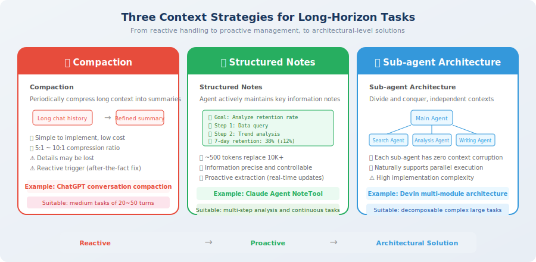

# Context Strategies for Long-Horizon Tasks

> 📖 *"Short conversations rely on prompt techniques; long tasks rely on context strategies — when an Agent needs to work for hours or even days, context management is the lifeline."*

In the previous section, we learned the basic context management techniques (sliding window, summary compression, semantic filtering). These techniques work well for medium-length conversations, but when task complexity increases further — requiring **dozens to hundreds of rounds of interaction** to complete — we need more advanced strategies.

Why? Because the basic management techniques solve the problem of "how to fit more useful information into a limited window," while long-horizon tasks face a more fundamental challenge: **information is generated far faster than the context window can accommodate**. Even if you use all the techniques — sliding window + summary compression + semantic filtering — in a 200-round coding task, the file contents, tool returns, and debug logs generated each round might add up to thousands of tokens, and even after compression, the window will fill up quickly.

This is like a company growing from 10 people to 1,000 people — you can't solve the management problem just by getting a "bigger office." You need to introduce hierarchies, process standards, and functional divisions — **organizational architecture-level changes**. Long-horizon context strategies are the "organizational architecture changes" of context management.

This section introduces three major long-horizon context strategies, derived from the actual engineering practices of frontier teams like Anthropic and OpenAI [1], representing the most cutting-edge context management methodology in current Agent development.

## What Are Long-Horizon Tasks?

Long-horizon tasks are complex tasks that require an Agent to execute **dozens to hundreds of rounds of interaction** to complete. These tasks are increasingly common in real products — as Agent capabilities improve, user expectations also rise, from "help me answer a question" to "help me complete a project."

Over the past year, we've seen a batch of impressive long-horizon Agent products: Devin can independently complete software projects with hundreds of lines of code, Perplexity Deep Research can search dozens of web pages and write in-depth reports, and Claude Agent can complete complex analysis tasks across hundreds of rounds of conversation. Behind these products are carefully designed long-horizon context management strategies.

| Task Type | Typical Rounds | Representative Products | Core Challenge |
|-----------|---------------|------------------------|---------------|
| Full software project development | 100–500 rounds | Devin, Cursor Agent | Need to remember project architecture, modified files, unfinished features |
| Deep research reports | 50–200 rounds | Perplexity Deep Research | Need to integrate information from dozens of sources, maintain argumentative consistency |
| Multi-step data analysis | 30–100 rounds | Code Interpreter | Need to remember data schema, intermediate results, analysis goals |
| Complex debugging workflows | 20–80 rounds | Claude Agent | Need to track attempted solutions, error messages, fix ideas |

The core challenge of these tasks is: **the context continuously expands during task execution, but the context window is fixed**. This is not a problem that "a bigger window can solve" — you'll find that even with an unlimited window, the attention dilution problem still exists.

Let's use a simulation to intuitively feel the speed of this expansion:

```python
# Example of context expansion in a long-horizon task

def simulate_long_task():
    """Simulate a programming task requiring 50 rounds of interaction"""
    context_size = 1000  # initial context (system prompt + task description)
    
    for step in range(50):
        # New tokens added each round
        context_size += 100   # Agent's thinking process
        context_size += 50    # tool call request
        context_size += 800   # tool return result (e.g., file content, search results)
        context_size += 200   # Agent's response
        
        if context_size > 128000:
            print(f"⚠️ Exceeded 128K window at round {step}!")
            break
    else:
        print(f"Final context size: {context_size:,} tokens")

simulate_long_task()
# Output: ⚠️ Exceeded 128K window at round 110... but in practice problems arise much earlier due to attention dilution
```

> 💡 **A key insight**: In practice, long-horizon task failures typically occur **far before** the window is filled. Due to context corruption and attention dilution, Agent performance may start to noticeably decline when the window is only **30%–50%** full. So "having a 128K window means no need to manage context" is a dangerous illusion.

## Three Response Strategies

Facing the context challenges of long-horizon tasks, the industry has developed three progressive strategies. They are hierarchically related: **compaction** does information compression within a single Agent, **structured notes** have the Agent actively record key information, and **sub-agent architecture** solves the problem at the system architecture level. Complexity increases, and so does capability.



### Strategy 1: Compaction

**Core idea**: periodically compress verbose context into refined summaries, freeing space for new information.

This is the most intuitive strategy — like tidying a desk, periodically archiving accumulated files into summaries to make room for new work materials. If you understood the summary compression technique in Section 8.2, compaction can be seen as its "upgraded version" — not just compressing a single conversation segment, but **systematically managing the lifecycle of the entire conversation history**.

Anthropic's Claude Agent uses this strategy in its actual product: when the context approaches the window limit, it automatically triggers "compaction," compressing conversation history into structured summaries. This mechanism allows Claude Agent to handle conversations far exceeding the window size without quality degradation.

Here's the complete implementation:

```python
from openai import OpenAI
from dataclasses import dataclass, field

client = OpenAI()

@dataclass
class CompactionStrategy:
    """
    Compaction strategy.
    
    How it works:
    1. Continuously track context size
    2. Automatically trigger compression when threshold is exceeded
    3. Keep the most recent few rounds complete, compress earlier conversations into summaries
    4. Summaries accumulate into a "chronicle" of task execution
    """
    
    messages: list[dict] = field(default_factory=list)
    compaction_threshold: int = 50000  # trigger compression when exceeding 50K tokens
    keep_recent_turns: int = 5         # keep the most recent 5 rounds uncompressed
    summaries: list[str] = field(default_factory=list)
    
    def add_turn(self, user_msg: str, assistant_msg: str, 
                 tool_results: list[str] = None):
        """Add a round of conversation"""
        self.messages.append({"role": "user", "content": user_msg})
        if tool_results:
            for result in tool_results:
                self.messages.append({"role": "tool", "content": result})
        self.messages.append({"role": "assistant", "content": assistant_msg})
        
        # Check if compression is needed
        if self._estimate_tokens() > self.compaction_threshold:
            self._compact()
    
    def _compact(self):
        """Execute compression"""
        # Separate old messages to compress
        keep_count = self.keep_recent_turns * 3  # user + tool + assistant
        old_messages = self.messages[:-keep_count]
        recent_messages = self.messages[-keep_count:]
        
        # Generate summary
        summary = self._generate_summary(old_messages)
        self.summaries.append(summary)
        
        # Replace old messages with summary
        self.messages = recent_messages
        print(f"📦 Compaction complete: {len(old_messages)} messages → 1 summary")
    
    def _generate_summary(self, messages: list[dict]) -> str:
        """Use LLM to generate structured summary"""
        response = client.chat.completions.create(
            model="gpt-4o-mini",
            messages=[{
                "role": "user",
                "content": f"""Please compress the following Agent interaction history into a structured summary:

{self._format_messages(messages)}

Summary requirements:
1. List all completed steps and results
2. Record key intermediate data and findings
3. Note any unresolved issues
4. Preserve the user's original requirements
Format: use Markdown lists"""
            }],
            max_tokens=800,
        )
        return response.choices[0].message.content
    
    def build_context(self) -> list[dict]:
        """Build the final context"""
        context = []
        
        # Add historical summaries (at the beginning, using high-attention area)
        if self.summaries:
            context.append({
                "role": "system",
                "content": "## Task Execution Summary\n\n" + "\n\n---\n\n".join(self.summaries)
            })
        
        # Add the most recent complete conversations
        context.extend(self.messages)
        
        return context
    
    def _estimate_tokens(self) -> int:
        total = sum(len(m["content"]) // 4 for m in self.messages)
        return total
    
    def _format_messages(self, messages: list[dict]) -> str:
        return "\n".join(f"[{m['role']}]: {m['content'][:200]}" for m in messages)
```

**Key design decisions for compaction**:

| Decision Point | Recommended Approach | Rationale |
|---------------|---------------------|-----------|
| Trigger timing | Trigger when context reaches 40%–60% of window | Leave ample space, avoid emergency compression losing information |
| Rounds to keep | Keep the most recent 5–10 rounds uncompressed | Recent conversations are usually highly relevant to the current task |
| Summary model | Use small model (gpt-4o-mini) | Low cost, fast speed, summary quality is sufficient |
| Summary format | Structured lists rather than natural language | Higher information density, LLM can more easily extract key points |

### Strategy 2: Structured Notes

**Core idea**: the Agent **actively maintains a structured "notepad"** during execution, recording key information and task state, rather than relying on complete conversation history.

If compaction is "reactive" — waiting for information to accumulate before compressing — then structured notes are "proactive" — having the Agent develop the habit of "taking notes" from the start, distilling and recording key information in real time.

This strategy comes from a deep insight: when humans execute long-term projects, they don't try to remember every word of every conversation — they maintain a **project notebook**, recording key decisions, important data, and to-do items. When you need to recall a detail, you don't replay the full meeting recording; you check your notes. Agents should work the same way.

Why is this approach more efficient? Because **information distilled in real time by the Agent itself is far higher quality than post-hoc compression of entire conversations**. At the moment of making a decision, the Agent knows best which information is important and which intermediate results need to be preserved. Having an independent compression model later judge "what's important" is inevitably less accurate.

In Anthropic's Claude Agent design, the Agent uses a dedicated "NoteTool" to record and update key information [1]. This allows the Agent to maintain a "global view" of long-term tasks with very few tokens (typically only 500–1000 tokens), replacing complete conversation history that might require 10,000+ tokens.

```python
from dataclasses import dataclass, field
from datetime import datetime

@dataclass
class AgentNotepad:
    """
    Agent's structured notepad.
    
    Design philosophy:
    - Replace ~10,000+ tokens of complete history with ~500-1000 tokens of notes
    - Notes always placed at the beginning of context (high-attention area)
    - Agent can actively update notes through tool calls
    """
    
    # Task objective (unchanged, anchors Agent behavior)
    objective: str = ""
    
    # Execution plan (updatable, tracks progress)
    plan: list[str] = field(default_factory=list)
    current_step: int = 0
    
    # Key findings (continuously appended, most core information)
    findings: list[dict] = field(default_factory=list)
    
    # Open questions (dynamically managed)
    open_questions: list[str] = field(default_factory=list)
    
    # Important data points (structured storage)
    data_points: dict = field(default_factory=dict)
    
    def update_plan(self, new_plan: list[str]):
        """Update the execution plan"""
        self.plan = new_plan
    
    def advance_step(self):
        """Advance to the next step"""
        self.current_step += 1
    
    def add_finding(self, finding: str, source: str = ""):
        """Record a finding"""
        self.findings.append({
            "content": finding,
            "source": source,
            "time": datetime.now().isoformat(),
        })
    
    def add_data_point(self, key: str, value):
        """Record an important data point"""
        self.data_points[key] = value
    
    def to_context_string(self) -> str:
        """Serialize notes to a context string (placed in the system prompt area)"""
        lines = [
            f"## Task Objective\n{self.objective}",
            f"\n## Execution Plan (Current: Step {self.current_step + 1}/{len(self.plan)})",
        ]
        
        for i, step in enumerate(self.plan):
            status = "✅" if i < self.current_step else ("🔄" if i == self.current_step else "⬜")
            lines.append(f"  {status} {i+1}. {step}")
        
        if self.findings:
            lines.append("\n## Key Findings")
            for f in self.findings[-5:]:  # only show the most recent 5, control tokens
                lines.append(f"  - {f['content']}")
        
        if self.data_points:
            lines.append("\n## Important Data")
            for k, v in self.data_points.items():
                lines.append(f"  - {k}: {v}")
        
        if self.open_questions:
            lines.append("\n## Open Questions")
            for q in self.open_questions:
                lines.append(f"  - ❓ {q}")
        
        return "\n".join(lines)


# Usage example: a data analysis task
notepad = AgentNotepad(
    objective="Analyze the reasons for the Q1 2025 user retention rate decline and propose improvement plans",
    plan=[
        "Query Q1 monthly user retention data",
        "Compare Q4 vs Q1 retention rate changes",
        "Analyze retention differences across user segments",
        "Identify key factors causing the decline",
        "Propose improvement plans and estimate effects",
    ]
)

# Update notes during Agent execution
notepad.advance_step()
notepad.add_data_point("Q1 Average 7-day Retention", "38%")
notepad.add_data_point("Q4 Average 7-day Retention", "45%")
notepad.add_finding("New user 7-day retention dropped most significantly (-12%)", source="SQL query")
notepad.advance_step()

print(notepad.to_context_string())
# Output: ~300 tokens of refined notes, replacing potentially 10,000+ tokens of complete conversation history
```

> 💡 **Structured notes vs. compaction**: compaction is "passive" — compress after the context expands; structured notes are "active" — the Agent **distills key information in real time** during execution. The active strategy produces higher-quality information because the Agent knows best what's important at the moment of making decisions.

### Strategy 3: Sub-Agent Architecture

**Core idea**: decompose complex long tasks and assign them to multiple sub-Agents for execution, each with its own independent context window. The main Agent only needs to manage task progress and summaries of sub-Agent results.

This is the most "heavyweight" of the three strategies, and the ultimate solution for ultra-large-scale long-horizon tasks.

The first two strategies both optimize within the framework of a **single Agent** — whether compaction or structured notes, information ultimately has to fit into the same context window. But the sub-agent architecture takes a completely different approach: **if one window isn't enough, use multiple windows**.

This is like a project manager who doesn't need to know every line of code from every engineer — they only need to know the progress and results of each subtask. Each engineer works efficiently at their own "workstation" (independent context), and reports conclusions to the manager when done. The manager's desk is always clean because they only see conclusions, not the process.

This architecture has an extremely important advantage: **each sub-Agent's context is clean and uncorrupted**. Because sub-Agents only receive the information needed to complete their subtask, they're not disturbed by noise from other subtasks. This fundamentally eliminates the context corruption problem.

```python
from dataclasses import dataclass
from typing import Callable

@dataclass
class SubAgentResult:
    """Sub-Agent execution result"""
    agent_name: str
    task: str
    result_summary: str  # only pass summary, not the full context!
    success: bool
    key_data: dict

class OrchestratorAgent:
    """
    Orchestrator Agent: decomposes long tasks and assigns them to sub-Agents.
    
    Key advantages:
    1. Each sub-Agent has an independent, clean context (no corruption)
    2. Main Agent only manages summary-level information (extremely low token overhead)
    3. Naturally supports parallel execution (multiple sub-Agents can work simultaneously)
    4. A single sub-Agent failure doesn't pollute other Agents' contexts
    """
    
    def __init__(self, model: str = "gpt-4o"):
        self.model = model
        self.sub_agents: dict[str, Callable] = {}
        self.results: list[SubAgentResult] = []
    
    def register_sub_agent(self, name: str, handler: Callable):
        """Register a sub-Agent"""
        self.sub_agents[name] = handler
    
    def execute_plan(self, task: str, plan: list[dict]):
        """Schedule sub-Agents to execute according to the plan"""
        for step in plan:
            agent_name = step["agent"]
            sub_task = step["task"]
            
            print(f"📋 Assigning task to [{agent_name}]: {sub_task}")
            
            # Sub-Agent executes in an independent context
            # Only pass necessary information, not the entire conversation history
            result = self.sub_agents[agent_name](
                task=sub_task,
                context={
                    "overall_objective": task,
                    "previous_results": [
                        r.result_summary for r in self.results
                    ],
                }
            )
            
            self.results.append(result)
            print(f"✅ [{agent_name}] complete: {result.result_summary[:100]}...")
    
    def get_final_context(self) -> str:
        """Get a summary of all sub-Agent results (for final synthesis)"""
        summaries = []
        for r in self.results:
            summaries.append(
                f"### {r.agent_name}: {r.task}\n"
                f"Result: {r.result_summary}\n"
                f"Data: {r.key_data}"
            )
        return "\n\n".join(summaries)


# Usage example: a complex research task decomposed into multiple independent subtasks
orchestrator = OrchestratorAgent()
plan = [
    {"agent": "researcher", "task": "Search for the latest papers in the Agent field in 2025"},
    {"agent": "analyzer", "task": "Analyze key trends in the search results"},
    {"agent": "writer", "task": "Write a research report based on the analysis"},
    {"agent": "reviewer", "task": "Review the accuracy and completeness of the report"},
]
```

**Sub-agent architecture in real products**:

| Product | Architecture | Sub-Agent Roles |
|---------|-------------|----------------|
| **Devin** | Main Agent + multiple specialized sub-Agents | Planner, coder, tester, debugger |
| **GPT Researcher** | Orchestrator + search/analysis/writing Agents | Searcher, analyzer, editor |
| **CrewAI framework** | Role-playing multi-Agent | Custom role division by task |
| **MetaGPT** | Software company simulation | Product manager, architect, engineer, QA |

## Comparison of the Three Strategies

Now that you understand the three long-horizon context strategies, let's put them together for a comprehensive comparison. This table can help you quickly judge which strategy — or combination — to use for a specific project:

| Dimension | Compaction | Structured Notes | Sub-Agent Architecture |
|-----------|-----------|-----------------|----------------------|
| **Strategy type** | Passive (post-hoc compression) | Active (real-time distillation) | Architecture-level (pre-decomposition) |
| **Applicable scenarios** | Medium-length tasks (20–50 rounds) | Continuously executing complex tasks | Decomposable large tasks |
| **Implementation complexity** | Low | Medium | High |
| **Information retention** | Summary level (details may be lost) | Structured key information (precise and controllable) | Each subtask fully retained |
| **Additional overhead** | Summary LLM calls | Note maintenance logic | Multi-Agent management + communication |
| **Greatest advantage** | Simple and direct, easy to integrate | Information precisely controllable, highest token efficiency | Natural isolation, parallelizable, no corruption |
| **Greatest disadvantage** | Summary may lose critical details | Agent needs to learn to "take notes" | Information transfer between subtasks may be insufficient |
| **Typical representative** | ChatGPT conversation compression | Claude Agent's internal notes | Devin's multi-module architecture |

## Practical Advice: Combined Use

In real projects, these three strategies often need to be **used in combination**. Just as software architecture doesn't use only one design pattern, context management also needs to be flexibly combined based on task characteristics. The best combination depends on your task characteristics: how long is the task? Can it be decomposed? How much context continuity is needed?

The code below shows a "three-in-one" production-grade context manager. Note how it integrates the advantages of all three strategies — notes provide a global view, compaction manages history, and sub-Agent results serve as an intermediate layer:

```python
class ProductionContextManager:
    """
    Production-grade context manager: combines three strategies.
    
    Design principles:
    - Notepad provides "global view" (always at the beginning)
    - Compaction manages conversation history (in the middle area)
    - Sub-Agents handle independently executable subtasks
    - Layout based on the Lost-in-the-Middle effect
    """
    
    def __init__(self):
        self.notepad = AgentNotepad()          # Strategy 2: structured notes
        self.compactor = CompactionStrategy()   # Strategy 1: compaction
        self.sub_results: list[str] = []        # Strategy 3: sub-Agent results
    
    def build_context(self, system_prompt: str, current_query: str) -> list[dict]:
        """Build context with optimal layout"""
        messages = []
        
        # ===== Beginning area (high attention) =====
        
        # 1. System Prompt (always at the very front)
        messages.append({"role": "system", "content": system_prompt})
        
        # 2. Structured notes (right after system prompt, ensures Agent doesn't "get lost")
        messages.append({
            "role": "system",
            "content": self.notepad.to_context_string()
        })
        
        # ===== Middle area (lower attention, place auxiliary information) =====
        
        # 3. Sub-Agent result summaries
        if self.sub_results:
            messages.append({
                "role": "system",
                "content": "## Subtask Results\n" + "\n".join(self.sub_results)
            })
        
        # 4. Compressed conversation history
        messages.extend(self.compactor.build_context())
        
        # ===== End area (highest attention) =====
        
        # 5. Current user query (at the very end, gets strongest attention)
        messages.append({"role": "user", "content": current_query})
        
        return messages
```

### Selection Guide for Combined Strategies

How do you judge how "heavy" a context management approach your project needs? Here's a simple and practical selection guide. The core idea is **don't over-engineer** — simple tasks use simple strategies; complex strategies are only introduced when truly needed:

| Task Type | Recommended Combination | Rationale |
|-----------|------------------------|-----------|
| Simple multi-round conversation (<20 rounds) | Sliding window is sufficient | The overhead of complex strategies isn't worth it |
| Continuous analysis tasks (20–50 rounds) | Compaction + structured notes | Notes maintain direction, compaction frees space |
| Complex long-term projects (50+ rounds) | All three strategies | Sub-Agents share complexity, notes + compaction manage main Agent |
| Parallelizable large tasks | Sub-agent architecture as primary | Naturally parallel, each sub-Agent's context is clean |

## Section Summary

| Strategy | Core Idea | Information Efficiency | Best For |
|----------|----------|----------------------|---------|
| **Compaction** | Periodic summarization, free up space | 5:1 to 10:1 compression ratio | Continuous conversation scenarios |
| **Structured Notes** | Active recording, precise control | Extremely high (~500 tokens replaces 10K+) | Multi-step analysis tasks |
| **Sub-Agent Architecture** | Divide and conquer, independent contexts | No corruption, optimal for each subtask | Parallelizable complex tasks |

## 🤔 Reflection Exercises

1. If you want to build an Agent capable of "deep research" (needs to search 50+ web pages and write a report), how would you combine these three strategies? Draw an architecture diagram.
2. In what situations might compaction cause critical information to be lost? How would you design a "safety net" to mitigate this problem?
3. In a sub-agent architecture, how much information should be passed between the main Agent and sub-Agents? What are the problems with passing too much or too little? How do you find the balance?

---

## References

[1] ANTHROPIC. Building effective agents[EB/OL]. 2024. https://www.anthropic.com/engineering/building-effective-agents.

---

*Next: [8.4 Practice: Building a Context Manager](./04_practice_context_builder.md)*
