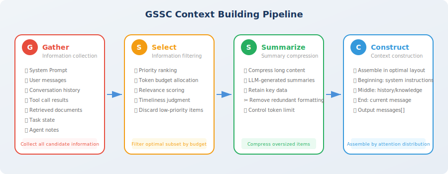

# Practice: Building a Context Manager

> 📖 *"Talk is cheap, show me the code." — Let's implement a complete context management system in code.*

After three sections of theoretical study, you've mastered the core concepts of context engineering: the six information sources, attention budget, the Lost-in-the-Middle effect, and the three long-horizon strategies. Now it's time to **translate this knowledge into runnable code**.

## Project Goal

In this section, we'll implement a **GSSC (Gather-Select-Summarize-Construct) context building pipeline** [1] — a complete workflow from information collection to context assembly that can serve as the context management infrastructure for any Agent project.

When complete, you'll have a directly reusable context management module that can:

- **Automatically collect** candidate information from the six information sources
- **Intelligently select** the optimal subset by priority and token budget
- **Automatically compress** overly long content into refined summaries
- **Assemble** the final context with the optimal layout based on Lost-in-the-Middle awareness



## GSSC Pipeline Overview

The GSSC pipeline contains four stages. Information flows through each stage like products on an assembly line:

| Stage | Name | Role | Corresponding Context Engineering Principle |
|-------|------|------|---------------------------------------------|
| **G** | Gather | Collect all candidate information from six sources | — |
| **S** | Select | Filter the optimal subset by priority and budget | Relevance-first + dynamic pruning |
| **S** | Summarize | Compress overly long content | Dynamic pruning |
| **C** | Construct | Assemble with optimal layout based on attention distribution | Structured presentation |

> 💡 **Design philosophy**: each stage of GSSC is an independent, replaceable module. You can replace the implementation of any stage based on your needs — for example, replace the Select stage with more advanced semantic filtering, or replace the Summarize stage with a specialized domain model.

## Complete Implementation

Next, we'll build the complete GSSC pipeline implementation step by step, starting from data structure definitions. The entire implementation consists of 6 steps, each corresponding to an independent module — you can read through them in order to understand the full picture, or replace any individual module to adapt to your own scenario.

### Step 1: Define Data Structures

The first step in any engineering project is to define clear data structures. In the GSSC pipeline, we need two core data structures: `ContextItem` (an information fragment in the context) and `ContextBudget` (budget configuration).

`ContextItem` is the "cargo" flowing through the pipeline — each information source (conversations, tool results, retrieved documents, etc.) is wrapped into a `ContextItem` with its metadata (source type, priority, relevance score, token count). This metadata will be used for decision-making in the subsequent Select and Construct stages.

```python
"""
GSSC Context Building Pipeline
Complete implementation code
"""

from dataclasses import dataclass, field
from typing import Optional
from enum import Enum
import json
import time


class InfoSource(Enum):
    """Information source types"""
    SYSTEM_PROMPT = "system_prompt"
    USER_MESSAGE = "user_message"
    CONVERSATION = "conversation"
    TOOL_RESULT = "tool_result"
    RETRIEVED_DOC = "retrieved_doc"
    TASK_STATE = "task_state"
    AGENT_NOTE = "agent_note"


@dataclass
class ContextItem:
    """An information fragment in the context"""
    content: str
    source: InfoSource
    priority: int = 5          # 1 (highest) to 10 (lowest)
    relevance_score: float = 1.0  # relevance to current task, 0~1
    token_count: int = 0
    timestamp: float = field(default_factory=time.time)
    metadata: dict = field(default_factory=dict)
    
    def __post_init__(self):
        if self.token_count == 0:
            # Simple token estimation
            self.token_count = len(self.content) // 4  # approximately 4 chars/token for English


@dataclass
class ContextBudget:
    """Context budget configuration"""
    total_tokens: int = 128000
    output_reserve: int = 4096
    system_prompt_max: int = 2000
    task_state_max: int = 3000
    agent_notes_max: int = 2000
    recent_conversation_max: int = 20000
    tool_results_max: int = 40000
    retrieved_docs_max: int = 20000
    history_max: int = 30000
    
    @property
    def available_input_tokens(self) -> int:
        return self.total_tokens - self.output_reserve
```

### Step 2: Implement Gather (Information Collection)

Gather is the first stage of the pipeline, and its responsibility is simple: **collect all potentially needed information from various sources to form a candidate pool**.

This stage deliberately does no filtering — collection is just collection, and judgment is left to subsequent stages. Like a library's acquisition department, first buy all the books that might be useful, and leave shelving and recommendations to other departments.

Note the priority calculation logic in the `add_conversation_history` method: more recent messages have higher priority. This is because in most Agent scenarios, recent conversations are usually most relevant to the current task — this assumption will be utilized in the subsequent Select stage.

```python
class GatherStage:
    """
    G - Gather stage: collect all potentially needed information.
    Pull data from various sources to form a candidate information pool.
    """
    
    def __init__(self):
        self.items: list[ContextItem] = []
    
    def add_system_prompt(self, prompt: str):
        """Add system prompt"""
        self.items.append(ContextItem(
            content=prompt,
            source=InfoSource.SYSTEM_PROMPT,
            priority=1,  # highest priority
        ))
    
    def add_user_message(self, message: str):
        """Add current user message"""
        self.items.append(ContextItem(
            content=message,
            source=InfoSource.USER_MESSAGE,
            priority=1,  # highest priority
        ))
    
    def add_conversation_history(self, messages: list[dict]):
        """Add conversation history"""
        for i, msg in enumerate(messages):
            # More recent messages have higher priority
            recency = i / len(messages)  # 0 (oldest) to 1 (newest)
            priority = int(8 - recency * 5)  # 3 (newest) to 8 (oldest)
            
            self.items.append(ContextItem(
                content=f"[{msg['role']}]: {msg['content']}",
                source=InfoSource.CONVERSATION,
                priority=priority,
                metadata={"turn_index": i, "role": msg["role"]},
            ))
    
    def add_tool_result(self, tool_name: str, result: str, 
                        is_recent: bool = True):
        """Add tool call result"""
        self.items.append(ContextItem(
            content=f"[Tool: {tool_name}]\n{result}",
            source=InfoSource.TOOL_RESULT,
            priority=2 if is_recent else 6,
            metadata={"tool_name": tool_name},
        ))
    
    def add_retrieved_doc(self, doc: str, score: float):
        """Add retrieved document"""
        self.items.append(ContextItem(
            content=doc,
            source=InfoSource.RETRIEVED_DOC,
            priority=4,
            relevance_score=score,
        ))
    
    def add_task_state(self, state: dict):
        """Add task state"""
        self.items.append(ContextItem(
            content=json.dumps(state, ensure_ascii=False, indent=2),
            source=InfoSource.TASK_STATE,
            priority=2,
        ))
    
    def add_agent_note(self, note: str):
        """Add Agent note"""
        self.items.append(ContextItem(
            content=note,
            source=InfoSource.AGENT_NOTE,
            priority=2,
        ))
    
    def get_all_items(self) -> list[ContextItem]:
        return self.items
```

### Step 3: Implement Select (Information Selection)

Select is the most critical decision-making stage in the pipeline — it determines which information from the candidate pool ultimately enters the context. This stage directly embodies the "relevance-first" and "dynamic pruning" principles discussed in Section 8.1.

The core design philosophy is **layered priority**: first unconditionally retain the system prompt and user message (they always have the highest priority), then fill in decreasing order of importance: task state, Agent notes, tool results, retrieved documents, conversation history. Each layer has its own token budget cap, and anything exceeding it is truncated.

The advantage of this layered design is: **when the total budget is tight, low-priority information is automatically pruned, while high-priority information is always guaranteed**. Like an airline's handling of overbooking — first-class passengers always board, economy class may need to be rebooked.

```python
class SelectStage:
    """
    S1 - Select stage: filter information by budget and priority.
    """
    
    def __init__(self, budget: ContextBudget):
        self.budget = budget
    
    def select(self, items: list[ContextItem]) -> list[ContextItem]:
        """Select information by priority and budget"""
        
        # Group by source
        groups: dict[InfoSource, list[ContextItem]] = {}
        for item in items:
            groups.setdefault(item.source, []).append(item)
        
        selected = []
        
        # 1. Required: system prompt and user message (always retained)
        for source in [InfoSource.SYSTEM_PROMPT, InfoSource.USER_MESSAGE]:
            if source in groups:
                selected.extend(groups[source])
        
        # 2. High priority: task state and Agent notes
        for source in [InfoSource.TASK_STATE, InfoSource.AGENT_NOTE]:
            if source in groups:
                items_in_group = groups[source]
                max_tokens = (self.budget.task_state_max 
                             if source == InfoSource.TASK_STATE 
                             else self.budget.agent_notes_max)
                selected.extend(
                    self._fit_within_budget(items_in_group, max_tokens)
                )
        
        # 3. Tool results (prioritize the most recent)
        if InfoSource.TOOL_RESULT in groups:
            tool_items = sorted(
                groups[InfoSource.TOOL_RESULT], 
                key=lambda x: x.priority
            )
            selected.extend(
                self._fit_within_budget(
                    tool_items, self.budget.tool_results_max
                )
            )
        
        # 4. Retrieved documents (sorted by relevance)
        if InfoSource.RETRIEVED_DOC in groups:
            doc_items = sorted(
                groups[InfoSource.RETRIEVED_DOC],
                key=lambda x: x.relevance_score,
                reverse=True
            )
            selected.extend(
                self._fit_within_budget(
                    doc_items, self.budget.retrieved_docs_max
                )
            )
        
        # 5. Conversation history (prioritize the most recent)
        if InfoSource.CONVERSATION in groups:
            conv_items = sorted(
                groups[InfoSource.CONVERSATION],
                key=lambda x: x.metadata.get("turn_index", 0),
                reverse=True  # most recent first
            )
            selected.extend(
                self._fit_within_budget(
                    conv_items, self.budget.history_max
                )
            )
        
        return selected
    
    def _fit_within_budget(
        self, items: list[ContextItem], max_tokens: int
    ) -> list[ContextItem]:
        """Select as many items as possible within the token budget"""
        selected = []
        remaining = max_tokens
        
        for item in items:
            if item.token_count <= remaining:
                selected.append(item)
                remaining -= item.token_count
            else:
                break
        
        return selected
```

### Step 4: Implement Summarize (Summary Compression)

After the Select stage filters the information, the selected fragments may still be very long — for example, a SQL query returned a 3,000-token table, or a retrieved document has 5,000 tokens. The Summarize stage's task is to **compress these overly long fragments, reducing token usage while preserving core information**.

An important design decision is: **different sources of information use different compression strategies**. Tool results need to preserve all numerical data (because the core value of a data analysis Agent lies in data accuracy), while retrieved documents only need to preserve key knowledge points (redundant background introductions and citation formats can be removed). This differentiated compression strategy preserves more valuable information than a "one-size-fits-all" generic summary.

```python
from openai import OpenAI

client = OpenAI()

class SummarizeStage:
    """
    S2 - Summarize stage: compress overly long content.
    """
    
    def __init__(self, max_item_tokens: int = 2000):
        self.max_item_tokens = max_item_tokens
    
    def summarize(self, items: list[ContextItem]) -> list[ContextItem]:
        """Summarize overly long items"""
        result = []
        
        for item in items:
            if item.token_count > self.max_item_tokens:
                # Needs compression
                compressed = self._compress_item(item)
                result.append(compressed)
            else:
                result.append(item)
        
        return result
    
    def _compress_item(self, item: ContextItem) -> ContextItem:
        """Compress a single context item"""
        
        # Use different compression strategies based on source
        if item.source == InfoSource.TOOL_RESULT:
            prompt = f"""Please compress the following tool call result, preserving key data and conclusions, removing redundant formatting:

{item.content}

Compression requirements:
- Preserve all numerical data
- Preserve conclusive information
- Remove duplicate headers, format descriptions, etc.
- Keep within 500 words"""
        
        elif item.source == InfoSource.RETRIEVED_DOC:
            prompt = f"""Please extract the core content most relevant to the current task from the following document:

{item.content}

Requirements: keep within 300 words, only preserve key knowledge points."""
        
        else:
            prompt = f"""Please briefly summarize the key points of the following content:

{item.content}

Requirements: keep within 300 words."""
        
        response = client.chat.completions.create(
            model="gpt-4o-mini",
            messages=[{"role": "user", "content": prompt}],
            max_tokens=600,
        )
        
        compressed_content = response.choices[0].message.content
        
        return ContextItem(
            content=f"[Compressed] {compressed_content}",
            source=item.source,
            priority=item.priority,
            relevance_score=item.relevance_score,
            metadata={**item.metadata, "compressed": True},
        )
```

### Step 5: Implement Construct (Context Assembly)

This is the final processing stage of the pipeline, and the direct application of the Lost-in-the-Middle effect knowledge from Section 8.2. The Construct stage is responsible for **assembling the filtered and compressed information fragments into the final messages list with the optimal attention layout**.

The core idea of the layout strategy is already explained in the code comments: the beginning area (high attention) holds system instructions and task state — ensuring the Agent "doesn't get lost"; the middle area (lower attention) holds auxiliary conversation history and retrieved documents — not fatal even if partially overlooked; the end area (highest attention) holds the user's current message — ensuring the Agent focuses tightly on the user's latest needs.

This "sandwich" layout design places each type of information in the position most suited to it — critical information won't be "buried" in the middle and overlooked, and auxiliary information won't occupy precious head/tail attention positions.

```python
class ConstructStage:
    """
    C - Construct stage: assemble the final context with optimal layout.
    
    Layout strategy (based on the Lost-in-the-Middle effect):
    [High attention] System Prompt → Task State → Agent Notes
    [Medium attention] Conversation History → Retrieved Docs → Tool Results
    [High attention] Recent Conversation → User Message
    """
    
    def construct(self, items: list[ContextItem]) -> list[dict]:
        """Assemble the final messages list"""
        
        # Group by source
        groups: dict[InfoSource, list[ContextItem]] = {}
        for item in items:
            groups.setdefault(item.source, []).append(item)
        
        messages = []
        
        # === Beginning area (high attention) ===
        
        # 1. System Prompt
        if InfoSource.SYSTEM_PROMPT in groups:
            system_content = groups[InfoSource.SYSTEM_PROMPT][0].content
            
            # Embed task state and notes into system message
            extra_sections = []
            
            if InfoSource.TASK_STATE in groups:
                state_content = groups[InfoSource.TASK_STATE][0].content
                extra_sections.append(f"\n\n## Current Task State\n{state_content}")
            
            if InfoSource.AGENT_NOTE in groups:
                note_content = groups[InfoSource.AGENT_NOTE][0].content
                extra_sections.append(f"\n\n## Execution Notes\n{note_content}")
            
            messages.append({
                "role": "system",
                "content": system_content + "".join(extra_sections)
            })
        
        # === Middle area (lower attention → place auxiliary information) ===
        
        # 2. Retrieved documents
        if InfoSource.RETRIEVED_DOC in groups:
            docs = [item.content for item in groups[InfoSource.RETRIEVED_DOC]]
            messages.append({
                "role": "system",
                "content": "## Relevant Knowledge\n\n" + "\n\n---\n\n".join(docs)
            })
        
        # 3. Conversation history (in chronological order)
        if InfoSource.CONVERSATION in groups:
            conv_items = sorted(
                groups[InfoSource.CONVERSATION],
                key=lambda x: x.metadata.get("turn_index", 0)
            )
            for item in conv_items:
                role = item.metadata.get("role", "user")
                content = item.content
                # Remove the "[role]: " prefix
                if content.startswith(f"[{role}]: "):
                    content = content[len(f"[{role}]: "):]
                messages.append({"role": role, "content": content})
        
        # 4. Tool results
        if InfoSource.TOOL_RESULT in groups:
            for item in groups[InfoSource.TOOL_RESULT]:
                messages.append({
                    "role": "assistant",
                    "content": item.content,
                })
        
        # === End area (highest attention) ===
        
        # 5. Current user message (always at the very end)
        if InfoSource.USER_MESSAGE in groups:
            messages.append({
                "role": "user",
                "content": groups[InfoSource.USER_MESSAGE][0].content
            })
        
        return messages
```

### Step 6: Assemble the GSSC Pipeline

Now comes the most exciting part — assembling all the previous modules into a complete pipeline. The `GSSCPipeline` class is the entry point for the entire system, providing a clean `build()` interface that lets callers simply provide raw data and receive an optimized messages list — ready to pass directly to any LLM API.

Note the four core lines of logic in the `build()` method — each corresponds to one stage of GSSC, with information flowing like water through Gather → Select → Summarize → Construct, ultimately outputting high-quality context. Each stage prints a log line, letting you clearly see how information changes at each stage.

```python
class GSSCPipeline:
    """
    GSSC Context Building Pipeline
    Gather → Select → Summarize → Construct
    """
    
    def __init__(
        self,
        budget: Optional[ContextBudget] = None,
        max_item_tokens: int = 2000,
    ):
        self.budget = budget or ContextBudget()
        self.gather = GatherStage()
        self.select = SelectStage(self.budget)
        self.summarize = SummarizeStage(max_item_tokens)
        self.construct = ConstructStage()
    
    def build(
        self,
        system_prompt: str,
        user_message: str,
        conversation_history: list[dict] = None,
        tool_results: list[dict] = None,
        retrieved_docs: list[dict] = None,
        task_state: dict = None,
        agent_notes: str = None,
    ) -> list[dict]:
        """
        One-stop build of optimal context.
        
        Args:
            system_prompt: system prompt
            user_message: current user message
            conversation_history: [{"role": "user/assistant", "content": "..."}]
            tool_results: [{"tool": "name", "result": "...", "recent": True}]
            retrieved_docs: [{"content": "...", "score": 0.95}]
            task_state: {"current_step": 3, "completed": [...], ...}
            agent_notes: Agent's structured notes
        
        Returns:
            list[dict]: messages list ready to pass directly to LLM API
        """
        
        # === G: Gather ===
        self.gather = GatherStage()  # reset
        self.gather.add_system_prompt(system_prompt)
        self.gather.add_user_message(user_message)
        
        if conversation_history:
            self.gather.add_conversation_history(conversation_history)
        
        if tool_results:
            for tr in tool_results:
                self.gather.add_tool_result(
                    tr["tool"], tr["result"], tr.get("recent", False)
                )
        
        if retrieved_docs:
            for doc in retrieved_docs:
                self.gather.add_retrieved_doc(doc["content"], doc["score"])
        
        if task_state:
            self.gather.add_task_state(task_state)
        
        if agent_notes:
            self.gather.add_agent_note(agent_notes)
        
        all_items = self.gather.get_all_items()
        print(f"📥 Gather: collected {len(all_items)} information fragments")
        
        # === S1: Select ===
        selected_items = self.select.select(all_items)
        print(f"🔍 Select: filtered to {len(selected_items)} fragments")
        
        # === S2: Summarize ===
        summarized_items = self.summarize.summarize(selected_items)
        compressed_count = sum(
            1 for item in summarized_items 
            if item.metadata.get("compressed", False)
        )
        print(f"📦 Summarize: compressed {compressed_count} overly long fragments")
        
        # === C: Construct ===
        messages = self.construct.construct(summarized_items)
        total_tokens = sum(
            len(m["content"]) // 4 for m in messages
        )
        print(f"🏗️ Construct: build complete, approximately {total_tokens:,} tokens")
        
        return messages


# === Usage Example ===

pipeline = GSSCPipeline(
    budget=ContextBudget(total_tokens=128000),
    max_item_tokens=2000,
)

messages = pipeline.build(
    system_prompt="You are a senior data analyst specializing in user behavior analysis.",
    user_message="Based on the previous analysis, please provide the top 3 recommendations for improving retention.",
    conversation_history=[
        {"role": "user", "content": "Help me analyze Q1 user retention data"},
        {"role": "assistant", "content": "Sure, let me query the database..."},
        {"role": "user", "content": "Focus on new user retention"},
        {"role": "assistant", "content": "New user 7-day retention rate is 38%, down 12% month-over-month..."},
    ],
    tool_results=[
        {
            "tool": "sql_query",
            "result": "New user 7-day retention: 38%, Existing user 7-day retention: 65%, ...",
            "recent": True,
        },
    ],
    task_state={
        "objective": "Analyze reasons for Q1 user retention rate decline",
        "completed_steps": ["Data query", "Basic statistics", "Segment analysis"],
        "current_step": "Generate recommendations",
    },
    agent_notes="Key finding: new user first-day onboarding completion rate is only 45%, the main cause of retention decline.",
)

# Output:
# 📥 Gather: collected 9 information fragments
# 🔍 Select: filtered to 9 fragments
# 📦 Summarize: compressed 0 overly long fragments
# 🏗️ Construct: build complete, approximately XXX tokens
```

## Section Summary

Congratulations on completing the implementation of the GSSC context building pipeline! This is a context management infrastructure that can be directly applied to production projects.

| Stage | Core Function | Key Design |
|-------|--------------|-----------|
| **Gather** | Collect candidate information from six sources | Automatically assign priority based on recency |
| **Select** | Filter by priority and budget | Required → High priority → Tool results → Docs → History |
| **Summarize** | Compress overly long content | Use different compression strategies by source type |
| **Construct** | Assemble with Lost-in-the-Middle optimal layout | Beginning=system+state, Middle=history+knowledge, End=user message |

### Using GSSC in Your Project

The GSSC pipeline is modular, and you can extend it as needed:

- **Add a caching layer**: add caching in the Summarize stage to avoid repeatedly compressing the same content
- **Integrate embeddings**: use semantic similarity in the Select stage for more precise filtering
- **Add monitoring**: record token allocation and compression ratios for each build, used to optimize budget configuration
- **Multimodal support**: extend the InfoSource enum to support images, audio, and other multimodal information

## 🤔 Reflection Exercises

1. How would you add a caching mechanism to the GSSC pipeline to avoid repeatedly compressing the same content? Design a strategy for cache keys.
2. If the Agent supports multimodal input (images, audio), how would the GSSC pipeline need to be extended? What changes would the Gather and Select stages each need?
3. How do you evaluate the effectiveness of context management? Try designing an A/B test plan to compare Agent output quality between "no management" vs. "GSSC management."

## Chapter 8 Review

You've now fully studied the theory and practice of context engineering:

| Section | Core Takeaway | Key Concepts |
|---------|--------------|-------------|
| 8.1 | Crossing from prompt engineering to context engineering | Six information sources, three principles, mindset shift |
| 8.2 | Understanding context window constraints and attention distribution | Context corruption, Lost-in-the-Middle, attention budget |
| 8.3 | Mastering three strategies for long-horizon tasks | Compaction, structured notes, sub-agent architecture |
| 8.4 | Hands-on implementation of reusable context management infrastructure | GSSC pipeline: Gather → Select → Summarize → Construct |
| 8.5 | Understanding frontier technology breakthroughs and methodology evolution | Anthropic methodology, ACE self-evolution, million-token windows, KV-Cache optimization |

> 💡 **Next steps**: context engineering is a foundational capability that runs throughout the entire book. In subsequent chapters, whether it's tool calling (Chapter 4), memory systems (Chapter 5), or RAG (Chapter 7), you'll repeatedly use the context management thinking learned in this chapter. It's recommended to save the GSSC pipeline code to your own toolkit — the hands-on projects in subsequent chapters will directly reuse it.

---

*Next: [8.5 Latest Advances in Context Engineering](./05_latest_advances.md)*

---

## References

[1] ANTHROPIC. Building effective agents[EB/OL]. 2024. https://www.anthropic.com/engineering/building-effective-agents.