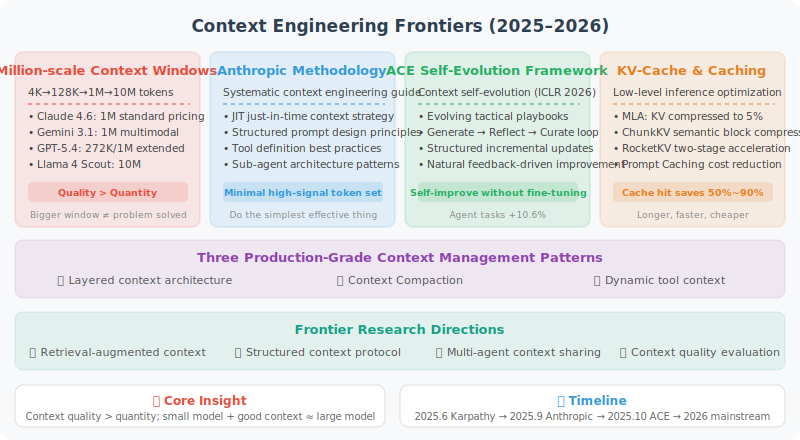

# Latest Advances in Context Engineering

> 🔬 *"The expansion of context windows is not the endpoint — how to efficiently utilize the 'attention bandwidth' of every token is the real challenge."*

In the previous sections, we learned the theoretical foundations of context engineering — from the distinction between context vs. prompt engineering, attention budget management, to long-horizon task strategies and GSSC practice. These are the "fundamentals." This section discusses the **latest technology breakthroughs and methodology evolution** happening in this field, which are fundamentally changing how Agent developers manage context.

In June 2025, Andrej Karpathy publicly stated his preference for using "Context Engineering" to replace the term "Prompt Engineering" [1]. Subsequently, leading institutions like Anthropic [2] and LangChain [3] published systematic context engineering guides. In 2025–2026, context engineering rapidly grew from an emerging concept into the **core engineering discipline** of Agent development.



## Million-Token Context Windows: From Arms Race to Practical Deployment

### The Explosive Growth of Context Windows

In 2024–2026, context windows experienced a leap from the hundred-thousand level to the ten-million level:

| Period | Representative Model | Context Window | Equivalent Text |
|--------|---------------------|---------------|----------------|
| Early 2023 | GPT-3.5 | 4K tokens | ~3,000 words |
| Mid 2023 | Claude 2 | 100K tokens | ~75,000 words |
| 2024 | GPT-4 Turbo | 128K tokens | ~96,000 words |
| Early 2025 | Gemini 2.5 Pro | 1M tokens | ~750,000 words (~10 books) |
| Mid 2025 | Llama 4 Scout | 10M tokens | ~7,500,000 words (~100 books) |
| Early 2026 | Claude Opus 4.6 / Sonnet 4.6 | 1M tokens | 1M token standard pricing, no long-text surcharge |
| Early 2026 | GPT-5.4 | 272K (standard) / 1M (extended) | 2× input surcharge beyond 272K |
| Early 2026 | Gemini 3.1 Pro | 1M tokens | Supports video/audio/image/text multimodal |
| 2026 (experimental) | Magic.dev LTM-2-Mini | 100M tokens | ~75M words (theoretical, no public user validation) |

Two key trends are worth noting:

**1. Million-token becomes standard**: by early 2026, mainstream models including Claude 4.6, Gemini 3.x, and Llama 4 Maverick all offer 1M token context windows. This means "entire book" or even "entire codebase" level input is no longer a dream.

**2. Pricing strategy divergence**: Anthropic (Claude 4.6) implements standard pricing for 1M tokens with no additional fees; while OpenAI (GPT-5.4) charges a significant surcharge beyond 272K. This pricing strategy directly affects Agent architecture choices.

But bigger window ≠ problem solved. The **Lost-in-the-Middle** problem we discussed in Section 8.2 hasn't disappeared — in fact, when the window expands from 128K to 1M, this problem becomes even more severe.

### Real-World Testing: True Capabilities of Large Windows

```python
# A real test: retrieving specific information in a 1 million token context
import time

def needle_in_haystack_test(model, context_size, needle_position):
    """
    Classic "needle in a haystack" test.
    Insert a key piece of information at a specific position in a large amount of filler text,
    then ask the model a question related to that information.
    """
    haystack = generate_padding_text(context_size)
    needle = "The secret number for project Moonlight is 42-ALPHA-7."
    
    # Insert key information at the specified position
    position = int(len(haystack) * needle_position)
    context = haystack[:position] + needle + haystack[position:]
    
    response = model.query(
        context=context,
        question="What is the secret number for project Moonlight?"
    )
    return response

# Real-world test results for various models in 2026 (retrieval accuracy)
results = {
    "Claude Opus 4.6 (1M)": {
        "Beginning 10%": "✅ 99%",
        "Middle 50%": "✅ 97%",  # most uniform performance within 1M range
        "End 90%": "✅ 99%",
        "Full 100%": "✅ 95%",  # quality remains stable at million-token scale
    },
    "Gemini 3.1 Pro (1M)": {
        "Beginning 10%": "✅ 99%",
        "Middle 50%": "✅ 96%",  # significantly improved Lost-in-the-Middle
        "End 90%": "✅ 98%",
        "Full 100%": "⚠️ 89%",  # still some performance degradation near full capacity
    },
    "GPT-5.4 (272K standard)": {
        "Beginning 10%": "✅ 99%",
        "Middle 50%": "✅ 93%",
        "End 90%": "✅ 97%",
        "Full 100%": "⚠️ 88%",
    },
    "DeepSeek R1 (128K)": {
        "Beginning 10%": "✅ 98%",
        "Middle 50%": "⚠️ 88%",
        "End 90%": "✅ 95%",
        "Full 100%": "⚠️ 82%",
    },
}
```

> 💡 **Practical advice**: don't blindly chase the largest window. If 128K is sufficient, don't fill 1M. **Context quality is far more important than context quantity** — this is the first principle of context engineering. A solution with perfect recall within 100K tokens is often superior to one that performs unstably at 500K tokens.

## Anthropic's Context Engineering Methodology: From Practice to Theory

On September 29, 2025, Anthropic published the landmark technical article "Effective Context Engineering for AI Agents" [2], the first systematic summary of context management methodology for production-grade Agents. This article had a profound impact on the entire industry.

### Core Philosophy: Context Is a Limited and Precious Resource

Anthropic's core view is: **find the minimal set of high-signal tokens that maximizes the probability of the desired outcome**. This is consistent with the "quality-first" principle we discussed in Section 8.1, but Anthropic provides a more actionable framework from an engineering practice perspective.

```python
# Anthropic's core context engineering principles (expressed in pseudocode)
class AnthropicContextPhilosophy:
    """
    Core philosophy: context is a limited resource with diminishing marginal returns.
    
    As token count increases:
    - First 10K tokens: high information gain per token
    - 10K–50K: information gain starts to diminish
    - 50K–200K: requires careful filtering to maintain signal density
    - 200K+: without management, noise may overwhelm signal
    """
    
    principles = [
        "Find the minimal set of high-signal tokens",      # more is not better
        "Re-curate context at each inference",             # context is dynamic
        "Treat context as a resource with diminishing returns",  # the 100Kth token is worth far less than the 1Kth
        "Do the simplest effective thing",                 # over-engineering is also a waste
    ]
```

### Three Pillars of "Effective Context"

Anthropic breaks down the composition of high-quality context into three levels:

**1. System Prompt Design — Finding the Right "Altitude"**

```python
# ❌ Overly Prescriptive — too granular, brittle
system_prompt_bad_1 = """
If the user asks about a file, first check if the file exists. If the file exists and is smaller than 100KB,
read it directly. If larger than 100KB but smaller than 1MB, use chunked reading. If larger than 1MB,
first check the file type. If it's a text file, use streaming...
"""

# ❌ Too Vague — no practical guidance
system_prompt_bad_2 = """You are a helpful programming assistant. Please try your best to help users."""

# ✅ The right "altitude" — clear principles + appropriate flexibility
system_prompt_good = """
You are a professional programming assistant.
<core_principles>
- Understand the intent of existing code before modifying it
- Prioritize using patterns and conventions already in the project
- For destructive operations (deleting files, rewriting modules), confirm before executing
</core_principles>

<tool_usage>
You can use tools like read_file, write_file, search, etc.
Follow the principle of least privilege when choosing tools — read rather than write if possible, search rather than full scan.
</tool_usage>
"""
```

**2. Tool Definitions — The Interface Contract Between Agent and World**

```python
# Anthropic's tool design principles
tool_design_principles = {
    "Token efficient": "Tool returns should be concise, don't return large amounts of irrelevant information",
    "Non-overlapping functionality": "Like a well-designed function library, each tool has a single responsibility",
    "Self-contained": "Tool descriptions should be clear enough that — if a human engineer can't determine when to use it, neither can AI",
    "Robustness": "Handle erroneous inputs gracefully, return useful error messages",
}

# ❌ Poor tool design: overlapping functionality, vague descriptions
tools_bad = [
    {"name": "search_files", "description": "Search files"},
    {"name": "find_files", "description": "Find files"},       # What's the difference from above?
    {"name": "lookup_files", "description": "Look up file content"},  # Even more ambiguous
]

# ✅ Good tool design: clear responsibilities, unambiguous
tools_good = [
    {"name": "glob_search", "description": "Search by filename pattern (e.g., *.py), returns list of matching file paths"},
    {"name": "content_search", "description": "Search files by content regex, returns matching lines with context"},
    {"name": "read_file", "description": "Read all or part of a file at the specified path (supports offset+limit)"},
]
```

**3. Just-in-Time Context — Anthropic's Killer Feature**

This is Anthropic's most influential practice pattern. The core idea is: **don't preload all potentially needed information; instead, maintain lightweight identifiers and retrieve on demand at runtime**.

```python
class JustInTimeContextStrategy:
    """
    Just-in-Time context strategy (core pattern of Anthropic / Claude Code)
    
    Traditional approach: preload all potentially relevant files into context
    JIT approach: only maintain file paths/query pointers, load when needed
    
    Effect: context usage reduced by 70%+, and information is more precise
    """
    
    def __init__(self):
        # Maintain lightweight identifiers, not full content
        self.file_index = {}       # file path → brief summary
        self.query_pointers = {}   # query description → database/API endpoint
        self.web_links = {}        # topic → URL
    
    def build_initial_context(self, task):
        """Initial context only contains the 'map', not the 'territory'"""
        return {
            "system": self.system_prompt,
            "task": task,
            "available_resources": {
                "files": list(self.file_index.keys()),    # paths only
                "databases": list(self.query_pointers.keys()),
                "docs": list(self.web_links.keys()),
            },
            # Tell the Agent: you have these resources available, actively retrieve when needed
            "instruction": "Use tools to fetch specific content on demand. Don't guess."
        }
    
    def on_agent_request(self, resource_type, identifier):
        """Load specific content only when the Agent actively requests it"""
        if resource_type == "file":
            return read_file(identifier)  # only reads the file at this point
        elif resource_type == "database":
            return execute_query(self.query_pointers[identifier])
        elif resource_type == "web":
            return fetch_url(self.web_links[identifier])
```

> 💡 **How Claude Code actually works**: Claude Code only reads the `CLAUDE.md` file in the project root directory at startup (serving as the project's "user manual"), then navigates the entire codebase on demand using primitives like `glob` and `grep`. It never loads the entire codebase into context — even when the model window is "large enough." This is the quintessential application of JIT thinking.

## ACE: Self-Evolving Context Engineering (ICLR 2026)

In October 2025, Zhang et al. proposed the **ACE (Agentic Context Engineering)** framework [4], which was accepted at ICLR 2026. This is an important breakthrough in the field of context engineering — **letting Agents learn to manage and optimize their own context**.

### Core Problem: Context Collapse

Traditional context management faces two chronic issues:

- **Brevity Bias**: losing domain-depth insights when compressing summaries — the more you compress, the more "generic" it becomes
- **Context Collapse**: details gradually erode during iterative rewriting, and eventually "summaries of summaries" become completely uninformative

```python
# Intuitive understanding of context collapse
def context_collapse_demo():
    """
    Simulate the context collapse process.
    
    Each compression loses some details. After 5-10 rounds of compression,
    the original information may only retain the highest-level abstractions —
    specific numbers, conditional branches, and edge cases are all lost.
    """
    original = """
    When processing order #12345, we found: when a user simultaneously uses
    coupon A (spend $300 save $50) and member discount (20% off), the system
    incorrectly applies the discount first then the coupon, resulting in an
    actual reduction of $50 + ($300-$50)*0.2 = $100, while the correct logic
    should be $300*0.8 - $50 = $190, a difference of $90.
    Fixed in the calculate_discount() function in order_service.py.
    Needs regression testing of test_discount_combination_cases().
    """
    
    # Round 1 compression
    round_1 = "Fixed calculation order error when coupon and member discount are used simultaneously, $90 difference"
    # Round 2 compression
    round_2 = "Fixed discount calculation error"
    # Round 3 compression
    round_3 = "Fixed a bug"
    # → Specific order number, amounts, file location, test cases all lost!
```

### ACE Framework: Letting Context Self-Evolve

ACE's core innovation is treating context as an **"Evolving Playbook"** that continuously improves through three modular stages:

```python
class ACEFramework:
    """
    ACE: Agentic Context Engineering
    
    Core idea: context is not static text, but a "tactical playbook" that
    continuously evolves with the Agent's execution experience.
    
    Three stages form a cycle: Generate → Reflect → Curate
    """
    
    def __init__(self, base_context):
        self.playbook = base_context  # initial context (tactical playbook)
        self.experience_buffer = []    # experience buffer
    
    # Stage 1: Generate
    def generate(self, task):
        """
        Agent executes the task using the current playbook,
        collecting feedback from the execution process (success/failure/surprises)
        """
        result = self.agent.execute(task, context=self.playbook)
        feedback = self.collect_natural_feedback(result)
        self.experience_buffer.append({
            "task": task,
            "result": result,
            "feedback": feedback,  # natural execution feedback, no manual annotation needed
        })
        return result
    
    # Stage 2: Reflect
    def reflect(self):
        """
        Analyze execution feedback in the experience buffer,
        identify areas in the playbook that need improvement
        """
        insights = self.agent.analyze(
            prompt="Analyze the following execution experiences, identify success patterns and failure causes:",
            data=self.experience_buffer
        )
        return insights  # e.g., "When encountering nested JSON, validate schema first"
    
    # Stage 3: Curate
    def curate(self, insights):
        """
        Key innovation: structured incremental updates, not full rewrites.
        
        - New strategies added as "patches" to the playbook
        - Outdated strategies are marked and cleaned up
        - Preserves detail depth, prevents context collapse
        """
        self.playbook = self.incremental_update(
            current=self.playbook,
            new_insights=insights,
            mode="structured_patch"  # incremental patch, not full rewrite
        )
    
    def evolution_loop(self, tasks):
        """Complete evolution loop"""
        for task in tasks:
            self.generate(task)
            if len(self.experience_buffer) >= 5:  # reflect every 5 tasks
                insights = self.reflect()
                self.curate(insights)
                self.experience_buffer.clear()
```

### ACE Experimental Results

| Benchmark | Baseline Performance | ACE Improvement | Notes |
|-----------|---------------------|----------------|-------|
| AppWorld (Agent tasks) | Baseline model | **+10.6%** | Using smaller open-source models, on par with top production Agents |
| Finance domain tasks | Baseline model | **+8.6%** | Domain knowledge continuously accumulates through iterations |
| Adaptation latency | Fine-tuning approach | **Significantly reduced** | No retraining needed, only update context |
| Deployment cost | Fine-tuning approach | **Significantly reduced** | One context applies to all instances |

> 💡 **Why this matters**: ACE proves an exciting possibility: **Agents can self-improve by optimizing context, without fine-tuning model weights**. This means that even using smaller open-source models, careful context engineering can achieve performance comparable to large commercial models. For resource-constrained teams, this is an extremely cost-effective path.

## Context Caching: The Economics of Context Reuse

### Problem: Repeatedly Paying the "Context Tax"

In the traditional model, every API call requires resending the complete System Prompt + tool definitions + conversation history. If your Agent has an 8K token system prompt, you pay for those 8K tokens every round of conversation.

```python
# Traditional mode: send everything completely each time
for user_message in conversation:
    response = client.chat.completions.create(
        model="gpt-5.4",
        messages=[
            {"role": "system", "content": system_prompt},  # 8K tokens, repeated every time
            *conversation_history,                          # continuously growing
            {"role": "user", "content": user_message},
        ],
        tools=tool_definitions,  # 2K tokens, repeated every time
    )
    # If the conversation is 100 rounds, system_prompt is "billed" 100 times
```

### Solution: Prompt Caching

In 2024–2025, major vendors successively launched **Prompt Caching** features. By 2026, this has become a **standard optimization** for Agent development:

```python
# Anthropic Prompt Caching example (latest 2026 API)
from anthropic import Anthropic

client = Anthropic()

# First call: cache system prompt (cache write has 25% additional fee)
response = client.messages.create(
    model="claude-sonnet-4.6",
    max_tokens=1024,
    system=[
        {
            "type": "text",
            "text": long_system_prompt,      # large system prompt
            "cache_control": {"type": "ephemeral"}  # mark as cacheable
        }
    ],
    messages=[{"role": "user", "content": "Hello"}]
)

# Subsequent calls: cache hit, input price reduced by 90%!
# Same cache_control block content unchanged → automatically hits cache
response = client.messages.create(
    model="claude-sonnet-4.6",
    max_tokens=1024,
    system=[
        {
            "type": "text",
            "text": long_system_prompt,      # content unchanged → cache hit
            "cache_control": {"type": "ephemeral"}
        }
    ],
    messages=[{"role": "user", "content": "Help me analyze this code"}]
)
```

```python
# Google Gemini Context Caching example
import google.generativeai as genai

# Create a reusable cache (configurable TTL)
cache = genai.caching.CachedContent.create(
    model="gemini-3.1-pro",
    display_name="agent-system-context",
    system_instruction="You are an expert coding assistant...",
    contents=[
        # Can cache large reference documents
        genai.upload_file("codebase_summary.txt"),
        genai.upload_file("api_documentation.pdf"),
    ],
    ttl=datetime.timedelta(hours=1),  # cache for 1 hour
)

# Subsequent calls directly reference the cache
model = genai.GenerativeModel.from_cached_content(cache)
response = model.generate_content("What is the rate limiting strategy for this API?")
# Token cost for cached portion is significantly reduced
```

### The Economics of Caching (March 2026 data)

| Provider | Cache Write Cost | Cache Hit Cost | Savings | Cache TTL |
|----------|-----------------|---------------|---------|-----------|
| Anthropic | Normal price ×1.25 | Normal price ×0.1 | **90%** savings on hit | 5 minutes (ephemeral) |
| Google | Normal price ×1.0 | Normal price ×0.25 | **75%** savings on hit | Customizable (1min–1h) |
| OpenAI | Normal price ×1.0 | Normal price ×0.5 | **50%** savings on hit | Automatically managed |

> 💡 **Impact on Agents**: for Agents with long system prompts + multi-round conversations, Prompt Caching can reduce total costs by **40%–70%**. This is a pure win optimization — especially under Claude 4.6's 1M token window, the economic benefits of caching large reference documents are even more significant.

## KV-Cache Optimization: Context Acceleration at the Model Level

### What Is KV-Cache?

During Transformer inference, the Key and Value tensors at each layer, once computed, can be cached and reused — this is **KV-Cache**. It avoids redundant computation of already-processed tokens and is the core technology for efficient autoregressive generation.

```python
# Intuitive understanding of KV-Cache
class TransformerWithKVCache:
    """
    Without KV-Cache: generating the Nth token requires recomputing attention for all N-1 tokens
    With KV-Cache: K, V for the first N-1 tokens are already cached, only compute attention for the new token

    Time complexity: O(N²) → O(N)
    """
    def generate_next_token(self, input_ids, past_kv_cache=None):
        if past_kv_cache is not None:
            # Only process the latest token
            new_token_kv = self.attention(input_ids[-1:], past_kv_cache)
            updated_cache = concat(past_kv_cache, new_token_kv)
        else:
            # First call, process all tokens
            updated_cache = self.attention(input_ids)
        return next_token, updated_cache
```

### New KV-Cache Optimization Techniques in 2025–2026

As context windows expand to the million-token level, KV-Cache memory usage becomes a critical bottleneck. Here are the latest optimization solutions:

**1. MLA (Multi-head Latent Attention) — DeepSeek's Continued Innovation**

```python
# DeepSeek-V3/R1's original MLA, widely studied in 2025-2026
# Core idea: compress KV into a low-dimensional latent space
# Effect: KV-Cache size is only ~5% of standard MHA

class MultiHeadLatentAttention:
    """
    Standard MHA: cache_size = num_layers × num_heads × seq_len × head_dim × 2
    MLA:          cache_size = num_layers × seq_len × latent_dim × 2
    
    When latent_dim << num_heads × head_dim, cache size is dramatically reduced
    """
    def compress_kv(self, keys, values):
        # Project high-dimensional KV into low-dimensional latent space
        latent = self.down_proj(concat(keys, values))
        return latent  # only cache this compressed representation
    
    def restore_kv(self, latent):
        # Restore KV from latent space during inference
        keys, values = self.up_proj(latent).split(2)
        return keys, values
```

**2. ChunkKV — Semantics-Preserving KV-Cache Compression (NeurIPS 2025)**

```python
# ChunkKV: semantics-preserving KV-Cache compression method proposed in 2025
# Core idea: not token-by-token eviction, but retain or evict entire "semantic chunks"

class ChunkKV:
    """
    Traditional methods (like H2O) evaluate importance token by token → easily breaks semantic coherence
    ChunkKV divides KV-Cache into semantically coherent chunks → chunk-level retention/eviction
    
    Achieves SOTA performance at 10% compression ratio
    """
    def compress(self, kv_cache, compression_ratio=0.1):
        # 1. Divide KV-Cache into chunks by semantic similarity
        chunks = self.semantic_chunking(kv_cache)
        
        # 2. Evaluate the overall importance of each chunk
        chunk_scores = [self.score_chunk(chunk) for chunk in chunks]
        
        # 3. Retain the most important chunks (maintaining semantic integrity)
        keep_count = int(len(chunks) * compression_ratio)
        top_chunks = sorted(
            zip(chunks, chunk_scores), 
            key=lambda x: -x[1]
        )[:keep_count]
        
        return merge_chunks([c for c, _ in top_chunks])
```

**3. RocketKV — Two-Stage Compression for Long-Context Inference Acceleration (2025)**

```python
# RocketKV: two-stage KV-Cache compression for long-context LLM inference
class RocketKV:
    """
    Stage 1 (coarse filter): quickly eliminate obviously unimportant tokens based on attention scores
    Stage 2 (fine selection): fine-grained importance evaluation and retention of remaining tokens
    
    Effect: inference speed improved 2-4x while maintaining quality
    """
    def two_stage_compress(self, kv_cache):
        # Stage 1: fast coarse filter (low computational cost)
        coarse_mask = self.coarse_filter(kv_cache, keep_ratio=0.3)
        candidates = kv_cache[coarse_mask]
        
        # Stage 2: fine selection (high-quality retention)
        fine_mask = self.fine_select(candidates, keep_ratio=0.5)
        return candidates[fine_mask]  # final retention of ~15% of KV
```

**4. Comprehensive Comparison**

| Technique | Principle | Compression Ratio | Quality Loss | Published/Adopted |
|-----------|-----------|------------------|-------------|------------------|
| GQA | Multiple query heads share KV | 4–8x | Extremely low | 2023, now mainstream standard |
| MLA (DeepSeek) | KV projected to low-dimensional latent space | ~20x | Extremely low | 2024, adopted by DeepSeek series |
| KV-Cache Quantization (INT8/FP8) | Reduce numerical precision | 2–4x | Extremely low | 2024+, widely adopted |
| H2O (Heavy-Hitter Oracle) | Only keep KV of "important" tokens | 5–20x | Low (task-dependent) | 2024 |
| ChunkKV | Semantic chunk-level retention/eviction | 3–10x | Low | NeurIPS 2025 |
| RocketKV | Two-stage coarse filter + fine selection | 5–7x | Low | 2025 |
| SCOPE | Decoding phase optimization | 3–5x | Low | ACL 2025 |
| StreamingLLM | Attention sink + sliding window | Dynamic | Moderate | 2024+ |

> 💡 **Impact on Agents**: these underlying optimizations allow model vendors to offer longer contexts at lower cost. As an Agent developer, you don't need to implement these techniques yourself, but understanding them helps make better model selection and architecture decisions — for example, when using DeepSeek series models, MLA's low memory overhead makes long-context inference feasible even on consumer-grade GPUs.

## Production-Grade Context Management Patterns

### Pattern 1: Tiered Context Architecture

In production-grade Agents, context is not a flat messages list but is **hierarchically organized**:

```python
class TieredContextManager:
    """
    Tiered context architecture (reference: Anthropic methodology)
    L0: System core (always retained)          ~2K tokens
    L1: Task context (current task related)     ~4K tokens  
    L2: Working memory (recent interactions)    ~8K tokens
    L3: Reference materials (retrieved on demand) ~dynamic
    """
    
    def __init__(self, max_tokens=128000):
        self.max_tokens = max_tokens
        self.layers = {
            "L0_system": {
                "budget": 2000,
                "priority": "NEVER_DROP",
                "content": None  # system prompt, role definition
            },
            "L1_task": {
                "budget": 4000,
                "priority": "HIGH",
                "content": None  # current task goal, constraints
            },
            "L2_working": {
                "budget": 8000,
                "priority": "MEDIUM",
                "content": None  # recent conversations and intermediate results
            },
            "L3_reference": {
                "budget": None,  # dynamically allocate remaining space
                "priority": "LOW",
                "content": None  # RAG retrieval results, document fragments
            },
        }
    
    def build_context(self, task, history, retrieved_docs):
        """Build priority-ordered context"""
        context = []
        used_tokens = 0
        
        # L0: System core (always included)
        context.append({"role": "system", "content": self.system_prompt})
        used_tokens += count_tokens(self.system_prompt)
        
        # L1: Current task (always included)
        task_context = self.format_task(task)
        context.append({"role": "system", "content": task_context})
        used_tokens += count_tokens(task_context)
        
        # L2: Working memory (keep most recent N rounds, compress if necessary)
        remaining = self.max_tokens - used_tokens - 4000  # reserve 4K for output
        working_memory = self.compress_history(history, budget=min(8000, remaining // 2))
        context.extend(working_memory)
        used_tokens += count_tokens(working_memory)
        
        # L3: Reference materials (fill remaining space)
        remaining = self.max_tokens - used_tokens - 4000
        if remaining > 500 and retrieved_docs:
            selected = self.select_references(retrieved_docs, budget=remaining)
            context.append({"role": "system", "content": f"Reference materials:\n{selected}"})
        
        return context
```

### Pattern 2: Context Compaction

This is the production pattern used by Anthropic in Claude Code — when context approaches the limit, automatically call the model to summarize history, then replace the original conversation with the summary:

```python
class ContextCompactor:
    """
    Context compactor (reference: Claude Code implementation pattern)
    
    Automatically triggers compaction when token usage exceeds threshold.
    
    Key improvements (2025-2026):
    - Tool result clearing: safest lightweight compression, only cleans old tool outputs
    - Structured summaries: preserve key decisions and operation results
    - Progressive compression: multi-level compression rather than all-at-once
    """
    
    def __init__(self, model, threshold_ratio=0.8):
        self.model = model
        self.threshold_ratio = threshold_ratio
    
    def maybe_compact(self, messages, max_tokens):
        """Check if compaction is needed"""
        current_usage = count_tokens(messages)
        if current_usage < max_tokens * self.threshold_ratio:
            return messages  # haven't reached threshold, no compaction needed
        
        # Try lightweight compaction first
        messages = self.clear_old_tool_results(messages)
        if count_tokens(messages) < max_tokens * self.threshold_ratio:
            return messages  # lightweight compaction was sufficient
        
        # Still over limit, trigger full compaction
        return self.full_compact(messages)
    
    def clear_old_tool_results(self, messages):
        """
        Lightweight compaction: clear old tool return results.
        Anthropic's recommended "safest form of compression."
        """
        result = []
        for i, msg in enumerate(messages):
            if (msg.get("role") == "tool" and 
                i < len(messages) - 8):  # only clear older tool results
                result.append({
                    "role": "tool",
                    "content": f"[Executed: {msg.get('name', 'tool')} → result archived]"
                })
            else:
                result.append(msg)
        return result
    
    def full_compact(self, messages):
        """Full compaction"""
        # Separate: protected zone (not compressed) vs. compression zone
        system_msgs = [m for m in messages if m["role"] == "system"]
        recent_msgs = messages[-6:]  # keep the most recent 3 rounds verbatim
        old_msgs = messages[len(system_msgs):-6]  # middle history to compress
        
        if not old_msgs:
            return messages
        
        # Have the model generate a structured summary
        summary = self.model.chat([
            {"role": "system", "content": """
Please compress the following conversation history into a structured summary. Preserve:
1. The user's core goals and requirements
2. Key operations completed and their results (including specific file paths, values, error messages)
3. Important decisions and their rationale
4. Current work status and to-do items
Discard: repeated attempts, verbose tool outputs, small talk.
Format: use structured lists, ensure key details are not lost.
"""},
            {"role": "user", "content": format_messages(old_msgs)}
        ])
        
        # Replace original history with summary
        compacted = system_msgs + [
            {"role": "system", "content": f"[Conversation History Summary]\n{summary}"}
        ] + recent_msgs
        
        return compacted
```

### Pattern 3: Dynamic Tool Context

Agents often register many tools, but only use a few for each task. **Dynamic tool loading** intelligently selects which tool definitions to expose to the model based on the current task:

```python
class DynamicToolContext:
    """
    Dynamic tool context management.
    Instead of stuffing all 50 tool definitions into the context,
    only expose the 5-10 most relevant ones based on the current task.
    
    This is also Anthropic's recommended pattern:
    "If a human engineer can't determine when to use which tool, neither can AI"
    → So reduce the number of tools to make choices clearer
    """
    
    def __init__(self, all_tools, embedding_model):
        self.all_tools = all_tools
        self.embedding_model = embedding_model
        # Pre-compute embeddings for all tool descriptions
        self.tool_embeddings = {
            tool.name: embedding_model.embed(tool.description)
            for tool in all_tools
        }
    
    def select_tools(self, user_message, task_context, top_k=8):
        """Select the most relevant tools based on current context"""
        query = f"{task_context}\n{user_message}"
        query_embedding = self.embedding_model.embed(query)
        
        # Sort by semantic similarity
        scores = {
            name: cosine_similarity(query_embedding, emb)
            for name, emb in self.tool_embeddings.items()
        }
        
        # Always include core tools
        core_tools = [t for t in self.all_tools if t.is_core]
        
        # Supplement with semantically most relevant tools
        sorted_tools = sorted(scores.items(), key=lambda x: -x[1])
        selected_names = {t.name for t in core_tools}
        
        for name, score in sorted_tools:
            if len(selected_names) >= top_k:
                break
            if score > 0.3 and name not in selected_names:
                selected_names.add(name)
        
        return [t for t in self.all_tools if t.name in selected_names]
```

## Frontier Research Directions

### 1. Retrieval-Augmented Context

Combining RAG (Chapter 7) with context engineering — **not stuffing all information into context, but establishing an "on-demand retrieval" mechanism**. This is consistent with Anthropic's JIT strategy:

```python
# Traditional approach: put all potentially relevant documents into context
messages = [
    {"role": "system", "content": system_prompt},
    {"role": "system", "content": f"Reference documents:\n{all_documents}"},  # possibly 50K tokens
    {"role": "user", "content": user_query},
]

# Retrieval-augmented approach: only retrieve when needed (JIT thinking)
messages = [
    {"role": "system", "content": system_prompt},
    {"role": "system", "content": "You have a search_knowledge tool; actively retrieve when you need information"},
    {"role": "user", "content": user_query},
]
# Model will actively call search_knowledge → only retrieve the truly needed ~2K tokens
```

### 2. Structured Context Protocol

More and more research is exploring the use of structured formats (XML, JSON Schema) to organize context, helping models better "understand" the structure of context. Anthropic recommends using XML tags to delineate different semantic regions in its guidelines:

```xml
<!-- Structured context example (Anthropic recommended pattern) -->
<context>
  <system priority="critical">
    <role>You are a code review assistant</role>
    <constraints>
      <constraint>Only review security and performance issues</constraint>
      <constraint>Output format must be a standardized review report</constraint>
    </constraints>
  </system>
  
  <task priority="high">
    <objective>Review code changes in PR #1234</objective>
    <files changed="3" additions="45" deletions="12" />
  </task>
  
  <reference priority="medium">
    <code_diff>...</code_diff>
    <project_conventions>...</project_conventions>
  </reference>
  
  <history priority="low" compacted="true">
    <summary>User previously requested focus on SQL injection risks...</summary>
  </history>
</context>
```

### 3. Multi-Agent Context Sharing

In multi-Agent systems (Chapter 14), cross-Agent context transfer and sharing is an active research direction. The core challenge is: **how can multiple Agents collaborate efficiently without each needing to carry the complete context?**

```python
class SharedContextStore:
    """
    Multi-Agent shared context store.
    - Each Agent has private context
    - Share public information through a Blackboard
    - Avoid each Agent carrying the complete context
    
    Reference: Anthropic's sub-agent architecture:
    Main agent holds high-level plan, sub-agents only receive context
    needed to complete their current subtask
    """
    
    def __init__(self):
        self.blackboard = {}      # public blackboard: visible to all Agents
        self.private = {}         # private context: only visible to current Agent
    
    def publish(self, agent_id, key, value, visibility="public"):
        """Agent publishes information to shared context"""
        if visibility == "public":
            self.blackboard[key] = {
                "value": value,
                "author": agent_id,
                "timestamp": time.time()
            }
        else:
            self.private.setdefault(agent_id, {})[key] = value
    
    def get_context_for(self, agent_id, task):
        """Build context for a specific Agent"""
        # Public information + this Agent's private information + task-related information
        relevant_public = self.select_relevant(self.blackboard, task)
        private = self.private.get(agent_id, {})
        return {**relevant_public, **private}
```

### 4. Automated Evaluation of Context Engineering

As the importance of context engineering continues to grow, how to evaluate context quality has become a new research direction:

```python
class ContextQualityMetrics:
    """
    Context quality evaluation metrics.
    
    As context engineering becomes an independent discipline,
    the evaluation system is also rapidly developing.
    """
    
    metrics = {
        "Signal-to-Noise Ratio (SNR)": "Effective information tokens / total tokens",
        "Recall Completeness": "Proportion of key information retained (after vs. before compression)",
        "Attention Utilization": "Proportion of tokens the model actually attends to (via attention heatmap analysis)",
        "Redundancy": "Proportion of duplicate or near-duplicate information",
        "Freshness": "Distribution of information recency in context",
        "Task Alignment": "Semantic relevance of context information to the current task",
    }
    
    def evaluate(self, context, task, model_attention_map=None):
        """Comprehensive evaluation of context quality"""
        scores = {}
        scores["snr"] = self.calc_signal_noise_ratio(context, task)
        scores["redundancy"] = self.calc_redundancy(context)
        scores["freshness"] = self.calc_freshness(context)
        if model_attention_map:
            scores["attention_utilization"] = self.calc_attention_util(
                context, model_attention_map
            )
        return scores
```

---

## Section Summary

| Advancement Direction | Core Breakthrough | Practical Impact on Agent Development |
|----------------------|------------------|--------------------------------------|
| Million-token context windows | Mainstream models reach 1M tokens by 2026 | Entire book/codebase-level input becomes possible, but quality management becomes more critical |
| Anthropic methodology | JIT context, structured prompts, tool design principles | Industry's first systematic production-grade context engineering guide |
| ACE self-evolution framework | Agents automatically optimize context through execution feedback | Self-improvement without fine-tuning; small model + good context ≈ large model |
| Prompt Caching | Caching and reusing repeated context | Multi-round conversation Agent costs reduced by 40%–70% |
| New KV-Cache techniques | ChunkKV/RocketKV/MLA etc. | Longer context + lower latency + lower memory consumption |
| Tiered context architecture | Priority-based hierarchical management | Standard pattern for production-grade Agents |
| Context compaction | Tool result clearing + structured summaries | Long-horizon tasks no longer limited by window size |
| Dynamic tool context | Load tool definitions on demand | Agents with many tools can save significant context space |

> ⏰ *Note: Context management technology evolves rapidly. The data in this section is current as of March 2026. It is recommended to follow the [Anthropic Engineering Blog](https://www.anthropic.com/engineering), [LangChain Blog](https://blog.langchain.com/), and API update logs from various model vendors for the latest information.*

## References

[1] KARPATHY A. Context engineering[EB/OL]. X/Twitter, 2025-06.

[2] ANTHROPIC APPLIED AI TEAM. Effective context engineering for AI agents[EB/OL]. Anthropic Engineering Blog, 2025-09-29.

[3] LANGCHAIN TEAM. Context engineering for agents[EB/OL]. LangChain Blog, 2025-07-02.

[4] ZHANG Q, HU C, UPASANI S, et al. Agentic context engineering: evolving contexts for self-improving language models[C]//ICLR, 2026. arXiv:2510.04618.

[5] LI X, et al. RocketKV: accelerating long-context LLM inference via two-stage KV cache compression[J]. arXiv preprint, 2025.

[6] ChunkKV: semantic-preserving KV cache compression for efficient long-context LLM inference[C]//NeurIPS, 2025. arXiv:2502.00299.

[7] SCOPE: optimizing key-value cache compression in long-context generation[C]//ACL, 2025.

---

*Next Chapter: [Chapter 9 Skill System](../chapter_skill/README.md)*
