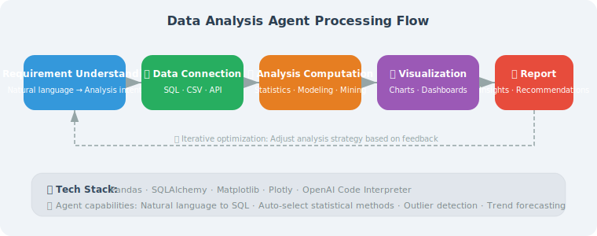

# Requirements Analysis and Architecture Design

> **Section Goal**: Design the overall plan for an intelligent data analysis Agent.

---

## Project Background

Data analysis is a core need for many enterprises, but traditional data analysis requires mastering SQL, Python, statistics, and other skills. We want to build an Agent that lets users complete data analysis using natural language.

**User says**: "Help me analyze last month's sales data, compare growth rates by region"

**Agent does**: Connect to database → Write SQL query → Analyze data → Generate visualization charts → Output report



---

## Core Features

| Feature | Description |
|---------|-------------|
| Natural language queries | Describe analysis requirements in English, automatically converted to SQL |
| Data exploration | Automatically understand table structure and data distribution |
| Statistical analysis | Descriptive statistics, trend analysis, comparative analysis |
| Visualization | Automatically generate charts |
| Report generation | Integrate analysis results into structured reports |

---

## Architecture Design

```python
from dataclasses import dataclass, field
from enum import Enum

class AnalysisType(Enum):
    DESCRIPTIVE = "descriptive"    # Descriptive analysis
    COMPARATIVE = "comparative"    # Comparative analysis
    TREND = "trend"               # Trend analysis
    CORRELATION = "correlation"   # Correlation analysis

@dataclass
class AnalysisRequest:
    """Analysis request"""
    question: str                  # User's natural language question
    analysis_type: AnalysisType = None  # Auto-detected
    target_tables: list[str] = field(default_factory=list)
    time_range: dict = field(default_factory=dict)

@dataclass
class AnalysisResult:
    """Analysis result"""
    summary: str                   # Text summary
    data: dict = field(default_factory=dict)  # Raw data
    sql_query: str = ""            # SQL used
    chart_path: str = ""           # Chart file path
    insights: list[str] = field(default_factory=list)  # Insights
```

---

## Technology Selection

Building a data analysis Agent requires choosing a technology stack across multiple dimensions:

```python
TECH_STACK = {
    "LLM Layer": {
        "Recommended": "GPT-4o",
        "Reason": "Highest SQL generation accuracy, strong code understanding",
        "Alternatives": "GPT-4o-mini (cost-sensitive), Claude 4 (long-context analysis)",
    },
    "Database Connection Layer": {
        "Recommended": "SQLAlchemy",
        "Reason": "Unified interface supporting multiple databases (SQLite, PostgreSQL, MySQL)",
        "Alternatives": "Direct database drivers (sqlite3, psycopg2)",
    },
    "Data Processing Layer": {
        "Recommended": "pandas",
        "Reason": "De facto standard for data cleaning, transformation, and statistical analysis",
        "Alternatives": "polars (better performance for large datasets)",
    },
    "Visualization Layer": {
        "Recommended": "matplotlib + seaborn",
        "Reason": "Comprehensive features, rich documentation, high chart quality",
        "Alternatives": "plotly (interactive charts), pyecharts (Chinese-friendly)",
    },
    "Agent Framework": {
        "Recommended": "LangGraph",
        "Reason": "Stateful analysis flow control, supports human review nodes",
        "Alternatives": "Native OpenAI API (simple scenarios)",
    },
}
```

### Key Dependency Installation

```bash
# Core dependencies for the data analysis Agent
pip install langchain langchain-openai langgraph \
            sqlalchemy pandas matplotlib seaborn \
            tabulate python-dotenv
```

---

## Security Design Considerations

The data analysis Agent interacts directly with databases, making security the **top priority**:

```python
SECURITY_REQUIREMENTS = {
    "SQL Injection Protection": {
        "Measure": "Only allow SELECT statements, prohibit INSERT/UPDATE/DELETE/DROP",
        "Implementation": "Regex whitelist + parameterized queries",
        "Priority": "P0 (mandatory)",
    },
    "Database Least Privilege": {
        "Measure": "Connect to database using a read-only account",
        "Implementation": "Create dedicated readonly user, grant only SELECT permission",
        "Priority": "P0 (mandatory)",
    },
    "Query Resource Limits": {
        "Measure": "Prevent generating resource-intensive queries (full table scans, Cartesian products)",
        "Implementation": "Force LIMIT, set query timeout",
        "Priority": "P1 (important)",
    },
    "Sensitive Data Masking": {
        "Measure": "Avoid sending sensitive data (phone numbers, IDs) to LLM",
        "Implementation": "Automatically detect and mask sensitive fields in query results",
        "Priority": "P1 (important)",
    },
}
```

> ⚠️ **Important reminder**: Never let LLM-generated SQL execute directly. It must go through a security check layer — this is the biggest security difference between a data analysis Agent and a chatbot.

---

## Complete Pipeline Design


The analysis process is divided into six stages, each with clear inputs and outputs (see diagram above).

---

## Agent Core Structure

Below is the skeleton design of `DataAnalysisAgent`. Each method represents an independent stage in the analysis pipeline, which we will implement one by one in subsequent sections. Here we explain the **design rationale** for each method:

```python
class DataAnalysisAgent:
    """Intelligent Data Analysis Agent"""
    
    def __init__(self, llm, db_connection):
        self.llm = llm
        self.db = db_connection
        self.table_schemas = self._load_schemas()
    
    def _load_schemas(self) -> dict:
        """Load database table structure
        
        Design rationale:
        - Query INFORMATION_SCHEMA to get all table names, column names, data types
        - Format table structure as LLM-understandable text (e.g., "users(id INT, name TEXT, ...")
        - Cache results in self.table_schemas to avoid repeated queries per analysis
        - This structure info will serve as context when LLM generates SQL
        """
        schemas = {}
        # Actual implementation in Section 20.2 SafeDatabaseConnector
        return schemas
    
    async def analyze(self, request: AnalysisRequest) -> AnalysisResult:
        """Execute analysis pipeline — six-step pipeline"""
        
        # 1. Understand user intent
        #    Map natural language to AnalysisType (descriptive, comparative, trend, correlation)
        #    Extract time range, target tables, and other key information
        intent = await self._understand_intent(request.question)
        
        # 2. Generate SQL query
        #    Combine table structure + user intent, let LLM generate safe SELECT query
        #    Includes SQL injection protection (only allow SELECT, prohibit DDL/DML)
        sql = await self._generate_sql(request.question, intent)
        
        # 3. Execute query
        #    Execute via parameterized query, return structured data (dict/DataFrame)
        data = self._execute_query(sql)
        
        # 4. Analyze data
        #    Choose different analysis strategies based on analysis type (statistical metrics, growth rate calculation, etc.)
        #    Let LLM extract key insights from data
        insights = await self._analyze_data(data, request.question)
        
        # 5. Generate visualization
        #    Automatically select chart type based on analysis type (bar chart, line chart, scatter plot, etc.)
        #    Generate chart using matplotlib and save
        chart_path = self._create_chart(data, intent)
        
        # 6. Generate summary
        #    Integrate data, insights, and charts into a natural language analysis report
        summary = await self._generate_summary(
            data, insights, request.question
        )
        
        return AnalysisResult(
            summary=summary,
            data=data,
            sql_query=sql,
            chart_path=chart_path,
            insights=insights
        )
```

> **Architecture key point**: The critical design decision of this six-step pipeline is separating "understanding" (steps 1–2) from "execution" (steps 3–6). The understanding phase is LLM-driven, while the execution phase is completed by deterministic code. This hybrid architecture leverages LLM's semantic understanding while ensuring reliability and controllability of data processing. Complete implementations of each method will be progressively introduced in Sections 20.2–20.4.

---

## Summary

This section established the core features and architecture of the data analysis Agent. Next we will implement each module step by step.

---

[Next: 20.2 Data Connection and Querying →](./02_data_connection.md)
