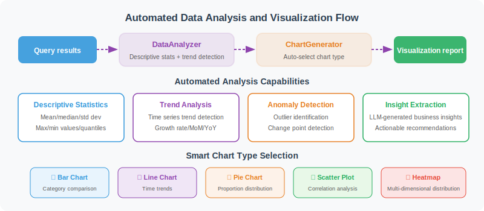

# Automated Analysis and Visualization

> **Section Goal**: Implement automated data analysis and chart generation capabilities.



---

## Automated Data Analysis

```python
import statistics

class DataAnalyzer:
    """Automated data analyzer"""
    
    def describe(self, data: list[dict]) -> dict:
        """Generate descriptive statistics"""
        if not data:
            return {"error": "No data"}
        
        result = {
            "total_rows": len(data),
            "columns": list(data[0].keys()),
            "numeric_stats": {},
        }
        
        for col in data[0].keys():
            values = [row[col] for row in data if row[col] is not None]
            
            # Try to convert to numeric
            try:
                nums = [float(v) for v in values]
                result["numeric_stats"][col] = {
                    "count": len(nums),
                    "mean": round(statistics.mean(nums), 2),
                    "median": round(statistics.median(nums), 2),
                    "min": min(nums),
                    "max": max(nums),
                    "stdev": round(statistics.stdev(nums), 2) if len(nums) > 1 else 0,
                }
            except (ValueError, TypeError):
                # Non-numeric column: count unique values
                unique_count = len(set(str(v) for v in values))
                result[f"column_{col}"] = {
                    "type": "categorical",
                    "unique_values": unique_count,
                    "top_values": self._top_values(values, n=5)
                }
        
        return result
    
    def _top_values(self, values: list, n: int = 5) -> list:
        """Count the most frequent values"""
        from collections import Counter
        counter = Counter(str(v) for v in values)
        return [{"value": k, "count": v} for k, v in counter.most_common(n)]
    
    def find_trends(self, data: list[dict], time_col: str, value_col: str) -> dict:
        """Detect trends"""
        sorted_data = sorted(data, key=lambda x: x[time_col])
        values = [float(row[value_col]) for row in sorted_data]
        
        if len(values) < 2:
            return {"trend": "insufficient_data"}
        
        # Simple linear trend
        n = len(values)
        x_mean = (n - 1) / 2
        y_mean = sum(values) / n
        
        numerator = sum((i - x_mean) * (v - y_mean) for i, v in enumerate(values))
        denominator = sum((i - x_mean) ** 2 for i in range(n))
        
        slope = numerator / denominator if denominator != 0 else 0
        
        # Growth rate
        growth_rate = (values[-1] - values[0]) / values[0] * 100 if values[0] != 0 else 0
        
        return {
            "trend": "upward" if slope > 0 else "downward" if slope < 0 else "stable",
            "slope": round(slope, 4),
            "growth_rate": f"{growth_rate:.1f}%",
            "start_value": values[0],
            "end_value": values[-1]
        }
```

---

## Automatic Visualization

```python
class ChartGenerator:
    """Chart generator (using matplotlib)"""
    
    def __init__(self, output_dir: str = "./charts"):
        import os
        self.output_dir = output_dir
        os.makedirs(output_dir, exist_ok=True)
    
    def auto_chart(
        self,
        data: list[dict],
        title: str,
        chart_type: str = "auto"
    ) -> str:
        """Automatically select the appropriate chart type"""
        import matplotlib
        matplotlib.use('Agg')  # Non-interactive mode
        import matplotlib.pyplot as plt
        
        if not data:
            return ""
        
        cols = list(data[0].keys())
        
        if chart_type == "auto":
            chart_type = self._infer_chart_type(data, cols)
        
        fig, ax = plt.subplots(figsize=(10, 6))
        
        if chart_type == "bar":
            self._draw_bar(ax, data, cols, title)
        elif chart_type == "line":
            self._draw_line(ax, data, cols, title)
        elif chart_type == "pie":
            self._draw_pie(ax, data, cols, title)
        else:
            self._draw_bar(ax, data, cols, title)  # Default bar chart
        
        plt.tight_layout()
        
        # Save chart
        import hashlib
        filename = hashlib.md5(title.encode()).hexdigest()[:8] + ".png"
        filepath = f"{self.output_dir}/{filename}"
        plt.savefig(filepath, dpi=150, bbox_inches='tight')
        plt.close()
        
        return filepath
    
    def _infer_chart_type(self, data: list[dict], cols: list) -> str:
        """Infer the most appropriate chart type"""
        if len(data) <= 6:
            return "pie" if len(cols) == 2 else "bar"
        elif len(data) > 20:
            return "line"
        else:
            return "bar"
    
    def _draw_bar(self, ax, data, cols, title):
        """Draw bar chart"""
        labels = [str(row[cols[0]]) for row in data]
        values = [float(row[cols[1]]) for row in data]
        
        bars = ax.bar(labels, values, color='steelblue')
        ax.set_title(title, fontsize=14)
        ax.set_xlabel(cols[0])
        ax.set_ylabel(cols[1])
        
        # Show values on top of bars
        for bar, val in zip(bars, values):
            ax.text(
                bar.get_x() + bar.get_width()/2, bar.get_height(),
                f'{val:,.0f}', ha='center', va='bottom', fontsize=9
            )
        
        plt.xticks(rotation=45, ha='right')
    
    def _draw_line(self, ax, data, cols, title):
        """Draw line chart"""
        x = [str(row[cols[0]]) for row in data]
        y = [float(row[cols[1]]) for row in data]
        
        ax.plot(x, y, marker='o', color='steelblue', linewidth=2)
        ax.fill_between(range(len(x)), y, alpha=0.1, color='steelblue')
        ax.set_title(title, fontsize=14)
        ax.set_xlabel(cols[0])
        ax.set_ylabel(cols[1])
        plt.xticks(rotation=45, ha='right')
    
    def _draw_pie(self, ax, data, cols, title):
        """Draw pie chart"""
        labels = [str(row[cols[0]]) for row in data]
        values = [float(row[cols[1]]) for row in data]
        
        ax.pie(values, labels=labels, autopct='%1.1f%%', startangle=90)
        ax.set_title(title, fontsize=14)
```

---

## Intelligent Analysis Agent

Let LLM interpret data and generate insights:

```python
class InsightGenerator:
    """Data insight generator"""
    
    def __init__(self, llm):
        self.llm = llm
    
    async def generate_insights(
        self,
        data: list[dict],
        stats: dict,
        question: str
    ) -> list[str]:
        """Generate key insights based on data and statistical results"""
        
        prompt = f"""As a data analyst, generate key insights based on the following data and statistical information.

User question: {question}

Data summary (first 10 rows):
{str(data[:10])}

Statistical information:
{str(stats)}

Please generate 3–5 key insights. Each insight should:
1. Point out an important data feature or trend
2. Support it with specific numbers
3. Provide possible causes or action recommendations

Return only the insight list, one per line, starting with "•".
"""
        
        response = await self.llm.ainvoke(prompt)
        insights = [
            line.strip().lstrip("•").strip()
            for line in response.content.strip().split("\n")
            if line.strip().startswith("•")
        ]
        
        return insights
```

---

## Summary

| Component | Function |
|-----------|---------|
| DataAnalyzer | Descriptive statistics, trend analysis |
| ChartGenerator | Automatically generate bar/line/pie charts |
| InsightGenerator | LLM-driven data insights |

---

[Next: 20.4 Report Generation and Export →](./04_report_generation.md)
