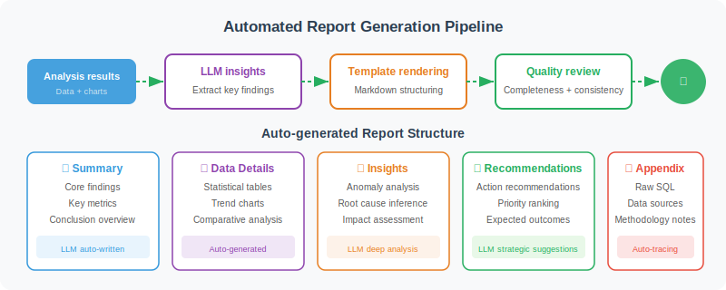

# Report Generation and Export

> **Section Goal**: Automatically integrate analysis results into structured Markdown reports.



---

## Report Generator

```python
from datetime import datetime

class ReportGenerator:
    """Analysis report generator"""
    
    def __init__(self, llm):
        self.llm = llm
    
    async def generate_report(
        self,
        question: str,
        sql_query: str,
        data: list[dict],
        stats: dict,
        insights: list[str],
        chart_path: str = None
    ) -> str:
        """Generate a complete analysis report"""
        
        report = f"""# 📊 Data Analysis Report

> Generated at: {datetime.now().strftime('%Y-%m-%d %H:%M')}

## Analysis Question

{question}

## Query Method

```sql
{sql_query}
```

## Data Overview

- Data volume: {len(data)} records
- Fields involved: {', '.join(data[0].keys()) if data else 'None'}
"""
        
        # Add statistical information
        if stats.get("numeric_stats"):
            report += "\n## Statistical Summary\n\n"
            report += "| Metric | Mean | Median | Min | Max |\n"
            report += "|--------|------|--------|-----|-----|\n"
            
            for col, s in stats["numeric_stats"].items():
                report += (
                    f"| {col} | {s['mean']:,.2f} | {s['median']:,.2f} "
                    f"| {s['min']:,.2f} | {s['max']:,.2f} |\n"
                )
        
        # Add chart
        if chart_path:
            report += f"\n## Visualization\n\n\n"
        
        # Add insights
        if insights:
            report += "\n## Key Insights\n\n"
            for i, insight in enumerate(insights, 1):
                report += f"{i}. {insight}\n"
        
        # Let LLM generate summary and recommendations
        summary = await self._generate_summary(question, insights, stats)
        report += f"\n## Summary and Recommendations\n\n{summary}\n"
        
        return report
    
    async def _generate_summary(
        self, question, insights, stats
    ) -> str:
        """LLM generates summary"""
        prompt = f"""Based on the following analysis results, write a concise summary and action recommendations.

Analysis question: {question}
Key insights: {insights}
Statistical information: {str(stats)[:500]}

Requirements: 2–3 paragraphs, including core findings and specific actionable recommendations."""
        
        response = await self.llm.ainvoke(prompt)
        return response.content
    
    def save_report(self, report: str, filename: str = None) -> str:
        """Save report to file"""
        if not filename:
            timestamp = datetime.now().strftime('%Y%m%d_%H%M%S')
            filename = f"report_{timestamp}.md"
        
        with open(filename, 'w', encoding='utf-8') as f:
            f.write(report)
        
        return filename
```

---

## Multi-Format Export

In addition to Markdown, production environments typically need to support multiple export formats:

```python
import json
from pathlib import Path

class MultiFormatExporter:
    """Report exporter supporting multiple formats"""
    
    def export(self, report: str, data: list[dict], format: str, filename: str = None) -> str:
        """Export report in the specified format"""
        exporters = {
            "markdown": self._export_markdown,
            "html": self._export_html,
            "json": self._export_json,
            "csv": self._export_csv,
        }
        
        exporter = exporters.get(format)
        if not exporter:
            raise ValueError(f"Unsupported format: {format}, options: {list(exporters.keys())}")
        
        return exporter(report, data, filename)
    
    def _export_markdown(self, report: str, data: list[dict], filename: str = None) -> str:
        filename = filename or f"report_{self._timestamp()}.md"
        Path(filename).write_text(report, encoding="utf-8")
        return filename
    
    def _export_html(self, report: str, data: list[dict], filename: str = None) -> str:
        """Convert Markdown report to HTML"""
        filename = filename or f"report_{self._timestamp()}.html"
        
        html_content = f"""<!DOCTYPE html>
<html lang="en">
<head>
    <meta charset="UTF-8">
    <title>Data Analysis Report</title>
    <style>
        body {{ font-family: -apple-system, sans-serif; max-width: 900px; margin: 0 auto; padding: 40px; }}
        table {{ border-collapse: collapse; width: 100%; margin: 16px 0; }}
        th, td {{ border: 1px solid #ddd; padding: 10px; text-align: left; }}
        th {{ background: #f5f5f5; font-weight: 600; }}
        code {{ background: #f0f0f0; padding: 2px 6px; border-radius: 4px; }}
        pre {{ background: #1e1e1e; color: #d4d4d4; padding: 16px; border-radius: 8px; overflow-x: auto; }}
        img {{ max-width: 100%; border-radius: 8px; }}
        blockquote {{ border-left: 4px solid #3498db; margin: 0; padding: 8px 16px; background: #f8f9fa; }}
    </style>
</head>
<body>
{self._md_to_html(report)}
</body>
</html>"""
        
        Path(filename).write_text(html_content, encoding="utf-8")
        return filename
    
    def _export_json(self, report: str, data: list[dict], filename: str = None) -> str:
        """Export structured JSON data"""
        filename = filename or f"report_{self._timestamp()}.json"
        
        output = {
            "report_text": report,
            "data": data,
            "generated_at": self._timestamp(),
        }
        
        Path(filename).write_text(
            json.dumps(output, ensure_ascii=False, indent=2),
            encoding="utf-8"
        )
        return filename
    
    def _export_csv(self, report: str, data: list[dict], filename: str = None) -> str:
        """Export data as CSV"""
        import csv
        
        filename = filename or f"data_{self._timestamp()}.csv"
        
        if not data:
            Path(filename).write_text("", encoding="utf-8")
            return filename
        
        with open(filename, "w", newline="", encoding="utf-8-sig") as f:
            writer = csv.DictWriter(f, fieldnames=data[0].keys())
            writer.writeheader()
            writer.writerows(data)
        
        return filename
    
    def _timestamp(self) -> str:
        return datetime.now().strftime('%Y%m%d_%H%M%S')
    
    def _md_to_html(self, md: str) -> str:
        """Simple Markdown → HTML conversion"""
        try:
            import markdown
            return markdown.markdown(md, extensions=["tables", "fenced_code"])
        except ImportError:
            # If markdown library is not installed, return original text wrapped in <pre>
            return f"<pre>{md}</pre>"
```

---

## Scheduled Reports and Automation

In production environments, data analysis reports typically need to be generated on a schedule and sent automatically:

```python
import asyncio
from datetime import datetime

class ScheduledReporter:
    """Scheduled report generator"""
    
    def __init__(self, agent, report_gen, exporter):
        self.agent = agent
        self.report_gen = report_gen
        self.exporter = exporter
        self.schedules = []
    
    def add_schedule(self, name: str, question: str, cron: str, recipients: list[str]):
        """Add a scheduled report task
        
        Example: add_schedule(
            name="Daily Sales Report",
            question="Show today's sales amount and order count by region",
            cron="0 18 * * *",  # Every day at 6pm
            recipients=["manager@company.com"]
        )
        """
        self.schedules.append({
            "name": name,
            "question": question,
            "cron": cron,
            "recipients": recipients,
        })
    
    async def run_report(self, schedule: dict) -> str:
        """Execute one report generation"""
        print(f"📊 Generating report: {schedule['name']}")
        
        # 1. Use Agent to execute analysis
        result = await self.agent.analyze(schedule["question"])
        
        # 2. Generate report
        report = await self.report_gen.generate_report(
            question=schedule["question"],
            sql_query=result.sql_query,
            data=result.data,
            stats=result.stats,
            insights=result.insights,
            chart_path=result.chart_path,
        )
        
        # 3. Export as HTML
        html_path = self.exporter.export(report, result.data, "html")
        
        print(f"✅ Report generated: {html_path}")
        return html_path
```

---

## Usage Example

```python
async def generate_sales_report():
    """Complete flow for generating a sales analysis report"""
    from langchain_openai import ChatOpenAI
    
    llm = ChatOpenAI(model="gpt-4o", temperature=0)
    
    # Sample data
    data = [
        {"region": "East", "sales": 1250000, "growth": 12.5},
        {"region": "North", "sales": 980000, "growth": 8.3},
        {"region": "South", "sales": 1100000, "growth": 15.2},
        {"region": "West", "sales": 650000, "growth": 22.1},
    ]
    
    # 1. Analyze
    analyzer = DataAnalyzer()
    stats = analyzer.describe(data)
    
    # 2. Visualize
    chart_gen = ChartGenerator()
    chart_path = chart_gen.auto_chart(data, "Sales Comparison by Region")
    
    # 3. Generate insights
    insight_gen = InsightGenerator(llm)
    insights = await insight_gen.generate_insights(
        data, stats, "Analyze regional sales performance"
    )
    
    # 4. Generate report
    report_gen = ReportGenerator(llm)
    report = await report_gen.generate_report(
        question="Analyze regional sales performance and growth trends",
        sql_query="SELECT region, sales, growth FROM sales_summary",
        data=data,
        stats=stats,
        insights=insights,
        chart_path=chart_path
    )
    
    # 5. Save
    filepath = report_gen.save_report(report)
    print(f"📄 Report saved to: {filepath}")
```

---

## Summary

| Feature | Description |
|---------|-------------|
| Report template | Markdown format, includes statistics, charts, insights |
| LLM summary | Automatically generate core findings and action recommendations |
| File export | Save as .md file |

---

[Next: 20.5 Full Project Implementation →](./05_full_implementation.md)
