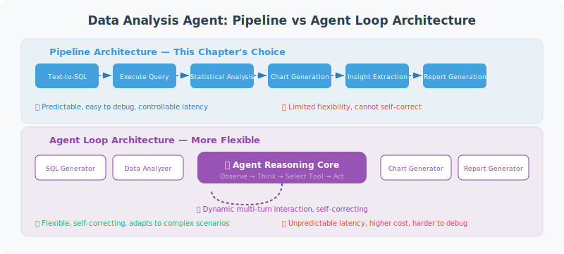

# Full Project Implementation

> **Section Goal**: Integrate all components to build a complete intelligent data analysis Agent, with in-depth analysis of architectural decisions and production considerations.



---

## Architecture Design Philosophy

Before integrating the components from previous sections into a complete system, let's analyze the key design decisions at the architectural level.

### Pipeline Architecture vs Agent Loop Architecture

A data analysis Agent can adopt two fundamentally different architectures:

**Pipeline Architecture** — the choice for this chapter:

```
User question → Text-to-SQL → Execute query → Statistical analysis → Chart generation → Insight extraction → Report generation
```

Each step executes in a fixed order, with the output of the previous step as the input to the next. Advantages: clear process, strong debuggability, predictable latency; Disadvantages: lacks flexibility, cannot dynamically adjust strategy based on intermediate results.

**Agent Loop Architecture (ReAct Loop)**:

```
User question → Think → Select tool → Execute → Observe result → Think → ... → Final answer
```

The LLM autonomously decides which tools to call and how many times, and can follow up or adjust direction based on intermediate results. Advantages: flexible and intelligent; Disadvantages: uncontrollable latency, difficult to debug, higher cost.

Reasons for choosing pipeline architecture in this chapter:

| Consideration | Pipeline | Agent Loop |
|--------------|---------|-----------|
| Execution steps | Fixed 6 steps | Uncertain (3–15 steps) |
| LLM calls | 3 (Text-to-SQL + insights + report) | 5–10+ |
| Cost per request | ~$0.05 | ~$0.15–0.50 |
| Debuggability | Each step output can be inspected | Requires complete trace |
| Applicable scenarios | Standard data analysis workflows | Open-ended exploratory analysis |

> 💡 **Practical advice**: If your scenario requires the Agent to explore autonomously (e.g., "help me find anomalies in the data"), consider combining Chapter 12 LangGraph to build an Agent loop version. Pipeline architecture is better suited for scenarios with clear processes.

### Component Interaction Sequence

The complete request processing flow is as follows:

```
User              SmartDataAnalyst       TextToSQL       SafeDB        Analyzer/Chart/Insight/Report
 │                       │                    │              │                    │
 │──── "question" ──────→│                    │              │                    │
 │                       │──── convert() ────→│              │                    │
 │                       │                    │── get_schemas()→│                 │
 │                       │                    │←── schemas ───│                   │
 │                       │                    │── LLM generates SQL               │
 │                       │←──── SQL ──────────│              │                    │
 │                       │──── execute_readonly(sql) ───────→│                    │
 │                       │←──── data[] ──────────────────────│                    │
 │                       │──────────── describe(data) ──────────────────────────→│
 │                       │──────────── auto_chart(data) ───────────────────────→│
 │                       │──────────── generate_insights(data, stats) ─────────→│
 │                       │──────────── generate_report(all) ──────────────────→│
 │←──── complete report ──│                    │              │                    │
```

Key design points:

1. **Schema pre-loading**: `TextToSQL` caches table structure at initialization, avoiding reading database metadata on every query
2. **Analysis and visualization in parallel**: `describe()` and `auto_chart()` can theoretically run in parallel (currently sequential, can be optimized)
3. **Insights depend on statistical results**: `generate_insights()` needs statistical results as input, helping LLM generate analysis based on data rather than guessing

---

## Complete Implementation

```python
"""
Intelligent Data Analysis Agent — Complete Implementation
Complete workflow for data analysis using natural language
"""
import asyncio
from langchain_openai import ChatOpenAI

# Import components implemented in previous sections
# Full implementations of each component are in the corresponding sections:
# from db_connector import SafeDatabaseConnector   # → Section 20.2
# from text_to_sql import TextToSQL                # → Section 20.2
# from data_analyzer import DataAnalyzer           # → Section 20.3
# from chart_generator import ChartGenerator       # → Section 20.3
# from insight_generator import InsightGenerator   # → Section 20.3
# from report_generator import ReportGenerator     # → Section 20.4
# Note: Before running this section's code, save sections 20.2–20.4 code as independent modules


class SmartDataAnalyst:
    """Intelligent Data Analysis Agent"""
    
    def __init__(self, db_path: str):
        self.llm = ChatOpenAI(model="gpt-4o", temperature=0)
        self.db = SafeDatabaseConnector(db_path)
        self.text2sql = TextToSQL(self.llm, self.db)
        self.analyzer = DataAnalyzer()
        self.chart_gen = ChartGenerator()
        self.insight_gen = InsightGenerator(self.llm)
        self.report_gen = ReportGenerator(self.llm)
    
    async def ask(self, question: str) -> str:
        """Ask a question in natural language, get a complete analysis"""
        
        print(f"🤔 Understanding question: {question}")
        
        # 1. Natural language → SQL
        print("📝 Generating query...")
        sql = await self.text2sql.convert(question)
        print(f"   SQL: {sql}")
        
        # 2. Execute query
        print("🔍 Querying data...")
        try:
            data = self.db.execute_readonly(sql)
        except Exception as e:
            return f"❌ Query error: {e}"
        
        if not data:
            return "📭 Query returned no results, please try rephrasing."
        
        print(f"   Got {len(data)} records")
        
        # 3. Statistical analysis
        print("📊 Analyzing data...")
        stats = self.analyzer.describe(data)
        
        # 4. Generate chart
        print("🎨 Generating chart...")
        chart_path = self.chart_gen.auto_chart(data, question)
        
        # 5. Generate insights
        print("💡 Extracting insights...")
        insights = await self.insight_gen.generate_insights(
            data, stats, question
        )
        
        # 6. Generate report
        print("📄 Generating report...")
        report = await self.report_gen.generate_report(
            question=question,
            sql_query=sql,
            data=data,
            stats=stats,
            insights=insights,
            chart_path=chart_path
        )
        
        # Save report
        filepath = self.report_gen.save_report(report)
        print(f"✅ Report saved: {filepath}")
        
        return report


async def main():
    """Interactive data analysis"""
    import sys
    
    db_path = sys.argv[1] if len(sys.argv) > 1 else "example.db"
    
    print("📊 Intelligent Data Analysis Assistant")
    print("=" * 40)
    print("Describe your analysis requirements in natural language")
    print("Type 'quit' to exit\n")
    
    analyst = SmartDataAnalyst(db_path)
    
    # Show available tables
    schemas = analyst.db.get_table_schemas()
    print(f"📁 Database has {len(schemas)} tables:")
    for table, info in schemas.items():
        cols = [c['name'] for c in info['columns']]
        print(f"   • {table}: {', '.join(cols)}")
    print()
    
    while True:
        question = input("Your question: ").strip()
        
        if question.lower() in ('quit', 'exit', 'q'):
            print("👋 Goodbye!")
            break
        
        if not question:
            continue
        
        result = await analyst.ask(question)
        print(f"\n{result}\n")


if __name__ == "__main__":
    asyncio.run(main())
```

---

## Usage Output

```
📊 Intelligent Data Analysis Assistant
========================================
📁 Database has 3 tables:
   • orders: id, customer_id, product, amount, date, region
   • customers: id, name, email, city, register_date
   • products: id, name, category, price

Your question: Which region has the highest order amount? Sort by region
🤔 Understanding question: Which region has the highest order amount? Sort by region
📝 Generating query...
   SQL: SELECT region, SUM(amount) as total FROM orders GROUP BY region ORDER BY total DESC
🔍 Querying data...
   Got 4 records
📊 Analyzing data...
🎨 Generating chart...
💡 Extracting insights...
📄 Generating report...
✅ Report saved: report_20260312_140000.md
```

---

## Error Handling and Graceful Degradation

In production environments, every step of the data analysis Agent can fail. A robust system needs "graceful degradation" — even if some features fail, it can still provide valuable responses.

### Layered Error Handling

```python
class ResilientDataAnalyst(SmartDataAnalyst):
    """Data analysis Agent with degradation capability"""
    
    async def ask(self, question: str) -> str:
        """Each step has independent try-except, degrades rather than aborts on failure"""
        
        # Step 1: Text-to-SQL (abort on failure, cannot continue)
        try:
            sql = await self.text2sql.convert(question)
        except Exception as e:
            return f"❌ Unable to understand your question, please try rephrasing.\nTechnical details: {e}"
        
        # Step 2: Execute query (try self-correction on failure)
        data = None
        for attempt in range(3):
            try:
                data = self.db.execute_readonly(sql)
                break
            except Exception as e:
                if attempt < 2:
                    # Let LLM correct SQL based on error
                    sql = await self._fix_sql(sql, str(e))
                else:
                    return f"❌ Query failed multiple times: {e}\nGenerated SQL: {sql}"
        
        if not data:
            return "📭 Query returned no results, please try rephrasing."
        
        # Step 3: Statistical analysis (skip on failure)
        stats = None
        try:
            stats = self.analyzer.describe(data)
        except Exception:
            stats = {"error": "Statistical analysis skipped"}
        
        # Step 4: Chart generation (skip on failure, doesn't affect report)
        chart_path = None
        try:
            chart_path = self.chart_gen.auto_chart(data, question)
        except Exception:
            chart_path = None  # Report will not include chart
        
        # Step 5: Insight generation (use default text on failure)
        try:
            insights = await self.insight_gen.generate_insights(
                data, stats, question
            )
        except Exception:
            insights = "(Insight generation temporarily unavailable, raw data summary below)"
        
        # Step 6: Report generation (return raw data on failure)
        try:
            report = await self.report_gen.generate_report(
                question=question, sql_query=sql, data=data,
                stats=stats, insights=insights, chart_path=chart_path
            )
        except Exception:
            # Minimum degraded output
            report = f"## Query Results\n\nSQL: `{sql}`\n\nData (first 5 rows):\n"
            for row in data[:5]:
                report += f"- {row}\n"
        
        return report
```

### Degradation Level Overview

| Failed Step | Degradation Strategy | User Experience |
|------------|---------------------|----------------|
| Text-to-SQL | Abort and prompt | Ask user to rephrase |
| SQL execution | Self-correction, up to 3 times | Transparent retry, invisible to user |
| Statistical analysis | Skip | No statistical summary in report |
| Chart generation | Skip | No chart in report |
| Insight generation | Use default text | No AI insights in report |
| Report generation | Return raw data | Reduced readability but data available |

---

## Performance Optimization Tips

When the data analysis Agent serves multiple users, performance optimization is critical:

### 1. Schema Caching and Incremental Updates

```python
import time

class CachedSchemaManager:
    """Schema manager with TTL cache"""
    
    def __init__(self, db: SafeDatabaseConnector, ttl_seconds: int = 300):
        self.db = db
        self.ttl = ttl_seconds
        self._cache = None
        self._cache_time = 0
    
    def get_schemas(self) -> dict:
        now = time.time()
        if self._cache is None or (now - self._cache_time) > self.ttl:
            self._cache = self.db.get_table_schemas()
            self._cache_time = now
        return self._cache
```

### 2. LLM Call Optimization

```python
# Before optimization: 3 sequential LLM calls
sql = await text2sql.convert(question)       # ~2s
insights = await insight_gen.generate(...)    # ~3s
report = await report_gen.generate(...)       # ~3s
# Total: ~8s

# After optimization: insights and report outline generated in parallel
import asyncio
insights, report_outline = await asyncio.gather(
    insight_gen.generate(data, stats, question),
    report_gen.generate_outline(question, stats)  
)
# Saves ~2–3s
```

### 3. Query Result Caching

For repeated or similar queries, cache SQL and results:

```python
from functools import lru_cache
import hashlib

class QueryCache:
    """Simple query result cache"""
    
    def __init__(self, max_size: int = 100):
        self._cache: dict[str, tuple[float, list]] = {}
        self.max_size = max_size
        self.ttl = 600  # 10 minutes expiry
    
    def get(self, sql: str) -> list[dict] | None:
        key = hashlib.md5(sql.encode()).hexdigest()
        if key in self._cache:
            cached_time, results = self._cache[key]
            if time.time() - cached_time < self.ttl:
                return results
            del self._cache[key]
        return None
    
    def set(self, sql: str, results: list[dict]):
        if len(self._cache) >= self.max_size:
            # Evict the oldest cache entry
            oldest = min(self._cache, key=lambda k: self._cache[k][0])
            del self._cache[oldest]
        key = hashlib.md5(sql.encode()).hexdigest()
        self._cache[key] = (time.time(), results)
```

---

## Extension Directions

This chapter implements a basic version of the data analysis Agent. Here are advanced directions worth exploring:

### Direction 1: Multi-Turn Conversational Analysis

The current system treats each Q&A independently; users cannot follow up with "break it down by month" or "show only the East region". Introduce conversation context management:

```python
class ConversationalAnalyst:
    """Data analysis Agent supporting multi-turn conversations"""
    
    def __init__(self, base_analyst: SmartDataAnalyst):
        self.analyst = base_analyst
        self.history: list[dict] = []
    
    async def ask(self, question: str) -> str:
        # Inject conversation history into Prompt to help LLM understand context
        context = "\n".join(
            f"User: {h['question']}\nSQL: {h['sql']}" 
            for h in self.history[-3:]  # Keep last 3 turns
        )
        
        enhanced_question = f"Conversation history:\n{context}\n\nCurrent question: {question}"
        result = await self.analyst.ask(enhanced_question)
        
        self.history.append({"question": question, "sql": "...", "result": result})
        return result
```

### Direction 2: Automatic Anomaly Detection

Let the Agent not only answer questions but also proactively discover data anomalies:

- Detect outliers in numeric columns (Z-score > 3)
- Find sudden changes in time series
- Flag data that doesn't conform to business rules (e.g., negative order amounts)

### Direction 3: Integration with Visualization Frontend

Combine the Agent backend with a frontend dashboard (like Streamlit, Gradio) for an interactive experience:

- Natural language Q&A + real-time chart rendering
- Drag-and-drop data exploration
- One-click PDF report export

### Direction 4: Multi-Agent Collaborative Analysis

For complex analysis tasks (e.g., "compare sales trends across three quarters and provide marketing recommendations"), split the task among multiple specialized Agents:

- **Data Query Agent**: Responsible for Text-to-SQL and data retrieval
- **Statistical Analysis Agent**: Responsible for trend detection, regression analysis
- **Report Writing Agent**: Responsible for integrating all results into a report

This can be implemented using the Multi-Agent architecture introduced in Chapter 14.

---

## Summary

| Step | Component | Description |
|------|-----------|-------------|
| Understand | TextToSQL | Natural language → SQL |
| Query | SafeDB | Safely execute read-only queries |
| Analyze | DataAnalyzer | Statistical analysis |
| Visualize | ChartGenerator | Automatic charts |
| Insights | InsightGenerator | LLM-generated insights |
| Report | ReportGenerator | Complete analysis report |

> 🎓 **Chapter Summary**: We built a complete Agent for "data analysis with natural language." From Text-to-SQL to automatic visualization, this demonstrates the powerful application of Agents in data analysis.

---

[Next Chapter: Chapter 21 Project Practice: Multimodal Agent →](../chapter_multimodal/README.md)
