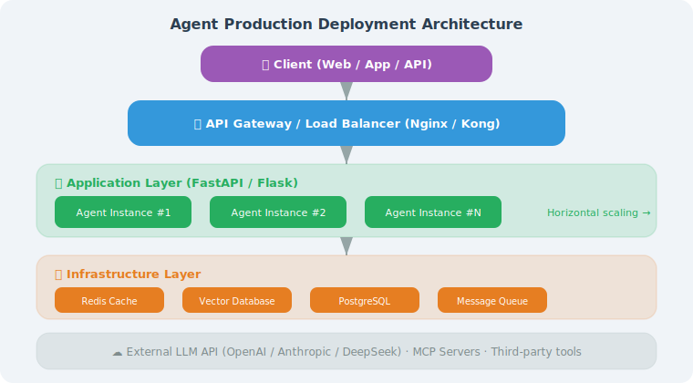

# Agent Application Deployment Architecture

> **Section Goal**: Understand what architectural changes are needed when moving an Agent from development to production, and master the unique deployment challenges and solutions for Agents.

---

## Unique Challenges of Agent Deployment

Deploying an Agent application is fundamentally different from deploying a traditional web service. Traditional API request processing typically takes milliseconds and is predictable; Agent request processing is more like "executing a mini-program" — with uncertain time, uncertain steps, and uncertain resource consumption.

### Five Unique Challenges

**Challenge 1: Unpredictable Execution Time**

A simple Q&A might complete in 2 seconds, while a request involving multi-step reasoning + tool calls may take 30 seconds or even minutes. This makes traditional request timeout settings and load balancing strategies no longer applicable.

```python
# Traditional API: predictable execution time
@app.get("/users/{id}")
async def get_user(id: int):  # Latency: ~50ms, std dev ~10ms
    return db.get_user(id)

# Agent API: unpredictable execution time
@app.post("/agent/chat")
async def agent_chat(msg: str):  # Latency: 2s-120s, std dev ~30s
    return await agent.process(msg)
```

**Challenge 2: Side Effects of Tool Calls**

Agents don't just "answer questions" — they may send emails, write files, call external APIs, and execute code. This means retrying a failed request may cause side effects to execute repeatedly (e.g., sending duplicate emails).

**Challenge 3: State Management for Long Contexts**

Agent conversations may span dozens of turns, carrying tens of thousands of tokens of context. This state needs to be shared across multiple service instances and must not be lost.

**Challenge 4: Uncontrolled Costs**

A complex request may trigger multiple LLM calls (reasoning + tool selection + result summarization), with per-request costs ranging from $0.01 to $1.00. Without limits, a malicious user can quickly exhaust the budget.

**Challenge 5: Observability Difficulties**

Traditional service logs are linear (request → processing → response), while Agent execution is tree-shaped or graph-shaped (reasoning → tool A → sub-reasoning → tool B → backtrack → tool C → final reply). Standard logging and monitoring tools struggle to capture this complex execution path.

---

## Comparison of Three Architecture Patterns

Depending on team size, traffic requirements, and cost budget, Agent application deployment can choose from three architecture patterns:

### Pattern 1: Monolithic Architecture

All components (API, Agent logic, tools, storage) run in the same process.

```
[Nginx] → [FastAPI + Agent + Tools + DB]
```

**Use cases**: Personal projects, prototype validation, < 100 QPS

**Pros**: Simple development, easy deployment, easy debugging

**Cons**: Cannot scale components independently, single point of failure

### Pattern 2: Microservices Architecture

Split the Agent into multiple independent services communicating via message queues or RPC.

```
[API Gateway] → [API Service] → [Agent Service] → [Tool Service]
                      ↓                ↓                ↓
                  [Redis]         [Vector DB]      [External APIs]
```

**Use cases**: Team collaboration, 100–10,000 QPS, need independent scaling

**Pros**: Independent deployment and scaling of components, fault isolation, parallel team development

**Cons**: High operational complexity, increased network latency, requires distributed tracing

### Pattern 3: Serverless Architecture

Use cloud functions (AWS Lambda, Cloudflare Workers) for on-demand execution without managing servers.

```
[API Gateway] → [Lambda: API Handler] → [Lambda: Agent Logic] → [Managed Services]
```

**Use cases**: High traffic fluctuation, pay-per-use, < 1,000 QPS

**Pros**: Zero operations, auto-scaling, pay per actual invocation

**Cons**: Cold start latency (1–5s), execution time limits (usually 15 minutes), difficult debugging

### Quantitative Comparison of Three Patterns

| Dimension | Monolithic | Microservices | Serverless |
|-----------|-----------|---------------|------------|
| Operational complexity | ⭐ | ⭐⭐⭐⭐ | ⭐⭐ |
| Scalability | Vertical | Horizontal + Vertical | Automatic |
| Cold start latency | None | None | 1–5s |
| Max request duration | Unlimited | Unlimited | 15min |
| Monthly cost (low traffic) | ~$20 | ~$100+ | ~$5 |
| Monthly cost (high traffic) | ~$200 | ~$500+ | ~$300 |
| Suitable stage | MVP/Prototype | Growth phase | Exploration/Variable traffic |

> 💡 **Recommended path**: Most Agent projects should start with **monolithic architecture**, then migrate to microservices after validating product value. Premature architectural decomposition is a common over-engineering trap.

---

## Agent Observability Requirements

The traditional "request logs + error rate + response time" trio is far from sufficient for Agent applications. You also need to track:

| Observation Dimension | Traditional API | Agent Application |
|----------------------|----------------|-------------------|
| Request chain | Single layer | Multi-layer nested (reasoning → tool → sub-reasoning) |
| Token usage | None | Input/output tokens per LLM call |
| Tool call records | None | Which tools were called, parameters, results |
| Reasoning quality | None | Whether Agent correctly understood user intent |
| Cost tracking | Fixed | Dynamic cost per request |

Recommended observability tool stack:

- **LangSmith**: LangChain's official Agent tracing platform, visualizes complete reasoning chains
- **Phoenix (Arize)**: Open-source LLM observability tool, supports Trace and Evaluation
- **OpenTelemetry + Custom Spans**: Embed tracing points in each Agent step

```python
from opentelemetry import trace

tracer = trace.get_tracer("agent-service")

async def agent_process(question: str):
    with tracer.start_as_current_span("agent.process") as span:
        span.set_attribute("user.question", question)
        
        with tracer.start_as_current_span("agent.text_to_sql"):
            sql = await text2sql.convert(question)
            span.set_attribute("generated.sql", sql)
        
        with tracer.start_as_current_span("agent.execute_query"):
            data = db.execute_readonly(sql)
            span.set_attribute("result.row_count", len(data))
        
        # ... subsequent steps
```

---

## Development Environment vs. Production Environment



During development, you might run a Python script directly in the terminal. But to serve real users, more considerations are needed:

| Dimension | Development Environment | Production Environment |
|-----------|------------------------|----------------------|
| Concurrency | Single user | Hundreds/thousands concurrent |
| Availability | Can restart anytime | 24/7 uninterrupted operation |
| Error handling | print to see logs | Structured logs + alerts |
| State management | In-memory dictionary | Redis / database |
| Key management | .env file | Secret management service |
| Monitoring | Manual observation | Prometheus + Grafana |

---

## Typical Production Deployment Architecture

<!-- Architecture diagram in SVG above -->

### Core Component Description

```python
from dataclasses import dataclass

@dataclass
class ProductionArchitecture:
    """Description of each layer in the production architecture"""
    
    layers = {
        "Load Balancer": {
            "Tools": "Nginx / AWS ALB / Cloudflare",
            "Responsibilities": [
                "SSL/TLS encryption termination",
                "Request distribution to multiple API instances",
                "Rate limiting and DDoS protection",
                "Health checks (automatically remove failed instances)"
            ]
        },
        "API Service": {
            "Tools": "FastAPI / Flask",
            "Responsibilities": [
                "Receive and validate user requests",
                "API Key / JWT authentication",
                "Session management (read/write from Redis)",
                "Request logging",
                "Streaming responses (SSE)"
            ]
        },
        "Agent Core": {
            "Tools": "LangChain / LangGraph / Custom",
            "Responsibilities": [
                "Understand user intent",
                "Call LLM for reasoning",
                "Execute tool calls",
                "Manage conversation context"
            ]
        },
        "Storage Layer": {
            "Redis": "Session state, cache, rate limit counters",
            "Vector DB": "Long-term memory, knowledge base retrieval",
            "Relational DB": "User info, usage records, audit logs"
        }
    }
```

---

## State Management: From Memory to Redis

During development you use in-memory dictionaries for conversations; in production use Redis:

```python
import json
from datetime import datetime

class RedisSessionManager:
    """Redis-based session management (production-grade)"""
    
    def __init__(self, redis_client, ttl: int = 3600):
        self.redis = redis_client
        self.ttl = ttl  # Session expiration time (seconds)
    
    def get_history(self, session_id: str) -> list[dict]:
        """Get conversation history"""
        key = f"session:{session_id}:messages"
        data = self.redis.get(key)
        
        if data:
            return json.loads(data)
        return []
    
    def add_message(
        self, session_id: str, role: str, content: str
    ):
        """Add message to session"""
        key = f"session:{session_id}:messages"
        history = self.get_history(session_id)
        
        history.append({
            "role": role,
            "content": content,
            "timestamp": datetime.now().isoformat()
        })
        
        # Keep only recent messages to avoid unlimited growth
        if len(history) > 50:
            history = history[-50:]
        
        self.redis.set(key, json.dumps(history, ensure_ascii=False))
        self.redis.expire(key, self.ttl)
    
    def clear_session(self, session_id: str):
        """Clear session"""
        self.redis.delete(f"session:{session_id}:messages")
```

---

## Configuration Management

Production environment configuration needs to be more standardized:

```python
from pydantic_settings import BaseSettings

class AgentConfig(BaseSettings):
    """Agent production configuration (loaded from environment variables)"""
    
    # API configuration
    openai_api_key: str
    openai_model: str = "gpt-4o"
    
    # Service configuration
    host: str = "0.0.0.0"
    port: int = 8000
    workers: int = 4
    
    # Redis configuration
    redis_url: str = "redis://localhost:6379"
    session_ttl: int = 3600
    
    # Rate limiting configuration
    rate_limit_per_minute: int = 60
    
    # Security configuration
    api_key_header: str = "X-API-Key"
    cors_origins: list[str] = ["*"]
    
    # Agent configuration
    max_steps: int = 10
    max_tokens: int = 4096
    temperature: float = 0.7
    
    class Config:
        env_file = ".env"
        env_prefix = "AGENT_"  # All environment variables prefixed with AGENT_

# Usage:
# Environment variable AGENT_OPENAI_API_KEY=sk-xxx is automatically loaded
# config = AgentConfig()
```

---

## Summary

| Concept | Description |
|---------|-------------|
| Layered Architecture | Load balancer → API service → Agent core → Storage |
| External State | Use Redis instead of in-memory dictionaries for session management |
| Configuration Management | Load config from environment variables, no hardcoding |
| Horizontal Scaling | Multi-instance deployment, stateless API layer |

> **Next Section Preview**: Next we'll use FastAPI to wrap the Agent into a complete API service.

---

[Next: 18.2 API Service Wrapping: FastAPI / Flask →](./02_api_service.md)
